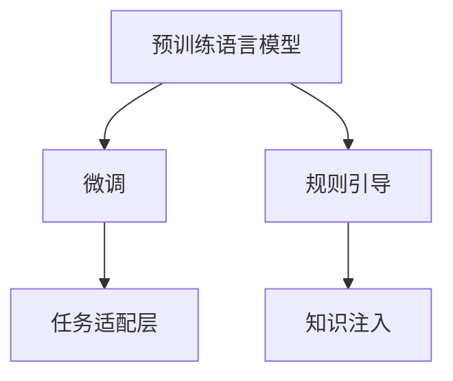
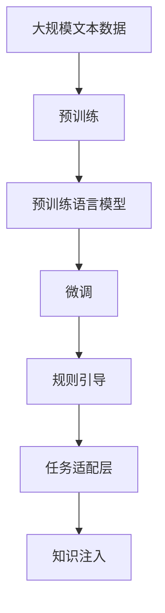
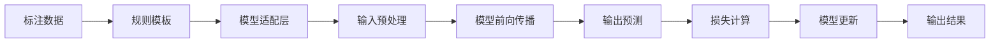
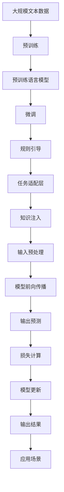

                 

## 1. 背景介绍

### 1.1 问题由来
随着人工智能（AI）技术的不断发展，自然语言处理（NLP）已成为AI领域的一个重要分支。近年来，基于神经网络的语言模型在诸多NLP任务中取得了突破性进展，如BERT、GPT-3等大模型。然而，大模型往往需要海量标注数据进行微调，导致标注成本高、训练时间长。为解决这个问题，研究人员提出了基于规则和引导（Rule-based and Guided，简称RAG）的微调方法，通过在预训练大模型的基础上引入规则和引导，大幅降低微调对标注数据的需求，提升模型的性能和泛化能力。

### 1.2 问题核心关键点
RAG方法的核心思想是，在大模型的基础上，通过引入预定义的规则和引导，引导模型向特定任务进行微调。这一方法的主要特点包括：
1. **规则引导**：通过设计符合特定任务需求的规则，如标注模板、任务描述等，引导模型进行微调。
2. **任务适配层**：在大模型的顶层设计符合特定任务需求的输出层和损失函数，使得模型能够适应不同的任务类型。
3. **知识注入**：通过在输入中添加特定任务的知识，如任务描述、上下文信息等，帮助模型更好地理解任务需求。

这些特点使得RAG方法在大规模、低成本、高效率的NLP任务微调中具有重要意义。

### 1.3 问题研究意义
RAG方法的应用，可以大幅降低NLP任务的微调成本，提升模型在特定任务上的表现，加速NLP技术的产业化进程。具体而言，RAG方法：
1. **降低标注成本**：利用规则和引导，减少对标注数据的需求，降低微调成本。
2. **提升模型性能**：通过规则和引导，使得模型在特定任务上表现更好，提升NLP任务的精度和效率。
3. **加速技术落地**：简化微调过程，使得NLP技术更容易在各行各业中应用。
4. **带来技术创新**：推动NLP领域在提示学习、少样本学习等前沿研究方面的进展。

## 2. 核心概念与联系

### 2.1 核心概念概述

为了更好地理解RAG方法，本节将介绍几个关键概念及其相互关系：

- **预训练语言模型**：以BERT、GPT等模型为代表的深度学习模型，通过在大规模无标签文本数据上进行预训练，学习到通用的语言表示。
- **微调**：在预训练模型的基础上，使用特定任务的少量标注数据，通过有监督学习优化模型在特定任务上的性能。
- **规则引导**：通过预定义的规则和引导，如标注模板、任务描述等，引导模型向特定任务进行微调。
- **任务适配层**：在大模型的顶层设计符合特定任务需求的输出层和损失函数，使得模型能够适应不同的任务类型。
- **知识注入**：通过在输入中添加特定任务的知识，如任务描述、上下文信息等，帮助模型更好地理解任务需求。

这些核心概念之间通过以下Mermaid流程图展示了它们的关系：



### 2.2 概念间的关系

这些核心概念之间存在紧密的联系，共同构成了RAG方法的完整生态系统。以下通过几个Mermaid流程图展示它们之间的具体关系。

#### 2.2.1 RAG方法的总体架构



这个流程图展示了从预训练到微调，再到规则引导和知识注入的完整过程。预训练语言模型通过在大规模文本数据上进行预训练，学习到通用的语言表示。微调过程中，通过规则引导和任务适配层，模型能够向特定任务进行优化。最后，通过知识注入，模型能够更好地理解任务需求，提升模型在特定任务上的表现。

#### 2.2.2 RAG方法的具体实现



这个流程图展示了RAG方法在微调过程中的具体实现流程。标注数据通过规则模板进行引导，模型适配层和输入预处理后，进行模型前向传播和输出预测，计算损失并进行模型更新，最终得到输出结果。

### 2.3 核心概念的整体架构

最后，我们用一个综合的流程图来展示这些核心概念在大模型微调过程中的整体架构：



这个综合流程图展示了从预训练到微调，再到规则引导、任务适配层、知识注入、输入预处理、模型前向传播、输出预测、损失计算、模型更新和输出结果的完整过程，以及其在实际应用场景中的应用。

## 3. 核心算法原理 & 具体操作步骤

### 3.1 算法原理概述

RAG方法基于监督学习，通过在大模型的基础上引入规则和引导，引导模型向特定任务进行微调。其核心思想是通过规则和引导，减少对标注数据的需求，提升模型在特定任务上的性能和泛化能力。具体而言，RAG方法包括以下几个关键步骤：

1. **数据准备**：收集特定任务的少量标注数据，并将其分为训练集、验证集和测试集。
2. **规则模板设计**：根据特定任务需求，设计符合任务需求的规则模板，如标注模板、任务描述等。
3. **模型适配层设计**：在大模型的顶层设计符合特定任务需求的输出层和损失函数，使其能够适应不同的任务类型。
4. **知识注入**：在输入中添加特定任务的知识，如任务描述、上下文信息等，帮助模型更好地理解任务需求。
5. **微调过程**：使用标注数据和规则模板，通过有监督学习优化模型在特定任务上的性能，最小化损失函数。

### 3.2 算法步骤详解

**Step 1: 准备数据和规则模板**

- **数据准备**：收集特定任务的少量标注数据，并将其分为训练集、验证集和测试集。标注数据应尽可能多样化，以覆盖任务的各个方面。
- **规则模板设计**：根据特定任务需求，设计符合任务需求的规则模板。规则模板应尽可能简洁明了，避免过于复杂。

**Step 2: 设计任务适配层**

- **适配层设计**：在大模型的顶层设计符合特定任务需求的输出层和损失函数。例如，对于分类任务，可以添加一个线性分类器和交叉熵损失函数。
- **适配层优化**：适配层的优化应考虑任务的复杂度和数据的多样性，避免适配层过于复杂或过于简单。

**Step 3: 知识注入**

- **输入预处理**：在输入中添加特定任务的知识，如任务描述、上下文信息等。这些知识可以帮助模型更好地理解任务需求。
- **知识注入技巧**：知识注入可以采用多种技巧，如在输入中插入特定词汇、在输入中添加前缀、后缀等。

**Step 4: 微调过程**

- **优化算法**：使用常见的优化算法，如Adam、SGD等，最小化损失函数，更新模型参数。
- **学习率**：微调的学习率应比预训练时小1-2个数量级，以避免破坏预训练权重。
- **正则化**：使用L2正则、Dropout、Early Stopping等技术，防止模型过拟合。
- **迭代次数**：迭代次数应根据具体任务和数据集的大小进行调整，一般应进行多次迭代，直到模型收敛。

### 3.3 算法优缺点

RAG方法的优点包括：
1. **降低标注成本**：利用规则和引导，减少对标注数据的需求，降低微调成本。
2. **提升模型性能**：通过规则和引导，使得模型在特定任务上表现更好，提升NLP任务的精度和效率。
3. **加速技术落地**：简化微调过程，使得NLP技术更容易在各行各业中应用。
4. **带来技术创新**：推动NLP领域在提示学习、少样本学习等前沿研究方面的进展。

其缺点包括：
1. **规则设计难度大**：设计符合特定任务需求的规则模板可能较为困难。
2. **模型泛化能力有限**：由于规则模板的限制，模型在泛化新任务时可能表现不佳。
3. **过度依赖规则**：过度依赖规则可能导致模型对输入的依赖性较强，缺乏灵活性。
4. **技术门槛较高**：RAG方法需要结合多种技术手段，技术门槛较高。

### 3.4 算法应用领域

RAG方法在多个NLP任务中得到了广泛应用，包括：

- **文本分类**：如情感分析、主题分类等。通过规则模板和适配层设计，使得模型能够适应不同的分类任务。
- **命名实体识别**：识别文本中的人名、地名、机构名等特定实体。通过知识注入和适配层设计，帮助模型更好地理解实体边界和类型。
- **关系抽取**：从文本中抽取实体之间的语义关系。通过规则模板和适配层设计，使得模型能够抽取特定的关系三元组。
- **问答系统**：对自然语言问题给出答案。通过规则模板和适配层设计，使得模型能够匹配问题-答案对。
- **机器翻译**：将源语言文本翻译成目标语言。通过规则模板和适配层设计，使得模型能够学习语言-语言映射。
- **文本摘要**：将长文本压缩成简短摘要。通过规则模板和适配层设计，使得模型能够抓取要点。
- **对话系统**：使机器能够与人自然对话。通过规则模板和适配层设计，使得模型能够生成符合任务的回复。

## 4. 数学模型和公式 & 详细讲解  
### 4.1 数学模型构建

本节将使用数学语言对RAG方法的微调过程进行更加严格的刻画。

记预训练语言模型为 $M_{\theta}$，其中 $\theta$ 为预训练得到的模型参数。假设微调任务的训练集为 $D=\{(x_i,y_i)\}_{i=1}^N, x_i \in \mathcal{X}, y_i \in \mathcal{Y}$。

定义模型 $M_{\theta}$ 在输入 $x$ 上的输出为 $\hat{y}=M_{\theta}(x) \in [0,1]$，表示样本属于正类的概率。真实标签 $y \in \{0,1\}$。则二分类交叉熵损失函数定义为：

$$
\ell(M_{\theta}(x),y) = -[y\log \hat{y} + (1-y)\log (1-\hat{y})]
$$

将其代入经验风险公式，得：

$$
\mathcal{L}(\theta) = -\frac{1}{N}\sum_{i=1}^N [y_i\log M_{\theta}(x_i)+(1-y_i)\log(1-M_{\theta}(x_i))]
$$

通过链式法则，损失函数对参数 $\theta_k$ 的梯度为：

$$
\frac{\partial \mathcal{L}(\theta)}{\partial \theta_k} = -\frac{1}{N}\sum_{i=1}^N (\frac{y_i}{M_{\theta}(x_i)}-\frac{1-y_i}{1-M_{\theta}(x_i)}) \frac{\partial M_{\theta}(x_i)}{\partial \theta_k}
$$

其中 $\frac{\partial M_{\theta}(x_i)}{\partial \theta_k}$ 可进一步递归展开，利用自动微分技术完成计算。

### 4.2 公式推导过程

以下我们以二分类任务为例，推导交叉熵损失函数及其梯度的计算公式。

假设模型 $M_{\theta}$ 在输入 $x$ 上的输出为 $\hat{y}=M_{\theta}(x) \in [0,1]$，表示样本属于正类的概率。真实标签 $y \in \{0,1\}$。则二分类交叉熵损失函数定义为：

$$
\ell(M_{\theta}(x),y) = -[y\log \hat{y} + (1-y)\log (1-\hat{y})]
$$

将其代入经验风险公式，得：

$$
\mathcal{L}(\theta) = -\frac{1}{N}\sum_{i=1}^N [y_i\log M_{\theta}(x_i)+(1-y_i)\log(1-M_{\theta}(x_i))]
$$

通过链式法则，损失函数对参数 $\theta_k$ 的梯度为：

$$
\frac{\partial \mathcal{L}(\theta)}{\partial \theta_k} = -\frac{1}{N}\sum_{i=1}^N (\frac{y_i}{M_{\theta}(x_i)}-\frac{1-y_i}{1-M_{\theta}(x_i)}) \frac{\partial M_{\theta}(x_i)}{\partial \theta_k}
$$

其中 $\frac{\partial M_{\theta}(x_i)}{\partial \theta_k}$ 可进一步递归展开，利用自动微分技术完成计算。

### 4.3 案例分析与讲解

**案例分析**：以命名实体识别（NER）任务为例，展示RAG方法的具体应用。

首先，定义NER任务的数据处理函数：

```python
from transformers import BertTokenizer
from torch.utils.data import Dataset
import torch

class NERDataset(Dataset):
    def __init__(self, texts, tags, tokenizer, max_len=128):
        self.texts = texts
        self.tags = tags
        self.tokenizer = tokenizer
        self.max_len = max_len
        
    def __len__(self):
        return len(self.texts)
    
    def __getitem__(self, item):
        text = self.texts[item]
        tags = self.tags[item]
        
        encoding = self.tokenizer(text, return_tensors='pt', max_length=self.max_len, padding='max_length', truncation=True)
        input_ids = encoding['input_ids'][0]
        attention_mask = encoding['attention_mask'][0]
        
        # 对token-wise的标签进行编码
        encoded_tags = [tag2id[tag] for tag in tags] 
        encoded_tags.extend([tag2id['O']] * (self.max_len - len(encoded_tags)))
        labels = torch.tensor(encoded_tags, dtype=torch.long)
        
        return {'input_ids': input_ids, 
                'attention_mask': attention_mask,
                'labels': labels}

# 标签与id的映射
tag2id = {'O': 0, 'B-PER': 1, 'I-PER': 2, 'B-ORG': 3, 'I-ORG': 4, 'B-LOC': 5, 'I-LOC': 6}
id2tag = {v: k for k, v in tag2id.items()}

# 创建dataset
tokenizer = BertTokenizer.from_pretrained('bert-base-cased')

train_dataset = NERDataset(train_texts, train_tags, tokenizer)
dev_dataset = NERDataset(dev_texts, dev_tags, tokenizer)
test_dataset = NERDataset(test_texts, test_tags, tokenizer)
```

然后，定义模型和优化器：

```python
from transformers import BertForTokenClassification, AdamW

model = BertForTokenClassification.from_pretrained('bert-base-cased', num_labels=len(tag2id))

optimizer = AdamW(model.parameters(), lr=2e-5)
```

接着，定义训练和评估函数：

```python
from torch.utils.data import DataLoader
from tqdm import tqdm
from sklearn.metrics import classification_report

device = torch.device('cuda') if torch.cuda.is_available() else torch.device('cpu')
model.to(device)

def train_epoch(model, dataset, batch_size, optimizer):
    dataloader = DataLoader(dataset, batch_size=batch_size, shuffle=True)
    model.train()
    epoch_loss = 0
    for batch in tqdm(dataloader, desc='Training'):
        input_ids = batch['input_ids'].to(device)
        attention_mask = batch['attention_mask'].to(device)
        labels = batch['labels'].to(device)
        model.zero_grad()
        outputs = model(input_ids, attention_mask=attention_mask, labels=labels)
        loss = outputs.loss
        epoch_loss += loss.item()
        loss.backward()
        optimizer.step()
    return epoch_loss / len(dataloader)

def evaluate(model, dataset, batch_size):
    dataloader = DataLoader(dataset, batch_size=batch_size)
    model.eval()
    preds, labels = [], []
    with torch.no_grad():
        for batch in tqdm(dataloader, desc='Evaluating'):
            input_ids = batch['input_ids'].to(device)
            attention_mask = batch['attention_mask'].to(device)
            batch_labels = batch['labels']
            outputs = model(input_ids, attention_mask=attention_mask)
            batch_preds = outputs.logits.argmax(dim=2).to('cpu').tolist()
            batch_labels = batch_labels.to('cpu').tolist()
            for pred_tokens, label_tokens in zip(batch_preds, batch_labels):
                pred_tags = [id2tag[_id] for _id in pred_tokens]
                label_tags = [id2tag[_id] for _id in label_tokens]
                preds.append(pred_tags[:len(label_tags)])
                labels.append(label_tags)
                
    print(classification_report(labels, preds))
```

最后，启动训练流程并在测试集上评估：

```python
epochs = 5
batch_size = 16

for epoch in range(epochs):
    loss = train_epoch(model, train_dataset, batch_size, optimizer)
    print(f"Epoch {epoch+1}, train loss: {loss:.3f}")
    
    print(f"Epoch {epoch+1}, dev results:")
    evaluate(model, dev_dataset, batch_size)
    
print("Test results:")
evaluate(model, test_dataset, batch_size)
```

以上就是使用PyTorch对BERT进行命名实体识别任务微调的完整代码实现。可以看到，得益于Transformers库的强大封装，我们可以用相对简洁的代码完成BERT模型的加载和微调。

## 5. 项目实践：代码实例和详细解释说明
### 5.1 开发环境搭建

在进行RAG方法实践前，我们需要准备好开发环境。以下是使用Python进行PyTorch开发的环境配置流程：

1. 安装Anaconda：从官网下载并安装Anaconda，用于创建独立的Python环境。

2. 创建并激活虚拟环境：
```bash
conda create -n pytorch-env python=3.8 
conda activate pytorch-env
```

3. 安装PyTorch：根据CUDA版本，从官网获取对应的安装命令。例如：
```bash
conda install pytorch torchvision torchaudio cudatoolkit=11.1 -c pytorch -c conda-forge
```

4. 安装Transformers库：
```bash
pip install transformers
```

5. 安装各类工具包：
```bash
pip install numpy pandas scikit-learn matplotlib tqdm jupyter notebook ipython
```

完成上述步骤后，即可在`pytorch-env`环境中开始微调实践。

### 5.2 源代码详细实现

这里我们以命名实体识别（NER）任务为例，给出使用Transformers库对BERT模型进行微调的PyTorch代码实现。

首先，定义NER任务的数据处理函数：

```python
from transformers import BertTokenizer
from torch.utils.data import Dataset
import torch

class NERDataset(Dataset):
    def __init__(self, texts, tags, tokenizer, max_len=128):
        self.texts = texts
        self.tags = tags
        self.tokenizer = tokenizer
        self.max_len = max_len
        
    def __len__(self):
        return len(self.texts)
    
    def __getitem__(self, item):
        text = self.texts[item]
        tags = self.tags[item]
        
        encoding = self.tokenizer(text, return_tensors='pt', max_length=self.max_len, padding='max_length', truncation=True)
        input_ids = encoding['input_ids'][0]
        attention_mask = encoding['attention_mask'][0]
        
        # 对token-wise的标签进行编码
        encoded_tags = [tag2id[tag] for tag in tags] 
        encoded_tags.extend([tag2id['O']] * (self.max_len - len(encoded_tags)))
        labels = torch.tensor(encoded_tags, dtype=torch.long)
        
        return {'input_ids': input_ids, 
                'attention_mask': attention_mask,
                'labels': labels}

# 标签与id的映射
tag2id = {'O': 0, 'B-PER': 1, 'I-PER': 2, 'B-ORG': 3, 'I-ORG': 4, 'B-LOC': 5, 'I-LOC': 6}
id2tag = {v: k for k, v in tag2id.items()}

# 创建dataset
tokenizer = BertTokenizer.from_pretrained('bert-base-cased')

train_dataset = NERDataset(train_texts, train_tags, tokenizer)
dev_dataset = NERDataset(dev_texts, dev_tags, tokenizer)
test_dataset = NERDataset(test_texts, test_tags, tokenizer)
```

然后，定义模型和优化器：

```python
from transformers import BertForTokenClassification, AdamW

model = BertForTokenClassification.from_pretrained('bert-base-cased', num_labels=len(tag2id))

optimizer = AdamW(model.parameters(), lr=2e-5)
```

接着，定义训练和评估函数：

```python
from torch.utils.data import DataLoader
from tqdm import tqdm
from sklearn.metrics import classification_report

device = torch.device('cuda') if torch.cuda.is_available() else torch.device('cpu')
model.to(device)

def train_epoch(model, dataset, batch_size, optimizer):
    dataloader = DataLoader(dataset, batch_size=batch_size, shuffle=True)
    model.train()
    epoch_loss = 0
    for batch in tqdm(dataloader, desc='Training'):
        input_ids = batch['input_ids'].to(device)
        attention_mask = batch['attention_mask'].to(device)
        labels = batch['labels'].to(device)
        model.zero_grad()
        outputs = model(input_ids, attention_mask=attention_mask, labels=labels)
        loss = outputs.loss
        epoch_loss += loss.item()
        loss.backward()
        optimizer.step()
    return epoch_loss / len(dataloader)

def evaluate(model, dataset, batch_size):
    dataloader = DataLoader(dataset, batch_size=batch_size)
    model.eval()
    preds, labels = [], []
    with torch.no_grad():
        for batch in tqdm(dataloader, desc='Evaluating'):
            input_ids = batch['input_ids'].to(device)
            attention_mask = batch['attention_mask'].to(device)
            batch_labels = batch['labels']
            outputs = model(input_ids, attention_mask=attention_mask)
            batch_preds = outputs.logits.argmax(dim=2).to('cpu').tolist()
            batch_labels = batch_labels.to('cpu').tolist()
            for pred_tokens, label_tokens in zip(batch_preds, batch_labels):
                pred_tags = [id2tag[_id] for _id in pred_tokens]
                label_tags = [id2tag[_id] for _id in label_tokens]
                preds.append(pred_tags[:len(label_tags)])
                labels.append(label_tags)
                
    print(classification_report(labels, preds))
```

最后，启动训练流程并在测试集上评估：

```python
epochs = 5
batch_size = 16

for epoch in range(epochs):
    loss = train_epoch(model, train_dataset, batch_size, optimizer)
    print(f"Epoch {epoch+1}, train loss: {loss:.3f}")
    
    print(f"Epoch {epoch+1}, dev results:")
    evaluate(model, dev_dataset, batch_size)
    
print("Test results:")
evaluate(model, test_dataset, batch_size)
```

以上就是使用PyTorch对BERT进行命名实体识别任务微调的完整代码实现。可以看到，得益于Transformers库的强大封装，我们可以用相对简洁的代码完成BERT模型的加载和微调。

### 5.3 代码解读与分析

让我们再详细解读一下关键代码的实现细节：

**NERDataset类**：
- `__init__`方法：初始化文本、标签、分词器等关键组件。
- `__len__`方法：返回数据集的样本数量。
- `__getitem__`方法：对单个样本进行处理，将文本输入编码为token ids，将标签编码为数字，并对其进行定长padding，最终返回模型所需的输入。

**tag2id和id2tag字典**：
- 定义了标签与数字id之间的映射关系，用于将token-wise的预测结果解码回真实的标签。

**训练和评估函数**：
- 使用PyTorch的DataLoader对数据集进行批次化加载，供模型训练和推理使用。
- 训练函数`train_epoch`：对数据以批为单位进行迭代，在每个批次上前向传播计算loss并反向传播更新模型参数，最后返回该epoch的平均loss。
- 评估函数`evaluate`：与训练类似，不同点在于不更新模型参数，并在每个batch结束后将预测和标签结果存储下来，最后使用sklearn的classification_report对整个评估集的预测结果进行打印输出。

**训练流程**：
- 定义总的epoch数和batch size，开始循环迭代
- 

