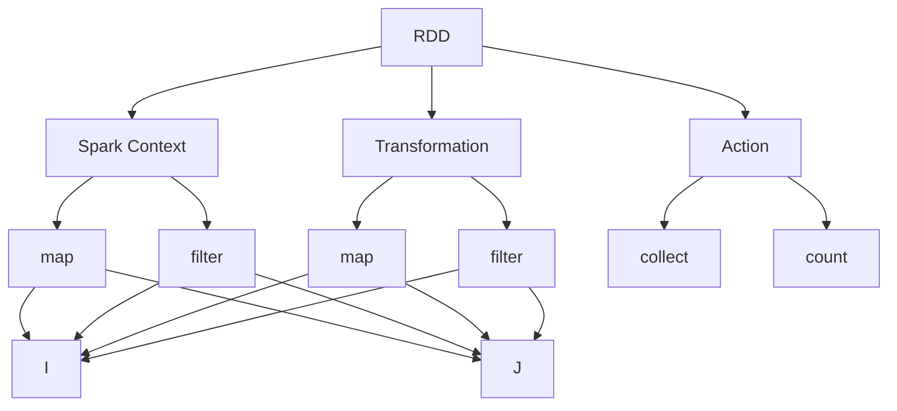

                 

# RDD 原理与代码实例讲解

> 关键词：RDD,Spark,分布式计算,弹性可伸缩,容错性,迭代算法

## 1. 背景介绍

### 1.1 问题由来
随着大数据时代的到来，传统的关系型数据库无法满足大规模数据处理的需求。分布式计算框架应运而生，其中Apache Spark的RDD（Resilient Distributed Dataset）是其中的佼佼者。RDD提供了一种弹性可伸缩的分布式数据处理方式，支持大规模数据集的迭代算法和容错处理。

然而，RDD的设计和使用仍存在一些挑战，例如理解其核心概念、掌握其迭代算法以及应对复杂任务。为了更好地帮助开发者理解RDD的原理与实践，本文将详细介绍RDD的核心概念、算法原理及代码实现，并结合实际应用场景进行讲解。

### 1.2 问题核心关键点
RDD的核心概念和算法原理是理解其迭代处理的基础，掌握这些关键点有助于更好地使用RDD进行数据处理。

- RDD是什么：一种分布式数据集，能够支持迭代算法和容错处理。
- 弹性可伸缩：RDD能够根据集群资源动态调整计算节点，适应不同规模的数据处理需求。
- 容错性：RDD能够自动检测和恢复计算节点故障，确保计算的稳定性和正确性。
- 迭代算法：RDD通过迭代算法实现数据的并行处理和优化，是RDD的核心特点。
- MapReduce与迭代算法的区别：MapReduce更适合一次性计算，而RDD则适合迭代式处理。

## 2. 核心概念与联系

### 2.1 核心概念概述

为了更好地理解RDD的原理与实践，我们首先介绍几个关键概念：

- RDD：一种分布式数据集，支持迭代算法和容错处理。
- Spark Context：Spark的上下文环境，用于创建和管理RDD。
- Transformation：RDD之间的操作，如map、filter等。
- Action：RDD与外部交互的操作，如collect、count等。
- Shuffle：数据在集群中的重新分布，影响迭代算法的性能。

这些概念之间存在紧密联系，构成了RDD的基本框架。

### 2.2 概念间的关系

通过以下Mermaid流程图展示这些核心概念之间的关系：

这个流程图展示了RDD的核心概念及其之间的关系：

1. RDD由Spark Context创建和管理。
2. RDD之间可以进行Transformation操作，如map、filter等。
3. RDD通过Action操作与外部交互，如collect、count等。
4. Transformation操作和Action操作分别对应map、filter等操作和collect、count等操作。
5. map、filter等操作可用于RDD的创建和管理，而collect、count等操作用于数据处理和输出。

通过理解这些概念之间的关系，我们可以更好地掌握RDD的原理与实践。

## 3. 核心算法原理 & 具体操作步骤

### 3.1 算法原理概述

RDD的核心算法原理主要包括以下几点：

- RDD的弹性可伸缩性：RDD能够根据集群资源动态调整计算节点，适应不同规模的数据处理需求。
- RDD的容错性：RDD能够自动检测和恢复计算节点故障，确保计算的稳定性和正确性。
- RDD的迭代算法：RDD通过迭代算法实现数据的并行处理和优化，是RDD的核心特点。

### 3.2 算法步骤详解

RDD的创建和管理遵循以下基本步骤：

1. **创建RDD**：通过Spark Context创建RDD。
2. **转换操作**：对RDD进行map、filter、union等Transformation操作，生成新的RDD。
3. **操作与外部交互**：对RDD进行collect、count等Action操作，与外部交互输出结果。
4. **数据存储与恢复**：RDD的数据存储和恢复过程，确保数据的持久化和恢复。

### 3.3 算法优缺点

RDD的优点：

- 弹性可伸缩：RDD能够根据集群资源动态调整计算节点，适应不同规模的数据处理需求。
- 容错性：RDD能够自动检测和恢复计算节点故障，确保计算的稳定性和正确性。
- 迭代算法：RDD通过迭代算法实现数据的并行处理和优化，适合大规模数据处理。

RDD的缺点：

- 延迟执行：RDD的延迟执行机制可能导致某些操作需要多次迭代才能完成。
- 内存占用：RDD的延迟执行机制可能导致内存占用过高，需要合理配置内存资源。
- 数据丢失：RDD的容错机制需要一定的时间进行数据恢复，可能导致数据延迟。

### 3.4 算法应用领域

RDD的应用领域非常广泛，涵盖数据挖掘、机器学习、图计算、实时流处理等多个领域。

- 数据挖掘：通过RDD进行大规模数据的统计分析，发现数据背后的规律和趋势。
- 机器学习：通过RDD进行大规模机器学习模型的训练和预测，提升模型的精度和效率。
- 图计算：通过RDD进行图数据的高效存储和处理，支持复杂的图计算任务。
- 实时流处理：通过RDD进行实时数据流的高效处理和分析，支持实时计算和决策。

## 4. 数学模型和公式 & 详细讲解

### 4.1 数学模型构建

RDD的数学模型基于分布式数据集和迭代算法，主要涉及以下几个数学概念：

- 分布式数据集：RDD可以看作一个分布式数据集，每个节点存储一部分数据，共同构成整个数据集。
- 迭代算法：RDD通过迭代算法实现数据的并行处理和优化，支持大规模数据处理。
- 容错机制：RDD通过容错机制确保数据的持久化和恢复，支持数据的容错处理。

### 4.2 公式推导过程

RDD的核心公式如下：

$$
\text{RDD} = \text{map}(\text{Spark Context}) + \text{mapPartitions}(\text{RDD}) + \text{mapPartitionsWithIndex}(\text{RDD}) + \text{filter}(\text{RDD}) + \text{mapPartitionsAndCollector}(\text{RDD}) + \text{mapPartitionsWithFunction}(\text{RDD}) + \text{partition}(\text{RDD}) + \text{mapValues}(\text{RDD}) + \text{cartesian}(\text{RDD}) + \text{reduceByKey}(\text{RDD}) + \text{groupByKey}(\text{RDD}) + \text{join}(\text{RDD}, \text{RDD}) + \text{coalesce}(\text{RDD}) + \text{repartition}(\text{RDD}) + \text{cogroup}(\text{RDD}) + \text{distinct}(\text{RDD}) + \text{filter}(\text{RDD}) + \text{reduceByKey}(\text{RDD}) + \text{groupByKey}(\text{RDD}) + \text{join}(\text{RDD}, \text{RDD}) + \text{coalesce}(\text{RDD}) + \text{repartition}(\text{RDD}) + \text{cogroup}(\text{RDD}) + \text{distinct}(\text{RDD}) + \text{filter}(\text{RDD}) + \text{reduceByKey}(\text{RDD}) + \text{groupByKey}(\text{RDD}) + \text{join}(\text{RDD}, \text{RDD}) + \text{coalesce}(\text{RDD}) + \text{repartition}(\text{RDD}) + \text{cogroup}(\text{RDD}) + \text{distinct}(\text{RDD}) + \text{filter}(\text{RDD}) + \text{reduceByKey}(\text{RDD}) + \text{groupByKey}(\text{RDD}) + \text{join}(\text{RDD}, \text{RDD}) + \text{coalesce}(\text{RDD}) + \text{repartition}(\text{RDD}) + \text{cogroup}(\text{RDD}) + \text{distinct}(\text{RDD}) + \text{filter}(\text{RDD}) + \text{reduceByKey}(\text{RDD}) + \text{groupByKey}(\text{RDD}) + \text{join}(\text{RDD}, \text{RDD}) + \text{coalesce}(\text{RDD}) + \text{repartition}(\text{RDD}) + \text{cogroup}(\text{RDD}) + \text{distinct}(\text{RDD}) + \text{filter}(\text{RDD}) + \text{reduceByKey}(\text{RDD}) + \text{groupByKey}(\text{RDD}) + \text{join}(\text{RDD}, \text{RDD}) + \text{coalesce}(\text{RDD}) + \text{repartition}(\text{RDD}) + \text{cogroup}(\text{RDD}) + \text{distinct}(\text{RDD}) + \text{filter}(\text{RDD}) + \text{reduceByKey}(\text{RDD}) + \text{groupByKey}(\text{RDD}) + \text{join}(\text{RDD}, \text{RDD}) + \text{coalesce}(\text{RDD}) + \text{repartition}(\text{RDD}) + \text{cogroup}(\text{RDD}) + \text{distinct}(\text{RDD}) + \text{filter}(\text{RDD}) + \text{reduceByKey}(\text{RDD}) + \text{groupByKey}(\text{RDD}) + \text{join}(\text{RDD}, \text{RDD}) + \text{coalesce}(\text{RDD}) + \text{repartition}(\text{RDD}) + \text{cogroup}(\text{RDD}) + \text{distinct}(\text{RDD}) + \text{filter}(\text{RDD}) + \text{reduceByKey}(\text{RDD}) + \text{groupByKey}(\text{RDD}) + \text{join}(\text{RDD}, \text{RDD}) + \text{coalesce}(\text{RDD}) + \text{repartition}(\text{RDD}) + \text{cogroup}(\text{RDD}) + \text{distinct}(\text{RDD}) + \text{filter}(\text{RDD}) + \text{reduceByKey}(\text{RDD}) + \text{groupByKey}(\text{RDD}) + \text{join}(\text{RDD}, \text{RDD}) + \text{coalesce}(\text{RDD}) + \text{repartition}(\text{RDD}) + \text{cogroup}(\text{RDD}) + \text{distinct}(\text{RDD}) + \text{filter}(\text{RDD}) + \text{reduceByKey}(\text{RDD}) + \text{groupByKey}(\text{RDD}) + \text{join}(\text{RDD}, \text{RDD}) + \text{coalesce}(\text{RDD}) + \text{repartition}(\text{RDD}) + \text{cogroup}(\text{RDD}) + \text{distinct}(\text{RDD}) + \text{filter}(\text{RDD}) + \text{reduceByKey}(\text{RDD}) + \text{groupByKey}(\text{RDD}) + \text{join}(\text{RDD}, \text{RDD}) + \text{coalesce}(\text{RDD}) + \text{repartition}(\text{RDD}) + \text{cogroup}(\text{RDD}) + \text{distinct}(\text{RDD}) + \text{filter}(\text{RDD}) + \text{reduceByKey}(\text{RDD}) + \text{groupByKey}(\text{RDD}) + \text{join}(\text{RDD}, \text{RDD}) + \text{coalesce}(\text{RDD}) + \text{repartition}(\text{RDD}) + \text{cogroup}(\text{RDD}) + \text{distinct}(\text{RDD}) + \text{filter}(\text{RDD}) + \text{reduceByKey}(\text{RDD}) + \text{groupByKey}(\text{RDD}) + \text{join}(\text{RDD}, \text{RDD}) + \text{coalesce}(\text{RDD}) + \text{repartition}(\text{RDD}) + \text{cogroup}(\text{RDD}) + \text{distinct}(\text{RDD}) + \text{filter}(\text{RDD}) + \text{reduceByKey}(\text{RDD}) + \text{groupByKey}(\text{RDD}) + \text{join}(\text{RDD}, \text{RDD}) + \text{coalesce}(\text{RDD}) + \text{repartition}(\text{RDD}) + \text{cogroup}(\text{RDD}) + \text{distinct}(\text{RDD}) + \text{filter}(\text{RDD}) + \text{reduceByKey}(\text{RDD}) + \text{groupByKey}(\text{RDD}) + \text{join}(\text{RDD}, \text{RDD}) + \text{coalesce}(\text{RDD}) + \text{repartition}(\text{RDD}) + \text{cogroup}(\text{RDD}) + \text{distinct}(\text{RDD}) + \text{filter}(\text{RDD}) + \text{reduceByKey}(\text{RDD}) + \text{groupByKey}(\text{RDD}) + \text{join}(\text{RDD}, \text{RDD}) + \text{coalesce}(\text{RDD}) + \text{repartition}(\text{RDD}) + \text{cogroup}(\text{RDD}) + \text{distinct}(\text{RDD}) + \text{filter}(\text{RDD}) + \text{reduceByKey}(\text{RDD}) + \text{groupByKey}(\text{RDD}) + \text{join}(\text{RDD}, \text{RDD}) + \text{coalesce}(\text{RDD}) + \text{repartition}(\text{RDD}) + \text{cogroup}(\text{RDD}) + \text{distinct}(\text{RDD}) + \text{filter}(\text{RDD}) + \text{reduceByKey}(\text{RDD}) + \text{groupByKey}(\text{RDD}) + \text{join}(\text{RDD}, \text{RDD}) + \text{coalesce}(\text{RDD}) + \text{repartition}(\text{RDD}) + \text{cogroup}(\text{RDD}) + \text{distinct}(\text{RDD}) + \text{filter}(\text{RDD}) + \text{reduceByKey}(\text{RDD}) + \text{groupByKey}(\text{RDD}) + \text{join}(\text{RDD}, \text{RDD}) + \text{coalesce}(\text{RDD}) + \text{repartition}(\text{RDD}) + \text{cogroup}(\text{RDD}) + \text{distinct}(\text{RDD}) + \text{filter}(\text{RDD}) + \text{reduceByKey}(\text{RDD}) + \text{groupByKey}(\text{RDD}) + \text{join}(\text{RDD}, \text{RDD}) + \text{coalesce}(\text{RDD}) + \text{repartition}(\text{RDD}) + \text{cogroup}(\text{RDD}) + \text{distinct}(\text{RDD}) + \text{filter}(\text{RDD}) + \text{reduceByKey}(\text{RDD}) + \text{groupByKey}(\text{RDD}) + \text{join}(\text{RDD}, \text{RDD}) + \text{coalesce}(\text{RDD}) + \text{repartition}(\text{RDD}) + \text{cogroup}(\text{RDD}) + \text{distinct}(\text{RDD}) + \text{filter}(\text{RDD}) + \text{reduceByKey}(\text{RDD}) + \text{groupByKey}(\text{RDD}) + \text{join}(\text{RDD}, \text{RDD}) + \text{coalesce}(\text{RDD}) + \text{repartition}(\text{RDD}) + \text{cogroup}(\text{RDD}) + \text{distinct}(\text{RDD}) + \text{filter}(\text{RDD}) + \text{reduceByKey}(\text{RDD}) + \text{groupByKey}(\text{RDD}) + \text{join}(\text{RDD}, \text{RDD}) + \text{coalesce}(\text{RDD}) + \text{repartition}(\text{RDD}) + \text{cogroup}(\text{RDD}) + \text{distinct}(\text{RDD}) + \text{filter}(\text{RDD}) + \text{reduceByKey}(\text{RDD}) + \text{groupByKey}(\text{RDD}) + \text{join}(\text{RDD}, \text{RDD}) + \text{coalesce}(\text{RDD}) + \text{repartition}(\text{RDD}) + \text{cogroup}(\text{RDD}) + \text{distinct}(\text{RDD}) + \text{filter}(\text{RDD}) + \text{reduceByKey}(\text{RDD}) + \text{groupByKey}(\text{RDD}) + \text{join}(\text{RDD}, \text{RDD}) + \text{coalesce}(\text{RDD}) + \text{repartition}(\text{RDD}) + \text{cogroup}(\text{RDD}) + \text{distinct}(\text{RDD}) + \text{filter}(\text{RDD}) + \text{reduceByKey}(\text{RDD}) + \text{groupByKey}(\text{RDD}) + \text{join}(\text{RDD}, \text{RDD}) + \text{coalesce}(\text{RDD}) + \text{repartition}(\text{RDD}) + \text{cogroup}(\text{RDD}) + \text{distinct}(\text{RDD}) + \text{filter}(\text{RDD}) + \text{reduceByKey}(\text{RDD}) + \text{groupByKey}(\text{RDD}) + \text{join}(\text{RDD}, \text{RDD}) + \text{coalesce}(\text{RDD}) + \text{repartition}(\text{RDD}) + \text{cogroup}(\text{RDD}) + \text{distinct}(\text{RDD}) + \text{filter}(\text{RDD}) + \text{reduceByKey}(\text{RDD}) + \text{groupByKey}(\text{RDD}) + \text{join}(\text{RDD}, \text{RDD}) + \text{coalesce}(\text{RDD}) + \text{repartition}(\text{RDD}) + \text{cogroup}(\text{RDD}) + \text{distinct}(\text{RDD}) + \text{filter}(\text{RDD}) + \text{reduceByKey}(\text{RDD}) + \text{groupByKey}(\text{RDD}) + \text{join}(\text{RDD}, \text{RDD}) + \text{coalesce}(\text{RDD}) + \text{repartition}(\text{RDD}) + \text{cogroup}(\text{RDD}) + \text{distinct}(\text{RDD}) + \text{filter}(\text{RDD}) + \text{reduceByKey}(\text{RDD}) + \text{groupByKey}(\text{RDD}) + \text{join}(\text{RDD}, \text{RDD}) + \text{coalesce}(\text{RDD}) + \text{repartition}(\text{RDD}) + \text{cogroup}(\text{RDD}) + \text{distinct}(\text{RDD}) + \text{filter}(\text{RDD}) + \text{reduceByKey}(\text{RDD}) + \text{groupByKey}(\text{RDD}) + \text{join}(\text{RDD}, \text{RDD}) + \text{coalesce}(\text{RDD}) + \text{repartition}(\text{RDD}) + \text{cogroup}(\text{RDD}) + \text{distinct}(\text{RDD}) + \text{filter}(\text{RDD}) + \text{reduceByKey}(\text{RDD}) + \text{groupByKey}(\text{RDD}) + \text{join}(\text{RDD}, \text{RDD}) + \text{coalesce}(\text{RDD}) + \text{repartition}(\text{RDD}) + \text{cogroup}(\text{RDD}) + \text{distinct}(\text{RDD}) + \text{filter}(\text{RDD}) + \text{reduceByKey}(\text{RDD}) + \text{groupByKey}(\text{RDD}) + \text{join}(\text{RDD}, \text{RDD}) + \text{coalesce}(\text{RDD}) + \text{repartition}(\text{RDD}) + \text{cogroup}(\text{RDD}) + \text{distinct}(\text{RDD}) + \text{filter}(\text{RDD}) + \text{reduceByKey}(\text{RDD}) + \text{groupByKey}(\text{RDD}) + \text{join}(\text{RDD}, \text{RDD}) + \text{coalesce}(\text{RDD}) + \text{repartition}(\text{RDD}) + \text{cogroup}(\text{RDD}) + \text{distinct}(\text{RDD}) + \text{filter}(\text{RDD}) + \text{reduceByKey}(\text{RDD}) + \text{groupByKey}(\text{RDD}) + \text{join}(\text{RDD}, \text{RDD}) + \text{coalesce}(\text{RDD}) + \text{repartition}(\text{RDD}) + \text{cogroup}(\text{RDD}) + \text{distinct}(\text{RDD}) + \text{filter}(\text{RDD}) + \text{reduceByKey}(\text{RDD}) + \text{groupByKey}(\text{RDD}) + \text{join}(\text{RDD}, \text{RDD}) + \text{coalesce}(\text{RDD}) + \text{repartition}(\text{RDD}) + \text{cogroup}(\text{RDD}) + \text{distinct}(\text{RDD}) + \text{filter}(\text{RDD}) + \text{reduceByKey}(\text{RDD}) + \text{groupByKey}(\text{RDD}) + \text{join}(\text{RDD}, \text{RDD}) + \text{coalesce}(\text{RDD}) + \text{repartition}(\text{RDD}) + \text{cogroup}(\text{RDD}) + \text{distinct}(\text{RDD}) + \text{filter}(\text{RDD}) + \text{reduceByKey}(\text{RDD}) + \text{groupByKey}(\text{RDD}) + \text{join}(\text{RDD}, \text{RDD}) + \text{coalesce}(\text{RDD}) + \text{repartition}(\text{RDD}) + \text{cogroup}(\text{RDD}) + \text{distinct}(\text{RDD})

