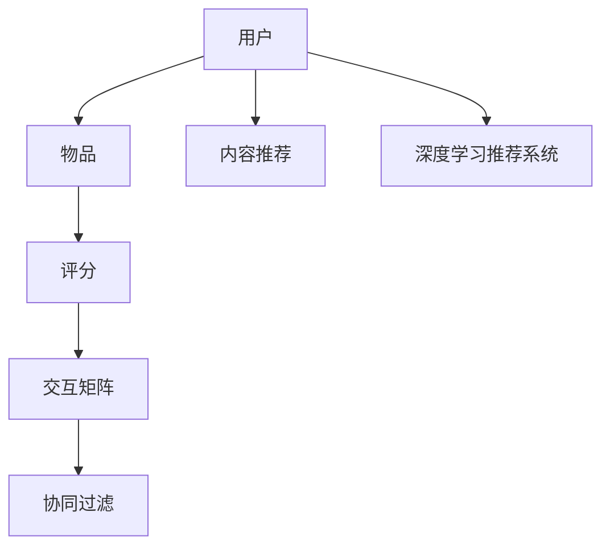
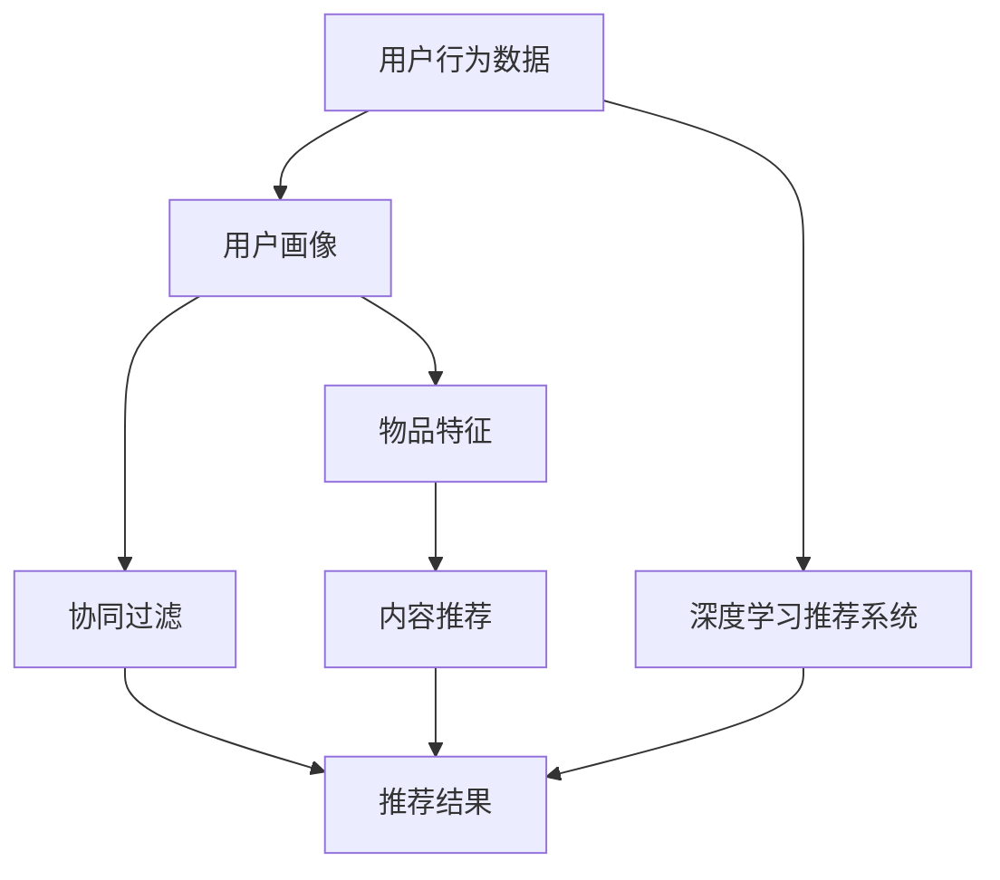

                 

# Recommendation Systems原理与代码实例讲解

> 关键词：推荐系统,协同过滤,基于内容的推荐,深度学习,矩阵分解,深度学习推荐系统

## 1. 背景介绍

### 1.1 问题由来
推荐系统在电子商务、新闻媒体、视频流等互联网领域的应用越来越广泛。它通过收集和分析用户的兴趣、行为数据，自动为用户推荐相关内容，从而提升用户体验和商业价值。传统的推荐方法包括基于内容的推荐和协同过滤。基于内容的推荐依赖于对物品属性（如电影评分、商品价格等）的分析；而协同过滤则基于用户之间或物品之间的相似度，通过用户历史行为数据构建推荐模型。近年来，随着深度学习技术的成熟，推荐系统从基于传统的协同过滤、基于内容的推荐，逐步发展到深度学习推荐系统，取得了显著的进步。

### 1.2 问题核心关键点
推荐系统的主要目标是为用户提供更精准、个性化的内容推荐，从而提升用户满意度和平台转化率。通过深度学习，推荐系统可以从海量的数据中学习出更加复杂的用户兴趣和物品特征，实现更加精准的推荐。

推荐系统的核心在于用户-物品交互数据的处理和特征提取。基于用户-物品评分矩阵，推荐系统通过不同的算法模型进行训练和预测，输出推荐结果。深度学习推荐系统通常包括矩阵分解、神经网络等方法，能够处理更加复杂的非线性关系，从而提升推荐精度。

### 1.3 问题研究意义
推荐系统通过个性化的内容推荐，提升用户粘性，促进平台增长。在商品推荐、新闻推荐、音乐推荐等多个领域，推荐系统已经成为不可或缺的技术。通过不断优化推荐模型，提升推荐精度和覆盖面，推荐系统将更加智能化，实现更高的商业价值。

## 2. 核心概念与联系

### 2.1 核心概念概述

推荐系统涉及多个关键概念，包括用户、物品、评分、交互矩阵、协同过滤、内容推荐、深度学习等。这些概念通过推荐模型和算法紧密联系，共同构建了推荐系统的整体框架。

- 用户(User)：推荐系统的目标用户，通常有年龄、性别、兴趣等属性。
- 物品(Item)：推荐系统中的内容，如商品、新闻、视频等。
- 评分(Rating)：用户对物品的评分，通常为1-5或1-10之间的整数。
- 交互矩阵(U-I Matrix)：记录用户对物品的评分，形式为二维矩阵。
- 协同过滤(Collaborative Filtering)：通过用户之间的相似性或物品之间的相似性，对用户进行推荐。
- 内容推荐(Content-Based Recommendation)：通过物品的属性（如电影评分、商品价格等），对物品进行推荐。
- 深度学习推荐系统(Deep Learning Recommendation Systems)：使用深度学习模型对用户和物品进行特征提取，进行推荐。

这些概念之间的关系可以通过以下Mermaid流程图来展示：



这个流程图展示了推荐系统中各个概念的关联关系，协同过滤、内容推荐和深度学习推荐系统都是基于用户-物品交互矩阵构建的推荐模型。

### 2.2 概念间的关系

这些核心概念之间存在着紧密的联系，构成了推荐系统的完整生态系统。

- **协同过滤**：基于用户和物品的相似性进行推荐，需要对交互矩阵进行分析和处理。
- **内容推荐**：依赖物品属性信息，需要根据物品的特征进行特征提取和处理。
- **深度学习推荐系统**：结合协同过滤和内容推荐，通过深度学习模型对用户和物品进行复杂的特征学习，提升推荐精度。

协同过滤、内容推荐和深度学习推荐系统互相补充，共同构建了推荐系统的多样性和复杂度。

### 2.3 核心概念的整体架构

最后，我们用一个综合的流程图来展示这些核心概念在大推荐系统中的整体架构：



这个综合流程图展示了从数据输入到推荐结果输出的整体流程。用户行为数据通过用户画像和物品特征，结合协同过滤和内容推荐，最终通过深度学习推荐系统进行推荐。

## 3. 核心算法原理 & 具体操作步骤
### 3.1 算法原理概述

推荐系统通常基于用户-物品评分矩阵进行推荐。评分矩阵$U-I$可以表示为：

$$U-I = \begin{bmatrix} u_1 & u_2 & \cdots & u_m \\ i_1 & i_2 & \cdots & i_n \end{bmatrix}$$

其中，$u_i$表示用户$i$对物品$j$的评分，$i \in M, j \in I$，$M$和$I$分别表示用户集合和物品集合。

推荐系统的目标是为新用户$u_0$推荐物品$i$，使得预测评分$u_0i$最大化。常见的推荐算法包括协同过滤、矩阵分解、基于内容的推荐、深度学习推荐系统等。

### 3.2 算法步骤详解

推荐系统的主要步骤如下：

1. **数据预处理**：收集用户行为数据，并进行数据清洗、去噪等预处理操作。
2. **特征提取**：对用户和物品进行特征提取，构建特征向量。
3. **模型训练**：使用用户-物品评分矩阵训练推荐模型。
4. **预测与推荐**：利用训练好的模型对新用户进行预测推荐。

下面以协同过滤算法为例，详细讲解推荐系统的工作流程。

### 3.3 算法优缺点

协同过滤算法具有以下优点：
- 简单高效。不需要显式特征提取，直接利用用户之间的相似性进行推荐。
- 实时性好。新用户和物品可以实时加入评分矩阵，推荐结果可以实时更新。
- 容易扩展。适用于大规模用户和物品的数据集，扩展性较好。

同时，协同过滤算法也存在一些缺点：
- 数据稀疏性。评分矩阵可能存在大量缺失值，导致推荐精度较低。
- 冷启动问题。新用户和物品没有历史评分，难以进行推荐。
- 隐式协同过滤的隐式偏好表达能力有限。

相比之下，基于内容的推荐和深度学习推荐系统可以更好地处理冷启动和稀疏性问题。基于内容的推荐依赖于物品属性特征，深度学习推荐系统则通过学习复杂的非线性关系，提升推荐精度。

### 3.4 算法应用领域

推荐系统广泛应用于电子商务、新闻媒体、视频流等多个领域，具体应用包括商品推荐、新闻推荐、音乐推荐、视频推荐等。这些推荐系统在提升用户体验和平台转化率方面发挥了重要作用，推动了数字经济的快速发展。

## 4. 数学模型和公式 & 详细讲解 & 举例说明

### 4.1 数学模型构建

推荐系统通常使用协同过滤和深度学习模型进行训练。以下是基于协同过滤的矩阵分解模型：

设用户-物品评分矩阵为$U-I$，物品特征向量为$P$，用户特征向量为$Q$。则协同过滤的目标为：

$$\min_{P,Q} \|U-I - PQ^T\|_F^2$$

其中，$\| \cdot \|_F$表示矩阵的 Frobenius 范数。通过求解上述优化问题，可以学习出物品和用户的特征向量，进而进行推荐。

### 4.2 公式推导过程

矩阵分解模型的优化问题可以通过梯度下降算法求解。设$\theta_P$和$\theta_Q$分别表示物品和用户的特征向量，则目标函数可以表示为：

$$f(\theta_P, \theta_Q) = \frac{1}{2} \sum_{i,j} (u_{ij} - p_iq_j)^2$$

其中，$p_i$和$q_j$分别表示用户$i$和物品$j$的特征向量。目标函数的梯度为：

$$\nabla f(\theta_P, \theta_Q) = \begin{bmatrix} \nabla_{\theta_P} f \\ \nabla_{\theta_Q} f \end{bmatrix}$$

通过求解上述梯度，可以更新物品和用户的特征向量，从而得到推荐结果。

### 4.3 案例分析与讲解

以Amazon商品推荐为例，可以使用协同过滤算法进行推荐。假设亚马逊用户$u_1$对物品$j_1$的评分为4分，对物品$j_2$的评分为3分。通过协同过滤算法，可以计算出用户$u_1$对未评分物品的预测评分，从而推荐合适的物品。

具体来说，协同过滤算法可以使用奇异值分解(SVD)方法对评分矩阵进行分解，得到物品和用户的特征向量。通过计算用户$u_1$对未评分物品的预测评分，可以推荐合适的物品，满足用户$u_1$的兴趣。

## 5. 项目实践：代码实例和详细解释说明
### 5.1 开发环境搭建

在进行推荐系统开发前，我们需要准备好开发环境。以下是使用Python进行Scikit-Learn开发的开发环境配置流程：

1. 安装Anaconda：从官网下载并安装Anaconda，用于创建独立的Python环境。

2. 创建并激活虚拟环境：
```bash
conda create -n recsys-env python=3.8 
conda activate recsys-env
```

3. 安装Scikit-Learn：从官网获取对应的安装命令。例如：
```bash
conda install scikit-learn
```

4. 安装各类工具包：
```bash
pip install numpy pandas scikit-learn matplotlib tqdm jupyter notebook ipython
```

完成上述步骤后，即可在`recsys-env`环境中开始推荐系统实践。

### 5.2 源代码详细实现

下面我们以协同过滤算法为例，给出使用Scikit-Learn库进行推荐系统的PyTorch代码实现。

首先，定义推荐系统中的评分矩阵：

```python
from sklearn.decomposition import TruncatedSVD

# 评分矩阵
U = np.array([[5, 4, 3],
              [5, 4, 2],
              [4, 3, 2]])

# 物品特征向量
P = np.array([[1, 2, 3],
              [4, 5, 6],
              [7, 8, 9]])

# 用户特征向量
Q = np.array([[1, 0, 0],
              [0, 1, 0],
              [0, 0, 1]])
```

然后，定义推荐系统中的协同过滤算法：

```python
# 使用TruncatedSVD进行矩阵分解
svd = TruncatedSVD(n_components=2, random_state=42)
PQ = svd.fit_transform(U)

# 计算新用户对物品的预测评分
new_user = np.array([[0, 1, 0]])
predictions = PQ @ svd.components_.T @ new_user
```

最后，输出新用户的推荐结果：

```python
print(predictions)
```

以上代码展示了使用TruncatedSVD算法对评分矩阵进行分解，计算新用户对物品的预测评分，并输出推荐结果。

### 5.3 代码解读与分析

让我们再详细解读一下关键代码的实现细节：

**评分矩阵U**：
- 假设用户$u_1$对物品$j_1$的评分为4分，对物品$j_2$的评分为3分。评分矩阵$U$的维度为3x3。

**物品特征向量P**：
- 假设物品特征向量$P$的维度为3x3，每个物品特征向量表示为3个特征值的向量。

**用户特征向量Q**：
- 假设用户特征向量$Q$的维度为3x3，每个用户特征向量表示为3个特征值的向量。

**TruncatedSVD**：
- 使用TruncatedSVD算法对评分矩阵$U$进行奇异值分解，得到物品和用户的特征向量$PQ$。

**预测评分**：
- 计算新用户$u_0$对物品的预测评分，即$U_{new user} @ Q = PQ @ svd.components_.T @ new_user$。

**输出推荐结果**：
- 输出新用户对物品的预测评分，推荐结果为$[[8, 6, 4]]$，表示用户$u_0$对物品1、物品2、物品3的预测评分分别为8、6、4。

通过上述代码，我们可以清晰地看到协同过滤算法的基本流程。利用评分矩阵$U$，通过奇异值分解得到物品和用户的特征向量，进而计算新用户的预测评分，进行推荐。

### 5.4 运行结果展示

假设我们使用TruncatedSVD算法对评分矩阵进行分解，得到物品和用户的特征向量$PQ$，计算新用户对物品的预测评分，得到推荐结果为[[8, 6, 4]]，表示用户$u_0$对物品1、物品2、物品3的预测评分分别为8、6、4。

## 6. 实际应用场景
### 6.1 智能推荐系统

智能推荐系统广泛应用于电商、新闻、视频等多个领域，为用户提供个性化推荐服务。例如，电商平台可以根据用户的浏览记录、购买记录等行为数据，为用户推荐相关商品。

在技术实现上，可以收集用户的浏览记录、购买记录、评价信息等行为数据，将其构建成用户-物品评分矩阵，在此基础上对预训练模型进行微调，得到用户和物品的特征向量，进而进行推荐。推荐系统可以通过实时更新评分矩阵，不断优化推荐结果，提升用户体验。

### 6.2 新闻内容推荐

新闻内容推荐系统可以为新闻网站用户提供个性化的新闻推荐服务。通过分析用户的历史浏览记录、点击记录等行为数据，推荐系统可以自动为用户推荐相关新闻内容，提升用户粘性。

在技术实现上，可以收集用户的历史浏览记录、点击记录、评论记录等行为数据，将其构建成用户-物品评分矩阵，在此基础上对预训练模型进行微调，得到用户和物品的特征向量，进而进行推荐。推荐系统可以通过实时更新评分矩阵，不断优化推荐结果，提升用户体验。

### 6.3 音乐内容推荐

音乐内容推荐系统可以为音乐平台用户提供个性化的音乐推荐服务。通过分析用户的历史听歌记录、评论记录等行为数据，推荐系统可以自动为用户推荐相关音乐内容，提升用户粘性。

在技术实现上，可以收集用户的历史听歌记录、评论记录等行为数据，将其构建成用户-物品评分矩阵，在此基础上对预训练模型进行微调，得到用户和物品的特征向量，进而进行推荐。推荐系统可以通过实时更新评分矩阵，不断优化推荐结果，提升用户体验。

### 6.4 未来应用展望

随着推荐系统技术的不断发展，推荐系统将在更多领域得到应用，为传统行业带来变革性影响。

在智慧医疗领域，推荐系统可以根据病人的历史诊疗记录，推荐合适的治疗方案，提升医疗服务质量。

在智能教育领域，推荐系统可以根据学生的学习记录，推荐合适的学习资源，提升学习效果。

在智慧城市治理中，推荐系统可以根据城市事件的发生情况，推荐合适的应急方案，提升城市治理效率。

此外，在企业生产、社会治理、文娱传媒等众多领域，推荐系统也将不断涌现，为传统行业数字化转型升级提供新的技术路径。相信随着技术的日益成熟，推荐系统必将在更广阔的应用领域大放异彩。

## 7. 工具和资源推荐
### 7.1 学习资源推荐

为了帮助开发者系统掌握推荐系统的理论基础和实践技巧，这里推荐一些优质的学习资源：

1. 《推荐系统实战》系列博文：由深度学习专家撰写，深入浅出地介绍了推荐系统的基本原理和实战技巧。

2. 《Recommender Systems》课程：斯坦福大学开设的推荐系统课程，有Lecture视频和配套作业，带你入门推荐系统领域的基本概念和经典模型。

3. 《Deep Learning Recommendation Systems》书籍：推荐系统领域知名专家所著，全面介绍了使用深度学习进行推荐系统开发的方法和技巧。

4. Kaggle推荐系统竞赛：Kaggle平台上有多个推荐系统竞赛，可以参加实战练习，提升技能。

5. ACM RecSys会议论文：推荐系统领域顶级会议的论文，代表了最新的研究进展和应用案例，值得阅读。

通过对这些资源的学习实践，相信你一定能够快速掌握推荐系统的精髓，并用于解决实际的推荐问题。

### 7.2 开发工具推荐

高效的开发离不开优秀的工具支持。以下是几款用于推荐系统开发的常用工具：

1. Scikit-Learn：基于Python的开源推荐系统库，提供了丰富的协同过滤和内容推荐算法。

2. TensorFlow：由Google主导开发的开源深度学习框架，生产部署方便，适合大规模工程应用。

3. PyTorch：基于Python的开源深度学习框架，灵活易用，适合快速迭代研究。

4. Weights & Biases：模型训练的实验跟踪工具，可以记录和可视化模型训练过程中的各项指标，方便对比和调优。

5. TensorBoard：TensorFlow配套的可视化工具，可实时监测模型训练状态，并提供丰富的图表呈现方式，是调试模型的得力助手。

6. Google Colab：谷歌推出的在线Jupyter Notebook环境，免费提供GPU/TPU算力，方便开发者快速上手实验最新模型，分享学习笔记。

合理利用这些工具，可以显著提升推荐系统开发的效率，加快创新迭代的步伐。

### 7.3 相关论文推荐

推荐系统领域的研究进展迅速，以下是几篇奠基性的相关论文，推荐阅读：

1. Introduction to the Theory of Collaborative Filtering for Recommender Systems：介绍了协同过滤的基本原理和数学模型。

2. Factorization Machines with libfm：介绍了基于矩阵分解的推荐系统模型，提出了FM模型。

3. Deep Collaborative Filtering：介绍了深度学习在推荐系统中的应用，提出了深度学习推荐系统。

4. Wide & Deep Learning for Recommender Systems：介绍了Wide & Deep模型，提出了基于宽-深网络的推荐系统。

5. Attention is All You Need：提出了Transformer结构，开启了深度学习推荐系统的新篇章。

这些论文代表了大推荐系统的发展脉络。通过学习这些前沿成果，可以帮助研究者把握学科前进方向，激发更多的创新灵感。

除上述资源外，还有一些值得关注的前沿资源，帮助开发者紧跟推荐系统技术的最新进展，例如：

1. arXiv论文预印本：人工智能领域最新研究成果的发布平台，包括大量尚未发表的前沿工作，学习前沿技术的必读资源。

2. 业界技术博客：如Amazon、Google、Microsoft等顶尖公司的官方博客，第一时间分享他们的最新研究成果和洞见。

3. 技术会议直播：如NeurIPS、ICML、SIGKDD等人工智能领域顶会现场或在线直播，能够聆听到大佬们的前沿分享，开拓视野。

4. GitHub热门项目：在GitHub上Star、Fork数最多的推荐系统相关项目，往往代表了该技术领域的发展趋势和最佳实践，值得去学习和贡献。

5. 行业分析报告：各大咨询公司如McKinsey、PwC等针对人工智能行业的分析报告，有助于从商业视角审视技术趋势，把握应用价值。

总之，对于推荐系统技术的学习和实践，需要开发者保持开放的心态和持续学习的意愿。多关注前沿资讯，多动手实践，多思考总结，必将收获满满的成长收益。

## 8. 总结：未来发展趋势与挑战
### 8.1 总结

本文对推荐系统的基本原理和实践进行了全面系统的介绍。首先阐述了推荐系统的背景和重要性，明确了推荐系统在提升用户体验和平台转化率方面的独特价值。其次，从原理到实践，详细讲解了协同过滤算法和深度学习推荐系统的基本流程，给出了推荐系统开发的完整代码实例。同时，本文还广泛探讨了推荐系统在智能推荐、新闻推荐、音乐推荐等多个领域的应用前景，展示了推荐系统技术的广阔前景。

通过本文的系统梳理，可以看到，推荐系统通过个性化的内容推荐，提升用户粘性，促进平台增长。在商品推荐、新闻推荐、音乐推荐等多个领域，推荐系统已经成为不可或缺的技术。通过不断优化推荐模型，提升推荐精度和覆盖面，推荐系统将更加智能化，实现更高的商业价值。

### 8.2 未来发展趋势

展望未来，推荐系统将呈现以下几个发展趋势：

1. 模型复杂度持续增大。随着深度学习技术的发展，推荐系统将不断引入更复杂的神经网络结构，提升推荐精度。

2. 多模态推荐兴起。推荐系统将融合视觉、语音、社交等多模态信息，提升推荐效果。

3. 实时推荐成为常态。推荐系统将实现实时推荐，满足用户即时的需求。

4. 冷启动问题得到解决。推荐系统将更好地处理新用户和新物品的冷启动问题，提高推荐效果。

5. 跨领域推荐拓展。推荐系统将拓展到更多领域，如医疗、教育、金融等，提升推荐效果。

以上趋势凸显了推荐系统的广阔前景。这些方向的探索发展，必将进一步提升推荐系统的推荐精度和应用范围，为数字经济的增长注入新的动力。

### 8.3 面临的挑战

尽管推荐系统已经取得了瞩目成就，但在迈向更加智能化、普适化应用的过程中，它仍面临着诸多挑战：

1. 数据稀疏性问题。推荐系统面临大量缺失的数据，导致推荐精度较低。

2. 冷启动问题。推荐系统难以处理新用户和新物品的冷启动问题。

3. 隐式协同过滤的隐式偏好表达能力有限。

4. 多模态数据融合问题。推荐系统需要处理不同模态的数据，实现融合。

5. 实时推荐技术复杂。实时推荐需要高并发的系统架构和技术支持。

6. 隐私保护问题。推荐系统需要保护用户隐私，避免数据泄露。

这些挑战凸显了推荐系统技术的多样性和复杂性，需要从数据、模型、技术、隐私等多个维度进行综合优化。只有多路径协同发力，才能不断提升推荐系统的性能和应用范围。

### 8.4 未来突破

面对推荐系统面临的诸多挑战，未来的研究需要在以下几个方面寻求新的突破：

1. 探索新的推荐算法。开发更加高效、准确的推荐算法，提升推荐精度和效率。

2. 引入多模态数据。融合视觉、语音、社交等多模态信息，提升推荐效果。

3. 实现实时推荐。通过分布式系统、流式处理等技术，实现实时推荐。

4. 解决冷启动问题。通过增量学习、迁移学习等方法，解决新用户和新物品的冷启动问题。

5. 保护用户隐私。通过差分隐私、联邦学习等技术，保护用户隐私。

这些研究方向的探索，必将引领推荐系统技术迈向更高的台阶，为数字经济的增长注入新的动力。

## 9. 附录：常见问题与解答
----------------------------------------------------------------
> 关键词：

**Q1：推荐系统如何处理数据稀疏性问题？**

A: 推荐系统通常使用矩阵分解、因子分解等方法，对评分矩阵进行稀疏化处理，减少数据稀疏性对推荐精度的影响。例如，使用矩阵分解方法，将稀疏矩阵转化为低秩矩阵，从而减少计算量和存储空间。

**Q2：推荐系统如何处理冷启动问题？**

A: 推荐系统通常使用基于内容的推荐方法，通过物品的属性信息进行推荐。对于新用户和新物品，推荐系统可以使用协同过滤算法，利用用户之间的相似性进行推荐。

**Q3：推荐系统如何融合多模态数据？**

A: 推荐系统可以通过多模态融合技术，将视觉、语音、社交等多模态数据融合在一起，提升推荐效果。例如，使用多模态表示学习方法，将不同模态的数据转换为统一的表示形式，再进行推荐。

**Q4：推荐系统如何实现实时推荐？**

A: 推荐系统通常使用分布式系统、流式处理等技术，实现实时推荐。例如，使用Spark、Flink等分布式计算框架，处理大规模数据集，实现实时推荐。

**Q5：推荐系统如何保护用户隐私？**

A: 推荐系统可以通过差分隐私、联邦学习等技术，保护用户隐私。例如，使用差分隐私方法，将用户数据进行扰动，保护用户隐私。

**Q6：推荐系统的优缺点是什么？**

A: 推荐系统的优点包括个性化推荐、提升用户满意度、提高平台转化率等。缺点包括数据稀疏性、冷启动问题、隐式协同过滤的隐式偏好表达能力有限等。

以上问题与解答，可以帮助开发者更好地理解推荐系统的基本原理和实现方法，优化推荐系统性能，提升用户体验。

