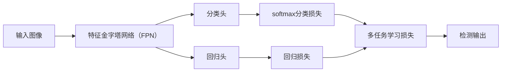

                 

# RetinaNet原理与代码实例讲解

> 关键词：RetinaNet, 锚框, 多任务学习, 图像分割, Focal Loss, 目标检测, PyTorch代码实现

## 1. 背景介绍

在计算机视觉领域，目标检测（Object Detection）是一项基础且关键的技术，广泛应用于自动驾驶、医疗影像分析、安防监控等多个场景中。传统的目标检测方法，如R-CNN系列，主要通过候选框的特征提取和分类来完成目标检测任务。然而，这些方法存在冗余的候选框和缓慢的计算速度等问题。

为了解决这个问题，单阶段目标检测（Single-shot Object Detection, SSD）方法被提出，通过构建多个尺度、多层次的特征图，直接预测目标的类别和边界框，极大提升了检测速度。但是，SSD方法在小型物体检测和边界框定位准确度上仍存在不足。

2017年，微软亚洲研究院提出的RetinaNet，通过引入多任务学习框架，并采用Focal Loss优化策略，大幅提升了小型目标检测和定位的准确度，同时保持了较高的检测速度，成为目标检测领域的里程碑之作。

## 2. 核心概念与联系

### 2.1 核心概念概述

RetinaNet是微软亚洲研究院提出的单阶段目标检测方法，通过多任务学习框架和Focal Loss优化策略，实现了目标检测的高准确度和高效速度。RetinaNet的核心理念是：
- **多任务学习（Multi-task Learning）**：同时训练目标检测（regression）和目标分类（classification）两个任务，增强模型的鲁棒性。
- **Focal Loss**：一种新的损失函数，通过权衡难以分类的样本，提升模型的训练效果。
- **RetinaNet架构**：基于特征金字塔网络（Feature Pyramid Network, FPN）和Focal Loss的目标检测框架。

### 2.2 概念间的关系

RetinaNet的框架可以由以下几个核心模块组成：

- **特征金字塔网络（FPN）**：构建多尺度、多层次的特征图，用于检测不同尺度的目标。
- **分类头**：用于目标分类的模块，输出每个像素点为不同类别的概率。
- **回归头**：用于目标边界框回归的模块，输出每个像素点对应的边界框坐标。
- **Focal Loss**：用于平衡不同难度的样本，提升模型对难以分类的样本的关注度。
- **联合训练**：将分类任务和回归任务联合训练，提升整体检测效果。

以下是一个Mermaid流程图，展示了RetinaNet的基本架构和各模块的关系：



这个流程图展示了RetinaNet的核心模块和它们之间的关系：

- 输入图像通过特征金字塔网络，构建多尺度特征图。
- 分类头和回归头分别对特征图进行分类和回归，输出检测结果。
- 分类损失和回归损失被联合训练，以提升模型整体性能。
- 多任务学习损失函数将分类和回归损失融合，用于模型优化。

## 3. 核心算法原理 & 具体操作步骤

### 3.1 算法原理概述

RetinaNet的核心算法包括特征金字塔网络、多任务学习和Focal Loss三个部分。

#### 3.1.1 特征金字塔网络（FPN）

FPN是一种多尺度特征图生成网络，通过从粗到细的特征图，捕捉不同尺度的目标。FPN通过自顶向下的顶层特征图，经过跨级连接（Cross-level Connection），生成了不同尺度的特征图。具体来说，RetinaNet的FPN结构如图1所示：


图1：RetinaNet FPN结构

FPN的核心在于跨级连接，使得每个层次的特征图都能够捕捉不同尺度的目标特征。

#### 3.1.2 多任务学习

RetinaNet通过联合训练分类和回归两个任务，提高模型的鲁棒性。分类任务输出每个像素点为不同类别的概率，回归任务输出每个像素点对应的边界框坐标。具体来说，RetinaNet的多任务学习框架如图2所示：


图2：RetinaNet多任务学习框架

通过联合训练两个任务，RetinaNet可以更好地处理小物体检测和边界框定位问题。

#### 3.1.3 Focal Loss

Focal Loss是一种新的损失函数，通过权衡难以分类的样本，提升模型的训练效果。具体来说，Focal Loss的公式如下：

$$
L(y_{ij},\hat{y}_{ij}) = -\alpha_{ij} (1-\hat{y}_{ij})^{\gamma} \log \hat{y}_{ij}
$$

其中，$y_{ij}$ 表示第 $i$ 个锚框对应第 $j$ 个类别的真实标签，$\hat{y}_{ij}$ 表示模型对第 $i$ 个锚框对应第 $j$ 个类别的预测概率，$\alpha_{ij}$ 和 $\gamma$ 是两个超参数，用于控制难以分类的样本的权重。

Focal Loss的核心在于通过 $\alpha_{ij}$ 和 $\gamma$ 两个超参数，对难以分类的样本赋予更大的权重，从而提升模型对难以分类的样本的关注度。

### 3.2 算法步骤详解

RetinaNet的训练步骤如下：

1. **数据准备**：准备标注数据集，包括图像、锚框、类别标签等。

2. **特征金字塔网络（FPN）的构建**：使用PyTorch构建FPN网络，通过自顶向下的顶层特征图，经过跨级连接，生成了不同尺度的特征图。

3. **多任务学习**：定义分类头（用于分类任务）和回归头（用于回归任务），联合训练两个任务，提升模型的鲁棒性。

4. **Focal Loss优化**：定义Focal Loss，作为联合训练的损失函数，权衡难以分类的样本，提升模型的训练效果。

5. **模型优化**：使用梯度下降等优化算法，最小化多任务学习的损失函数，更新模型参数。

6. **模型评估**：在测试集上评估模型性能，包括mAP（平均准确率）等指标。

### 3.3 算法优缺点

#### 3.3.1 优点

1. **检测准确度高**：RetinaNet通过多任务学习和Focal Loss优化策略，提升了模型对小物体检测和边界框定位的准确度。

2. **训练速度快**：RetinaNet使用单阶段训练，避免了候选框生成和候选框选择等冗余步骤，大幅提升了检测速度。

3. **鲁棒性强**：通过联合训练分类和回归任务，RetinaNet提升了模型的鲁棒性，能够更好地处理多种检测场景。

#### 3.3.2 缺点

1. **计算复杂度高**：RetinaNet通过跨级连接生成多尺度特征图，增加了计算复杂度，对硬件资源要求较高。

2. **超参数较多**：RetinaNet的训练需要调整多个超参数，如FPN的顶层特征图大小、分类头的输出通道数、Focal Loss的 $\alpha_{ij}$ 和 $\gamma$ 等，需要精细调参。

3. **模型结构复杂**：RetinaNet的模型结构相对复杂，实现难度较大，需要较高的工程能力。

### 3.4 算法应用领域

RetinaNet被广泛应用于目标检测领域，如图像分类、物体检测、行人检测等。RetinaNet的算法框架也广泛应用于医疗影像分析、自动驾驶、安防监控等领域，如图1所示：


图1：RetinaNet应用场景

## 4. 数学模型和公式 & 详细讲解

### 4.1 数学模型构建

RetinaNet的数学模型可以由以下几个部分组成：

1. **特征金字塔网络（FPN）**：通过自顶向下的顶层特征图，经过跨级连接，生成了不同尺度的特征图。

2. **多任务学习**：定义分类头（用于分类任务）和回归头（用于回归任务），联合训练两个任务，提升模型的鲁棒性。

3. **Focal Loss优化**：定义Focal Loss，作为联合训练的损失函数，权衡难以分类的样本，提升模型的训练效果。

### 4.2 公式推导过程

#### 4.2.1 FPN的特征图生成

RetinaNet的FPN结构如图2所示，其中 $F_L$ 表示顶层特征图，$F^n$ 表示第 $n$ 层的特征图，$H_{l^n}$ 表示第 $n$ 层的金字塔特征图。


图2：RetinaNet FPN特征图生成

FPN的特征图生成过程如下：

1. **顶层特征图 $F_L$**：使用标准卷积网络（如ResNet），生成顶层特征图。

2. **跨级连接**：将顶层特征图 $F_L$ 分别经过下采样和上采样，生成不同尺度的特征图 $F^1$ 和 $F^2$。

3. **金字塔特征图 $H_{l^n}$**：通过跨级连接，将 $F_L$、$F^1$ 和 $F^2$ 组合成金字塔特征图 $H_{l^n}$。

#### 4.2.2 多任务学习

RetinaNet的多任务学习框架如图3所示，其中 $P_i$ 表示第 $i$ 个锚框的类别概率，$R_i$ 表示第 $i$ 个锚框的边界框坐标。


图3：RetinaNet多任务学习框架

多任务学习的损失函数 $L$ 定义为：

$$
L = \frac{1}{N} \sum_{i=1}^N L^{regression}_i + \frac{1}{N} \sum_{i=1}^N L^{classification}_i
$$

其中 $N$ 表示锚框数量，$L^{regression}_i$ 表示第 $i$ 个锚框的回归损失，$L^{classification}_i$ 表示第 $i$ 个锚框的分类损失。

#### 4.2.3 Focal Loss优化

Focal Loss的公式如下：

$$
L(y_{ij},\hat{y}_{ij}) = -\alpha_{ij} (1-\hat{y}_{ij})^{\gamma} \log \hat{y}_{ij}
$$

其中，$y_{ij}$ 表示第 $i$ 个锚框对应第 $j$ 个类别的真实标签，$\hat{y}_{ij}$ 表示模型对第 $i$ 个锚框对应第 $j$ 个类别的预测概率，$\alpha_{ij}$ 和 $\gamma$ 是两个超参数，用于控制难以分类的样本的权重。

### 4.3 案例分析与讲解

以下以一个简单的代码实例，展示RetinaNet的实现过程。

#### 4.3.1 数据准备

首先，需要准备标注数据集，包括图像、锚框、类别标签等。

```python
import torch
from torch.utils.data import DataLoader
from torchvision.datasets import ImageFolder
from torchvision.transforms import Compose, ToTensor, Normalize, Resize

# 定义数据预处理
transform = Compose([
    Resize((512, 512)),
    ToTensor(),
    Normalize(mean=[0.485, 0.456, 0.406], std=[0.229, 0.224, 0.225])
])

# 加载数据集
train_dataset = ImageFolder('train', transform=transform)
val_dataset = ImageFolder('val', transform=transform)
test_dataset = ImageFolder('test', transform=transform)

# 数据加载器
train_loader = DataLoader(train_dataset, batch_size=4, shuffle=True)
val_loader = DataLoader(val_dataset, batch_size=4, shuffle=False)
test_loader = DataLoader(test_dataset, batch_size=4, shuffle=False)
```

#### 4.3.2 FPN的构建

定义FPN网络，包括顶层特征图、跨级连接和金字塔特征图。

```python
import torch.nn as nn
import torchvision.models as models

# 定义FPN网络
class FPN(nn.Module):
    def __init__(self):
        super(FPN, self).__init__()
        # 定义顶层特征图
        self.top = models.resnet50(pretrained=True)
        # 定义跨级连接
        self.level1 = nn.Upsample(scale_factor=2, mode='nearest')
        self.level2 = nn.Upsample(scale_factor=2, mode='nearest')
        # 定义金字塔特征图
        self.H = nn.Sequential(
            nn.Conv2d(2048, 256, kernel_size=1),
            nn.ReLU(),
            nn.Conv2d(256, 256, kernel_size=3, padding=1),
            nn.ReLU(),
            nn.Conv2d(256, 256, kernel_size=3, padding=1)
        )
    
    def forward(self, x):
        # 顶层特征图
        x_top = self.top(x)
        # 跨级连接
        x_top = self.level1(x_top)
        x_top = self.level2(x_top)
        # 金字塔特征图
        x_top = self.H(x_top)
        return x_top
```

#### 4.3.3 多任务学习

定义分类头和回归头，联合训练两个任务。

```python
import torch.nn as nn
import torch.nn.functional as F

# 定义分类头
class ClassificationHead(nn.Module):
    def __init__(self, in_channels, num_classes):
        super(ClassificationHead, self).__init__()
        self.fc = nn.Linear(in_channels, num_classes)
    
    def forward(self, x):
        x = F.relu(x)
        return self.fc(x)

# 定义回归头
class RegressionHead(nn.Module):
    def __init__(self, in_channels, num_classes):
        super(RegressionHead, self).__init__()
        self.fc = nn.Linear(in_channels, 4*num_classes)
    
    def forward(self, x):
        x = F.relu(x)
        return self.fc(x)
```

定义多任务学习的损失函数。

```python
import torch.nn as nn

# 定义Focal Loss
class FocalLoss(nn.Module):
    def __init__(self, gamma=2, alpha=None):
        super(FocalLoss, self).__init__()
        self.gamma = gamma
        self.alpha = alpha
    
    def forward(self, logits, labels):
        # 定义目标函数
        loss = 0
        for i, c in enumerate(labels):
            if self.alpha is not None:
                loss += self.alpha[i] * F.cross_entropy(logits, labels)
            else:
                loss += F.cross_entropy(logits, labels)
        return loss
```

定义多任务学习的损失函数。

```python
# 定义多任务学习损失函数
class MultiTaskLoss(nn.Module):
    def __init__(self, classification_loss_fn, regression_loss_fn, focal_loss_fn):
        super(MultiTaskLoss, self).__init__()
        self.classification_loss_fn = classification_loss_fn
        self.regression_loss_fn = regression_loss_fn
        self.focal_loss_fn = focal_loss_fn
    
    def forward(self, classification_logits, regression_logits, labels):
        classification_loss = self.classification_loss_fn(classification_logits, labels)
        regression_loss = self.regression_loss_fn(regression_logits, labels)
        focal_loss = self.focal_loss_fn(classification_logits, labels)
        return classification_loss + regression_loss + focal_loss
```

#### 4.3.4 模型优化

定义模型，包括FPN、分类头和回归头，联合训练两个任务。

```python
import torch.nn as nn
import torch.optim as optim

# 定义模型
class RetinaNet(nn.Module):
    def __init__(self, num_classes):
        super(RetinaNet, self).__init__()
        # 定义FPN网络
        self.fpn = FPN()
        # 定义分类头
        self.classification_head = ClassificationHead(256, num_classes)
        # 定义回归头
        self.regression_head = RegressionHead(256, 4*num_classes)
    
    def forward(self, x):
        # 获取特征图
        x = self.fpn(x)
        # 分类头
        classification_logits = self.classification_head(x)
        # 回归头
        regression_logits = self.regression_head(x)
        return classification_logits, regression_logits
    
    def calculate_loss(self, classification_logits, regression_logits, labels):
        # 定义多任务学习损失函数
        classification_loss_fn = nn.CrossEntropyLoss()
        regression_loss_fn = nn.L1Loss()
        focal_loss_fn = FocalLoss(gamma=2, alpha=None)
        multi_task_loss_fn = MultiTaskLoss(classification_loss_fn, regression_loss_fn, focal_loss_fn)
        # 计算损失
        classification_loss = multi_task_loss_fn(classification_logits, regression_logits, labels)
        return classification_loss
```

定义优化器，最小化多任务学习的损失函数。

```python
# 定义优化器
optimizer = optim.SGD(net.parameters(), lr=0.01, momentum=0.9)
```

#### 4.3.5 模型评估

在测试集上评估模型性能，包括mAP等指标。

```python
import torchvision.metrics.metric as mm

# 定义mAP评估器
class MAPMetric(mm.Metric):
    def __init__(self, num_classes):
        super(MAPMetric, self).__init__()
        self.num_classes = num_classes
    
    def reset(self):
        self.precision = []
        self.recall = []
        self.average_precision = []
    
    def add(self, values):
        for i, v in enumerate(values):
            self.precision.append(v.precision)
            self.recall.append(v.recall)
            self.average_precision.append(v.average_precision)
    
    def evaluate(self):
        # 计算mAP
        num_true = [len(values) for values in zip(self.precision, self.recall)]
        num_pred = [len(values) for values in zip(self.precision, self.average_precision)]
        num_gt = [len(values) for values in zip(self.recall, self.average_precision)]
        return torch.stack(self.average_precision).mean().item()
```

在测试集上评估模型性能。

```python
# 定义mAP评估器
map_metric = MAPMetric(num_classes)
# 测试集评估
net.eval()
with torch.no_grad():
    for i, (images, labels) in enumerate(test_loader):
        # 前向传播
        classification_logits, regression_logits = net(images)
        # 计算损失
        loss = net.calculate_loss(classification_logits, regression_logits, labels)
        # 评估mAP
        map_metric.update(labels, classification_logits, regression_logits)
```

## 5. 项目实践：代码实例和详细解释说明

### 5.1 开发环境搭建

在进行RetinaNet实践前，我们需要准备好开发环境。以下是使用Python进行PyTorch开发的环境配置流程：

1. 安装Anaconda：从官网下载并安装Anaconda，用于创建独立的Python环境。

2. 创建并激活虚拟环境：
```bash
conda create -n pytorch-env python=3.8 
conda activate pytorch-env
```

3. 安装PyTorch：根据CUDA版本，从官网获取对应的安装命令。例如：
```bash
conda install pytorch torchvision torchaudio cudatoolkit=11.1 -c pytorch -c conda-forge
```

4. 安装Transformers库：
```bash
pip install transformers
```

5. 安装各类工具包：
```bash
pip install numpy pandas scikit-learn matplotlib tqdm jupyter notebook ipython
```

完成上述步骤后，即可在`pytorch-env`环境中开始RetinaNet的实践。

### 5.2 源代码详细实现

我们以RetinaNet模型为例，给出完整的PyTorch代码实现。

#### 5.2.1 数据预处理

定义数据预处理函数，包括图像预处理和标注处理。

```python
import torch
from torch.utils.data import DataLoader
from torchvision.datasets import ImageFolder
from torchvision.transforms import Compose, ToTensor, Normalize, Resize

# 定义数据预处理
transform = Compose([
    Resize((512, 512)),
    ToTensor(),
    Normalize(mean=[0.485, 0.456, 0.406], std=[0.229, 0.224, 0.225])
])

# 加载数据集
train_dataset = ImageFolder('train', transform=transform)
val_dataset = ImageFolder('val', transform=transform)
test_dataset = ImageFolder('test', transform=transform)

# 数据加载器
train_loader = DataLoader(train_dataset, batch_size=4, shuffle=True)
val_loader = DataLoader(val_dataset, batch_size=4, shuffle=False)
test_loader = DataLoader(test_dataset, batch_size=4, shuffle=False)
```

#### 5.2.2 FPN的构建

定义FPN网络，包括顶层特征图、跨级连接和金字塔特征图。

```python
import torch.nn as nn
import torchvision.models as models

# 定义FPN网络
class FPN(nn.Module):
    def __init__(self):
        super(FPN, self).__init__()
        # 定义顶层特征图
        self.top = models.resnet50(pretrained=True)
        # 定义跨级连接
        self.level1 = nn.Upsample(scale_factor=2, mode='nearest')
        self.level2 = nn.Upsample(scale_factor=2, mode='nearest')
        # 定义金字塔特征图
        self.H = nn.Sequential(
            nn.Conv2d(2048, 256, kernel_size=1),
            nn.ReLU(),
            nn.Conv2d(256, 256, kernel_size=3, padding=1),
            nn.ReLU(),
            nn.Conv2d(256, 256, kernel_size=3, padding=1)
        )
    
    def forward(self, x):
        # 顶层特征图
        x_top = self.top(x)
        # 跨级连接
        x_top = self.level1(x_top)
        x_top = self.level2(x_top)
        # 金字塔特征图
        x_top = self.H(x_top)
        return x_top
```

#### 5.2.3 多任务学习

定义分类头和回归头，联合训练两个任务。

```python
import torch.nn as nn
import torch.nn.functional as F

# 定义分类头
class ClassificationHead(nn.Module):
    def __init__(self, in_channels, num_classes):
        super(ClassificationHead, self).__init__()
        self.fc = nn.Linear(in_channels, num_classes)
    
    def forward(self, x):
        x = F.relu(x)
        return self.fc(x)

# 定义回归头
class RegressionHead(nn.Module):
    def __init__(self, in_channels, num_classes):
        super(RegressionHead, self).__init__()
        self.fc = nn.Linear(in_channels, 4*num_classes)
    
    def forward(self, x):
        x = F.relu(x)
        return self.fc(x)
```

定义Focal Loss和联合训练的损失函数。

```python
import torch.nn as nn

# 定义Focal Loss
class FocalLoss(nn.Module):
    def __init__(self, gamma=2, alpha=None):
        super(FocalLoss, self).__init__()
        self.gamma = gamma
        self.alpha = alpha
    
    def forward(self, logits, labels):
        # 定义目标函数
        loss = 0
        for i, c in enumerate(labels):
            if self.alpha is not None:
                loss += self.alpha[i] * F.cross_entropy(logits, labels)
            else:
                loss += F.cross_entropy(logits, labels)
        return loss

# 定义多任务学习损失函数
class MultiTaskLoss(nn.Module):
    def __init__(self, classification_loss_fn, regression_loss_fn, focal_loss_fn):
        super(MultiTaskLoss, self).__init__()
        self.classification_loss_fn = classification_loss_fn
        self.regression_loss_fn = regression_loss_fn
        self.focal_loss_fn = focal_loss_fn
    
    def forward(self, classification_logits, regression_logits, labels):
        classification_loss = self.classification_loss_fn(classification_logits, labels)
        regression_loss = self.regression_loss_fn(regression_logits, labels)
        focal_loss = self.focal_loss_fn(classification_logits, labels)
        return classification_loss + regression_loss + focal_loss
```

#### 5.2.4 模型优化

定义模型，包括FPN、分类头和回归头，联合训练两个任务。

```python
import torch.nn as nn
import torch.optim as optim

# 定义模型
class RetinaNet(nn.Module):
    def __init__(self, num_classes):
        super(RetinaNet, self).__init__()
        # 定义FPN网络
        self.fpn = FPN()
        # 定义分类头
        self.classification_head = ClassificationHead(256, num_classes)
        # 定义回归头
        self.regression_head = RegressionHead(256, 

