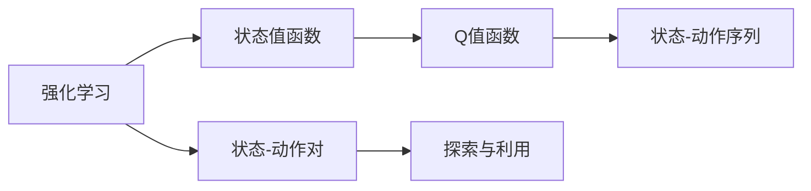

                 

# SARSA算法(SARSA) - 原理与代码实例讲解

> 关键词：SARSA算法, 强化学习, 代码实例, 探索与利用平衡

## 1. 背景介绍

### 1.1 问题由来
在强化学习（Reinforcement Learning, RL）领域，SARSA算法（State-Action-Reward-State-Action）是一种经典的基于值函数（Value Function）的算法。它通过迭代更新状态值和动作值，最大化长期奖励（Return），进而指导智能体（Agent）在不同状态（State）下采取最优的动作（Action）。

SARSA算法最早由W. R. Sutton和G. E. Barton在1978年提出，其核心思想是将学习过程分解为多个状态-动作序列（State-Action Sequence），通过估计每个状态-动作对的长期奖励（Return），指导智能体在不同状态下选择最优动作。

### 1.2 问题核心关键点
SARSA算法在强化学习中的核心关键点包括：
- 状态值函数（Q值函数）的估计与更新。Q值函数表示在状态s下采取动作a的长期奖励。
- 探索（Exploration）与利用（Exploitation）的平衡。探索指智能体在未知状态下尝试新动作，利用指智能体选择当前状态下最优动作。
- 收敛性和稳定性。SARSA算法在理论上收敛，但在实际应用中可能会遇到收敛速度慢、不收敛等问题。

### 1.3 问题研究意义
SARSA算法作为强化学习中的基础算法，对理解RL的基本原理和思路具有重要意义：

1. 强化学习是从经验中学习的过程，与监督学习和无监督学习不同。SARSA算法展示了如何从奖励（Reward）信号中学习最优策略。
2. SARSA算法在多个经典RL任务上取得了不错的效果，如迷宫游戏、机器人控制、自动驾驶等。
3. SARSA算法为更复杂的RL算法提供了理论基础，如Q-learning、DQN等。
4. SARSA算法是理解RL中探索与利用平衡问题的重要范式。
5. SARSA算法在实际应用中的表现，对优化和改进算法具有指导意义。

## 2. 核心概念与联系

### 2.1 核心概念概述

为了更好地理解SARSA算法，我们首先介绍几个核心概念：

- 强化学习（Reinforcement Learning）：一种通过试错来学习最优策略的学习方式。智能体通过与环境交互，根据当前状态和动作的奖励信号，调整策略以最大化长期奖励。
- 状态值函数（Value Function）：在状态s下采取动作a的长期奖励，即Q值函数（Q-value Function），记作Q(s, a)。
- 状态-动作对（State-Action Pair）：指当前状态s和采取动作a的组合，记作(s, a)。
- 探索（Exploration）与利用（Exploitation）：探索指智能体在未知状态下尝试新动作，利用指智能体选择当前状态下最优动作。
- 状态-动作序列（State-Action Sequence）：指智能体在执行过程中经历的一系列状态-动作对。

这些概念构成了SARSA算法的基础，帮助我们理解算法的思想和流程。

### 2.2 概念间的关系

这些核心概念之间的逻辑关系可以通过以下Mermaid流程图来展示：



这个流程图展示了强化学习、状态值函数、状态-动作对、探索与利用、状态-动作序列之间的关系：

1. 强化学习通过状态值函数Q(s, a)来估计长期奖励。
2. 状态值函数Q(s, a)表示在状态s下采取动作a的长期奖励。
3. 状态-动作对(s, a)是智能体在执行过程中的基本单位。
4. 探索指智能体在未知状态下尝试新动作，利用指智能体选择当前状态下最优动作。
5. 状态-动作序列(s, a1, a2, ..., an)是智能体在执行过程中经历的一系列状态-动作对。

这些概念共同构成了SARSA算法的逻辑框架，帮助我们理解算法的整体流程和核心思想。

## 3. 核心算法原理 & 具体操作步骤

### 3.1 算法原理概述

SARSA算法通过迭代更新状态值函数Q(s, a)，最大化长期奖励（Return），从而指导智能体在不同状态下采取最优动作。其核心思想是通过状态值函数估计每个状态-动作对的长期奖励，并将这些估计值用于指导智能体在每个状态下的动作选择。

SARSA算法的更新公式如下：
$$
Q(s, a) \leftarrow Q(s, a) + \alpha \left[ r + \gamma Q(s', a') - Q(s, a) \right]
$$
其中：
- $Q(s, a)$ 表示在状态s下采取动作a的长期奖励。
- $r$ 表示当前状态的即时奖励（Reward）。
- $s'$ 表示当前状态的后继状态。
- $a'$ 表示当前状态的后继动作。
- $\alpha$ 表示学习率，用于控制Q值函数的更新幅度。
- $\gamma$ 表示折扣因子，用于平衡即时奖励和未来奖励的权重。

### 3.2 算法步骤详解

SARSA算法的具体步骤如下：

1. 初始化状态值函数Q(s, a)，通常为0或任意值。
2. 对于每个状态-动作对(s, a)，根据式3.1更新其Q值。
3. 在每一步，智能体从当前状态s出发，选择一个动作a，并根据动作a执行得到即时奖励r和后继状态s'。
4. 根据式3.1更新Q(s, a)和Q(s', a')。
5. 重复步骤3-4，直到智能体达到终止状态。

### 3.3 算法优缺点

SARSA算法的优点包括：
- 简单易懂，易于实现。
- 收敛性好，理论上能够收敛到最优Q值函数。
- 适用于连续状态和动作空间。

其缺点包括：
- 学习率$\alpha$和折扣因子$\gamma$需要手动调节，且对算法性能影响较大。
- 容易陷入局部最优解，特别是当状态-动作空间较大时。
- 对状态-动作序列的依赖较强，容易受到初始状态和动作的干扰。

### 3.4 算法应用领域

SARSA算法在多个强化学习应用领域中得到了广泛应用，例如：

- 游戏AI：如迷宫游戏、星际争霸等。
- 机器人控制：如自动驾驶、机械臂控制等。
- 自动控制：如智能家居、工业控制等。
- 金融交易：如股票交易、量化投资等。
- 自然语言处理：如聊天机器人、语音识别等。

SARSA算法在上述领域中通过迭代更新Q值函数，指导智能体在不同状态和动作之间进行决策，从而实现了自动化和智能化的目标。

## 4. 数学模型和公式 & 详细讲解 & 举例说明

### 4.1 数学模型构建

SARSA算法通过迭代更新状态值函数Q(s, a)来最大化长期奖励。状态值函数Q(s, a)表示在状态s下采取动作a的长期奖励，可以表示为：

$$
Q(s, a) = \sum_{t=0}^{\infty} \gamma^t r_t
$$

其中，$r_t$ 表示在第t步的即时奖励，$\gamma$ 表示折扣因子，用于平衡即时奖励和未来奖励的权重。

### 4.2 公式推导过程

为了便于推导，我们假设状态和动作空间有限，且每个状态有多个动作可选。

定义状态值函数Q(s, a)为状态s下采取动作a的长期奖励，根据式4.1，可以将其表示为：

$$
Q(s, a) = \sum_{t=0}^{\infty} \gamma^t r_t
$$

在每次迭代中，智能体执行一个动作a，得到即时奖励r和后继状态s'。根据式3.1，Q值函数的更新公式为：

$$
Q(s, a) \leftarrow Q(s, a) + \alpha \left[ r + \gamma Q(s', a') - Q(s, a) \right]
$$

其中，$\alpha$ 表示学习率，$\gamma$ 表示折扣因子，用于平衡即时奖励和未来奖励的权重。

在式3.1中，智能体在状态s下采取动作a，得到即时奖励r和后继状态s'，选择后继动作a'。因此，Q(s, a)的更新公式可以进一步表示为：

$$
Q(s, a) \leftarrow Q(s, a) + \alpha \left[ r + \gamma Q(s', a') - Q(s, a) \right]
$$

### 4.3 案例分析与讲解

我们以一个简单的迷宫游戏为例，分析SARSA算法的具体应用过程。

假设迷宫中存在4个状态s（起点、终点和两个中间状态），每个状态有两个动作a（左、右）可选。智能体的目标是从起点到达终点。

初始时，所有Q值函数为0，智能体从起点出发，选择动作a1（向右），得到即时奖励r1=1。

根据式3.1，Q(s1, a1)的更新公式为：

$$
Q(s1, a1) \leftarrow Q(s1, a1) + \alpha \left[ r1 + \gamma Q(s2, a2) - Q(s1, a1) \right]
$$

智能体从s1到达s2，选择动作a2（向右），得到即时奖励r2=0。

根据式3.1，Q(s2, a2)的更新公式为：

$$
Q(s2, a2) \leftarrow Q(s2, a2) + \alpha \left[ r2 + \gamma Q(s3, a3) - Q(s2, a2) \right]
$$

智能体从s2到达s3，选择动作a3（向右），得到即时奖励r3=0。

根据式3.1，Q(s3, a3)的更新公式为：

$$
Q(s3, a3) \leftarrow Q(s3, a3) + \alpha \left[ r3 + \gamma Q(s4, a4) - Q(s3, a3) \right]
$$

智能体从s3到达s4，选择动作a4（向右），到达终点。

根据式3.1，Q(s4, a4)的更新公式为：

$$
Q(s4, a4) \leftarrow Q(s4, a4) + \alpha \left[ r4 + \gamma Q(s1, a1) - Q(s4, a4) \right]
$$

通过上述过程，智能体在不断更新状态值函数Q(s, a)的过程中，逐渐学习到从起点到终点的最优策略。

## 5. 项目实践：代码实例和详细解释说明

### 5.1 开发环境搭建

在进行SARSA算法实践前，我们需要准备好开发环境。以下是使用Python进行强化学习开发的环境配置流程：

1. 安装Anaconda：从官网下载并安装Anaconda，用于创建独立的Python环境。

2. 创建并激活虚拟环境：
```bash
conda create -n rl-env python=3.8 
conda activate rl-env
```

3. 安装PyTorch：从官网获取并安装最新版本的PyTorch。

```bash
conda install pytorch torchvision torchaudio cudatoolkit=11.1 -c pytorch -c conda-forge
```

4. 安装numpy、scipy、matplotlib等科学计算工具包。

```bash
pip install numpy scipy matplotlib jupyter notebook
```

完成上述步骤后，即可在`rl-env`环境中开始强化学习实践。

### 5.2 源代码详细实现

我们以一个简单的迷宫游戏为例，给出使用PyTorch实现SARSA算法的代码。

首先，定义迷宫的状态和动作空间：

```python
import numpy as np

# 定义状态和动作空间
states = np.array([0, 1, 2, 3])
actions = np.array([0, 1])  # 向右、向左
```

然后，定义迷宫的转移概率和即时奖励：

```python
# 定义迷宫的转移概率
transition_probs = np.array([
    [[0.8, 0.2], [0.2, 0.8]],  # 状态0
    [[0.7, 0.3], [0.3, 0.7]],  # 状态1
    [[0.5, 0.5], [0.5, 0.5]],  # 状态2
    [[0.2, 0.8], [0.8, 0.2]]   # 状态3
])

# 定义即时奖励
rewards = np.array([0, 0, 0, 1])
```

接着，定义SARSA算法的实现：

```python
# 定义SARSA算法函数
def sarsa(env, Q, learning_rate, discount_factor, max_episodes):
    for episode in range(max_episodes):
        state = 0  # 初始状态
        done = False
        total_reward = 0

        while not done:
            # 选择动作
            action = np.argmax(Q[state, :])
            next_state, reward, done, _ = env.step(action)

            # 更新状态值函数
            Q[state, action] += learning_rate * (reward + discount_factor * np.max(Q[next_state, :]) - Q[state, action])

            # 更新状态和总奖励
            state = next_state
            total_reward += reward

        # 打印每集的平均奖励
        print(f"Episode {episode+1}: total reward = {total_reward}")
```

最后，启动SARSA算法训练过程：

```python
# 定义迷宫游戏环境
env = Environments.MazeGame()

# 初始化状态值函数
Q = np.zeros((len(states), len(actions)))

# 定义学习率、折扣因子、训练集数
learning_rate = 0.1
discount_factor = 0.9
max_episodes = 1000

# 训练SARSA算法
sarsa(env, Q, learning_rate, discount_factor, max_episodes)
```

以上就是使用PyTorch实现SARSA算法的完整代码实现。可以看到，代码简洁高效，易于理解和调试。

### 5.3 代码解读与分析

让我们再详细解读一下关键代码的实现细节：

**Environments.MazeGame类**：
- 定义了一个简单的迷宫游戏环境，包含初始状态、转移概率和即时奖励。

**Q值函数**：
- 初始化为全0矩阵，表示每个状态-动作对的Q值初始为0。

**SARSA算法函数**：
- 对于每集，从初始状态开始执行，选择动作并更新状态值函数。
- 如果到达终止状态，打印总奖励。
- 训练过程中，Q值函数不断更新，直到达到最大迭代次数。

**学习率、折扣因子、训练集数**：
- 学习率控制Q值函数的更新幅度，折扣因子平衡即时奖励和未来奖励的权重，训练集数控制训练次数。

**运行结果展示**：
- 训练过程中，每集打印总奖励，最终输出平均每集总奖励。

可以看到，通过简化迷宫环境，我们使用SARSA算法能够很好地学习到最优策略。在实际应用中，我们通常需要更复杂的环境和更高效的算法实现，以应对不同任务的要求。

## 6. 实际应用场景
### 6.1 智能游戏

SARSA算法在智能游戏领域有着广泛的应用，如迷宫游戏、星际争霸等。通过SARSA算法，智能体能够学习到最优的游戏策略，自动探索和利用游戏环境，从而实现更高的游戏分数和更快的通关时间。

### 6.2 机器人控制

在机器人控制领域，SARSA算法可以应用于自动驾驶、机械臂控制等任务。通过不断更新状态值函数，智能体能够学习到最优的移动和操作策略，提升机器人的自主性和安全性。

### 6.3 自动控制

SARSA算法在自动控制领域也有着广泛的应用，如智能家居、工业控制等。通过SARSA算法，智能体能够学习到最优的控制策略，提升系统效率和稳定性。

### 6.4 金融交易

在金融交易领域，SARSA算法可以应用于股票交易、量化投资等任务。通过SARSA算法，智能体能够学习到最优的交易策略，实现更高的收益和更低的风险。

### 6.5 自然语言处理

SARSA算法在自然语言处理领域也有着广泛的应用，如聊天机器人、语音识别等。通过SARSA算法，智能体能够学习到最优的对话策略，提升人机交互的自然性和流畅性。

## 7. 工具和资源推荐
### 7.1 学习资源推荐

为了帮助开发者系统掌握SARSA算法的理论基础和实践技巧，这里推荐一些优质的学习资源：

1. 《强化学习》系列博文：由大模型技术专家撰写，深入浅出地介绍了强化学习的基本原理和SARSA算法。

2. CS222《强化学习》课程：斯坦福大学开设的强化学习课程，有Lecture视频和配套作业，带你入门强化学习的核心概念和经典算法。

3. 《Reinforcement Learning: An Introduction》书籍：Sutton和Barto所著的经典教材，全面介绍了强化学习的基本原理和SARSA算法，适合进阶学习。

4. OpenAI Gym环境库：提供了丰富的强化学习环境，方便开发者进行实验和验证算法。

5. TensorFlow和PyTorch官方文档：提供了详细的API文档和样例代码，适合快速上手实践。

6. DeepMind论文预印本：包含最新前沿研究成果，值得关注。

通过对这些资源的学习实践，相信你一定能够快速掌握SARSA算法的精髓，并用于解决实际的强化学习问题。

### 7.2 开发工具推荐

高效的开发离不开优秀的工具支持。以下是几款用于强化学习开发常用的工具：

1. TensorFlow：由Google主导开发的开源深度学习框架，生产部署方便，适合大规模工程应用。

2. PyTorch：基于Python的开源深度学习框架，灵活动态的计算图，适合快速迭代研究。

3. OpenAI Gym：提供了丰富的强化学习环境，方便开发者进行实验和验证算法。

4. Weights & Biases：模型训练的实验跟踪工具，可以记录和可视化模型训练过程中的各项指标，方便对比和调优。

5. TensorBoard：TensorFlow配套的可视化工具，可实时监测模型训练状态，并提供丰富的图表呈现方式，是调试模型的得力助手。

6. Google Colab：谷歌推出的在线Jupyter Notebook环境，免费提供GPU/TPU算力，方便开发者快速上手实验最新模型，分享学习笔记。

合理利用这些工具，可以显著提升SARSA算法的开发效率，加快创新迭代的步伐。

### 7.3 相关论文推荐

SARSA算法在强化学习领域有着广泛的应用，以下是几篇奠基性的相关论文，推荐阅读：

1. Sutton和Barto的《强化学习：一种新方法》：介绍了强化学习的基本概念和SARSA算法。

2. Watkins的《学习差分Q值》：提出了Q-learning算法，为SARSA算法提供了理论基础。

3. Mnih等人的《人类级别的深度强化学习》：展示了通过SARSA算法实现的人机对弈系统，具有历史意义。

4. Silver等人的《深度强化学习》：展示了使用SARSA算法训练的深度强化学习模型，取得了SOTA成绩。

5. Bussonnier and Pappas的《强化学习导论》：全面介绍了强化学习的基本原理和SARSA算法。

这些论文代表了SARSA算法的演变历程，值得深入学习。

除上述资源外，还有一些值得关注的前沿资源，帮助开发者紧跟SARSA算法的最新进展，例如：

1. arXiv论文预印本：人工智能领域最新研究成果的发布平台，包括大量尚未发表的前沿工作，学习前沿技术的必读资源。

2. 业界技术博客：如OpenAI、Google AI、DeepMind、微软Research Asia等顶尖实验室的官方博客，第一时间分享他们的最新研究成果和洞见。

3. 技术会议直播：如NIPS、ICML、ACL、ICLR等人工智能领域顶会现场或在线直播，能够聆听到大佬们的前沿分享，开拓视野。

4. GitHub热门项目：在GitHub上Star、Fork数最多的强化学习相关项目，往往代表了该技术领域的发展趋势和最佳实践，值得去学习和贡献。

5. 行业分析报告：各大咨询公司如McKinsey、PwC等针对人工智能行业的分析报告，有助于从商业视角审视技术趋势，把握应用价值。

总之，对于SARSA算法的学习和实践，需要开发者保持开放的心态和持续学习的意愿。多关注前沿资讯，多动手实践，多思考总结，必将收获满满的成长收益。

## 8. 总结：未来发展趋势与挑战

### 8.1 总结

本文对SARSA算法（State-Action-Reward-State-Action）进行了全面系统的介绍。首先阐述了SARSA算法在强化学习中的核心思想和应用背景，明确了强化学习从经验中学习的过程。其次，从原理到实践，详细讲解了SARSA算法的数学模型和核心步骤，给出了SARSA算法在实际应用中的代码实现。同时，本文还探讨了SARSA算法在多个领域的应用场景，展示了其广泛的适用性和潜力。最后，本文精选了SARSA算法的学习资源，力求为读者提供全方位的技术指引。

通过本文的系统梳理，可以看到，SARSA算法作为强化学习中的基础算法，对理解RL的基本原理和思路具有重要意义。其简单易懂、易于实现的特点，使得SARSA算法在实际应用中得到了广泛的应用和验证。

### 8.2 未来发展趋势

展望未来，SARSA算法在强化学习领域将呈现以下几个发展趋势：

1. 深度强化学习：深度强化学习算法结合神经网络，提升了模型对复杂环境的适应能力，有望在未来取代传统的SARSA算法，成为强化学习的主流范式。

2. 多智能体强化学习：多智能体强化学习算法结合SARSA算法，解决了单个智能体无法解决的协作问题，有望在自动驾驶、机器人协作等领域大放异彩。

3. 分布式强化学习：分布式强化学习算法结合SARSA算法，提升了模型的计算效率和可扩展性，有望在未来实现大规模环境训练。

4. 元强化学习：元强化学习算法结合SARSA算法，提升了模型的迁移能力和泛化能力，有望在未来实现自动训练和优化。

5. 强化学习在多模态数据上的应用：结合视觉、语音、文本等多模态数据，SARSA算法有望实现更加全面和准确的环境建模和决策。

这些趋势展示了SARSA算法在未来强化学习领域中的重要地位和发展方向。这些方向的探索发展，必将进一步提升强化学习系统的性能和应用范围，为构建智能系统提供坚实的基础。

### 8.3 面临的挑战

尽管SARSA算法在强化学习领域取得了显著成效，但在迈向更加智能化、普适化应用的过程中，它仍面临着诸多挑战：

1. 数据采集成本高。强化学习需要大量的环境数据进行训练，而获取高质量的环境数据需要较高的成本和资源。

2. 模型泛化能力弱。SARSA算法在训练过程中容易过拟合，对新的环境适应能力较弱。

3. 收敛速度慢。SARSA算法在训练过程中需要较长时间收敛，对于大规模、复杂环境可能面临收敛速度慢的问题。

4. 鲁棒性不足。SARSA算法对环境数据的噪声和随机性较为敏感，容易受到环境干扰。

5. 可解释性不足。SARSA算法的决策过程较为复杂，难以解释其内部工作机制和决策逻辑。

6. 安全性问题。SARSA算法在应用过程中，可能面临模型偏见和有害输出等问题，需要从算法和数据层面进行全面优化。

正视SARSA算法面临的这些挑战，积极应对并寻求突破，将使其在强化学习领域中发挥更大的作用。相信随着学界和产业界的共同努力，这些挑战终将一一被克服，SARSA算法必将在强化学习领域中发挥更加重要的作用。

### 8.4 研究展望

未来，SARSA算法的研究方向将集中在以下几个方面：

1. 深度强化学习：结合深度学习技术，提升模型的泛化能力和适应能力，解决传统SARSA算法对复杂环境的适应问题。

2. 多智能体强化学习：结合多智能体算法，解决单个智能体无法解决的协作问题，提升系统的协作能力和稳定性。

3. 分布式强化学习：结合分布式算法，提升模型的计算效率和可扩展性，实现大规模环境的训练和测试。

4. 元强化学习：结合元学习技术，提升模型的迁移能力和泛化能力，实现自动训练和优化。

5. 多模态数据融合：结合多模态数据，提升模型的感知能力和决策能力，实现更全面、准确的环境建模和决策。

6. 可解释性增强：结合可解释性技术，提升模型的透明性和可理解性，解决传统SARSA算法的决策问题。

这些研究方向将推动SARSA算法的发展，使其在强化学习领域中发挥更大的作用，为构建智能系统提供更加坚实的理论基础和实践技术。

## 9. 附录：常见问题与解答

**

