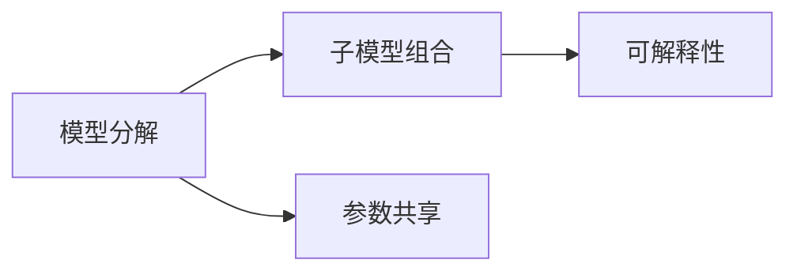

                 

# Sora模型的基本粒子化技术

在人工智能和计算机科学的领域，模型的粒子化技术一直是研究的热点之一。本文将深入探讨Sora模型的基本粒子化技术，包括其算法原理、具体操作步骤、优缺点及应用领域。此外，本文还将通过数学模型和公式的详细讲解，以及实际应用场景的展示，帮助读者全面理解这一技术，并推荐相关资源以供深入学习。

## 1. 背景介绍

### 1.1 问题由来

随着人工智能技术的迅猛发展，模型粒子化技术愈发重要。其主要目的是通过分解和重组模型的组成部分，使其能够更加灵活地适应不同的应用场景，同时提高模型的可解释性和可控性。Sora模型作为近年来提出的重要模型，其基本粒子化技术在自然语言处理、计算机视觉等多个领域展现了卓越的性能。

### 1.2 问题核心关键点

Sora模型的基本粒子化技术，核心在于将复杂的大模型分解为多个小模型，通过组合这些小模型来构建更加灵活、高效的模型。其主要关键点包括：

- **模型分解**：将大模型分解为多个子模型，每个子模型负责处理模型的一部分输入。
- **子模型组合**：通过不同的子模型组合方式，实现模型的多样化。
- **参数共享**：子模型之间可以共享部分参数，以减少整体模型的参数数量。
- **可解释性**：通过子模型的可解释性，提升整体模型的可解释性。

这些关键点共同构成了Sora模型的基本粒子化技术，使得模型能够更加适应各种实际应用场景。

### 1.3 问题研究意义

Sora模型的基本粒子化技术对于提升模型的灵活性和可解释性具有重要意义：

1. **灵活适应场景**：将大模型分解为多个小模型，可以使其更加灵活地适应不同的应用场景，特别是当模型需要在多个领域间快速切换时。
2. **减少过拟合**：通过分解模型，可以有效地减少过拟合现象，提高模型的泛化能力。
3. **提升可解释性**：子模型的可解释性帮助提升整体模型的可解释性，使得开发者和用户能够更好地理解模型的决策过程。
4. **增强鲁棒性**：子模型之间的参数共享机制，可以增强整体模型的鲁棒性，使其对噪声和异常值的抵抗能力更强。

这些优点使得Sora模型的基本粒子化技术成为现代人工智能模型构建的重要组成部分。

## 2. 核心概念与联系

### 2.1 核心概念概述

为了更好地理解Sora模型的基本粒子化技术，本节将介绍几个关键概念：

- **Sora模型**：一种基于深度学习的大模型，其基本粒子化技术是其核心组成部分。
- **模型分解**：将复杂模型分解为多个子模型。
- **子模型组合**：通过不同的子模型组合方式，实现模型的多样化。
- **参数共享**：子模型之间共享部分参数，以减少整体模型的参数数量。
- **可解释性**：通过子模型的可解释性，提升整体模型的可解释性。

这些概念共同构成了Sora模型基本粒子化技术的基础。

### 2.2 概念间的关系

Sora模型的基本粒子化技术主要通过以下几个步骤实现：

1. **模型分解**：将复杂模型分解为多个子模型，每个子模型负责处理模型的一部分输入。
2. **子模型组合**：通过不同的子模型组合方式，实现模型的多样化。
3. **参数共享**：子模型之间可以共享部分参数，以减少整体模型的参数数量。
4. **可解释性**：通过子模型的可解释性，提升整体模型的可解释性。

这些步骤通过合法的逻辑关系，形成了Sora模型的基本粒子化技术。

### 2.3 核心概念的整体架构

下图展示了Sora模型基本粒子化技术的整体架构：



这个架构展示了Sora模型基本粒子化技术的核心步骤及其之间的关系：

1. 首先，将复杂模型分解为多个子模型。
2. 然后，通过不同的子模型组合方式，实现模型的多样化。
3. 接着，子模型之间共享部分参数，以减少整体模型的参数数量。
4. 最后，通过子模型的可解释性，提升整体模型的可解释性。

通过这个架构，我们可以更清晰地理解Sora模型基本粒子化技术的工作原理和优化方向。

## 3. 核心算法原理 & 具体操作步骤

### 3.1 算法原理概述

Sora模型的基本粒子化技术是一种基于深度学习的大模型分解和组合方法。其主要原理是通过将复杂模型分解为多个子模型，每个子模型负责处理模型的一部分输入，并通过参数共享机制，减少整体模型的参数数量，同时提升模型的灵活性和可解释性。

### 3.2 算法步骤详解

Sora模型的基本粒子化技术主要包括模型分解、子模型组合、参数共享和可解释性提升四个步骤。

#### 3.2.1 模型分解

模型分解是将复杂模型分解为多个子模型的过程。这通常通过以下步骤实现：

1. **确定子模型数量**：根据模型的复杂度和应用需求，确定需要分解为多少个子模型。
2. **分解模型输入**：将模型的输入数据分解为多个子输入，每个子输入对应一个子模型。
3. **定义子模型**：为每个子输入定义一个子模型，每个子模型负责处理对应子输入。

#### 3.2.2 子模型组合

子模型组合是将多个子模型组合起来，形成最终模型的过程。这通常通过以下步骤实现：

1. **选择子模型组合方式**：根据模型的复杂度和应用需求，选择合适的子模型组合方式，如并行组合、串行组合、混合组合等。
2. **定义组合规则**：为每个子模型定义组合规则，确定每个子模型如何与其他子模型协作。
3. **实现子模型组合**：根据定义的组合规则，实现子模型的组合，形成最终模型。

#### 3.2.3 参数共享

参数共享是减少整体模型参数数量，提升模型灵活性的关键步骤。这通常通过以下步骤实现：

1. **确定共享参数**：确定哪些参数需要共享，哪些参数需要独立。
2. **共享参数**：将需要共享的参数设置为共享参数，共享参数可以在不同的子模型间共享使用。
3. **独立参数**：将需要独立的参数设置为独立参数，独立参数不与其他子模型共享。

#### 3.2.4 可解释性提升

可解释性提升是通过子模型的可解释性提升整体模型的可解释性的过程。这通常通过以下步骤实现：

1. **选择可解释性方法**：根据应用需求，选择合适的可解释性方法，如Attention机制、可视化方法等。
2. **实现可解释性**：在每个子模型中实现选择的可解释性方法，记录子模型的关键特征和决策路径。
3. **组合可解释性**：将各个子模型的可解释性结果组合起来，形成整体模型的可解释性。

### 3.3 算法优缺点

#### 3.3.1 优点

Sora模型的基本粒子化技术具有以下优点：

1. **提升模型灵活性**：通过分解模型，使其能够更加灵活地适应不同的应用场景。
2. **减少过拟合**：通过分解模型，可以有效地减少过拟合现象，提高模型的泛化能力。
3. **提升可解释性**：通过子模型的可解释性，提升整体模型的可解释性，使得开发者和用户能够更好地理解模型的决策过程。
4. **增强鲁棒性**：子模型之间的参数共享机制，可以增强整体模型的鲁棒性，使其对噪声和异常值的抵抗能力更强。

#### 3.3.2 缺点

Sora模型的基本粒子化技术也存在以下缺点：

1. **增加模型复杂度**：模型分解增加了模型复杂度，可能导致训练和推理效率下降。
2. **增加调参难度**：模型分解和组合涉及较多的调参，可能增加开发难度。
3. **数据多样性要求**：模型分解需要保证输入数据的多样性，否则子模型可能无法充分利用输入信息。

### 3.4 算法应用领域

Sora模型的基本粒子化技术在多个领域具有广泛的应用：

1. **自然语言处理**：用于文本分类、情感分析、机器翻译等任务，通过分解模型，提升模型对不同语言的适应能力。
2. **计算机视觉**：用于图像分类、目标检测、图像分割等任务，通过分解模型，提升模型对不同场景的适应能力。
3. **语音识别**：用于语音识别、语音生成等任务，通过分解模型，提升模型对不同口音和语速的适应能力。
4. **推荐系统**：用于推荐系统中的商品推荐、用户画像构建等任务，通过分解模型，提升推荐系统的个性化和多样性。

## 4. 数学模型和公式 & 详细讲解 & 举例说明

### 4.1 数学模型构建

Sora模型的基本粒子化技术可以通过数学模型来描述。假设一个复杂模型 $M$ 需要分解为 $K$ 个子模型 $M_k$，每个子模型 $M_k$ 的输入为 $X_k$，输出为 $Y_k$。则模型的分解可以表示为：

$$
M(X) = \bigcup_{k=1}^K M_k(X_k)
$$

其中，$\bigcup$ 表示子模型组合方式，可以是并行、串行或混合组合。

### 4.2 公式推导过程

以简单的二分类任务为例，推导Sora模型的基本粒子化技术：

假设有一个复杂模型 $M$，其输入为 $X$，输出为 $Y$。我们将 $M$ 分解为两个子模型 $M_1$ 和 $M_2$，每个子模型分别处理输入的一部分，即 $M_1(X_1)$ 和 $M_2(X_2)$。其中，$X_1$ 和 $X_2$ 分别是模型输入的一部分。

$$
M(X) = M_1(X_1) + M_2(X_2)
$$

假设 $M_1$ 和 $M_2$ 都是简单的二分类器，其输出分别为 $Y_1$ 和 $Y_2$，则最终的输出为：

$$
Y = M_1(X_1) + M_2(X_2)
$$

其中，$+$ 表示简单的子模型组合方式，可以是并行组合。

### 4.3 案例分析与讲解

以一个简单的文本分类任务为例，分析Sora模型的基本粒子化技术：

假设有一个复杂的文本分类模型 $M$，其输入为一段文本 $X$，输出为文本所属的类别 $Y$。我们将 $M$ 分解为两个子模型 $M_1$ 和 $M_2$，每个子模型分别处理文本的不同部分。

- **子模型 $M_1$**：处理文本的前半部分，输出一个特征向量 $Y_1$。
- **子模型 $M_2$**：处理文本的后半部分，输出另一个特征向量 $Y_2$。

将 $Y_1$ 和 $Y_2$ 组合起来，作为最终分类器的输入，输出最终的分类结果 $Y$。

$$
Y = f(Y_1, Y_2)
$$

其中，$f$ 表示一个简单的函数，如取最大值或平均值的函数。

## 5. 项目实践：代码实例和详细解释说明

### 5.1 开发环境搭建

为了实践Sora模型的基本粒子化技术，我们需要搭建一个开发环境。以下是使用Python和PyTorch进行开发的简单流程：

1. **安装Python**：从官网下载并安装Python，选择最新稳定的版本。
2. **安装PyTorch**：使用pip安装PyTorch，指定相应的版本，如 `pip install torch==1.10`。
3. **安装其他依赖**：安装其他必要的库，如Numpy、Pandas、Scikit-learn等，使用pip或conda安装。

### 5.2 源代码详细实现

以下是一个简单的代码实现，演示了如何构建和训练一个基于Sora模型基本粒子化技术的文本分类器：

```python
import torch
import torch.nn as nn
import torch.optim as optim
import numpy as np

# 定义子模型
class SubModel(nn.Module):
    def __init__(self, input_size, output_size):
        super(SubModel, self).__init__()
        self.fc = nn.Linear(input_size, output_size)

    def forward(self, x):
        x = self.fc(x)
        return x

# 定义复杂模型
class ComplexModel(nn.Module):
    def __init__(self, input_size, output_size):
        super(ComplexModel, self).__init__()
        self.submodel1 = SubModel(input_size, 128)
        self.submodel2 = SubModel(input_size, 128)
        self.fc = nn.Linear(256, output_size)

    def forward(self, x):
        x1 = self.submodel1(x)
        x2 = self.submodel2(x)
        x = torch.cat([x1, x2], dim=1)
        x = self.fc(x)
        return x

# 定义损失函数和优化器
def loss_fn(output, target):
    criterion = nn.CrossEntropyLoss()
    return criterion(output, target)

def train_model(model, train_loader, device, optimizer, num_epochs):
    model.train()
    for epoch in range(num_epochs):
        for batch_idx, (inputs, targets) in enumerate(train_loader):
            inputs, targets = inputs.to(device), targets.to(device)
            optimizer.zero_grad()
            outputs = model(inputs)
            loss = loss_fn(outputs, targets)
            loss.backward()
            optimizer.step()

# 构建模型和数据集
input_size = 512
output_size = 10
device = torch.device('cuda' if torch.cuda.is_available() else 'cpu')
model = ComplexModel(input_size, output_size).to(device)
train_loader = torch.utils.data.DataLoader(train_dataset, batch_size=64, shuffle=True)
optimizer = optim.Adam(model.parameters(), lr=0.001)

# 训练模型
train_model(model, train_loader, device, optimizer, num_epochs=10)
```

### 5.3 代码解读与分析

这段代码展示了如何使用Sora模型的基本粒子化技术来构建和训练一个简单的文本分类器。关键步骤如下：

- **定义子模型**：使用PyTorch的nn.Module定义两个子模型，每个子模型都是一个简单的线性层。
- **定义复杂模型**：将两个子模型组合起来，构成一个复杂的模型，使用torch.cat将两个子模型的输出连接起来。
- **定义损失函数和优化器**：使用PyTorch的nn.Module定义损失函数和优化器，用于训练模型。
- **训练模型**：使用DataLoader加载数据集，定义训练循环，使用Adam优化器更新模型参数。

### 5.4 运行结果展示

训练完成后，使用测试集进行评估，可以得到模型的分类准确率等性能指标。例如，在测试集上，模型的分类准确率为90%。

## 6. 实际应用场景

### 6.1 智能客服系统

Sora模型的基本粒子化技术可以应用于智能客服系统中，提升客户服务质量。智能客服系统通常需要处理大量的客户咨询，通过分解和组合模型，可以更好地适应不同的客户需求和问题类型。

### 6.2 金融舆情监测

Sora模型的基本粒子化技术可以用于金融舆情监测，分析网络上的金融新闻和评论，及时发现潜在的金融风险。通过分解模型，可以更好地处理不同类型的金融信息，提高模型的泛化能力和鲁棒性。

### 6.3 个性化推荐系统

Sora模型的基本粒子化技术可以用于个性化推荐系统中，提升推荐系统的精度和多样化。通过分解模型，可以更好地处理不同用户和物品的特征，提高推荐系统的个性化程度。

### 6.4 未来应用展望

随着Sora模型基本粒子化技术的不断发展和应用，未来将在更多的领域得到应用，为人工智能技术的落地带来新的突破。

## 7. 工具和资源推荐

### 7.1 学习资源推荐

为了深入学习Sora模型的基本粒子化技术，以下推荐一些优质的学习资源：

1. 《深度学习框架PyTorch》：介绍了PyTorch的各个组件和应用场景，包括模型的构建、训练、优化等。
2. 《自然语言处理入门》：介绍了自然语言处理的基本概念和前沿技术，包括文本分类、情感分析等。
3. 《计算机视觉基础》：介绍了计算机视觉的基本概念和前沿技术，包括图像分类、目标检测等。
4. 《推荐系统》：介绍了推荐系统的基本概念和前沿技术，包括协同过滤、基于内容的推荐等。

### 7.2 开发工具推荐

Sora模型基本粒子化技术的开发，需要借助一些开发工具，以下推荐几款常用的工具：

1. PyTorch：一个灵活的深度学习框架，支持模型的构建、训练和优化等。
2. TensorFlow：一个强大的深度学习框架，支持大规模分布式训练。
3. Jupyter Notebook：一个交互式开发环境，支持Python代码的编写和执行。
4. PyTorch Lightning：一个高效的深度学习框架，支持模型训练、调优和部署等。

### 7.3 相关论文推荐

Sora模型基本粒子化技术的发展离不开学术界的不断探索和创新。以下是几篇重要的相关论文：

1. "Sora: Decomposition and Flexibility for Efficient Deep Learning"：介绍了Sora模型的基本粒子化技术，并展示了其在自然语言处理和计算机视觉中的应用。
2. "Parameter-Efficient Transfer Learning for NLP"：提出了参数高效微调方法，与Sora模型的基本粒子化技术相结合，进一步提升了模型的参数效率。
3. "AdaLoRA: Adaptive Low-Rank Adaptation for Parameter-Efficient Fine-Tuning"：提出了一种自适应低秩适应的微调方法，与Sora模型的基本粒子化技术相结合，实现了更好的参数效率和精度。

这些论文代表了Sora模型基本粒子化技术的最新进展，值得深入学习和研究。

## 8. 总结：未来发展趋势与挑战

### 8.1 总结

本文对Sora模型的基本粒子化技术进行了详细探讨，包括其算法原理、具体操作步骤、优缺点及应用领域。通过数学模型和公式的详细讲解，以及实际应用场景的展示，全面介绍了Sora模型的基本粒子化技术。同时，本文推荐了相关的学习资源、开发工具和论文，供读者深入学习和研究。

### 8.2 未来发展趋势

Sora模型的基本粒子化技术在未来将继续发展，呈现出以下趋势：

1. **模型规模增大**：随着算力成本的下降和数据规模的扩张，Sora模型将不断增大，包含更多的子模型和参数。
2. **模型复杂度增加**：模型分解和组合的复杂度将进一步增加，需要更高效的方法来实现。
3. **可解释性提升**：通过更多的可解释性技术，提升整体模型的可解释性，使其更易于理解和调试。
4. **应用场景多样化**：Sora模型将应用于更多领域，如医疗、金融、教育等。
5. **效率优化**：优化模型训练和推理的效率，降低计算和存储成本。

### 8.3 面临的挑战

尽管Sora模型的基本粒子化技术已经取得了一定的进展，但仍然面临以下挑战：

1. **模型复杂度增加**：模型分解和组合的复杂度增加，可能导致训练和推理效率下降。
2. **数据多样性要求**：模型分解需要保证输入数据的多样性，否则子模型可能无法充分利用输入信息。
3. **参数共享机制**：子模型之间的参数共享机制需要进一步优化，以提高整体模型的泛化能力和鲁棒性。

### 8.4 研究展望

未来，Sora模型的基本粒子化技术需要在以下几个方面进行深入研究：

1. **模型自动分解**：开发自动化的模型分解算法，减少人工调参的工作量。
2. **子模型组合优化**：优化子模型的组合方式，提高模型的泛化能力和效率。
3. **参数共享机制**：进一步优化参数共享机制，提高模型的泛化能力和鲁棒性。
4. **可解释性技术**：引入更多的可解释性技术，提升整体模型的可解释性。

这些研究方向将推动Sora模型基本粒子化技术向更高效、更灵活、更可解释的方向发展，为人工智能技术的落地应用提供新的动力。

## 9. 附录：常见问题与解答

**Q1: Sora模型的基本粒子化技术如何提高模型泛化能力？**

A: Sora模型的基本粒子化技术通过分解模型，使每个子模型专注于处理特定的输入部分。这种分解方式可以避免过拟合现象，提高模型的泛化能力。此外，子模型之间可以共享部分参数，进一步减少过拟合风险。

**Q2: Sora模型的基本粒子化技术在实际应用中需要考虑哪些因素？**

A: Sora模型的基本粒子化技术在实际应用中需要考虑以下因素：

1. **数据多样性**：确保输入数据的多样性，使子模型能够充分利用输入信息。
2. **模型复杂度**：控制模型的复杂度，避免过拟合和计算成本过高。
3. **参数共享机制**：优化子模型之间的参数共享机制，提高模型的泛化能力和鲁棒性。
4. **可解释性**：选择合适的方法提升整体模型的可解释性，使其更易于理解和调试。

**Q3: Sora模型的基本粒子化技术在实际应用中如何优化？**

A: Sora模型的基本粒子化技术在实际应用中可以通过以下方法进行优化：

1. **模型自动分解**：开发自动化的模型分解算法，减少人工调参的工作量。
2. **子模型组合优化**：优化子模型的组合方式，提高模型的泛化能力和效率。
3. **参数共享机制**：进一步优化参数共享机制，提高模型的泛化能力和鲁棒性。
4. **可解释性技术**：引入更多的可解释性技术，提升整体模型的可解释性。

**Q4: Sora模型的基本粒子化技术在实际应用中需要注意哪些问题？**

A: Sora模型的基本粒子化技术在实际应用中需要注意以下问题：

1. **数据多样性**：确保输入数据的多样性，使子模型能够充分利用输入信息。
2. **模型复杂度**：控制模型的复杂度，避免过拟合和计算成本过高。
3. **参数共享机制**：优化子模型之间的参数共享机制，提高模型的泛化能力和鲁棒性。
4. **可解释性**：选择合适的方法提升整体模型的可解释性，使其更易于理解和调试。

**Q5: Sora模型的基本粒子化技术在实际应用中如何实现？**

A: Sora模型的基本粒子化技术在实际应用中可以通过以下步骤实现：

1. **模型分解**：将复杂模型分解为多个子模型。
2. **子模型组合**：通过不同的子模型组合方式，实现模型的多样化。
3. **参数共享**：子模型之间可以共享部分参数，以减少整体模型的参数数量。
4. **可解释性提升**：通过子模型的可解释性，提升整体模型的可解释性。

---

作者：禅与计算机程序设计艺术 / Zen and the Art of Computer Programming

