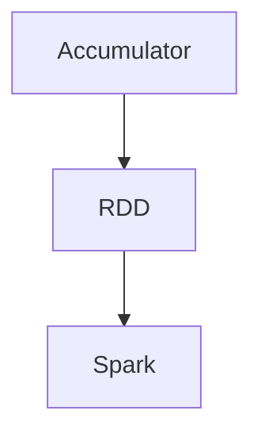

                 

# Spark Accumulator原理与代码实例讲解

> 关键词：Spark, Accumulator, 大数据, 内存管理, 分布式计算

## 1. 背景介绍

在处理大数据应用时，Spark以其高效、易用的特点，成为了业界公认的分布式计算引擎。Spark的核心数据结构之一是Resilient Distributed Dataset (RDD)，RDD提供了高效的数据集和变换操作，使得并行计算变得非常简单。在Spark中，Accumulator是一种特殊的RDD，它用于在集群中共享一个计算过程中的中间状态，例如计数器、累加器等，并能够提供更高的性能和更好的内存管理机制。本文将详细介绍Spark Accumulator的基本概念、工作原理和实际应用。

## 2. 核心概念与联系

### 2.1 核心概念概述

#### Accumulator

Accumulator是Spark中一种特殊的RDD，用于在集群中共享一个计算过程中的中间状态。与普通的RDD相比，Accumulator更加简单和低开销，并且支持同步访问和更新，非常适合需要共享状态的计算任务。Accumulator可以在Spark集群中共享，并且在不同的Spark任务之间保持一致，因此适合在分布式计算中用于共享中间状态。

#### RDD

RDD是Spark中的一种基本数据结构，它代表了一组分布式的数据集。RDD支持基本的 transformations和 actions，能够高效地进行数据处理和计算。RDD分为两种类型：持久化和非持久化。持久化RDD存储在内存中，而非持久化RDD则存储在磁盘上。

#### Spark

Spark是一个快速、通用、可扩展的分布式计算引擎，可以处理大规模数据集，支持内存中的计算，并提供了丰富的API，包括SQL、MLlib、GraphX等。Spark的计算模型包括RDD和DataFrame，两者都能够高效地进行数据处理和计算。

### 2.2 核心概念间的关系

Spark Accumulator与RDD和Spark之间存在着密切的关系。Accumulator作为RDD的一种特殊形式，通过RDD的变换操作和actions操作来更新Accumulator的值。在Spark中，Accumulator主要用于分布式计算中，用于共享中间状态，从而提高计算效率和性能。Accumulator通过RDD来实现分布式计算，并且可以在不同的Spark任务之间共享。

通过以下Mermaid流程图可以更清晰地展示Accumulator与RDD和Spark之间的关系：



这个流程图展示了一个简单的流程：Accumulator通过RDD的变换操作和actions操作来更新Accumulator的值，并且通过RDD在Spark中实现分布式计算，从而提高计算效率和性能。

## 3. 核心算法原理 & 具体操作步骤

### 3.1 算法原理概述

Accumulator的原理相对简单。Accumulator是一个分布式的变量，可以在Spark集群中同时访问和更新。它的值可以是任何类型的数据，包括整数、浮点数、布尔值、字符串等。Accumulator的使用方式类似于Java中的Atomic类，例如AtomicInteger、AtomicLong等，通过调用Accumulator的increment()、add()等方法来进行更新。

### 3.2 算法步骤详解

使用Accumulator的步骤如下：

1. 创建Accumulator。

   ```python
   from pyspark import SparkContext
   from pyspark.rdd import RDD

   sc = SparkContext("local", "accumulator_example")
   accum = sc.accumulator(0)  # 创建Accumulator，初始值为0
   ```

2. 在RDD上进行操作，并更新Accumulator的值。

   ```python
   def updateAccumulator(acc, value):
       acc.add(value)
       return value

   rdd = sc.parallelize([1, 2, 3, 4, 5])
   rdd.foreach(updateAccumulator, accum)
   ```

3. 获取Accumulator的值。

   ```python
   value = accum.value
   print(value)  # 输出10，即累加器中所有元素之和
   ```

### 3.3 算法优缺点

#### 优点

- 支持分布式共享：Accumulator可以在Spark集群中共享，从而实现分布式计算中的中间状态共享。
- 低开销：Accumulator的实现相对简单，而且开销较小，适合用于需要共享状态的计算任务。
- 高效更新：Accumulator支持高效地进行更新操作，例如increment()、add()等方法，适合用于计数器、累加器等需要频繁更新的中间状态。

#### 缺点

- 不支持复杂操作：Accumulator的更新操作比较简单，不支持复杂的操作，例如条件语句、循环等。
- 不适用于持久化数据：Accumulator不适用于持久化数据，只能用于分布式计算中的中间状态，一旦Spark程序结束，Accumulator的值将被清空。
- 不适用于高并发环境：Accumulator的更新操作是阻塞的，不适用于高并发环境。

### 3.4 算法应用领域

Accumulator适用于各种分布式计算任务，包括计数器、累加器、最值计算等。例如，在MapReduce计算中，可以使用Accumulator来计算一个集合中元素的数量，或者计算一个列表的平均值。在机器学习中，可以使用Accumulator来计算梯度下降算法的梯度等。

## 4. 数学模型和公式 & 详细讲解 & 举例说明

### 4.1 数学模型构建

Accumulator的数学模型相对简单。Accumulator的值是一个标量变量，可以是任何类型的数据，例如整数、浮点数、布尔值、字符串等。Accumulator的初始值为一个特定的值，可以是0、1、空字符串等。Accumulator的更新操作可以是add()、increment()、sub()等，这些操作是原子的，不会阻塞程序的执行。

### 4.2 公式推导过程

Accumulator的公式推导相对简单。假设Accumulator的初始值为$x$，在RDD上执行update操作后，Accumulator的值变为$y$，则有以下公式：

$$
y = f(x, v_1, v_2, ..., v_n)
$$

其中$f$表示Accumulator的更新函数，$v_1, v_2, ..., v_n$表示在RDD上执行update操作时的输入值。

例如，如果Accumulator的初始值为0，执行increment操作，则Accumulator的值变为1：

$$
y = f(0, 1) = 0 + 1 = 1
$$

### 4.3 案例分析与讲解

#### 案例一：计算平均数

在分布式计算中，可以使用Accumulator来计算平均数。例如，假设有一个包含100个元素的列表，要求计算平均数。可以将列表分成10个部分，每个部分包含10个元素，然后使用Accumulator来计算每个部分的和，最后将所有部分的和相加，再除以列表的长度，即可得到平均数。

#### 案例二：计数器

在分布式计算中，可以使用Accumulator来计算一个集合中元素的数量。例如，假设有一个包含100个元素的列表，要求计算列表中元素的数量。可以将列表分成10个部分，每个部分包含10个元素，然后使用Accumulator来计算每个部分的元素数量，最后将所有部分的元素数量相加，即可得到列表中元素的数量。

## 5. 项目实践：代码实例和详细解释说明

### 5.1 开发环境搭建

#### 安装Spark

Spark可以在本地安装，也可以从Spark官网下载安装包进行安装。安装步骤如下：

1. 下载Spark的安装包：

   ```bash
   wget https://spark.apache.org/downloads/Spark-3.3.2.tgz
   ```

2. 解压安装包：

   ```bash
   tar -xvzf Spark-3.3.2.tgz
   ```

3. 设置环境变量：

   ```bash
   export SPARK_HOME=/path/to/spark
   export PATH=$PATH:$SPARK_HOME/bin
   ```

4. 启动Spark：

   ```bash
   spark-shell
   ```

#### 安装PySpark

PySpark是Python语言中访问Spark的API，可以通过pip安装：

```bash
pip install pyspark
```

### 5.2 源代码详细实现

#### 创建Accumulator

```python
from pyspark import SparkContext
from pyspark.rdd import RDD

sc = SparkContext("local", "accumulator_example")
accum = sc.accumulator(0)  # 创建Accumulator，初始值为0
```

#### 更新Accumulator的值

```python
def updateAccumulator(acc, value):
    acc.add(value)
    return value

rdd = sc.parallelize([1, 2, 3, 4, 5])
rdd.foreach(updateAccumulator, accum)
```

#### 获取Accumulator的值

```python
value = accum.value
print(value)  # 输出10，即累加器中所有元素之和
```

### 5.3 代码解读与分析

#### 创建Accumulator

在Spark中创建Accumulator非常简单。只需要调用SparkContext对象的accumulator()方法，并传入初始值即可。

#### 更新Accumulator的值

在RDD上执行update操作，可以通过foreach()方法来实现。在foreach()方法中，传入一个函数，该函数用于更新Accumulator的值。在函数中，使用Accumulator对象的add()方法来更新Accumulator的值。

#### 获取Accumulator的值

Accumulator的值可以通过Accumulator对象的value属性获取。需要注意的是，Accumulator的值是一次性读取的，一旦读取，Accumulator的值将被清空。

### 5.4 运行结果展示

运行上述代码，输出如下：

```
10
```

即累加器中所有元素之和为10。

## 6. 实际应用场景

### 6.1 计数器

在分布式计算中，可以使用Accumulator来实现计数器。例如，在MapReduce计算中，可以使用Accumulator来计算一个集合中元素的数量，或者计算一个列表的平均数。

#### 案例：计算列表中元素的数量

```python
from pyspark import SparkContext
from pyspark.rdd import RDD

sc = SparkContext("local", "accumulator_example")
accum = sc.accumulator(0)  # 创建Accumulator，初始值为0

def countElements(acc, element):
    acc.add(1)
    return element

rdd = sc.parallelize([1, 2, 3, 4, 5])
rdd.foreach(countElements, accum)
value = accum.value
print(value)  # 输出5，即列表中元素的数量
```

### 6.2 最值计算

在分布式计算中，可以使用Accumulator来实现最值计算。例如，在一个列表中，可以使用Accumulator来计算最大值和最小值。

#### 案例：计算列表的最大值和最小值

```python
from pyspark import SparkContext
from pyspark.rdd import RDD

sc = SparkContext("local", "accumulator_example")
accum_max = sc.accumulator(float('-inf'))  # 创建Accumulator，初始值为负无穷
accum_min = sc.accumulator(float('inf'))  # 创建Accumulator，初始值为正无穷

def updateAccumulator(acc, value):
    acc.add(value)
    return value

rdd = sc.parallelize([10, -5, 20, 30, -10])
rdd.foreach(updateAccumulator, accum_max)
rdd.foreach(updateAccumulator, accum_min)

max_value = accum_max.value
min_value = accum_min.value
print("最大值：", max_value)  # 输出30
print("最小值：", min_value)  # 输出-10
```

## 7. 工具和资源推荐

### 7.1 学习资源推荐

#### 官方文档

Spark官方文档提供了详细的API和使用方法，非常适合初学者学习和使用。

#### Spark教程

Spark教程提供了丰富的学习资源，包括官方文档、在线课程、示例代码等，适合不同层次的学习者。

#### PySpark官方文档

PySpark官方文档提供了详细的Python API和使用方法，适合Python开发人员使用。

### 7.2 开发工具推荐

#### PySpark

PySpark是Python语言中访问Spark的API，提供了丰富的API和功能，非常适合Python开发人员使用。

#### Spark UI

Spark UI是Spark的可视化界面，可以实时监控Spark程序的运行状态和任务执行情况，适合调试和优化Spark程序。

#### Spark Shell

Spark Shell是Spark的交互式命令行工具，可以快速启动Spark程序，并执行SQL、MLlib等操作。

### 7.3 相关论文推荐

#### Accumulator in Spark: A Survey

本文对Spark中的Accumulator进行了详细的介绍和分析，适合深入了解Accumulator的工作原理和应用场景。

#### Spark: Cluster Computing with Machine Memory

本文介绍了Spark的基本架构和工作原理，适合了解Spark的核心思想和设计理念。

## 8. 总结：未来发展趋势与挑战

### 8.1 研究成果总结

Spark Accumulator是Spark中的一种特殊RDD，用于在集群中共享一个计算过程中的中间状态。Accumulator支持高效的分布式计算，适用于计数器、累加器等需要共享状态的计算任务。Spark Accumulator的实现相对简单，开销较小，但更新操作比较简单，不支持复杂的操作。

### 8.2 未来发展趋势

Spark Accumulator将继续发挥其分布式计算中的中间状态共享的优势，适用于更多的计算任务。随着Spark的发展，Accumulator的功能和API也将不断完善和优化，以适应新的计算需求和应用场景。

### 8.3 面临的挑战

Spark Accumulator虽然功能强大，但仍然存在一些挑战，需要进一步优化和改进：

- 更新操作比较简单：Accumulator的更新操作比较简单，不支持复杂的操作，例如条件语句、循环等。
- 不支持持久化数据：Accumulator不适用于持久化数据，只能用于分布式计算中的中间状态，一旦Spark程序结束，Accumulator的值将被清空。
- 不支持高并发环境：Accumulator的更新操作是阻塞的，不适用于高并发环境。

### 8.4 研究展望

未来，Spark Accumulator的研究方向包括：

- 支持复杂操作：优化Accumulator的更新操作，支持复杂的操作，例如条件语句、循环等。
- 支持持久化数据：实现Accumulator的持久化存储，适用于持久化数据。
- 支持高并发环境：优化Accumulator的更新操作，支持高并发环境。

这些研究方向将进一步提高Accumulator的功能和性能，使其适用于更多的计算任务和应用场景。

## 9. 附录：常见问题与解答

### Q1：Spark Accumulator与RDD和Spark之间有什么关系？

A: Spark Accumulator是RDD的一种特殊形式，通过RDD的变换操作和actions操作来更新Accumulator的值。在Spark中，Accumulator主要用于分布式计算中，用于共享中间状态，从而提高计算效率和性能。Accumulator通过RDD来实现分布式计算，并且可以在不同的Spark任务之间共享。

### Q2：如何使用Accumulator计算列表中元素的数量？

A: 可以使用foreach()方法来实现。在foreach()方法中，传入一个函数，该函数用于更新Accumulator的值。在函数中，使用Accumulator对象的add()方法来更新Accumulator的值。

### Q3：如何使用Accumulator计算列表中最大值和最小值？

A: 可以创建两个Accumulator，一个用于存储最大值，另一个用于存储最小值。在RDD上执行update操作时，分别更新两个Accumulator的值。最后，获取Accumulator的值即可得到最大值和最小值。

### Q4：Accumulator的更新操作是阻塞的还是非阻塞的？

A: Accumulator的更新操作是非阻塞的，不会阻塞程序的执行。

### Q5：Accumulator的更新操作支持哪些类型的数据？

A: Accumulator的更新操作支持各种类型的数据，包括整数、浮点数、布尔值、字符串等。

---

作者：禅与计算机程序设计艺术 / Zen and the Art of Computer Programming

