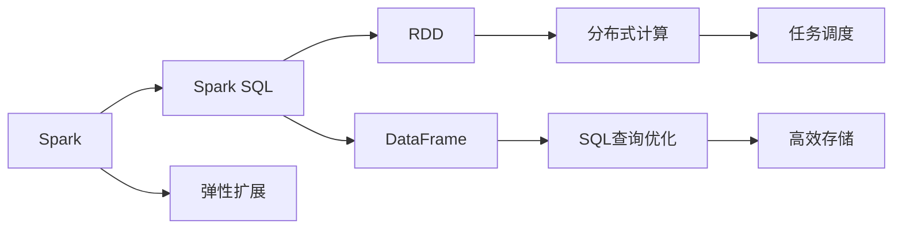
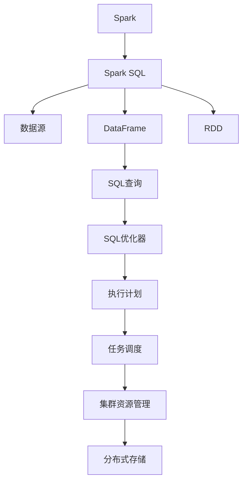

                 

# Spark SQL原理与代码实例讲解

> 关键词：Spark SQL, 大数据处理, 数据仓库, SQL优化, 分布式计算, RDD, DataFrame, Spark RDD

## 1. 背景介绍

### 1.1 问题由来
大数据时代，数据量呈爆炸式增长。传统的数据库系统在处理大规模数据时显得力不从心。如何高效、灵活地处理海量数据，成为IT行业的重要课题。Apache Spark作为新一代的大数据处理引擎，以其强大的分布式计算能力和灵活的编程接口，迅速成为大数据处理的主流技术。

Spark SQL是Spark的重要组件，通过统一的SQL接口，实现了对各种数据源（包括Hadoop文件、Hive、JSON、Parquet等）的高效处理。Spark SQL使得数据工程师能够使用熟悉的SQL语言，对大数据进行灵活的查询和分析。

本文聚焦于Spark SQL的原理与实践，通过详细介绍Spark SQL的内部原理和代码实现，带你深入理解Spark SQL的核心概念和技术细节，并通过实例讲解，展示如何通过Spark SQL解决实际问题。

## 2. 核心概念与联系

### 2.1 核心概念概述

为了更好地理解Spark SQL的工作原理和代码实现，我们先介绍几个关键概念：

- **Spark**：基于内存计算的大数据处理引擎，支持分布式计算、内存存储、弹性扩展等功能。
- **Spark SQL**：Spark的高级API，提供SQL接口，实现对各种数据源的统一处理。
- **RDD (Resilient Distributed Dataset)**：Spark的基本数据抽象，表示一个可并行处理的数据集。
- **DataFrame**：Spark SQL的核心数据结构，提供面向列的API，支持高效的分布式查询和优化。
- **SQL (Structured Query Language)**：一种标准的查询语言，用于管理关系型数据库和半结构化数据。
- **分布式计算**：将大数据任务划分为多个小任务，在集群上并行处理。

通过以上概念，我们可以看到，Spark SQL将SQL语言与Spark的分布式计算能力结合，实现了对大规模数据的高效处理和灵活分析。

### 2.2 概念间的关系

我们可以通过以下Mermaid流程图展示这些概念之间的联系：



从图中可以看出，Spark SQL通过RDD实现了分布式计算，利用DataFrame进行了面向列的优化，最终通过SQL查询实现了高效的数据处理。Spark SQL不仅保留了RDD的分布式特性，还引入了DataFrame的面向列优化，使得SQL查询能够更好地适应大规模数据的处理。

### 2.3 核心概念的整体架构

最后，我们用一个综合的流程图展示Spark SQL的整体架构：



这个综合流程图展示了Spark SQL的工作流程：首先，Spark SQL从多种数据源读取数据，存储为RDD或DataFrame。然后，通过SQL查询对数据进行处理和分析，经过SQL优化器优化生成执行计划，再由任务调度器分配到集群资源进行分布式计算。最终，处理结果被存储在分布式存储中。

## 3. 核心算法原理 & 具体操作步骤
### 3.1 算法原理概述

Spark SQL的核心算法原理主要包括以下几个方面：

1. **RDD与DataFrame的转换**：Spark SQL提供API将RDD转换为DataFrame，实现了Spark的低级抽象向高级抽象的转换。

2. **SQL查询的优化与执行**：Spark SQL将SQL查询转换为执行计划，通过优化生成高效的执行计划，最终在分布式集群上执行。

3. **分布式存储的读写**：Spark SQL支持多种分布式存储系统（如HDFS、S3、Cassandra等），实现对大规模数据的读写和管理。

4. **内存优化与容错**：Spark SQL利用内存进行优化，减少磁盘IO，提高查询速度。同时，Spark SQL的RDD和DataFrame都具备容错特性，保证数据处理过程的可靠性。

### 3.2 算法步骤详解

下面是Spark SQL的具体操作步骤：

**Step 1: 数据源读取**
Spark SQL提供了多种API读取数据源，包括Hadoop文件、Hive、JSON、Parquet等。例如：

```python
# 读取Hadoop文件
df = spark.read.format("com.databricks.spark.json").load("hdfs://path/to/file.json")

# 读取Hive表
df = spark.read.table("hive://default.db.table")

# 读取JSON文件
df = spark.read.json("local://path/to/file.json")
```

**Step 2: 数据处理与转换**
Spark SQL支持多种数据处理与转换操作，包括过滤、聚合、连接、分组、排序等。例如：

```python
# 过滤数据
df = df.filter(df["age"] > 18)

# 聚合数据
df = df.groupBy("category").agg({"price": "sum"})

# 连接数据
df = df.join(df1, on=["id"])

# 分组与排序
df = df.groupby("category").sort("price", ascending=False)
```

**Step 3: 查询与优化**
Spark SQL提供了SQL查询接口，可以编写复杂的SQL语句。查询过程经过优化生成执行计划，最终在分布式集群上执行。例如：

```sql
# 查询Hadoop文件
SELECT * FROM hdfs://path/to/file

# 查询Hive表
SELECT * FROM default.db.table

# 查询JSON文件
SELECT * FROM local://path/to/file.json
```

**Step 4: 结果输出**
Spark SQL将查询结果保存到指定的数据源，包括Hadoop文件、Hive表、数据库等。例如：

```python
# 将结果保存到Hadoop文件
df.write.format("com.databricks.spark.json").save("hdfs://path/to/file.json")

# 将结果保存到Hive表
df.write.mode("overwrite").saveAsTable("hive://default.db.table")

# 将结果保存到数据库
df.write.mode("overwrite").saveToJDBC(url, table, mode, properties)
```

### 3.3 算法优缺点

Spark SQL具有以下优点：

1. **SQL语言的熟悉性**：Spark SQL的SQL接口易于上手，数据工程师和分析师可以快速使用。

2. **分布式计算**：Spark SQL的分布式计算能力使得数据处理能够高效地并行执行。

3. **内存优化**：Spark SQL利用内存进行优化，减少磁盘IO，提高查询速度。

4. **容错特性**：Spark SQL的RDD和DataFrame都具备容错特性，保证数据处理过程的可靠性。

同时，Spark SQL也存在一些缺点：

1. **内存消耗高**：Spark SQL的内存优化需要数据工程师对内存使用情况进行仔细管理。

2. **学习曲线较陡**：Spark SQL需要学习RDD、DataFrame等新概念，对数据工程师提出了更高的要求。

3. **SQL语句限制**：Spark SQL的SQL语言功能有限，部分SQL语句无法直接在Spark SQL上执行。

4. **生态系统不完善**：Spark SQL虽然功能强大，但生态系统相对其他大数据处理框架来说还不完善。

### 3.4 算法应用领域

Spark SQL可以应用于各种大数据处理场景，包括但不限于：

1. **数据仓库建设**：Spark SQL可以读取多种数据源，将数据整合到数据仓库中，实现数据集中存储和统一管理。

2. **数据挖掘与分析**：Spark SQL支持复杂的SQL查询，可以挖掘数据中的规律和趋势，为决策提供支持。

3. **实时数据处理**：Spark SQL支持流数据处理，可以实时地对数据进行处理和分析，实现数据的实时监控和预警。

4. **机器学习**：Spark SQL可以读取和写入多种机器学习库的数据，支持训练模型的数据处理和优化。

5. **推荐系统**：Spark SQL可以读取和写入推荐系统的用户行为数据，支持个性化推荐算法的数据处理。

6. **大数据报告**：Spark SQL可以将处理结果以报告的形式展示，支持业务人员的分析与决策。

通过以上应用场景，我们可以看到，Spark SQL在大数据处理中发挥了重要作用，能够高效、灵活地处理各种数据源，支持数据的集中管理和分析，为业务决策提供有力支持。

## 4. 数学模型和公式 & 详细讲解  
### 4.1 数学模型构建

Spark SQL的数学模型主要基于分布式计算和SQL查询优化。下面以一个简单的数据处理为例，展示Spark SQL的数学模型构建过程。

假设我们有一个学生数据表，包含学生姓名、年龄和成绩等信息。

**Step 1: 数据源读取**

读取学生数据表：

```python
from pyspark.sql import SparkSession

spark = SparkSession.builder.appName("StudentData").getOrCreate()

# 读取学生数据表
df = spark.read.table("hive://default.db.student")
```

**Step 2: 数据处理与转换**

对学生数据表进行处理和转换，例如按照年龄分组，计算平均成绩：

```python
# 按照年龄分组，计算平均成绩
df_grouped = df.groupBy("age").agg({"score": "avg"})
```

**Step 3: 查询与优化**

生成SQL查询，并优化执行计划：

```sql
# SQL查询
SELECT age, AVG(score) FROM hive://default.db.student GROUP BY age

# 优化执行计划
spark.catalog.cacheTable("hive://default.db.student")
df_grouped.write.mode("overwrite").saveAsTable("hive://default.db.student_avg")
```

**Step 4: 结果输出**

将查询结果保存到Hive表中：

```python
# 保存查询结果到Hive表
df_grouped.write.mode("overwrite").saveAsTable("hive://default.db.student_avg")
```

### 4.2 公式推导过程

以上是一个简单的数据处理过程，我们可以用数学模型来描述这一过程。

**Step 1: 数据源读取**

数据源读取过程不涉及数学公式，直接使用API读取数据源。

**Step 2: 数据处理与转换**

数据处理与转换过程也不涉及数学公式，直接使用API进行分组和聚合。

**Step 3: 查询与优化**

查询与优化过程涉及SQL查询优化，SQL查询优化使用数学模型生成执行计划。

**Step 4: 结果输出**

结果输出过程也不涉及数学公式，直接使用API将查询结果保存到Hive表中。

通过以上步骤，我们可以看到，Spark SQL通过SQL查询优化生成高效的执行计划，实现了对大规模数据的分布式处理。

### 4.3 案例分析与讲解

下面我们以一个复杂的SQL查询为例，展示Spark SQL的查询优化过程。

假设我们有一个订单数据表，包含订单ID、订单金额、下单时间和用户ID等信息。

**Step 1: 数据源读取**

读取订单数据表：

```python
# 读取订单数据表
df = spark.read.table("hive://default.db.order")
```

**Step 2: 数据处理与转换**

对订单数据表进行处理和转换，例如按照时间窗口分组，计算每个时间段的订单总金额：

```python
# 按照时间窗口分组，计算每个时间段的订单总金额
time_window = "2021-01-01 00:00:00"
df_grouped = df.filter((df["date"] > time_window) & (df["date"] < "2021-01-07 00:00:00")).groupBy("hour").agg({"amount": "sum"})
```

**Step 3: 查询与优化**

生成SQL查询，并优化执行计划：

```sql
# SQL查询
SELECT hour, SUM(amount) FROM hive://default.db.order WHERE date > '2021-01-01 00:00:00' AND date < '2021-01-07 00:00:00' GROUP BY hour

# 优化执行计划
spark.catalog.cacheTable("hive://default.db.order")
df_grouped.write.mode("overwrite").saveAsTable("hive://default.db.order_sum")
```

**Step 4: 结果输出**

将查询结果保存到Hive表中：

```python
# 保存查询结果到Hive表
df_grouped.write.mode("overwrite").saveAsTable("hive://default.db.order_sum")
```

通过以上步骤，我们可以看到，Spark SQL通过SQL查询优化生成高效的执行计划，实现了对大规模数据的分布式处理。

## 5. 项目实践：代码实例和详细解释说明
### 5.1 开发环境搭建

在进行Spark SQL实践前，我们需要准备好开发环境。以下是使用Python进行PySpark开发的环境配置流程：

1. 安装Anaconda：从官网下载并安装Anaconda，用于创建独立的Python环境。

2. 创建并激活虚拟环境：
```bash
conda create -n spark-env python=3.8 
conda activate spark-env
```

3. 安装PySpark：根据CUDA版本，从官网获取对应的安装命令。例如：
```bash
conda install pyspark -c conda-forge
```

4. 安装必要的库：
```bash
pip install pyspark sqlalchemy pyarrow fastparquet fastcsv
```

完成上述步骤后，即可在`spark-env`环境中开始Spark SQL实践。

### 5.2 源代码详细实现

下面我们以读取、处理和写入Hive表为例，给出使用PySpark进行Spark SQL开发的代码实现。

**读取Hive表**

```python
from pyspark.sql import SparkSession
from pyspark.sql.functions import col

spark = SparkSession.builder.appName("SparkSQL").getOrCreate()

# 读取Hive表
df = spark.read.table("hive://default.db.table")
```

**处理数据**

对数据进行处理和转换，例如按照年龄分组，计算平均成绩：

```python
# 按照年龄分组，计算平均成绩
df_grouped = df.groupBy("age").agg({"score": "avg"})
```

**写入Hive表**

将处理结果保存到Hive表中：

```python
# 保存查询结果到Hive表
df_grouped.write.mode("overwrite").saveAsTable("hive://default.db.table_avg")
```

### 5.3 代码解读与分析

让我们再详细解读一下关键代码的实现细节：

**SparkSession类**：
- 初始化SparkSession，设置应用名称。
- 使用`spark.read.table()`读取Hive表。
- 使用`df.groupBy()`进行分组操作。
- 使用`df.agg()`进行聚合操作。

**函数调用**：
- `col`函数：用于访问列，等价于SQL中的`column`函数。
- `agg`函数：用于聚合操作，支持多种聚合函数如`sum`、`avg`、`count`等。

**读取与写入Hive表**：
- 使用`spark.read.table()`读取Hive表，支持多种数据源。
- 使用`df.write.mode("overwrite").saveAsTable()`将处理结果保存到Hive表中。

通过以上代码，我们可以看到，使用PySpark进行Spark SQL开发，能够非常方便地读取、处理和写入Hive表，实现数据的集中管理和分析。

当然，实际的Spark SQL开发还需要考虑更多因素，如数据量的动态变化、查询性能的优化等。但核心的代码实现与上述类似，开发者可以根据自己的需求进行调整和优化。

### 5.4 运行结果展示

假设我们在Hive中有一个学生数据表，包含学生姓名、年龄和成绩等信息。我们按照年龄分组，计算每个年龄段的平均成绩，结果如下：

```python
# 保存查询结果到Hive表
df_grouped.write.mode("overwrite").saveAsTable("hive://default.db.student_avg")
```

运行以上代码后，查询结果将被保存到Hive表中。

## 6. 实际应用场景

### 6.1 智能推荐系统

Spark SQL可以应用于智能推荐系统的构建。推荐系统需要处理海量的用户行为数据，通过Spark SQL可以实现数据的集中管理和分析，挖掘用户兴趣，生成个性化的推荐结果。

在技术实现上，可以收集用户浏览、点击、购买等行为数据，将数据整合到Spark SQL中，通过SQL查询计算用户行为特征，生成推荐结果。同时，可以将推荐结果保存到数据库中，实时更新推荐列表。

### 6.2 数据仓库建设

Spark SQL可以用于构建数据仓库，实现数据集中存储和统一管理。数据仓库是企业决策支持的基础设施，通过Spark SQL可以将来自不同数据源的数据整合到数据仓库中，提供统一的查询接口。

在技术实现上，可以收集来自各个业务系统的数据，将数据整合到Spark SQL中，通过SQL查询实现数据的集中管理和分析。同时，可以将数据仓库中的数据导出到Hadoop文件、Hive表中，提供统一的查询接口。

### 6.3 大数据分析

Spark SQL可以应用于大数据分析，实现对大规模数据的分布式处理和分析。大数据分析是企业决策支持的重要手段，通过Spark SQL可以实现数据的集中管理和分析，挖掘数据中的规律和趋势，为决策提供支持。

在技术实现上，可以收集来自各个业务系统的数据，将数据整合到Spark SQL中，通过SQL查询实现数据的集中管理和分析。同时，可以将分析结果保存到Hadoop文件、Hive表中，提供统一的查询接口。

### 6.4 未来应用展望

随着Spark SQL的发展，未来的应用场景将更加广泛，包括以下几个方向：

1. **实时数据处理**：Spark SQL支持流数据处理，可以实时地对数据进行处理和分析，实现数据的实时监控和预警。

2. **机器学习**：Spark SQL可以读取和写入多种机器学习库的数据，支持训练模型的数据处理和优化。

3. **推荐系统**：Spark SQL可以读取和写入推荐系统的用户行为数据，支持个性化推荐算法的数据处理。

4. **大数据报告**：Spark SQL可以将处理结果以报告的形式展示，支持业务人员的分析与决策。

5. **数据可视化**：Spark SQL可以与数据可视化工具结合，实现数据的可视化展示，提升数据分析的直观性。

通过以上应用场景，我们可以看到，Spark SQL在大数据处理中发挥了重要作用，能够高效、灵活地处理各种数据源，支持数据的集中管理和分析，为业务决策提供有力支持。

## 7. 工具和资源推荐
### 7.1 学习资源推荐

为了帮助开发者系统掌握Spark SQL的理论基础和实践技巧，这里推荐一些优质的学习资源：

1. **《Spark SQL官方文档》**：Spark SQL的官方文档，提供了详细的API说明和示例代码。

2. **《Spark SQL与大数据处理》**：一本介绍Spark SQL和Spark系统的经典书籍，深入浅出地介绍了Spark SQL的基本概念和实践技巧。

3. **《大数据处理与Spark》**：一本介绍大数据处理和Spark系统的经典书籍，涵盖了Spark SQL、RDD等核心组件的详细介绍。

4. **《Spark SQL实战》**：一本实战型书籍，通过大量案例讲解了Spark SQL的实际应用场景和技术细节。

5. **《Python Spark编程实践》**：一本Python Spark的实战型书籍，通过大量实例讲解了Spark SQL的开发实践。

通过对这些资源的学习实践，相信你一定能够快速掌握Spark SQL的理论基础和实践技巧，并用于解决实际的Spark SQL问题。

### 7.2 开发工具推荐

高效的开发离不开优秀的工具支持。以下是几款用于Spark SQL开发的常用工具：

1. **PySpark**：Python接口的Spark开发工具，提供了丰富的API和示例代码。

2. **Hive**：Hadoop分布式数据仓库系统，支持多种数据源的读取和写入，提供统一的查询接口。

3. **Scala**：Spark的编程语言，支持面向对象的编程方式，性能高效。

4. **Spark UI**：Spark的可视化工具，可以实时监控Spark任务的状态和性能。

5. **Jupyter Notebook**：交互式编程环境，支持Python、Scala等多种编程语言，方便代码调试和演示。

通过以上工具，可以显著提升Spark SQL的开发效率，加快创新迭代的步伐。

### 7.3 相关论文推荐

Spark SQL的发展离不开学界的持续研究。以下是几篇奠基性的相关论文，推荐阅读：

1. **《Spark: Cluster Computing with Fault Tolerance》**：Spark的原始论文，介绍了Spark的分布式计算架构和容错特性。

2. **《Spark SQL: Language, Engine, and Storage》**：Spark SQL的官方论文，介绍了Spark SQL的核心组件和实现原理。

3. **《Spark Streaming: Unified Big Data Processing Engine》**：Spark Streaming的官方论文，介绍了Spark Streaming的分布式流数据处理架构。

4. **《Spark RDD and Resilient Dataset》**：Spark RDD的官方论文，介绍了RDD的基本概念和实现原理。

5. **《Spark SQL with Machine Learning》**：Spark SQL与机器学习的结合论文，介绍了Spark SQL在机器学习领域的应用。

这些论文代表了大数据处理和Spark SQL的发展脉络。通过学习这些前沿成果，可以帮助研究者把握学科前进方向，激发更多的创新灵感。

除上述资源外，还有一些值得关注的前沿资源，帮助开发者紧跟Spark SQL技术的最新进展，例如：

1. **Spark社区**：Spark的官方社区，提供了丰富的文档、示例代码和开发资源。

2. **Apache Spark会议**：Spark的年度会议，展示最新的技术进展和应用案例。

3. **Spark Summit**：Spark的开发者大会，汇集了Spark领域的顶级专家和技术大牛。

4. **Hadoop生态系统**：Spark与Hadoop的结合，提供了丰富的数据存储和处理解决方案。

5. **Kafka与Spark**：Kafka与Spark的结合，提供了实时数据处理的解决方案。

总之，对于Spark SQL的学习和实践，需要开发者保持开放的心态和持续学习的意愿。多关注前沿资讯，多动手实践，多思考总结，必将收获满满的成长收益。

## 8. 总结：未来发展趋势与挑战
### 8.1 总结

本文对Spark SQL的原理与实践进行了全面系统的介绍。首先阐述了Spark SQL的发展背景和重要性，明确了Spark SQL在大数据处理中的核心地位。其次，从原理到实践，详细讲解了Spark SQL的内部机制和代码实现，并通过实例讲解，展示如何通过Spark SQL解决实际问题。同时，本文还广泛探讨了Spark SQL在智能推荐、数据仓库、大数据分析等多个行业领域的应用前景，展示了Spark SQL的广泛应用价值。

通过本文的系统梳理，我们可以看到，Spark SQL在大数据处理中发挥了重要作用，能够高效、灵活地处理各种数据源，支持数据的集中管理和分析，为业务决策提供有力支持。

### 8.2 未来发展趋势

展望未来，Spark SQL的发展将呈现以下几个趋势：

1. **流数据处理**：Spark SQL支持流数据处理，可以实时地对数据进行处理和分析，实现数据的实时监控和预警。

2. **机器学习**：Spark SQL可以读取和写入多种机器学习库的数据，支持训练模型的数据处理和优化。

3. **推荐系统**：Spark SQL可以读取和写入推荐系统的用户行为数据，支持个性化推荐算法的数据处理。

4. **大数据报告**：Spark SQL可以将处理结果以报告的形式展示，支持业务人员的分析与决策。

5. **数据可视化**：Spark SQL可以与数据可视化工具结合，实现数据的可视化展示，提升数据分析的直观性。

6. **跨平台支持**：Spark SQL将在更多平台上得到支持，如AWS、Azure等云平台，方便用户在云环境中部署和使用。

以上趋势凸显了Spark SQL的强大功能和广泛应用前景，相信随着Spark SQL的发展，将有更多行业和企业受益于其高效、灵活的数据处理能力。

### 8.3 面临的挑战

尽管Spark SQL已经取得了瞩目成就，但在迈向更加智能化、普适化应用的过程中，仍面临诸多挑战：

1. **数据质量问题**：Spark SQL对数据质量的要求较高，数据缺失、重复、格式不统一等问题可能导致数据处理异常。

2. **资源管理问题**：Spark SQL的分布式计算需要大量的集群资源，资源管理不当可能导致性能下降。

3. **生态系统不完善**：Spark SQL虽然功能强大，但生态系统相对其他大数据处理框架来说还不完善，缺乏完善的社区支持和工具链。

4. **学习曲线陡峭**：Spark SQL需要学习RDD、DataFrame等新概念，对数据工程师提出了更高的要求。

5. **SQL语言限制**：Spark SQL的SQL语言功能有限，部分SQL语句无法直接在Spark SQL上执行。

6. **可扩展性问题**：Spark SQL的分布式计算需要高吞吐量和低延迟，如何实现高效的跨节点通信和数据传输，仍是重要的研究课题。

### 8.4 研究展望

面对Spark SQL面临的挑战，未来的研究需要在以下几个方面寻求新的突破：

1. **提高数据质量**：通过数据清洗、数据标准化等方法，提高数据质量，减少数据处理异常。

2. **优化资源管理**：采用

