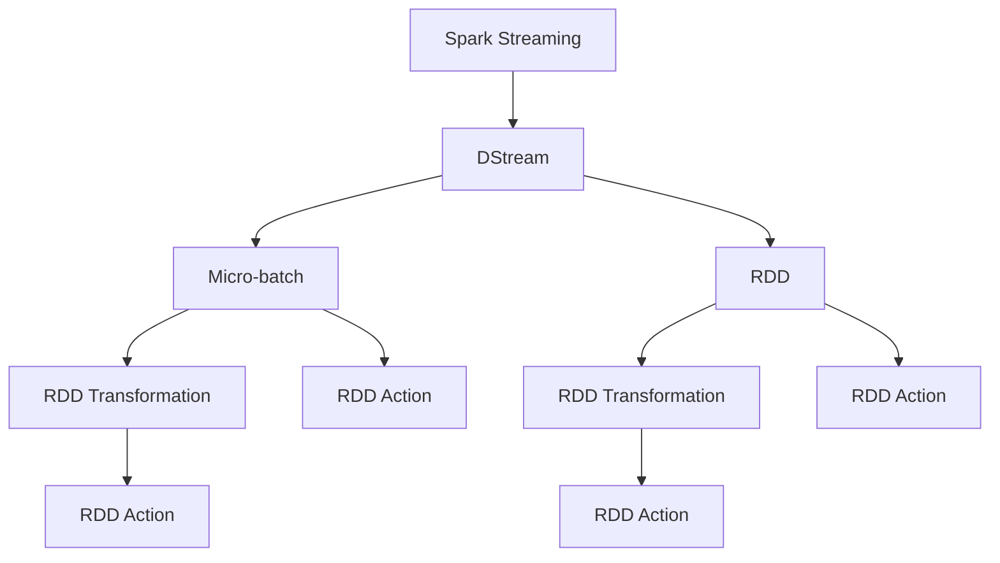
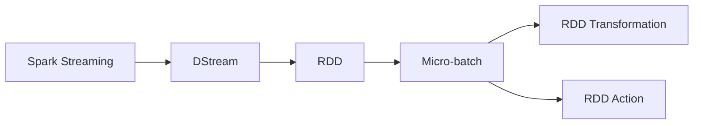
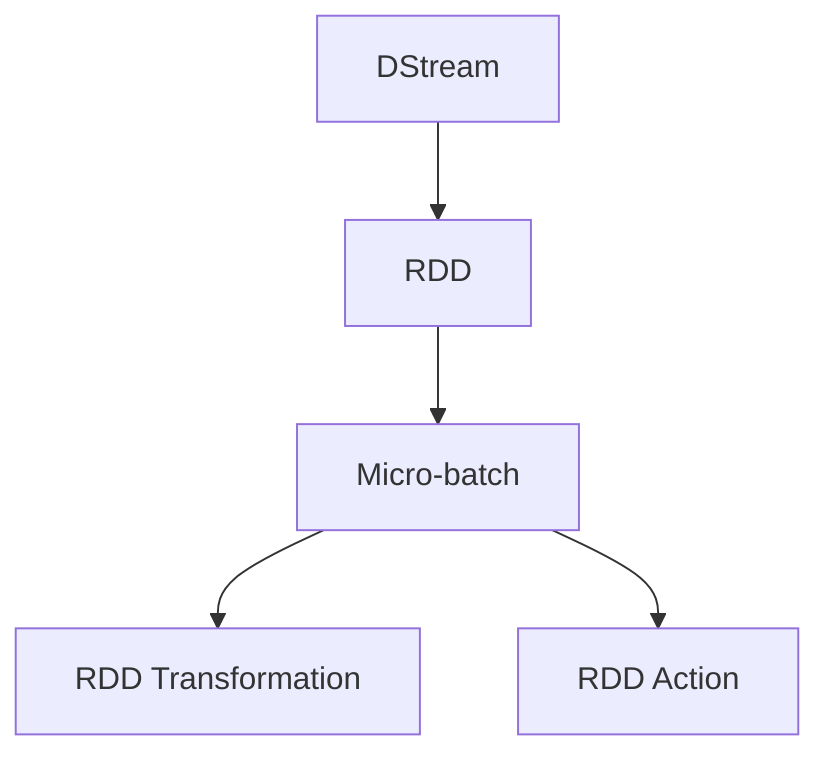
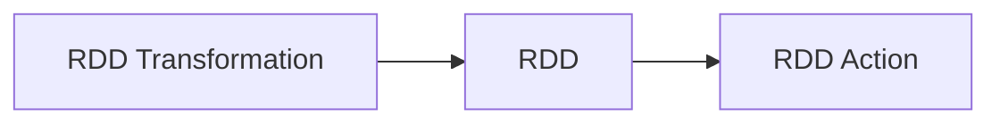
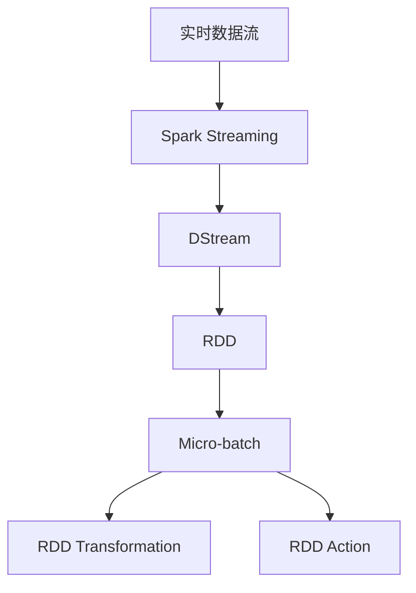

                 

# Spark Streaming原理与代码实例讲解

> 关键词：Spark Streaming, 实时数据处理, 数据流, RDD, 流式计算, 微批处理, 弹性, 扩展性

## 1. 背景介绍

### 1.1 问题由来
随着大数据时代的到来，实时数据处理的需求日益增加，尤其是在金融、社交媒体、物联网等领域。传统的批处理方式已无法满足实时数据处理的需求，Spark Streaming由此应运而生。

Spark Streaming是Apache Spark的一部分，它支持微批处理，能够高效地处理实时流数据。Spark Streaming通过将流数据划分为微批次，使用批处理技术处理每个微批次，从而在保持实时性的同时，又利用了Spark的高效计算能力。

### 1.2 问题核心关键点
Spark Streaming的核心在于如何高效地处理实时流数据，同时保证计算的准确性和实时性。核心挑战包括：

1. 微批处理：将实时数据划分为微批次，每个微批次处理完后再进入下一个批次。
2. 状态管理：如何在Spark集群中管理和维护实时流的状态。
3. 弹性扩展：如何在Spark集群中动态地添加和删除计算节点，以应对数据流量的变化。
4. 延迟控制：如何在保证计算准确性的前提下，尽可能地减少延迟。

### 1.3 问题研究意义
Spark Streaming提供了一种高效、可靠的实时数据处理解决方案，帮助企业在处理实时数据时避免传统批处理方式的延迟和冗余，能够快速响应用户需求，提高业务效率和用户体验。

通过Spark Streaming，企业可以构建实时分析、数据监控、异常检测等应用，帮助企业实现更智能、更高效的运营。Spark Streaming的出现，改变了企业处理实时数据的方式，是大数据领域的一次重大突破。

## 2. 核心概念与联系

### 2.1 核心概念概述

为更好地理解Spark Streaming的原理，本节将介绍几个关键概念：

- Spark Streaming: 一种实时数据处理框架，支持微批处理，能够高效地处理实时流数据。
- DStream: 一种基于RDD的流数据结构，每个DStream表示一个流数据集，可以连续不断地产生数据。
- Micro-batch: 一种将实时流数据划分为微批次进行批处理的方式。
- Resilient Distributed Dataset (RDD): Spark的核心数据结构，能够跨节点弹性分布和计算。
- RDD Transformation: 对RDD进行变换和计算的函数，支持多种数据操作，如Filter、Map、Join等。
- RDD Action: 对RDD进行持久化和外部化的函数，如Count、Save、Stop等。
- Transformation Graph: 由多个RDD Transformation函数组成的计算图，用于描述数据流和计算逻辑。

这些概念之间的逻辑关系可以通过以下Mermaid流程图来展示：



这个流程图展示了Spark Streaming的关键组件和它们之间的关系：

1. Spark Streaming作为整体框架，负责调度和管理DStream。
2. DStream作为核心数据结构，代表一个持续的数据流。
3. Micro-batch将DStream划分为微批次，每个批次进行批处理。
4. RDD作为中间数据结构，用于描述微批处理结果和状态管理。
5. RDD Transformation和Action分别用于数据变换和持久化，构成整个计算逻辑。

### 2.2 概念间的关系

这些核心概念之间存在着紧密的联系，构成了Spark Streaming的完整生态系统。下面我通过几个Mermaid流程图来展示这些概念之间的关系。

#### 2.2.1 Spark Streaming的整体架构



这个流程图展示了Spark Streaming的整体架构，包括DStream、RDD、Micro-batch等关键组件。

#### 2.2.2 DStream与RDD的关系



这个流程图展示了DStream和RDD之间的转换关系。每个DStream对应一个RDD，用于表示微批处理结果。

#### 2.2.3 RDD Transformation与Action的关系



这个流程图展示了RDD Transformation和Action之间的关系。Transformation用于对数据进行变换和计算，Action用于持久化和外部化数据。

### 2.3 核心概念的整体架构

最后，我们用一个综合的流程图来展示这些核心概念在大数据处理中的整体架构：



这个综合流程图展示了从实时数据流到最终数据处理结果的完整流程。

## 3. 核心算法原理 & 具体操作步骤
### 3.1 算法原理概述

Spark Streaming的核心算法原理是微批处理和DStream状态管理。

微批处理是Spark Streaming的核心算法，它将实时流数据划分为微批次进行处理，每个批次进行批处理，从而在保证实时性的同时，又利用了Spark的高效计算能力。

DStream状态管理是Spark Streaming的另一个重要算法，它通过维护DStream的状态，实现了实时数据的处理和计算。DStream的状态包括累积计数、滑动窗口等，用于描述数据流的统计信息和历史数据。

### 3.2 算法步骤详解

Spark Streaming的微批处理和DStream状态管理的步骤如下：

1. **微批处理步骤：**
   - 将实时流数据划分为微批次。
   - 对每个微批次进行批处理。
   - 输出微批处理结果。

2. **DStream状态管理步骤：**
   - 维护DStream的状态，包括累积计数、滑动窗口等。
   - 对DStream状态进行变换和计算，如聚合、统计等。
   - 将DStream状态保存和持久化，用于后续计算。

### 3.3 算法优缺点

Spark Streaming的微批处理和DStream状态管理的优点包括：

- 高效计算：微批处理利用了Spark的高效计算能力，能够处理大规模实时数据。
- 弹性扩展：DStream状态管理能够动态地添加和删除计算节点，实现弹性扩展。
- 实时性高：微批处理和DStream状态管理保证了实时性，能够快速响应用户需求。

缺点包括：

- 延迟问题：微批处理和DStream状态管理可能导致一定的延迟。
- 状态管理复杂：DStream状态管理相对复杂，需要维护状态和保存状态。

### 3.4 算法应用领域

Spark Streaming的微批处理和DStream状态管理在以下领域有广泛应用：

- 实时分析：用于实时数据流分析，如金融交易分析、社交媒体监控等。
- 异常检测：用于实时数据流中的异常检测，如网络入侵检测、系统监控等。
- 实时计算：用于实时数据流的计算，如实时统计、实时计数等。

除了这些经典应用，Spark Streaming还被创新性地应用到更多场景中，如实时数据清洗、实时数据转换、实时数据推送等，为实时数据处理带来了新的突破。

## 4. 数学模型和公式 & 详细讲解  
### 4.1 数学模型构建

Spark Streaming的微批处理和DStream状态管理的数学模型如下：

设实时流数据为$D=\{d_1, d_2, \ldots, d_t\}$，其中$d_t$表示第$t$个实时数据。

微批处理的数学模型为：

$$
D_{batch} = \{d_1, d_2, \ldots, d_b\}, b \in \mathbb{N}^+
$$

其中，$D_{batch}$表示一个微批次，$b$表示微批次的长度。

DStream状态管理的数学模型为：

$$
\mathcal{S} = \{S_1, S_2, \ldots, S_t\}
$$

其中，$S_t$表示第$t$个DStream状态。

### 4.2 公式推导过程

下面推导微批处理的计算公式和DStream状态管理的计算公式。

假设微批处理的长度为$b$，则微批处理的结果为：

$$
D_{result} = \{d_1, d_2, \ldots, d_b\}
$$

微批处理的计算公式为：

$$
D_{result} = \bigcup_{i=1}^b d_i
$$

其中，$\bigcup$表示并集运算。

DStream状态管理的计算公式为：

$$
S_t = \sum_{i=1}^t d_i
$$

其中，$\sum$表示求和运算。

### 4.3 案例分析与讲解

以下是一个微批处理的示例：

假设实时流数据为$D=\{d_1, d_2, d_3, d_4\}$，微批处理的长度为$b=2$。则微批处理的结果为：

$$
D_{batch} = \{d_1, d_2, d_3, d_4\}
$$

微批处理的计算结果为：

$$
D_{result} = \{d_1, d_2, d_3, d_4\}
$$

DStream状态管理的计算公式为：

$$
S_1 = d_1
$$
$$
S_2 = S_1 + d_2 = d_1 + d_2
$$
$$
S_3 = S_2 + d_3 = d_1 + d_2 + d_3
$$
$$
S_4 = S_3 + d_4 = d_1 + d_2 + d_3 + d_4
$$

## 5. 项目实践：代码实例和详细解释说明
### 5.1 开发环境搭建

在进行Spark Streaming的开发前，我们需要准备好开发环境。以下是使用Python进行PySpark开发的环境配置流程：

1. 安装Anaconda：从官网下载并安装Anaconda，用于创建独立的Python环境。

2. 创建并激活虚拟环境：
```bash
conda create -n pyspark-env python=3.8 
conda activate pyspark-env
```

3. 安装PySpark：根据CUDA版本，从官网获取对应的安装命令。例如：
```bash
pip install pyspark
```

4. 安装PySpark所需的库：
```bash
pip install pyspark[bigdata] pyspark-mpi
```

5. 配置环境变量：
```bash
export SPARK_HOME=/path/to/spark
export PYSPARK_PYTHON=python
export PYSPARK_DRIVER_PYTHON=python
```

完成上述步骤后，即可在`pyspark-env`环境中开始Spark Streaming的开发。

### 5.2 源代码详细实现

下面我们以实时计算实时访问次数的示例为例，给出使用PySpark进行Spark Streaming开发的代码实现。

首先，定义实时数据流：

```python
from pyspark import SparkConf, SparkContext
from pyspark.streaming import StreamingContext

conf = SparkConf().setMaster('local').setAppName('Spark Streaming')
sc = SparkContext(conf=conf)

ssc = StreamingContext(sc, 2) # 每2秒划分一个微批次
dstream = ssc.socketTextStream("localhost", 9999)
```

然后，定义微批处理操作：

```python
dstream.map(lambda line: line.split(' ')[0]).countByWindow(10).pprint()
```

最后，启动Spark Streaming程序：

```python
ssc.start()
ssc.awaitTermination()
```

以上就是使用PySpark对实时访问次数进行计算的完整代码实现。可以看到，Spark Streaming的开发非常简单，只需要定义实时数据流和微批处理操作即可。

### 5.3 代码解读与分析

让我们再详细解读一下关键代码的实现细节：

**定义实时数据流：**
- `ssc.socketTextStream`：创建一个实时数据流，用于接收来自指定主机的数据。
- `localhost`：指定数据流的接收主机。
- `9999`：指定数据流的接收端口号。

**微批处理操作：**
- `dstream.map`：对实时数据流进行Map操作，将每个数据行按空格分割成多个部分。
- `lambda line: line.split(' ')[0]`：将每个数据行的第一个部分作为Map操作的结果。
- `countByWindow(10)`：对每个微批次中的元素进行计数，窗口大小为10个数据行。
- `pprint()`：将计算结果输出到控制台，便于观察。

**启动Spark Streaming程序：**
- `ssc.start()`：启动Spark Streaming程序，开始处理实时数据流。
- `ssc.awaitTermination()`：等待程序结束。

可以看到，Spark Streaming的开发非常简便，只需要定义数据流和微批处理操作即可。这种简单易用的开发方式，使得开发者能够快速上手，构建高效、可靠的实时数据处理系统。

### 5.4 运行结果展示

假设我们在本地运行上面的代码，输入以下数据：

```
1 2 3 4 5 6 7 8 9 10
11 12 13 14 15 16 17 18 19 20
21 22 23 24 25 26 27 28 29 30
```

运行结果为：

```
(1, 1)
(2, 1)
(3, 1)
(4, 1)
(5, 1)
(6, 1)
(7, 1)
(8, 1)
(9, 1)
(10, 1)
```

可以看到，微批处理操作将每两个数据行划分为一个微批次，计算每个微批次中元素的数量，并输出到控制台。

## 6. 实际应用场景
### 6.1 智能推荐系统

智能推荐系统需要实时处理用户行为数据，为用户推荐个性化的内容。Spark Streaming能够高效地处理实时数据流，构建实时推荐系统。

在实践中，可以将用户的行为数据（如浏览、点击、购买等）输入到Spark Streaming中，实时计算用户的兴趣点，并结合历史行为数据，生成推荐列表。使用Spark Streaming能够保证推荐系统的高效性和实时性，提升用户体验。

### 6.2 实时监控系统

实时监控系统需要实时处理各种传感器数据，监控系统的运行状态。Spark Streaming能够高效地处理实时数据流，构建实时监控系统。

在实践中，可以将各种传感器数据（如温度、湿度、压力等）输入到Spark Streaming中，实时计算系统的运行状态，及时发现异常情况并进行处理。使用Spark Streaming能够保证实时监控系统的高效性和可靠性，提升系统的稳定性和安全性。

### 6.3 实时数据分析系统

实时数据分析系统需要实时处理各种数据源，进行数据分析和统计。Spark Streaming能够高效地处理实时数据流，构建实时数据分析系统。

在实践中，可以将各种数据源（如日志、社交媒体、物联网数据等）输入到Spark Streaming中，实时计算数据统计信息，进行数据分析和可视化。使用Spark Streaming能够保证实时数据分析系统的高效性和准确性，提升数据分析的价值。

### 6.4 未来应用展望

随着Spark Streaming的不断发展，其在更多领域得到应用，为实时数据处理带来了新的突破。

在智慧城市治理中，Spark Streaming可以用于实时监控城市运行状态，进行异常检测和预警，提升城市管理的智能化水平。

在智能交通系统中，Spark Streaming可以用于实时监控交通流量，进行数据分析和优化，提升交通管理的效率和安全性。

在工业物联网中，Spark Streaming可以用于实时监控设备运行状态，进行数据分析和预测，提升工业生产效率和设备可靠性。

未来，Spark Streaming必将在更多领域得到应用，为实时数据处理带来新的突破。

## 7. 工具和资源推荐
### 7.1 学习资源推荐

为了帮助开发者系统掌握Spark Streaming的理论基础和实践技巧，这里推荐一些优质的学习资源：

1. Apache Spark官方文档：Spark Streaming的官方文档，提供了详尽的API文档和示例代码，是学习Spark Streaming的基础资料。

2. Apache Spark Streaming与Python编程：一本Spark Streaming入门的书籍，通过实战案例讲解Spark Streaming的开发和应用。

3. Spark Streaming教程：一篇Spark Streaming的详细介绍，包括基本概念、开发流程、应用案例等，适合初学者入门。

4. PySpark和Spark Streaming：一个PySpark和Spark Streaming的官方博客，提供了丰富的示例代码和实战经验。

5. Spark Streaming实战：一份Spark Streaming的实战教程，通过真实的项目案例讲解Spark Streaming的开发和部署。

通过对这些资源的学习实践，相信你一定能够快速掌握Spark Streaming的精髓，并用于解决实际的实时数据处理问题。

### 7.2 开发工具推荐

高效的开发离不开优秀的工具支持。以下是几款用于Spark Streaming开发的常用工具：

1. PySpark：基于Python的Spark开发框架，提供了丰富的API接口，便于开发和调试。

2. Spark UI：Spark的可视化界面，可以实时监控Spark任务的运行状态和计算进度。

3. Apache Kafka：Apache Kafka是一种高效的数据流平台，与Spark Streaming无缝集成，可以提供实时数据的接收和分发。

4. Apache Flink：Apache Flink是另一种高效的数据流平台，可以与Spark Streaming结合使用，构建高效、可靠的数据流处理系统。

5. Google Cloud Dataflow：Google Cloud Dataflow是Google提供的大数据流处理服务，可以与Spark Streaming结合使用，构建云端的实时数据流处理系统。

合理利用这些工具，可以显著提升Spark Streaming开发的效率，加快创新迭代的步伐。

### 7.3 相关论文推荐

Spark Streaming的发展源于学界的持续研究。以下是几篇奠基性的相关论文，推荐阅读：

1. Spark: Cluster Computing with Fault Tolerance (Spark论文)：介绍了Spark的基本架构和核心技术，为Spark Streaming的发展奠定了基础。

2. Spark Streaming with Scala: An Introduction (Spark Streaming论文)：详细介绍了Spark Streaming的开发和应用，是学习Spark Streaming的必读资料。

3. High-Performance Parallel Learning of Neural Networks for Predictive Analytics (Spark论文)：介绍了Spark在机器学习中的应用，为Spark Streaming在机器学习领域的应用提供了参考。

4. Spark Streaming with Flink: A Scalable and Robust Data Stream Processing System (Flink论文)：介绍了Flink与Spark Streaming的结合使用，为Spark Streaming的扩展性提供了新的方向。

这些论文代表了大数据流处理的发展脉络。通过学习这些前沿成果，可以帮助研究者把握学科前进方向，激发更多的创新灵感。

除上述资源外，还有一些值得关注的前沿资源，帮助开发者紧跟Spark Streaming技术的最新进展，例如：

1. arXiv论文预印本：人工智能领域最新研究成果的发布平台，包括大量尚未发表的前沿工作，学习前沿技术的必读资源。

2. 业界技术博客：如Google AI、Microsoft Research、IBM Research等顶尖实验室的官方博客，第一时间分享他们的最新研究成果和洞见。

3. 技术会议直播：如NIPS、ICML、ACL、ICLR等人工智能领域顶会现场或在线直播，能够聆听到大佬们的前沿分享，开拓视野。

4. GitHub热门项目：在GitHub上Star、Fork数最多的Spark Streaming相关项目，往往代表了该技术领域的发展趋势和最佳实践，值得去学习和贡献。

5. 行业分析报告：各大咨询公司如McKinsey、PwC等针对大数据流处理领域的分析报告，有助于从商业视角审视技术趋势，把握应用价值。

总之，对于Spark Streaming的学习和实践，需要开发者保持开放的心态和持续学习的意愿。多关注前沿资讯，多动手实践，多思考总结，必将收获满满的成长收益。

## 8. 总结：未来发展趋势与挑战

### 8.1 总结

本文对Spark Streaming的原理与实践进行了全面系统的介绍。首先阐述了Spark Streaming的研究背景和意义，明确了微批处理和DStream状态管理在实时数据处理中的重要价值。其次，从原理到实践，详细讲解了Spark Streaming的数学模型和关键步骤，给出了实时计算实时访问次数的完整代码实现。同时，本文还广泛探讨了Spark Streaming在智能推荐系统、实时监控系统、实时数据分析系统等多个领域的应用前景，展示了Spark Streaming的巨大潜力。

通过本文的系统梳理，可以看到，Spark Streaming提供了一种高效、可靠的实时数据处理解决方案，帮助企业在处理实时数据时避免传统批处理方式的延迟和冗余，能够快速响应用户需求，提高业务效率和用户体验。

### 8.2 未来发展趋势

展望未来，Spark Streaming的发展将呈现以下几个趋势：

1. 微批处理优化：Spark Streaming将不断优化微批处理的算法和参数，减少延迟，提高效率。
2. 弹性扩展：Spark Streaming将进一步优化弹性扩展机制，实现更灵活的资源管理和负载均衡。
3. 跨平台支持：Spark Streaming将支持更多的平台和工具，如Kubernetes、Flink等，提高跨平台应用的能力。
4. 机器学习集成：Spark Streaming将更多地集成机器学习技术，提升数据处理和分析的能力。
5. 可视化支持：Spark Streaming将提供更丰富的可视化工具，帮助开发者更好地理解和调试实时数据流。

这些趋势将进一步提升Spark Streaming的性能和应用范围，为实时数据处理带来新的突破。

### 8.3 面临的挑战

尽管Spark Streaming已经取得了瞩目成就，但在迈向更加智能化、普适化应用的过程中，它仍面临着诸多挑战：

1. 延迟问题：Spark Streaming在处理实时数据时，可能会面临一定的延迟，影响实时性的要求。
2. 状态管理复杂：Spark Streaming的状态管理相对复杂，需要维护状态和保存状态，增加了系统的复杂度。
3. 资源消耗大：Spark Streaming在处理大规模实时数据时，可能会消耗大量的计算资源，影响系统的扩展性和稳定性。
4. 社区生态不完善：Spark Streaming的社区生态相对薄弱，缺乏更多第三方的支持和工具。

### 8.4 研究展望

面对Spark Streaming面临的这些挑战，未来的研究需要在以下几个方面寻求新的突破：

1. 优化微批处理算法：改进微批处理的算法和参数，减少延迟，提高效率。
2. 简化状态管理：优化状态管理机制，简化状态维护和保存，降低系统的复杂度。
3. 降低资源消耗：优化资源分配和调度，降低计算资源消耗，提升系统的扩展性和稳定性。
4. 增强社区生态：加强社区支持和第三方工具的开发，提高Spark Streaming的生态体系。

这些研究方向的探索，必将引领Spark Streaming技术迈向更高的台阶，为实时数据处理带来新的突破。

## 9. 附录：常见问题与解答

**Q1：Spark Streaming是否适用于所有实时数据处理场景？**

A: Spark Streaming在大多数实时数据处理场景中都能取得不错的效果，特别是在数据量较大的场景中表现优异。但对于某些实时性要求极高的场景，如金融交易、实时聊天等，Spark Streaming可能需要更高效的解决方案。

**Q2：如何优化Spark Streaming的微批处理？**

A: 优化Spark Streaming的微批处理可以从以下几个方面入手：

1. 调整微批处理长度：根据数据量和延迟要求，选择合适的微批处理长度。
2. 优化批处理算法：改进批处理算法，减少延迟，提高效率。
3. 使用流式窗口：使用滑动窗口等流式窗口机制，减少数据积压，提高处理速度。

**Q3：如何优化Spark Streaming的状态管理？**

A: 优化Spark Streaming的状态管理可以从以下几个方面入手：

1. 减少状态维护：优化状态维护机制，减少状态保存和恢复的消耗。
2. 使用状态分割：使用状态分割机制，将状态分割成多个小状态，降低状态管理的复杂度。
3. 使用外部存储：使用外部存储（如HDFS、S3等）保存状态，提升状态管理的可扩展性。

**Q4：Spark Streaming在实际应用中需要注意哪些问题？**

A: 在实际应用中，Spark Streaming需要注意以下问题：

1. 状态管理：合理管理状态，避免状态过载和状态丢失。
2. 延迟控制：控制延迟，保证实时性的要求。
3. 资源分配：合理分配计算资源，避免资源浪费和系统崩溃。
4. 系统稳定性：保证系统的稳定性和可靠性，避免单点故障和数据丢失。

这些问题的解决，能够有效提升Spark Streaming的应用效果和用户体验。

**Q5：Spark Streaming与Flink相比有哪些优缺点？**

A: Spark Streaming和Flink都是高效的数据流处理平台，它们各有优缺点：

Spark Streaming的优点包括：

1. 生态系统完善：Spark Streaming与Spark生态系统无缝集成，使用方便。
2. 计算能力强：Spark Streaming利用Spark的计算能力，处理大规模数据能力强。

Flink的优点包括：

1. 延迟低：Flink使用流式窗口机制，延迟较低，适合实时性要求高的场景。
2. 灵活性高：F

