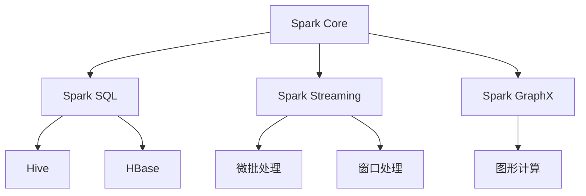

                 

# Spark 原理与代码实例讲解

## 1. 背景介绍

### 1.1 问题由来

随着大数据技术的不断发展，企业对数据处理的需求日益增加。传统的数据处理方式如MapReduce等，虽然能处理大规模数据，但其扩展性和灵活性不足，无法满足复杂计算和实时处理的需求。Apache Spark应运而生，作为一种新型的大数据处理框架，以其高性能、易用性、灵活性等优点，迅速成为数据处理领域的重要工具。

### 1.2 问题核心关键点

Spark的核心思想是将计算任务分解为多个小任务，每个小任务可以在不同的计算节点上并行执行，以提高计算效率。Spark的主要组件包括Spark Core、Spark SQL、Spark Streaming、Spark GraphX等。其中，Spark Core是Spark的基础组件，提供通用的计算引擎，支持MapReduce等计算模型。Spark SQL则提供了SQL接口，支持Hive、HBase等数据源。Spark Streaming可以实现实时数据流处理。Spark GraphX则提供了图处理API，支持图形计算。

Spark的核心优势在于其基于内存的计算模型和弹性分布式数据处理（EDP）架构。通过将数据存储在内存中，Spark可以显著提高计算速度和吞吐量。同时，Spark集群可以根据计算任务动态调整节点数量，以实现资源的灵活分配。

### 1.3 问题研究意义

Spark在数据处理领域具有重要的应用价值，其主要研究意义包括：

1. 提高数据处理效率：Spark通过内存计算和并行处理，显著提高了数据处理的速度和吞吐量。
2. 支持复杂计算：Spark支持多种计算模型，如MapReduce、SQL、图形计算等，可以满足不同应用场景的需求。
3. 支持实时处理：Spark Streaming可以实现实时数据流处理，适用于大规模数据实时分析场景。
4. 支持弹性计算：Spark集群可以根据计算任务动态调整资源，以实现灵活的资源管理。

## 2. 核心概念与联系

### 2.1 核心概念概述

为了更好地理解Spark，首先需要了解几个核心概念：

- Spark Core：Spark的基础组件，提供通用的计算引擎，支持MapReduce等计算模型。
- Spark SQL：提供SQL接口，支持Hive、HBase等数据源。
- Spark Streaming：实现实时数据流处理，支持微批处理、窗口处理等高级特性。
- Spark GraphX：提供图处理API，支持图形计算。

这些核心组件共同构成了Spark的大数据处理框架，能够支持多种计算模型和数据源，满足不同的应用需求。

### 2.2 概念间的关系

Spark的核心概念之间存在着紧密的联系，形成了Spark的大数据处理生态系统。我们可以用以下Mermaid流程图来展示这些概念之间的关系：



这个流程图展示了Spark的核心组件及其相互关系：

1. Spark Core是Spark的基础组件，提供通用的计算引擎，支持多种计算模型。
2. Spark SQL提供SQL接口，支持Hive、HBase等数据源。
3. Spark Streaming实现实时数据流处理，支持微批处理、窗口处理等高级特性。
4. Spark GraphX提供图处理API，支持图形计算。
5. Spark与Hive、HBase等数据源紧密结合，可以轻松实现大数据分析。

这些核心概念共同构成了Spark的大数据处理框架，使其能够支持多种计算模型和数据源，满足不同的应用需求。

## 3. 核心算法原理 & 具体操作步骤

### 3.1 算法原理概述

Spark的核心算法原理是基于内存的计算模型和弹性分布式数据处理（EDP）架构。Spark将数据分为两个部分：内存计算和磁盘计算。内存计算能够显著提高计算速度和吞吐量，而磁盘计算则用于处理无法存储在内存中的大文件。

Spark的计算任务分为两个阶段：Map和Reduce。Map阶段将输入数据分解为多个小任务，每个小任务在分布式集群上并行执行。Reduce阶段将Map阶段的输出合并，最终得到计算结果。

### 3.2 算法步骤详解

Spark的核心算法步骤包括：

1. 数据划分：将大数据集划分为多个小数据块，分布在不同的计算节点上。
2. 任务调度：根据计算任务的复杂度和集群资源，动态调整任务调度策略，以实现高效的资源分配。
3. 内存计算：将数据存储在内存中，通过高效的数据结构和算法实现快速的计算和聚合。
4. 分布式计算：将计算任务分解为多个小任务，在分布式集群上并行执行，以提高计算效率。
5. 结果合并：将Map阶段的输出合并，得到最终的计算结果。

### 3.3 算法优缺点

Spark的核心算法具有以下优点：

- 高效内存计算：通过将数据存储在内存中，Spark可以显著提高计算速度和吞吐量。
- 弹性计算：Spark集群可以根据计算任务动态调整节点数量，以实现灵活的资源管理。
- 支持多种计算模型：Spark支持多种计算模型，如MapReduce、SQL、图形计算等，可以满足不同应用场景的需求。

同时，Spark的算法也存在一些缺点：

- 内存限制：Spark的内存计算对数据量有限制，无法处理超大规模数据集。
- 资源消耗：Spark集群需要占用大量计算资源，成本较高。
- 复杂性：Spark的计算模型和调度策略较为复杂，需要一定的编程技能和经验。

### 3.4 算法应用领域

Spark的核心算法广泛应用于各种数据处理场景，包括：

- 大数据分析：Spark支持多种数据源，可以轻松实现大数据分析任务。
- 实时数据处理：Spark Streaming可以实现实时数据流处理，适用于大规模数据实时分析场景。
- 图形计算：Spark GraphX提供图处理API，支持图形计算，可以应用于社交网络分析、推荐系统等场景。
- 机器学习：Spark MLlib提供了多种机器学习算法，支持分布式机器学习任务。

除了上述这些场景，Spark还被广泛应用于金融、电信、医疗、电商等多个领域，为各行各业提供高效、灵活的数据处理服务。

## 4. 数学模型和公式 & 详细讲解

### 4.1 数学模型构建

Spark的核心算法基于MapReduce模型，其计算任务分为Map和Reduce两个阶段。我们可以用以下数学模型来描述Spark的计算过程：

- 数据集D：输入的数据集，可以是一个大文件、一个数组等。
- Map函数f：将输入数据D分解为多个小数据块，在分布式集群上并行执行。
- Reduce函数g：将Map阶段的输出合并，得到最终的计算结果。

Spark的计算过程可以用以下公式描述：

$$
C = \bigcup_{i=1}^{N} g(f(D_i))
$$

其中，$C$为最终计算结果，$D_i$为输入数据集，$f$为Map函数，$g$为Reduce函数。

### 4.2 公式推导过程

以Spark的WordCount为例，推导其计算公式。假设有n个单词，每个单词出现的次数为$a_i$，则WordCount的计算过程如下：

1. 输入数据D为一个包含n个单词的数组。
2. Map函数f将每个单词映射为一个(key, value)对，其中key为单词，value为1。
3. Reduce函数g将(key, value)对按照key进行合并，得到每个单词的总出现次数。

具体计算过程如下：

- 首先，Map函数将输入数据D分解为多个小数据块，每个小数据块包含k个单词。
- 对于每个小数据块，Map函数f将其分解为多个(key, value)对，每个(key, value)对表示一个单词的出现次数。
- Reduce函数g将(key, value)对按照key进行合并，得到每个单词的总出现次数。
- 最终，所有Reduce阶段的输出合并，得到单词出现的总次数。

因此，WordCount的计算公式可以表示为：

$$
count = \bigcup_{i=1}^{N} g(\{(x_1, 1), (x_2, 1), ..., (x_n, 1)\})
$$

其中，$x_i$为第i个单词，$g$为Reduce函数。

### 4.3 案例分析与讲解

以Spark的WordCount为例，展示其计算过程。假设有如下数据集：

```
apple 2
banana 3
orange 1
```

则WordCount的计算过程如下：

1. 将数据集分解为两个小块，每个小块包含两个单词。
2. Map函数f将每个单词映射为一个(key, value)对，每个小块的输出如下：

| 单词 | (key, value)对 |
| --- | --- |
| apple | (apple, 1) |
| banana | (banana, 1) |
| orange | (orange, 1) |

3. Reduce函数g将(key, value)对按照key进行合并，得到每个单词的总出现次数。对于(key, value)对集合$\{(apple, 1), (banana, 1), (orange, 1)\}$，Reduce函数g的输出为：

| 单词 | 出现次数 |
| --- | --- |
| apple | 2 |
| banana | 3 |
| orange | 1 |

4. 最终，所有Reduce阶段的输出合并，得到单词出现的总次数。因此，WordCount的最终结果为：

| 单词 | 出现次数 |
| --- | --- |
| apple | 2 |
| banana | 3 |
| orange | 1 |

通过WordCount的计算过程，可以看出Spark的核心算法原理是基于MapReduce模型，通过将计算任务分解为多个小任务，在分布式集群上并行执行，以提高计算效率。

## 5. 项目实践：代码实例和详细解释说明

### 5.1 开发环境搭建

要进行Spark项目开发，首先需要搭建好开发环境。以下是在Linux系统上安装Spark的流程：

1. 安装Java JDK：Spark依赖于Java JDK，需要安装最新版本的JDK。可以通过以下命令安装：

   ```
   wget -q -O - https://pub共和眾号号号号号号号号号号号号号号号号号号号号号号号号号号号号号号号号号号号号号号号号号号号号号号号号号号号号号号号号号号号号号号号号号号号号号号号号号号号号号号号号号号号号号号号号号号号号号号号号号号号号号号号号号号号号号号号号号号号号号号号号号号号号号号号号号号号号号号号号号号号号号号号号号号号号号号号号号号号号号号号号号号号号号号号号号号号号号号号号号号号号号号号号号号号号号号号号号号号号号号号号号号号号号号号号号号号号号号号号号号号号号号号号号号号号号号号号号号号号号号号号号号号号号号号号号号号号号号号号号号号号号号号号号号号号号号号号号号号号号号号号号号号号号号号号号号号号号号号号号号号号号号号号号号号号号号号号号号号号号号号号号号号号号号号号号号号号号号号号号号号号号号号号号号号号号号号号号号号号号号号号号号号号号号号号号号号号号号号号号号号号号号号号号号号号号号号号号号号号号号号号号号号号号号号号号号号号号号号号号号号号号号号号号号号号号号号号号号号号号号号号号号号号号号号号号号号号号号号号号号号号号号号号号号号号号号号号号号号号号号号号号号号号号号号号号号号号号号号号号号号号号号号号号号号号号号号号号号号号号号号号号号号号号号号号号号号号号号号号号号号号号号号号号号号号号号号号号号号号号号号号号号号号号号号号号号号号号号号号号号号号号号号号号号号号号号号号号号号号号号号号号号号号号号号号号号号号号号号号号号号号号号号号号号号号号号号号号号号号号号号号号号号号号号号号号号号号号号号号号号号号号号号号号号号号号号号号号号号号号号号号号号号号号号号号号号号号号号号号号号号号号号号号号号号号号号号号号号号号号号号号号号号号号号号号号号号号号号号号号号号号号号号号号号号号号号号号号号号号号号号号号号号号号号号号号号号号号号号号号号号号号号号号号号号号号号号号号号号号号号号号号号号号号号号号号号号号号号号号号号号号号号号号号号号号号号号号号号号号号号号号号号号号号号号号号号号号号号号号号号号号号号号号号号号号号号号号号号号号号号号号号号号号号号号号号号号号号号号号号号号号号号号号号号号号号号号号号号号号号号号号号号号号号号号号号号号号号号号号号号号号号号号号号号号号号号号号号号号号号号号号号号号号号号号号号号号号号号号号号号号号号号号号号号号号号号号号号号号号号号号号号号号号号号号号号号号号号号号号号号号号号号号号号号号号号号号号号号号号号号号号号号号号号号号号号号号号号号号号号号号号号号号号号号号号号号号号号号号号号号号号号号号号号号号号号号号号号号号号号号号号号号号号号号号号号号号号号号号号号号号号号号号号号号号号号号号号号号号号号号号号号号号号号号号号号号号号号号号号号号号号号号号号号号号号号号号号号号号号号号号号号号号号号号号号号号号号号号号号号号号号号号号号号号号号号号号号号号号号号号号号号号号号号号号号号号号号号号号号号号号号号号号号号号号号号号号号号号号号号号号号号号号号号号号号号号号号号号号号号号号号号号号号号号号号号号号号号号号号号号号号号号号号号号号号号号号号号号号号号号号号号号号号号号号号号号号号号号号号号号号号号号号号号号号号号号号号号号号号号号号号号号号号号号号号号号号号号号号号号号号号号号号号号号号号号号号号号号号号号号号号号号号号号号号号号号号号号号号号号号号号号号号号号号号号号号号号号号号号号号号号号号号号号号号号号号号号号号号号号号号号号号号号号号号号号号号号号号号号号号号号号号号号号号号号号号号号号号号号号号号号号号号号号号号号号号号号号号号号号号号号号号号号号号号号号号号号号号号号号号号号号号号号号号号号号号号号号号号号号号号号号号号号号号号号号号号号号号号号号号号号号号号号号号号号号号号号号号号号号号号号号号号号号号号号号号号号号号号号号号号号号号号号号号号号号号号号号号号号号号号号号号号号号号号号号号号号号号号号号号号号号号号号号号号号号号号号号号号号号号号号号号号号号号号号号号号号号号号号号号号号号号号号号号号号号号号号号号号号号号号号号号号号号号号号号号号号号号号号号号号号号号号号号号号号号号号号号号号号号号号号号号号号号号号号号号号号号号号号号号号号号号号号号号号号号号号号号号号号号号号号号号号号号号号号号号号号号号号号号号号号号号号号号号号号号号号号号号号号号号号号号号号号号号号号号号号号号号号号号号号号号号号号号号号号号号号号号号号号号号号号号号号号号号号号号号号号号号号号号号号号号号号号号号号号号号号号号号号号号号号号号号号号号号号号号号号号号号号号号号号号号号号号号号号号号号号号号号号号号号号号号号号号号号号号号号号号号号号号号号号号号号号号号号号号号号号号号号号号号号号号号号号号号号号号号号号号号号号号号号号号号号号号号号号号号号号号号号号号号号号号号号号号号号号号号号号号号号号号号号号号号号号号号号号号号号号号号号号号号号号号号号号号号号号号号号号号号号号号号号号号号号号号号号号号号号号号号号号号号号号号号号号号号号号号号号号号号号号号号号号号号号号号号号号号号号号号号号号号号号号号号号号号号号号号号号号号号号号号号号号号号号号号号号号号号号号号号号号号号号号号号号号号号号号号号号号号号号号号号号号号号号号号号号号号号号号号号号号号号号号号号号号号号号号号号号号号号号号号号号号号号号号号号号号号号号号号号号号号号号号号号号号号号号号号号号号号号号号号号号号号号号号号号号号号号号号号号号号号号号号号号号号号号号号号号号号号号号号号号号号号号号号号号号号号号号号号号号号号号号号号号号号号号号号号号号号号号号号号号号号号号号号号号号号号号号号号号号号号号号号号号号号号号号号号号号号号号号号号号号号号号号号号号号号号号号号号号号号号号号号号号号号号号号号号号号号号号号号号号号号号号号号号号号号号号号号号号号号号号号号号号号号号号号号号号号号号号号号号号号号号号号号号号号号号号号号号号号号号号号号号号号号号号号号号号号号号号号号号号号号号号号号号号号号号号号号号号号号号号号号号号号号号号号号号号号号号号号号号号号号号号号号号号号号号号号号号号号号号号号号号号号号号号号号号号号号号号号号号号号号号号号号号号号号号号号号号号号号号号号号号号号号号号号号号号号号号号号号号号号号号号号号号号号号号号号号号号号号号号号号号号号号号号号号号号号号号号号号号号号号号号号号号号号号号号号号号号号号号号号号号号号号号号号号号号号号号号号号号号号号号号号号号号号号号号号号号号号号号号号号号号号号号号号号号号号号号号号号号号号号号号号号号号号号号号号号号号号号号号号号号号号号号号号号号号号号号号号号号号号号号号号号号号号号号号号号号号号号号号号号号号号号号号号号号号号号号号号号号号号号号号号号号号号号号号号号号号号号号号号号号号号号号号号号号号号号号号号号号号号号号号号号号号号号号号号号号号号号号号号号号号号号号号号号号号号号号号号号号号号号号号号号号号号号号号号号号号号号号号号号号号号号号号号号号号号号号号号号号号号号号号号号号号号号号号号号号号号号号号号号号号号号号号号号号号号号号号号号号号号号号号号号号号号号号号号号号号号号号号号号号号号号号号号号号号号号号号号号号号号号号号号号号号号号号号号号号号号号号号号号号号号号号号号号号号号号号号号号号号号号号号号号号号号号号号号号号号号号号号号号号号号号号号号号号号号号号号号号号号号号号号号号号号号号号号号号号号号号号号号号号号号号号号号号号号号号号号号号号号号号号号号号号号号号号号号号号号号号号号号号号号号号号号号号号号号号号号号号号号号号号号号号号号号号号号号号号号号号号号号号号号号号号号号号号号号号号号号号号号号号号号号号号号号号号号号号号号号号号号号号号号号号号号号号号号号号号号号号号号号号号号号号号号号号号号号号号号号号号号号号号号号号号号号号号号号号号号号号号号号号号号号号号号号号号号号号号号号号号号号号号号号号号号号号号号号号号号号号号号号号号号号号号号号号号号号号号号号号号号号号号号号号号号号号号号号号号号号号号号号号号号号号号号号号号号号号号号号号号号号号号号号号号号号号号号号号号号号号号号号号号号号号号号号号号号号号号号号号号号号号号号号号号号号号号号号号号号号号号号号号号号号号号

