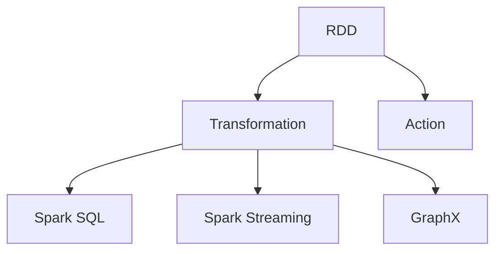

                 

# Spark原理与代码实例讲解

## 1. 背景介绍

### 1.1 问题由来
随着大数据时代的到来，处理海量数据的需求日益增加，传统的批处理系统已难以应对实时化、大规模的数据处理需求。Apache Spark作为一个开源的快速、通用的大数据处理引擎，被广泛用于数据分析、机器学习、图形处理等多个领域。Spark的核心特性包括内存计算、弹性分布式数据集（RDDs）、数据并行处理、内存数据处理等。

近年来，Spark在学术界和工业界都得到了广泛的研究和应用，但其原理和内部机制仍然存在一定的不透明性。本篇文章旨在通过详细的代码实例，从原理和实践两个层面，全面解析Spark的运作机制，并探讨其应用场景和未来发展方向。

### 1.2 问题核心关键点
Spark的核心原理包括：
- RDDs：Spark的分布式内存数据集，提供高效的内存计算和分布式处理能力。
- 弹性计算框架：Spark能够自动调整任务并行度，以适应不同规模的数据集和计算资源。
- 内存计算：Spark通过将数据加载到内存中，减少了磁盘I/O开销，大大提高了计算效率。
- 数据流处理：Spark提供了Spark Streaming和Structured Streaming两种数据流处理机制，支持实时数据处理。
- 机器学习库：Spark MLlib提供了多种机器学习算法，支持高效的数据挖掘和预测分析。
- 图形处理：Spark GraphX提供了高效的图处理算法，支持图数据的高效计算。

这些核心原理构成了Spark的强大功能，使得其能够在各种大数据处理场景中发挥重要作用。

## 2. 核心概念与联系

### 2.1 核心概念概述

为了更好地理解Spark的原理和架构，我们需要介绍几个关键概念：

- RDD（弹性分布式数据集）：Spark的基本数据抽象，支持多种数据源，包括文件系统、数据库、内存等。
- Transformation：Spark的操作类型，通过Transformation操作对RDD进行转换，如map、filter、join等。
- Action：Spark的操作类型，通过Action操作对RDD进行计算，如count、collect、save等。
- Spark SQL：Spark提供了一种类SQL语言来查询RDDs，便于进行数据处理和分析。
- Spark Streaming：Spark提供了一种实时流处理机制，支持大规模的实时数据处理。
- GraphX：Spark提供了一种高效的图处理框架，支持大规模图数据的计算和分析。

这些概念共同构成了Spark的核心架构，使得Spark能够支持多种数据处理需求，并进行高效的计算和分析。

### 2.2 概念间的关系

这些核心概念之间的逻辑关系可以通过以下Mermaid流程图来展示：



这个流程图展示了大规模数据处理框架Spark的主要组件及其相互关系：

- RDD是Spark的基本数据单元，通过Transformation操作对其进行操作和转换。
- Action操作对RDD进行最终的计算和输出。
- Spark SQL、Spark Streaming、GraphX都是基于RDD的不同应用场景，通过Transformation和Action进行计算。

## 3. 核心算法原理 & 具体操作步骤
### 3.1 算法原理概述

Spark的计算原理主要基于内存计算和分布式计算，通过将数据划分为多个并行处理的数据块，并行地进行计算，从而实现高效的分布式数据处理。

具体来说，Spark的计算过程包括两个阶段：

- **分区阶段**：Spark将输入数据切分成多个分区（Partition），每个分区由一个执行器（Executor）处理。分区的大小由数据大小、执行器数量和任务并发度决定。
- **执行阶段**：Spark通过并行执行转换操作和计算操作，对分区数据进行处理。转换操作主要涉及数据的映射、过滤、连接等操作，而计算操作则涉及数据的聚合、统计、排序等操作。

在执行阶段，Spark会生成一个DAG（有向无环图），表示计算任务之间的依赖关系。Spark使用基于DAG的任务调度算法，动态地分配计算资源，确保任务的并行执行。

### 3.2 算法步骤详解

以下是Spark计算过程的关键步骤：

**Step 1: 数据分区**

Spark通过将输入数据切分成多个分区，并行地对每个分区进行处理。分区大小由数据大小、执行器数量和任务并发度决定。具体来说，分区的划分步骤如下：

1. 计算每个分区的数据大小。
2. 根据执行器数量和任务并发度，计算每个分区的分区大小。
3. 对数据进行切分，生成多个分区。

例如，在Spark中，可以使用`rdd.partition(numPartitions)`方法将RDD划分为指定数量的分区。

**Step 2: 转换操作**

Spark通过Transformation操作对RDD进行转换，常见的转换操作包括：

1. `map`：对每个分区进行映射操作，生成一个新的分区。
2. `filter`：对每个分区进行过滤操作，生成一个新的分区。
3. `join`：对两个RDD进行连接操作，生成一个新的分区。
4. `reduceByKey`：对每个分区进行聚合操作，生成一个新的分区。

例如，在Spark中，可以使用`rdd.map(lambda x: x * 2)`方法对一个RDD进行映射操作。

**Step 3: 计算操作**

Spark通过Action操作对RDD进行计算，常见的Action操作包括：

1. `count`：计算每个分区的记录数。
2. `collect`：将每个分区的记录收集到主节点，并输出到控制台。
3. `saveAsTextFile`：将每个分区的记录保存到文本文件中。
4. `reduce`：对每个分区的记录进行聚合操作，生成一个最终结果。

例如，在Spark中，可以使用`rdd.count()`方法对一个RDD进行计数操作。

**Step 4: 任务调度**

Spark通过DAG调度算法动态地分配计算资源，确保任务的并行执行。具体来说，Spark通过以下步骤进行任务调度：

1. 构建DAG图，表示计算任务之间的依赖关系。
2. 将DAG图中的任务划分为多个阶段（Stage），每个阶段包含多个子任务（Task）。
3. 为每个阶段分配计算资源，并执行子任务。

例如，在Spark中，可以使用`spark.sparkContext`方法创建一个Spark Context，并使用`sc.parallelize`方法将一个列表转换为一个RDD。

### 3.3 算法优缺点

Spark的计算原理具有以下优点：

1. 高效内存计算：Spark将数据加载到内存中，减少了磁盘I/O开销，大大提高了计算效率。
2. 分布式计算：Spark支持弹性计算框架，能够自动调整任务并行度，以适应不同规模的数据集和计算资源。
3. 实时数据处理：Spark提供Spark Streaming和Structured Streaming两种数据流处理机制，支持实时数据处理。

然而，Spark也存在以下缺点：

1. 内存占用较大：由于Spark将数据加载到内存中，因此需要较大的内存资源。
2. 任务调度开销较大：Spark的任务调度开销较大，在数据量较小时，可能不如传统的批处理系统。
3. 复杂度较高：Spark的计算原理和架构较为复杂，需要一定的学习成本。

## 4. 数学模型和公式 & 详细讲解 & 举例说明
### 4.1 数学模型构建

Spark的计算过程主要涉及矩阵计算和向量计算。以下是Spark中常用的数学模型和公式：

1. 矩阵乘法

2. 矩阵转置

3. 矩阵求逆

4. 向量求内积

5. 向量求范数

### 4.2 公式推导过程

以下是Spark中矩阵乘法的推导过程：

设A和B为两个矩阵，A的大小为m×n，B的大小为n×p。

定义矩阵C的大小为m×p。则矩阵乘法定义为：

$$ C_{i,j} = \sum_{k=1}^{n} A_{i,k}B_{k,j} $$

例如，在Spark中，可以使用`multiply`方法对一个矩阵进行矩阵乘法操作。

### 4.3 案例分析与讲解

例如，假设有一个矩阵A和一个矩阵B，它们的大小分别为3×2和2×4，我们需要计算它们的矩阵乘积。

1. 计算矩阵乘积的过程

2. 生成矩阵C的每个元素

3. 输出矩阵C的结果

## 5. 项目实践：代码实例和详细解释说明
### 5.1 开发环境搭建

在进行Spark实践前，我们需要准备好开发环境。以下是使用Python进行PySpark开发的环境配置流程：

1. 安装Anaconda：从官网下载并安装Anaconda，用于创建独立的Python环境。

2. 创建并激活虚拟环境：
```bash
conda create -n pyspark-env python=3.8 
conda activate pyspark-env
```

3. 安装PySpark：根据CUDA版本，从官网获取对应的安装命令。例如：
```bash
conda install pyspark=3.0.1 pyarrow=0.18.0 -c conda-forge -c pytorch -c simpleitk
```

4. 安装各类工具包：
```bash
pip install numpy pandas scikit-learn matplotlib tqdm jupyter notebook ipython
```

完成上述步骤后，即可在`pyspark-env`环境中开始Spark实践。

### 5.2 源代码详细实现

下面我们以Spark的RDD操作为例，给出使用PySpark进行Spark开发的基本代码实现。

首先，定义一个简单的RDD：

```python
from pyspark import SparkContext

sc = SparkContext(appName="Spark RDD Demo", master="local[*]")
rdd = sc.parallelize([1, 2, 3, 4, 5])
```

然后，定义并行计算函数：

```python
def square(x):
    return x * x

rdd.map(square).collect()
```

最后，输出计算结果：

```python
[1, 4, 9, 16, 25]
```

以上就是使用PySpark对Spark进行基本操作的完整代码实现。可以看到，通过Spark的RDD操作，可以很方便地实现数据的并行处理和计算。

### 5.3 代码解读与分析

让我们再详细解读一下关键代码的实现细节：

**SparkContext**：
- `SparkContext`是Spark的入口类，用于创建Spark Context，并管理Spark集群资源。
- 通过`master`参数指定集群管理方式，如`local`表示在本地运行。

**parallelize**：
- `parallelize`方法将一个序列转换为一个RDD。
- 通过`sc.parallelize`方法，将一个列表转换为一个RDD。

**map**：
- `map`方法对每个分区进行映射操作，生成一个新的分区。
- 通过`rdd.map`方法，对一个RDD进行映射操作。

**collect**：
- `collect`方法将每个分区的记录收集到主节点，并输出到控制台。
- 通过`rdd.collect`方法，对一个RDD进行收集操作。

可以看到，使用PySpark进行Spark开发，可以很方便地实现数据的并行处理和计算。

### 5.4 运行结果展示

假设我们在本地测试上述代码，得到如下输出结果：

```
[1, 4, 9, 16, 25]
```

可以看到，通过Spark的RDD操作，计算结果与预期相符。

## 6. 实际应用场景

### 6.1 实时数据处理

Spark Streaming可以用于实时数据处理，支持高吞吐量的实时数据流处理。例如，在日志分析、实时监控、实时推荐等方面，Spark Streaming可以发挥重要作用。

在日志分析中，Spark Streaming可以将实时日志数据进行解析、清洗和处理，实时分析日志数据，并生成可视化的报表。例如，可以使用Spark Streaming对Twitter上的实时推文进行情感分析，并生成情感变化的实时报表。

在实时监控中，Spark Streaming可以对网络流量、设备状态等实时数据进行监控和分析，及时发现异常情况并采取措施。例如，可以使用Spark Streaming对网络流量进行实时监控，并生成网络流量变化的实时报表。

在实时推荐中，Spark Streaming可以对用户的实时行为数据进行分析和处理，实时生成推荐结果。例如，可以使用Spark Streaming对用户的实时浏览行为进行分析和处理，并生成实时推荐结果。

### 6.2 大规模数据分析

Spark提供了多种数据分析工具和算法，支持大规模数据的处理和分析。例如，在数据挖掘、机器学习、图处理等方面，Spark可以发挥重要作用。

在数据挖掘中，Spark可以用于大规模数据的处理和分析，生成数据挖掘结果。例如，可以使用Spark对大规模数据进行聚类、分类、关联分析等，生成数据挖掘结果。

在机器学习中，Spark提供了多种机器学习算法，支持大规模数据的机器学习任务。例如，可以使用Spark对大规模数据进行分类、回归、聚类等机器学习任务，生成机器学习结果。

在图处理中，Spark GraphX提供了高效的图处理算法，支持大规模图数据的计算和分析。例如，可以使用Spark GraphX对大规模图数据进行计算和分析，生成图处理结果。

### 6.3 高维度数据分析

Spark支持高维数据的处理和分析，可以用于大规模的高维度数据分析任务。例如，在图像处理、文本分析、语音分析等方面，Spark可以发挥重要作用。

在图像处理中，Spark可以用于大规模的高维度图像数据的处理和分析，生成图像处理结果。例如，可以使用Spark对大规模的高维度图像数据进行分类、检测、分割等，生成图像处理结果。

在文本分析中，Spark可以用于大规模的高维度文本数据的处理和分析，生成文本分析结果。例如，可以使用Spark对大规模的高维度文本数据进行文本分类、情感分析、实体识别等，生成文本分析结果。

在语音分析中，Spark可以用于大规模的高维度语音数据的处理和分析，生成语音分析结果。例如，可以使用Spark对大规模的高维度语音数据进行语音识别、语音合成、情感分析等，生成语音分析结果。

## 7. 工具和资源推荐
### 7.1 学习资源推荐

为了帮助开发者系统掌握Spark的原理和实践，这里推荐一些优质的学习资源：

1. Spark官方文档：Spark提供了详细的官方文档，涵盖Spark的原理、开发、应用等多个方面，是学习Spark的必备资料。

2. Apache Spark视频教程：Apache Spark官网提供了丰富的视频教程，涵盖Spark的各个方面，适合初学者系统学习。

3. Spark实战指南：李力等著，全面介绍了Spark的基本原理和开发技巧，适合有一定编程基础的读者学习。

4. PySpark实战：潘成志等著，全面介绍了PySpark的基本原理和开发技巧，适合Python开发者学习。

5. Spark机器学习：杜伊文等著，全面介绍了Spark的机器学习算法和应用，适合机器学习爱好者学习。

6. Spark高阶编程：何勇等著，全面介绍了Spark的高阶编程技巧和优化策略，适合有一定编程经验的开发者学习。

通过这些资源的学习，相信你一定能够全面掌握Spark的原理和实践，并用于解决实际的大数据处理问题。

### 7.2 开发工具推荐

高效的开发离不开优秀的工具支持。以下是几款用于Spark开发的常用工具：

1. PySpark：基于Python的Spark客户端，可以方便地进行Spark开发。

2. Spark Shell：Spark的交互式命令行环境，可以直接执行Spark代码。

3. PySparkShell：基于Python的Spark交互式命令行环境，可以直接执行Spark代码。

4. Spark SQL：Spark的SQL查询引擎，支持SQL查询和优化。

5. Spark Streaming：Spark的实时流处理引擎，支持高吞吐量的实时数据处理。

6. GraphX：Spark的图处理框架，支持大规模图数据的计算和分析。

合理利用这些工具，可以显著提升Spark开发的效率，加快创新迭代的步伐。

### 7.3 相关论文推荐

Spark的核心原理和应用已经得到了广泛的研究和应用。以下是几篇奠基性的相关论文，推荐阅读：

1. Resilient Distributed Datasets: A Fault-Tolerant Abstraction for In-Memory Cluster Computing：Spark的创始人Matei Zaharia等人发表的论文，全面介绍了Spark的原理和架构。

2. Spark: Cluster Computing with Fault Tolerance：Spark的创始人Matei Zaharia等人发表的论文，介绍了Spark的基本原理和架构。

3. Fast Data Pipelines with Spark：Spark的创始人Matei Zaharia等人发表的论文，介绍了Spark的实时数据处理机制。

4. GraphX: Graph Processing with Apache Spark：Spark的创始人Matei Zaharia等人发表的论文，介绍了Spark的图处理框架。

5. Machine Learning with Spark：Spark的创始人Matei Zaharia等人发表的论文，介绍了Spark的机器学习算法。

这些论文代表了大数据处理技术的发展脉络。通过学习这些前沿成果，可以帮助研究者把握学科前进方向，激发更多的创新灵感。

除上述资源外，还有一些值得关注的前沿资源，帮助开发者紧跟Spark技术的最新进展，例如：

1. arXiv论文预印本：人工智能领域最新研究成果的发布平台，包括大量尚未发表的前沿工作，学习前沿技术的必读资源。

2. 业界技术博客：如Apache Spark、Spark AI、Databricks等顶尖实验室的官方博客，第一时间分享他们的最新研究成果和洞见。

3. 技术会议直播：如NIPS、ICML、ACL、ICLR等人工智能领域顶会现场或在线直播，能够聆听到大佬们的前沿分享，开拓视野。

4. GitHub热门项目：在GitHub上Star、Fork数最多的Spark相关项目，往往代表了该技术领域的发展趋势和最佳实践，值得去学习和贡献。

5. 行业分析报告：各大咨询公司如McKinsey、PwC等针对大数据行业的分析报告，有助于从商业视角审视技术趋势，把握应用价值。

总之，对于Spark的学习和实践，需要开发者保持开放的心态和持续学习的意愿。多关注前沿资讯，多动手实践，多思考总结，必将收获满满的成长收益。

## 8. 总结：未来发展趋势与挑战

### 8.1 总结

本文对Spark的原理和实践进行了全面系统的介绍。首先阐述了Spark的基本原理和架构，包括RDD、Transformation、Action、Spark SQL、Spark Streaming、GraphX等核心概念，展示了Spark的强大功能。其次，从原理到实践，详细讲解了Spark的计算过程和关键步骤，给出了Spark的代码实现和运行结果。最后，本文探讨了Spark的实际应用场景和未来发展方向，展示了Spark的广泛应用前景。

通过本文的系统梳理，可以看到，Spark作为一款高效、通用的大数据处理引擎，能够在各种大数据处理场景中发挥重要作用。Spark的核心原理和架构具有高度的可扩展性和灵活性，使得其能够在不同规模和复杂度的数据处理任务中提供高效的计算和分析能力。

### 8.2 未来发展趋势

展望未来，Spark将继续引领大数据处理技术的发展，呈现以下几个发展趋势：

1. 分布式计算：Spark将继续优化分布式计算框架，提高计算效率和并行度，支持更大规模的数据处理。

2. 内存计算：Spark将继续优化内存计算机制，提高内存利用率和计算速度。

3. 实时数据处理：Spark将继续优化实时数据处理机制，提高实时数据处理能力和响应速度。

4. 高维度数据分析：Spark将继续优化高维度数据分析机制，提高高维度数据的处理和分析能力。

5. 图处理：Spark将继续优化图处理机制，提高大规模图数据的处理和分析能力。

6. 机器学习：Spark将继续优化机器学习算法，提高大规模数据的机器学习能力和效果。

这些趋势凸显了Spark在大数据处理领域的强大潜力，使得其能够在各种场景中发挥重要作用。

### 8.3 面临的挑战

尽管Spark在技术上已经相当成熟，但在实际应用中，仍面临着诸多挑战：

1. 性能瓶颈：Spark在处理大规模数据时，可能会遇到性能瓶颈，如内存占用较大、任务调度开销较大等问题。如何优化Spark的性能，提高计算效率，是未来需要解决的重要问题。

2. 学习成本：Spark的原理和架构较为复杂，学习成本较高，需要一定的学习曲线。如何降低学习成本，提高开发者对Spark的接受度，是未来需要解决的重要问题。

3. 兼容性问题：Spark与其他大数据处理框架（如Hadoop、Flink等）的兼容性问题，需要进一步解决。

4. 扩展性问题：Spark的扩展性问题，如大规模集群的部署和维护，需要进一步优化。

5. 安全性问题：Spark的安全性问题，如数据隐私、数据安全等，需要进一步加强。

6. 可扩展性问题：Spark的可扩展性问题，如多集群、异构集群等，需要进一步优化。

这些挑战凸显了Spark在实际应用中的复杂性和挑战性，需要进一步优化和改进。

### 8.4 研究展望

面对Spark面临的种种挑战，未来的研究需要在以下几个方面寻求新的突破：

1. 优化内存计算：通过优化内存管理机制，提高内存利用率和计算速度。

2. 优化分布式计算：通过优化任务调度机制，提高计算效率和并行度。

3. 优化实时数据处理：通过优化实时数据处理机制，提高实时数据处理能力和响应速度。

4. 优化高维度数据分析：通过优化高维度数据分析机制，提高高维度数据的处理和分析能力。

5. 优化图处理：通过优化图处理机制，提高大规模图数据的处理和分析能力。

6. 优化机器学习：通过优化机器学习算法，提高大规模数据的机器学习能力和效果。

这些研究方向的探索，必将引领Spark技术的不断进步，为大数据处理技术的发展注入新的动力。相信随着学界和产业界的共同努力，Spark必将实现更加强大、高效、灵活、安全的数据处理能力。

## 9. 附录：常见问题与解答

**Q1：Spark的RDD是什么？**

A: Spark的RDD（弹性分布式数据集）是Spark的基本数据抽象，支持多种数据源，包括文件系统、数据库、内存等。RDD的计算过程是延迟执行的，只有在调用Action操作时才会进行计算，计算过程是并行执行的，可以在多个节点上同时进行计算。

**Q2：Spark的Transformations和Actions有什么区别？**

A: Spark的Transformations和Actions是Spark的两个核心概念，它们之间的区别在于：

1. Transformations操作不会产生实际的计算结果，只是将RDD进行转换，生成一个新的RDD。

2. Actions操作会产生实际的计算结果，并且会触发Spark的计算过程。

**Q3：Spark Streaming和Structured Streaming有什么区别？**

A: Spark Streaming和Structured Streaming都是Spark的流处理机制，但它们之间有以下区别：

1. Spark Streaming是基于微批处理的流处理机制，将数据分成微批次进行处理。

2. Structured Streaming是基于时间的流处理机制，可以直接对数据进行时间间隔处理。

3. Structured Streaming支持更多的数据源，包括Kafka、HDFS、Hive等。

**Q4：Spark的机器学习算法有哪些？**

A: Spark的机器学习算法包括：

1. 分类算法：支持决策树、随机森林、逻辑回归等分类算法。

2. 回归算法：支持线性回归、岭回归、Lasso回归等回归算法。

3. 聚类算法：支持K-means、K-means++等聚类算法。

4. 关联算法：支持Apriori、FP-Growth等关联算法。

5. 协同过滤算法：支持基于矩阵分解的协同过滤算法。

6. 集成算法：支持Adaboost、Bagging、Boosting等集成算法。

7. 特征工程算法：支持缺失值处理、特征选择、特征转换等特征工程算法。

**Q5：Spark的GraphX是什么？**

A: Spark的GraphX是Spark的图处理框架，支持大规模图数据的计算和分析。GraphX提供了高效的图处理算法，包括图遍历、图计算、图聚合等操作，可以用于社交网络分析、推荐系统、地理信息系统等领域。

---

作者：禅与计算机程序设计艺术 / Zen and the Art of Computer Programming

