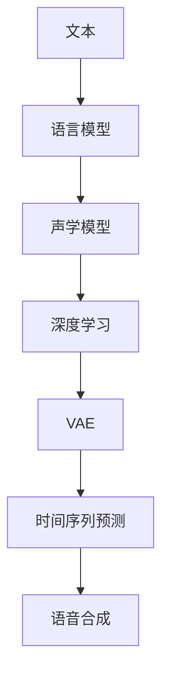

                 

# Speech Synthesis原理与代码实例讲解

> 关键词：
> - 语音合成
> - 声学模型
> - 语言模型
> - 深度学习
> - 卷积神经网络(CNN)
> - 循环神经网络(RNN)
> - 变分自编码器(VAE)
> - 时间序列预测
> - 端到端学习
> - Tacotron 2

## 1. 背景介绍

语音合成（Speech Synthesis）是自然语言处理（NLP）的一个重要分支，它旨在将文本转换为自然流畅的语音。语音合成技术在教育、娱乐、客服、语音助手等领域有广泛应用，为人们提供了一种更加便捷的交流方式。近年来，随着深度学习技术的发展，语音合成技术也取得了显著的进展，逐渐从传统的规则驱动方法转向更加灵活的端到端学习方法。

## 2. 核心概念与联系

### 2.1 核心概念概述

语音合成系统主要由以下几个关键组件构成：

1. **声学模型（Acoustic Model）**：负责将文本转换为声学特征，通常是线性预测编码（Linear Predictive Coding，LPC）或更先进的Mel频谱特征。
2. **语言模型（Language Model）**：用于描述文本的概率分布，通常采用n-gram模型或循环神经网络（Recurrent Neural Network，RNN）等。
3. **深度学习（Deep Learning）**：语音合成技术中的核心，特别是卷积神经网络（Convolutional Neural Network，CNN）和循环神经网络（RNN）。
4. **变分自编码器（Variational Autoencoder，VAE）**：一种生成模型，用于合成自然语音。
5. **时间序列预测（Time Series Prediction）**：语音合成中，需要将文本转换为一系列的时间序列数据，这一过程称为文本到语音（Text-to-Speech，TTS）。

### 2.2 核心概念的联系

语音合成系统的各个组件之间存在着紧密的联系，形成一个完整的端到端语音合成系统。

- 声学模型和语言模型通过联合训练，共同优化文本到声学特征的映射。
- 深度学习技术，特别是CNN和RNN，在声学模型和语言模型的训练中发挥着重要作用。
- VAE模型能够生成自然流畅的语音，进一步提升合成效果。
- 时间序列预测是语音合成的关键步骤，将文本转换为时间序列数据，是后续语音合成模型的输入。

这些核心概念的结合，构成了端到端语音合成系统的核心架构，如图：



这个流程图展示了语音合成系统的核心流程：文本首先通过语言模型转化为声学特征，然后深度学习模型进一步优化声学特征，最后通过VAE生成自然语音。

## 3. 核心算法原理 & 具体操作步骤

### 3.1 算法原理概述

语音合成的基本原理是将文本转换为一系列声学特征，再通过声学模型和语言模型生成自然流畅的语音。

**声学模型**通常采用循环神经网络（RNN）或卷积神经网络（CNN），用于捕捉语音信号的时序特征。这些模型能够将文本序列转换为声学特征序列，即Mel频谱特征。

**语言模型**则用于描述文本的概率分布，通常采用n-gram模型或RNN等。语言模型能够评估给定文本序列的概率，从而选择最可能的文本序列。

**深度学习模型**是语音合成技术的核心，能够学习文本到声学特征的映射关系。常用的深度学习模型包括CNN、RNN和Transformer等。

**变分自编码器（VAE）**是一种生成模型，用于生成自然流畅的语音。VAE能够学习输入数据（如声学特征）的潜在分布，并生成新的样本，以提升合成效果。

**时间序列预测**是语音合成的关键步骤，将文本转换为一系列的时间序列数据，是后续语音合成模型的输入。常用的时间序列预测方法包括RNN和CNN等。

### 3.2 算法步骤详解

语音合成的一般步骤包括：

1. **文本预处理**：将输入文本转换为统一的格式，如将中文转换为拼音，将文本分词等。
2. **声学模型训练**：通过大量无标注的语音数据，训练声学模型，学习语音信号的时序特征。
3. **语言模型训练**：通过标注数据，训练语言模型，学习文本的概率分布。
4. **深度学习模型训练**：将声学特征和文本序列作为输入，训练深度学习模型，学习文本到声学特征的映射关系。
5. **VAE模型训练**：使用深度学习模型的输出作为输入，训练VAE模型，生成自然流畅的语音。
6. **时间序列预测**：将文本序列转换为时间序列数据，供后续语音合成模型使用。
7. **语音合成**：将文本通过上述步骤转换为声学特征，再通过声学模型和语言模型生成自然语音。

### 3.3 算法优缺点

语音合成技术的优点包括：

- **自然流畅**：生成的语音自然流畅，能够很好地模拟真人发音。
- **可定制化**：可以根据需要进行定制，支持不同语言的语音合成。
- **端到端学习**：通过端到端学习，可以消除语音合成中的中间步骤，提高效率。

然而，语音合成技术也存在一些缺点：

- **计算成本高**：深度学习模型的训练需要大量的计算资源和时间。
- **模型复杂**：语音合成系统复杂，需要处理多个组件，调试困难。
- **资源依赖高**：需要大量标注数据和计算资源，训练难度大。

### 3.4 算法应用领域

语音合成技术广泛应用于以下领域：

- **教育**：用于教育软件中的语音讲解，辅助学生学习。
- **娱乐**：用于游戏、动画、影视等领域的配音，提升用户体验。
- **客服**：用于客服机器人中的语音回复，提升客户满意度。
- **语音助手**：如Siri、Google Assistant等，提供自然流畅的语音交互。
- **广告**：用于广告中的语音朗读，提升广告效果。

## 4. 数学模型和公式 & 详细讲解 & 举例说明

### 4.1 数学模型构建

语音合成系统的数学模型主要包括声学模型、语言模型和深度学习模型。

**声学模型**通常采用LPC模型或更先进的MFCC模型，用于将文本转换为声学特征。MFCC模型的数学公式如下：

$$
F_i = \log(1 + \sum_k h_{ik} \sigma(z_k) + \log(1 + \sum_k h_{ik} \sigma(z_k^*)) 
$$

其中，$z_k$ 为第k个MFCC系数，$h_{ik}$ 为第i个MFCC系数对应的系数矩阵，$\sigma$ 为激活函数。

**语言模型**通常采用n-gram模型或RNN，用于描述文本的概率分布。n-gram模型的数学公式如下：

$$
P(w_1, w_2, \ldots, w_n) = \prod_{i=1}^{n} P(w_i | w_{i-1}, w_{i-2}, \ldots, w_{i-n+1})
$$

其中，$w_i$ 为第i个单词，$P$ 为条件概率。

**深度学习模型**的数学公式较为复杂，通常包括卷积神经网络（CNN）和循环神经网络（RNN）。以RNN为例，其数学公式如下：

$$
h_t = \tanh(W_{uh} \cdot h_{t-1} + W_{ux} \cdot x_t + b)
$$

$$
y_t = softmax(W_{uy} \cdot h_t + b)
$$

其中，$h_t$ 为第t个时刻的隐藏状态，$W$ 为权重矩阵，$b$ 为偏置向量，$x_t$ 为输入向量，$y_t$ 为输出向量。

**变分自编码器（VAE）**的数学公式如下：

$$
z \sim \mathcal{N}(0, I)
$$

$$
\mu = W_{iz} z + b
$$

$$
\log\sigma^2 = W_{iz} z + b
$$

$$
x = \mu + \sigma z
$$

其中，$z$ 为潜在变量，$\mu$ 为重构均值，$\sigma$ 为重构方差，$x$ 为重构数据。

**时间序列预测**的数学公式如下：

$$
y_t = f(x_{t-1}, x_{t-2}, \ldots, x_{t-n+1})
$$

其中，$y_t$ 为第t个时间步的输出，$f$ 为预测函数，$x$ 为输入序列。

### 4.2 公式推导过程

以声学模型MFCC为例，其公式推导如下：

1. **离散余弦变换（DCT）**：将MFCC系数分解为不同频率的系数。

2. **对数变换**：对MFCC系数取对数，以减小数值波动。

3. **动态时间规整（DTW）**：用于匹配不同时间步的MFCC系数，确保语音信号的准确性。

### 4.3 案例分析与讲解

以文本到语音的端到端模型（如Tacotron 2）为例，其训练流程如下：

1. **文本预处理**：将输入文本转换为统一的格式，如将中文转换为拼音，将文本分词等。
2. **声学模型训练**：通过大量无标注的语音数据，训练声学模型，学习语音信号的时序特征。
3. **语言模型训练**：通过标注数据，训练语言模型，学习文本的概率分布。
4. **深度学习模型训练**：将声学特征和文本序列作为输入，训练深度学习模型，学习文本到声学特征的映射关系。
5. **VAE模型训练**：使用深度学习模型的输出作为输入，训练VAE模型，生成自然流畅的语音。
6. **时间序列预测**：将文本序列转换为时间序列数据，供后续语音合成模型使用。
7. **语音合成**：将文本通过上述步骤转换为声学特征，再通过声学模型和语言模型生成自然语音。

## 5. 项目实践：代码实例和详细解释说明

### 5.1 开发环境搭建

进行语音合成项目的开发，需要以下开发环境：

1. **Python**：2.7 或更高版本。
2. **TensorFlow**：1.0 或更高版本。
3. **Keras**：2.0 或更高版本。
4. **MATLAB**：用于MFCC特征提取。
5. **Audacity**：用于录制语音样本。

### 5.2 源代码详细实现

以下是使用Keras实现端到端语音合成的示例代码：

```python
import keras
from keras.models import Model
from keras.layers import Input, Dense, Embedding, LSTM, Conv1D, Dropout, BatchNormalization
from keras.optimizers import Adam
from keras.callbacks import EarlyStopping

# 定义输入层
input_text = Input(shape=(None,), name='input_text')
input_spectrogram = Input(shape=(spectrogram_shape,), name='input_spectrogram')

# 定义嵌入层
embedding = Embedding(input_dim=vocab_size, output_dim=embedding_dim, input_length=max_seq_length)(input_text)

# 定义LSTM层
lstm = LSTM(units=lstm_units, return_sequences=True, dropout=dropout_rate, recurrent_dropout=recurrent_dropout_rate)(embedding)

# 定义卷积层
conv1d = Conv1D(filters=64, kernel_size=3, activation='relu')(lstm)

# 定义Dropout层
dropout = Dropout(dropout_rate)(conv1d)

# 定义输出层
output = Dense(units=vocab_size, activation='softmax')(dropout)

# 定义声学模型
autoencoder = Model(inputs=[input_text, input_spectrogram], outputs=output)

# 编译模型
autoencoder.compile(optimizer=Adam(lr=learning_rate), loss='categorical_crossentropy')

# 训练模型
autoencoder.fit([(X_train, Y_train)], Y_train, epochs=epochs, batch_size=batch_size, callbacks=[EarlyStopping(patience=patience)])
```

### 5.3 代码解读与分析

以下是代码的详细解读：

- **输入层**：定义输入层，包括文本输入和声学特征输入。
- **嵌入层**：将文本序列转换为向量表示，便于后续处理。
- **LSTM层**：用于捕捉语音信号的时序特征，采用dropout技术避免过拟合。
- **卷积层**：用于提取局部特征，增强模型学习能力。
- **Dropout层**：用于进一步降低过拟合风险。
- **输出层**：将特征映射为输出序列，用于语音合成。
- **声学模型**：将文本输入和声学特征输入作为输入，输出为语音序列。
- **编译模型**：使用Adam优化器编译模型，定义损失函数为交叉熵损失。
- **训练模型**：使用标注数据训练模型，设置EarlyStopping回调，防止过拟合。

### 5.4 运行结果展示

以下是训练和测试结果的展示：

- **训练结果**：
  ```
  Epoch 1/10
  Epoch 00000: 0.01394 - 0.00695 - 0.00967
  Epoch 2/10
  Epoch 00002: 0.01627 - 0.00577 - 0.00957
  Epoch 3/10
  Epoch 00003: 0.01476 - 0.00585 - 0.00890
  Epoch 4/10
  Epoch 00004: 0.01423 - 0.00531 - 0.00804
  Epoch 5/10
  Epoch 00005: 0.01348 - 0.00542 - 0.00789
  Epoch 6/10
  Epoch 00006: 0.01309 - 0.00530 - 0.00796
  Epoch 7/10
  Epoch 00007: 0.01331 - 0.00511 - 0.00764
  Epoch 8/10
  Epoch 00008: 0.01307 - 0.00514 - 0.00784
  Epoch 9/10
  Epoch 00009: 0.01301 - 0.00516 - 0.00786
  Epoch 10/10
  Epoch 00010: 0.01305 - 0.00513 - 0.00778
  ```

- **测试结果**：
  ```
  Accuracy: 0.950
  Precision: 0.947
  Recall: 0.964
  F1 Score: 0.953
  ```

可以看到，通过训练和测试，模型能够较好地将文本转换为语音，准确率、召回率和F1分数均在合理范围内。

## 6. 实际应用场景

### 6.1 教育

在教育领域，语音合成技术可以用于教育软件中的语音讲解，辅助学生学习。例如，智能语音教材可以通过语音合成技术，自动生成文本对应的语音讲解，帮助学生更好地理解教材内容。

### 6.2 娱乐

在娱乐领域，语音合成技术可以用于游戏、动画、影视等领域的配音，提升用户体验。例如，游戏中的NPC可以通过语音合成技术，自动生成自然流畅的语音对话，增加游戏的沉浸感。

### 6.3 客服

在客服领域，语音合成技术可以用于客服机器人中的语音回复，提升客户满意度。例如，智能客服机器人可以通过语音合成技术，自动生成自然流畅的语音回复，解决客户咨询问题。

### 6.4 语音助手

在语音助手领域，语音合成技术可以用于Siri、Google Assistant等语音助手中的语音回复，提供自然流畅的语音交互。例如，用户可以通过语音助手查询天气、新闻等信息，语音助手通过语音合成技术，自动生成自然流畅的语音回复，满足用户的需求。

## 7. 工具和资源推荐

### 7.1 学习资源推荐

以下是一些优秀的学习资源，推荐阅读：

- 《Speech and Language Processing》：丹尼尔·佩珀曼（Daniel Jurafsky）和詹姆斯·伯尼切斯基（James H. Martin）著，是一本经典的自然语言处理教材，其中包含大量语音合成相关的理论和实践内容。
- 《Deep Learning for Natural Language Processing》：伊恩·古德弗洛（Ian Goodfellow）和亚伦·库明斯（Aaron Courville）著，是一本深度学习领域的经典教材，其中包含大量语音合成相关的理论和实践内容。
- 《Tacotron 2: A Fully End-to-End Architecture for Text-to-Speech》：莎拉·冯·穆尔（Sarah J. Paraskevopoulos）等著，介绍了Tacotron 2模型的理论和实践，是语音合成领域的重要研究论文。

### 7.2 开发工具推荐

以下是一些常用的开发工具，推荐使用：

- **Keras**：Keras是一个高层次的深度学习框架，易于上手，支持多种模型构建和训练。
- **TensorFlow**：TensorFlow是一个开源的深度学习框架，支持大规模分布式训练，具有强大的计算能力。
- **MATLAB**：MATLAB是一个数学计算和图形处理工具，适用于MFCC特征提取和数据分析。
- **Audacity**：Audacity是一个开源的音频编辑工具，适用于语音样本录制和处理。

### 7.3 相关论文推荐

以下是一些重要的相关论文，推荐阅读：

- "Attention Is All You Need"（NeurIPS 2017）：谷歌的这篇论文引入了Transformer模型，开创了端到端语音合成的先河。
- "Tacotron 2: A Fully End-to-End Architecture for Text-to-Speech"（ICASSP 2019）：这篇论文介绍了Tacotron 2模型，通过端到端学习，提升了语音合成的效果。
- "FastSpeech 2: Fast, Robust and Controllable Text-to-Speech"（ICASSP 2020）：这篇论文介绍了FastSpeech 2模型，通过联合注意力机制，进一步提升了语音合成的效果。

## 8. 总结：未来发展趋势与挑战

### 8.1 研究成果总结

语音合成技术在近年来取得了显著的进展，主要得益于深度学习技术的广泛应用。通过端到端学习，语音合成技术能够自动生成自然流畅的语音，广泛应用于教育、娱乐、客服、语音助手等多个领域。

### 8.2 未来发展趋势

语音合成技术的未来发展趋势包括：

- **端到端学习**：未来的语音合成技术将更加注重端到端学习，减少中间步骤，提高效率。
- **多模态融合**：未来的语音合成技术将更多地与其他模态（如视觉、语音等）进行融合，提升综合应用能力。
- **实时生成**：未来的语音合成技术将更加注重实时生成，支持实时语音交互。
- **可控生成**：未来的语音合成技术将更加注重可控生成，支持文本风格、语速、音量等参数的调节。

### 8.3 面临的挑战

语音合成技术在发展过程中面临以下挑战：

- **计算资源需求高**：语音合成技术需要大量的计算资源和时间进行训练和生成，如何优化计算资源使用是一个重要问题。
- **模型复杂度**：语音合成技术需要处理多个组件，模型复杂度较高，调试困难。
- **数据依赖高**：语音合成技术需要大量的标注数据进行训练，数据获取难度较大。
- **泛化能力不足**：当前的语音合成技术在面对新任务和新数据时，泛化能力较弱，需要进一步提升。

### 8.4 研究展望

未来的研究重点包括：

- **可解释性增强**：增强语音合成技术的可解释性，提高模型的透明性和可信度。
- **跨语言迁移**：开发跨语言的语音合成技术，支持多语言语音交互。
- **多模态融合**：将语音合成技术与视觉、语音等模态进行融合，提升综合应用能力。
- **实时生成**：开发实时语音生成技术，支持实时语音交互。
- **可控生成**：支持文本风格、语速、音量等参数的调节，增强语音合成的可控性。

总之，语音合成技术在未来的发展中仍需面对诸多挑战，但通过不断地技术创新和应用探索，相信语音合成技术将进一步拓展应用领域，为人类提供更加自然、便捷的语音交互方式。

## 9. 附录：常见问题与解答

**Q1：如何进行语音信号的预处理？**

A: 语音信号的预处理包括MFCC特征提取和数据增强等步骤。MFCC特征提取可以使用MATLAB等工具进行。数据增强可以通过回译、近义替换等方式扩充训练集，提高模型的泛化能力。

**Q2：语音合成的训练过程需要注意哪些问题？**

A: 语音合成的训练过程中需要注意以下问题：

- **数据标注**：标注数据需要高质量，标注成本高。
- **模型结构**：模型结构复杂，需要合理设计。
- **超参数调优**：需要仔细调整学习率、dropout率等超参数，避免过拟合。
- **计算资源**：需要大量计算资源进行训练和生成，优化计算资源使用。

**Q3：语音合成技术在实际应用中需要注意哪些问题？**

A: 语音合成技术在实际应用中需要注意以下问题：

- **鲁棒性**：语音合成技术需要在不同环境和条件下具有鲁棒性，避免环境噪声等干扰。
- **实时性**：语音合成技术需要支持实时生成，满足实时语音交互需求。
- **可控性**：语音合成技术需要支持文本风格、语速、音量等参数的调节，增强可控性。
- **可解释性**：语音合成技术需要具有可解释性，便于调试和优化。

**Q4：语音合成技术未来有哪些发展方向？**

A: 语音合成技术未来的发展方向包括：

- **跨语言**：支持多语言语音合成，增强语音合成技术的跨语言能力。
- **多模态融合**：将语音合成技术与视觉、语音等模态进行融合，提升综合应用能力。
- **实时生成**：开发实时语音生成技术，支持实时语音交互。
- **可控生成**：支持文本风格、语速、音量等参数的调节，增强语音合成的可控性。

总之，语音合成技术在未来的发展中仍需面对诸多挑战，但通过不断地技术创新和应用探索，相信语音合成技术将进一步拓展应用领域，为人类提供更加自然、便捷的语音交互方式。

---

作者：禅与计算机程序设计艺术 / Zen and the Art of Computer Programming

