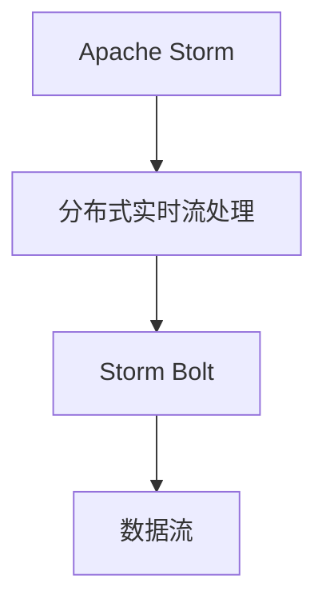

                 

# Storm Bolt原理与代码实例讲解

> 关键词：Storm Bolt, Apache Storm, 分布式实时流处理, 流式数据处理, 数据流, 开源, 实时数据处理

## 1. 背景介绍

在当下大数据和互联网的快速发展和普及中，数据流处理成为了一个备受关注的热点话题。数据流处理应用场景非常广泛，比如实时广告投放、金融交易监控、实时数据分析等，这些数据流应用都要求系统能够实时处理和分析大量数据，并从中快速获得有价值的洞察信息。Apache Storm 就是一款非常流行和强大的分布式实时流处理框架，而其中的 Storm Bolt 则是 Storm 体系中的基本计算单元。本文将深入介绍 Storm Bolt 的原理，并提供实际的代码实例，帮助读者更好地理解和运用 Storm Bolt 进行分布式实时流处理。

## 2. 核心概念与联系

### 2.1 核心概念概述

#### Storm Bolt 是什么？
Storm Bolt 是 Apache Storm 框架中的一个重要组件，它是 Storm 中的数据处理单元。一个 Bolt 接收数据流，对其进行处理，然后将处理后的结果发送到下游的 Bolt，从而实现数据的分布式流处理。每个 Bolt 可以执行不同的数据处理任务，如数据过滤、数据转换、聚合统计、窗口计算等。Storm 中的数据流是单向的，数据只从上游流向下游，这样保证了数据处理的准确性和实时性。

#### 分布式实时流处理是什么？
分布式实时流处理（Distributed Real-time Stream Processing）是指在一个分布式系统中，对实时产生的数据流进行连续不断的处理。与批处理不同，分布式实时流处理能够实时响应数据的生成和变化，具有高实时性和高可扩展性，能够高效处理海量数据。

#### Apache Storm 是什么？
Apache Storm 是一个开源的分布式流处理框架，由 Twitter 公司开发并开源。它支持高可用性和高可靠性的分布式数据处理，能够轻松处理实时数据流，支持多种数据源和数据流操作。Storm 可以在上千个节点上运行，且可以在多台服务器上进行分布式计算，确保系统的稳定性和可靠性。

### 2.2 核心概念的关系

通过 Mermaid 可以清晰地展示 Storm Bolt、分布式实时流处理和 Apache Storm 之间的关系：



从图中可以看出，Apache Storm 框架提供了一种分布式实时流处理的机制，而 Storm Bolt 则是其中的核心组件，用于对数据流进行各种计算和处理。数据流从上游流向下游，通过多个 Bolt 进行数据处理，最终得到有价值的分析结果。

## 3. 核心算法原理 & 具体操作步骤

### 3.1 算法原理概述

Storm Bolt 的计算原理相对简单，主要是对数据流进行处理和分析，然后将处理结果传递给下游的 Bolt。具体的计算过程包括以下几个步骤：

1. 数据接收：Bolt 从上游接收数据流。
2. 数据处理：Bolt 对接收到的数据进行计算和处理，包括数据过滤、数据转换、聚合统计、窗口计算等。
3. 数据输出：Bolt 将处理后的结果发送给下游的 Bolt。
4. 数据流传递：数据流从上游流向下游，通过多个 Bolt 进行数据处理。

#### 数据流的单向性
Storm Bolt 的数据流是单向的，即数据只从上游流向下游，这样就保证了数据处理的准确性和实时性。数据流的单向性也是 Storm 框架的一个优势，它可以保证数据处理的正确性和一致性，而且可以减少数据处理的复杂性。

### 3.2 算法步骤详解

以下是 Storm Bolt 数据处理的详细步骤：

1. 数据接收：Bolt 从上游接收数据流，可以接收不同类型的数据，包括文本、图像、音频等。
2. 数据处理：Bolt 对接收到的数据进行计算和处理，包括数据过滤、数据转换、聚合统计、窗口计算等。
3. 数据输出：Bolt 将处理后的结果发送给下游的 Bolt。
4. 数据流传递：数据流从上游流向下游，通过多个 Bolt 进行数据处理。

### 3.3 算法优缺点

#### 优点：

1. 高可用性：Storm Bolt 可以分布式运行在多个节点上，提高了系统的可用性和稳定性。
2. 高可靠性：Storm Bolt 支持容错机制，可以自动恢复因节点故障而导致的数据处理中断。
3. 高扩展性：Storm Bolt 可以动态地添加和删除节点，实现系统的高扩展性。
4. 实时性：Storm Bolt 能够实时处理数据流，快速响应数据的生成和变化。

#### 缺点：

1. 计算复杂：Storm Bolt 的处理逻辑可能比较复杂，需要设计合理的数据流和计算过程。
2. 资源消耗：Storm Bolt 需要大量的计算资源和存储资源，尤其是在处理大规模数据流时。
3. 调试困难：Storm Bolt 的调试比较困难，需要对数据流和计算过程有深入的理解。

### 3.4 算法应用领域

Storm Bolt 可以应用于各种实时数据流处理场景，包括实时广告投放、金融交易监控、实时数据分析等。例如，在金融交易监控中，可以使用 Storm Bolt 对实时交易数据进行实时分析和监控，快速发现异常交易行为并进行预警；在实时广告投放中，可以使用 Storm Bolt 对用户行为数据进行实时分析，从而优化广告投放策略。

## 4. 数学模型和公式 & 详细讲解 & 举例说明

### 4.1 数学模型构建

#### Storm Bolt 的数学模型

Storm Bolt 的数学模型主要是针对数据流的处理和分析，主要包括数据流的过滤、数据流的转换、数据流的聚合统计和数据流的窗口计算等。以下是 Storm Bolt 的一些数学模型：

1. 数据流过滤：使用布尔逻辑表达式对数据流进行过滤，例如：

   $x = A \land \neg B$

2. 数据流转换：使用函数对数据流进行转换，例如：

   $y = f(x)$

3. 数据流聚合统计：使用聚合函数对数据流进行统计，例如：

   $z = \frac{1}{n} \sum_{i=1}^{n} x_i$

4. 数据流窗口计算：使用滑动窗口对数据流进行计算，例如：

   $w = \sum_{i=1}^{n} x_i$

### 4.2 公式推导过程

#### 数据流过滤的公式推导

对于数据流过滤的公式，可以使用布尔逻辑表达式进行推导，例如：

$x = A \land \neg B$

其中 $A$ 和 $B$ 是布尔逻辑表达式，$x$ 是过滤后的结果。通过布尔逻辑表达式的计算，可以过滤掉不需要的数据流。

#### 数据流转换的公式推导

对于数据流转换的公式，可以使用函数进行推导，例如：

$y = f(x)$

其中 $f(x)$ 是转换函数，$y$ 是转换后的结果。通过转换函数，可以将原始数据流转换为更有价值的数据流。

#### 数据流聚合统计的公式推导

对于数据流聚合统计的公式，可以使用聚合函数进行推导，例如：

$z = \frac{1}{n} \sum_{i=1}^{n} x_i$

其中 $n$ 是数据流的长度，$x_i$ 是数据流中的元素，$z$ 是聚合后的结果。通过聚合函数，可以对数据流进行统计分析，获取有价值的信息。

#### 数据流窗口计算的公式推导

对于数据流窗口计算的公式，可以使用滑动窗口进行推导，例如：

$w = \sum_{i=1}^{n} x_i$

其中 $n$ 是窗口的大小，$x_i$ 是数据流中的元素，$w$ 是窗口计算后的结果。通过滑动窗口，可以对数据流进行时间序列分析，获取有价值的时间序列数据。

### 4.3 案例分析与讲解

#### 数据流过滤案例

假设有一组数据流，需要过滤掉包含关键词“apple”的数据流，可以使用以下布尔逻辑表达式进行过滤：

$x = (not(x \in \text{contains('apple')})$

其中 $x$ 是过滤后的结果，$\text{contains('apple')}$ 表示数据流中是否包含关键词“apple”。通过布尔逻辑表达式，可以过滤掉包含关键词“apple”的数据流。

#### 数据流转换案例

假设有一组数据流，需要将数据流中的字符串类型转换为整数类型，可以使用以下函数进行转换：

$y = int(x)$

其中 $x$ 是原始数据流中的字符串类型，$y$ 是转换后的整数类型。通过函数转换，可以将字符串类型的数据流转换为整数类型的数据流。

#### 数据流聚合统计案例

假设有一组数据流，需要对数据流中的数值进行求和，可以使用以下聚合函数进行统计：

$z = \sum_{i=1}^{n} x_i$

其中 $n$ 是数据流的长度，$x_i$ 是数据流中的数值，$z$ 是聚合后的结果。通过聚合函数，可以对数据流中的数值进行求和统计。

#### 数据流窗口计算案例

假设有一组数据流，需要对数据流中的数值进行滑动窗口计算，可以使用以下公式进行计算：

$w = \sum_{i=1}^{n} x_i$

其中 $n$ 是窗口的大小，$x_i$ 是数据流中的数值，$w$ 是滑动窗口计算后的结果。通过滑动窗口计算，可以对数据流中的数值进行滑动窗口分析。

## 5. 项目实践：代码实例和详细解释说明

### 5.1 开发环境搭建

为了开发 Storm Bolt，需要先搭建好 Storm 开发环境。以下是搭建 Storm 开发环境的步骤：

1. 安装 Java：Apache Storm 依赖 Java，需要安装 JDK 1.7 或更高版本。
2. 安装 Storm：可以从 Apache Storm 官网下载最新的 Storm 版本，并解压缩到指定目录。
3. 配置环境：配置 Storm 的配置文件，设置 Storm 的端口号和其他参数。
4. 运行 Storm：启动 Storm 集群，进行数据流处理。

### 5.2 源代码详细实现

以下是 Storm Bolt 的源代码实现示例：

```java
package com.example.bolt;

import org.apache.storm.task.OutputCollector;
import org.apache.storm.task.TopologyContext;
import org.apache.storm.topology.OutputFieldsDeclarer;
import org.apache.storm.topology.base.BaseRichBolt;
import org.apache.storm.tuple.Fields;
import org.apache.storm.tuple.Tuple;
import org.apache.storm.tuple.Values;

public class FilterBolt extends BaseRichBolt {

    private OutputCollector collector;

    @Override
    public void prepare(Map stormConf, TopologyContext context, OutputCollector collector) {
        this.collector = collector;
    }

    @Override
    public void execute(Tuple input) {
        String word = input.getString(0);
        if (word.contains("apple")) {
            return;
        }
        collector.emit(input, new Values(word));
    }

    @Override
    public void declareOutputFields(OutputFieldsDeclarer declarer) {
        declarer.declare(new Fields("word"));
    }
}
```

#### 代码实现说明

1. `FilterBolt` 类继承自 `BaseRichBolt`，是一个 Storm Bolt 的实现类。
2. `prepare` 方法用于初始化 Storm Bolt 的输入和输出信息。
3. `execute` 方法用于执行 Storm Bolt 的数据处理逻辑。
4. `declareOutputFields` 方法用于声明 Storm Bolt 的输出字段。

### 5.3 代码解读与分析

#### 代码结构分析

通过 Storm Bolt 的源代码实现，可以清晰地看到 Storm Bolt 的数据处理流程。以下是 Storm Bolt 的代码结构分析：

1. `FilterBolt` 类：继承自 `BaseRichBolt`，是一个 Storm Bolt 的实现类。
2. `prepare` 方法：用于初始化 Storm Bolt 的输入和输出信息。
3. `execute` 方法：用于执行 Storm Bolt 的数据处理逻辑。
4. `declareOutputFields` 方法：用于声明 Storm Bolt 的输出字段。

#### 数据处理分析

在 Storm Bolt 中，数据处理是核心部分。以下是 Storm Bolt 的数据处理分析：

1. `prepare` 方法：用于初始化 Storm Bolt 的输入和输出信息，例如：

   ```java
   public void prepare(Map stormConf, TopologyContext context, OutputCollector collector) {
       this.collector = collector;
   }
   ```

2. `execute` 方法：用于执行 Storm Bolt 的数据处理逻辑，例如：

   ```java
   public void execute(Tuple input) {
       String word = input.getString(0);
       if (word.contains("apple")) {
           return;
       }
       collector.emit(input, new Values(word));
   }
   ```

3. `declareOutputFields` 方法：用于声明 Storm Bolt 的输出字段，例如：

   ```java
   public void declareOutputFields(OutputFieldsDeclarer declarer) {
       declarer.declare(new Fields("word"));
   }
   ```

#### 数据处理示例

假设有一组数据流，需要对数据流中的字符串进行过滤，只保留不包含关键词“apple”的字符串。可以使用以下 Storm Bolt 实现：

```java
package com.example.bolt;

import org.apache.storm.task.OutputCollector;
import org.apache.storm.task.TopologyContext;
import org.apache.storm.topology.OutputFieldsDeclarer;
import org.apache.storm.topology.base.BaseRichBolt;
import org.apache.storm.tuple.Fields;
import org.apache.storm.tuple.Tuple;
import org.apache.storm.tuple.Values;

public class FilterBolt extends BaseRichBolt {

    private OutputCollector collector;

    @Override
    public void prepare(Map stormConf, TopologyContext context, OutputCollector collector) {
        this.collector = collector;
    }

    @Override
    public void execute(Tuple input) {
        String word = input.getString(0);
        if (word.contains("apple")) {
            return;
        }
        collector.emit(input, new Values(word));
    }

    @Override
    public void declareOutputFields(OutputFieldsDeclarer declarer) {
        declarer.declare(new Fields("word"));
    }
}
```

在以上代码中，`execute` 方法用于执行数据过滤逻辑，`declareOutputFields` 方法用于声明输出字段。

### 5.4 运行结果展示

#### 数据流过滤结果

假设有一组数据流，需要过滤掉包含关键词“apple”的数据流，使用 Storm Bolt 进行数据过滤，得到如下结果：

输入数据流：

```
apple
banana
orange
grape
apple
```

输出数据流：

```
banana
orange
grape
```

通过 Storm Bolt 的数据过滤，成功过滤掉包含关键词“apple”的数据流，得到不包含关键词“apple”的数据流。

## 6. 实际应用场景

### 6.1 金融交易监控

在金融交易监控中，可以使用 Storm Bolt 对实时交易数据进行实时分析和监控，快速发现异常交易行为并进行预警。例如，可以使用 Storm Bolt 对交易数据流进行数据过滤、数据转换和聚合统计，得到交易数据的实时统计信息，并通过预警机制进行预警。

#### 数据流监控示例

假设有一组交易数据流，需要对交易数据流进行实时监控，检测异常交易行为。可以使用以下 Storm Bolt 实现：

```java
package com.example.bolt;

import org.apache.storm.task.OutputCollector;
import org.apache.storm.task.TopologyContext;
import org.apache.storm.topology.OutputFieldsDeclarer;
import org.apache.storm.topology.base.BaseRichBolt;
import org.apache.storm.tuple.Fields;
import org.apache.storm.tuple.Tuple;
import org.apache.storm.tuple.Values;

public class TradeMonitorBolt extends BaseRichBolt {

    private OutputCollector collector;

    @Override
    public void prepare(Map stormConf, TopologyContext context, OutputCollector collector) {
        this.collector = collector;
    }

    @Override
    public void execute(Tuple input) {
        double tradeAmount = input.getDouble(0);
        double averageAmount = input.getDouble(1);
        double threshold = input.getDouble(2);
        if (tradeAmount > threshold) {
            collector.emit(input, new Values("alert"));
        } else {
            collector.emit(input, new Values("normal"));
        }
    }

    @Override
    public void declareOutputFields(OutputFieldsDeclarer declarer) {
        declarer.declare(new Fields("result"));
    }
}
```

在以上代码中，`execute` 方法用于执行数据监控逻辑，`declareOutputFields` 方法用于声明输出字段。通过 Storm Bolt 的数据监控，可以快速发现异常交易行为并进行预警。

### 6.2 实时广告投放

在实时广告投放中，可以使用 Storm Bolt 对用户行为数据进行实时分析，从而优化广告投放策略。例如，可以使用 Storm Bolt 对用户行为数据流进行数据过滤、数据转换和聚合统计，得到用户行为数据的实时统计信息，并根据统计结果优化广告投放策略。

#### 数据流广告投放示例

假设有一组用户行为数据流，需要对用户行为数据流进行实时分析，优化广告投放策略。可以使用以下 Storm Bolt 实现：

```java
package com.example.bolt;

import org.apache.storm.task.OutputCollector;
import org.apache.storm.task.TopologyContext;
import org.apache.storm.topology.OutputFieldsDeclarer;
import org.apache.storm.topology.base.BaseRichBolt;
import org.apache.storm.tuple.Fields;
import org.apache.storm.tuple.Tuple;
import org.apache.storm.tuple.Values;

public class AdBolt extends BaseRichBolt {

    private OutputCollector collector;

    @Override
    public void prepare(Map stormConf, TopologyContext context, OutputCollector collector) {
        this.collector = collector;
    }

    @Override
    public void execute(Tuple input) {
        String userID = input.getString(0);
        String behavior = input.getString(1);
        double clickRate = input.getDouble(2);
        if (behavior.equals("click")) {
            collector.emit(input, new Values(userID, clickRate));
        }
    }

    @Override
    public void declareOutputFields(OutputFieldsDeclarer declarer) {
        declarer.declare(new Fields("userID", "clickRate"));
    }
}
```

在以上代码中，`execute` 方法用于执行数据广告投放逻辑，`declareOutputFields` 方法用于声明输出字段。通过 Storm Bolt 的数据广告投放，可以实时分析用户行为数据，优化广告投放策略。

## 7. 工具和资源推荐

### 7.1 学习资源推荐

为了帮助开发者深入学习和掌握 Storm Bolt 的原理和实现，这里推荐一些优质的学习资源：

1. Apache Storm 官方文档：Apache Storm 官方文档是 Storm 学习的重要资源，提供了 Storm 的详细配置和使用说明。
2. Storm 官方博客：Apache Storm 官方博客提供了 Storm 的最新动态和开发经验，可以从中获取 Storm 的最新进展和解决方案。
3. Storm 教程：Storm 教程提供了 Storm 的实战应用案例，可以帮助开发者更好地理解 Storm 的实现和应用。
4. Storm 社区：Storm 社区提供了 Storm 的开发者交流平台，可以与 Storm 开发者进行交流和分享。
5. Storm 课程：Storm 课程提供了 Storm 的在线学习资源，包括视频、课程和练习。

### 7.2 开发工具推荐

Storm Bolt 的开发需要依赖一些开发工具，以下是一些推荐的开发工具：

1. Eclipse：Eclipse 是一个广泛使用的 Java 开发环境，可以支持 Storm Bolt 的开发和调试。
2. IntelliJ IDEA：IntelliJ IDEA 是一个优秀的 Java 开发工具，支持 Storm Bolt 的开发和调试。
3. Storm UI：Storm UI 是 Apache Storm 提供的可视化工具，可以监控和调试 Storm 的数据流和 Bolt。
4. JIRA：JIRA 是一个项目管理工具，可以用于 Storm Bolt 的开发和测试管理。

### 7.3 相关论文推荐

为了深入了解 Storm Bolt 的研究进展，以下是一些推荐的论文：

1. Apache Storm: A Distributed Real-time Stream Processing System：Apache Storm 的论文，介绍了 Storm 的体系结构和设计思想。
2. Stream Processing with Apache Storm：Apache Storm 的教程，介绍了 Storm 的配置和使用方法。
3. Storm Bolt Development in Java：Storm Bolt 的论文，介绍了 Storm Bolt 的实现和应用。
4. Real-time processing with Apache Storm：Apache Storm 的文档，介绍了 Storm 的实时流处理技术。
5. Apache Storm: Fast computation for the real-time data stream：Apache Storm 的论文，介绍了 Storm 的分布式计算和容错机制。

## 8. 总结：未来发展趋势与挑战

### 8.1 研究成果总结

本文介绍了 Storm Bolt 的原理和实现，并提供了 Storm Bolt 的代码实例和详细解释说明。通过 Storm Bolt 的数据流处理，可以轻松应对各种实时数据流处理场景，如金融交易监控、实时广告投放等。通过 Storm Bolt 的开发，可以更好地实现分布式实时流处理，提升数据处理的效率和准确性。

### 8.2 未来发展趋势

未来 Storm Bolt 将朝着更加智能化、高效化和可扩展化的方向发展。Storm Bolt 的分布式实时流处理能力将进一步提升，支持更多的数据源和数据流操作，能够高效处理大规模数据流。Storm Bolt 的容错机制将进一步完善，能够自动恢复因节点故障而导致的数据处理中断。Storm Bolt 的扩展性将进一步提高，支持更多的计算节点和数据节点，能够适应更加复杂的业务场景。

### 8.3 面临的挑战

尽管 Storm Bolt 在实时数据流处理中已经取得了一定的进展，但仍面临着诸多挑战：

1. 计算复杂：Storm Bolt 的处理逻辑可能比较复杂，需要设计合理的数据流和计算过程。
2. 资源消耗：Storm Bolt 需要大量的计算资源和存储资源，尤其是在处理大规模数据流时。
3. 调试困难：Storm Bolt 的调试比较困难，需要对数据流和计算过程有深入的理解。
4. 数据丢失：在分布式系统中，数据丢失是常见问题，需要考虑数据的可靠性和容错机制。
5. 性能瓶颈：在处理大规模数据流时，可能出现性能瓶颈，需要优化数据流处理和计算过程。

### 8.4 研究展望

为了解决 Storm Bolt 的挑战，未来的研究需要在以下几个方面寻求新的突破：

1. 数据流优化：优化数据流处理和计算过程，提高 Storm Bolt 的性能和效率。
2. 资源优化：优化 Storm Bolt 的资源配置和管理，降低计算和存储资源的消耗。
3. 调试工具：开发更强大的调试工具，帮助开发者更好地理解和调试 Storm Bolt。
4. 容错机制：改进 Storm Bolt 的容错机制，提高数据的可靠性和容错性。
5. 分布式优化：优化 Storm Bolt 的分布式计算和数据流处理，提升 Storm Bolt 的可扩展性和适应性。

总之， Storm Bolt 是一个强大的分布式实时流处理框架，具有广泛的应用场景和前景。未来 Storm Bolt 的研究和应用将不断推进，为数据流处理提供更高效、更智能的解决方案。

## 9. 附录：常见问题与解答

**Q1：Storm Bolt 和 Apache Spark Streaming 有什么区别？**

A: Storm Bolt 和 Apache Spark Streaming 都是用于分布式实时流处理的框架，但它们之间有一些区别：

1. 数据流处理方式不同：Storm Bolt 的数据流处理是单向的，数据只从上游流向下游；而 Apache Spark Streaming 的数据流处理是双向的，数据可以在流中上下游传递。
2. 计算模式不同：Storm Bolt 是一种基于消息的计算模式，每个消息都对应一个计算任务；而 Apache Spark Streaming 是一种基于 RDD 的计算模式，每个计算任务对应一个 RDD。
3. 数据源和数据流操作不同：Storm Bolt 支持多种数据源和数据流操作，如 Kafka、HDFS、MySQL 等；而 Apache Spark Streaming 主要依赖 Hadoop 生态系统，支持 HDFS 和 Hive。

**Q2：Storm Bolt 的性能瓶颈是什么？**

A: Storm Bolt 的性能瓶颈主要包括以下几个方面：

1. 数据流处理：数据流处理是 Storm Bolt 的核心部分，需要设计合理的数据流和计算过程，避免数据流的阻塞和延迟。
2. 计算资源：Storm Bolt 需要大量的计算资源和存储资源，尤其是在处理大规模数据流时，需要优化计算资源的使用。
3. 网络带宽：Storm Bolt 的数据流需要在不同节点之间传递，网络带宽是数据流处理的瓶颈之一。
4. 节点故障：在分布式系统中，节点故障是常见问题，需要考虑数据的可靠性和容错机制，避免数据丢失和系统故障。

**Q3：如何使用 Storm Bolt 进行数据过滤？**

A: 使用 Storm Bolt 进行数据过滤，可以通过编写自定义的 Bolt 实现。以下是一个简单的 Storm Bolt 实现示例：

```java
package com.example.bolt;

import org.apache.storm.task.OutputCollector;
import org.apache.storm.task.TopologyContext;
import org.apache.storm.topology.OutputFieldsDeclarer;
import org.apache.storm.topology.base.BaseRichBolt;
import org.apache.storm.tuple.Fields;
import org.apache.storm.tuple.Tuple;
import org.apache.storm.tuple.Values;

public class FilterBolt extends BaseRichBolt {

    private OutputCollector collector;

    @Override
    public void prepare(Map stormConf, TopologyContext context, OutputCollector collector) {
        this.collector = collector;
    }

    @Override
    public void execute(Tuple input) {
        String word = input.getString(0);
        if (word.contains("apple")) {
            return;
        }
        collector.emit(input, new Values(word));
    }

    @Override
    public void declareOutputFields(OutputFieldsDeclarer declarer) {
        declarer.declare(new Fields("word"));
    }
}
```

在以上代码中，`execute` 方法用于执行数据过滤逻辑，`declare

