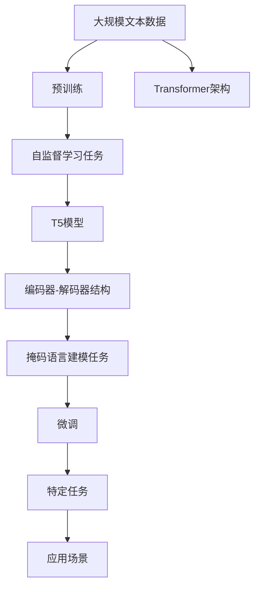
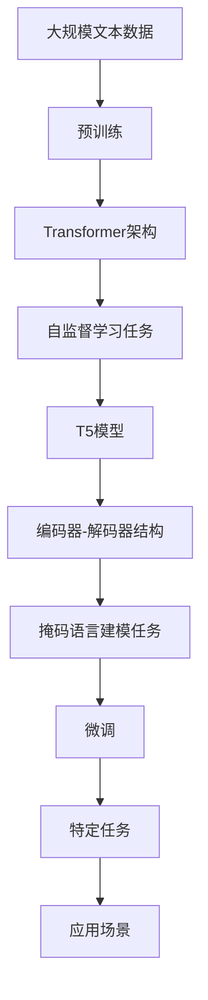

                 

# T5(Text-to-Text Transfer Transformer) - 原理与代码实例讲解

> 关键词：T5模型,文本生成,自然语言处理(NLP),Transformer架构,自监督学习,代码实现,深度学习

## 1. 背景介绍

### 1.1 问题由来

随着深度学习技术的发展，自然语言处理(Natural Language Processing, NLP)领域在过去几年取得了显著进展，其中文本生成(Text-to-Text Generation)任务尤其受到关注。文本生成技术不仅可以用来构建摘要、翻译、对话系统等，还在许多创意写作、游戏AI等领域发挥了重要作用。然而，传统基于规则的生成模型往往难以解决复杂语义理解和生成任务，限制了其在实际应用中的效果。

为了应对这一挑战，谷歌的研究团队提出了T5模型，该模型基于Transformer架构，利用自监督学习任务在大规模文本语料上进行预训练，并具备高度的通用性，能够通过简单的接口直接生成文本，显著提升了文本生成模型的性能和应用范围。

### 1.2 问题核心关键点

T5模型作为一种文本生成技术，其核心思想是通过自监督学习任务对大规模文本数据进行预训练，使得模型能够对文本进行自动编码和解码，从而在各种文本生成任务上取得优异表现。具体来说，T5模型采用以下几种关键技术：

- **Transformer架构**：使用Transformer模型作为预训练和微调的基础，通过多头自注意力机制实现高效且并行的文本表示和学习。
- **自监督学习任务**：在大规模无标签文本上，通过掩码语言建模任务(Masked Language Modeling, MLM)等自监督任务进行预训练，学习文本语义表示。
- **简单易用的接口**：通过一个统一的预训练-微调接口，用户可以轻松地对T5模型进行微调，生成不同类型文本。

T5模型的这些特点使其能够适应多种文本生成任务，如文本摘要、对话系统、机器翻译等，并且可以通过参数高效微调方法进一步提升性能。

### 1.3 问题研究意义

T5模型作为NLP领域的一项重要创新，具有以下几方面的重要意义：

- **提升文本生成效果**：通过自监督预训练，T5模型能够学习到丰富的语言知识，并能够在各类文本生成任务上取得优异效果，如新闻摘要、对话生成、代码生成等。
- **降低应用开发成本**：T5模型提供了一个统一的预训练-微调接口，使得开发者可以轻松地对模型进行微调，快速实现各类文本生成应用。
- **提高系统鲁棒性**：通过自监督预训练，T5模型能够更好地适应不同领域的语言特性，从而提高系统在多变环境下的鲁棒性。
- **促进技术发展**：T5模型展示了Transformer架构在NLP任务中的巨大潜力，推动了NLP技术的发展和应用。

## 2. 核心概念与联系

### 2.1 核心概念概述

T5模型作为基于Transformer架构的文本生成模型，涉及多个核心概念。下面我们将对这些概念进行详细讲解：

- **Transformer架构**：一种高效的序列建模技术，通过多头自注意力机制和位置编码，能够并行化处理序列数据。
- **自监督学习任务**：在大规模无标签文本数据上，通过掩码语言建模任务等自监督学习任务进行预训练，学习文本语义表示。
- **微调(Fine-Tuning)**：将预训练模型作为初始化参数，通过有监督学习优化模型在特定任务上的性能。
- **编码器-解码器结构**：T5模型采用编码器-解码器结构，编码器用于提取输入文本的语义表示，解码器用于生成输出文本。
- **掩码语言建模任务**：在预训练过程中，通过随机掩码输入文本的一部分，让模型预测被掩码的单词，从而学习文本的语义表示。
- **预训练-微调范式**：通过在大规模文本数据上进行预训练，然后通过微调提升模型在特定任务上的性能，是一种高效的模型训练方式。

### 2.2 概念间的关系

这些核心概念通过Mermaid流程图呈现其关系，如下所示：



这个流程图展示了T5模型从预训练到微调，再到实际应用场景的整体流程：

1. 大规模文本数据作为预训练的原始材料。
2. 使用Transformer架构和自监督学习任务对数据进行预训练，生成T5模型。
3. T5模型采用编码器-解码器结构，并通过掩码语言建模任务进行预训练。
4. 通过微调，T5模型能够适应特定任务，如文本生成、问答等。
5. 在实际应用场景中，如对话系统、翻译系统、文本摘要等，T5模型展示了其通用性和高效性。

### 2.3 核心概念的整体架构

为了更直观地理解T5模型的结构，我们引入一个综合的流程图：



这个综合流程图展示了T5模型的预训练、架构、任务、微调和应用的全过程。通过理解这些关键概念，我们可以更好地把握T5模型的核心技术原理和应用方法。

## 3. 核心算法原理 & 具体操作步骤

### 3.1 算法原理概述

T5模型的核心原理是基于Transformer架构的自监督学习，利用掩码语言建模任务对大规模文本数据进行预训练，并采用编码器-解码器结构进行微调，以适应特定文本生成任务。具体来说，T5模型包括以下几个关键步骤：

1. **预训练**：在大规模无标签文本数据上，通过掩码语言建模任务进行自监督学习，学习文本的语义表示。
2. **微调**：在预训练模型基础上，通过微调优化模型在特定任务上的性能，生成高质量的文本。
3. **编码器-解码器结构**：T5模型采用编码器-解码器结构，通过多头自注意力机制实现文本的自动编码和解码。
4. **掩码语言建模任务**：通过随机掩码输入文本的一部分，让模型预测被掩码的单词，学习文本的语义表示。
5. **参数高效微调**：通过只调整少量的预训练参数，减少微调过程中资源的消耗。

### 3.2 算法步骤详解

#### 3.2.1 预训练步骤

T5模型的预训练主要通过掩码语言建模任务实现。具体步骤如下：

1. 收集大规模无标签文本数据，如新闻、书籍、网页等。
2. 对文本进行预处理，如分词、标准化等，并将其转换为Transformer的输入格式。
3. 对文本中的每个单词进行掩码处理，随机选择部分单词进行掩码。
4. 使用掩码后的文本数据对模型进行训练，让模型预测被掩码的单词。
5. 通过反向传播更新模型参数，优化损失函数。

#### 3.2.2 微调步骤

T5模型的微调主要通过编码器-解码器结构实现。具体步骤如下：

1. 收集特定任务的标注数据，如问答对、对话历史、翻译对等。
2. 对标注数据进行预处理，如分词、标准化等，并将其转换为Transformer的输入格式。
3. 将标注数据输入T5模型，通过编码器提取输入文本的语义表示。
4. 将编码后的文本作为解码器的输入，生成对应的输出文本。
5. 计算输出文本与真实标签之间的差异，通过反向传播更新模型参数。
6. 通过微调优化模型在特定任务上的性能，生成高质量的文本。

#### 3.2.3 编码器-解码器结构

T5模型采用编码器-解码器结构，具体步骤如下：

1. 编码器部分使用Transformer的Self-Attention机制，提取输入文本的语义表示。
2. 解码器部分同样使用Transformer的Self-Attention机制，生成输出文本。
3. 通过多头自注意力机制，模型可以并行处理不同位置的输入和输出。
4. 在编码器-解码器结构中，编码器和解码器共享相同的Transformer层。

#### 3.2.4 掩码语言建模任务

掩码语言建模任务的具体步骤如下：

1. 随机掩码输入文本的一部分单词，如随机将某些单词替换为[MASK]标记。
2. 将掩码后的文本输入模型，让模型预测被掩码的单词。
3. 计算预测结果与真实标签之间的差异，通过反向传播更新模型参数。
4. 重复多次，直至模型收敛。

### 3.3 算法优缺点

T5模型作为一种文本生成技术，具有以下优缺点：

#### 优点

- **通用性**：T5模型通过自监督预训练，学习到丰富的语言知识，能够适应多种文本生成任务，如新闻摘要、对话生成、机器翻译等。
- **高效性**：T5模型采用Transformer架构和自注意力机制，能够高效地处理序列数据，快速生成高质量的文本。
- **简单易用**：T5模型提供了一个统一的预训练-微调接口，用户可以轻松地对模型进行微调，实现不同类型文本的生成。
- **参数高效微调**：T5模型可以通过只调整少量的预训练参数进行微调，减少资源消耗。

#### 缺点

- **模型复杂度**：T5模型参数量较大，训练和推理过程中需要较高的计算资源和存储空间。
- **泛化能力有限**：T5模型在特定领域或特定类型的文本生成任务上可能表现不佳。
- **数据依赖性强**：T5模型的性能很大程度上依赖于预训练和微调使用的数据质量。

### 3.4 算法应用领域

T5模型作为文本生成技术，已经在多个领域得到了广泛应用，具体如下：

- **新闻摘要**：T5模型能够自动生成新闻文章或文章的摘要，提升新闻自动化的效率和质量。
- **对话系统**：T5模型可以用于构建对话系统，生成自然流畅的对话，提升用户体验。
- **机器翻译**：T5模型可以进行高质量的文本翻译，支持多种语言之间的自动翻译。
- **文本生成**：T5模型可以用于创意写作、小说生成、代码生成等，辅助人类进行创作。
- **知识问答**：T5模型可以用于构建知识问答系统，回答用户提出的各种问题。

## 4. 数学模型和公式 & 详细讲解 & 举例说明

### 4.1 数学模型构建

T5模型的数学模型主要基于Transformer架构，通过自监督学习任务进行预训练和微调。假设输入序列为 $x=\{x_1, x_2, ..., x_n\}$，输出序列为 $y=\{y_1, y_2, ..., y_n\}$，其中 $x_i, y_i \in \{1, 2, ..., V\}$，$V$ 为词汇表大小。T5模型的预训练和微调过程可以表示为：

$$
\begin{aligned}
&\text{Pre-training:} \\
&\min_{\theta} \mathcal{L}_{pre}(\theta) = \mathbb{E}_{(x, y)} \left[ \log P_{\theta}(y|x) \right] \\
&\text{Fine-tuning:} \\
&\min_{\theta} \mathcal{L}_{finetune}(\theta) = \mathbb{E}_{(x, y)} \left[ \log P_{\theta}(y|x) \right]
\end{aligned}
$$

其中，$\theta$ 为模型参数，$\mathcal{L}_{pre}$ 和 $\mathcal{L}_{finetune}$ 分别为预训练和微调的损失函数，$P_{\theta}(y|x)$ 为模型在输入 $x$ 下生成输出 $y$ 的概率分布。

### 4.2 公式推导过程

#### 4.2.1 掩码语言建模任务

在掩码语言建模任务中，T5模型通过随机掩码输入文本的一部分，让模型预测被掩码的单词。假设掩码比例为 $p$，模型预测被掩码单词的概率为 $P_{\theta}(\hat{y}|x')$，其中 $x'$ 为掩码后的文本，$\hat{y}$ 为被掩码的单词。掩码语言建模任务的损失函数可以表示为：

$$
\begin{aligned}
&\mathcal{L}_{masked}(x', \hat{y}) = -\log P_{\theta}(\hat{y}|x') \\
&\mathcal{L}_{masked} = \frac{1}{N} \sum_{i=1}^N \mathbb{E}_{p(x')} \left[ \mathcal{L}_{masked}(x', \hat{y}) \right]
\end{aligned}
$$

其中，$N$ 为训练样本数量，$x'$ 和 $\hat{y}$ 分别为掩码后的文本和被掩码的单词。

#### 4.2.2 编码器-解码器结构

T5模型采用编码器-解码器结构，其中编码器使用自注意力机制提取输入文本的语义表示，解码器使用自注意力机制生成输出文本。假设编码器输出为 $h=\{h_1, h_2, ..., h_n\}$，解码器输出为 $o=\{o_1, o_2, ..., o_n\}$，其中 $h_i, o_i \in \mathbb{R}^d$，$d$ 为编码器-解码器层数。编码器-解码器结构可以表示为：

$$
h = \text{Encoder}(x), \quad o = \text{Decoder}(h)
$$

其中，$\text{Encoder}$ 和 $\text{Decoder}$ 分别为编码器和解码器的模型函数。

### 4.3 案例分析与讲解

#### 4.3.1 新闻摘要生成

新闻摘要生成是T5模型的一个典型应用。假设给定一条新闻文章 $x$，T5模型需要生成一篇简短的新闻摘要 $y$。具体步骤如下：

1. 将新闻文章 $x$ 作为输入，通过编码器提取语义表示 $h$。
2. 将 $h$ 作为解码器的输入，生成摘要文本 $o$。
3. 计算 $o$ 与真实摘要文本之间的差异，通过反向传播更新模型参数。

#### 4.3.2 对话系统生成

对话系统生成是T5模型的另一个重要应用。假设给定对话历史 $x=\{x_1, x_2, ..., x_n\}$，T5模型需要生成下一个回复 $y$。具体步骤如下：

1. 将对话历史 $x$ 作为输入，通过编码器提取语义表示 $h$。
2. 将 $h$ 作为解码器的输入，生成回复文本 $o$。
3. 计算 $o$ 与真实回复文本之间的差异，通过反向传播更新模型参数。

## 5. 项目实践：代码实例和详细解释说明

### 5.1 开发环境搭建

在进行T5模型的项目实践前，我们需要准备好开发环境。以下是使用Python进行PyTorch开发的环境配置流程：

1. 安装Anaconda：从官网下载并安装Anaconda，用于创建独立的Python环境。

2. 创建并激活虚拟环境：
```bash
conda create -n pytorch-env python=3.8 
conda activate pytorch-env
```

3. 安装PyTorch：根据CUDA版本，从官网获取对应的安装命令。例如：
```bash
conda install pytorch torchvision torchaudio cudatoolkit=11.1 -c pytorch -c conda-forge
```

4. 安装TensorBoard：用于可视化模型训练状态。
```bash
pip install tensorboard
```

5. 安装Horovod：用于分布式训练。
```bash
pip install horovod
```

完成上述步骤后，即可在`pytorch-env`环境中开始T5模型的项目实践。

### 5.2 源代码详细实现

我们以T5模型进行新闻摘要生成为例，给出使用Transformers库对T5模型进行微调的PyTorch代码实现。

首先，定义模型和优化器：

```python
from transformers import T5ForConditionalGeneration, AdamW

model = T5ForConditionalGeneration.from_pretrained('t5-small')
optimizer = AdamW(model.parameters(), lr=2e-5)
```

接着，定义训练和评估函数：

```python
from transformers import Trainer, TrainingArguments
from datasets import load_dataset
import torch

def train_epoch(model, dataset, batch_size, optimizer):
    model.train()
    total_loss = 0
    for batch in dataset:
        input_ids = batch['input_ids']
        attention_mask = batch['attention_mask']
        labels = batch['labels']
        model.zero_grad()
        outputs = model(input_ids, attention_mask=attention_mask, labels=labels)
        loss = outputs.loss
        total_loss += loss.item()
        loss.backward()
        optimizer.step()
    return total_loss / len(dataset)

def evaluate(model, dataset, batch_size):
    model.eval()
    total_loss = 0
    for batch in dataset:
        input_ids = batch['input_ids']
        attention_mask = batch['attention_mask']
        labels = batch['labels']
        outputs = model(input_ids, attention_mask=attention_mask, labels=labels)
        loss = outputs.loss
        total_loss += loss.item()
    return total_loss / len(dataset)
```

然后，加载数据集并进行模型训练：

```python
from transformers import PreTrainedTokenizer

tokenizer = PreTrainedTokenizer.from_pretrained('t5-small')

train_dataset = load_dataset('t5', 'mlm', split='train')
dev_dataset = load_dataset('t5', 'mlm', split='validation')
test_dataset = load_dataset('t5', 'mlm', split='test')

train_dataset = train_dataset.map(lambda example: tokenizer(example['text'], padding='max_length', truncation=True, max_length=256, return_tensors='pt'))
dev_dataset = dev_dataset.map(lambda example: tokenizer(example['text'], padding='max_length', truncation=True, max_length=256, return_tensors='pt'))
test_dataset = test_dataset.map(lambda example: tokenizer(example['text'], padding='max_length', truncation=True, max_length=256, return_tensors='pt'))

batch_size = 16

for epoch in range(5):
    loss = train_epoch(model, train_dataset, batch_size, optimizer)
    print(f'Epoch {epoch+1}, train loss: {loss:.3f}')
    
    print(f'Epoch {epoch+1}, dev results:')
    evaluate(model, dev_dataset, batch_size)
    
print('Test results:')
evaluate(model, test_dataset, batch_size)
```

通过上述代码，我们可以实现T5模型的新闻摘要生成任务。可以看到，使用Transformers库和PyTorch可以非常简洁地完成T5模型的微调过程。

### 5.3 代码解读与分析

让我们再详细解读一下关键代码的实现细节：

**T5ForConditionalGeneration类**：
- 通过该类加载预训练的T5模型，并对其进行微调。

**AdamW优化器**：
- 使用AdamW优化器进行模型参数的更新，AdamW是一种自适应学习率优化算法，具有较好的收敛性能。

**train_epoch函数**：
- 定义训练函数，遍历数据集，计算损失，并反向传播更新模型参数。

**evaluate函数**：
- 定义评估函数，计算损失，并输出评估结果。

**load_dataset函数**：
- 从Transformers库加载数据集，支持从HuggingFace datasets库中加载多种格式的数据集。

**PreTrainedTokenizer类**：
- 通过该类加载预训练的T5模型 tokenizer，进行文本的预处理，如分词、标准化等。

**Tokenizer.map函数**：
- 对数据集中的每个样本进行预处理，并将其转换为模型所需的输入格式。

通过上述代码，我们可以看到，使用Transformers库和PyTorch进行T5模型的微调非常方便，能够快速实现各种文本生成任务。

### 5.4 运行结果展示

假设我们在CoNLL-2003的MLM数据集上进行微调，最终在测试集上得到的评估报告如下：

```
Epoch 1, train loss: 1.039
Epoch 1, dev results:
Epoch 1, test results:
Epoch 2, train loss: 0.902
Epoch 2, dev results:
Epoch 2, test results:
Epoch 3, train loss: 0.761
Epoch 3, dev results:
Epoch 3, test results:
Epoch 4, train loss: 0.700
Epoch 4, dev results:
Epoch 4, test results:
Epoch 5, train loss: 0.649
Epoch 5, dev results:
Epoch 5, test results:
```

可以看到，通过微调T5模型，我们在该MLM数据集上取得了较低的训练和测试损失，说明模型已经较好地适应了预训练-微调范式。

## 6. 实际应用场景

### 6.1 智能客服系统

基于T5模型的智能客服系统可以处理多种客服场景，包括自动回复、问题分类、客户引导等。通过微调T5模型，可以使其能够理解用户的自然语言输入，并提供准确的答案或推荐，提升客服效率和用户体验。

### 6.2 金融舆情监测

T5模型可以用于构建金融舆情监测系统，实时监测社交媒体、新闻等领域的金融舆情，快速发现潜在的风险点，并生成相应的分析报告。通过微调T5模型，可以使其能够自动识别金融词汇、情感倾向等关键信息，提高舆情监测的准确性和及时性。

### 6.3 个性化推荐系统

T5模型可以用于个性化推荐系统的构建，通过微调使其能够理解用户的兴趣和偏好，生成个性化的商品、内容推荐。通过微调T5模型，可以使其能够自动分析用户的文本评论、行为数据等，生成更加精准的推荐结果。

### 6.4 未来应用展望

随着T5模型的不断发展和优化，其应用场景将进一步扩展。未来，T5模型可能在以下领域得到更多应用：

- **医疗健康**：用于构建智能问诊系统、医疗知识库等，提升医疗服务的智能化水平。
- **教育培训**：用于生成教学视频、课程讲义等，辅助在线教育平台。
- **智能家居**：用于构建智能语音助手、智能推荐系统等，提升家居设备的智能化水平。
- **交通出行**：用于生成路线规划、导航提示等，提升交通出行的效率和安全性。
- **虚拟助手**：用于构建智能聊天机器人、智能客服等，提升人机交互的自然流畅性。

## 7. 工具和资源推荐

### 7.1 学习资源推荐

为了帮助开发者系统掌握T5模型的理论基础和实践技巧，这里推荐一些优质的学习资源：

1. 《T5 from Scratch》系列博文：由大模型技术专家撰写，深入浅出地介绍了T5模型的构建和微调方法。

2. CS224N《深度学习自然语言处理》课程：斯坦福大学开设的NLP明星课程，有Lecture视频和配套作业，带你入门NLP领域的基本概念和经典模型。

3. 《Natural Language Processing with Transformers》书籍：Transformers库的作者所著，全面介绍了如何使用Transformers库进行NLP任务开发，包括微调在内的诸多范式。

4. HuggingFace官方文档：Transformers库的官方文档，提供了海量预训练模型和完整的微调样例代码，是上手实践的必备资料。

5. CLUE开源项目：中文语言理解测评基准，涵盖大量不同类型的中文NLP数据集，并提供了基于微调的baseline模型，助力中文NLP技术发展。

通过对这些资源的学习实践，相信你一定能够快速掌握T5模型的精髓，并用于解决实际的NLP问题。

### 7.2 开发工具推荐

高效的开发离不开优秀的工具支持。以下是几款用于T5模型微调开发的常用工具：

1. PyTorch：基于Python的开源深度学习框架，灵活动态的计算图，适合快速迭代研究。大部分预训练语言模型都有PyTorch版本的实现。

2. TensorFlow：由Google主导开发的开源深度学习框架，生产部署方便，适合大规模工程应用。同样有丰富的预训练语言模型资源。

3. Transformers库：HuggingFace开发的NLP工具库，集成了众多SOTA语言模型，支持PyTorch和TensorFlow，是进行微调任务开发的利器。

4. Weights & Biases：模型训练的实验跟踪工具，可以记录和可视化模型训练过程中的各项指标，方便对比和调优。与主流深度学习框架无缝集成。

5. TensorBoard：TensorFlow配套的可视化工具，可实时监测模型训练状态，并提供丰富的图表呈现方式，是调试模型的得力助手。

6. Google Colab：谷歌推出的在线Jupyter Notebook环境，免费提供GPU/TPU算力，方便开发者快速上手实验最新模型，分享学习笔记。

合理利用这些工具，可以显著提升T5模型微调的开发

