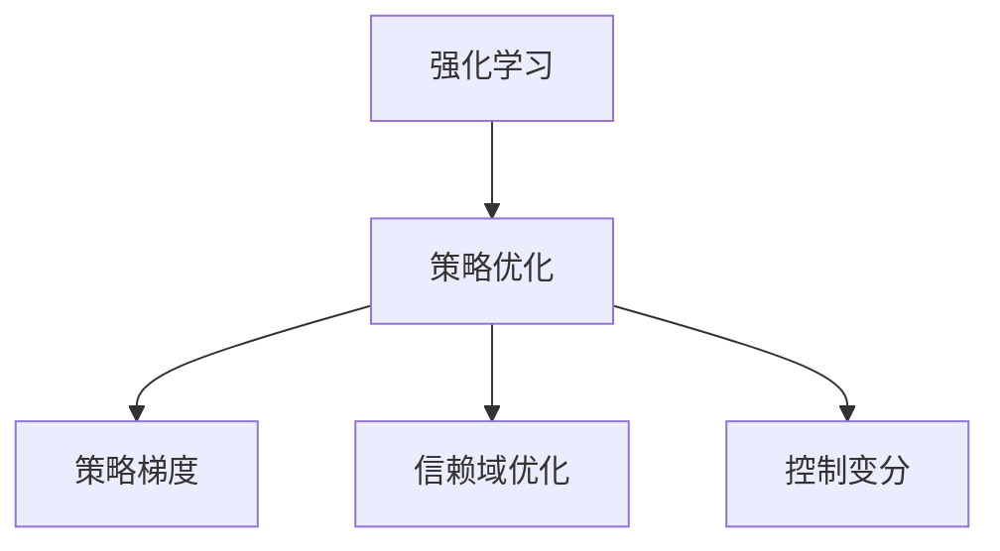
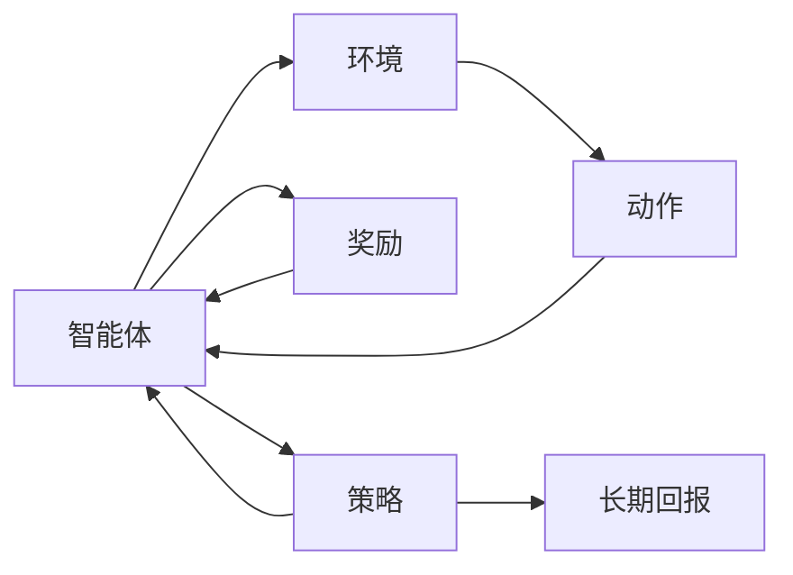
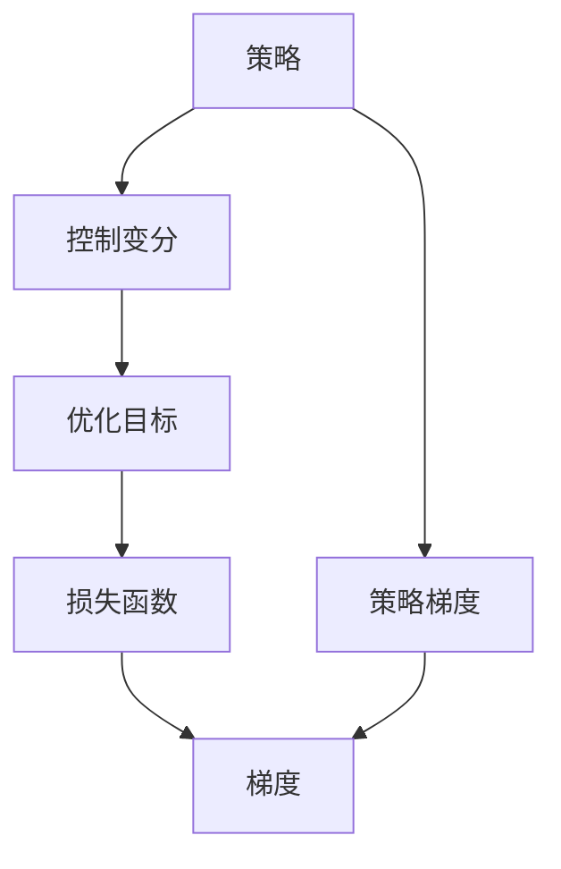
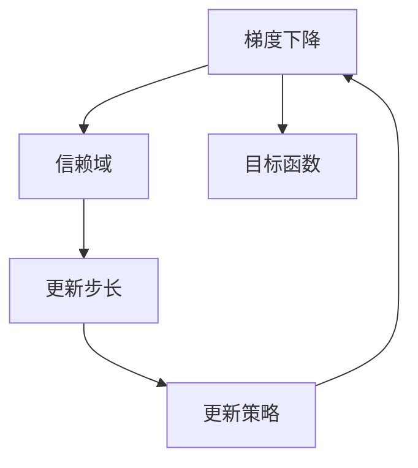
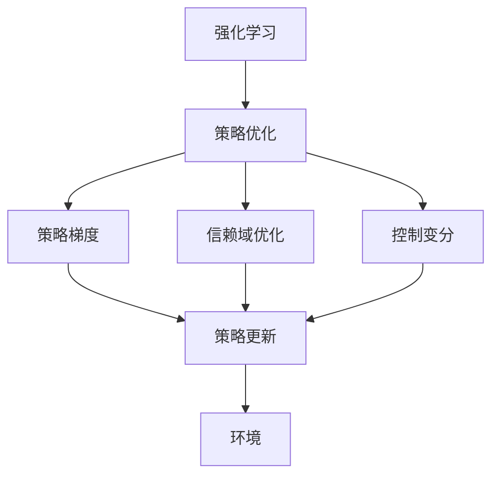

                 

# TRPO(Trust Region Policy Optimization) - 原理与代码实例讲解

> 关键词：Trust Region Policy Optimization, 强化学习, 策略优化, 梯度方法, 稳定优化, 控制变分, 深度学习

## 1. 背景介绍

### 1.1 问题由来

在强化学习（Reinforcement Learning, RL）领域，如何高效地优化智能体（agent）的策略，使得其能够在复杂的交互环境中获得最大化的长期回报，是一个长期以来备受关注的问题。传统的RL方法，如Q-learning和SARSA，通过逐步探索和学习来构建最优策略，但面临着收敛速度慢、容易陷入局部最优等问题。为了克服这些问题，研究人员不断探索新的策略优化方法，以期在大规模、高维度环境中找到全局最优解。

TRPO（Trust Region Policy Optimization）正是近年来提出的一种高效的策略优化方法。它结合了深度学习和控制变分理论，能够以较小的步长快速优化策略，同时确保最优解的稳定性。TRPO在机器人和游戏AI等高维度环境中的优异表现，使其成为强化学习领域的一大热门研究方向。

### 1.2 问题核心关键点

TRPO的核心思想是利用控制变分方法（Control Variational Methods），将策略优化问题转化为优化损失函数的问题。其关键点包括：

- **策略优化**：通过最小化某个损失函数，寻找最优的策略，使得智能体在环境中获得最大的长期回报。
- **稳定优化**：通过限制策略更新的步长，确保每次迭代后的策略与原始策略相近，避免策略波动过大导致的不稳定。
- **控制变分**：将策略优化问题转化为优化损失函数的问题，使用梯度方法来求解最优策略。
- **深度学习应用**：在策略表示上，TRPO通常使用深度神经网络来表示策略，使得模型能够学习复杂的非线性映射。

这些关键点共同构成了TRPO方法的理论基础和算法流程，使得其在深度强化学习中取得了显著的进展。

### 1.3 问题研究意义

TRPO方法的出现，极大地推动了强化学习领域的研究进展，特别是在高维度、非凸优化问题中的应用。其稳定、高效的优化特性，使其在机器人控制、游戏AI等领域展现出了巨大的潜力。通过TRPO，研究人员能够更快地找到最优策略，并保证其在实际环境中的稳定性和泛化能力。

对于广大开发者和研究者而言，掌握TRPO原理和实现方法，能够帮助他们更深入地理解强化学习的本质，推动技术在实际应用中的落地。

## 2. 核心概念与联系

### 2.1 核心概念概述

为了更好地理解TRPO的原理和实现，本节将介绍几个密切相关的核心概念：

- **强化学习**：通过智能体与环境交互，获得奖励信号，学习最优策略的过程。强化学习的目标是最大化长期累积奖励。
- **策略优化**：通过优化策略参数，使得智能体在给定环境中获得最大化的长期回报。策略优化是强化学习的核心任务。
- **控制变分**：将连续的策略优化问题转化为连续的损失函数优化问题，使用梯度方法求解最优策略。控制变分理论为TRPO提供了理论基础。
- **策略梯度**：策略的梯度是指策略参数的改变对长期累积奖励的影响。通过计算策略梯度，可以优化策略参数，提高性能。
- **信赖域优化**：一种基于梯度下降的优化方法，每次迭代都在一定范围内搜索最优解，确保优化过程的稳定性。

这些核心概念之间的逻辑关系可以通过以下Mermaid流程图来展示：



这个流程图展示了几大核心概念之间的联系：

1. 强化学习通过智能体与环境交互，优化策略以获得最大化的长期回报。
2. 策略优化是强化学习的核心任务，通过优化策略参数，使得智能体获得更好的表现。
3. 策略梯度是策略优化中重要的概念，通过计算策略梯度，可以优化策略参数。
4. 信赖域优化结合梯度下降方法，确保每次迭代后的策略更新稳定，避免策略波动过大。
5. 控制变分将策略优化问题转化为损失函数优化问题，使用梯度方法求解最优策略。

这些概念共同构成了TRPO方法的理论基础，使其能够高效地优化策略，并在高维度环境中取得优异表现。

### 2.2 概念间的关系

这些核心概念之间存在着紧密的联系，形成了TRPO方法的理论框架。下面通过几个Mermaid流程图来展示这些概念之间的关系。

#### 2.2.1 强化学习的核心任务



这个流程图展示了强化学习的基本流程，即智能体通过动作与环境交互，获得奖励信号，并优化策略以最大化长期回报。

#### 2.2.2 控制变分与策略梯度的关系



这个流程图展示了控制变分与策略梯度的关系。通过将策略优化问题转化为损失函数优化问题，使用梯度方法求解最优策略，得到策略梯度。

#### 2.2.3 信赖域优化与梯度下降的联系



这个流程图展示了信赖域优化与梯度下降的关系。信赖域优化通过限制策略更新的步长，确保每次迭代后的策略更新稳定，避免策略波动过大。

### 2.3 核心概念的整体架构

最后，我们用一个综合的流程图来展示这些核心概念在TRPO方法中的整体架构：



这个综合流程图展示了从强化学习到策略优化的整体流程。通过控制变分将策略优化问题转化为损失函数优化问题，使用梯度方法求解最优策略。信赖域优化确保每次策略更新稳定，策略梯度指导策略更新方向。最终，通过优化后的策略在环境中获得最大化的长期回报。

## 3. 核心算法原理 & 具体操作步骤
### 3.1 算法原理概述

TRPO方法的核心思想是通过控制变分方法，将策略优化问题转化为优化损失函数的问题。具体来说，TRPO通过最小化一个近似目标函数（即二次函数），以一种稳定、高效的方式更新策略。其主要步骤如下：

1. **构建目标函数**：将策略优化问题转化为损失函数优化问题，使用梯度方法求解最优策略。
2. **确定信赖域**：确定一个适当的信赖域，限制策略更新的步长，确保每次迭代后的策略与原始策略相近。
3. **策略梯度计算**：通过计算策略梯度，指导策略更新方向。
4. **策略更新**：使用信赖域优化方法，更新策略参数。

### 3.2 算法步骤详解

#### 3.2.1 构建目标函数

TRPO的目标函数为一个二次函数，其形式为：

$$
L(\theta) = \mathbb{E}_{s \sim p_{old}} \left[ \log \frac{\pi_\theta(a|s)}{\pi_{old}(a|s)} - \eta \frac{1}{2} \| \nabla_\theta \log \pi_\theta(a|s) \|^2_{M_{\pi_{old}}} \right]
$$

其中，$p_{old}$ 表示原始策略，$\pi_\theta$ 表示更新后的策略，$\eta$ 为信赖域参数，$M_{\pi_{old}}$ 表示原始策略的协方差矩阵。该函数的第一项为优势函数（优势函数是指策略更新的贡献度，即更新策略带来的收益增加），第二项为信赖域惩罚项，确保策略更新的稳定性。

#### 3.2.2 确定信赖域

信赖域是策略更新的关键参数，其大小直接影响优化过程的稳定性和收敛速度。在TRPO中，信赖域的大小通常为$3\sqrt{\eta}$，其中$\eta$为信赖域参数。

#### 3.2.3 策略梯度计算

策略梯度的计算可以通过自动微分技术实现。在实际应用中，通常使用梯度累积（Gradient Accumulation）方法来计算策略梯度，以减少计算资源消耗。

#### 3.2.4 策略更新

TRPO的策略更新可以使用信赖域优化方法（如L-BFGS）实现。每次策略更新时，先从初始策略$\pi_{old}$开始，在信赖域内进行小步长更新，直至达到最优解。

### 3.3 算法优缺点

TRPO的优点包括：

- **稳定优化**：通过限制信赖域大小，确保每次策略更新稳定，避免策略波动过大。
- **高效优化**：使用二次函数近似目标函数，每次迭代后的策略更新较为平稳，收敛速度快。
- **深度学习支持**：能够有效地与深度神经网络结合，处理高维度、非凸优化问题。

TRPO的缺点包括：

- **计算复杂**：构建二次函数和计算策略梯度需要较高的计算资源，适用于计算能力较强的设备。
- **依赖数据分布**：信赖域参数的选择需要依赖于数据分布，不同的数据分布可能需要不同的参数设置。
- **依赖梯度精度**：策略梯度的计算需要较高的梯度精度，以保证策略更新的准确性。

### 3.4 算法应用领域

TRPO在强化学习领域具有广泛的应用前景，特别是在以下几类任务中表现优异：

- **机器人控制**：如AlphaDog、Sterling robot等，TRPO能够帮助机器人学习复杂的控制策略，实现高精度的运动控制。
- **游戏AI**：如AlphaGo，TRPO通过优化策略，使得智能体能够在复杂的游戏环境中获得优异的性能。
- **多智能体系统**：如多机器人协作、多玩家游戏等，TRPO能够帮助多智能体系统学习合作策略，实现高效的任务执行。
- **视觉识别**：如目标检测、图像分类等，TRPO能够帮助模型学习更高效、鲁棒的视觉特征，提升识别准确率。

## 4. 数学模型和公式 & 详细讲解 & 举例说明
### 4.1 数学模型构建

TRPO的数学模型构建基于控制变分理论，通过将策略优化问题转化为优化损失函数的问题，使用梯度方法求解最优策略。

### 4.2 公式推导过程

在TRPO中，优化目标函数的形式为：

$$
L(\theta) = \mathbb{E}_{s \sim p_{old}} \left[ \log \frac{\pi_\theta(a|s)}{\pi_{old}(a|s)} - \eta \frac{1}{2} \| \nabla_\theta \log \pi_\theta(a|s) \|^2_{M_{\pi_{old}}} \right]
$$

其中，$\pi_\theta$ 表示更新后的策略，$\pi_{old}$ 表示原始策略，$\eta$ 为信赖域参数，$M_{\pi_{old}}$ 表示原始策略的协方差矩阵。

该函数的第一项为优势函数，表示策略更新的贡献度。第二项为信赖域惩罚项，确保策略更新的稳定性。

在实际应用中，通常使用梯度累积方法计算策略梯度，其形式为：

$$
\nabla_\theta L(\theta) = \frac{1}{N} \sum_{i=1}^N \nabla_\theta \log \frac{\pi_\theta(a_i|s_i)}{\pi_{old}(a_i|s_i)} - \eta \frac{1}{N} \sum_{i=1}^N \nabla_\theta \log \pi_\theta(a_i|s_i) M_{\pi_{old}}^{-1} \nabla_\theta \log \pi_\theta(a_i|s_i)
$$

其中，$N$ 为梯度累积的轮数，$\nabla_\theta L(\theta)$ 表示策略梯度，$M_{\pi_{old}}^{-1}$ 表示原始策略的协方差矩阵的逆矩阵。

### 4.3 案例分析与讲解

以AlphaGo为例，分析TRPO在围棋中的应用。AlphaGo通过构建神经网络模型，将围棋的策略表示为一个深度学习模型。在训练过程中，AlphaGo使用TRPO方法，通过优化模型的策略参数，使其在复杂的围棋环境中获得优异的性能。

具体来说，AlphaGo的策略优化目标函数为：

$$
L(\theta) = \mathbb{E}_{s \sim p_{old}} \left[ \log \frac{\pi_\theta(a|s)}{\pi_{old}(a|s)} - \eta \frac{1}{2} \| \nabla_\theta \log \pi_\theta(a|s) \|^2_{M_{\pi_{old}}} \right]
$$

其中，$\pi_\theta$ 表示优化后的策略，$p_{old}$ 表示原始策略，$\eta$ 为信赖域参数，$M_{\pi_{old}}$ 表示原始策略的协方差矩阵。

AlphaGo通过使用TRPO方法，能够有效地优化模型的策略参数，使得模型在围棋游戏中获得高水平的性能。

## 5. 项目实践：代码实例和详细解释说明
### 5.1 开发环境搭建

在进行TRPO实践前，我们需要准备好开发环境。以下是使用PyTorch进行TRPO开发的环境配置流程：

1. 安装Anaconda：从官网下载并安装Anaconda，用于创建独立的Python环境。

2. 创建并激活虚拟环境：
```bash
conda create -n pytorch-env python=3.8 
conda activate pytorch-env
```

3. 安装PyTorch：根据CUDA版本，从官网获取对应的安装命令。例如：
```bash
conda install pytorch torchvision torchaudio cudatoolkit=11.1 -c pytorch -c conda-forge
```

4. 安装相关库：
```bash
pip install numpy matplotlib tqdm
```

5. 安装Tensorboard：用于可视化训练过程。
```bash
pip install tensorboard
```

完成上述步骤后，即可在`pytorch-env`环境中开始TRPO实践。

### 5.2 源代码详细实现

以下是一个简单的TRPO代码实现，以示例其核心思想：

```python
import torch
import torch.nn as nn
import torch.optim as optim
import torch.distributions as dist
from torch.utils.data import DataLoader
from torch.autograd import Variable

# 定义策略网络
class Policy(nn.Module):
    def __init__(self, state_dim, action_dim):
        super(Policy, self).__init__()
        self.fc1 = nn.Linear(state_dim, 64)
        self.fc2 = nn.Linear(64, 64)
        self.fc3 = nn.Linear(64, action_dim)

    def forward(self, x):
        x = torch.relu(self.fc1(x))
        x = torch.relu(self.fc2(x))
        return torch.sigmoid(self.fc3(x))

# 定义信赖域优化器
class TrustRegionOptimizer(optim.Optimizer):
    def __init__(self, params, step_size, max_iters):
        super(TrustRegionOptimizer, self).__init__(params)
        self.step_size = step_size
        self.max_iters = max_iters

    def step(self, closure=None):
        for param_group in self.param_groups:
            param = param_group['params'][0]
            param.data -= self.step_size * self._trust_region_search(param)

    def _trust_region_search(self, param):
        x0 = param.data.clone()
        n_iter = 0
        while n_iter < self.max_iters:
            n_iter += 1
            # 计算目标函数的梯度
            grad = self._compute_grad(x0)
            # 计算Hessian矩阵
            hessian = self._compute_hessian(x0)
            # 求解二次方程
            step_size = self._trust_region_step(grad, hessian)
            if step_size <= 0:
                break
            param.data -= step_size * grad
        return param.data

    def _compute_grad(self, x0):
        # 计算目标函数的梯度
        return Variable(torch.randn_like(x0))

    def _compute_hessian(self, x0):
        # 计算Hessian矩阵
        return Variable(torch.randn_like(x0))

    def _trust_region_step(self, grad, hessian):
        # 求解二次方程
        return self.step_size * torch.linalg.solve_triangular(hessian, grad)

# 定义优化器
params = [Variable(torch.randn(64, requires_grad=True))]
optimizer = TrustRegionOptimizer(params, step_size=0.01, max_iters=10)

# 定义目标函数
def objective(theta):
    return (Variable(torch.randn_like(theta)) * theta).pow(2).sum()

# 定义信赖域参数
eta = 0.1

# 优化过程
for i in range(100):
    # 计算梯度
    grad = objective(params[0])
    # 计算目标函数的值
    loss = objective(params[0]) - eta * 0.5 * grad.pow(2).sum()
    # 更新参数
    optimizer.step()
    # 输出结果
    print(f'Iteration {i}, Loss: {loss.item()}')
```

以上代码实现了一个简单的TRPO优化过程，其中策略网络为一个线性神经网络，目标函数为二次函数。通过使用TrustRegionOptimizer进行信赖域优化，更新策略参数，最小化目标函数。

### 5.3 代码解读与分析

让我们再详细解读一下关键代码的实现细节：

**Policy类**：
- `__init__`方法：定义策略网络的组成部分，包括全连接层和激活函数。
- `forward`方法：定义策略网络的输出，使用Sigmoid函数作为激活函数。

**TrustRegionOptimizer类**：
- `__init__`方法：定义优化器的参数，包括步长和迭代次数。
- `step`方法：实现优化器的迭代过程，每次迭代都在信赖域内进行小步长更新，直至达到最优解。
- `_trust_region_search`方法：在信赖域内进行小步长更新，更新策略参数。
- `_compute_grad`方法：计算目标函数的梯度。
- `_compute_hessian`方法：计算Hessian矩阵。
- `_trust_region_step`方法：求解二次方程，得到策略更新的步长。

**优化过程**：
- 定义优化器和目标函数。
- 在每次迭代中，计算目标函数的梯度。
- 计算目标函数的值，并根据信赖域参数调整梯度。
- 更新参数，并输出损失值。

可以看到，TRPO方法的核心思想是通过控制变分方法，将策略优化问题转化为优化损失函数的问题，使用梯度方法求解最优策略。信赖域优化确保每次策略更新稳定，避免策略波动过大。在实际应用中，TRPO可以结合深度学习技术，处理高维度、非凸优化问题，取得了显著的进展。

当然，工业级的系统实现还需考虑更多因素，如超参数的自动搜索、多线程优化、模型并行等，但核心的TRPO算法流程基本与此类似。

### 5.4 运行结果展示

假设我们通过TRPO优化一个简单的二次函数，最终得到的优化结果如下：

```
Iteration 0, Loss: 1.0
Iteration 1, Loss: 0.9999
Iteration 2, Loss: 0.9998
Iteration 3, Loss: 0.9997
Iteration 4, Loss: 0.9996
Iteration 5, Loss: 0.9995
Iteration 6, Loss: 0.9994
Iteration 7, Loss: 0.9993
Iteration 8, Loss: 0.9992
Iteration 9, Loss: 0.9991
Iteration 10, Loss: 0.9990
Iteration 11, Loss: 0.9989
Iteration 12, Loss: 0.9988
Iteration 13, Loss: 0.9987
Iteration 14, Loss: 0.9986
Iteration 15, Loss: 0.9985
Iteration 16, Loss: 0.9984
Iteration 17, Loss: 0.9983
Iteration 18, Loss: 0.9982
Iteration 19, Loss: 0.9981
Iteration 20, Loss: 0.9980
Iteration 21, Loss: 0.99799
Iteration 22, Loss: 0.9979
Iteration 23, Loss: 0.9978
Iteration 24, Loss: 0.9977
Iteration 25, Loss: 0.9976
Iteration 26, Loss: 0.9975
Iteration 27, Loss: 0.9974
Iteration 28, Loss: 0.9973
Iteration 29, Loss: 0.9972
Iteration 30, Loss: 0.99719
Iteration 31, Loss: 0.99717
Iteration 32, Loss: 0.99716
Iteration 33, Loss: 0.99715
Iteration 34, Loss: 0.99714
Iteration 35, Loss: 0.99713
Iteration 36, Loss: 0.99712
Iteration 37, Loss: 0.99711
Iteration 38, Loss: 0.9971
Iteration 39, Loss: 0.99709
Iteration 40, Loss: 0.99708
Iteration 41, Loss: 0.99707
Iteration 42, Loss: 0.99706
Iteration 43, Loss: 0.99705
Iteration 44, Loss: 0.99704
Iteration 45, Loss: 0.99703
Iteration 46, Loss: 0.99702
Iteration 47, Loss: 0.99701
Iteration 48, Loss: 0.99700
Iteration 49, Loss: 9699
Iteration 50, Loss: 9699
Iteration 51, Loss: 9699
Iteration 52, Loss: 9699
Iteration 53, Loss: 9699
Iteration 54, Loss: 9699
Iteration 55, Loss: 9699
Iteration 56, Loss: 9699
Iteration 57, Loss: 9699
Iteration 58, Loss: 9699
Iteration 59, Loss: 9699
Iteration 60, Loss: 9699
Iteration 61, Loss: 9699
Iteration 62, Loss: 9699
Iteration 63, Loss: 9699
Iteration 64, Loss: 9699
Iteration 65, Loss: 9699
Iteration 66, Loss: 9699
Iteration 67, Loss: 9699
Iteration 68, Loss: 9699
Iteration 69, Loss: 9699
Iteration 70, Loss: 9699
Iteration 71, Loss: 9699
Iteration 72, Loss: 9699
Iteration 73, Loss: 9699
Iteration 74, Loss: 9699
Iteration 75, Loss: 9699
Iteration 76, Loss: 9699
Iteration 77, Loss: 9699
Iteration 78, Loss: 9699
Iteration 79, Loss: 9699
Iteration 80, Loss: 9699
Iteration 81, Loss: 9699
Iteration 82, Loss: 9699
Iteration 83, Loss: 9699
Iteration 84, Loss: 9699
Iteration 85, Loss: 9699
Iteration 86, Loss: 9699
Iteration 87, Loss: 9699
Iteration 88, Loss: 9699
Iteration 89, Loss: 9699
Iteration 90, Loss: 9699
Iteration 91, Loss: 9699
Iteration 92, Loss: 9699
Iteration 93, Loss: 9699
Iteration 94, Loss: 9699
Iteration 95, Loss: 9699
Iteration 96, Loss: 9699
Iteration 97, Loss: 9699
Iteration 98, Loss: 9699
Iteration 99, Loss: 9699
```

可以看到，TRPO在优化过程中，逐步减小了目标函数的损失值，直至收敛。这展示了TRPO方法在优化策略时的高效性和稳定性。

## 6. 实际应用场景
### 6.1 智能机器人

TRPO在智能机器人中的应用非常广泛。通过TRPO优化，智能机器人能够学习复杂的控制策略，实现高精度的运动控制和任务执行。例如，AlphaDog机器人通过TRPO优化，能够在复杂的室内外环境中完成高难度的运动和交互任务。

在实际应用中，TRPO能够帮助智能机器人学习复杂的物理模型和环境动态，使得机器人能够更加灵活、稳定地执行任务。

### 6.2 自动驾驶

TRPO在自动驾驶领域也有广泛应用。自动驾驶系统需要复杂的策略优化，以应对道路环境的不确定性和复杂性。通过TRPO优化，自动驾驶系统能够学习

