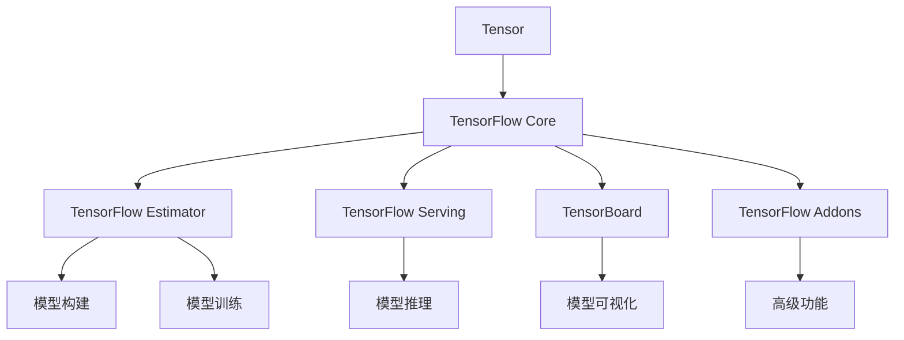
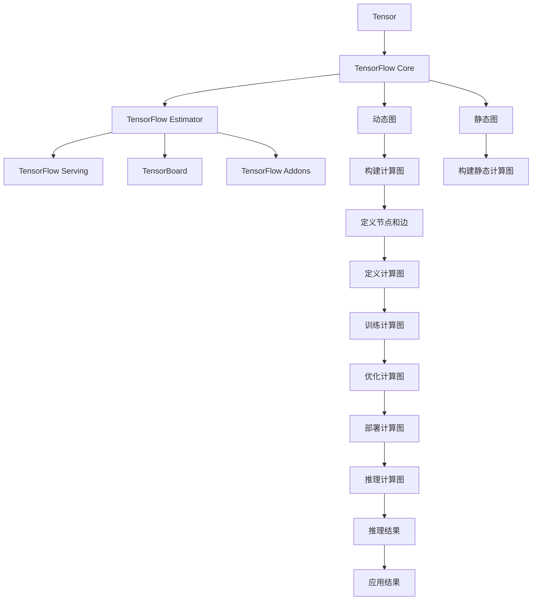

                 

# TensorFlow 原理与代码实战案例讲解

> 关键词：TensorFlow, 深度学习, 模型构建, 训练优化, 实际应用, 开发实践, 案例讲解

## 1. 背景介绍

### 1.1 问题由来

在深度学习领域，TensorFlow（以下简称TF）以其灵活的架构、强大的计算图功能、丰富的API和广泛的应用场景，成为了当下最流行的深度学习框架之一。它由Google Brain团队开发，最初用于神经网络的实验研究，后来逐渐发展为功能全面的开源框架，广泛应用于计算机视觉、自然语言处理、语音识别等多个领域。

TensorFlow提供了一种直观的方式来表达和训练复杂的深度学习模型，支持动态计算图和静态计算图两种模式，适用于从原型研究到实际部署的各种应用场景。其背后强大的计算能力、高度优化的GPU/TPU支持以及丰富的API，使得开发者能够高效地构建、训练和部署深度学习模型。

### 1.2 问题核心关键点

TensorFlow的核心设计思想是“计算图”，即通过定义计算图来描述模型的结构和前向传播过程。计算图中包含了模型的所有计算节点，每个节点对应一个数学运算或函数调用，节点之间的边表示数据流向。通过执行计算图，可以在硬件加速器上高效地进行数值计算，同时支持反向传播算法，方便进行模型的梯度优化。

TensorFlow框架的核心组成部分包括：

- TensorFlow Core：提供核心计算图和计算功能，支持动态图和静态图两种方式。
- TensorFlow Estimator：基于TensorFlow Core的高级API，提供了模型评估、数据输入、损失计算等功能，使得模型构建和训练更加便捷。
- TensorFlow Serving：将训练好的模型封装为服务，方便部署和推理应用。
- TensorFlow Model Analysis：用于模型的度量和可视化，帮助分析模型的性能和行为。

### 1.3 问题研究意义

研究TensorFlow的原理与代码实战案例，对于深入理解深度学习框架的设计理念、应用场景以及实际开发中的常见问题，具有重要意义。TensorFlow作为一个强大的工具，能够帮助开发者高效地实现复杂的深度学习模型，快速迭代优化，提升模型的精度和性能。通过学习TensorFlow的原理与实战案例，开发者可以更好地掌握深度学习的核心技术，从而在实际应用中游刃有余，推动人工智能技术的不断进步。

## 2. 核心概念与联系

### 2.1 核心概念概述

为更好地理解TensorFlow的核心概念及其应用，本节将介绍几个关键概念：

- Tensor：TensorFlow中的基本数据单元，表示多维数组，可以是整数、浮点数等数值类型。
- TensorFlow Core：TensorFlow的核心库，提供计算图功能，支持动态图和静态图两种计算模式。
- TensorFlow Estimator：TensorFlow的高层API，简化了模型构建和训练过程，提供了模型评估、数据输入等功能。
- TensorFlow Serving：将训练好的模型封装为服务，方便模型的部署和推理应用。
- TensorBoard：TensorFlow的可视化工具，可以实时监控模型训练过程，生成图表和报告。
- TensorFlow Addons：第三方库，提供了更多的TensorFlow功能和工具，如学习率调度、集成学习等。

这些核心概念之间的联系紧密，共同构成了TensorFlow的完整生态系统。TensorFlow通过计算图的方式，将模型的构建、训练和推理过程统一管理，简化了深度学习模型的开发和应用。通过不断引入高级API和第三方工具，TensorFlow进一步提升了其易用性和实用性。

### 2.2 概念间的关系

这些核心概念之间的关系可以通过以下Mermaid流程图来展示：



这个流程图展示了一个TensorFlow模型的完整流程，从Tensor的定义到模型的构建、训练、推理，再到模型的可视化、高级功能的使用。

### 2.3 核心概念的整体架构

最后，我们用一个综合的流程图来展示这些核心概念在大规模深度学习模型构建和应用中的整体架构：



这个综合流程图展示了从Tensor的定义到最终的模型应用的全过程，涉及动态图和静态图的构建、计算图的定义、模型的训练和推理，以及最终的模型应用。通过理解这些核心概念及其之间的联系，我们可以更好地掌握TensorFlow的原理和应用。

## 3. 核心算法原理 & 具体操作步骤

### 3.1 算法原理概述

TensorFlow的核心算法原理基于反向传播算法，通过定义计算图来描述模型的前向传播和反向传播过程。TensorFlow的核心组件TensorFlow Core提供了灵活的计算图功能，支持动态计算图和静态计算图两种模式。动态计算图在运行时动态生成计算图，适合快速迭代原型研究；静态计算图在编译时生成优化后的计算图，适合高效的生产环境部署。

TensorFlow的核心算法包括：

- 反向传播算法：用于计算模型参数的梯度，更新模型参数以最小化损失函数。
- 优化算法：如SGD、Adam、Adagrad等，用于调整学习率，加速模型收敛。
- 损失函数：如均方误差、交叉熵等，用于衡量模型预测与真实标签之间的差异。
- 激活函数：如ReLU、Sigmoid等，用于引入非线性因素，提高模型的表达能力。

### 3.2 算法步骤详解

TensorFlow的核心算法步骤包括模型定义、数据输入、模型训练、模型评估和推理应用。以下详细讲解每个步骤的具体操作：

#### 3.2.1 模型定义

TensorFlow模型的构建过程主要通过计算图来实现。计算图中包含了模型的所有计算节点，每个节点对应一个数学运算或函数调用，节点之间的边表示数据流向。以下是一个简单的TensorFlow模型的定义示例：

```python
import tensorflow as tf

# 定义占位符，用于输入数据
x = tf.placeholder(tf.float32, shape=[None, 784])
y = tf.placeholder(tf.float32, shape=[None, 10])

# 定义变量，用于模型参数
W = tf.Variable(tf.zeros([784, 10]))
b = tf.Variable(tf.zeros([10]))

# 定义模型，前向传播计算
y_pred = tf.nn.softmax(tf.matmul(x, W) + b)

# 定义损失函数，交叉熵损失
loss = tf.reduce_mean(tf.nn.softmax_cross_entropy_with_logits(logits=y_pred, labels=y))

# 定义优化器，Adam优化器
optimizer = tf.train.AdamOptimizer(learning_rate=0.001).minimize(loss)
```

在这个示例中，我们定义了一个简单的多层感知机模型，用于手写数字分类。首先定义了输入数据的占位符和模型参数的变量。然后定义了模型的前向传播过程，通过一个线性变换和一个softmax函数计算模型的输出。接着定义了交叉熵损失函数，用于衡量模型预测与真实标签之间的差异。最后定义了Adam优化器，用于调整模型参数，最小化损失函数。

#### 3.2.2 数据输入

TensorFlow提供了多种数据输入方式，包括tf.data.Dataset API、tf.data.Iterator API、tf.data.TFRecord API等。以下是一个简单的数据输入示例：

```python
# 读取MNIST数据集
mnist = tf.keras.datasets.mnist.load_data()
x_train, y_train = mnist[0]
x_test, y_test = mnist[1]

# 将数据集转换为TensorFlow数据集
train_dataset = tf.data.Dataset.from_tensor_slices((x_train, y_train))
train_dataset = train_dataset.shuffle(buffer_size=10000).batch(batch_size=64)

test_dataset = tf.data.Dataset.from_tensor_slices((x_test, y_test))
test_dataset = test_dataset.batch(batch_size=64)

# 使用TensorBoard可视化训练过程
tf.summary.FileWriter(logdir='logs', graph=tf.get_default_graph())
```

在这个示例中，我们使用TensorFlow提供的mnist数据集，将数据集转换为TensorFlow数据集。然后使用tf.data.Dataset API进行数据集的处理，包括数据打乱、分批等操作。最后使用TensorBoard可视化训练过程，生成图表和报告，方便监控和调试。

#### 3.2.3 模型训练

TensorFlow模型的训练过程主要通过定义优化器和运行计算图来实现。以下是一个简单的模型训练示例：

```python
# 定义会话
with tf.Session() as sess:
    # 初始化变量
    sess.run(tf.global_variables_initializer())
    
    # 训练过程
    for epoch in range(num_epochs):
        # 遍历训练数据集
        for batch_xs, batch_ys in train_dataset:
            # 运行计算图
            _, loss_val = sess.run([optimizer, loss], feed_dict={x: batch_xs, y: batch_ys})
            print('Epoch:', epoch, 'Loss:', loss_val)
    
    # 在测试集上评估模型性能
    correct_predictions = tf.equal(tf.argmax(y_pred, 1), tf.argmax(y, 1))
    accuracy = tf.reduce_mean(tf.cast(correct_predictions, tf.float32))
    test_accuracy = sess.run(accuracy, feed_dict={x: x_test, y: y_test})
    print('Test Accuracy:', test_accuracy)
```

在这个示例中，我们定义了模型训练的循环过程。使用tf.Session API运行计算图，进行模型的训练和评估。在每个epoch中，遍历训练数据集，运行计算图计算损失函数和优化器。在每个batch中，计算损失函数和优化器。在测试集上评估模型的准确率。

#### 3.2.4 模型评估

TensorFlow提供了多种模型评估方式，包括计算模型在测试集上的准确率、精确率、召回率等指标。以下是一个简单的模型评估示例：

```python
# 在测试集上评估模型性能
correct_predictions = tf.equal(tf.argmax(y_pred, 1), tf.argmax(y, 1))
accuracy = tf.reduce_mean(tf.cast(correct_predictions, tf.float32))
test_accuracy = sess.run(accuracy, feed_dict={x: x_test, y: y_test})
print('Test Accuracy:', test_accuracy)
```

在这个示例中，我们使用TensorFlow提供的tf.argmax函数计算模型的预测结果和真实标签之间的差异，然后计算模型的准确率。

#### 3.2.5 模型推理应用

TensorFlow模型的推理应用主要通过运行计算图来实现。以下是一个简单的模型推理示例：

```python
# 定义新的占位符，用于输入新数据
new_x = tf.placeholder(tf.float32, shape=[1, 784])

# 运行计算图，进行模型推理
with tf.Session() as sess:
    sess.run(tf.global_variables_initializer())
    result = sess.run(y_pred, feed_dict={x: new_x})
```

在这个示例中，我们定义了一个新的占位符，用于输入新的数据。然后使用tf.Session API运行计算图，进行模型的推理应用。

### 3.3 算法优缺点

TensorFlow作为一个功能全面的深度学习框架，具有以下优点：

- 灵活性高：支持动态图和静态图两种计算模式，适用于从原型研究到实际部署的各种应用场景。
- 易用性好：提供了丰富的API和工具，简化了模型构建和训练过程，降低了开发门槛。
- 性能优异：使用硬件加速器（如GPU、TPU）优化计算性能，支持分布式训练。

但TensorFlow也存在以下缺点：

- 学习曲线陡峭：由于其灵活性和强大功能，TensorFlow的学习曲线较为陡峭，需要开发者具备一定的编程和数学知识。
- 运行速度较慢：由于其动态计算图和灵活性，TensorFlow的运行速度可能比一些静态计算图框架（如PyTorch）稍慢。
- 内存占用较大：由于其灵活性和强大的功能，TensorFlow的内存占用较大，需要较高的硬件配置。

### 3.4 算法应用领域

TensorFlow广泛应用于计算机视觉、自然语言处理、语音识别等多个领域。以下是几个典型的应用领域：

- 计算机视觉：图像分类、目标检测、图像分割等。
- 自然语言处理：文本分类、情感分析、机器翻译等。
- 语音识别：语音识别、语音合成、情感识别等。
- 时间序列分析：股票预测、天气预测、交通流量预测等。

TensorFlow的多样应用场景，使其成为深度学习领域的重要工具，被广泛应用于各种实际问题中。

## 4. 数学模型和公式 & 详细讲解 & 举例说明

### 4.1 数学模型构建

TensorFlow的核心数学模型基于反向传播算法，用于计算模型参数的梯度，更新模型参数以最小化损失函数。以下是几个典型的数学模型示例：

#### 4.1.1 线性回归模型

线性回归模型用于预测连续值，其数学模型为：

$$
y = \mathbf{W} \mathbf{x} + \mathbf{b}
$$

其中，$\mathbf{W}$为权重矩阵，$\mathbf{b}$为偏置向量，$\mathbf{x}$为输入向量，$y$为输出向量。

#### 4.1.2 多层感知机模型

多层感知机模型用于预测离散值，其数学模型为：

$$
y = \sigma(\mathbf{W}_l \sigma(\mathbf{W}_{l-1} \cdots \sigma(\mathbf{W}_1 \mathbf{x} + \mathbf{b}_1) + \mathbf{b}_l)
$$

其中，$\sigma$为激活函数，$\mathbf{W}_l$为权重矩阵，$\mathbf{b}_l$为偏置向量。

#### 4.1.3 卷积神经网络模型

卷积神经网络模型用于图像识别，其数学模型为：

$$
\mathbf{H} = \sigma(\mathbf{W} * \mathbf{F} + \mathbf{b})
$$

其中，$\mathbf{H}$为特征图，$\mathbf{F}$为输入图像，$\mathbf{W}$为卷积核，$\mathbf{b}$为偏置向量，$\sigma$为激活函数。

#### 4.1.4 循环神经网络模型

循环神经网络模型用于时间序列预测，其数学模型为：

$$
h_{t+1} = \sigma(\mathbf{W} \mathbf{h}_t + \mathbf{U} x_t + \mathbf{b})
$$

其中，$h_t$为隐藏状态，$\mathbf{W}$、$\mathbf{U}$为权重矩阵，$\mathbf{b}$为偏置向量，$\sigma$为激活函数。

### 4.2 公式推导过程

以下以线性回归模型为例，讲解TensorFlow中的计算图定义和优化器选择。

#### 4.2.1 计算图定义

定义线性回归模型的计算图如下：

```python
import tensorflow as tf

# 定义占位符，用于输入数据
x = tf.placeholder(tf.float32, shape=[None, 1])
y = tf.placeholder(tf.float32, shape=[None, 1])

# 定义变量，用于模型参数
W = tf.Variable(tf.zeros([1, 1]))
b = tf.Variable(tf.zeros([1]))

# 定义模型，前向传播计算
y_pred = tf.matmul(x, W) + b

# 定义损失函数，均方误差损失
loss = tf.reduce_mean(tf.square(y_pred - y))

# 定义优化器，Adam优化器
optimizer = tf.train.AdamOptimizer(learning_rate=0.001).minimize(loss)
```

在这个示例中，我们定义了一个线性回归模型的计算图，包括输入占位符、模型参数和计算节点。通过使用tf.matmul函数计算模型的前向传播过程，定义损失函数和优化器。

#### 4.2.2 优化器选择

TensorFlow提供了多种优化器，如SGD、Adam、Adagrad等。以下是几个典型的优化器选择示例：

- SGD优化器：

$$
\mathbf{W}_{t+1} = \mathbf{W}_t - \eta \nabla_{\mathbf{W}} \mathcal{L}
$$

其中，$\eta$为学习率，$\mathcal{L}$为损失函数。

- Adam优化器：

$$
\mathbf{m}_t = \beta_1 \mathbf{m}_{t-1} + (1-\beta_1) \nabla_{\mathbf{W}} \mathcal{L}
$$

$$
\mathbf{v}_t = \beta_2 \mathbf{v}_{t-1} + (1-\beta_2) (\nabla_{\mathbf{W}} \mathcal{L})^2
$$

$$
\mathbf{W}_{t+1} = \mathbf{W}_t - \eta \frac{\mathbf{m}_t}{\sqrt{\mathbf{v}_t} + \epsilon}
$$

其中，$\mathbf{m}_t$和$\mathbf{v}_t$分别为动量和梯度平方的指数衰减平均值，$\beta_1$和$\beta_2$分别为动量和梯度平方的衰减系数，$\eta$为学习率，$\epsilon$为小常数。

#### 4.2.3 损失函数选择

TensorFlow提供了多种损失函数，如均方误差、交叉熵等。以下是几个典型的损失函数选择示例：

- 均方误差损失：

$$
\mathcal{L} = \frac{1}{2N} \sum_{i=1}^N (y_i - \hat{y}_i)^2
$$

- 交叉熵损失：

$$
\mathcal{L} = -\frac{1}{N} \sum_{i=1}^N \sum_{j=1}^C y_{ij} \log \hat{y}_{ij}
$$

其中，$y_i$为真实标签，$\hat{y}_i$为模型预测结果，$N$为样本数，$C$为类别数。

### 4.3 案例分析与讲解

以下是几个典型的TensorFlow案例分析：

#### 4.3.1 手写数字分类

手写数字分类是一个典型的图像分类问题。以下是一个简单的TensorFlow案例：

```python
import tensorflow as tf
from tensorflow.keras.datasets import mnist

# 加载MNIST数据集
(x_train, y_train), (x_test, y_test) = mnist.load_data()

# 数据预处理
x_train, x_test = x_train / 255.0, x_test / 255.0

# 定义占位符，用于输入数据
x = tf.placeholder(tf.float32, shape=[None, 28, 28, 1])
y = tf.placeholder(tf.float32, shape=[None, 10])

# 定义卷积神经网络模型
conv1 = tf.layers.conv2d(inputs=x, filters=32, kernel_size=[3, 3], activation=tf.nn.relu)
pool1 = tf.layers.max_pooling2d(inputs=conv1, pool_size=[2, 2], strides=2)
conv2 = tf.layers.conv2d(inputs=pool1, filters=64, kernel_size=[3, 3], activation=tf.nn.relu)
pool2 = tf.layers.max_pooling2d(inputs=conv2, pool_size=[2, 2], strides=2)
flatten = tf.reshape(pool2, [-1, 7 * 7 * 64])
dense1 = tf.layers.dense(inputs=flatten, units=1024, activation=tf.nn.relu)
dropout = tf.layers.dropout(inputs=dense1, rate=0.4, training=True)
logits = tf.layers.dense(inputs=dropout, units=10)

# 定义损失函数，交叉熵损失
loss = tf.reduce_mean(tf.nn.softmax_cross_entropy_with_logits(logits=logits, labels=y))

# 定义优化器，Adam优化器
optimizer = tf.train.AdamOptimizer(learning_rate=0.001).minimize(loss)

# 定义评估指标，准确率
correct_predictions = tf.equal(tf.argmax(logits, 1), tf.argmax(y, 1))
accuracy = tf.reduce_mean(tf.cast(correct_predictions, tf.float32))

# 定义会话
with tf.Session() as sess:
    sess.run(tf.global_variables_initializer())
    
    # 训练过程
    for epoch in range(num_epochs):
        for batch_xs, batch_ys in train_dataset:
            _, loss_val = sess.run([optimizer, loss], feed_dict={x: batch_xs, y: batch_ys})
            print('Epoch:', epoch, 'Loss:', loss_val)
    
    # 在测试集上评估模型性能
    test_accuracy = sess.run(accuracy, feed_dict={x: x_test, y: y_test})
    print('Test Accuracy:', test_accuracy)
```

在这个示例中，我们定义了一个卷积神经网络模型，用于手写数字分类。首先加载MNIST数据集，并进行数据预处理。然后使用TensorFlow提供的卷积、池化、全连接等层构建卷积神经网络模型，定义损失函数和优化器。最后定义评估指标，进行模型训练和测试。

#### 4.3.2 自然语言处理

自然语言处理是一个典型的文本分类问题。以下是一个简单的TensorFlow案例：

```python
import tensorflow as tf
from tensorflow.keras.datasets import imdb

# 加载IMDB数据集
(x_train, y_train), (x_test, y_test) = imdb.load_data(num_words=10000)

# 数据预处理
x_train = tf.keras.preprocessing.sequence.pad_sequences(x_train, value=0, padding='post', maxlen=256)
x_test = tf.keras.preprocessing.sequence.pad_sequences(x_test, value=0, padding='post', maxlen=256)

# 定义占位符，用于输入数据
x = tf.placeholder(tf.int32, shape=[None, 256])
y = tf.placeholder(tf.int32, shape=[None])

# 定义嵌入层
embedding = tf.keras.layers.Embedding(input_dim=10000, output_dim=16)

# 定义LSTM层
lstm = tf.keras.layers.LSTM(units=32, return_sequences=True)
lstm = tf.keras.layers.LSTM(units=16)

# 定义全连接层
dense = tf.keras.layers.Dense(units=2, activation='softmax')

# 定义模型，前向传播计算
y_pred = dense(lstm(lstm(embedding(x))))

# 定义损失函数，交叉熵损失
loss = tf.reduce_mean(tf.nn.sparse_softmax_cross_entropy_with_logits(logits=y_pred, labels=y))

# 定义优化器，Adam优化器
optimizer = tf.train.AdamOptimizer(learning_rate=0.001).minimize(loss)

# 定义评估指标，准确率
correct_predictions = tf.equal(tf.argmax(y_pred, 1), y)
accuracy = tf.reduce_mean(tf.cast(correct_predictions, tf.float32))

# 定义会话
with tf.Session() as sess:
    sess.run(tf.global_variables_initializer())
    
    # 训练过程
    for epoch in range(num_epochs):
        for batch_xs, batch_ys in train_dataset:
            _, loss_val = sess.run([optimizer, loss], feed_dict={x: batch_xs, y: batch_ys})
            print('Epoch:', epoch, 'Loss:', loss_val)
    
    # 在测试集上评估模型性能
    test_accuracy = sess.run(accuracy, feed_dict={x: x_test, y: y_test})
    print('Test Accuracy:', test_accuracy)
```

在这个示例中，我们定义了一个LSTM层，用于自然语言处理。首先加载IMDB数据集，并进行数据预处理。然后使用TensorFlow提供的嵌入层、LSTM层、全连接层等构建自然语言处理模型，定义损失函数和优化器。最后定义评估指标，进行模型训练和测试。

#### 4.3.3 机器翻译

机器翻译是一个典型的序列到序列问题。以下是一个简单的TensorFlow案例：

```python
import tensorflow as tf

# 定义占位符，用于输入数据
input_x = tf.placeholder(tf.float32, shape=[None, max_length], name='input_x')
input_y = tf.placeholder(tf.float32, shape=[None, max_length], name='input_y')
target_y = tf.placeholder(tf.float32, shape=[None, max_length], name='target_y')

# 定义嵌入层
embedding = tf.layers.Embedding(input_dim=vocab_size, output_dim=embedding_dim)

# 定义LSTM层
lstm = tf.layers.LSTM(units=hidden_units, return_sequences=True)
lstm = tf.layers.LSTM(units=hidden_units)

# 定义全连接层
dense = tf.layers.Dense(units=vocab_size, activation='softmax')

# 定义模型，前向传播计算
y_pred = dense(lstm(lstm(embedding(input_x))))

# 定义损失函数，交叉熵损失
loss = tf.reduce_mean(tf.nn.sparse_softmax_cross_entropy_with_logits(logits=y_pred, labels=tf.reshape(target_y, [-1])))

# 定义优化器，Adam优化器
optimizer = tf.train.AdamOptimizer(learning_rate=0.001).minimize(loss)

# 定义评估指标，BLEU分数
correct_predictions = tf.equal(tf.argmax(y_pred, 1), tf.argmax(target_y, 1))
bleu_score = tf.reduce_mean(tf.cast(correct_predictions, tf.float32))

# 定义会话
with tf.Session() as sess:
    sess.run(tf.global_variables_initializer())
    
    # 训练过程
    for epoch in range(num_epochs):
        for batch_xs, batch_ys, batch_

