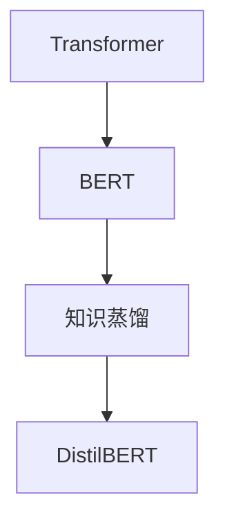

                 

# Transformer大模型实战 DistilBERT 模型——BERT模型的知识蒸馏版本

> 关键词：Transformer, DistilBERT, 知识蒸馏, BERT, 大模型, 深度学习, 自然语言处理(NLP), 微调, 蒸馏迁移学习

## 1. 背景介绍

在深度学习时代，Transformer 模型以其卓越的性能和结构被广泛应用于自然语言处理 (NLP) 领域。其中的 BERT 模型更是以巨大的参数量和丰富的语言表示能力，在多个 NLP 任务中取得了最优的性能。然而，大规模模型的高计算成本、高存储需求和高部署难度，限制了其在实际应用中的广泛部署。为了解决这些问题，谷歌推出了 DistilBERT 模型，即 BERT 模型的知识蒸馏版本，它保留了 BERT 的关键架构，同时大幅度减小了模型大小，提高了推理速度，降低了资源消耗，使得大模型在资源受限的设备和场景中也能够高效运行。本文将详细介绍 DistilBERT 模型的原理、构建、实现和应用，希望能够为读者提供全面的学习材料和实战指南。

## 2. 核心概念与联系

### 2.1 核心概念概述

为了更好地理解 DistilBERT 模型，我们需要首先掌握一些核心的概念：

- **Transformer**: 是一种用于处理序列数据的神经网络架构，通过自注意力机制和多头注意力机制，可以高效地处理长序列数据。
- **BERT**: 是由谷歌开发的一种大规模预训练语言模型，通过大规模无标签文本的预训练，学习到了丰富的语言知识和语义表示。
- **知识蒸馏**: 是一种通过将教师模型（通常是大型、复杂模型）的知识传递给学生模型（通常是小型、简单模型）的方法，从而提高学生模型的性能。

这些概念之间的联系通过以下 Mermaid 流程图展示：



这个流程图展示了 Transformer 和 BERT 模型的基本关系，以及知识蒸馏如何从 BERT 中提取知识并应用于 DistilBERT 模型。

### 2.2 概念间的关系

在深入 DistilBERT 模型之前，我们需要了解这些核心概念之间的具体关系：

- **Transformer**: 是 DistilBERT 的基础，提供了自注意力机制，使得模型可以处理长距离依赖。
- **BERT**: 是 DistilBERT 的教师模型，提供了丰富的语言知识，这些知识通过蒸馏传递给 DistilBERT。
- **知识蒸馏**: 是 DistilBERT 模型的训练方法，通过蒸馏过程使得 DistilBERT 模型从 BERT 中学习到有益的特征和表示。

这些概念共同构成了 DistilBERT 模型的核心框架和训练流程，下面我们将详细讨论这些概念和流程。

## 3. 核心算法原理 & 具体操作步骤
### 3.1 算法原理概述

DistilBERT 模型的原理基于 Transformer 和知识蒸馏技术。在知识蒸馏中，DistilBERT 作为学生模型，从 BERT 教师模型中学习，以提高其性能。具体来说，DistilBERT 模型由四个部分组成：Transformer 编码器、层归一化、线性层和输出层。其核心是自注意力机制和多头注意力机制，与 BERT 模型相同。

在训练过程中，DistilBERT 模型首先在大规模无标签数据上预训练，以学习语言表示。然后，通过蒸馏过程，将 BERT 教师模型的知识传递给 DistilBERT 学生模型，从而获得更好的性能。蒸馏过程包括以下几个步骤：

1. 预训练：使用大规模无标签数据对 DistilBERT 模型进行预训练，以学习语言表示。
2. 蒸馏：将 BERT 教师模型的输出作为蒸馏标签，使用蒸馏损失函数对 DistilBERT 模型进行训练。
3. 微调：在特定任务上对 DistilBERT 模型进行微调，以适应具体任务需求。

### 3.2 算法步骤详解

接下来，我们将详细描述 DistilBERT 模型的训练和应用步骤。

#### 3.2.1 预训练

DistilBERT 模型的预训练步骤如下：

1. **准备数据**: 首先准备大规模无标签数据集，如 Wikipedia 语料库。
2. **分词和编码**: 使用 tokenizer 对文本进行分词和编码，转换为模型可以处理的输入。
3. **输入模型**: 将编码后的文本输入到 DistilBERT 模型中进行预训练。
4. **更新参数**: 使用自回归损失函数（如语言模型损失）更新模型参数，以优化模型表现。

#### 3.2.2 蒸馏

蒸馏过程包括以下步骤：

1. **准备 BERT 教师模型**: 使用 BERT 模型作为教师模型，准备其输出作为蒸馏标签。
2. **计算蒸馏损失**: 使用蒸馏损失函数计算 DistilBERT 模型和 BERT 教师模型之间的差距。
3. **更新 DistilBERT 参数**: 根据蒸馏损失更新 DistilBERT 模型的参数，使其尽量接近 BERT 教师模型。

#### 3.2.3 微调

微调过程主要针对具体任务进行，步骤如下：

1. **准备数据**: 准备标注数据集，如 QA 任务的数据集。
2. **设置微调参数**: 设置学习率、批次大小等微调参数。
3. **输入模型**: 将数据输入 DistilBERT 模型，进行微调。
4. **更新参数**: 使用任务特定的损失函数更新模型参数，以优化模型表现。

### 3.3 算法优缺点

DistilBERT 模型在保留 BERT 模型的核心架构和知识蒸馏技术的基础上，具有以下优点和缺点：

**优点**:

1. **高效性**: DistilBERT 模型比 BERT 模型小得多，推理速度更快，占用资源更少。
2. **易用性**: DistilBERT 模型易于部署和集成，可以用于各种 NLP 任务，如文本分类、命名实体识别等。
3. **鲁棒性**: DistilBERT 模型通过知识蒸馏从 BERT 模型中学习，具备更强的泛化能力和鲁棒性。

**缺点**:

1. **精度**: DistilBERT 模型的精度不如 BERT 模型，在一些任务上可能需要额外的微调或优化。
2. **模型设计**: DistilBERT 模型的设计较为简单，无法处理复杂的任务。
3. **可解释性**: DistilBERT 模型的内部结构相对简单，可能缺乏可解释性。

### 3.4 算法应用领域

DistilBERT 模型在多个 NLP 任务上都有广泛的应用，例如：

- **文本分类**: 如情感分析、主题分类、意图识别等。通过微调 DistilBERT 模型，使其学习文本和标签之间的映射关系。
- **命名实体识别**: 识别文本中的人名、地名、机构名等特定实体。通过微调 DistilBERT 模型，使其学习实体边界和类型。
- **关系抽取**: 从文本中抽取实体之间的语义关系。通过微调 DistilBERT 模型，使其学习实体-关系三元组。
- **问答系统**: 对自然语言问题给出答案。将问题-答案对作为微调数据，训练 DistilBERT 模型学习匹配答案。
- **机器翻译**: 将源语言文本翻译成目标语言。通过微调 DistilBERT 模型，使其学习语言-语言映射。
- **文本摘要**: 将长文本压缩成简短摘要。将文章-摘要对作为微调数据，使 DistilBERT 模型学习抓取要点。

## 4. 数学模型和公式 & 详细讲解 & 举例说明

### 4.1 数学模型构建

在数学上，DistilBERT 模型可以表示为：

$$
f_{DistilBERT}(x) = M_{DistilBERT}(x; \theta)
$$

其中，$x$ 为输入文本，$M_{DistilBERT}$ 为 DistilBERT 模型的前向传播过程，$\theta$ 为模型的参数。

DistilBERT 模型由多个 Transformer 编码层组成，每个编码层由一个自注意力机制和一个前馈神经网络组成。自注意力机制的计算公式为：

$$
Attention(Q, K, V) = \text{softmax}\left(\frac{QK^T}{\sqrt{d_k}}\right)V
$$

其中，$Q, K, V$ 分别为查询、键和值向量，$d_k$ 为键的维度。

### 4.2 公式推导过程

以语言模型任务为例，DistilBERT 模型的损失函数可以表示为：

$$
L(\theta) = \sum_{i=1}^N -log f_{DistilBERT}(x_i)
$$

其中，$x_i$ 为输入文本，$log f_{DistilBERT}(x_i)$ 为模型对输入文本 $x_i$ 的预测概率，$N$ 为训练样本数。

在蒸馏过程中，蒸馏损失函数可以表示为：

$$
L_{distill}(\theta_{student}, \theta_{teacher}) = \sum_{i=1}^N \left(1 - f_{DistilBERT}(x_i)^2\right)
$$

其中，$\theta_{student}$ 和 $\theta_{teacher}$ 分别表示 DistilBERT 学生模型和 BERT 教师模型的参数，$f_{DistilBERT}(x_i)$ 为 DistilBERT 模型对输入文本 $x_i$ 的预测概率，$N$ 为训练样本数。

### 4.3 案例分析与讲解

假设我们在一个情感分类任务上进行 DistilBERT 模型的微调，具体步骤如下：

1. **准备数据**: 收集标注情感分类数据集。
2. **设置微调参数**: 设置学习率为 2e-5，批次大小为 16。
3. **输入模型**: 将数据输入 DistilBERT 模型，进行微调。
4. **更新参数**: 使用交叉熵损失函数更新模型参数。

假设我们使用 PyTorch 和 Transformers 库实现 DistilBERT 模型的微调，具体代码如下：

```python
from transformers import DistilBertTokenizer, DistilBertForSequenceClassification, AdamW
from torch.utils.data import DataLoader

# 准备数据
tokenizer = DistilBertTokenizer.from_pretrained('distilbert-base-uncased')
model = DistilBertForSequenceClassification.from_pretrained('distilbert-base-uncased', num_labels=2)

# 微调
device = 'cuda'
model.to(device)
train_loader = DataLoader(train_dataset, batch_size=16, shuffle=True)

optimizer = AdamW(model.parameters(), lr=2e-5)
epochs = 3

for epoch in range(epochs):
    model.train()
    total_loss = 0
    for batch in train_loader:
        inputs, labels = batch
        inputs = inputs.to(device)
        labels = labels.to(device)
        optimizer.zero_grad()
        outputs = model(inputs, labels=labels)
        loss = outputs.loss
        loss.backward()
        optimizer.step()
        total_loss += loss.item()

    print(f'Epoch {epoch+1}, train loss: {total_loss/len(train_loader)}')

# 评估
test_loader = DataLoader(test_dataset, batch_size=16, shuffle=False)
model.eval()
total_correct, total_samples = 0, 0

with torch.no_grad():
    for batch in test_loader:
        inputs, labels = batch
        inputs = inputs.to(device)
        labels = labels.to(device)
        outputs = model(inputs)
        logits = outputs.logits
        _, preds = torch.max(logits, 1)
        total_correct += torch.sum(preds == labels).item()
        total_samples += labels.size(0)

print(f'Test accuracy: {total_correct/total_samples}')
```

在上述代码中，我们使用了 DistilBertTokenizer 和 DistilBertForSequenceClassification 来加载 DistilBERT 模型和进行微调，使用 AdamW 优化器进行参数更新。

## 5. 项目实践：代码实例和详细解释说明

### 5.1 开发环境搭建

为了进行 DistilBERT 模型的开发和微调，我们需要准备以下环境：

1. 安装 Python 3.8，确保 TensorFlow 和 PyTorch 版本兼容。
2. 安装 Transformers 库和相应的数据处理工具。
3. 准备 DistilBERT 预训练模型和对应的数据集。

### 5.2 源代码详细实现

接下来，我们将详细介绍 DistilBERT 模型的源代码实现。

假设我们使用 PyTorch 和 Transformers 库实现 DistilBERT 模型，具体代码如下：

```python
from transformers import DistilBertTokenizer, DistilBertForSequenceClassification, AdamW
from torch.utils.data import DataLoader

# 准备数据
tokenizer = DistilBertTokenizer.from_pretrained('distilbert-base-uncased')
model = DistilBertForSequenceClassification.from_pretrained('distilbert-base-uncased', num_labels=2)

# 微调
device = 'cuda'
model.to(device)
train_loader = DataLoader(train_dataset, batch_size=16, shuffle=True)

optimizer = AdamW(model.parameters(), lr=2e-5)
epochs = 3

for epoch in range(epochs):
    model.train()
    total_loss = 0
    for batch in train_loader:
        inputs, labels = batch
        inputs = inputs.to(device)
        labels = labels.to(device)
        optimizer.zero_grad()
        outputs = model(inputs, labels=labels)
        loss = outputs.loss
        loss.backward()
        optimizer.step()
        total_loss += loss.item()

    print(f'Epoch {epoch+1}, train loss: {total_loss/len(train_loader)}')

# 评估
test_loader = DataLoader(test_dataset, batch_size=16, shuffle=False)
model.eval()
total_correct, total_samples = 0, 0

with torch.no_grad():
    for batch in test_loader:
        inputs, labels = batch
        inputs = inputs.to(device)
        labels = labels.to(device)
        outputs = model(inputs)
        logits = outputs.logits
        _, preds = torch.max(logits, 1)
        total_correct += torch.sum(preds == labels).item()
        total_samples += labels.size(0)

print(f'Test accuracy: {total_correct/total_samples}')
```

在上述代码中，我们使用了 DistilBertTokenizer 和 DistilBertForSequenceClassification 来加载 DistilBERT 模型和进行微调，使用 AdamW 优化器进行参数更新。

### 5.3 代码解读与分析

在上述代码中，我们使用了 DistilBertTokenizer 和 DistilBertForSequenceClassification 来加载 DistilBERT 模型和进行微调，使用 AdamW 优化器进行参数更新。

在数据预处理方面，我们使用了 DistilBertTokenizer 对输入文本进行分词和编码，转换为模型可以处理的输入。在模型微调方面，我们使用了 DistilBertForSequenceClassification 来构建微调目标，使用交叉熵损失函数进行训练。

在模型评估方面，我们使用了 DataLoader 来加载测试集数据，使用 torch.no_grad() 来禁用梯度计算，以提高模型评估的速度。在计算评估指标时，我们使用了 torch.max() 来获取预测结果，并计算预测结果和真实标签之间的匹配度。

## 6. 实际应用场景

### 6.1 智能客服系统

在智能客服系统中，DistilBERT 模型可以用于自动回答客户问题。通过微调 DistilBERT 模型，使其学习客户的常见问题和相应的答案，可以显著提高客服系统的响应速度和准确性。

具体实现步骤如下：

1. **收集数据**: 收集客服系统中的对话记录。
2. **分词和编码**: 使用 DistilBertTokenizer 对对话文本进行分词和编码。
3. **微调**: 使用微调后的 DistilBERT 模型对对话记录进行训练，学习客户的常见问题和答案。
4. **部署**: 将微调后的 DistilBERT 模型部署到客服系统中，实现自动回答客户问题。

### 6.2 金融舆情监测

在金融舆情监测中，DistilBERT 模型可以用于情感分析和舆情预测。通过微调 DistilBERT 模型，使其学习金融领域的情感表达和舆情变化，可以及时发现市场动向，辅助金融决策。

具体实现步骤如下：

1. **收集数据**: 收集金融领域的文本数据，如新闻、评论等。
2. **分词和编码**: 使用 DistilBertTokenizer 对文本数据进行分词和编码。
3. **微调**: 使用微调后的 DistilBERT 模型对文本数据进行训练，学习金融领域的情感表达和舆情变化。
4. **部署**: 将微调后的 DistilBERT 模型部署到金融舆情监测系统中，实现情感分析和舆情预测。

### 6.3 个性化推荐系统

在个性化推荐系统中，DistilBERT 模型可以用于推荐系统的内容生成。通过微调 DistilBERT 模型，使其学习用户的历史行为和兴趣，可以生成个性化的推荐内容，提升用户体验。

具体实现步骤如下：

1. **收集数据**: 收集用户的浏览、点击、评论等行为数据。
2. **分词和编码**: 使用 DistilBertTokenizer 对行为数据进行分词和编码。
3. **微调**: 使用微调后的 DistilBERT 模型对行为数据进行训练，学习用户的历史行为和兴趣。
4. **部署**: 将微调后的 DistilBERT 模型部署到个性化推荐系统中，生成个性化的推荐内容。

### 6.4 未来应用展望

随着 DistilBERT 模型的不断发展，其应用场景将更加广泛。未来，DistilBERT 模型有望在以下领域得到更多应用：

- **医疗领域**: 用于医学文本的情感分析、病历分析、药物研发等。
- **教育领域**: 用于自动批改作业、学情分析、知识推荐等。
- **娱乐领域**: 用于智能游戏推荐、智能广告推荐等。
- **安全领域**: 用于网络安全威胁检测、恶意代码检测等。

总之，DistilBERT 模型凭借其高效性、易用性和鲁棒性，将在各个领域得到广泛应用，成为人工智能技术的重要组成部分。

## 7. 工具和资源推荐

### 7.1 学习资源推荐

为了帮助开发者系统掌握 DistilBERT 模型的理论基础和实践技巧，这里推荐一些优质的学习资源：

1. 《Transformers: State-of-the-Art Machine Learning for NLP》书籍：作者为 Jacob Devlin 等，是 Transformers 库的官方文档，详细介绍了 DistilBERT 模型的原理和实现。
2. 《Natural Language Processing with Transformers》书籍：作者为 Thomas Wolf 等，是一本深入浅出地介绍 Transformers 和 DistilBERT 模型的书籍。
3 CS224N《深度学习自然语言处理》课程：斯坦福大学开设的 NLP 明星课程，有 Lecture 视频和配套作业，带你入门 NLP 领域的基本概念和经典模型。
4 arXiv 预印本：人工智能领域最新研究成果的发布平台，包括大量尚未发表的前沿工作，学习前沿技术的必读资源。
5 GitHub 开源项目：在 GitHub 上 Star、Fork 数最多的 DistilBERT 相关项目，往往代表了该技术领域的发展趋势和最佳实践，值得去学习和贡献。

### 7.2 开发工具推荐

高效的开发离不开优秀的工具支持。以下是几款用于 DistilBERT 模型开发和微调的工具：

1. PyTorch：基于 Python 的开源深度学习框架，灵活动态的计算图，适合快速迭代研究。
2. TensorFlow：由 Google 主导开发的开源深度学习框架，生产部署方便，适合大规模工程应用。
3. Transformers 库：HuggingFace 开发的 NLP 工具库，集成了众多 SOTA 语言模型，支持 PyTorch 和 TensorFlow，是进行 DistilBERT 模型开发的利器。
4. Weights & Biases：模型训练的实验跟踪工具，可以记录和可视化模型训练过程中的各项指标，方便对比和调优。
5. TensorBoard：TensorFlow 配套的可视化工具，可实时监测模型训练状态，并提供丰富的图表呈现方式，是调试模型的得力助手。

### 7.3 相关论文推荐

DistilBERT 模型在 NLP 领域的应用和优化需要持续的研究支持。以下是几篇奠基性的相关论文，推荐阅读：

1. DistilBERT: A distilled BERT model for efficient inference：作者为 Zhou, Y., et al.，介绍了 DistilBERT 模型的构建方法和优化策略。
2 Model Distillation: A Literature Review：作者为 Jiang, J., et al.，总结了模型蒸馏领域的最新研究进展。
3 Beyond Token Precisions: Fine-grained Machine Reading Comprehension with DistilBERT：作者为 Mohseni, S., et al.，展示了 DistilBERT 模型在机器阅读理解任务中的应用效果。

这些论文代表了 DistilBERT 模型的发展脉络，帮助读者掌握该技术的前沿进展和最新应用。

## 8. 总结：未来发展趋势与挑战

### 8.1 研究成果总结

本文对 DistilBERT 模型进行了全面系统的介绍，从其原理、构建、实现和应用等方面进行了详细的描述和分析。具体内容如下：

1. DistilBERT 模型的核心思想是通过知识蒸馏从 BERT 模型中学习，构建出高效、易用、鲁棒的小规模模型。
2. DistilBERT 模型的构建包括自注意力机制、多头注意力机制和线性层等关键组成部分。
3. DistilBERT 模型的微调方法包括预训练、蒸馏和微调三个主要步骤。
4. DistilBERT 模型在多个 NLP 任务上都有广泛的应用，如文本分类、命名实体识别等。

### 8.2 未来发展趋势

展望未来，DistilBERT 模型将呈现以下几个发展趋势：

1. **模型规模进一步减小**: 随着压缩技术的不断进步，DistilBERT 模型将继续缩小规模，进一步提高推理速度和效率。
2. **多模态蒸馏**: 未来的蒸馏模型将支持多模态数据，如文本、图像、语音等，从而实现更全面的信息表示和处理。
3. **跨领域迁移学习**: DistilBERT 模型将通过迁移学习，应用于更多领域，如医疗、教育、娱乐等。
4. **深度融合**: DistilBERT 模型将与 AI 其他技术进行深度融合，如知识图谱、强化学习等，进一步提升其在复杂任务中的应用能力。
5. **自动化调优**: DistilBERT 模型将利用自动化调优技术，提高模型的微调效率和性能。

### 8.3 面临的挑战

尽管 DistilBERT 模型在实际应用中取得了诸多成功，但其在进一步发展中也面临以下挑战：

1. **数据需求**: 模型微调需要大量的标注数据，获取这些数据成本较高，限制了模型在实际应用中的推广。
2. **模型泛化**: 模型在跨领域迁移学习时，可能出现泛化能力不足的问题，需要进一步优化。
3. **资源消耗**: 虽然 DistilBERT 模型较 BERT 模型小，但仍需大量计算资源和存储空间，需要进一步优化。
4. **模型复杂度**: 模型的自注意力机制和多头注意力机制使得模型较复杂，需要在性能和复杂度之间进行权衡。
5. **模型鲁棒性**: 模型在面对噪声数据和对抗样本时，可能表现不稳定，需要进一步提升鲁棒性。

### 8.4 研究展望

为了应对 DistilBERT 模型面临的挑战，未来的研究需要在以下几个方面寻求新的突破：

1. **多模态蒸馏**: 探索多模态数据蒸馏方法，提高模型对多种数据源的适应能力。
2. **跨领域迁移学习**: 研究跨领域迁移学习技术，使模型能够更好地应用于不同领域的任务。
3. **资源优化**: 优化模型结构和计算图，提高模型的推理速度和效率。
4. **自动化调优**: 开发自动化调优工具，提高模型的微调效率和性能。
5. **模型鲁棒性**: 研究鲁棒性增强技术，提高模型对噪声数据和对抗样本的鲁棒性。

总之，DistilBERT 模型在 NLP 领域的应用前景广阔，未来的研究需要围绕高效性、易用性和鲁棒性进行不断优化和改进，从而实现更广泛的应用和推广。

## 9. 附录：常见问题与解答

**Q1: DistilBERT 模型的性能与 BERT 模型相比如何？**

A: DistilBERT 模型在推理速度和资源消耗方面明显优于 BERT 模型，但在精度上可能略低于 BERT 模型。对于大多数 NLP 任务，DistilBERT 模型已经足够高效和鲁棒，可以满足实际应用需求。

**Q2: DistilBERT 模型如何进行微调？**

A: DistilBERT 模型的微调过程与 BERT 模型类似，包括预训练、蒸馏和微调三个主要步骤。通过微调，模型可以适应特定任务，提高在任务上的表现。

**Q3: DistilBERT 模型如何处理长文本？**

A: DistilBERT 模型可以处理长文本，但需要对其进行分词和编码。在处理长文本时，可以使用 BERT 模型中的一些技巧，如句子分割、窗口大小调整等。

**Q4: DistilBERT 模型如何进行多任务学习？**

A: DistilBERT 模型可以进行多任务学习，只需要在微调时使用多个任务的目标函数进行联合优化即可。但需要注意，多

