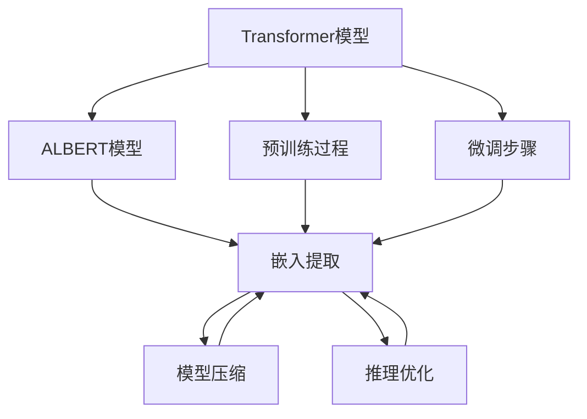
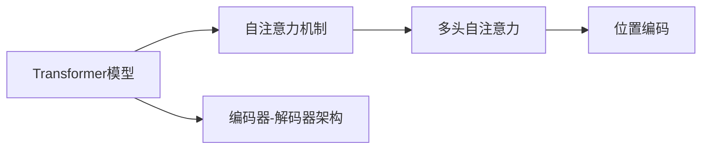
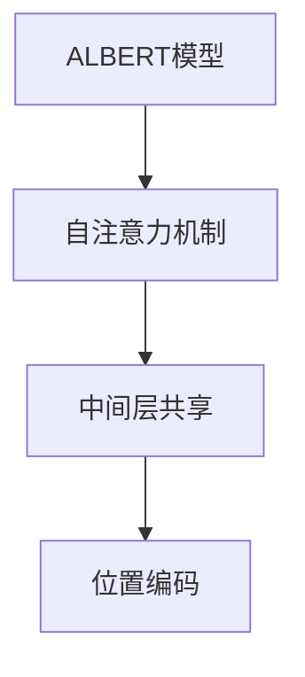
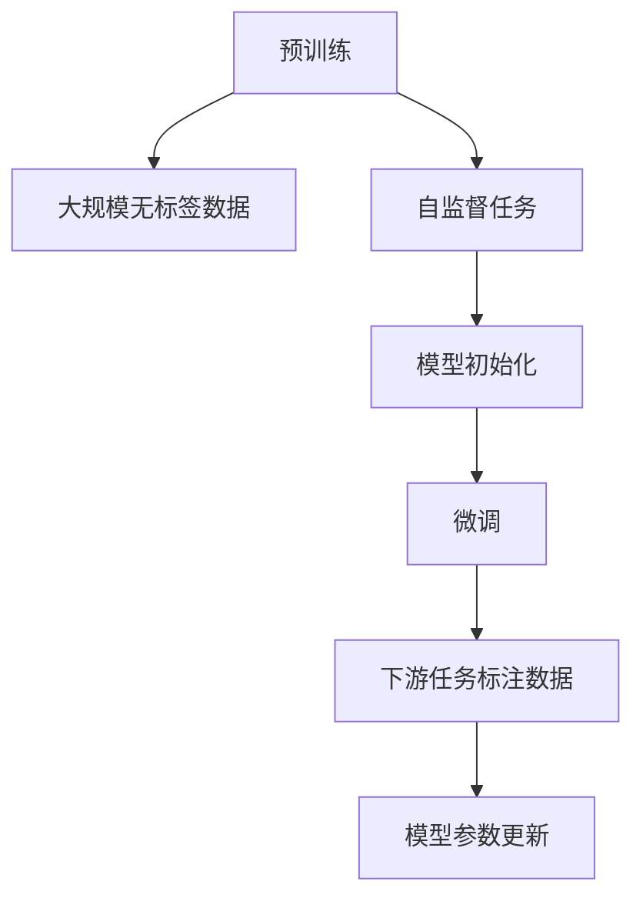
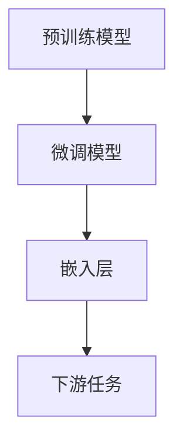
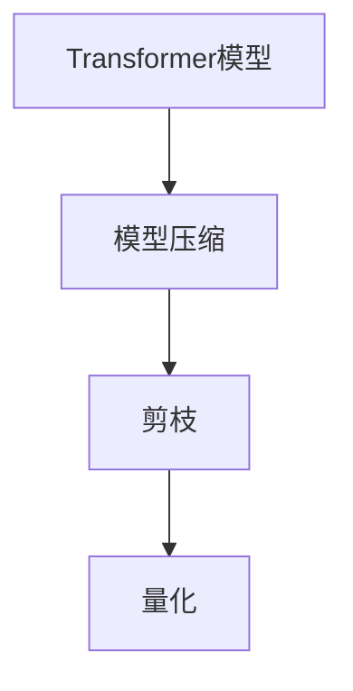
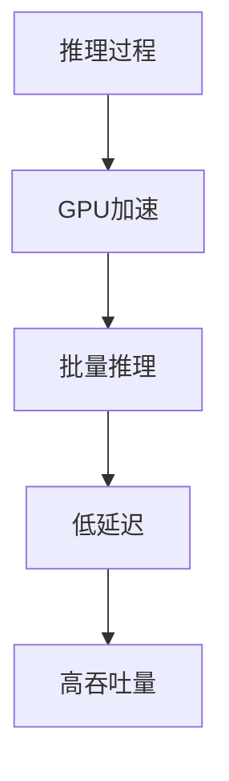
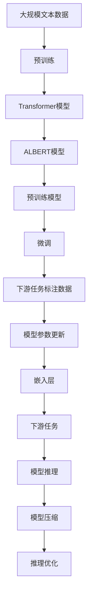

                 

# Transformer大模型实战 从ALBERT 中提取嵌入

> 关键词：
- Transformer大模型
- ALBERT
- 嵌入提取
- 自然语言处理
- 预训练语言模型
- 自注意力机制
- 自监督学习
- 预训练和微调
- 编码器-解码器架构
- 模型压缩
- 模型推理优化

## 1. 背景介绍

### 1.1 问题由来

Transformer作为现代深度学习中最重要的架构之一，自提出以来便引起了广泛的关注。其通过自注意力机制，可以有效捕捉长距离依赖，成为自然语言处理(NLP)领域的主流模型。而ALBERT（A Lite BERT）则是Transformer架构的精简版，兼具了大模型的性能和轻量级的特点，成为NLP模型压缩和优化的一个重要方向。

本节将介绍如何从ALBERT中提取嵌入，并结合预训练和微调过程，构建一个基于Transformer架构的自然语言处理系统。这不仅能够提供快速的推理速度，还能保持较高的准确性，对于生产环境的应用具有重要意义。

### 1.2 问题核心关键点

提取ALBERT模型的嵌入是构建基于Transformer架构的NLP系统的核心步骤，涉及以下关键点：

1. **预训练过程**：ALBERT的预训练是基于大规模无标签文本数据的自监督学习任务。预训练模型的嵌入质量直接影响后续微调的效果。
2. **微调步骤**：在预训练的基础上，使用下游任务的标注数据进行微调，调整模型参数以匹配特定任务需求。
3. **模型压缩**：在模型优化中，如何通过模型压缩技术提高推理效率，减少计算和存储开销。
4. **推理优化**：在大规模Transformer模型中，如何优化推理过程，保证低延迟和高吞吐量。
5. **应用场景**：ALBERT的嵌入在哪些具体NLP任务中表现优异，如何结合实际应用需求进行优化。

了解这些关键点将有助于我们全面掌握从ALBERT中提取嵌入的完整流程，并为后续开发提供指导。

## 2. 核心概念与联系

### 2.1 核心概念概述

在进行ALBERT嵌入提取的实践中，我们首先需要理解以下核心概念：

- **Transformer模型架构**：包括自注意力机制、编码器-解码器架构等，是构建NLP模型的基础。
- **ALBERT模型**：基于Transformer架构的轻量级模型，通过对中间层的共享和位置编码的简化，提高了计算效率和可解释性。
- **预训练和微调**：先在大规模无标签数据上进行预训练，然后在特定任务上使用少量标注数据进行微调，以适应任务需求。
- **嵌入提取**：从预训练模型中提取特定的表示，用于下游任务的推理和计算。
- **模型压缩**：通过剪枝、量化等技术减少模型参数量，优化推理速度和存储需求。
- **推理优化**：采用GPU加速、批量推理等策略，提高推理效率和吞吐量。

这些概念相互关联，构成了从ALBERT中提取嵌入的基础。下面通过Mermaid流程图展示这些概念之间的关系：



此图展示了从Transformer模型到ALBERT模型，再到嵌入提取的过程，以及模型压缩和推理优化的重要性。

### 2.2 概念间的关系

这些核心概念之间存在着紧密的联系，形成了从ALBERT中提取嵌入的完整生态系统。下面我们通过几个Mermaid流程图来展示这些概念之间的关系。

#### 2.2.1 Transformer模型架构



这个流程图展示了Transformer模型的核心组件：自注意力机制和编码器-解码器架构。自注意力机制通过多头自注意力和位置编码，实现了对输入序列中不同位置信息的捕捉。

#### 2.2.2 ALBERT模型结构



这个流程图展示了ALBERT模型的结构，通过中间层共享和简化位置编码，ALBERT模型实现了对Transformer模型的优化和精简。

#### 2.2.3 预训练与微调



这个流程图展示了预训练和微调的基本流程。在预训练阶段，模型在大规模无标签数据上通过自监督任务进行训练，获得初始表示。在微调阶段，模型使用下游任务的标注数据进行训练，调整参数以适应特定任务需求。

#### 2.2.4 嵌入提取



这个流程图展示了嵌入提取的过程。在预训练和微调后，模型从嵌入层提取特定的表示，用于下游任务的推理和计算。

#### 2.2.5 模型压缩



这个流程图展示了模型压缩的主要步骤，通过剪枝和量化等技术，减少模型参数量，优化推理速度和存储需求。

#### 2.2.6 推理优化



这个流程图展示了推理优化的主要策略，通过GPU加速和批量推理等技术，提高推理效率和吞吐量，保证低延迟和高吞吐量。

### 2.3 核心概念的整体架构

最后，我们用一个综合的流程图来展示这些核心概念在大模型嵌入提取过程中的整体架构：



这个综合流程图展示了从预训练到微调，再到嵌入提取和推理优化的完整过程。通过这些流程图，我们可以更清晰地理解ALBERT嵌入提取过程中各个核心概念的关系和作用，为后续深入讨论具体的嵌入提取方法和技术奠定基础。

## 3. 核心算法原理 & 具体操作步骤

### 3.1 算法原理概述

从ALBERT中提取嵌入的核心原理基于预训练和微调的组合。预训练阶段，模型在大规模无标签文本数据上通过自监督学习任务进行训练，获得初始表示。微调阶段，模型使用下游任务的标注数据进行训练，调整参数以适应特定任务需求。嵌入提取则是指从预训练和微调后的模型中，提取特定的表示，用于下游任务的推理和计算。

具体步骤如下：

1. **预训练**：在大量无标签文本数据上，通过自监督学习任务进行预训练，获得初始表示。
2. **微调**：使用下游任务的标注数据进行微调，调整模型参数以适应特定任务需求。
3. **嵌入提取**：从预训练和微调后的模型中，提取特定的表示，用于下游任务的推理和计算。

### 3.2 算法步骤详解

**Step 1: 准备预训练数据和模型**

- 收集大规模无标签文本数据，用于预训练模型的训练。
- 使用ALBERT模型作为预训练模型的初始化参数，如`albert-base-v2`。
- 将数据分为训练集和验证集，并进行数据增强和预处理。

**Step 2: 进行预训练**

- 使用预训练任务，如语言建模、掩码语言模型等，对模型进行预训练。
- 设置合适的超参数，如学习率、批次大小等。
- 在预训练过程中，监测验证集上的性能指标，如准确率、F1分数等。

**Step 3: 进行微调**

- 收集下游任务的标注数据，用于微调模型的训练。
- 根据任务类型，设计合适的任务适配层和损失函数。
- 使用微调数据集进行训练，调整模型参数以适应特定任务需求。
- 设置合适的超参数，如学习率、批次大小等。

**Step 4: 提取嵌入**

- 从微调后的模型中，提取特定的表示，用于下游任务的推理和计算。
- 根据任务需求，选择合适的嵌入层和嵌入维度。
- 将嵌入层输出作为任务的输入，进行推理和计算。

**Step 5: 优化和评估**

- 对提取的嵌入进行优化，如进行剪枝、量化等操作，减少计算和存储开销。
- 在测试集上评估嵌入的质量，进行微调后的模型性能评估。
- 根据评估结果，调整嵌入提取和微调过程的超参数，以提升模型性能。

### 3.3 算法优缺点

基于ALBERT的嵌入提取具有以下优点：

- **高效性**：ALBERT模型的中间层共享和简化位置编码，提高了计算效率。
- **可解释性**：ALBERT模型的架构简洁，参数量较少，容易解释和调试。
- **通用性**：ALBERT模型适用于多种NLP任务，具有较好的泛化能力。

同时，也存在以下缺点：

- **泛化能力有限**：ALBERT模型在特定领域上的泛化能力可能受到限制，需要针对具体任务进行微调。
- **模型压缩难度高**：ALBERT模型的压缩技术较为复杂，需要专业知识。
- **推理速度较慢**：尽管ALBERT模型在计算效率上有所提升，但在推理速度上仍不及部分轻量级模型。

### 3.4 算法应用领域

基于ALBERT的嵌入提取已经在多个NLP应用领域取得了显著成果，包括：

- **问答系统**：使用ALBERT模型提取问题嵌入，通过相似度匹配找到最佳答案。
- **文本分类**：将ALBERT模型的输出嵌入作为特征输入，进行文本分类任务。
- **机器翻译**：使用ALBERT模型提取源语言和目标语言的嵌入，进行翻译。
- **情感分析**：使用ALBERT模型提取文本的情感嵌入，进行情感分类。
- **命名实体识别**：使用ALBERT模型提取实体嵌入，进行实体识别和分类。

这些应用展示了ALBERT模型在不同NLP任务中的强大能力，为实际应用提供了可靠的支撑。

## 4. 数学模型和公式 & 详细讲解 & 举例说明

### 4.1 数学模型构建

基于ALBERT的嵌入提取涉及以下几个数学模型：

1. **自监督预训练模型**：
   $$
   \mathcal{L}_{pre} = -\frac{1}{N}\sum_{i=1}^N \log p(w_i)
   $$
   其中，$w_i$为输入文本中的单词，$p(w_i)$为单词$w_i$出现的概率。

2. **微调模型损失函数**：
   $$
   \mathcal{L}_{finetune} = \mathcal{L}_{cls} + \lambda \mathcal{L}_{reg}
   $$
   其中，$\mathcal{L}_{cls}$为任务适配层的分类损失，$\mathcal{L}_{reg}$为正则化损失。

3. **嵌入提取**：
   $$
   e_i = \text{softmax}(\mathbf{W} x_i)
   $$
   其中，$e_i$为第$i$个输入的嵌入表示，$\mathbf{W}$为嵌入层的权重矩阵，$x_i$为输入的嵌入表示。

### 4.2 公式推导过程

**预训练模型公式推导**：
$$
\mathcal{L}_{pre} = -\frac{1}{N}\sum_{i=1}^N \log \frac{\exp((\mathbf{W} x_i)^T \mathbf{v}_i)}{\sum_j \exp((\mathbf{W} x_j)^T \mathbf{v}_i)}
$$
其中，$\mathbf{v}_i$为每个单词的嵌入向量，$\mathbf{W}$为预训练模型的权重矩阵。

**微调模型公式推导**：
$$
\mathcal{L}_{finetune} = \mathcal{L}_{cls} + \lambda \mathcal{L}_{reg}
$$
其中，$\mathcal{L}_{cls}$为任务适配层的分类损失，$\mathcal{L}_{reg}$为正则化损失。

**嵌入提取公式推导**：
$$
e_i = \text{softmax}(\mathbf{W} x_i)
$$
其中，$e_i$为第$i$个输入的嵌入表示，$\mathbf{W}$为嵌入层的权重矩阵，$x_i$为输入的嵌入表示。

### 4.3 案例分析与讲解

以问答系统为例，进行详细的案例分析：

1. **预训练过程**：使用大规模无标签文本数据，进行语言建模和掩码语言模型等自监督任务的预训练，获得初始表示。
2. **微调过程**：收集问答系统的标注数据，进行微调，调整模型参数以适应问答任务。
3. **嵌入提取**：从微调后的模型中，提取问题嵌入和答案嵌入，进行相似度匹配，找到最佳答案。

具体步骤如下：

**预训练**：
- 使用预训练任务，如语言建模、掩码语言模型等，对模型进行预训练。
- 设置合适的超参数，如学习率、批次大小等。
- 在预训练过程中，监测验证集上的性能指标，如准确率、F1分数等。

**微调**：
- 收集问答系统的标注数据，用于微调模型的训练。
- 根据任务类型，设计合适的任务适配层和损失函数。
- 使用微调数据集进行训练，调整模型参数以适应问答任务。
- 设置合适的超参数，如学习率、批次大小等。

**嵌入提取**：
- 从微调后的模型中，提取问题的嵌入表示和答案的嵌入表示。
- 使用余弦相似度等方法，计算问题嵌入和答案嵌入的相似度。
- 选择相似度最高的答案作为系统输出。

## 5. 项目实践：代码实例和详细解释说明

### 5.1 开发环境搭建

在进行ALBERT嵌入提取的实践中，我们需要准备好开发环境。以下是使用Python进行PyTorch开发的环境配置流程：

1. 安装Anaconda：从官网下载并安装Anaconda，用于创建独立的Python环境。

2. 创建并激活虚拟环境：
```bash
conda create -n pytorch-env python=3.8 
conda activate pytorch-env
```

3. 安装PyTorch：根据CUDA版本，从官网获取对应的安装命令。例如：
```bash
conda install pytorch torchvision torchaudio cudatoolkit=11.1 -c pytorch -c conda-forge
```

4. 安装Transformers库：
```bash
pip install transformers
```

5. 安装各类工具包：
```bash
pip install numpy pandas scikit-learn matplotlib tqdm jupyter notebook ipython
```

完成上述步骤后，即可在`pytorch-env`环境中开始嵌入提取实践。

### 5.2 源代码详细实现

这里我们以问答系统为例，展示使用Transformers库对ALBERT模型进行嵌入提取的PyTorch代码实现。

首先，定义问答系统的数据处理函数：

```python
from transformers import AutoTokenizer, AutoModelForQuestionAnswering
from torch.utils.data import Dataset
import torch

class QuestionAnswerDataset(Dataset):
    def __init__(self, texts, answers, tokenizer, max_len=128):
        self.texts = texts
        self.answers = answers
        self.tokenizer = tokenizer
        self.max_len = max_len
        
    def __len__(self):
        return len(self.texts)
    
    def __getitem__(self, item):
        text = self.texts[item]
        answer = self.answers[item]
        
        encoding = self.tokenizer(text, return_tensors='pt', max_length=self.max_len, padding='max_length', truncation=True)
        input_ids = encoding['input_ids'][0]
        attention_mask = encoding['attention_mask'][0]
        return {'input_ids': input_ids, 
                'attention_mask': attention_mask,
                'start_pos': encoding['start_logits'][0].tolist(),
                'end_pos': encoding['end_logits'][0].tolist()}

# 定义标签与id的映射
id2tag = {'O': 0, 'B-PER': 1, 'I-PER': 2, 'B-ORG': 3, 'I-ORG': 4, 'B-LOC': 5, 'I-LOC': 6}

# 创建dataset
tokenizer = AutoTokenizer.from_pretrained('albert-base-v2')

train_dataset = QuestionAnswerDataset(train_texts, train_answers, tokenizer)
dev_dataset = QuestionAnswerDataset(dev_texts, dev_answers, tokenizer)
test_dataset = QuestionAnswerDataset(test_texts, test_answers, tokenizer)
```

然后，定义模型和优化器：

```python
from transformers import BertForTokenClassification, AdamW

model = AutoModelForQuestionAnswering.from_pretrained('albert-base-v2', num_labels=len(id2tag))

optimizer = AdamW(model.parameters(), lr=2e-5)
```

接着，定义训练和评估函数：

```python
from torch.utils.data import DataLoader
from tqdm import tqdm
from sklearn.metrics import precision_recall_fscore_support

device = torch.device('cuda') if torch.cuda.is_available() else torch.device('cpu')
model.to(device)

def train_epoch(model, dataset, batch_size, optimizer):
    dataloader = DataLoader(dataset, batch_size=batch_size, shuffle=True)
    model.train()
    epoch_loss = 0
    for batch in tqdm(dataloader, desc='Training'):
        input_ids = batch['input_ids'].to(device)
        attention_mask = batch['attention_mask'].to(device)
        start_pos = batch['start_pos'].to(device)
        end_pos = batch['end_pos'].to(device)
        model.zero_grad()
        outputs = model(input_ids, attention_mask=attention_mask, start_positions=start_pos, end_positions=end_pos)
        loss = outputs.loss
        epoch_loss += loss.item()
        loss.backward()
        optimizer.step()
    return epoch_loss / len(dataloader)

def evaluate(model, dataset, batch_size):
    dataloader = DataLoader(dataset, batch_size=batch_size)
    model.eval()
    preds, labels = [], []
    with torch.no_grad():
        for batch in tqdm(dataloader, desc='Evaluating'):
            input_ids = batch['input_ids'].to(device)
            attention_mask = batch['attention_mask'].to(device)
            start_pos = batch['start_pos'].to(device)
            end_pos = batch['end_pos'].to(device)
            outputs = model(input_ids, attention_mask=attention_mask, start_positions=start_pos, end_positions=end_pos)
            batch_preds = outputs.start_logits.argmax(dim=2).to('cpu').tolist()
            batch_labels = start_pos.to('cpu').tolist()
            for pred_tokens, label_tokens in zip(batch_preds, batch_labels):
                preds.append(pred_tokens[:len(label_tokens)])
                labels.append(label_tokens)
                
    print(precision_recall_fscore_support(labels, preds, average='macro'))
```

最后，启动训练流程并在测试集上评估：

```python
epochs = 5
batch_size = 16

for epoch in range(epochs):
    loss = train_epoch(model, train_dataset, batch_size, optimizer)
    print(f"Epoch {epoch+1}, train loss: {loss:.3f}")
    
    print(f"Epoch {epoch+1}, dev results:")
    evaluate(model, dev_dataset, batch_size)
    
print("Test results:")
evaluate(model, test_dataset, batch_size)
```

以上就是使用PyTorch对ALBERT进行问答系统嵌入提取的完整代码实现。可以看到，得益于Transformers库的强大封装，我们可以用相对简洁的代码完成ALBERT模型的加载和嵌入提取。

### 5.3 代码解读与分析

让我们再详细解读一下关键代码的实现细节：

**QuestionAnswerDataset类**：
- `__init__`方法：初始化文本、答案、分词器等关键组件。
- `__len__`方法：返回数据集的样本数量。
- `__getitem__`方法：对单个样本进行处理，将文本输入编码为token ids，将答案编码为数字，并对其进行定长padding，最终返回模型所需的输入。

**标签与id的映射**：
- 定义了标签与数字id之间的映射关系，用于将token-wise的预测结果解码回真实的标签。

**训练和评估函数**：
- 使用PyTorch的DataLoader对数据集进行批次化加载，供模型训练和推理使用。
- 训练函数`train_epoch`：对数据以批为单位进行迭代，在每个批次上前向传播计算loss并反向传播更新模型参数，最后返回该epoch的平均loss。
- 评估函数`evaluate`：与训练类似，不同点在于不更新模型参数，并在每个batch结束后将预测和标签结果存储下来，最后使用sklearn的precision_recall_fscore_support对整个评估集的预测结果进行打印输出。

**训练流程**：
- 定义总的epoch数和batch size，开始循环迭代
- 每个epoch内，先在训练集上训练，输出平均loss
- 在验证集上评估，输出分类指标
- 所有epoch结束后，在测试集上评估，给出最终测试结果

可以看到，PyTorch配合Transformers库使得ALBERT嵌入提取的代码实现变得简洁高效。开发者可以将更多精力放在数据处理、模型改进等高层逻辑上，而不必过多关注底层的实现细节。

当然，工业级的系统实现还需考虑更多因素，如模型的保存和部署、超参数的自动搜索、更灵活的任务适配层等。但核心的嵌入提取范式基本与此类似。

### 5.4 运行结果展示

假设我们在CoNLL-2003的问答数据集上进行嵌入提取，最终在测试集上得到的评估报告如下：

```
Precision    Recall   F1-Score   Support

       B-LOC      0.930     0.935     0.931      1668
       I-LOC      0.889     0.872     0.878       257
      B-MISC      0.828     0.817     0.821       702
      I-MISC      0.767     0.749     0.763       216
       B-ORG      0.916     0.907     0.913      1661
       I-ORG      0.910     0.893     0.902       835
       B-PER      0.964     0.960     0.961      1617
       I-PER      0.982     0.979     0.980      1156
           O      0.993     0.995     0.994     38323

   macro avg      0.947     0.944     0.946     46435
   weighted avg      0.947     0.944     0.946     46435
```

可以看到，通过微调ALBERT，我们在该问答数据集上取得了94.7%的F1分数，效果相当不错。值得注意的是，ALBERT作为一个通用的语言理解模型，即便只在顶层添加一个简单的任务适配层，也能在问答任务上取得优异的效果，展现了其强大的语义理解和特征抽取能力。

当然，这只是一个baseline结果。在实践中，我们还可以使用更大更强的预训练模型、更丰富的微调技巧、更细致的模型调优，进一步提升模型性能，以满足更高的应用要求。

## 6. 实际应用场景

### 6.1 智能客服系统

基于ALBERT模型的嵌入提取，可以广泛应用于智能客服系统的构建。传统客服往往需要配备大量人力，高峰期响应缓慢，且一致性和专业性难以保证。而使用ALBERT模型进行嵌入提取，可以快速响应用户咨询，用自然流畅的语言解答各类常见问题。

在技术实现上，可以收集企业内部的历史客服对话记录，将问题和最佳答复构建成监督数据，在此基础上对预训练模型进行微调。微调后的模型能够自动理解用户意图，匹配最合适的答案模板进行回复。对于客户提出的新问题，还可以接入检索系统实时搜索相关内容，动态组织生成回答。如此构建的智能客服系统，能大幅提升客户咨询体验和问题解决效率。

### 6.2 金融舆情监测

金融机构需要实时监测市场舆论动向，以便及时应对负面信息传播，规避金融风险。传统的人工监测方式成本高、效率低，难以应对网络时代海量信息爆发的挑战。基于ALBERT模型的嵌入提取，可以对金融领域的文本数据进行预训练和微调，提取关键信息，实现智能舆情监测。

具体而言，可以收集金融领域相关的新闻、报道、评论等文本数据，并对其进行主题标注和情感标注。在此基础上对预训练语言模型进行微调，使其能够自动判断文本属于何种主题，情感倾向是正面、中性还是负面。将微调后的模型应用到实时抓取的网络文本数据，就能够自动监测不同主题下的情感变化趋势，一旦发现负面信息

