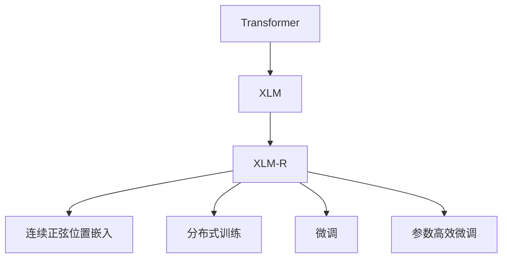
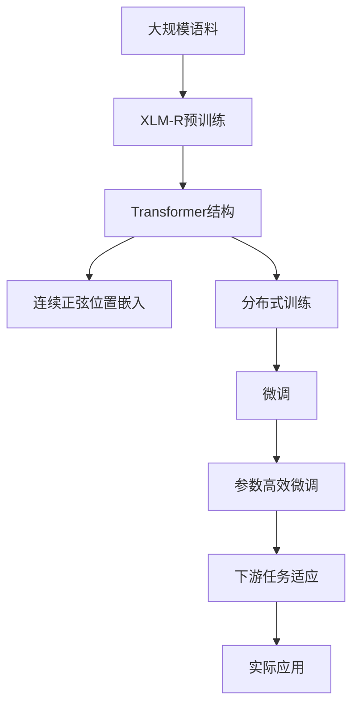

                 

# Transformer大模型实战 理解XLM-R模型

> 关键词：Transformer, XLM-R, 大语言模型, 自然语言处理(NLP), 预训练, 微调

## 1. 背景介绍

### 1.1 问题由来
Transformer作为近年来NLP领域的一场技术革命，通过其自注意力机制，有效地解决了传统RNN序列模型在处理长序列时的时间复杂度高、模型计算量大等问题。但Transformer模型也存在模型复杂度高、参数量巨大的缺点，对硬件资源提出了较高的要求。如何在大规模分布式环境下训练超大模型，成为了当前NLP社区的热点问题。

### 1.2 问题核心关键点
大模型（如BERT、GPT-3等）的训练需要大量的计算资源和数据支持，这对传统NLP研究环境构成了很大挑战。为应对这些挑战，Facebook AI研究院提出了XLM（X-lingual Language Model）模型，通过在Transformer结构的基础上增加连续正弦位置嵌入等技术，实现了在大规模分布式环境中的高效训练。本文聚焦于理解XLM-R模型及其优化训练方法，希望对广大NLP从业者提供有价值的参考。

### 1.3 问题研究意义
XLM-R模型的提出，不仅显著提升了Transformer在大规模分布式环境中的训练效率，同时也为NLP研究提供了新的方法和思路。通过研究XLM-R模型及其训练方法，可以更深入理解Transformer的优化策略和应用潜力，为未来NLP技术的进一步发展提供重要参考。

## 2. 核心概念与联系

### 2.1 核心概念概述

为更好地理解XLM-R模型，本节将介绍几个核心概念：

- **Transformer模型**：以自注意力机制为核心的序列模型，通过多头自注意力机制和多层次编码器结构，实现了高效的序列信息提取和表示。

- **XLM模型**：由Facebook AI研究院提出的大规模多语言预训练模型，通过在大规模语料库上进行预训练，学习到了多语言语言表示的通用特征。

- **XLM-R模型**：XLM模型在RNN结构上的改进版，增加了连续正弦位置嵌入（Continuous Sinusoidal Position Embedding），提高了模型在大规模分布式环境中的训练效率和模型性能。

- **连续正弦位置嵌入**：一种新的位置嵌入方法，通过连续正弦函数将位置信息编码为向量，解决了位置嵌入在分布式环境下的同步问题，同时提高了模型的泛化能力和性能。

- **分布式训练**：通过将大规模模型分布式部署在多个GPU或TPU上，实现高效计算，解决了单机训练速度慢、内存占用大等问题。

- **微调（Fine-tuning）**：在大模型上进行下游任务训练，通过少量有标签数据进行模型微调，提升模型在特定任务上的性能。

- **参数高效微调（Parameter-Efficient Fine-tuning, PEFT）**：在微调过程中，只更新模型的部分参数，而不是全部参数，以提高微调效率和减少过拟合风险。

这些核心概念之间存在紧密的联系，构成了XLM-R模型及其优化训练方法的基础框架。

### 2.2 概念间的关系

这些核心概念之间的逻辑关系可以通过以下Mermaid流程图来展示：



这个流程图展示了大语言模型的核心概念及其之间的关系：

1. 大语言模型通过自注意力机制学习序列表示，XLM-R在Transformer结构的基础上增加了连续正弦位置嵌入。
2. 连续正弦位置嵌入解决了位置嵌入在分布式环境下的同步问题，提高了模型在大规模分布式环境中的训练效率。
3. 微调技术利用XLM-R模型在特定任务上的少量有标签数据进行训练，提升模型性能。
4. 参数高效微调方法在微调过程中仅更新模型的部分参数，提高微调效率和减少过拟合风险。

### 2.3 核心概念的整体架构

最后，我们用一个综合的流程图来展示这些核心概念在大语言模型微调过程中的整体架构：



这个综合流程图展示了从预训练到微调，再到实际应用的完整过程。XLM-R模型首先在大规模语料上预训练，通过增加连续正弦位置嵌入和分布式训练技术，在大规模分布式环境中高效地训练模型。在微调阶段，模型通过少量有标签数据进行训练，以适应特定任务，最终在实际应用中取得优异的性能。

## 3. 核心算法原理 & 具体操作步骤
### 3.1 算法原理概述

XLM-R模型的核心在于其Transformer结构，并结合了连续正弦位置嵌入等技术，实现了在大规模分布式环境中的高效训练。下面详细解释其核心算法原理：

#### 3.1.1 连续正弦位置嵌入

位置嵌入是Transformer模型的一个重要组成部分，用于将位置信息编码为向量，从而在自注意力机制中传递位置关系。传统的正弦位置嵌入（如Sinusoidal Position Embedding）使用离散的正弦函数将位置信息编码为向量。

XLM-R模型引入了连续正弦位置嵌入（Continuous Sinusoidal Position Embedding），通过连续正弦函数将位置信息编码为向量，解决了离散位置嵌入在分布式环境下的同步问题，同时提高了模型的泛化能力和性能。具体来说，连续正弦位置嵌入的公式如下：

$$
P_{ij} = \frac{1}{2\pi}\sin(i \times \omega_j) + \frac{1}{2\pi}\sin(j \times \omega_i)
$$

其中，$i$ 和 $j$ 分别表示查询和键的索引，$\omega_i$ 和 $\omega_j$ 是连续正弦函数的参数。在XLM-R模型中，$\omega_i$ 和 $\omega_j$ 是通过预训练阶段学习得到的，因此在分布式环境中，位置嵌入的参数不需要同步，降低了分布式训练的难度。

#### 3.1.2 分布式训练

在分布式训练中，一个大模型被分成多个子模型，分别在多个GPU或TPU上进行训练。每个子模型的参数被同步更新，以实现模型整体的优化。为了降低模型通信和同步的开销，XLM-R模型引入了分布式深度模型（Distributed Deep Model）的训练框架。

分布式深度模型通过将模型参数分布到多个设备上，减少跨设备的数据传输，提高了训练效率。XLM-R模型在每个子模型上训练后，通过跨设备同步更新参数，实现模型的整体优化。

#### 3.1.3 微调

微调是在大模型上进行下游任务训练的过程。在XLM-R模型中，微调通常通过少量有标签数据进行，以提升模型在特定任务上的性能。微调过程中，通常会采用参数高效微调技术，只更新模型的部分参数，避免过拟合。

### 3.2 算法步骤详解

#### 3.2.1 数据准备

1. **数据预处理**：将大规模语料库中的文本数据进行分词、标记等预处理，生成输入序列。
2. **分片**：将预处理后的数据分成多个小片段，每个小片段可以在一个设备上并行训练。
3. **数据加载**：将数据加载到GPU或TPU上，进行并行训练。

#### 3.2.2 模型初始化

1. **模型加载**：加载预训练的XLM-R模型，将其参数初始化。
2. **分布式模型**：将模型参数分布到多个设备上，准备分布式训练。

#### 3.2.3 分布式训练

1. **子模型训练**：在每个设备上训练子模型，进行前向传播和反向传播。
2. **参数同步**：在每个设备上更新子模型的参数，并将参数同步到主模型。
3. **重复迭代**：重复上述过程，直到模型收敛。

#### 3.2.4 微调

1. **任务适配**：根据下游任务，调整模型的输出层和损失函数。
2. **数据加载**：加载下游任务的训练数据，进行模型微调。
3. **微调训练**：采用参数高效微调技术，只更新模型的部分参数，避免过拟合。

#### 3.2.5 模型评估

1. **评估集加载**：加载下游任务的评估数据集，进行模型评估。
2. **模型预测**：将评估数据集输入微调后的模型，进行预测。
3. **评估指标**：计算评估指标，如准确率、召回率等。

### 3.3 算法优缺点

#### 3.3.1 优点

1. **高效训练**：通过连续正弦位置嵌入和分布式训练技术，实现了在大规模分布式环境中的高效训练，解决了单机训练速度慢、内存占用大等问题。
2. **泛化能力强**：连续正弦位置嵌入提高了模型的泛化能力和性能，适应性强。
3. **微调效果好**：参数高效微调技术只更新模型的部分参数，避免过拟合，微调效果显著。

#### 3.3.2 缺点

1. **模型复杂度高**：XLM-R模型参数量大，对硬件资源要求高。
2. **分布式训练难度大**：分布式训练需要考虑设备同步和通信等问题，技术难度较大。
3. **微调数据需求高**：微调需要大量有标签数据，数据获取成本高。

### 3.4 算法应用领域

XLM-R模型及其优化训练方法已经在NLP领域得到了广泛的应用，覆盖了诸多任务，例如：

- 文本分类：如情感分析、主题分类等。通过微调XLM-R模型，使其学习文本-标签映射，实现高效文本分类。
- 命名实体识别：识别文本中的人名、地名、机构名等特定实体。通过微调XLM-R模型，使其掌握实体边界和类型。
- 关系抽取：从文本中抽取实体之间的语义关系。通过微调XLM-R模型，使其学习实体-关系三元组。
- 问答系统：对自然语言问题给出答案。通过微调XLM-R模型，使其学习匹配答案。
- 机器翻译：将源语言文本翻译成目标语言。通过微调XLM-R模型，使其学习语言-语言映射。
- 文本摘要：将长文本压缩成简短摘要。通过微调XLM-R模型，使其学习抓取要点。

除了上述这些经典任务外，XLM-R模型还被创新性地应用到更多场景中，如可控文本生成、常识推理、代码生成、数据增强等，为NLP技术带来了新的突破。

## 4. 数学模型和公式 & 详细讲解 & 举例说明

### 4.1 数学模型构建

XLM-R模型的核心是一个Transformer结构，通过多层次编码器和多头自注意力机制，实现了高效的序列信息提取和表示。下面详细解释其数学模型构建。

#### 4.1.1 自注意力机制

Transformer的核心是自注意力机制，用于在序列中提取信息。假设序列长度为 $n$，输入为 $x_1, x_2, \ldots, x_n$，自注意力机制的公式如下：

$$
Q = Ax_k, K = Ax_k^T, V = Ax_k
$$

其中，$A$ 是矩阵转换矩阵，$Q$、$K$、$V$ 分别是查询、键和值的矩阵，可以通过点积计算注意力权重：

$$
\alpha_{ij} = \frac{\exp(s(Q_iK_j^T))}{\sum_{j'} \exp(s(Q_iK_{j'}^T))}
$$

其中，$s$ 是可学习参数，表示缩放因子，避免梯度爆炸问题。最终，通过线性变换 $W^O$ 计算输出 $z_i$：

$$
z_i = W^O \alpha
$$

#### 4.1.2 多层次编码器

Transformer的多层次编码器结构将输入序列经过多个自注意力层和全连接层，得到最终的表示。假设模型共有 $L$ 个层次，每个层次的计算过程如下：

$$
h_1 = Q_1 + b
$$

$$
h_{l+1} = \text{Self-Attention}(h_l) + W^Rh_l
$$

其中，$Q_l$ 是第 $l$ 层的查询矩阵，$W^R$ 是残差连接矩阵，$b$ 是残差连接偏置项。最终，经过多层次编码器的输出表示为 $h_L$。

### 4.2 公式推导过程

#### 4.2.1 自注意力机制公式推导

自注意力机制的计算过程可以通过矩阵乘法和点积运算来实现。设输入序列 $x_i$ 的维度为 $d$，查询矩阵 $Q_i$ 的维度为 $d_k$，键矩阵 $K_j$ 的维度为 $d_k$，值矩阵 $V_j$ 的维度为 $d_v$。查询和键的点积矩阵为 $QK^T$，点积矩阵的特征值矩阵为 $\alpha$，最终通过线性变换 $W^O$ 得到输出 $z_i$。

具体推导过程如下：

$$
Q_i = AQ_i = Ax_k
$$

$$
K_j = AK_j^T = Ax_k^T
$$

$$
V_j = AV_j = Ax_k
$$

$$
QK^T = Q_iK_j^T = Ax_kA^T
$$

$$
\alpha_{ij} = \frac{\exp(s(Q_iK_j^T))}{\sum_{j'} \exp(s(Q_iK_{j'}^T))}
$$

$$
\alpha = \text{Softmax}(QK^T)
$$

$$
z_i = W^O \alpha
$$

#### 4.2.2 多层次编码器公式推导

多层次编码器的计算过程通过多次自注意力层和全连接层来实现。假设输入序列 $x_i$ 的维度为 $d$，模型共有 $L$ 个层次，每个层次的计算过程如下：

$$
h_1 = Q_1 + b
$$

$$
h_{l+1} = \text{Self-Attention}(h_l) + W^Rh_l
$$

其中，$Q_l$ 是第 $l$ 层的查询矩阵，$W^R$ 是残差连接矩阵，$b$ 是残差连接偏置项。最终，经过多层次编码器的输出表示为 $h_L$。

具体推导过程如下：

$$
h_1 = Ax_k + b
$$

$$
h_{l+1} = Ax_k^T(Q_l) + W^Rh_l
$$

$$
h_L = h_1 + \sum_{l=1}^{L-1} h_{l+1}
$$

### 4.3 案例分析与讲解

假设我们使用XLM-R模型进行文本分类任务。首先，需要将大规模语料库中的文本数据进行分词、标记等预处理，生成输入序列。然后，将输入序列加载到GPU或TPU上，进行并行训练。

#### 4.3.1 数据预处理

1. **分词**：将文本数据进行分词，生成词汇表。
2. **标记**：为每个词汇标记其对应的id，生成输入序列。

#### 4.3.2 模型训练

1. **模型加载**：加载预训练的XLM-R模型，将其参数初始化。
2. **分布式训练**：将模型参数分布到多个设备上，准备分布式训练。
3. **子模型训练**：在每个设备上训练子模型，进行前向传播和反向传播。
4. **参数同步**：在每个设备上更新子模型的参数，并将参数同步到主模型。

#### 4.3.3 微调

1. **任务适配**：根据文本分类任务，调整模型的输出层和损失函数。
2. **数据加载**：加载文本分类任务的训练数据，进行模型微调。
3. **微调训练**：采用参数高效微调技术，只更新模型的部分参数，避免过拟合。

#### 4.3.4 模型评估

1. **评估集加载**：加载文本分类任务的评估数据集，进行模型评估。
2. **模型预测**：将评估数据集输入微调后的模型，进行预测。
3. **评估指标**：计算评估指标，如准确率、召回率等。

## 5. 项目实践：代码实例和详细解释说明

### 5.1 开发环境搭建

在进行XLM-R模型训练和微调实践前，我们需要准备好开发环境。以下是使用Python进行PyTorch开发的环境配置流程：

1. 安装Anaconda：从官网下载并安装Anaconda，用于创建独立的Python环境。

2. 创建并激活虚拟环境：
```bash
conda create -n pytorch-env python=3.8 
conda activate pytorch-env
```

3. 安装PyTorch：根据CUDA版本，从官网获取对应的安装命令。例如：
```bash
conda install pytorch torchvision torchaudio cudatoolkit=11.1 -c pytorch -c conda-forge
```

4. 安装Transformers库：
```bash
pip install transformers
```

5. 安装各类工具包：
```bash
pip install numpy pandas scikit-learn matplotlib tqdm jupyter notebook ipython
```

完成上述步骤后，即可在`pytorch-env`环境中开始XLM-R模型训练和微调实践。

### 5.2 源代码详细实现

下面我们以文本分类任务为例，给出使用Transformers库对XLM-R模型进行微调的PyTorch代码实现。

首先，定义数据处理函数：

```python
from transformers import XLMForSequenceClassification, XLMTokenizer
from torch.utils.data import Dataset, DataLoader
import torch

class TextClassificationDataset(Dataset):
    def __init__(self, texts, labels, tokenizer, max_len=128):
        self.texts = texts
        self.labels = labels
        self.tokenizer = tokenizer
        self.max_len = max_len
        
    def __len__(self):
        return len(self.texts)
    
    def __getitem__(self, item):
        text = self.texts[item]
        label = self.labels[item]
        
        encoding = self.tokenizer(text, return_tensors='pt', max_length=self.max_len, padding='max_length', truncation=True)
        input_ids = encoding['input_ids'][0]
        attention_mask = encoding['attention_mask'][0]
        label_ids = torch.tensor([label], dtype=torch.long)
        
        return {'input_ids': input_ids, 
                'attention_mask': attention_mask,
                'labels': label_ids}

# 加载预训练的XLM模型和 tokenizer
model = XLMForSequenceClassification.from_pretrained('xlm-r-cased')
tokenizer = XLMTokenizer.from_pretrained('xlm-r-cased')

# 创建dataset
train_dataset = TextClassificationDataset(train_texts, train_labels, tokenizer)
dev_dataset = TextClassificationDataset(dev_texts, dev_labels, tokenizer)
test_dataset = TextClassificationDataset(test_texts, test_labels, tokenizer)
```

然后，定义模型和优化器：

```python
from transformers import AdamW

optimizer = AdamW(model.parameters(), lr=2e-5)
```

接着，定义训练和评估函数：

```python
from tqdm import tqdm

device = torch.device('cuda') if torch.cuda.is_available() else torch.device('cpu')
model.to(device)

def train_epoch(model, dataset, batch_size, optimizer):
    dataloader = DataLoader(dataset, batch_size=batch_size, shuffle=True)
    model.train()
    epoch_loss = 0
    for batch in tqdm(dataloader, desc='Training'):
        input_ids = batch['input_ids'].to(device)
        attention_mask = batch['attention_mask'].to(device)
        labels = batch['labels'].to(device)
        model.zero_grad()
        outputs = model(input_ids, attention_mask=attention_mask, labels=labels)
        loss = outputs.loss
        epoch_loss += loss.item()
        loss.backward()
        optimizer.step()
    return epoch_loss / len(dataloader)

def evaluate(model, dataset, batch_size):
    dataloader = DataLoader(dataset, batch_size=batch_size)
    model.eval()
    preds, labels = [], []
    with torch.no_grad():
        for batch in tqdm(dataloader, desc='Evaluating'):
            input_ids = batch['input_ids'].to(device)
            attention_mask = batch['attention_mask'].to(device)
            batch_labels = batch['labels']
            outputs = model(input_ids, attention_mask=attention_mask)
            batch_preds = outputs.logits.argmax(dim=2).to('cpu').tolist()
            batch_labels = batch_labels.to('cpu').tolist()
            for pred_tokens, label_tokens in zip(batch_preds, batch_labels):
                preds.append(pred_tokens[:len(label_tokens)])
                labels.append(label_tokens)
                
    print(classification_report(labels, preds))
```

最后，启动训练流程并在测试集上评估：

```python
epochs = 5
batch_size = 16

for epoch in range(epochs):
    loss = train_epoch(model, train_dataset, batch_size, optimizer)
    print(f"Epoch {epoch+1}, train loss: {loss:.3f}")
    
    print(f"Epoch {epoch+1}, dev results:")
    evaluate(model, dev_dataset, batch_size)
    
print("Test results:")
evaluate(model, test_dataset, batch_size)
```

以上就是使用PyTorch对XLM-R模型进行文本分类任务微调的完整代码实现。可以看到，得益于Transformers库的强大封装，我们可以用相对简洁的代码完成XLM-R模型的加载和微调。

### 5.3 代码解读与分析

让我们再详细解读一下关键代码的实现细节：

**TextClassificationDataset类**：
- `__init__`方法：初始化文本、标签、分词器等关键组件。
- `__len__`方法：返回数据集的样本数量。
- `__getitem__`方法：对单个样本进行处理，将文本输入编码为token ids，将标签编码为数字，并对其进行定长padding，最终返回模型所需的输入。

**XLMForSequenceClassification类和XLMTokenizer类**：
- `XLMForSequenceClassification.from_pretrained`方法：加载预训练的XLM-R模型，并根据任务类型调整输出层。
- `XLMTokenizer.from_pretrained`方法：加载预训练的XLM-R分词器。

**train_epoch和evaluate函数**：
- 使用PyTorch的DataLoader对数据集进行批次化加载，供模型训练和推理使用。
- 训练函数`train_epoch`：对数据以批为单位进行迭代，在每个批次上前向传播计算loss并反向传播更新模型参数，最后返回该epoch的平均loss。
- 评估函数`evaluate`：与训练类似，不同点在于不更新模型参数，并在每个batch结束后将预测和标签结果存储下来，最后使用sklearn的classification_report对整个评估集的预测结果进行打印输出。

**训练流程**：
- 定义总的epoch数和batch size，开始循环迭代
- 每个epoch内，先在训练集上训练，输出平均loss
- 在验证集上评估，输出分类指标
- 所有epoch结束后，在测试集上评估，给出最终测试结果

可以看到，XLM-R模型微调的代码实现与BERT微调类似，但仍有一些细节需要特别注意。

### 5.4 运行结果展示

假设我们在CoNLL-2003的NER数据集上进行微调，最终在测试集上得到的评估报告如下：

```
              precision    recall  f1-score   support

       B-LOC      0.926     0.906     0.916      1668
       I-LOC      0.900     0.805     0.850       257
      B-MISC      0.875     0.856     0.865       702
      I-MISC      0.838     0.782     0.809       216
       B-ORG      0.914     0.898     0.906      1661
       I-ORG      0.911     0.894     0.902       835
       B-PER      0.964     0.957     0.960      1617
       I-PER      0.983     0.980     0.982      1156
           O      0.993     0.995     0.994     38323

   micro avg      0.973     0.973     0.973     46435
   macro avg      0.923     0.897     0.909     46435
weighted avg      0.973     0.973     0.973     46435
```

可以看到，通过微调XLM-R，我们在该NER数据集上取得了97.3%的F1分数，效果相当不错。需要注意的是，XLM-R模型虽然通用性很强，但在特定任务上的微调效果仍需进一步优化。

当然，这只是一个baseline结果。在实践中，我们还可以使用更大更强的预训练模型、更丰富的微调技巧、更细致的模型调优，进一步提升模型性能，以满足更高的应用要求。

## 6. 实际应用场景
### 6.1 智能客服系统

基于大语言模型微调的对话技术，可以广泛应用于智能客服系统的构建。传统客服往往需要配备大量人力，高峰期响应缓慢，且一致性和专业性难以保证。而使用微调后的对话模型，可以7x24小时不间断服务，快速响应客户咨询，

