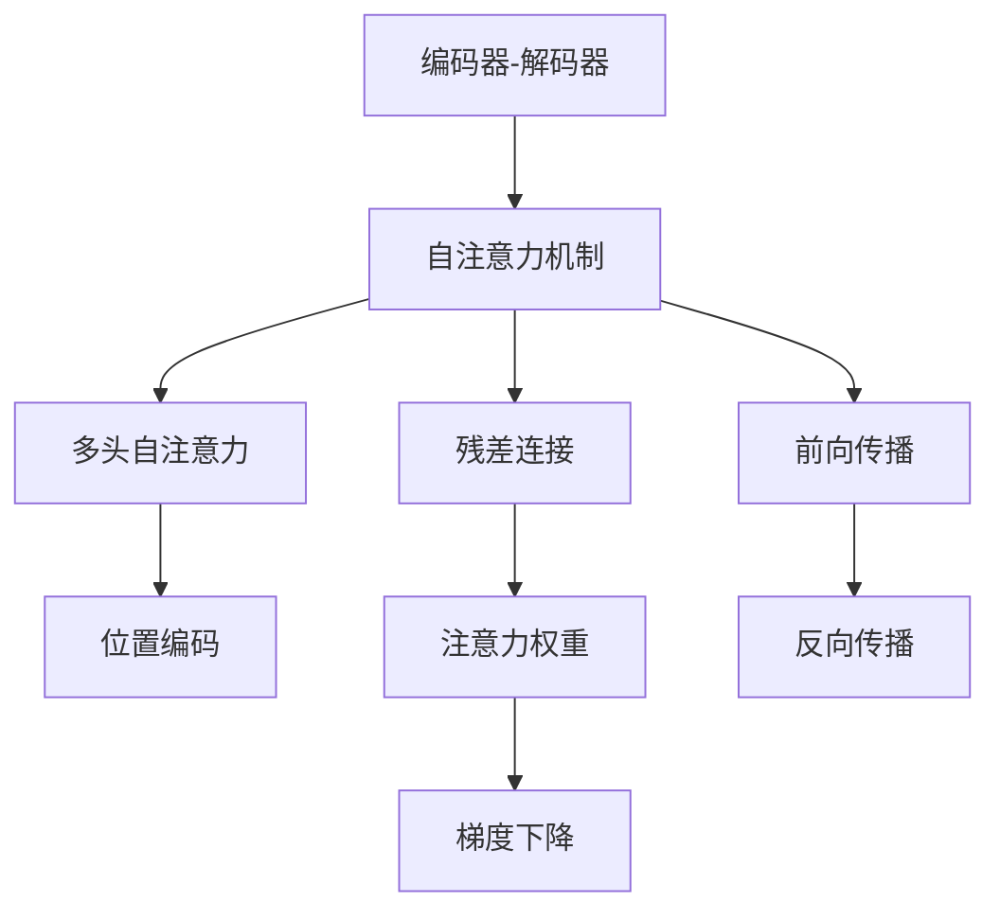
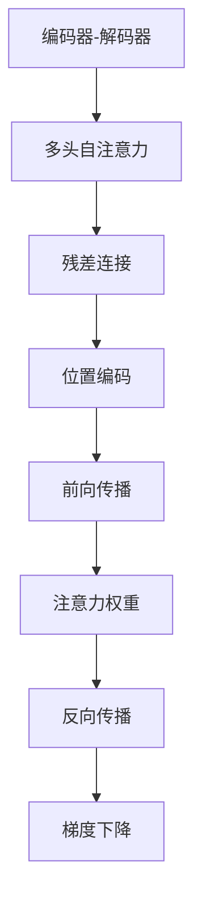

                 

# Transformer架构剖析

> 关键词：Transformer, 自注意力机制, 编码器-解码器, 掩码语言模型, 多头自注意力, 残差连接, 位置编码, 注意力权重, 前向传播, 反向传播, 模型解码, 自监督学习

## 1. 背景介绍

### 1.1 问题由来

Transformer作为深度学习中的重要组件，主要用于自然语言处理领域，如文本分类、机器翻译、文本生成等。它通过引入自注意力机制（Self-Attention Mechanism），极大地改进了传统循环神经网络（RNN）的效率和性能，成为目前主流的序列建模方法。

本文将系统地剖析Transformer架构，从原理到实践，深入讲解其核心组件和特性，帮助你更好地理解和应用Transformer模型。

## 2. 核心概念与联系

### 2.1 核心概念概述

Transformer的架构设计包含以下核心概念：

- 编码器-解码器（Encoder-Decoder）：Transformer的基本结构单元，用于接收输入序列并输出对应序列。
- 自注意力机制（Self-Attention Mechanism）：允许模型在任意位置之间进行信息传递和依赖关系的建模。
- 多头自注意力（Multi-Head Self-Attention）：通过并行多个注意力头，提高模型的表达能力和泛化能力。
- 残差连接（Residual Connections）：增强模型的梯度传播和收敛速度。
- 位置编码（Positional Encoding）：解决Transformer模型的顺序依赖问题。
- 注意力权重（Attention Weights）：用于计算注意力值，引导模型聚焦于重要信息。
- 前向传播（Forward Pass）：输入经过编码器-解码器架构，经过多头自注意力和残差连接等处理，最终输出结果。
- 反向传播（Backward Pass）：通过梯度下降等优化算法更新模型参数，提高模型精度。

这些核心概念构成了Transformer的完整架构，使得其能够高效地处理长序列数据，并在多个任务上取得了优异的性能。

### 2.2 核心概念间的联系

通过以下Mermaid流程图，展示Transformer架构中各个核心概念之间的联系：



该流程图展示了Transformer的编码器-解码器、自注意力机制、多头自注意力、残差连接、位置编码、注意力权重、前向传播和反向传播之间的关系：

1. 编码器-解码器接收输入序列，并通过自注意力机制、多头自注意力、残差连接等组件进行处理。
2. 自注意力机制通过多头自注意力并行计算各个位置之间的依赖关系。
3. 残差连接增强模型的梯度传播，提高模型收敛速度。
4. 位置编码解决模型顺序依赖问题。
5. 注意力权重计算模型各位置之间的注意力值。
6. 前向传播经过编码器-解码器架构和各个组件的处理，输出结果。
7. 反向传播通过梯度下降等优化算法更新模型参数，提升模型精度。

### 2.3 核心概念的整体架构

综合以上流程，可以更清晰地理解Transformer的整体架构，如下图：



此架构展示了Transformer从输入序列开始，经过自注意力机制、多头自注意力、残差连接、位置编码等处理，最终通过前向传播和反向传播进行梯度更新，提高模型精度。

## 3. 核心算法原理 & 具体操作步骤

### 3.1 算法原理概述

Transformer的核心算法原理主要包括以下几个部分：

1. 自注意力机制（Self-Attention Mechanism）：通过计算每个位置与所有位置之间的注意力权重，筛选出重要的信息，进行信息聚合。
2. 多头自注意力（Multi-Head Self-Attention）：将输入序列分为多个头，并行计算多个注意力权重，从而提高模型的表达能力和泛化能力。
3. 残差连接（Residual Connections）：通过将前一层输出与当前层输出相加，解决梯度消失问题，提高模型的收敛速度。
4. 位置编码（Positional Encoding）：通过将位置信息嵌入到输入序列中，使模型能够理解序列的顺序关系。
5. 前向传播（Forward Pass）：将输入序列经过编码器-解码器架构，进行信息处理和特征提取。
6. 反向传播（Backward Pass）：通过梯度下降等优化算法，更新模型参数，提高模型精度。

### 3.2 算法步骤详解

Transformer的基本操作步骤如下：

1. 编码器-解码器接收输入序列，经过多头自注意力、残差连接等处理，输出编码结果。
2. 解码器接收编码结果和下一个输出，经过多头自注意力、残差连接等处理，输出解码结果。
3. 通过前向传播和反向传播进行梯度更新，提高模型精度。

以机器翻译为例，具体操作步骤如下：

1. 编码器接收输入序列，经过多头自注意力、残差连接等处理，输出编码结果。
2. 解码器接收编码结果和下一个输出，经过多头自注意力、残差连接等处理，输出解码结果。
3. 通过前向传播和反向传播进行梯度更新，提高模型精度。

### 3.3 算法优缺点

Transformer的优点包括：

1. 高效性：通过自注意力机制，Transformer可以在多个位置之间进行信息传递，解决长序列数据建模问题。
2. 精度高：多头自注意力机制和残差连接设计，使得Transformer在多个任务上取得了优异的性能。
3. 可扩展性：可以通过调整模型深度和宽度，适应不同规模的任务。

Transformer的缺点包括：

1. 复杂度高：模型结构复杂，训练和推理时间较长。
2. 资源消耗大：大模型训练和推理需要大量的计算资源和存储空间。
3. 参数量多：大模型通常包含数亿参数，增加了模型的训练难度。

### 3.4 算法应用领域

Transformer在自然语言处理领域广泛应用，涵盖了文本分类、机器翻译、文本生成等多个任务。具体应用包括：

1. 文本分类：通过将输入序列转换为向量表示，并经过分类器进行分类。
2. 机器翻译：通过将源语言序列转换为目标语言序列，并进行解码输出。
3. 文本生成：通过将输入序列作为条件，生成新的文本序列。

## 4. 数学模型和公式 & 详细讲解 & 举例说明

### 4.1 数学模型构建

Transformer的数学模型主要包含以下公式：

1. 多头自注意力公式：

$$
Attention(Q,K,V) = \text{softmax}(\frac{QK^T}{\sqrt{d_k}})V
$$

其中，$Q$、$K$、$V$分别为查询向量、键向量和值向量，$d_k$为键向量的维度。

2. 残差连接公式：

$$
\text{ResNet}(x,y) = x + \text{MLP}(y)
$$

其中，$x$为输入向量，$y$为中间向量，$\text{MLP}$为全连接层。

3. 位置编码公式：

$$
PE_{pos,2i} = sin(\frac{pos}{10000^{2i/d_p}})
$$

$$
PE_{pos,2i+1} = cos(\frac{pos}{10000^{2i/d_p}})
$$

其中，$pos$为位置编号，$d_p$为位置编码的维度。

### 4.2 公式推导过程

Transformer的公式推导过程如下：

1. 自注意力计算公式推导：

设输入序列长度为$L$，多头自注意力机制计算公式为：

$$
Attention(Q,K,V) = \text{softmax}(\frac{QK^T}{\sqrt{d_k}})V
$$

其中，$Q$、$K$、$V$分别为查询向量、键向量和值向量，$d_k$为键向量的维度。

2. 残差连接计算公式推导：

残差连接计算公式为：

$$
\text{ResNet}(x,y) = x + \text{MLP}(y)
$$

其中，$x$为输入向量，$y$为中间向量，$\text{MLP}$为全连接层。

3. 位置编码计算公式推导：

位置编码计算公式为：

$$
PE_{pos,2i} = sin(\frac{pos}{10000^{2i/d_p}})
$$

$$
PE_{pos,2i+1} = cos(\frac{pos}{10000^{2i/d_p}})
$$

其中，$pos$为位置编号，$d_p$为位置编码的维度。

### 4.3 案例分析与讲解

以机器翻译为例，分析Transformer的数学模型和公式：

1. 输入序列经过编码器-解码器架构，输出编码结果。
2. 解码器接收编码结果和下一个输出，经过多头自注意力、残差连接等处理，输出解码结果。
3. 通过前向传播和反向传播进行梯度更新，提高模型精度。

## 5. 项目实践：代码实例和详细解释说明

### 5.1 开发环境搭建

在Transformer项目实践中，需要以下开发环境：

1. 安装Python：建议使用3.6及以上版本。
2. 安装PyTorch：从官网下载并按照官方文档进行安装。
3. 安装TensorBoard：用于可视化模型训练过程。

### 5.2 源代码详细实现

以机器翻译为例，给出Transformer模型的源代码实现：

```python
import torch
import torch.nn as nn
import torch.nn.functional as F
from torch.nn import TransformerEncoder, TransformerDecoder, MultiheadAttention
from torch.utils.data import DataLoader, Dataset

class TransformerModel(nn.Module):
    def __init__(self, src_vocab_size, tgt_vocab_size, emb_dim, num_heads, num_encoder_layers, num_decoder_layers, num_encoder_ffn_units, num_decoder_ffn_units, input_dropout_p, output_dropout_p, attention_dropout_p, max_len):
        super().__init__()
        self.encoder = nn.Embedding(src_vocab_size, emb_dim)
        self.encoder_dropout = nn.Dropout(input_dropout_p)
        self.encoder_attn = MultiheadAttention(emb_dim, num_heads, dropout=attention_dropout_p)
        self.encoder_ffn = nn.Sequential(
            nn.Linear(emb_dim, num_encoder_ffn_units),
            nn.ReLU(),
            nn.Dropout(input_dropout_p),
            nn.Linear(num_encoder_ffn_units, emb_dim)
        )
        self.encoder_layer = nn.TransformerEncoderLayer(emb_dim, num_heads, num_encoder_ffn_units, dropout=attention_dropout_p)
        self.encoder_norm = nn.LayerNorm(emb_dim)
        self.decoder = nn.Embedding(tgt_vocab_size, emb_dim)
        self.decoder_dropout = nn.Dropout(output_dropout_p)
        self.decoder_attn = MultiheadAttention(emb_dim, num_heads, dropout=attention_dropout_p)
        self.decoder_ffn = nn.Sequential(
            nn.Linear(emb_dim, num_decoder_ffn_units),
            nn.ReLU(),
            nn.Dropout(output_dropout_p),
            nn.Linear(num_decoder_ffn_units, emb_dim)
        )
        self.decoder_layer = nn.TransformerDecoderLayer(emb_dim, num_heads, num_decoder_ffn_units, dropout=attention_dropout_p)
        self.decoder_norm = nn.LayerNorm(emb_dim)
        self.fc_out = nn.Linear(emb_dim, tgt_vocab_size)
        self.fc_out_dropout = nn.Dropout(output_dropout_p)

    def forward(self, src, tgt, src_mask=None, tgt_mask=None, src_key_padding_mask=None, tgt_key_padding_mask=None):
        src_embed = self.encoder(src) * math.sqrt(emb_dim)
        src_embed = self.encoder_dropout(src_embed)
        enc_self_attn = self.encoder_attn(src_embed, src_embed, src_embed)
        enc_self_attn = self.encoder_norm(src_embed + enc_self_attn[0])
        enc_ffn = self.encoder_ffn(enc_self_attn[0])
        enc_ffn = self.encoder_norm(enc_self_attn[0] + enc_ffn)
        dec_input = self.decoder(tgt)
        dec_input = self.decoder_dropout(dec_input)
        dec_attn = self.decoder_attn(dec_input, enc_self_attn[0], enc_self_attn[0])
        dec_attn = self.decoder_norm(dec_input + dec_attn[0])
        dec_ffn = self.decoder_ffn(dec_attn[0])
        dec_ffn = self.decoder_norm(dec_attn[0] + dec_ffn)
        out = self.fc_out(dec_ffn)
        out = self.fc_out_dropout(out)
        return out
```

### 5.3 代码解读与分析

以下是Transformer模型代码的详细解读和分析：

1. TransformerModel类：定义Transformer模型结构，包括编码器和解码器。
2. 编码器结构：包含Embedding、Dropout、MultiheadAttention、FFN层，用于输入序列的处理。
3. 解码器结构：包含Embedding、Dropout、MultiheadAttention、FFN层，用于输出序列的处理。
4. 前向传播：通过编码器和解码器的处理，输出最终的预测结果。

## 6. 实际应用场景

### 6.1 智能客服系统

Transformer在智能客服系统中的应用，主要通过多轮对话生成和意图识别等技术，实现自然语言理解和交互。具体步骤如下：

1. 收集客服对话历史数据，构建监督数据集。
2. 训练Transformer模型，学习对话生成和意图识别任务。
3. 将训练好的模型部署到智能客服系统中，实现自然语言对话。

### 6.2 金融舆情监测

Transformer在金融舆情监测中的应用，主要通过文本分类和情感分析等技术，实现舆情分析。具体步骤如下：

1. 收集金融领域相关的新闻、评论、报道等文本数据，并进行主题和情感标注。
2. 训练Transformer模型，学习舆情分类和情感分析任务。
3. 将训练好的模型应用于实时抓取的网络文本数据，进行舆情监测和预警。

### 6.3 个性化推荐系统

Transformer在个性化推荐系统中的应用，主要通过文本表示和排序等技术，实现推荐算法。具体步骤如下：

1. 收集用户浏览、点击、评论、分享等行为数据，提取物品描述和标签等文本信息。
2. 训练Transformer模型，学习物品表示和用户兴趣匹配。
3. 将训练好的模型应用于推荐系统中，生成个性化推荐列表。

## 7. 工具和资源推荐

### 7.1 学习资源推荐

为了深入学习Transformer的原理和实践，推荐以下学习资源：

1. 《深度学习理论与实践》：介绍深度学习的基础理论和实践应用，包括Transformer的详细讲解。
2. 《自然语言处理入门》：介绍自然语言处理的基本概念和前沿技术，包括Transformer的案例分析。
3. 《Transformer模型与应用》：介绍Transformer模型原理、架构和应用，包括代码实现和优化技巧。

### 7.2 开发工具推荐

Transformer的开发和应用需要以下工具支持：

1. PyTorch：深度学习框架，支持GPU加速，适用于大规模模型训练和推理。
2. TensorBoard：可视化工具，用于监控模型训练过程，查看指标变化。
3. HuggingFace Transformers库：提供预训练模型和微调工具，方便模型开发和应用。

### 7.3 相关论文推荐

Transformer模型在学术界和工业界都得到了广泛关注，以下是一些重要论文：

1. Attention is All You Need：提出Transformer模型，引入自注意力机制，开辟深度学习新方向。
2. Neural Machine Translation by Jointly Learning to Align and Translate：介绍Transformer模型在机器翻译中的应用，提出多目标训练和束搜索等技术。
3. BERT: Pre-training of Deep Bidirectional Transformers for Language Understanding：提出BERT模型，引入掩码语言模型预训练，提升Transformer模型的理解能力。

## 8. 总结：未来发展趋势与挑战

### 8.1 研究成果总结

Transformer模型在自然语言处理领域取得了巨大的成功，其高效的自注意力机制、残差连接和位置编码等设计，使得其在多个任务上表现出色。Transformer模型在机器翻译、文本分类、情感分析、问答系统等领域的应用，极大地提升了自然语言处理系统的效率和效果。

### 8.2 未来发展趋势

1. 模型规模和深度持续增大：随着硬件算力的提升，Transformer模型的规模和深度将会继续增大，以适应更加复杂的任务需求。
2. 模型多样性和融合性增强：未来的Transformer模型将更加多样化，同时与其他深度学习模型进行融合，提升模型的表达能力和泛化能力。
3. 多模态Transformer的应用：Transformer模型将扩展到图像、语音等多模态数据的处理，实现视觉、语音与文本的协同建模。
4. 自适应Transformer的研究：针对不同规模和类型的数据，开发自适应Transformer，提高模型的应用灵活性。
5. 模型的可解释性和鲁棒性提升：未来的Transformer模型将更加注重可解释性和鲁棒性，以便更好地应用于实际场景。

### 8.3 面临的挑战

1. 训练和推理效率提升：Transformer模型规模的增大，使得训练和推理效率成为关键问题。未来需要研究新的优化方法，提升模型的训练和推理效率。
2. 资源消耗问题：大模型的训练和推理需要大量的计算资源和存储空间，未来需要研究新的压缩和优化技术，降低资源消耗。
3. 模型泛化能力提升：当前Transformer模型在特定任务上表现出色，但泛化能力仍有提升空间。未来需要研究新的多目标训练等技术，提升模型的泛化能力。
4. 模型的可解释性和鲁棒性提升：当前Transformer模型多为"黑盒"系统，缺乏可解释性。未来需要研究新的可解释性技术和鲁棒性优化方法，提升模型的可解释性和鲁棒性。

### 8.4 研究展望

Transformer模型在未来的发展中，需要从多个方面进行研究，以应对当前面临的挑战。具体研究方向包括：

1. 自适应Transformer：针对不同规模和类型的数据，研究自适应Transformer，提升模型的应用灵活性。
2. 多模态Transformer：扩展Transformer模型到图像、语音等多模态数据的处理，实现视觉、语音与文本的协同建模。
3. 模型压缩与优化：研究新的模型压缩和优化技术，降低资源消耗，提升模型的训练和推理效率。
4. 模型可解释性研究：研究新的可解释性技术和鲁棒性优化方法，提升模型的可解释性和鲁棒性。

## 9. 附录：常见问题与解答

### Q1：Transformer如何处理长序列数据？

A：Transformer通过自注意力机制，可以在多个位置之间进行信息传递，从而高效处理长序列数据。Transformer中的多头自注意力机制通过并行计算多个注意力权重，进一步提高了模型处理长序列的能力。

### Q2：Transformer的训练过程如何优化？

A：Transformer的训练过程可以通过以下优化方法提升：
1. 学习率调整：通过学习率衰减和warmup策略，控制模型参数的更新速度，避免过拟合。
2. 梯度累积：将多个小批量梯度累加，使用单个大批量梯度进行更新，提高训练效率。
3. 混合精度训练：使用混合精度计算，减少存储和计算资源消耗，加速模型训练。

### Q3：Transformer的部署效率如何提升？

A：Transformer的部署效率可以通过以下方法提升：
1. 模型裁剪：去除不必要的层和参数，减小模型尺寸，加快推理速度。
2. 量化加速：将浮点模型转为定点模型，压缩存储空间，提高计算效率。
3. 动态图优化：优化模型的计算图，减少前向和反向传播的资源消耗，提升推理速度。

### Q4：Transformer模型在实际应用中面临哪些问题？

A：Transformer模型在实际应用中面临以下问题：
1. 训练和推理效率较低：大模型的训练和推理需要大量的计算资源和时间。
2. 资源消耗较大：模型参数量多，存储空间和计算资源消耗大。
3. 泛化能力不足：当前模型在特定任务上表现出色，但在泛化能力方面仍需提升。
4. 可解释性不足：Transformer模型多为"黑盒"系统，缺乏可解释性。

通过不断改进模型设计、优化训练和推理过程，未来的Transformer模型将更加高效、可解释性强，并更好地适应实际应用需求。

---

作者：禅与计算机程序设计艺术 / Zen and the Art of Computer Programming

