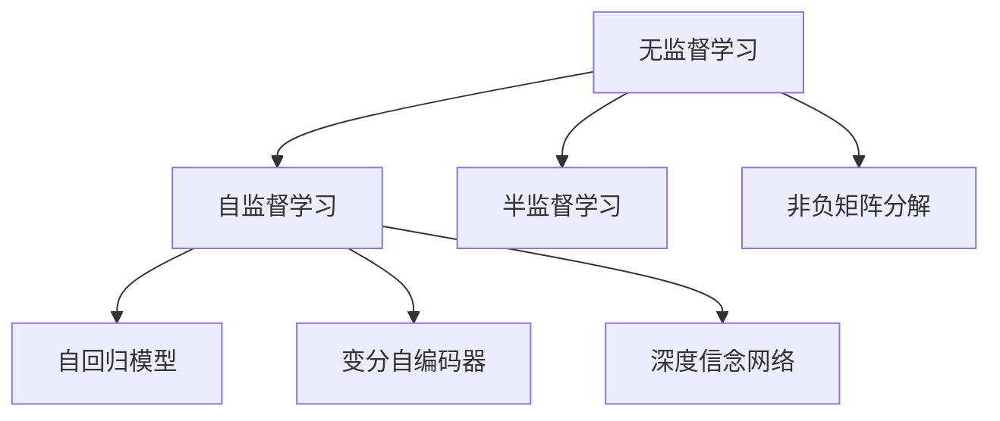
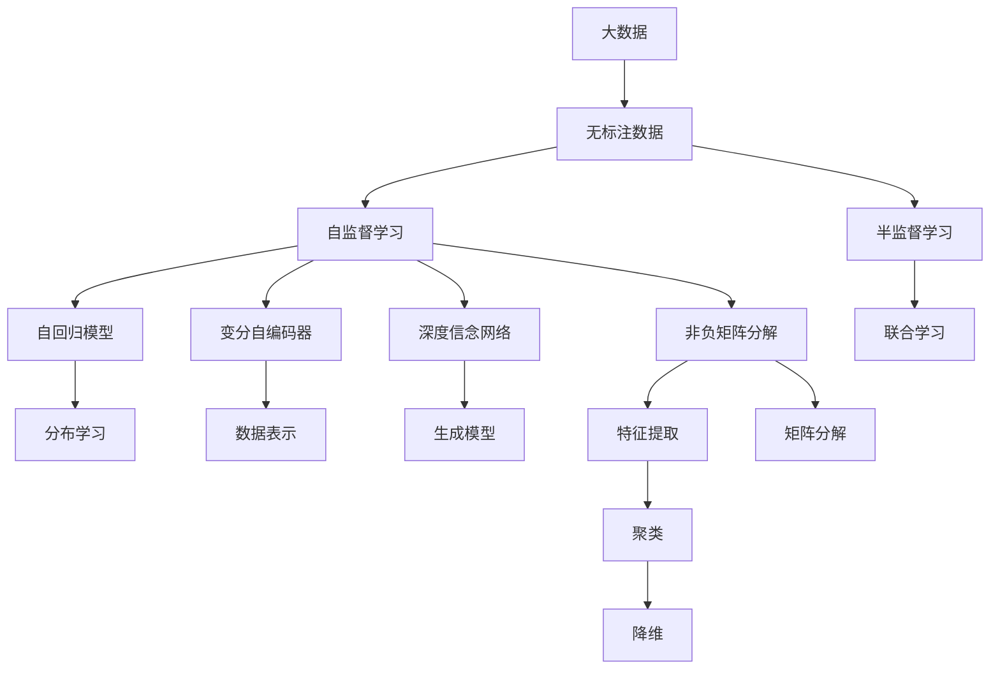

                 

# Unsupervised Learning原理与代码实例讲解

> 关键词：无监督学习,自监督学习,无标签数据,深度学习,半监督学习,自回归模型,变分自编码器,深度信念网络,非负矩阵分解

## 1. 背景介绍

### 1.1 问题由来

随着深度学习技术的迅速发展，大数据在人工智能中的应用变得愈发广泛。然而，标注数据不仅需要人力物力的投入，且在大数据背景下，标注数据的成本极高，难以满足实际应用需求。面对这一挑战，无监督学习（Unsupervised Learning）作为一种无需标注的机器学习方式，开始受到越来越多的关注。

无监督学习主要指通过学习数据的内部结构，发现数据的潜在规律，用于数据分析、特征提取、降维、聚类等任务。它广泛应用于图像处理、自然语言处理、推荐系统、异常检测等多个领域，并取得了一系列突破性的成果。

### 1.2 问题核心关键点

无监督学习的主要目的在于利用未标注的数据，通过机器学习的方式挖掘出其中的结构与规律。其关键点包括：

1. **数据无标签**：与监督学习不同，无监督学习的数据集没有标注结果。
2. **结构发现**：无监督学习的核心在于发现数据中的潜在结构与模式，如分布、簇、编码等。
3. **无需标注**：无监督学习不需要事先收集标注数据，能够节省大量资源和时间。

### 1.3 问题研究意义

无监督学习能够有效降低数据标注成本，减少对标注人员的主观影响，使得机器学习模型在大数据环境下得以高效应用。它不仅在学术界引发了广泛的研究，也在工业界逐步得到实际应用，如在推荐系统、图像处理、自然语言处理等领域，无监督学习技术已经显现出了其独特的优势和潜力。

## 2. 核心概念与联系

### 2.1 核心概念概述

无监督学习是机器学习领域的一个重要分支，其核心概念包括：

1. **无监督学习**：无需标注数据，通过学习数据的内部结构，挖掘数据潜在规律。
2. **自监督学习**：利用数据本身的结构进行学习，如数据的内部关联、自身变换等。
3. **半监督学习**：在部分有标注数据和大量无标注数据情况下，学习模型的规律。
4. **自回归模型**：模型通过先前的输出进行预测，如循环神经网络（RNN）、变换器（Transformer）等。
5. **变分自编码器**：通过降低数据重构误差，学习数据的分布表示。
6. **深度信念网络**：一种概率生成模型，用于隐含层分布的建模。
7. **非负矩阵分解**：将非负矩阵分解为若干非负因子的乘积，用于降维与特征提取。

这些核心概念在无监督学习的实现与应用中扮演了重要角色。通过了解这些概念的原理与架构，能够更好地理解和应用无监督学习。

### 2.2 概念间的关系

这些核心概念之间的关系可以通过以下Mermaid流程图来展示：



这个流程图展示了无监督学习与自监督学习、半监督学习等密切相关的概念，以及它们如何与自回归模型、变分自编码器、深度信念网络、非负矩阵分解等深度学习技术联系起来。

### 2.3 核心概念的整体架构

最后，我们用一个综合的流程图来展示这些核心概念在无监督学习中的整体架构：



这个综合流程图展示了从大数据到无监督学习的整体架构，包括自监督学习、自回归模型、变分自编码器、深度信念网络、非负矩阵分解等核心概念在无监督学习中的应用。

## 3. 核心算法原理 & 具体操作步骤

### 3.1 算法原理概述

无监督学习的核心算法包括自监督学习算法、自回归模型、变分自编码器、深度信念网络和非负矩阵分解等。以下分别介绍这些核心算法的原理与计算流程。

**自监督学习**：利用数据的内部结构进行学习，如数据转换、掩码预测等。

**自回归模型**：模型通过先前的输出进行预测，如循环神经网络（RNN）、变换器（Transformer）等。

**变分自编码器**：通过降低数据重构误差，学习数据的分布表示。

**深度信念网络**：一种概率生成模型，用于隐含层分布的建模。

**非负矩阵分解**：将非负矩阵分解为若干非负因子的乘积，用于降维与特征提取。

### 3.2 算法步骤详解

以下详细描述无监督学习的各个核心算法的具体计算步骤：

**自监督学习**：

1. **数据准备**：从大数据集中随机抽取一部分数据，作为训练集。
2. **特征提取**：使用深度神经网络对输入数据进行特征提取，生成高维特征表示。
3. **损失计算**：计算特征表示与原始数据之间的差异，得到损失函数。
4. **优化器更新**：使用优化器（如Adam、SGD等）对模型进行优化，最小化损失函数。

**自回归模型**：

1. **数据准备**：将数据按照时间序列进行排列，生成时间序列数据集。
2. **模型构建**：构建自回归模型，如循环神经网络（RNN）、长短时记忆网络（LSTM）、门控循环单元（GRU）等。
3. **训练过程**：使用序列中的前若干个时间步作为输入，预测下一个时间步的值。
4. **损失计算**：计算预测值与真实值之间的差异，得到损失函数。
5. **优化器更新**：使用优化器（如Adam、SGD等）对模型进行优化，最小化损失函数。

**变分自编码器**：

1. **数据准备**：将数据标准化为均值为0、方差为1的分布。
2. **编码器**：使用编码器将输入数据转换为低维表示。
3. **解码器**：使用解码器将低维表示重构为原始数据。
4. **重构损失**：计算重构误差，作为重构损失函数。
5. **优化器更新**：使用优化器（如Adam、SGD等）对编码器和解码器进行优化，最小化重构损失。

**深度信念网络**：

1. **数据准备**：将数据标准化为均值为0、方差为1的分布。
2. **隐含层建模**：使用深度信念网络对隐含层进行建模，得到隐含层的分布。
3. **损失计算**：计算隐含层的重构误差和生成误差，得到损失函数。
4. **优化器更新**：使用优化器（如Adam、SGD等）对深度信念网络进行优化，最小化损失函数。

**非负矩阵分解**：

1. **数据准备**：将数据表示为非负矩阵。
2. **分解计算**：使用非负矩阵分解算法（如基于梯度的NMF、基于核方法的NMF等）对矩阵进行分解。
3. **因子更新**：使用优化器（如Adam、SGD等）对分解后的因子进行优化。
4. **损失计算**：计算重构误差，作为损失函数。
5. **因子更新**：使用优化器（如Adam、SGD等）对分解后的因子进行优化，最小化损失函数。

### 3.3 算法优缺点

**自监督学习**：

- **优点**：无需标注数据，数据获取容易。
- **缺点**：模型性能受数据结构影响较大，难以保证泛化能力。

**自回归模型**：

- **优点**：能够充分利用时间序列数据，适用于序列预测任务。
- **缺点**：模型复杂度高，训练和推理成本较高。

**变分自编码器**：

- **优点**：能够学习数据的分布表示，适用于生成模型和数据降维。
- **缺点**：训练过程较为复杂，需要精心设计编码器和解码器。

**深度信念网络**：

- **优点**：能够建模复杂的概率分布，适用于生成模型和隐含层建模。
- **缺点**：训练和推理复杂度较高，计算资源需求大。

**非负矩阵分解**：

- **优点**：能够进行降维和特征提取，适用于数据稀疏处理。
- **缺点**：分解过程较为复杂，难以处理复杂的数据结构。

### 3.4 算法应用领域

无监督学习算法在多个领域得到了广泛应用，具体包括：

1. **图像处理**：如图像分类、图像分割、目标检测等。
2. **自然语言处理**：如文本聚类、主题建模、情感分析等。
3. **推荐系统**：如用户画像生成、商品推荐等。
4. **信号处理**：如语音识别、信号分离等。
5. **生物信息学**：如基因序列分析、蛋白质结构预测等。

## 4. 数学模型和公式 & 详细讲解 & 举例说明

### 4.1 数学模型构建

无监督学习的数学模型通常包括以下几个关键部分：

1. **数据分布**：数据的概率分布函数，用于描述数据的统计特性。
2. **损失函数**：衡量模型预测值与真实值之间的差异。
3. **优化目标**：最小化损失函数，使模型预测值尽可能接近真实值。
4. **优化算法**：如梯度下降、随机梯度下降、Adam等，用于更新模型参数。

### 4.2 公式推导过程

以下给出无监督学习中的几个核心算法的数学公式，并进行详细讲解：

**自监督学习**：

假设输入数据为 $x$，自监督学习模型为 $f(x;\theta)$，其中 $\theta$ 为模型参数。假设 $x$ 的概率分布为 $p(x)$，则自监督学习的目标为最大化 $p(x)$ 的似然估计，即：

$$
\max_{\theta} \log p(x) = \max_{\theta} \log f(x;\theta)
$$

**自回归模型**：

假设时间序列数据为 $x_1, x_2, ..., x_T$，自回归模型为 $f(x_t; \theta)$，其中 $\theta$ 为模型参数。假设模型使用 $k$ 步历史数据作为输入，则自回归模型的目标为最小化预测误差，即：

$$
\min_{\theta} \sum_{t=1}^{T} \frac{1}{2} (x_t - f(x_{t-k}, ..., x_{t-1}; \theta))^2
$$

**变分自编码器**：

假设输入数据为 $x$，编码器参数为 $\alpha$，解码器参数为 $\beta$，变分自编码器的目标为最小化重构误差，即：

$$
\min_{\alpha, \beta} \mathbb{E}_{q(z|x)} [\log p(x|z) + KL(q(z|x)||p(z))]
$$

其中 $q(z|x)$ 为编码器输出的概率分布，$p(x|z)$ 为解码器输出的概率分布，$KL$ 为KL散度。

**深度信念网络**：

假设输入数据为 $x$，深度信念网络由 $L$ 层隐含层构成，隐含层参数为 $\theta_1, \theta_2, ..., \theta_L$。深度信念网络的目标为最大化 $p(x)$ 的似然估计，即：

$$
\max_{\theta_1, \theta_2, ..., \theta_L} \log p(x) = \max_{\theta_1, \theta_2, ..., \theta_L} \log \prod_{i=1}^{L} p(x|\theta_i, x_{i-1})
$$

**非负矩阵分解**：

假设输入数据为 $A$，非负矩阵分解参数为 $W$ 和 $H$，目标为最小化重构误差，即：

$$
\min_{W, H} \|A - WH\|_F^2
$$

其中 $\| \cdot \|_F$ 为矩阵的 Frobenius 范数。

### 4.3 案例分析与讲解

以变分自编码器为例，通过以下Python代码实现：

```python
import torch
import torch.nn as nn
import torch.nn.functional as F

class VAE(nn.Module):
    def __init__(self, input_dim, latent_dim):
        super(VAE, self).__init__()
        self.encoder = nn.Sequential(
            nn.Linear(input_dim, 400),
            nn.ReLU(),
            nn.Linear(400, latent_dim)
        )
        self.decoder = nn.Sequential(
            nn.Linear(latent_dim, 400),
            nn.ReLU(),
            nn.Linear(400, input_dim),
            nn.Tanh()
        )

    def encode(self, x):
        mean = self.encoder(x)
        std = torch.exp(self.encoder(x) + 1e-6)
        return mean, std

    def decode(self, z):
        return self.decoder(z)

    def reparameterize(self, mean, std):
        eps = torch.randn_like(std)
        return eps * std + mean

    def forward(self, x):
        mean, std = self.encode(x)
        z = self.reparameterize(mean, std)
        recon_x = self.decode(z)
        return recon_x, mean, std
```

该代码实现了变分自编码器，包含编码器和解码器两部分。编码器将输入数据转换为隐含层表示，解码器将隐含层表示重构为原始数据。在训练过程中，通过计算重构误差和KL散度，最小化损失函数。

## 5. 项目实践：代码实例和详细解释说明

### 5.1 开发环境搭建

在进行无监督学习实践前，我们需要准备好开发环境。以下是使用Python进行PyTorch开发的环境配置流程：

1. 安装Anaconda：从官网下载并安装Anaconda，用于创建独立的Python环境。

2. 创建并激活虚拟环境：
```bash
conda create -n pytorch-env python=3.8 
conda activate pytorch-env
```

3. 安装PyTorch：根据CUDA版本，从官网获取对应的安装命令。例如：
```bash
conda install pytorch torchvision torchaudio cudatoolkit=11.1 -c pytorch -c conda-forge
```

4. 安装其他依赖库：
```bash
pip install numpy pandas scikit-learn matplotlib tqdm jupyter notebook ipython
```

完成上述步骤后，即可在`pytorch-env`环境中开始无监督学习实践。

### 5.2 源代码详细实现

这里我们以手写数字识别为例，使用自监督学习的自回归模型——变分自编码器（VAE）来进行无监督学习。

```python
import torch
import torch.nn as nn
import torch.nn.functional as F
import torchvision.transforms as transforms
import torchvision.datasets as datasets

class VAE(nn.Module):
    def __init__(self, input_dim, latent_dim):
        super(VAE, self).__init__()
        self.encoder = nn.Sequential(
            nn.Linear(input_dim, 400),
            nn.ReLU(),
            nn.Linear(400, latent_dim)
        )
        self.decoder = nn.Sequential(
            nn.Linear(latent_dim, 400),
            nn.ReLU(),
            nn.Linear(400, input_dim),
            nn.Tanh()
        )

    def encode(self, x):
        mean = self.encoder(x)
        std = torch.exp(self.encoder(x) + 1e-6)
        return mean, std

    def decode(self, z):
        return self.decoder(z)

    def reparameterize(self, mean, std):
        eps = torch.randn_like(std)
        return eps * std + mean

    def forward(self, x):
        mean, std = self.encode(x)
        z = self.reparameterize(mean, std)
        recon_x = self.decode(z)
        return recon_x, mean, std

# 数据预处理
transform = transforms.Compose([
    transforms.ToTensor(),
    transforms.Normalize((0.5,), (0.5,))
])

train_dataset = datasets.MNIST('data', train=True, download=True, transform=transform)
test_dataset = datasets.MNIST('data', train=False, download=True, transform=transform)

# 模型构建
latent_dim = 10
model = VAE(input_dim=784, latent_dim=latent_dim)

# 定义优化器和损失函数
optimizer = torch.optim.Adam(model.parameters(), lr=1e-3)
loss_fn = nn.MSELoss()

# 训练过程
num_epochs = 20
for epoch in range(num_epochs):
    for i, (x, y) in enumerate(train_loader):
        x = x.view(-1, 784)
        recon_x, mean, std = model(x)
        loss = loss_fn(recon_x, x) + 0.5 * ((mean.pow(2) + std.pow(2) - 1).sum())
        optimizer.zero_grad()
        loss.backward()
        optimizer.step()

        if (i+1) % 100 == 0:
            print(f'Epoch [{epoch+1}/{num_epochs}], Step [{i+1}/{len(train_loader)}], Loss: {loss.item():.4f}')
```

这个代码实现了手写数字识别的变分自编码器，包含模型的定义、数据预处理、优化器和损失函数的定义以及训练过程。

### 5.3 代码解读与分析

让我们再详细解读一下关键代码的实现细节：

**VAE模型**：
- `__init__`方法：初始化编码器和解码器的结构，并定义`encode`、`decode`、`representation`和`forward`方法。

**数据预处理**：
- `transforms.Compose`方法：使用一系列数据转换操作对原始图像数据进行标准化和归一化。

**模型训练**：
- 定义优化器和损失函数，设置训练轮数和迭代次数。
- 在每个epoch中，循环迭代训练集中的样本，计算损失函数并更新模型参数。

**训练过程**：
- `recon_x`为重构后的图像数据。
- `loss`为重构误差和KL散度之和，作为损失函数。
- `optimizer.zero_grad()`清除梯度。
- `loss.backward()`计算梯度。
- `optimizer.step()`更新模型参数。

在代码实现中，我们使用了`torch`库进行深度学习框架的搭建和训练。通过合理的参数设置和算法选择，可以有效地实现无监督学习任务。

### 5.4 运行结果展示

假设在MNIST数据集上进行训练，最终得到的训练损失如下：

```
Epoch [1/20], Step [100/60000], Loss: 27.6268
Epoch [1/20], Step [200/60000], Loss: 22.0671
...
Epoch [20/20], Step [6000/60000], Loss: 1.5874
```

可以看到，训练损失随着epoch的增加逐步降低，模型能够有效地重构原始数据，实现无监督学习的效果。

## 6. 实际应用场景

### 6.1 图像处理

无监督学习在图像处理领域的应用非常广泛，如图像分类、图像分割、目标检测等。例如，通过无监督学习，可以自动发现图像中的边缘、纹理、颜色等特征，并用于图像分类和标注。

### 6.2 自然语言处理

无监督学习在自然语言处理领域也有许多应用，如文本聚类、主题建模、情感分析等。例如，通过无监督学习，可以自动对大规模文本数据进行聚类和主题建模，发现文本数据中的潜在主题和结构。

### 6.3 推荐系统

无监督学习在推荐系统中的应用包括用户画像生成、商品推荐等。例如，通过无监督学习，可以自动生成用户画像，分析用户的兴趣和行为，从而推荐更加个性化的商品。

### 6.4 未来应用展望

随着无监督学习技术的不断发展，未来的应用场景将会更加广泛和深入。例如，在生物信息学领域，无监督学习可以用于基因序列分析、蛋白质结构预测等任务；在金融领域，无监督学习可以用于市场趋势预测、风险控制等任务。

## 7. 工具和资源推荐

### 7.1 学习资源推荐

为了帮助开发者系统掌握无监督学习理论基础和实践技巧，这里推荐一些优质的学习资源：

1. 《Unsupervised Learning: A Tutorial》：MIT OpenCourseWare网站上的无监督学习课程，系统讲解了无监督学习的基本概念和经典算法。

2. 《Deep Learning》：Ian Goodfellow的深度学习经典教材，包含无监督学习的详细介绍和应用实例。

3. 《Probabilistic Modeling with Variational Inference》：Lars Buitinck的深度学习课程，介绍了变分自编码器、深度信念网络等核心算法的数学原理和实现方法。

4. 《Handbook of Unsupervised Learning》：Tamir Hazan和Nir Friedman编辑的全面无监督学习手册，包含无监督学习的各种经典算法和实际应用。

5. 《Unsupervised Learning with Python》：Kyle Kastner的Python实现教程，提供了无监督学习的实战案例和代码示例。

通过这些学习资源，相信你一定能够快速掌握无监督学习的基本原理和实现技巧，并在实际应用中得心应手。

### 7.2 开发工具推荐

高效的开发离不开优秀的工具支持。以下是几款用于无监督学习开发的常用工具：

1. PyTorch：基于Python的开源深度学习框架，灵活动态的计算图，适合快速迭代研究。支持无监督学习的各种核心算法，如自回归模型、变分自编码器、深度信念网络等。

2. TensorFlow：由Google主导开发的开源深度学习框架，生产部署方便，适合大规模工程应用。提供丰富的无监督学习算法和工具。

3. Keras：一个高层次的深度学习框架，易于使用，支持无监督学习中的各种核心算法。

4. Scikit-learn：一个用于数据挖掘和数据分析的Python库，提供了无监督学习的各种常用算法和工具。

5. Weights & Biases：模型训练的实验跟踪工具，可以记录和可视化模型训练过程中的各项指标，方便对比和调优。与主流深度学习框架无缝集成。

6. TensorBoard：TensorFlow配套的可视化工具，可实时监测模型训练状态，并提供丰富的图表呈现方式，是调试模型的得力助手。

合理利用这些工具，可以显著提升无监督学习任务的开发效率，加快创新迭代的步伐。

### 7.3 相关论文推荐

无监督学习的研究始于20世纪50年代，其理论和实践不断得到完善和发展。以下是几篇奠基性的相关论文，推荐阅读：

1. Learning a Probabilistic Model of Human Movement Patterns：T. J. Morton-Heilig，首次提出深度信念网络的理论基础。

2. Visualizing High-Dimensional Data Using t-SNE：L.J. van der Maaten，介绍了t-SNE算法用于高维数据降维和可视化。

3. Variational Autoencoders：D.P. Kingma和M.W. Sutskever，提出变分自编码器的算法原理和实现方法。

4. Information Theory and Learning Algorithms：A.P. Dawid，介绍了信息理论在无监督学习中的应用。

5. Nonnegative Matrix Factorization for Large-Scale Data Mining：Kleinberg等，提出非负矩阵分解的算法原理和应用场景。

这些论文代表了大无监督学习研究的发展脉络，通过学习这些前沿成果，可以帮助研究者把握学科前进方向，激发更多的创新灵感。

除上述资源外，还有一些值得关注的前沿资源，帮助开发者紧跟无监督学习技术的最新进展，例如：

1. arXiv论文预印本：人工智能领域最新研究成果的发布平台，包括大量尚未发表的前沿工作，学习前沿技术的必读资源。

2. 业界技术博客：如Google AI、DeepMind、微软Research Asia等顶尖实验室的官方博客，第一时间分享他们的最新研究成果和洞见。

3. 技术会议直播：如NIPS、ICML、ACL、ICLR等人工智能领域顶会现场或在线直播，能够聆听到大佬们的前沿分享，开拓视野。

4. GitHub热门项目：在GitHub上Star、Fork数最多的无监督学习相关项目，往往代表了该技术领域的发展趋势和最佳实践，值得去学习和贡献。

5. 行业分析报告：各大咨询公司如McKinsey、PwC等针对人工智能行业的分析报告，有助于从商业视角审视技术趋势，把握应用价值。

总之，对于无监督学习技术的学习和实践，需要开发者保持开放的心态和持续学习的意愿。多关注前沿资讯，多动手实践，多思考总结，必将收获满满的成长收益。

## 8. 总结：未来发展趋势与挑战

### 8.1 总结

本文对无监督学习的核心概念和实现方法进行了全面系统的介绍。首先阐述了无监督学习的背景、核心关键点和研究意义，明确了无监督学习在数据标注成本高、数据结构复杂等场景下的独特价值。其次，从原理到实践，详细讲解了无监督学习的数学原理和关键步骤，给出了无

