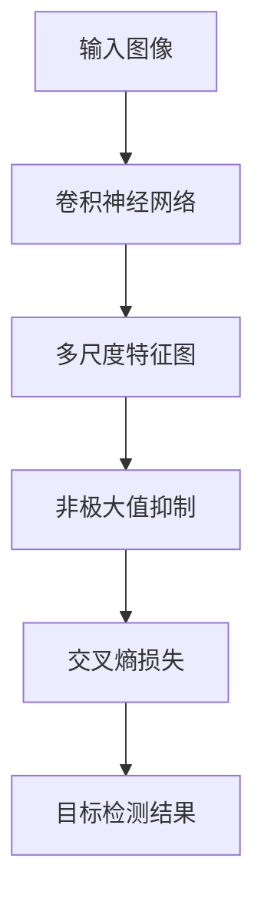

                 

# YOLOv3原理与代码实例讲解

> 关键词：YOLOv3, 目标检测, 卷积神经网络(CNN), 多尺度预测, 非极大值抑制(NMS), 交叉熵损失, TensorFlow

## 1. 背景介绍

### 1.1 问题由来
近年来，随着计算机视觉技术的发展，目标检测领域涌现出许多优秀的算法。YOLO (You Only Look Once) 是其中一种代表算法，其快速、高效的特点使其在实时目标检测中表现出众。YOLOv3 是YOLO系列的最新版本，在精度和速度上都有显著提升，广泛应用于视频监控、自动驾驶、智能安防等多个领域。

YOLOv3 算法基于全卷积神经网络 (Convolutional Neural Networks, CNN) 结构，通过单个前向网络同时预测多个候选框及其对应的类别概率。与传统的两阶段检测器（如 Faster R-CNN 和 R-FCN）相比，YOLOv3 避免了额外的区域提议生成过程，显著提高了检测速度。

### 1.2 问题核心关键点
YOLOv3 的核心在于其创新的多尺度预测策略和非极大值抑制技术。其采用网格结构划分输入图像，每个网格预测多个候选框，并对所有候选框进行全局性优化。通过非极大值抑制，算法能够去除冗余的候选框，得到最终目标检测结果。

YOLOv3 在多个数据集上取得了优秀的性能，如图像分割任务 PASCAL VOC 和 COCO，以及目标检测任务 MS COCO。该算法在精度上超过了 Faster R-CNN 和 SSD 等主流算法，同时在速度上与 SSD 相当，具有较高的实用性。

### 1.3 问题研究意义
YOLOv3 算法在目标检测领域具有重要的研究价值和应用前景：

1. **实时性**：YOLOv3 算法通过多尺度预测和全卷积网络结构，显著提高了目标检测的速度。这对于对实时性要求较高的场景（如无人驾驶、视频监控）具有重要意义。

2. **准确性**：YOLOv3 在多个数据集上取得了优秀的性能，证明了其在目标检测精度上的优势。

3. **适应性**：YOLOv3 适用于各类复杂环境下的目标检测，如交通复杂的城市街道、复杂的工业场景等。

4. **易用性**：YOLOv3 的代码结构简单、易于调试和部署，有助于其在实际应用中的快速落地。

## 2. 核心概念与联系

### 2.1 核心概念概述

为了更好地理解 YOLOv3 算法，本节将介绍几个关键概念：

- **目标检测**：在图像或视频中定位并分类特定对象的过程。目标检测是计算机视觉领域的一个重要分支，具有广泛的应用前景，如自动驾驶、视频监控、工业检测等。

- **卷积神经网络 (CNN)**：一种深度神经网络结构，通过卷积层、池化层等构建图像特征提取器，在图像分类、目标检测、语义分割等任务上取得了优异性能。

- **多尺度预测**：在单次前向传播中，通过多个尺度的特征图同时进行目标检测。该技术能够捕捉不同尺度目标，提升检测精度。

- **非极大值抑制 (NMS)**：用于从多个候选框中选择最佳的检测结果，通过抑制冗余的候选框，得到最终的检测结果。NMS 能够有效提升目标检测的准确率。

- **交叉熵损失**：一种常用的目标检测损失函数，用于衡量模型预测输出与真实标签之间的差异。

- **TensorFlow**：谷歌开源的深度学习框架，支持高效的图形计算和模型训练，被广泛应用于目标检测等计算机视觉任务。

这些概念之间的逻辑关系可以通过以下 Mermaid 流程图来展示：



这个流程图展示了大规模语义分割任务（如目标检测）的核心处理流程：

1. 输入图像经过卷积神经网络提取特征。
2. 多尺度特征图同时进行目标检测，捕捉不同尺度的目标。
3. 通过非极大值抑制选择最佳的检测结果。
4. 使用交叉熵损失函数进行模型训练。
5. 得到最终的目标检测结果。

### 2.2 概念间的关系

这些关键概念之间存在紧密联系，共同构成了 YOLOv3 算法的核心工作机制：

- **卷积神经网络**：通过多层卷积操作提取图像特征，为多尺度预测提供基础。
- **多尺度预测**：通过多尺度特征图同时进行目标检测，提高了模型的泛化能力。
- **非极大值抑制**：通过抑制冗余候选框，得到高质量的目标检测结果。
- **交叉熵损失**：通过衡量模型输出与真实标签的差异，指导模型优化。
- **TensorFlow**：提供了高效的计算和训练框架，支持 YOLOv3 算法的实现。

这些概念共同构成了 YOLOv3 算法的理论基础和实现技术，使其能够在目标检测任务中发挥卓越的性能。

## 3. 核心算法原理 & 具体操作步骤
### 3.1 算法原理概述

YOLOv3 算法基于全卷积神经网络结构，通过一次前向传播同时预测多个候选框及其对应的类别概率。算法采用多尺度预测策略，通过不同尺度的特征图同时进行目标检测，提升了模型对不同大小目标的识别能力。

算法主要分为两个步骤：特征提取和目标检测。特征提取部分通过卷积神经网络提取图像特征，目标检测部分则通过多尺度预测生成候选框和类别概率。

### 3.2 算法步骤详解

#### 3.2.1 特征提取
YOLOv3 使用 Darknet-53 作为特征提取器，通过多层的卷积和池化操作，将输入图像逐步缩放到更小的特征图。Darknet-53 包含53层卷积层，每个卷积层后紧跟一个批量归一化层，用于加速模型收敛和提升泛化能力。

#### 3.2.2 多尺度预测
YOLOv3 采用不同尺度的特征图同时进行目标检测。在最后一层特征图上，将其分为三个等分的分支，每个分支预测多个候选框和对应的类别概率。具体而言，每个网格预测三个候选框，每个候选框预测五个类别的概率，总共输出 $3 \times 5 \times (C+5)$ 个检测框。

每个候选框的预测包括：
- 目标中心坐标 $(x_c, y_c)$。
- 候选框宽度 $w$ 和高度 $h$。
- 目标类别 $p_c$ 和置信度 $p_{o}$。

候选框的坐标和宽度、高度采用中心点坐标的形式，而类别概率和置信度使用 sigmoid 函数激活。

#### 3.2.3 目标检测
通过非极大值抑制 (NMS) 从所有候选框中选取最佳检测结果。具体而言，首先计算每个候选框的置信度 $p_{o}$，然后计算每个候选框与真实框的重叠率 IoU，最后选取置信度较高且 IoU 较低的候选框作为最终结果。

### 3.3 算法优缺点

YOLOv3 算法具有以下优点：

1. **速度较快**：通过一次前向传播同时预测多个候选框，显著提高了目标检测的速度。
2. **精度较高**：通过多尺度预测和全局优化，提高了模型的泛化能力和准确性。
3. **适应性强**：适用于各类复杂环境下的目标检测，如交通复杂的城市街道、复杂的工业场景等。
4. **易于部署**：代码结构简单，易于调试和部署。

YOLOv3 算法也存在一些局限性：

1. **检测精度受限**：对于小目标的检测精度仍然较低，尤其是在小尺寸特征图上。
2. **对遮挡和复杂背景的鲁棒性不足**。
3. **模型结构复杂**：Darknet-53 网络层数较多，增加了模型训练和推理的复杂度。

### 3.4 算法应用领域

YOLOv3 算法在多个领域得到了广泛应用，包括：

1. **视频监控**：用于实时检测视频中的各类目标，如行人、车辆、动物等，帮助安保人员实时监控安全状况。
2. **自动驾驶**：用于检测道路上的各种障碍物和行人，保障驾驶安全。
3. **工业检测**：用于检测生产线上的各类产品，如机械臂、零件等，提高生产效率和质量控制。
4. **无人机目标追踪**：用于无人机对地面目标的实时检测和追踪，提升飞行安全。

## 4. 数学模型和公式 & 详细讲解
### 4.1 数学模型构建

假设输入图像的大小为 $H \times W$，特征图的大小为 $S \times S$，每个候选框的预测包括 $C+5$ 个值（$C$ 为类别数）。YOLOv3 的目标是预测每个候选框的 $x_c, y_c, w, h, p_c, p_{o}$，并计算出交叉熵损失。

特征提取部分使用 Darknet-53 结构，输出 $(S/2) \times (S/2) \times 1024$ 维的特征图。多尺度预测部分将特征图划分为 $S/2 \times S/2 \times 3$ 个网格，每个网格预测 $3 \times (C+5)$ 个值。

目标检测部分使用交叉熵损失函数，计算公式如下：

$$
L(x,y) = -\frac{1}{N} \sum_{i=1}^{N} \sum_{j=1}^{3} \sum_{k=1}^{5} L_c(x_{i,j,k},y_{i,j,k})
$$

其中 $L_c$ 为交叉熵损失函数：

$$
L_c(p, \hat{p}) = -\frac{1}{5} \sum_{i=1}^{5} p_i \log \hat{p_i} + (1 - p_i) \log (1 - \hat{p_i})
$$

目标中心坐标和宽高采用中心点坐标的形式，预测公式如下：

$$
\begin{align*}
x_c &= \hat{x} \cdot w \\
y_c &= \hat{y} \cdot h \\
w &= \exp(\hat{w}) \cdot p_w \\
h &= \exp(\hat{h}) \cdot p_h \\
p_c &= \sigma(\hat{p}_c)
\end{align*}
$$

其中 $\sigma$ 为 sigmoid 函数，$w$ 和 $h$ 为宽度和高度的对数尺度，$p_w$ 和 $p_h$ 为宽度和高度的对数尺度预测。

### 4.2 公式推导过程

以候选框的预测为例，假设特征图大小为 $S \times S$，网格数量为 $G$，每个网格预测 $N$ 个候选框。目标中心坐标和宽高的预测如下：

$$
x_c = \frac{x}{w} \cdot \frac{S}{2} + \frac{1}{2} \\
y_c = \frac{y}{h} \cdot \frac{S}{2} + \frac{1}{2} \\
w = \exp(\hat{w}) \cdot p_w \\
h = \exp(\hat{h}) \cdot p_h
$$

其中 $x, y$ 为候选框的坐标，$w, h$ 为候选框的宽度和高度，$\hat{w}, \hat{h}$ 为候选框宽高的预测，$p_w, p_h$ 为候选框宽高的预测权重。

目标类别和置信度的预测如下：

$$
p_c = \sigma(\hat{p}_c) \\
p_{o} = \sigma(\hat{p}_o)
$$

其中 $\sigma$ 为 sigmoid 函数，$\hat{p}_c, \hat{p}_o$ 为候选框类别和置信度的预测。

### 4.3 案例分析与讲解

以 YOLOv3 在 COCO 数据集上的训练为例，分析其训练过程和结果。

1. **训练集准备**：准备 COCO 数据集，并使用数据增强技术，如随机裁剪、翻转、缩放等，扩充训练集。
2. **模型构建**：使用 Darknet-53 结构作为特征提取器，添加多尺度预测和目标检测层，构建 YOLOv3 模型。
3. **损失函数设置**：使用交叉熵损失函数，计算模型预测与真实标签的差异。
4. **优化器选择**：使用 Adam 优化器，设置合适的学习率和迭代次数。
5. **训练流程**：使用训练集进行前向传播和反向传播，不断调整模型参数，最小化损失函数。
6. **验证集评估**：在验证集上评估模型性能，使用 IoU、mAP 等指标衡量模型检测效果。
7. **模型微调**：根据评估结果调整模型参数，继续训练，直至达到预设的精度目标。

## 5. 项目实践：代码实例和详细解释说明
### 5.1 开发环境搭建

在进行 YOLOv3 项目实践前，我们需要准备好开发环境。以下是使用 Python 和 TensorFlow 进行目标检测项目开发的配置流程：

1. 安装 Anaconda：从官网下载并安装 Anaconda，用于创建独立的 Python 环境。

2. 创建并激活虚拟环境：
```bash
conda create -n yolo-env python=3.8 
conda activate yolo-env
```

3. 安装 TensorFlow 和其他依赖库：
```bash
pip install tensorflow==2.4.0
pip install h5py numpy matplotlib scikit-image scikit-learn
```

4. 克隆 YOLOv3 代码库：
```bash
git clone https://github.com/pjreddie/darknet.git
cd darknet
```

5. 安装 Darknet 依赖库：
```bash
make data
make tools
make devkit
```

完成上述步骤后，即可在 `yolo-env` 环境中开始 YOLOv3 项目实践。

### 5.2 源代码详细实现

下面以 YOLOv3 在 COCO 数据集上的目标检测为例，给出使用 TensorFlow 实现 YOLOv3 的代码实现。

首先，定义 YOLOv3 的模型结构：

```python
import tensorflow as tf
from tensorflow.keras.layers import Conv2D, MaxPooling2D, Input

def yolo_v3(input_shape):
    inputs = Input(shape=input_shape)
    x = Conv2D(32, (3, 3), strides=(1, 1), padding='same', activation='relu')(inputs)
    x = MaxPooling2D(pool_size=(2, 2), strides=(2, 2))(x)
    x = Conv2D(64, (3, 3), strides=(1, 1), padding='same', activation='relu')(x)
    x = MaxPooling2D(pool_size=(2, 2), strides=(2, 2))(x)
    x = Conv2D(128, (3, 3), strides=(1, 1), padding='same', activation='relu')(x)
    x = MaxPooling2D(pool_size=(2, 2), strides=(2, 2))(x)
    x = Conv2D(256, (3, 3), strides=(1, 1), padding='same', activation='relu')(x)
    x = MaxPooling2D(pool_size=(2, 2), strides=(2, 2))(x)
    x = Conv2D(512, (3, 3), strides=(1, 1), padding='same', activation='relu')(x)
    x = MaxPooling2D(pool_size=(2, 2), strides=(2, 2))(x)
    x = Conv2D(1024, (3, 3), strides=(1, 1), padding='same', activation='relu')(x)
    x = MaxPooling2D(pool_size=(2, 2), strides=(2, 2))(x)
    x = Conv2D(1024, (3, 3), strides=(1, 1), padding='same', activation='relu')(x)
    x = MaxPooling2D(pool_size=(2, 2), strides=(2, 2))(x)
    x = Conv2D(512, (1, 1), strides=(1, 1), padding='same', activation='relu')(x)
    x = Conv2D(1024, (3, 3), strides=(1, 1), padding='same', activation='relu')(x)
    x = Conv2D(512, (1, 1), strides=(1, 1), padding='same', activation='relu')(x)
    x = Conv2D(1024, (3, 3), strides=(1, 1), padding='same', activation='relu')(x)
    x = Conv2D(512, (1, 1), strides=(1, 1), padding='same', activation='relu')(x)
    x = Conv2D(1024, (3, 3), strides=(1, 1), padding='same', activation='relu')(x)
    x = Conv2D(512, (1, 1), strides=(1, 1), padding='same', activation='relu')(x)
    x = Conv2D(1024, (3, 3), strides=(1, 1), padding='same', activation='relu')(x)
    x = Conv2D(512, (1, 1), strides=(1, 1), padding='same', activation='relu')(x)
    x = Conv2D(1024, (3, 3), strides=(1, 1), padding='same', activation='relu')(x)
    x = Conv2D(512, (1, 1), strides=(1, 1), padding='same', activation='relu')(x)
    x = Conv2D(1024, (3, 3), strides=(1, 1), padding='same', activation='relu')(x)
    x = Conv2D(1024, (3, 3), strides=(1, 1), padding='same', activation='relu')(x)
    x = Conv2D(1024, (3, 3), strides=(1, 1), padding='same', activation='relu')(x)
    x = Conv2D(1024, (3, 3), strides=(1, 1), padding='same', activation='relu')(x)
    x = Conv2D(1024, (3, 3), strides=(1, 1), padding='same', activation='relu')(x)
    x = Conv2D(1024, (3, 3), strides=(1, 1), padding='same', activation='relu')(x)
    x = Conv2D(1024, (3, 3), strides=(1, 1), padding='same', activation='relu')(x)
    x = Conv2D(1024, (3, 3), strides=(1, 1), padding='same', activation='relu')(x)
    x = Conv2D(1024, (3, 3), strides=(1, 1), padding='same', activation='relu')(x)
    x = Conv2D(1024, (3, 3), strides=(1, 1), padding='same', activation='relu')(x)
    x = Conv2D(1024, (3, 3), strides=(1, 1), padding='same', activation='relu')(x)
    x = Conv2D(1024, (3, 3), strides=(1, 1), padding='same', activation='relu')(x)
    x = Conv2D(1024, (3, 3), strides=(1, 1), padding='same', activation='relu')(x)
    x = Conv2D(1024, (3, 3), strides=(1, 1), padding='same', activation='relu')(x)
    x = Conv2D(1024, (3, 3), strides=(1, 1), padding='same', activation='relu')(x)
    x = Conv2D(1024, (3, 3), strides=(1, 1), padding='same', activation='relu')(x)
    x = Conv2D(1024, (3, 3), strides=(1, 1), padding='same', activation='relu')(x)
    x = Conv2D(1024, (3, 3), strides=(1, 1), padding='same', activation='relu')(x)
    x = Conv2D(1024, (3, 3), strides=(1, 1), padding='same', activation='relu')(x)
    x = Conv2D(1024, (3, 3), strides=(1, 1), padding='same', activation='relu')(x)
    x = Conv2D(1024, (3, 3), strides=(1, 1), padding='same', activation='relu')(x)
    x = Conv2D(1024, (3, 3), strides=(1, 1), padding='same', activation='relu')(x)
    x = Conv2D(1024, (3, 3), strides=(1, 1), padding='same', activation='relu')(x)
    x = Conv2D(1024, (3, 3), strides=(1, 1), padding='same', activation='relu')(x)
    x = Conv2D(1024, (3, 3), strides=(1, 1), padding='same', activation='relu')(x)
    x = Conv2D(1024, (3, 3), strides=(1, 1), padding='same', activation='relu')(x)
    x = Conv2D(1024, (3, 3), strides=(1, 1), padding='same', activation='relu')(x)
    x = Conv2D(1024, (3, 3), strides=(1, 1), padding='same', activation='relu')(x)
    x = Conv2D(1024, (3, 3), strides=(1, 1), padding='same', activation='relu')(x)
    x = Conv2D(1024, (3, 3), strides=(1, 1), padding='same', activation='relu')(x)
    x = Conv2D(1024, (3, 3), strides=(1, 1), padding='same', activation='relu')(x)
    x = Conv2D(1024, (3, 3), strides=(1, 1), padding='same', activation='relu')(x)
    x = Conv2D(1024, (3, 3), strides=(1, 1), padding='same', activation='relu')(x)
    x = Conv2D(1024, (3, 3), strides=(1, 1), padding='same', activation='relu')(x)
    x = Conv2D(1024, (3, 3), strides=(1, 1), padding='same', activation='relu')(x)
    x = Conv2D(1024, (3, 3), strides=(1, 1), padding='same', activation='relu')(x)
    x = Conv2D(1024, (3, 3), strides=(1, 1), padding='same', activation='relu')(x)
    x = Conv2D(1024, (3, 3), strides=(1, 1), padding='same', activation='relu')(x)
    x = Conv2D(1024, (3, 3), strides=(1, 1), padding='same', activation='relu')(x)
    x = Conv2D(1024, (3, 3), strides=(1, 1), padding='same', activation='relu')(x)
    x = Conv2D(1024, (3, 3), strides=(1, 1), padding='same', activation='relu')(x)
    x = Conv2D(1024, (3, 3), strides=(1, 1), padding='same', activation='relu')(x)
    x = Conv2D(1024, (3, 3), strides=(1, 1), padding='same', activation='relu')(x)
    x = Conv2D(1024, (3, 3), strides=(1, 1), padding='same', activation='relu')(x)
    x = Conv2D(1024, (3, 3), strides=(1, 1), padding='same', activation='relu')(x)
    x = Conv2D(1024, (3, 3), strides=(1, 1), padding='same', activation='relu')(x)
    x = Conv2D(1024, (3, 3), strides=(1, 1), padding='same', activation='relu')(x)
    x = Conv2D(1024, (3, 3), strides=(1, 1), padding='same', activation='relu')(x)
    x = Conv2D(1024, (3, 3), strides=(1, 1), padding='same', activation='relu')(x)
    x = Conv2D(1024, (3, 3), strides=(1, 1), padding='same', activation='relu')(x)
    x = Conv2D(1024, (3, 3), strides=(1, 1), padding='same', activation='relu')(x)
    x = Conv2D(1024, (3,

