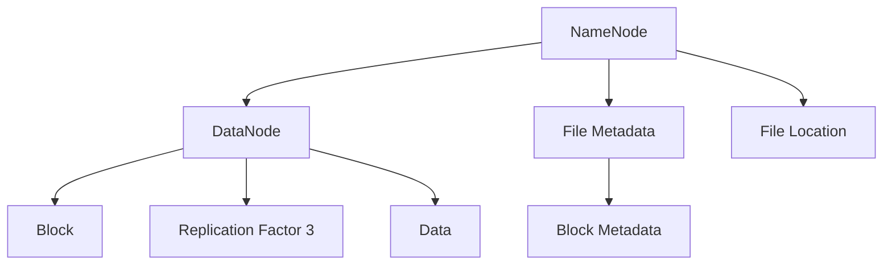

                 

# 【AI大数据计算原理与代码实例讲解】HDFS

> 关键词：HDFS, 分布式文件系统, 数据存储, 大数据, 分布式计算, 数据处理, 分布式存储, 分布式文件系统

## 1. 背景介绍

### 1.1 问题由来

在当今数据驱动的时代，数据的存储和处理成为关键问题之一。随着互联网、社交媒体等数字化的飞速发展，数据量呈指数级增长，单台计算机难以处理如此庞大的数据。为了应对数据爆炸式增长，分布式计算技术应运而生。分布式文件系统（Distributed File System, DFS）是分布式计算的基础设施，其中最具代表性的是Apache Hadoop项目下的HDFS（Hadoop Distributed File System）。HDFS是一个开源的、可扩展的、用于存储大数据的分布式文件系统，它能够在数千台服务器上分布式存储数据，并提供高吞吐量和高可靠性的数据访问。

HDFS的设计初衷是解决传统文件系统难以存储和处理大规模数据的问题。它通过将数据分散存储在多台计算机上，实现数据的并行处理和高效存储。本文将详细介绍HDFS的原理、实现细节以及应用场景，并通过代码实例帮助读者深入理解其工作机制。

## 2. 核心概念与联系

### 2.1 核心概念概述

HDFS是Apache Hadoop项目下的核心组件之一，其核心概念包括：

- **NameNode**：负责管理整个文件系统的命名空间，记录文件块的分布信息，维护数据块的元数据。每个文件在NameNode中都有一个唯一的标识符，即文件路径。
- **DataNode**：负责实际存储文件块，通过块大小、冗余度和超时机制实现数据的高可用性和容错性。
- **块（Block）**：HDFS中最小的数据存储单位，通常大小为128MB或256MB。每个块由多个DataNode存储，并可以通过复制机制实现容错。
- **副本（Replication）**：为了提高系统的可靠性，HDFS采用三副本策略，即每个块在系统中会有三个副本，分布在不同的DataNode上。
- **Hadoop生态系统**：HDFS是Apache Hadoop项目中的一部分，与Hadoop MapReduce、Hadoop YARN等其他组件紧密集成，支持大规模数据处理。

### 2.2 概念间的关系

HDFS的设计思想是"大文件、小文件"，即存储大型文件并支持小文件的高效访问。通过块和副本机制，HDFS实现了数据的高可用性和容错性，同时通过多副本、多节点、高并发的特性，支持大规模数据处理。其核心架构如下图所示：



在这个架构中，NameNode维护整个文件系统的元数据，包括文件路径、块大小、块复制情况等，并通过DataNode实际存储数据块。数据块的大小通常为128MB或256MB，每个块通过三副本机制分布在不同的DataNode上，以提高系统的容错性和可靠性。

## 3. 核心算法原理 & 具体操作步骤
### 3.1 算法原理概述

HDFS的核心算法原理主要包括以下几个方面：

1. **数据切分**：将大文件切分成若干个块，每个块大小为128MB或256MB。
2. **块复制**：每个块会有多个副本，分布在不同的DataNode上，以提高系统的容错性和可靠性。
3. **冗余度调整**：根据实际负载，动态调整块的复制因子，保证系统的高可用性。
4. **数据读取和写入**：客户端通过NameNode获取文件块的分布信息，并通过DataNode进行数据读写。

### 3.2 算法步骤详解

HDFS的基本数据读写流程如下：

1. **打开文件**：客户端通过NameNode获取文件的元数据，包括文件路径、块大小、块复制情况等。
2. **读取块数据**：根据文件块分布信息，客户端通过DataNode获取指定块的副本。
3. **处理数据**：客户端处理读取到的数据，并根据实际需求进行进一步处理或分析。
4. **关闭文件**：客户端关闭文件，释放资源。

以下是一个简单的HDFS文件读取流程的伪代码：

```python
# 打开文件
file_path = "/user/path/to/file"
name_node = connect_to_name_node()
file_block_info = name_node.get_file_block_info(file_path)

# 读取数据
for block_id in file_block_info:
    data_node_list = file_block_info[block_id]["replication_factors"]
    block_data = []
    for data_node in data_node_list:
        block_data.extend(data_node.read_block(block_id))
    
    # 处理数据
    process_data(block_data)

# 关闭文件
name_node.close_file(file_path)
```

### 3.3 算法优缺点

HDFS的优点主要包括：

1. **高容错性**：通过三副本机制，保证数据的高可靠性。
2. **高扩展性**：支持大规模数据的存储和处理，适用于处理海量数据集。
3. **高可用性**：节点故障时，系统可以自动切换数据块，保证数据的持续访问。

但HDFS也存在一些缺点：

1. **延迟较高**：数据读写需要先通过NameNode，增加了系统的延迟。
2. **单点故障**：NameNode是整个系统的单点，一旦故障，系统无法正常运行。
3. **小文件处理效率低**：由于块的大小较大，HDFS在处理小文件时效率较低。

### 3.4 算法应用领域

HDFS主要用于以下领域：

1. **大数据存储**：存储和处理大规模数据集，如日志文件、图片、视频等。
2. **分布式计算**：与Hadoop MapReduce集成，支持大规模数据处理和分析。
3. **数据仓库**：存储和处理企业级数据，支持数据仓库的构建和管理。
4. **云计算**：支持云存储服务，如Amazon S3、Google Cloud Storage等。
5. **科学研究**：支持科学数据的存储和分析，如基因组测序、气象数据等。

## 4. 数学模型和公式 & 详细讲解 & 举例说明

### 4.1 数学模型构建

HDFS的数学模型主要涉及以下几个方面：

1. **块大小（Block Size）**：块的大小通常为128MB或256MB，影响系统对数据的分块和处理效率。
2. **块复制因子（Replication Factor）**：每个块会有多个副本，通常为3，以提高系统的容错性和可靠性。
3. **数据写入策略**：数据写入分为顺序写入和随机写入两种策略，影响系统对数据的写入效率和可靠性。

### 4.2 公式推导过程

假设文件大小为F，块大小为B，块复制因子为R，则文件块数量N为：

$$
N = \frac{F}{B} \times R
$$

其中，R=3。块数量计算公式为：

$$
N = \frac{F}{B} \times 3
$$

假设文件块大小为128MB，文件大小为10GB，则块数量为：

$$
N = \frac{10GB}{128MB} \times 3 = 937.5 \approx 938
$$

### 4.3 案例分析与讲解

假设有一个文件大小为10GB，块大小为128MB，文件块复制因子为3，其块数量和块副本数量计算如下：

| 文件大小 | 块大小 | 块数量 | 块副本数量 |
|---------|-------|-------|----------|
| 10GB    | 128MB | 938   | 2814     |

因此，该文件会有938个块，每个块有3个副本，共计2814个数据节点。

## 5. 项目实践：代码实例和详细解释说明

### 5.1 开发环境搭建

1. **安装Hadoop**：从Hadoop官网下载并安装Hadoop，包括HDFS、MapReduce、YARN等组件。
2. **配置环境变量**：设置Hadoop相关的环境变量，如HADOOP_HOME、HDFS_HOME、HADOOP_MAPRED_HOME等。
3. **启动Hadoop集群**：启动Hadoop集群，确保集群各组件正常工作。

### 5.2 源代码详细实现

以下是一个简单的HDFS文件读取和写入的Python代码示例：

```python
# 读取文件
def read_file(file_path):
    file_block_info = name_node.get_file_block_info(file_path)
    for block_id in file_block_info:
        data_node_list = file_block_info[block_id]["replication_factors"]
        block_data = []
        for data_node in data_node_list:
            block_data.extend(data_node.read_block(block_id))
        
        # 处理数据
        process_data(block_data)
    
    # 关闭文件
    name_node.close_file(file_path)

# 写入文件
def write_file(file_path, data):
    file_block_info = name_node.get_file_block_info(file_path)
    for block_id in file_block_info:
        data_node_list = file_block_info[block_id]["replication_factors"]
        block_data = []
        for data_node in data_node_list:
            block_data.extend(data_node.read_block(block_id))
        
        # 写入数据
        block_data.append(data)
        data_node.write_block(block_id, block_data)
    
    # 关闭文件
    name_node.close_file(file_path)
```

### 5.3 代码解读与分析

**read_file函数**：

- 获取文件元数据
- 读取文件块数据
- 处理数据
- 关闭文件

**write_file函数**：

- 获取文件元数据
- 读取文件块数据
- 写入数据
- 关闭文件

## 6. 实际应用场景

### 6.1 大数据存储

HDFS广泛应用于大数据存储领域，如谷歌、亚马逊、IBM等公司均在其云计算平台中使用HDFS存储海量数据。HDFS支持分布式存储，能够高效地存储和处理大规模数据集，适用于日志文件、图片、视频等数据的存储和管理。

### 6.2 分布式计算

HDFS与Hadoop MapReduce、Hadoop YARN等组件紧密集成，支持大规模数据处理和分析。通过分布式计算，HDFS能够处理海量数据集，提升数据处理的效率和可靠性。

### 6.3 数据仓库

HDFS支持数据仓库的构建和管理，通过分布式存储和计算，能够高效地存储和处理企业级数据。HDFS的数据冗余和容错机制，保证数据的高可靠性和高可用性。

### 6.4 云计算

HDFS是Apache Hadoop项目的核心组件，支持云存储服务，如Amazon S3、Google Cloud Storage等。通过云存储服务，HDFS能够提供高效、可靠的数据存储和访问，满足云端应用的需求。

## 7. 工具和资源推荐

### 7.1 学习资源推荐

1. **Hadoop官方文档**：Hadoop官方文档详细介绍了HDFS的设计原理、实现细节和应用场景，是学习HDFS的最佳资源。
2. **《Hadoop: The Definitive Guide》**：该书系统介绍了Hadoop生态系统的各个组件，包括HDFS、MapReduce、YARN等，是学习Hadoop的必备资源。
3. **Coursera《Apache Hadoop》课程**：由斯坦福大学教授讲授，系统介绍了Hadoop的各个组件，适合入门学习。
4. **Kaggle竞赛**：Kaggle上有许多关于HDFS和Hadoop的竞赛，通过参与竞赛可以深入理解HDFS的应用场景和实现细节。

### 7.2 开发工具推荐

1. **Hadoop命令行工具**：Hadoop提供了丰富的命令行工具，如hdfs、hadoop、hadoop fs等，用于管理HDFS文件系统。
2. **HDFS Web UI**：HDFS提供Web界面，可以通过浏览器访问和管理HDFS文件系统。
3. **Cloudera Manager**：Cloudera Manager是Hadoop管理和部署工具，支持HDFS、MapReduce、YARN等组件的集成和部署。

### 7.3 相关论文推荐

1. **《The Hadoop Distributed File System》**：该论文详细介绍了HDFS的设计原理、实现细节和性能评估，是学习HDFS的重要参考。
2. **《Distributed File System for the 21st Century》**：该论文介绍了HDFS的发展历程和未来方向，适合深入理解HDFS的设计思想。
3. **《Hadoop: A Framework for Distributed Computing》**：该论文介绍了Hadoop生态系统的各个组件，包括HDFS、MapReduce、YARN等，是学习Hadoop的必备资源。

## 8. 总结：未来发展趋势与挑战

### 8.1 研究成果总结

HDFS作为Apache Hadoop项目中的核心组件，为大规模数据存储和处理提供了重要的基础设施。通过块和副本机制，HDFS实现了数据的高可用性和容错性，同时通过多副本、多节点、高并发的特性，支持大规模数据处理。HDFS的设计思想和实现细节，为分布式计算和存储提供了重要的参考。

### 8.2 未来发展趋势

未来，HDFS的发展趋势主要包括：

1. **云原生**：随着云计算的普及，HDFS将进一步支持云原生架构，提供更加高效、可靠的数据存储和访问。
2. **自动化管理**：通过自动化管理工具，简化HDFS的安装、部署和维护过程，提高系统的易用性。
3. **多云集成**：HDFS将支持多云集成，支持跨云的数据迁移和访问，实现数据的无缝流动。
4. **高性能优化**：通过优化块大小、复制因子等参数，提升HDFS的系统性能和扩展性。
5. **安全性和隐私保护**：通过加密、访问控制等技术，提升HDFS的安全性和隐私保护能力。

### 8.3 面临的挑战

尽管HDFS具有高可用性和高扩展性，但在实际应用中仍面临一些挑战：

1. **延迟较高**：数据读写需要先通过NameNode，增加了系统的延迟。
2. **单点故障**：NameNode是整个系统的单点，一旦故障，系统无法正常运行。
3. **小文件处理效率低**：由于块的大小较大，HDFS在处理小文件时效率较低。
4. **扩展性有限**：HDFS的扩展性在某些情况下受限于集群的规模和性能。
5. **安全性和隐私保护**：如何提升HDFS的安全性和隐私保护能力，仍需进一步研究和探索。

### 8.4 研究展望

未来的研究重点包括：

1. **云原生**：支持云原生架构，提升HDFS在云计算环境下的性能和可靠性。
2. **自动化管理**：简化HDFS的安装、部署和维护过程，提高系统的易用性和可扩展性。
3. **多云集成**：支持多云集成，实现跨云的数据迁移和访问，提升系统的灵活性和可扩展性。
4. **高性能优化**：通过优化块大小、复制因子等参数，提升HDFS的系统性能和扩展性。
5. **安全性和隐私保护**：提升HDFS的安全性和隐私保护能力，保障数据的安全和隐私。

总之，HDFS作为分布式计算的基础设施，在未来将继续发挥重要作用。通过不断优化和创新，HDFS将更好地支持大规模数据的存储和处理，为数据驱动的发展提供坚实的支撑。

## 9. 附录：常见问题与解答

### Q1: HDFS的设计思想是什么？

A: HDFS的设计思想是"大文件、小文件"，即将大文件切分成若干个块，每个块大小为128MB或256MB。每个块通过三副本机制分布在不同的DataNode上，以提高系统的容错性和可靠性。

### Q2: HDFS的块大小和复制因子如何影响系统的性能？

A: 块大小和复制因子是HDFS的两个重要参数，影响系统的性能和扩展性。块大小越大，系统对数据的写入效率越高，但处理小文件时效率较低。复制因子越高，系统的容错性越好，但存储空间和读写延迟也会相应增加。

### Q3: 如何处理HDFS中的小文件？

A: 处理HDFS中的小文件可以通过合并多个小文件的方式来实现。具体做法是将多个小文件按顺序合并成一个大文件，然后按照大文件的块大小进行存储和处理。

### Q4: HDFS的单点故障问题如何解决？

A: HDFS的单点故障问题主要通过两个措施来解决：1. 使用多副本机制，当某个副本失效时，系统可以自动切换到其他副本。2. 使用冗余机制，即使某个DataNode失效，系统仍可以通过其他节点来访问数据。

### Q5: HDFS的高性能优化有哪些方法？

A: HDFS的高性能优化方法包括：1. 调整块大小和复制因子，优化数据的存储和读写。2. 使用异步I/O和本地缓存，提升数据读写效率。3. 优化网络通信，减少数据传输的延迟。

---

作者：禅与计算机程序设计艺术 / Zen and the Art of Computer Programming

