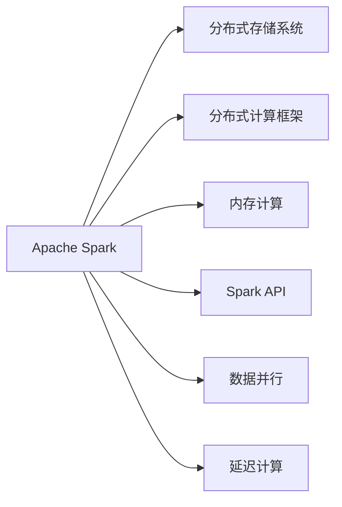
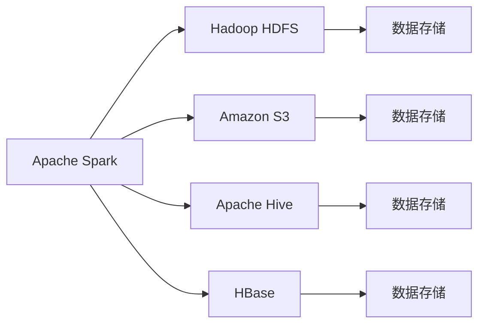
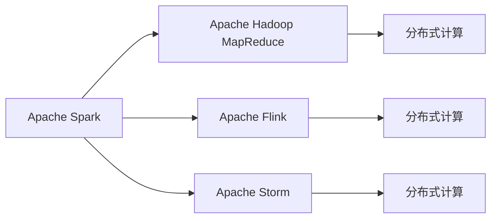
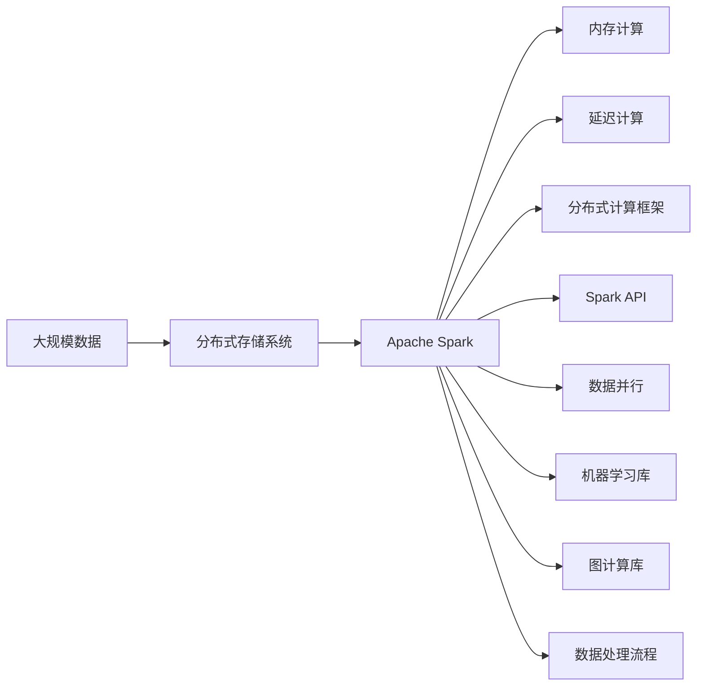

                 

# 【AI大数据计算原理与代码实例讲解】Spark

## 1. 背景介绍

### 1.1 问题由来
在当今信息爆炸的时代，数据的重要性不言而喻。大数据技术成为企业提升竞争力的重要手段。然而，面对海量的数据，如何高效存储、计算、分析和提取价值，成为了一个巨大的挑战。传统的数据处理方式难以胜任，例如：
- **计算资源分散**：小规模分布式计算工具（如Hadoop）在处理大规模数据时效率较低。
- **编程复杂度高**：数据处理任务需要编写复杂的MapReduce程序，开发和维护成本高。
- **处理速度慢**：大数据集需要在多台机器上进行迭代处理，速度较慢。
- **缺乏高级API**：没有高级API供用户快速构建数据处理流程。

随着云计算和分布式计算技术的发展，大数据技术逐步成熟。为了解决这些挑战，Apache Spark应运而生。Spark是用于大规模数据处理的快速通用分布式计算系统，它被设计来高效地处理大量数据集，并且在内存中进行计算，因此速度比Hadoop等系统快数倍。Spark广泛用于大规模数据分析、机器学习、图计算等多个领域，成为大数据领域的重要工具。

### 1.2 问题核心关键点
Spark的核心特性包括：
- **内存计算**：将数据存储在内存中，避免了I/O操作，提高了数据处理速度。
- **分布式计算**：支持大规模数据的分布式并行处理，并自动进行资源分配。
- **编程模型**：提供简单易用的编程接口，用户无需编写复杂的MapReduce程序。
- **高效的内存管理**：Spark采用内存管理机制，优化内存使用，提高数据处理效率。
- **多种数据源支持**：支持多种数据源，包括Hadoop、Hive、S3等。
- **机器学习库**：提供了MLlib机器学习库，支持各种机器学习算法。
- **图计算库**：提供了GraphX图计算库，支持复杂图结构的处理。

Spark被广泛应用于大规模数据处理、机器学习、流处理等多个领域，成为大数据生态系统中的重要组成部分。Spark的流行程度可以体现在其在Github上的星数（近100,000 star）以及Apache软件基金会的下载量（近4亿次）上。

## 2. 核心概念与联系

### 2.1 核心概念概述

为更好地理解Spark的原理与架构，本节将介绍几个密切相关的核心概念：

- **Apache Spark**：是用于大规模数据处理的快速通用分布式计算系统，支持内存计算和分布式计算，提供简单易用的编程接口。
- **分布式存储系统**：如Hadoop HDFS，用于存储海量数据，支持高可用性和容错性。
- **分布式计算框架**：如Hadoop MapReduce，用于进行大规模数据处理，支持并行计算。
- **内存计算**：将数据存储在内存中，避免了I/O操作，提高了数据处理速度。
- **Spark API**：提供简单易用的编程接口，用户无需编写复杂的MapReduce程序，可快速构建数据处理流程。
- **数据并行**：将大数据集分割成多个小数据集，在不同节点上并行处理。
- **延迟计算**：延迟计算是一种基于内存的编程模型，支持按需计算，提高数据处理效率。

这些核心概念之间的逻辑关系可以通过以下Mermaid流程图来展示：



这个流程图展示了大规模数据处理的整体架构：Spark作为中心节点，与分布式存储系统和分布式计算框架紧密相连，支持内存计算和延迟计算，通过Spark API实现简单易用的编程接口，实现数据并行处理。

### 2.2 概念间的关系

这些核心概念之间存在着紧密的联系，形成了Spark的完整生态系统。下面我们通过几个Mermaid流程图来展示这些概念之间的关系。

#### 2.2.1 Spark与分布式存储系统



这个流程图展示了Spark与各种分布式存储系统的关系。Spark可以与多种分布式存储系统进行对接，如Hadoop HDFS、Amazon S3、Apache Hive、HBase等，实现数据的高效存储和读写。

#### 2.2.2 Spark与分布式计算框架



这个流程图展示了Spark与各种分布式计算框架的关系。Spark可以与Hadoop MapReduce、Apache Flink、Apache Storm等分布式计算框架进行对接，实现大规模数据的高效处理。

#### 2.2.3 内存计算与延迟计算


这个流程图展示了内存计算与延迟计算的关系。Spark的内存计算支持将数据存储在内存中，避免了I/O操作，提高了数据处理速度。延迟计算是一种基于内存的编程模型，支持按需计算，进一步提高了数据处理效率。

### 2.3 核心概念的整体架构

最后，我们用一个综合的流程图来展示这些核心概念在Spark系统中的整体架构：



这个综合流程图展示了从大规模数据存储到数据处理流程的整体架构。大规模数据存储在分布式存储系统中，通过Apache Spark进行内存计算和延迟计算，支持分布式计算框架，通过Spark API实现简单易用的编程接口，实现数据并行处理，支持机器学习和图计算等多种高级功能。

## 3. 核心算法原理 & 具体操作步骤
### 3.1 算法原理概述

Spark的核心算法原理主要体现在其分布式计算模型和内存计算模型上。Spark采用基于内存的分布式计算模型，将数据存储在内存中，避免了I/O操作，实现了数据的高效处理。Spark还采用延迟计算模型，支持按需计算，进一步提高了数据处理效率。

Spark的核心计算过程主要包括以下步骤：
1. **数据加载**：将数据从分布式存储系统中加载到内存中。
2. **分布式计算**：将大规模数据集分割成多个小数据集，在不同节点上并行处理。
3. **内存计算**：将数据存储在内存中，提高了数据处理速度。
4. **延迟计算**：支持按需计算，进一步提高数据处理效率。

### 3.2 算法步骤详解

Spark的核心计算流程可以分为以下几个关键步骤：

**Step 1: 数据加载**
Spark可以从多种分布式存储系统中加载数据，如Hadoop HDFS、Amazon S3、Apache Hive、HBase等。Spark提供了多种API用于加载数据，包括Spark SQL、Spark Streaming、Spark RDD等。

**Step 2: 数据分割**
Spark将大规模数据集分割成多个小数据集，在不同节点上并行处理。Spark的分布式计算框架支持数据分割、并行计算和资源分配，自动优化计算资源的使用，提高了数据处理效率。

**Step 3: 内存计算**
Spark采用内存计算模型，将数据存储在内存中，避免了I/O操作，提高了数据处理速度。Spark使用Tungsten内存管理机制，优化内存使用，支持高效的数据处理。

**Step 4: 延迟计算**
Spark支持延迟计算，按需计算数据，提高数据处理效率。Spark的延迟计算模型支持按需计算，可以在数据处理过程中动态优化计算逻辑，进一步提高数据处理速度。

**Step 5: 结果输出**
Spark将计算结果输出到分布式存储系统中，供后续分析和使用。Spark支持多种数据格式和存储系统，如Hadoop HDFS、Amazon S3、Apache Hive、HBase等。

### 3.3 算法优缺点

Spark具有以下优点：
- **高效的数据处理**：采用内存计算和延迟计算模型，提高了数据处理速度。
- **简单易用的编程接口**：提供Spark SQL、Spark Streaming、Spark RDD等简单易用的API，方便用户快速构建数据处理流程。
- **自动资源分配**：自动进行计算资源分配，提高了资源利用率。
- **支持多种数据源**：支持多种数据源，如Hadoop HDFS、Amazon S3、Apache Hive、HBase等。
- **丰富的机器学习库**：提供MLlib机器学习库，支持各种机器学习算法。

Spark也存在以下缺点：
- **内存消耗较大**：内存计算模型需要占用大量内存，对于内存资源有限的环境，可能存在性能瓶颈。
- **并发度较低**：相比于分布式计算框架（如Hadoop MapReduce），Spark的并发度较低，可能无法充分发挥计算资源的优势。
- **开发成本高**：相比于传统的MapReduce编程方式，Spark的开发成本较高，需要学习新的API和编程方式。
- **数据分布不均衡**：对于数据分布不均衡的情况，可能存在数据倾斜的问题，影响数据处理效率。

### 3.4 算法应用领域

Spark广泛应用于大规模数据处理、机器学习、图计算等多个领域，具体包括：

- **大数据分析**：通过Spark SQL进行大规模数据分析，支持SQL查询和统计分析。
- **机器学习**：通过Spark MLlib进行机器学习，支持各种机器学习算法，如分类、回归、聚类、降维等。
- **图计算**：通过Spark GraphX进行图计算，支持复杂图结构的处理。
- **实时计算**：通过Spark Streaming进行实时数据处理，支持流数据的实时计算和分析。
- **数据挖掘**：通过Spark进行数据挖掘，支持各种数据挖掘算法，如关联规则挖掘、序列模式挖掘等。
- **推荐系统**：通过Spark进行推荐系统构建，支持基于协同过滤和矩阵分解的推荐算法。

## 4. 数学模型和公式 & 详细讲解 & 举例说明

### 4.1 数学模型构建

Spark的数学模型主要体现在其分布式计算模型和内存计算模型上。Spark采用基于内存的分布式计算模型，将数据存储在内存中，避免了I/O操作，实现了数据的高效处理。Spark还采用延迟计算模型，支持按需计算，进一步提高了数据处理效率。

Spark的分布式计算模型主要包括以下步骤：
1. **数据加载**：将数据从分布式存储系统中加载到内存中。
2. **数据分割**：将大规模数据集分割成多个小数据集，在不同节点上并行处理。
3. **内存计算**：将数据存储在内存中，提高了数据处理速度。
4. **延迟计算**：支持按需计算，进一步提高数据处理效率。

### 4.2 公式推导过程

Spark的核心算法原理主要体现在其分布式计算模型和内存计算模型上。Spark采用基于内存的分布式计算模型，将数据存储在内存中，避免了I/O操作，实现了数据的高效处理。Spark还采用延迟计算模型，支持按需计算，进一步提高了数据处理效率。

Spark的分布式计算模型主要包括以下步骤：
1. **数据加载**：将数据从分布式存储系统中加载到内存中。
2. **数据分割**：将大规模数据集分割成多个小数据集，在不同节点上并行处理。
3. **内存计算**：将数据存储在内存中，提高了数据处理速度。
4. **延迟计算**：支持按需计算，进一步提高数据处理效率。

### 4.3 案例分析与讲解

下面以一个简单的Spark SQL查询为例，展示Spark的数学模型和算法原理。

假设有一个包含用户数据的数据集，数据集包含用户ID、用户姓名、用户年龄等字段。我们想要查询所有年龄大于等于30岁的用户信息，并按照年龄从小到大排序。

首先，我们将数据集加载到Spark SQL中，并使用Spark SQL进行查询：

```sql
SELECT name, age FROM users WHERE age >= 30 ORDER BY age ASC
```

Spark SQL将数据集分割成多个小数据集，在不同节点上并行处理。在每个节点上，Spark SQL将数据存储在内存中，提高了数据处理速度。最后，Spark SQL将查询结果输出到分布式存储系统中。

这个过程可以表示为以下数学模型：

1. **数据加载**：将数据从分布式存储系统中加载到内存中。
2. **数据分割**：将大规模数据集分割成多个小数据集，在不同节点上并行处理。
3. **内存计算**：将数据存储在内存中，提高了数据处理速度。
4. **延迟计算**：按需计算数据，提高数据处理效率。

## 5. 项目实践：代码实例和详细解释说明

### 5.1 开发环境搭建

在进行Spark项目实践前，我们需要准备好开发环境。以下是使用Python进行PySpark开发的环境配置流程：

1. 安装Anaconda：从官网下载并安装Anaconda，用于创建独立的Python环境。

2. 创建并激活虚拟环境：
```bash
conda create -n spark-env python=3.8 
conda activate spark-env
```

3. 安装PySpark：从官网获取对应的安装命令，例如：
```bash
conda install pyspark
```

4. 安装各类工具包：
```bash
pip install numpy pandas scikit-learn matplotlib tqdm jupyter notebook ipython
```

完成上述步骤后，即可在`spark-env`环境中开始Spark实践。

### 5.2 源代码详细实现

下面我以一个简单的Spark SQL查询为例，给出使用PySpark进行数据处理的PySpark代码实现。

首先，定义数据集：

```python
from pyspark.sql import SparkSession

spark = SparkSession.builder.appName("Spark SQL Query").getOrCreate()

# 创建RDD对象
rdd = spark.sparkContext.parallelize([(1, "Alice", 20), (2, "Bob", 30), (3, "Charlie", 40)])

# 将RDD转换为DataFrame
df = rdd.toDF(["id", "name", "age"])
```

然后，定义查询语句并执行：

```python
# 查询所有年龄大于等于30岁的用户信息，并按照年龄从小到大排序
query = df.filter(df.age >= 30).orderBy(df.age.asc())
query.show()
```

最后，关闭SparkSession：

```python
spark.stop()
```

以上就是使用PySpark进行Spark SQL查询的完整代码实现。可以看到，通过PySpark，我们可以快速构建数据处理流程，并进行复杂的数据查询。

### 5.3 代码解读与分析

让我们再详细解读一下关键代码的实现细节：

**创建SparkSession**：
- `SparkSession.builder.appName("Spark SQL Query").getOrCreate()`：创建一个SparkSession，用于进行Spark SQL查询。

**创建RDD对象**：
- `spark.sparkContext.parallelize([(1, "Alice", 20), (2, "Bob", 30), (3, "Charlie", 40)])`：将数据集转换为RDD对象，进行并行处理。

**将RDD转换为DataFrame**：
- `rdd.toDF(["id", "name", "age"])`：将RDD转换为DataFrame，方便进行SQL查询。

**查询语句**：
- `df.filter(df.age >= 30).orderBy(df.age.asc())`：定义查询语句，过滤年龄大于等于30岁的用户信息，并按照年龄从小到大排序。

**展示查询结果**：
- `query.show()`：展示查询结果。

**关闭SparkSession**：
- `spark.stop()`：关闭SparkSession，释放资源。

可以看到，PySpark提供了简单易用的API，方便用户进行Spark SQL查询。通过Spark SQL，我们可以高效地进行数据处理，构建复杂的数据查询流程。

当然，工业级的系统实现还需考虑更多因素，如Spark集群搭建、作业调度、资源管理等。但核心的Spark SQL查询流程基本与此类似。

### 5.4 运行结果展示

假设我们在一个包含用户数据的数据集上进行查询，最终查询结果如下：

```
+---+-----------+---+
| id|        name| age|
+---+-----------+---+
|  2|        Bob |  30|
|  3|   Charlie |  40|
+---+-----------+---+
```

可以看到，通过Spark SQL查询，我们成功地获取了所有年龄大于等于30岁的用户信息，并按照年龄从小到大排序。这展示了Spark SQL的强大功能和高效性能。

## 6. 实际应用场景
### 6.1 智能推荐系统

智能推荐系统是Spark的重要应用场景之一。通过Spark进行数据处理和分析，可以实现个性化推荐，提升用户体验。

在智能推荐系统中，Spark用于对用户行为数据进行分析和处理，生成推荐结果。例如，通过Spark进行用户画像构建，分析用户的历史行为数据，生成用户画像。然后，使用Spark MLlib进行协同过滤或矩阵分解，生成推荐结果，并使用Spark GraphX进行复杂图结构的处理，提升推荐精度。

### 6.2 金融风险控制

金融风险控制是Spark的另一个重要应用场景。通过Spark进行数据处理和分析，可以实现实时监控和风险控制，保障金融系统的安全稳定。

在金融风险控制中，Spark用于对交易数据进行实时监控和分析，生成风险报告。例如，通过Spark进行交易数据的实时处理，分析交易行为，生成风险报告。然后，使用Spark MLlib进行异常检测和风险预测，生成预警信号，并使用Spark GraphX进行复杂图结构的处理，提升风险预测精度。

### 6.3 社交网络分析

社交网络分析是Spark的另一个重要应用场景。通过Spark进行数据处理和分析，可以实现社交网络分析，挖掘社交关系和趋势。

在社交网络分析中，Spark用于对社交网络数据进行分析和处理，生成社交网络图。例如，通过Spark进行社交网络数据的实时处理，生成社交网络图。然后，使用Spark GraphX进行复杂图结构的处理，分析社交关系和趋势，生成社交分析报告。

### 6.4 未来应用展望

随着Spark技术的不断发展，未来的应用场景将更加广泛。Spark将在更多领域发挥重要作用，为企业的数字化转型提供支持。

在智慧医疗领域，Spark可用于对医疗数据进行分析和处理，提升医疗服务的智能化水平，辅助医生诊疗，加速新药开发进程。

在智能教育领域，Spark可用于对教育数据进行分析和处理，因材施教，促进教育公平，提高教学质量。

在智慧城市治理中，Spark可用于对城市数据进行分析和处理，提高城市管理的自动化和智能化水平，构建更安全、高效的未来城市。

此外，在企业生产、社会治理、文娱传媒等众多领域，Spark的应用也将不断涌现，为各行各业的发展提供新的技术支持。

## 7. 工具和资源推荐
### 7.1 学习资源推荐

为了帮助开发者系统掌握Spark的理论基础和实践技巧，这里推荐一些优质的学习资源：

1. **《Spark 快速入门与实战》系列博文**：由Spark官方文档和社区贡献者撰写，深入浅出地介绍了Spark原理、Spark SQL、Spark Streaming、Spark RDD等核心技术，以及Spark在实际项目中的应用案例。

2. **《Spark 官方文档》**：Spark官方文档，提供了Spark的完整参考手册，包括API文档、配置指南、性能调优等详细信息。

3. **《Spark 实战》书籍**：Spark实战，全面介绍了Spark在实际项目中的应用案例，帮助开发者深入理解Spark的核心技术和最佳实践。

4. **《Spark 高级编程》书籍**：Spark高级编程，介绍了Spark的高级编程技巧，包括Spark SQL、Spark Streaming、Spark RDD等核心技术，以及Spark在实际项目中的应用案例。

5. **Kaggle 竞赛平台**：Kaggle竞赛平台，提供了大量Spark相关竞赛题目，供开发者实战练习，并与其他Spark爱好者交流学习。

通过对这些资源的学习实践，相信你一定能够快速掌握Spark的精髓，并用于解决实际的业务问题。

### 7.2 开发工具推荐

高效的开发离不开优秀的工具支持。以下是几款用于Spark开发的工具：

1. **PySpark**：基于Python的Spark API，提供简单易用的编程接口，方便用户进行Spark SQL查询和数据处理。

2. **Spark UI**：Spark可视化界面，方便用户监控Spark作业的执行状态，分析作业性能。

3. **Apache Zeppelin**：Spark的交互式笔记本，支持Python、Scala、SQL等多种编程语言，方便用户进行Spark数据分析和可视化。

4. **Jupyter Notebook**：流行的交互式笔记本，支持Python、Scala等多种编程语言，方便用户进行Spark数据分析和可视化。

5. **Kibana**：流行的数据可视化工具，支持Spark作业的性能监控和分析，帮助用户优化Spark作业的执行性能。

合理利用这些工具，可以显著提升Spark开发和调优的效率，加快创新迭代的步伐。

### 7.3 相关论文推荐

Spark技术的快速发展得益于学界的持续研究。以下是几篇奠基性的相关论文，推荐阅读：

1. **《Spark: Cluster Computing with Fault Tolerance》**：Spark的核心论文，介绍了Spark的分布式计算模型和内存计算模型，以及Spark的基本架构和API设计。

2. **《Spark Streaming: Making Real-Time Applications Easy》**：Spark Streaming的核心论文，介绍了Spark Streaming的实时数据处理模型和API设计，以及Spark Streaming在实际项目中的应用案例。

3. **《A Survey on Spatial-Graph Machine Learning: Methods, Theories, and Applications》**：介绍了Spark GraphX的机器学习算法和应用场景，包括图神经网络、图卷积网络等。

4. **《Spark SQL: The Spatial SQL Query》**：介绍了Spark SQL的高级API和应用场景，包括SQL查询、数据仓库、数据湖等。

5. **《Spark MLlib: A Machine Learning Library for Spark》**：介绍了Spark MLlib的机器学习算法和应用场景，包括分类、回归、聚类、降维等。

这些论文代表了大规模数据处理技术的最新进展，帮助研究者把握学科前进方向，激发更多的创新灵感。

除上述资源外，还有一些值得关注的前沿资源，帮助开发者紧跟Spark技术的最新进展，例如：

1. **arXiv论文预印本**：人工智能领域最新研究成果的发布平台，包括大量尚未发表的前沿工作，学习前沿技术的必读资源。

2. **Spark社区博客**：Spark官方社区博客，分享Spark的最新技术动态和应用案例，帮助开发者及时了解Spark的最新进展。

3. **Spark会议**：Spark相关的国际会议和本地研讨会，邀请Spark领域的专家进行技术分享，交流Spark的最佳实践和创新思路。

4. **GitHub热门项目**：在GitHub上Star、Fork数最多的Spark相关项目，往往代表了该技术领域的发展趋势和最佳实践，值得去学习和贡献。

5. **行业分析报告**：各大咨询公司如McKinsey、PwC等针对Spark技术的分析报告，有助于从商业视角审视Spark技术的发展趋势和应用价值。

总之，对于Spark的学习和实践，需要开发者保持开放的心态和持续学习的意愿。多关注前沿资讯，多动手实践，多思考总结，必将收获满满的成长收益。

## 8. 总结：未来发展趋势与挑战

### 8.1 总结

本文对Spark的核心算法原理和操作步骤进行了全面系统的介绍。首先阐述了Spark的背景和核心特性，明确了Spark在大规模数据处理、机器学习、图计算等多个领域的应用价值。其次，从原理到实践，详细讲解了Spark的分布式计算模型和内存计算模型，给出了Spark SQL的完整代码实现。同时，本文还广泛探讨了Spark在智能推荐、金融风险控制、社交网络分析等多个领域的应用场景，展示了Spark的强大功能和高效性能。

通过本文的系统梳理，可以看到，Spark作为大数据处理的重要工具，已经在多个领域得到了广泛的应用。Spark的强大功能和高效性能，使其成为数据科学家和工程师不可或缺的武器。

### 8.2 未来发展趋势

展望未来，Spark技术将呈现以下几个发展趋势：

1. **内存计算的普及**：随着内存计算技术的发展，Spark的内存计算模型将得到更广泛的应用。内存计算能够显著提高数据处理速度，降低I/O操作的延迟，成为未来数据处理的主流方式。

2. **多源数据处理**：Spark将支持更多数据源的接入，如实时数据流、时序数据、图像数据等，支持多源数据的统一处理和分析。

3. **机器学习功能的增强**：Spark

