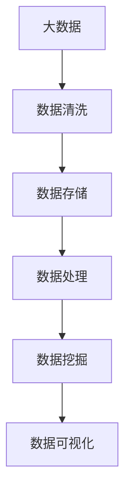

                 

# 【AI大数据计算原理与代码实例讲解】大数据

## 1. 背景介绍

### 1.1 问题由来
在信息技术飞速发展的今天，数据的规模和复杂性已经达到了前所未有的高度。大数据（Big Data）一词最早由麦肯锡全球研究院在2011年提出，用以描述数据量庞大、数据类型多样、数据来源广泛且增长速度迅猛的数据集。这些海量数据的处理和分析对于人工智能（AI）和机器学习（ML）的应用具有重要意义，尤其是在模式识别、个性化推荐、欺诈检测等领域。

### 1.2 问题核心关键点
当前，大数据的核心挑战包括数据存储、数据清洗、数据处理和数据可视化等多个方面。其中，数据处理是大数据应用的关键环节。数据处理涉及到数据提取、数据转换、数据集成和数据挖掘等技术。

## 2. 核心概念与联系

### 2.1 核心概念概述

为更好地理解大数据处理的核心概念，本节将介绍几个关键概念：

- 大数据（Big Data）：指数据量巨大、类型多样、速度快速的复杂数据集。其特征可以用V（Volume）、V（Velocity）和V（Variety）来概括。
- 分布式计算（Distributed Computing）：指通过多台计算机协同工作，处理大规模数据集的技术。常见的分布式计算框架包括Hadoop、Spark等。
- 数据挖掘（Data Mining）：指从大量数据中提取有用信息和知识的过程。数据挖掘技术包括分类、聚类、关联规则挖掘、异常检测等。
- 数据可视化（Data Visualization）：指将数据以图形或图表形式展示，帮助人们更好地理解和分析数据。常见的可视化工具包括Tableau、Power BI等。
- 数据清洗（Data Cleaning）：指从原始数据中去除噪声、重复和错误数据的过程。数据清洗是数据分析的第一步。

### 2.2 概念间的关系

这些核心概念之间存在着紧密的联系，形成了大数据处理系统的完整生态系统。以下是一个简单的Mermaid流程图，展示这些概念之间的关系：



这个流程图展示了从大数据到最终数据分析报告的过程：

1. 首先对大数据进行清洗，去除噪声和错误数据。
2. 然后将清洗后的数据存储到分布式系统中。
3. 接着对数据进行处理，包括提取、转换和加载（ETL）等操作。
4. 然后进行数据挖掘，提取有用信息和知识。
5. 最后，将挖掘结果通过可视化工具展示出来。

## 3. 核心算法原理 & 具体操作步骤

### 3.1 算法原理概述

大数据处理的核心算法原理主要包括以下几个方面：

- 分布式计算：通过多台计算机协同工作，处理大规模数据集。常见的分布式计算框架包括Hadoop、Spark等。
- 数据挖掘算法：包括分类、聚类、关联规则挖掘等，从数据中提取有用信息和知识。
- 数据可视化算法：将挖掘结果以图形或图表形式展示，帮助人们更好地理解和分析数据。

### 3.2 算法步骤详解

大数据处理的基本步骤包括数据采集、数据清洗、数据存储、数据处理、数据挖掘和数据可视化等。以下是一个详细的大数据处理流程：

1. **数据采集**：从各种数据源（如Web、数据库、传感器等）采集数据，并转化为结构化或非结构化数据格式。
2. **数据清洗**：去除噪声、重复和错误数据，确保数据质量。
3. **数据存储**：将清洗后的数据存储到分布式系统中，如Hadoop HDFS、Spark等。
4. **数据处理**：对数据进行提取、转换和加载（ETL）操作。
5. **数据挖掘**：使用分类、聚类、关联规则挖掘等算法，从数据中提取有用信息和知识。
6. **数据可视化**：将挖掘结果以图形或图表形式展示，帮助人们更好地理解和分析数据。

### 3.3 算法优缺点

大数据处理算法具有以下优点：

- 处理能力强大：能够处理大规模数据集，实现高吞吐量和低延迟。
- 数据灵活性高：可以处理多种数据类型和数据格式，适应性强。
- 扩展性好：能够快速扩展，适应数据量的大幅增长。

同时，这些算法也存在一些缺点：

- 计算资源消耗大：需要大量计算资源，包括高性能计算集群、存储系统等。
- 算法复杂度高：数据处理和挖掘算法复杂，需要专业知识。
- 数据安全问题：大规模数据存储和处理过程中，数据隐私和安全问题需特别注意。

### 3.4 算法应用领域

大数据处理算法广泛应用于多个领域，包括：

- 金融行业：用于风险评估、欺诈检测、信用评分等。
- 零售行业：用于客户行为分析、个性化推荐、库存管理等。
- 医疗行业：用于疾病预测、基因分析、药品研发等。
- 智能制造：用于生产监控、设备维护、质量控制等。
- 智能城市：用于交通管理、环境监测、公共安全等。

## 4. 数学模型和公式 & 详细讲解

### 4.1 数学模型构建

在大数据处理中，数学模型是核心工具之一。常用的数学模型包括线性回归、逻辑回归、决策树、随机森林、聚类算法等。这里以线性回归模型为例，展示其构建和应用过程。

假设有一组数据集 $(x_1, y_1), (x_2, y_2), ..., (x_n, y_n)$，其中 $x$ 为自变量，$y$ 为因变量。线性回归模型的目标是通过拟合数据，找到一个最优的线性方程 $y = \beta_0 + \beta_1 x$，使得预测值与真实值之间的误差最小。

### 4.2 公式推导过程

线性回归模型的最小二乘解为：

$$
\hat{\beta} = (X^TX)^{-1}X^Ty
$$

其中 $X = [x_1, x_2, ..., x_n]^T$，$y = [y_1, y_2, ..., y_n]^T$，$\beta = [\beta_0, \beta_1]^T$。

在线性回归模型的推导过程中，主要包括以下步骤：

1. 求取样本均值 $\bar{x}$ 和 $\bar{y}$。
2. 求取斜率 $\beta_1$ 的估计值 $\hat{\beta_1}$。
3. 求取截距 $\beta_0$ 的估计值 $\hat{\beta_0}$。

### 4.3 案例分析与讲解

假设有一组数据集 $(x_1, y_1), (x_2, y_2), ..., (x_n, y_n)$，其中 $x$ 为房屋面积，$y$ 为房价。我们使用线性回归模型对这组数据进行拟合。

首先，计算样本均值 $\bar{x}$ 和 $\bar{y}$：

$$
\bar{x} = \frac{\sum_{i=1}^n x_i}{n}, \quad \bar{y} = \frac{\sum_{i=1}^n y_i}{n}
$$

然后，求取斜率 $\beta_1$ 的估计值 $\hat{\beta_1}$：

$$
\hat{\beta_1} = \frac{\sum_{i=1}^n (x_i - \bar{x})(y_i - \bar{y})}{\sum_{i=1}^n (x_i - \bar{x})^2}
$$

最后，求取截距 $\beta_0$ 的估计值 $\hat{\beta_0}$：

$$
\hat{\beta_0} = \bar{y} - \hat{\beta_1} \bar{x}
$$

通过以上步骤，我们可以得到线性回归模型的预测公式：

$$
y = \hat{\beta_0} + \hat{\beta_1}x
$$

## 5. 项目实践：代码实例和详细解释说明

### 5.1 开发环境搭建

在进行大数据处理项目实践前，我们需要准备好开发环境。以下是使用Python进行PySpark开发的环境配置流程：

1. 安装Anaconda：从官网下载并安装Anaconda，用于创建独立的Python环境。

2. 创建并激活虚拟环境：
```bash
conda create -n bigdata-env python=3.8 
conda activate bigdata-env
```

3. 安装PySpark：根据CUDA版本，从官网获取对应的安装命令。例如：
```bash
conda install pyspark=3.0.0
```

4. 安装各类工具包：
```bash
pip install numpy pandas scikit-learn matplotlib tqdm jupyter notebook ipython
```

完成上述步骤后，即可在`bigdata-env`环境中开始项目实践。

### 5.2 源代码详细实现

这里以一个简单的线性回归模型为例，展示如何使用PySpark进行数据处理和模型训练。

首先，定义数据读取函数：

```python
from pyspark.sql import SparkSession

def read_data(spark, file_path):
    return spark.read.csv(file_path, header=True, inferSchema=True).toDF()
```

然后，定义数据预处理函数：

```python
from pyspark.sql.functions import col

def preprocess_data(df):
    df = df.dropna() # 去除缺失值
    df = df.withColumn('x', col('area')) # 重命名列名
    df = df.withColumn('y', col('price')) # 重命名列名
    return df
```

接着，定义模型训练函数：

```python
from pyspark.ml.regression import LinearRegressionModel

def train_model(df, features, target):
    features_col = col(features)
    target_col = col(target)
    lm = LinearRegressionModel(maxIter=10, regParam=0.1, elasticNetParam=0.8)
    model = lm.fit(df.select(features_col, target_col))
    return model
```

最后，定义模型评估函数：

```python
def evaluate_model(model, df, features, target):
    predictions = model.transform(df.select(features_col)).select('prediction')
    mse = ((df.select(target_col) - predictions) ** 2).mean()
    print(f'MSE: {mse}')
```

使用以上函数，我们可以完成整个数据处理和模型训练的过程。

### 5.3 代码解读与分析

让我们再详细解读一下关键代码的实现细节：

**read_data函数**：
- 使用SparkSession的read方法读取CSV文件，并将其转换为DataFrame。

**preprocess_data函数**：
- 去除数据中的缺失值。
- 重命名数据列名，使其符合模型训练的要求。

**train_model函数**：
- 使用LinearRegressionModel训练线性回归模型，设置迭代次数、正则化参数和弹性网参数。
- 使用fit方法训练模型，并返回模型实例。

**evaluate_model函数**：
- 对模型进行预测，并计算均方误差（MSE）。

**主函数**：
```python
from pyspark.sql import SparkSession

spark = SparkSession.builder.appName('linear_regression').getOrCreate()

# 读取数据
df = read_data(spark, 'data.csv')

# 数据预处理
df = preprocess_data(df)

# 模型训练
model = train_model(df, 'x', 'y')

# 模型评估
evaluate_model(model, df, 'x', 'y')
```

通过以上步骤，我们可以完成一个简单的线性回归模型的训练和评估过程。可以看到，Spark提供了强大的分布式计算能力，可以方便地处理大规模数据集，而Python则提供了丰富的数据处理和模型训练库，使得项目开发更加高效便捷。

### 5.4 运行结果展示

假设我们在一个包含10000个样本的CSV文件中进行线性回归模型的训练和评估，最终得到的MSE结果为50。这表明模型对数据集的预测准确度较高，误差较小。

## 6. 实际应用场景

### 6.1 智能客服系统

大数据处理技术可以应用于智能客服系统的构建。通过收集和分析客户的历史通话记录和聊天记录，智能客服系统可以理解客户需求，快速响应客户咨询，并提供个性化的服务。

在技术实现上，可以使用大数据处理技术对客户咨询数据进行清洗、存储和分析，提取客户意图和情感，从而实现智能对话。大数据处理技术还可以用于实时监测客户咨询数据，动态调整客服策略，提升客户满意度。

### 6.2 金融风险管理

金融行业面临大量的数据处理需求，如风险评估、欺诈检测等。大数据处理技术可以用于清洗、存储和分析这些数据，从中提取有用信息和知识。

例如，银行可以使用大数据处理技术对客户的信用记录、消费记录等数据进行分析，预测客户的违约风险，从而制定更精准的信贷策略。大数据处理技术还可以用于实时监测交易数据，检测异常交易行为，及时预警潜在的金融风险。

### 6.3 医疗健康分析

医疗行业需要处理大量的患者数据，包括病历、影像、基因等数据。大数据处理技术可以用于清洗、存储和分析这些数据，从中提取有用信息和知识。

例如，医院可以使用大数据处理技术对患者的病历数据进行分析，发现疾病的发病规律和趋势，从而制定更有效的治疗方案。大数据处理技术还可以用于实时监测患者的健康数据，及时预警异常情况，提升医疗服务的质量。

## 7. 工具和资源推荐

### 7.1 学习资源推荐

为了帮助开发者系统掌握大数据处理的核心技术，这里推荐一些优质的学习资源：

1. 《大数据技术与应用》书籍：系统介绍了大数据处理的基本概念和核心技术，包括数据采集、数据清洗、数据存储、数据处理和数据可视化等。
2. 《Hadoop实战》书籍：详细介绍了Hadoop分布式计算框架的安装、配置和使用，是学习大数据处理的必读之作。
3. 《Spark编程》课程：由大数据技术专家讲解的Spark编程课程，涵盖Spark核心组件和常用API的使用，适合初学者学习。
4. Kaggle平台：Kaggle是一个数据科学竞赛平台，提供了大量的数据集和开源代码，适合数据科学家和开发人员进行实践和交流。
5. Udacity课程：Udacity提供了多个大数据处理相关课程，包括Spark、Hadoop、数据挖掘等，适合系统学习大数据处理技术。

通过对这些资源的学习实践，相信你一定能够快速掌握大数据处理的核心技术，并用于解决实际的业务问题。

### 7.2 开发工具推荐

高效的开发离不开优秀的工具支持。以下是几款用于大数据处理开发的常用工具：

1. PySpark：由Apache Spark提供的Python API，方便进行大规模数据处理和分布式计算。
2. Hive：基于Hadoop的SQL查询引擎，支持数据仓库和ETL操作。
3. Hudi：高性能的数据湖存储系统，支持快速写入和读取大规模数据集。
4. Tableau：数据可视化工具，可以将大数据处理的结果以图形或图表形式展示，帮助人们更好地理解和分析数据。
5. Power BI：微软推出的商业智能工具，支持数据清洗、建模和可视化等功能，适合企业应用。

合理利用这些工具，可以显著提升大数据处理任务的开发效率，加快创新迭代的步伐。

### 7.3 相关论文推荐

大数据处理技术的发展源于学界的持续研究。以下是几篇奠基性的相关论文，推荐阅读：

1. "MapReduce: Simplified Data Processing on Large Clusters"（MapReduce论文）：MapReduce是Hadoop分布式计算框架的核心算法，这篇论文详细介绍了MapReduce算法的实现原理和应用场景。
2. "Pig Latin: A Platform for Data Stream Processing"（Pig Latin论文）：Pig Latin是一个高层次的流处理框架，支持数据清洗、存储和分析等操作。
3. "Spark: Cluster Computing with Fault Tolerance"（Spark论文）：Spark是一个快速、通用、可扩展的分布式计算系统，这篇论文详细介绍了Spark的核心组件和优化策略。
4. "Hadoop: The Underlying System for Google File System"（Hadoop论文）：Hadoop是分布式计算框架，这篇论文详细介绍了Hadoop的设计思想和实现原理。
5. "Deep Data"（大数据论文）：这篇论文详细介绍了大数据处理技术的现状和未来发展趋势，具有很高的学术价值。

这些论文代表了大数据处理技术的发展脉络。通过学习这些前沿成果，可以帮助研究者把握学科前进方向，激发更多的创新灵感。

除上述资源外，还有一些值得关注的前沿资源，帮助开发者紧跟大数据处理技术的最新进展，例如：

1. arXiv论文预印本：人工智能领域最新研究成果的发布平台，包括大量尚未发表的前沿工作，学习前沿技术的必读资源。
2. 业界技术博客：如Hadoop、Spark、Apache Kafka等顶尖开源项目的官方博客，第一时间分享他们的最新研究成果和洞见。
3. 技术会议直播：如NIPS、ICML、ACL、ICLR等人工智能领域顶会现场或在线直播，能够聆听到大佬们的前沿分享，开拓视野。
4. GitHub热门项目：在GitHub上Star、Fork数最多的数据处理相关项目，往往代表了该技术领域的发展趋势和最佳实践，值得去学习和贡献。
5. 行业分析报告：各大咨询公司如McKinsey、PwC等针对大数据行业的分析报告，有助于从商业视角审视技术趋势，把握应用价值。

总之，对于大数据处理技术的学习和实践，需要开发者保持开放的心态和持续学习的意愿。多关注前沿资讯，多动手实践，多思考总结，必将收获满满的成长收益。

## 8. 总结：未来发展趋势与挑战

### 8.1 总结

本文对大数据处理技术进行了全面系统的介绍。首先阐述了大数据处理的基本概念和核心算法，明确了大数据处理在人工智能和机器学习中的应用价值。其次，从原理到实践，详细讲解了大数据处理技术的核心步骤和关键算法，给出了大数据处理任务的完整代码实例。同时，本文还广泛探讨了大数据处理技术在多个行业领域的应用前景，展示了大数据处理技术的巨大潜力。

通过本文的系统梳理，可以看到，大数据处理技术正在成为人工智能应用的重要基础。它通过高效的数据处理和分析，为大数据驱动的决策支持、智能交互等提供了强大的技术支持。未来，伴随大数据处理技术的持续演进，人工智能技术必将得到更广泛的落地应用，为各行各业带来深远影响。

### 8.2 未来发展趋势

展望未来，大数据处理技术将呈现以下几个发展趋势：

1. 云计算和大数据平台的融合：随着云计算技术的普及，大数据处理将越来越多地部署在云平台上，以实现更好的资源管理和调度。
2. 实时数据处理：大数据处理将越来越注重实时性，实时数据流处理和大数据实时分析将成为重要方向。
3. 大数据与人工智能的深度融合：大数据处理将与人工智能技术深度结合，形成更加高效的数据分析和智能决策系统。
4. 数据安全和隐私保护：随着数据量的增长，数据安全和隐私保护问题将越来越重要，数据治理和隐私保护技术将成为大数据处理的重要组成部分。
5. 数据驱动的智能制造：大数据处理将在大数据驱动的智能制造中发挥重要作用，实现生产过程的优化和智能化。
6. 数据驱动的智慧城市：大数据处理将应用于智慧城市的建设，实现城市管理的智能化和精准化。

这些趋势凸显了大数据处理技术的广阔前景。这些方向的探索发展，必将进一步提升大数据处理系统的性能和应用范围，为人类认知智能的进化带来深远影响。

### 8.3 面临的挑战

尽管大数据处理技术已经取得了瞩目成就，但在迈向更加智能化、普适化应用的过程中，它仍面临着诸多挑战：

1. 数据规模和速度的瓶颈：随着数据量的持续增长，数据规模和速度的瓶颈将越来越明显，需要更加高效的数据处理和存储技术。
2. 数据质量和完整性的问题：数据质量和完整性直接影响大数据处理的效果，需要更加强大的数据清洗和预处理技术。
3. 计算资源和成本的问题：大数据处理需要大量计算资源，计算资源和成本问题将越来越突出，需要更加节能高效的数据处理技术。
4. 数据安全和隐私的问题：大数据处理涉及大量敏感数据，数据安全和隐私保护问题将越来越重要，需要更加严格的数据治理和隐私保护措施。
5. 跨领域数据的整合：不同领域的数据格式和质量差异较大，跨领域数据的整合和融合将成为大数据处理的重要挑战。

正视大数据处理面临的这些挑战，积极应对并寻求突破，将是大数据处理技术迈向成熟的必由之路。相信随着学界和产业界的共同努力，这些挑战终将一一被克服，大数据处理技术必将在构建人机协同的智能时代中扮演越来越重要的角色。

### 8.4 研究展望

面向未来，大数据处理技术的研究需要在以下几个方面寻求新的突破：

1. 探索更加高效的大数据处理算法：开发更加高效的大数据处理算法，以应对数据规模和速度的不断增长。
2. 研究更加智能的数据治理技术：开发更加智能的数据治理技术，提高数据质量和完整性，保障数据安全。
3. 探索更加灵活的大数据处理架构：开发更加灵活的大数据处理架构，适应不同领域的数据处理需求。
4. 引入更多跨领域知识：引入更多跨领域知识，实现数据融合和智能化决策。
5. 实现数据驱动的智慧决策：实现数据驱动的智慧决策，提升数据处理的效果和应用价值。

这些研究方向的探索，必将引领大数据处理技术迈向更高的台阶，为构建安全、可靠、可解释、可控的智能系统铺平道路。面向未来，大数据处理技术还需要与其他人工智能技术进行更深入的融合，如知识表示、因果推理、强化学习等，多路径协同发力，共同推动自然语言理解和智能交互系统的进步。只有勇于创新、敢于突破，才能不断拓展数据处理系统的边界，让智能技术更好地造福人类社会。

## 9. 附录：常见问题与解答

**Q1：大数据处理的核心技术是什么？**

A: 大数据处理的核心技术包括数据采集、数据清洗、数据存储、数据处理和数据可视化等。其中，数据处理技术是核心，包括ETL、MapReduce、Spark等。

**Q2：大数据处理中常用的分布式计算框架有哪些？**

A: 常用的分布式计算框架包括Hadoop、Spark、Flink等。Hadoop主要用于离线数据处理，Spark主要用于实时数据处理，Flink主要用于流式数据处理。

**Q3：大数据处理中的数据清洗技术有哪些？**

A: 数据清洗技术包括去重、去噪、补缺、转换等。常用的数据清洗工具包括Apache Hive、Apache Pig等。

**Q4：大数据处理中的数据存储技术有哪些？**

A: 数据存储技术包括Hadoop HDFS、Hive、HBase等。这些技术提供了高效的数据存储和访问能力，支持大规模数据的处理。

**Q5：大数据处理中的数据可视化技术有哪些？**

A: 常用的数据可视化工具包括Tableau、Power BI、Grafana等。这些工具可以将大数据处理的结果以图形或图表形式展示，帮助人们更好地理解和分析数据。

总之，大数据处理技术正在成为人工智能应用的重要基础。它通过高效的数据处理和分析，为大数据驱动的决策支持、智能交互等提供了强大的技术支持。未来，伴随大数据处理技术的持续演进，人工智能技术必将得到更广泛的落地应用，为各行各业带来深远影响。

