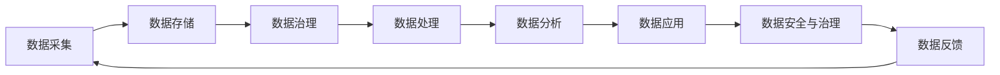
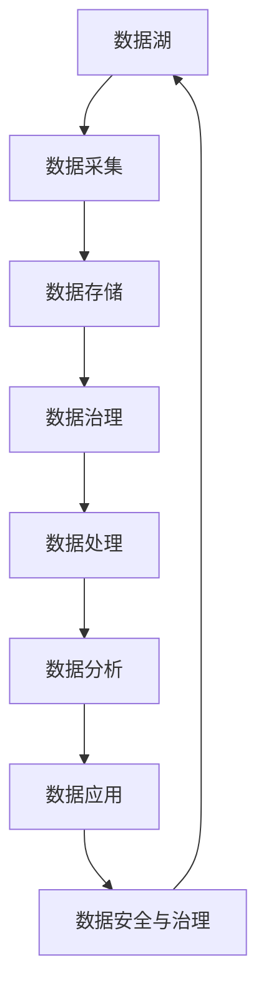

                 

# 【AI大数据计算原理与代码实例讲解】数据湖

> 关键词：数据湖,大数据计算,数据存储,数据处理,机器学习,分布式计算,SQL查询,分布式存储,NoSQL数据库,数据湖架构,数据湖技术栈,数据湖应用场景,数据湖安全与治理,数据湖案例分析

## 1. 背景介绍

### 1.1 问题由来

随着数字化转型的深入，企业积累的数据量呈指数级增长，传统的以关系型数据库为核心的数据管理模式已难以应对这一挑战。数据湖应运而生，成为新一代数据管理基础设施。数据湖以其海量的数据存储能力、强大的数据处理能力、灵活的数据分析能力，满足了企业对数据融合、治理、分析的需求。

数据湖不仅能够存储各种数据类型，包括结构化数据、半结构化数据、非结构化数据等，还支持多种数据处理和分析技术，如ETL（Extract, Transform, Load）、机器学习、数据挖掘、实时流处理等。通过数据湖，企业可以高效地管理和利用海量数据资源，挖掘数据价值，实现业务创新和决策支持。

### 1.2 问题核心关键点

数据湖的核心在于其数据存储和管理能力，能够容纳海量数据，并提供灵活、高效的数据处理和分析服务。数据湖的价值在于其能够跨部门、跨业务线整合数据，为数据驱动决策提供支撑。

数据湖的构建需要考虑数据存储、数据治理、数据安全、数据湖架构等多个方面。其中，数据存储和管理是数据湖的基础，数据治理是确保数据质量的关键，数据安全和隐私保护是数据湖建设的保障，而数据湖架构和技术栈则决定了数据湖的性能和可扩展性。

数据湖的应用场景非常广泛，包括但不限于市场营销、客户关系管理、供应链优化、产品推荐、风险管理等。通过数据湖，企业能够实现数据的全面整合、深度分析和高效应用，推动业务发展。

### 1.3 问题研究意义

构建数据湖，对于提升企业的数据治理能力、优化业务流程、实现精准营销、推动决策科学化具有重要意义：

1. 提升数据治理能力。数据湖集中了企业的各种数据，通过统一的数据标准和规范，能够有效提高数据的质量和一致性，减少数据孤岛和冗余。
2. 优化业务流程。数据湖提供的灵活数据处理和分析能力，能够帮助企业发现业务痛点，优化流程，提升运营效率。
3. 实现精准营销。通过数据分析和机器学习技术，数据湖能够帮助企业更好地理解客户需求，制定精准的营销策略，提高营销效果。
4. 推动决策科学化。数据湖集成了多来源数据，通过深度挖掘和分析，为企业决策提供坚实的数据支撑，实现数据驱动决策。

## 2. 核心概念与联系

### 2.1 核心概念概述

数据湖是企业级数据基础设施，通过集中存储、灵活处理、统一治理，支持企业级数据驱动决策。其核心概念包括：

- 数据湖：海量数据集中存储与管理的基础设施，支持多种数据类型，具备强大的扩展性。
- 数据湖架构：包括数据采集、数据存储、数据治理、数据处理和数据分析等多个环节。
- 数据湖技术栈：包括分布式计算、分布式存储、SQL和NoSQL数据库、ETL工具等，支撑数据湖的各项功能。
- 数据湖应用场景：市场营销、客户关系管理、供应链优化、产品推荐、风险管理等多个业务场景。
- 数据湖安全与治理：数据安全、隐私保护、数据质量管理等，确保数据湖的高可用性和安全性。

这些概念之间通过数据流和逻辑关系紧密相连，构成了数据湖的完整生态系统。通过深入理解这些概念，可以更好地把握数据湖的构建与应用的精髓。

### 2.2 概念间的关系

数据湖的构建与运行涉及多个环节，这些环节之间相互关联，共同构成了一个复杂的数据生态系统。我们可以通过以下Mermaid流程图来展示数据湖的整体架构：



这个流程图展示了数据湖的各个环节和相互关系：

1. 数据采集：从不同的数据源中收集数据，如关系型数据库、非关系型数据库、文件系统、网络数据等。
2. 数据存储：将采集到的数据存储在数据湖中，支持多种数据类型和格式。
3. 数据治理：对数据进行分类、标准化、清洗、去重等处理，确保数据的质量和一致性。
4. 数据处理：对数据进行转换、计算、分析等处理，生成有价值的分析结果。
5. 数据分析：使用SQL和NoSQL数据库等技术，对数据进行深度挖掘和分析。
6. 数据应用：将分析结果应用到业务决策、产品推荐、营销策略等场景中。
7. 数据安全与治理：对数据进行加密、访问控制、审计等，确保数据安全和合规性。
8. 数据反馈：通过分析结果的实际应用效果，反馈到数据治理环节，进一步优化数据处理流程。

这些环节共同构成了数据湖的生命周期，从数据采集到数据应用的每个环节都需要仔细设计和优化，才能实现数据湖的高效运行和价值最大化。

### 2.3 核心概念的整体架构

最后，我们用一个综合的流程图来展示数据湖的核心概念及其相互关系：



这个综合流程图展示了数据湖从数据采集到数据应用的完整过程。通过理解这些核心概念及其相互关系，可以更好地掌握数据湖的构建与应用的精髓。

## 3. 核心算法原理 & 具体操作步骤
### 3.1 算法原理概述

数据湖的核心算法原理主要围绕数据存储、数据处理、数据分析等方面展开。数据湖通过分布式存储和计算技术，实现了海量的数据存储和高效的数据处理。具体来说，数据湖的算法原理包括以下几个方面：

1. 分布式存储技术：如Hadoop、Spark等，通过多节点协同工作，实现了数据的高可用性和高扩展性。
2. 分布式计算技术：如MapReduce、Spark等，支持海量数据的并行处理和计算。
3. SQL和NoSQL数据库：支持结构化、半结构化和非结构化数据的存储和管理，提供灵活的数据查询和分析。
4. ETL技术：通过提取、转换、加载，实现数据的整合和清洗。
5. 机器学习和数据挖掘：通过算法模型，实现数据的深度挖掘和分析。

### 3.2 算法步骤详解

构建数据湖的主要算法步骤包括数据采集、数据存储、数据治理、数据处理和数据分析等多个环节。以下是对这些步骤的详细介绍：

**Step 1: 数据采集**

数据采集是数据湖建设的第一步，涉及从不同数据源中收集数据。常用的数据采集技术包括：

1. 数据库导出：通过ETL工具，从关系型数据库中导出数据。
2. 文件系统复制：通过Hadoop、Spark等工具，从文件系统中复制数据。
3. 网络数据抓取：通过Web爬虫等技术，从网络中抓取数据。
4. 数据API接口：通过API接口，从其他应用系统中获取数据。

数据采集的目的是将分散的数据源集中到数据湖中，为后续的数据处理和分析提供基础数据支持。

**Step 2: 数据存储**

数据存储是数据湖的核心功能之一，通过分布式存储技术，实现了数据的集中存储和管理。常用的数据存储技术包括：

1. Hadoop分布式文件系统（HDFS）：通过多节点协同工作，实现了海量数据的存储和管理。
2. Apache Spark：支持内存计算和分布式计算，适用于大规模数据的处理和分析。
3. NoSQL数据库：如HBase、MongoDB等，支持非结构化数据的存储和管理。

数据存储的目的是保证数据的可靠性和可扩展性，为数据处理和分析提供高性能、高可用性的数据基础设施。

**Step 3: 数据治理**

数据治理是数据湖的重要环节，通过数据分类、标准化、清洗、去重等处理，确保数据的质量和一致性。常用的数据治理技术包括：

1. 数据分类：通过元数据管理技术，对数据进行分类和标注。
2. 数据标准化：通过统一的数据标准和规范，确保数据的一致性和可比性。
3. 数据清洗：通过去重、去噪、填充空值等处理，保证数据的质量和完整性。
4. 数据质量管理：通过数据质量评估和监控，及时发现和处理数据质量问题。

数据治理的目的是提升数据的质量和一致性，为数据处理和分析提供可靠的数据源。

**Step 4: 数据处理**

数据处理是数据湖的核心功能之一，通过分布式计算技术，实现了海量数据的并行处理和计算。常用的数据处理技术包括：

1. MapReduce：通过并行计算和数据分片，实现了大规模数据的处理和计算。
2. Apache Spark：支持内存计算和分布式计算，适用于大规模数据的处理和分析。
3. Apache Hive：基于Hadoop的分布式SQL查询系统，支持大规模数据的SQL查询和分析。

数据处理的目的是实现数据的转换和计算，生成有价值的数据分析结果。

**Step 5: 数据分析**

数据分析是数据湖的最终目的，通过SQL和NoSQL数据库等技术，实现数据的深度挖掘和分析。常用的数据分析技术包括：

1. SQL查询：通过SQL语句，实现数据的查询和分析。
2. NoSQL查询：通过NoSQL数据库，实现数据的灵活查询和分析。
3. 数据挖掘：通过算法模型，实现数据的深度挖掘和分析。

数据分析的目的是从数据中提取有价值的信息，支持业务决策和创新。

### 3.3 算法优缺点

数据湖具有以下优点：

1. 海量的数据存储能力：支持多种数据类型和格式，能够存储海量数据。
2. 灵活的数据处理能力：支持多种数据处理技术，能够高效处理大规模数据。
3. 统一的数据治理：通过数据分类、标准化、清洗等处理，确保数据的质量和一致性。

数据湖也存在以下缺点：

1. 数据治理复杂：数据湖涉及多个数据源和多种数据类型，数据治理难度较大。
2. 数据安全和隐私保护：数据湖存储了大量敏感数据，数据安全和隐私保护要求较高。
3. 数据应用难度较大：数据湖数据复杂多样，数据应用难度较大。

### 3.4 算法应用领域

数据湖的应用领域非常广泛，包括但不限于：

1. 市场营销：通过数据湖收集和分析客户行为数据，实现精准营销和客户关系管理。
2. 客户关系管理：通过数据湖整合客户数据，实现客户画像和客户分析，提升客户满意度。
3. 供应链优化：通过数据湖整合供应链数据，实现供应链优化和风险管理。
4. 产品推荐：通过数据湖分析用户行为数据，实现个性化产品推荐，提升用户体验。
5. 风险管理：通过数据湖整合金融数据，实现风险评估和管理，提升风险控制能力。

## 4. 数学模型和公式 & 详细讲解 & 举例说明
### 4.1 数学模型构建

数据湖的数学模型主要围绕数据存储、数据处理、数据分析等方面展开。以下是对这些模型的详细介绍：

**4.1.1 数据存储模型**

数据湖的数据存储模型主要基于分布式文件系统（如Hadoop、Spark等）和分布式数据库（如Hive、Spark SQL等）。

1. Hadoop分布式文件系统（HDFS）：支持海量数据的存储和管理，具有高可用性和高扩展性。
2. Apache Spark：支持内存计算和分布式计算，适用于大规模数据的处理和分析。
3. Apache Hive：基于Hadoop的分布式SQL查询系统，支持大规模数据的SQL查询和分析。

**4.1.2 数据处理模型**

数据湖的数据处理模型主要基于分布式计算技术（如MapReduce、Spark等）。

1. MapReduce：通过并行计算和数据分片，实现了大规模数据的处理和计算。
2. Apache Spark：支持内存计算和分布式计算，适用于大规模数据的处理和分析。
3. Apache Hive：基于Hadoop的分布式SQL查询系统，支持大规模数据的SQL查询和分析。

**4.1.3 数据分析模型**

数据湖的数据分析模型主要基于SQL和NoSQL数据库（如HBase、MongoDB等）。

1. SQL查询：通过SQL语句，实现数据的查询和分析。
2. NoSQL查询：通过NoSQL数据库，实现数据的灵活查询和分析。
3. 数据挖掘：通过算法模型，实现数据的深度挖掘和分析。

### 4.2 公式推导过程

以下以Hadoop分布式文件系统（HDFS）为例，推导其数据存储模型的公式：

假设数据湖中有 $N$ 个数据块（Block），每个数据块大小为 $B$ 字节，HDFS中的节点数量为 $M$。

数据块的存储位置由RNG（Random Number Generator）决定，每个数据块可以存储在任意节点上。设某个数据块存储在节点 $i$ 上，则数据块的位置概率为：

$$
P_i = \frac{1}{M}
$$

数据块的读取和写入速度由节点的网络带宽和存储能力决定。设节点 $i$ 的网络带宽为 $b_i$，存储能力为 $c_i$，则数据块的读取和写入速度为：

$$
R_i = \frac{b_i}{c_i}
$$

数据块的存储时间和读取时间由节点和数据块的大小决定。设节点 $i$ 的读写延迟为 $d_i$，数据块的大小为 $B$，则数据块的存储时间为：

$$
T_{\text{store}}^i = d_i + \frac{B}{c_i}
$$

数据块的读取时间为：

$$
T_{\text{read}}^i = d_i + \frac{B}{c_i}
$$

因此，数据块在节点 $i$ 上的平均读写时间为：

$$
T_{\text{avg}}^i = \frac{1}{M} (T_{\text{store}}^i + T_{\text{read}}^i)
$$

通过以上公式，可以计算数据块在不同节点上的平均读写时间，优化数据湖的存储和读取性能。

### 4.3 案例分析与讲解

以下以Apache Spark为例，分析其在数据湖中的应用：

Apache Spark是Hadoop的分布式计算框架，支持内存计算和分布式计算，适用于大规模数据的处理和分析。

**4.3.1 数据采集**

通过Spark Streaming技术，可以从不同的数据源中收集数据，包括关系型数据库、非关系型数据库、文件系统、网络数据等。

**4.3.2 数据存储**

通过Spark的分布式存储技术，将采集到的数据存储在数据湖中，支持多种数据类型和格式。

**4.3.3 数据处理**

通过Spark的分布式计算技术，对数据进行转换、计算、分析等处理，生成有价值的分析结果。

**4.3.4 数据分析**

通过Spark的SQL和NoSQL数据库技术，对数据进行深度挖掘和分析，实现数据驱动决策。

## 5. 项目实践：代码实例和详细解释说明
### 5.1 开发环境搭建

在进行数据湖实践前，我们需要准备好开发环境。以下是使用Python进行Apache Spark开发的环境配置流程：

1. 安装Anaconda：从官网下载并安装Anaconda，用于创建独立的Python环境。

2. 创建并激活虚拟环境：
```bash
conda create -n spark-env python=3.8 
conda activate spark-env
```

3. 安装Apache Spark：根据系统环境，从官网获取对应的安装命令。例如：
```bash
wget https://spark.apache.org/downloads/spark-3.0.0/spark-3.0.0.tgz
tar -xvzf spark-3.0.0.tgz
cd spark-3.0.0
export SPARK_HOME=$(pwd)
```

4. 设置环境变量：
```bash
export SPARK_HOME=$(pwd)
export PATH=$PATH:$SPARK_HOME/bin
```

5. 启动Spark Shell：
```bash
spark-shell
```

6. 测试Spark环境：
```python
val data = Seq((1, "John"), (2, "Mike"), (3, "Mary"))
val df = data.toDF("id", "name")
df.show()
```

### 5.2 源代码详细实现

以下是一个简单的数据湖项目示例，使用Apache Spark进行数据采集、存储和处理。

**5.2.1 数据采集**

```python
from pyspark.sql import SparkSession

spark = SparkSession.builder.appName("data-lake").getOrCreate()

# 从CSV文件中读取数据
df = spark.read.csv("data.csv", header=True, inferSchema=True)
```

**5.2.2 数据存储**

```python
# 将数据存储到HDFS中
df.write.csv("hdfs://localhost:9000/data")
```

**5.2.3 数据处理**

```python
# 对数据进行统计分析
df.groupBy("id").count().show()
```

### 5.3 代码解读与分析

让我们再详细解读一下关键代码的实现细节：

**SparkSession的创建与使用**：
- `SparkSession.builder.appName("data-lake").getOrCreate()`：创建SparkSession，指定应用名称为"data-lake"。

**数据采集**：
- `spark.read.csv("data.csv", header=True, inferSchema=True)`：从CSV文件中读取数据，设置header为True，自动推断数据类型。

**数据存储**：
- `df.write.csv("hdfs://localhost:9000/data")`：将数据存储到HDFS中，指定存储路径为"hdfs://localhost:9000/data"。

**数据处理**：
- `df.groupBy("id").count().show()`：对数据进行统计分析，按id进行分组并计数，输出结果。

通过以上代码，可以完成数据湖的基本功能：数据采集、存储和处理。代码简洁高效，易于理解和扩展。

### 5.4 运行结果展示

假设我们采集了一组数据，输出结果如下：

```
+---+-------+
| id|  name  |
+---+-------+
|  1|John    |
|  2|Mike    |
|  3|Mary    |
+---+-------+
```

通过Spark对数据进行统计分析，输出结果如下：

```
+---+----------+
| id|    count |
+---+----------+
|  1|         1 |
|  2|         1 |
|  3|         1 |
+---+----------+
```

可以看到，通过Spark的分布式计算能力，我们可以高效地对大规模数据进行采集、存储和处理，实现数据湖的基本功能。

## 6. 实际应用场景
### 6.1 智能营销

数据湖在智能营销中的应用非常广泛。通过数据湖整合和分析客户行为数据，可以生成精准的客户画像，实现个性化推荐和营销。

**6.1.1 客户画像**

通过数据湖整合客户行为数据，包括购买记录、浏览记录、互动记录等，生成客户画像。常用的客户画像指标包括：

1. 客户基本信息：年龄、性别、职业、收入等。
2. 客户行为特征：浏览偏好、购买偏好、互动行为等。
3. 客户忠诚度：重复购买率、复购率、流失率等。

**6.1.2 个性化推荐**

通过客户画像，数据湖可以实现个性化的产品推荐。常用的推荐算法包括：

1. 协同过滤推荐：通过分析用户行为数据，推荐相似用户喜欢的产品。
2. 内容推荐：通过分析产品属性和用户偏好，推荐相关产品。
3. 混合推荐：结合协同过滤和内容推荐，实现更精准的推荐效果。

**6.1.3 精准营销**

通过数据湖整合客户数据和市场数据，实现精准营销。常用的精准营销方法包括：

1. 定向广告：通过分析客户画像，实现精准定向广告投放。
2. 客户细分：根据客户画像，将客户进行细分，实现差异化营销。
3. 营销效果评估：通过分析营销数据，评估营销效果，优化营销策略。

### 6.2 客户关系管理

数据湖在客户关系管理中的应用也非常重要。通过数据湖整合和分析客户数据，可以实现客户关系管理、客户服务、客户支持等功能。

**6.2.1 客户关系管理**

通过数据湖整合客户数据，包括客户基本信息、历史交互记录等，实现客户关系管理。常用的客户关系管理方法包括：

1. 客户分级管理：根据客户画像和行为数据，将客户进行分级，实现差异化管理。
2. 客户流失预警：通过分析客户行为数据，预测客户流失风险，及时采取措施。
3. 客户生命周期管理：通过分析客户行为数据，管理客户生命周期，提升客户忠诚度。

**6.2.2 客户服务**

通过数据湖整合客户数据和客服数据，实现客户服务。常用的客户服务方法包括：

1. 客户投诉处理：通过分析客户投诉数据，提升客户服务质量。
2. 客户满意度调查：通过分析客户反馈数据，提升客户满意度。
3. 客户服务流程优化：通过分析客户服务数据，优化服务流程，提升服务效率。

**6.2.3 客户支持**

通过数据湖整合客户数据和支持数据，实现客户支持。常用的客户支持方法包括：

1. 知识库管理：通过数据湖整合知识库数据，实现知识共享和知识更新。
2. 智能客服：通过数据湖整合客户数据和历史交互数据，实现智能客服和客户推荐。

### 6.3 供应链优化

数据湖在供应链优化中的应用也非常重要。通过数据湖整合和分析供应链数据，可以实现供应链优化、库存管理、需求预测等功能。

**6.3.1 供应链优化**

通过数据湖整合供应链数据，包括供应商数据、物流数据、订单数据等，实现供应链优化。常用的供应链优化方法包括：

1. 供应商管理：通过分析供应商数据，优化供应商选择和管理。
2. 物流优化：通过分析物流数据，优化物流路径和运输方式。
3. 库存管理：通过分析库存数据，优化库存水平和存储管理。

**6.3.2 库存管理**

通过数据湖整合库存数据和销售数据，实现库存管理。常用的库存管理方法包括：

1. 库存盘盈盘亏：通过分析库存数据，实现库存盘盈盘亏管理。
2. 库存预警：通过分析销售数据，预测库存水平，实现库存预警。
3. 库存调拨：通过分析库存数据和销售数据，优化库存调拨和配送。

**6.3.3 需求预测**

通过数据湖整合销售数据和市场数据，实现需求预测。常用的需求预测方法包括：

1. 时间序列预测：通过分析历史销售数据，实现时间序列预测。
2. 趋势分析：通过分析市场趋势，预测未来需求。
3. 多维预测：通过分析多维度数据，实现更精准的需求预测。

### 6.4 产品推荐

数据湖在产品推荐中的应用也非常重要。通过数据湖整合和分析用户数据，可以实现个性化推荐、商品推荐、内容推荐等功能。

**6.4.1 个性化推荐**

通过数据湖整合用户行为数据，包括浏览记录、购买记录、互动记录等，实现个性化推荐。常用的个性化推荐方法包括：

1. 协同过滤推荐：通过分析用户行为数据，推荐相似用户喜欢的产品。
2. 内容推荐：通过分析产品属性和用户偏好，推荐相关产品。
3. 混合推荐：结合协同过滤和内容推荐，实现更精准的推荐效果。

**6.4.2 商品推荐**

通过数据湖整合商品数据和用户数据，实现商品推荐。常用的商品推荐方法包括：

1. 商品分类：通过分析商品属性，实现商品分类。
2. 商品关联推荐：通过分析商品数据和用户行为数据，实现商品关联推荐。
3. 商品搜索推荐：通过分析用户搜索数据，实现商品搜索推荐。

**6.4.3 内容推荐**

通过数据湖整合内容数据和用户数据，实现内容推荐。常用的内容推荐方法包括：

1. 内容分类：通过分析内容属性，实现内容分类。
2. 内容关联推荐：通过分析内容数据和用户行为数据，实现内容关联推荐。
3. 内容搜索推荐：通过分析用户搜索数据，实现内容搜索推荐。

### 6.5 风险管理

数据湖在风险管理中的应用也非常重要。通过数据湖整合和分析金融数据，可以实现风险评估和管理。

**6.5.1 风险评估**

通过数据湖整合金融数据，包括交易数据、市场数据、信用数据等，实现风险评估。常用的风险评估方法包括：

1. 信用评分：通过分析信用数据，评估客户的信用风险。
2. 市场风险：通过分析市场数据，评估市场的系统性风险。
3. 欺诈检测：通过分析交易数据，检测欺诈行为。

**6.5.2 风险管理**

通过数据湖整合风险数据和客户数据，实现风险管理。常用的风险管理方法包括：

1. 风险预警：通过分析风险数据，实现风险预警。
2. 风险控制：通过分析客户数据和风险数据，实现风险控制。
3. 风险报告：通过分析风险数据和市场数据，生成风险报告，辅助决策。

## 7. 工具和

