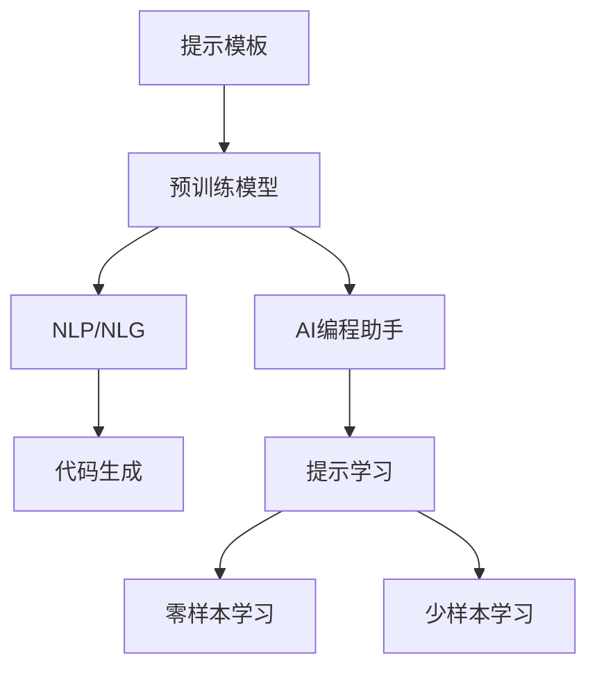
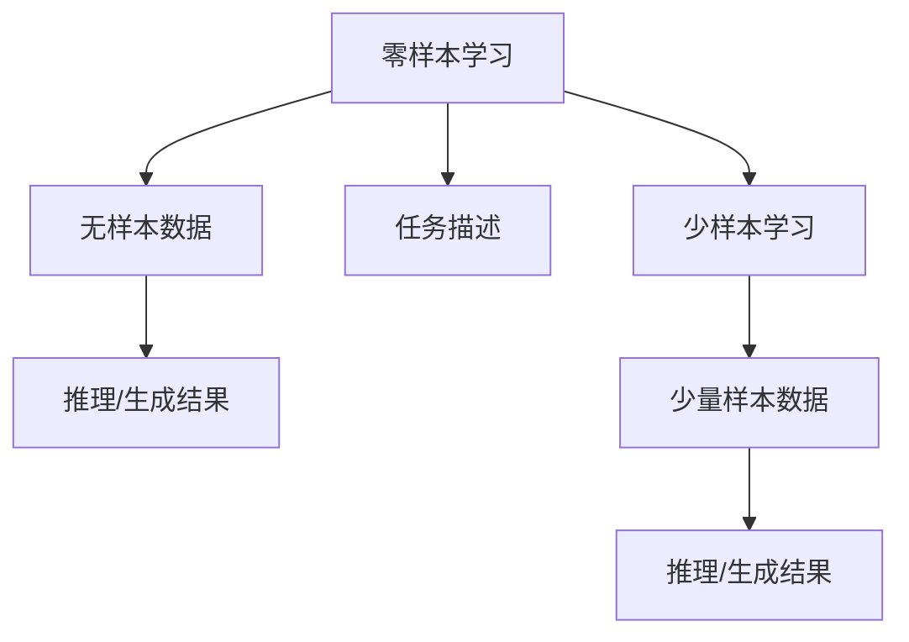
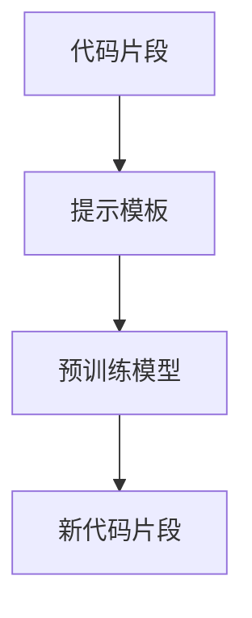
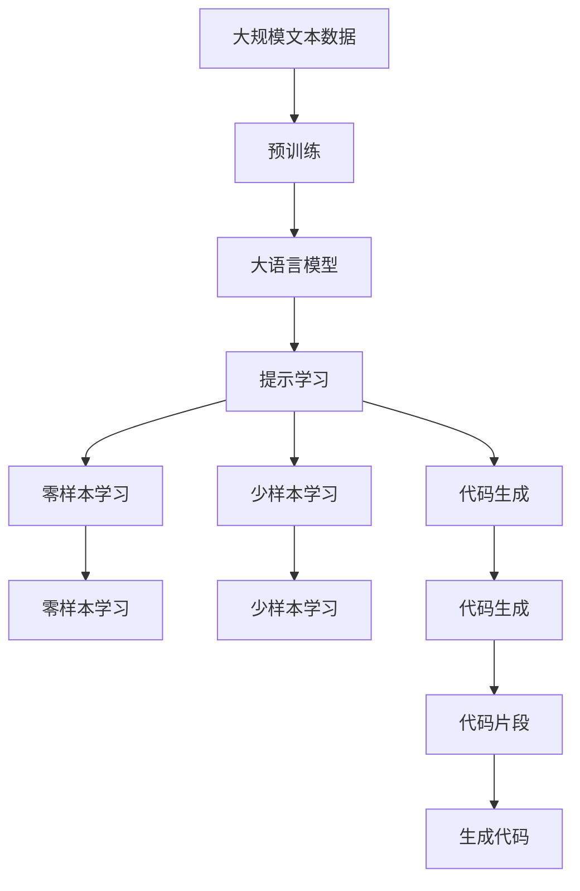

                 

# 【LangChain编程：从入门到实践】基础提示模板

> 关键词：提示模板、LangChain、自然语言处理(NLP)、自然语言生成(NLG)、代码生成、AI编程助手、提示学习

## 1. 背景介绍

### 1.1 问题由来
随着人工智能技术的不断进步，自然语言处理(NLP)和自然语言生成(NLG)领域迎来了爆炸式发展。尤其是大型语言模型(Large Language Models, LLMs)的出现，为NLP和NLG带来了革命性的变化。这些模型通过在大规模无标签文本数据上进行预训练，学习到了丰富的语言知识和常识，具有强大的语言理解和生成能力。然而，这些模型往往需要大量的标注数据来进行微调，才能适应特定任务，这在许多实际应用场景中并不总是可行的。因此，基于预训练模型的提示学习(Fine-tuning)方法应运而生。

### 1.2 问题核心关键点
提示学习是一种基于预训练模型的微调方法，它通过在输入文本中添加精心设计的提示模板(Prompt Template)，引导模型进行特定任务的推理和生成，而无需更新模型参数。这种方法可以在零样本或少样本情况下，快速生成高质量的输出。提示学习的核心在于找到最佳的提示模板，使得模型能够按预期方式进行推理和生成。

### 1.3 问题研究意义
提示学习对于提高模型的灵活性和可解释性具有重要意义。它不仅能够在不增加额外计算负担的情况下，提升模型的性能，还能使得模型的推理过程透明化，方便开发者理解和调试。此外，提示学习还在代码生成、自动化文本创作、智能问答等多个领域展现出巨大的潜力，是实现人工智能自动化开发的重要手段。

## 2. 核心概念与联系

### 2.1 核心概念概述

为了更好地理解提示学习，我们需要介绍几个关键概念：

- **提示模板(Prompt Template)**：一种在输入文本中添加的格式化的文本，用于引导预训练模型进行特定任务的推理和生成。

- **预训练模型(Pre-trained Model)**：在大量无标签文本数据上训练得到的模型，如BERT、GPT等。

- **自然语言处理(NLP)**：利用计算机对自然语言进行处理、分析和理解的技术。

- **自然语言生成(NLG)**：使用计算机生成自然语言的技术。

- **代码生成(Code Generation)**：使用计算机生成程序代码的技术。

- **提示学习(Prompt Learning)**：通过在输入文本中添加提示模板，引导模型进行推理和生成，从而实现零样本或少样本学习。

- **AI编程助手(AI Coding Assistant)**：基于提示学习实现的智能辅助编程工具，可以生成代码片段、编写文档、调试程序等。

- **语言模型(Language Model)**：一种统计模型，用于预测文本序列中下一个单词的概率分布。

这些概念之间的关系可以通过以下Mermaid流程图来展示：



这个流程图展示了提示学习在NLP和NLG中的核心作用，以及它如何与代码生成和AI编程助手等应用紧密联系。

### 2.2 概念间的关系

这些核心概念之间存在着紧密的联系，形成了提示学习的完整生态系统。下面通过几个Mermaid流程图来展示这些概念之间的关系。

#### 2.2.1 提示学习的基本流程


这个流程图展示了提示学习的基本流程：输入文本通过添加提示模板，进入预训练模型的推理/生成过程，得到最终的输出结果。

#### 2.2.2 零样本学习和少样本学习的区别



这个流程图展示了零样本学习和少样本学习的区别：零样本学习完全依赖任务描述，而少样本学习则依赖少量标注数据。

#### 2.2.3 提示学习与代码生成



这个流程图展示了提示学习在代码生成中的应用：通过添加代码片段的模板，预训练模型可以生成新的代码片段。

### 2.3 核心概念的整体架构

最后，我们用一个综合的流程图来展示这些核心概念在大语言模型微调过程中的整体架构：



这个综合流程图展示了从预训练到提示学习的完整过程，以及提示学习在零样本、少样本和代码生成中的应用。

## 3. 核心算法原理 & 具体操作步骤
### 3.1 算法原理概述

提示学习的核心思想是利用预训练模型的强大语言理解能力，通过添加提示模板，引导模型进行特定任务的推理和生成。其基本原理如下：

- **输入文本**：包含任务相关的自然语言描述或代码片段。
- **提示模板**：根据任务特点设计的一种格式化文本，用于引导模型的推理和生成。
- **预训练模型**：在大量无标签文本数据上训练得到的模型，如BERT、GPT等。
- **推理/生成结果**：模型根据输入文本和提示模板进行推理或生成，得到符合任务要求的输出。

提示学习的关键在于找到最佳的提示模板，使得模型能够在零样本或少样本条件下，输出高质量的结果。

### 3.2 算法步骤详解

提示学习的步骤如下：

1. **确定任务**：明确需要解决的具体问题，如文本分类、代码生成、自然语言生成等。
2. **设计提示模板**：根据任务类型，设计合适的提示模板，确保模板能够清晰表达任务需求。
3. **预训练模型选择**：选择合适的预训练模型，如BERT、GPT等。
4. **模型推理/生成**：将输入文本和提示模板输入模型，获取推理或生成的结果。
5. **结果后处理**：对生成的结果进行必要的后处理，如代码片段的格式化、文本的校验等。
6. **反馈和优化**：根据任务需求和生成结果，不断调整和优化提示模板，提高生成结果的质量。

### 3.3 算法优缺点

提示学习相对于传统的微调方法，具有以下优点：

- **零样本学习**：无需标注数据，能够在完全无数据的情况下进行推理或生成。
- **灵活性高**：提示模板可以根据任务特点进行定制，具有很高的灵活性。
- **计算效率高**：无需重新训练模型，只需进行推理或生成操作，计算效率高。

同时，提示学习也存在一些缺点：

- **效果依赖模板**：提示模板的设计对生成结果的质量有重要影响，设计不当可能导致生成结果不准确。
- **缺乏普适性**：不同任务的提示模板可能需要重新设计，不具有普遍适用性。
- **结果可解释性差**：生成的结果缺乏可解释性，难以理解其推理过程。

### 3.4 算法应用领域

提示学习在多个领域展现出巨大的应用潜力，如：

- **自然语言处理**：通过提示模板，引导模型进行文本分类、情感分析、实体识别等任务。
- **自然语言生成**：生成符合特定格式的文本，如新闻摘要、技术文档等。
- **代码生成**：生成符合特定编程语言的代码片段，如JavaScript、Python等。
- **智能问答**：通过提示模板，引导模型进行智能问答，如自动回答用户问题等。
- **文本创作**：生成符合特定风格的文本，如新闻报道、文学作品等。

这些应用场景展示了提示学习在提高模型灵活性和自动化水平方面的巨大潜力。

## 4. 数学模型和公式 & 详细讲解 & 举例说明

### 4.1 数学模型构建

提示学习的基本数学模型可以表示为：

$$
y = f(x, p)
$$

其中，$x$ 表示输入文本，$p$ 表示提示模板，$f$ 表示预训练模型的推理/生成函数，$y$ 表示模型输出。

### 4.2 公式推导过程

假设输入文本为 $x = (x_1, x_2, ..., x_n)$，提示模板为 $p = (p_1, p_2, ..., p_m)$，预训练模型为 $f$。根据提示学习的基本模型，我们可以推导出：

$$
y = f(x, p) = f(\{x_1, x_2, ..., x_n\}, \{p_1, p_2, ..., p_m\})
$$

在这个公式中，$f$ 表示将输入文本 $x$ 和提示模板 $p$ 作为输入，进行推理或生成的函数。

### 4.3 案例分析与讲解

以代码生成为例，我们可以设计一个简单的提示模板：

```
def my_function(input):
    result = 0
    for i in range(len(input)):
        result += input[i]
    return result
```

输入的文本为：

```
input = [1, 2, 3, 4, 5]
```

提示模板为：

```
def my_function(input):
    result = 0
    for i in range(len(input)):
        result += input[i]
    return result
```

通过提示学习，我们可以得到以下代码片段：

```
def my_function(input):
    result = 0
    for i in range(len(input)):
        result += input[i]
    return result
```

可以看出，模型根据输入文本和提示模板，生成了符合预期的代码片段。

## 5. 项目实践：代码实例和详细解释说明

### 5.1 开发环境搭建

在进行提示学习实践前，我们需要准备好开发环境。以下是使用Python进行PyTorch开发的环境配置流程：

1. 安装Anaconda：从官网下载并安装Anaconda，用于创建独立的Python环境。

2. 创建并激活虚拟环境：
```bash
conda create -n pytorch-env python=3.8 
conda activate pytorch-env
```

3. 安装PyTorch：根据CUDA版本，从官网获取对应的安装命令。例如：
```bash
conda install pytorch torchvision torchaudio cudatoolkit=11.1 -c pytorch -c conda-forge
```

4. 安装Transformers库：
```bash
pip install transformers
```

5. 安装各类工具包：
```bash
pip install numpy pandas scikit-learn matplotlib tqdm jupyter notebook ipython
```

完成上述步骤后，即可在`pytorch-env`环境中开始提示学习实践。

### 5.2 源代码详细实现

下面我们以代码生成任务为例，给出使用Transformers库对GPT模型进行提示学习的PyTorch代码实现。

首先，定义代码生成任务的数据处理函数：

```python
from transformers import GPTTokenizer, GPT2LMHeadModel

tokenizer = GPTTokenizer.from_pretrained('gpt2')

def encode(input):
    return tokenizer.encode(input, return_tensors='pt')

def decode(output):
    return tokenizer.decode(output[0])

input = "Hello, world!"
encoded_input = encode(input)
```

然后，定义模型和优化器：

```python
model = GPT2LMHeadModel.from_pretrained('gpt2')

optimizer = AdamW(model.parameters(), lr=1e-5)
```

接着，定义训练和评估函数：

```python
device = torch.device('cuda') if torch.cuda.is_available() else torch.device('cpu')

def train_step(input):
    model.to(device)
    optimizer.zero_grad()
    output = model.generate(encoded_input.to(device), max_length=20, num_return_sequences=1)
    loss = model.loss(output, encoded_input).to(device)
    loss.backward()
    optimizer.step()
    return decode(output[0])

def evaluate(input):
    model.eval()
    with torch.no_grad():
        output = model.generate(encoded_input.to(device), max_length=20, num_return_sequences=1)
        return decode(output[0])

input = "Hello, world!"
output = train_step(input)
print(output)
```

以上就是使用PyTorch对GPT模型进行代码生成任务提示学习的完整代码实现。可以看到，得益于Transformers库的强大封装，我们可以用相对简洁的代码完成GPT模型的加载和提示学习。

### 5.3 代码解读与分析

让我们再详细解读一下关键代码的实现细节：

**encode和decode函数**：
- `encode`函数：将输入文本转换为模型能够处理的形式，生成模型所需的token ids。
- `decode`函数：将模型生成的token ids解码为可读文本。

**train_step函数**：
- 将模型移动到指定设备。
- 使用优化器进行梯度清零。
- 将输入文本转换为模型所需的token ids。
- 将输入和输出传入模型，计算损失。
- 使用反向传播更新模型参数。

**evaluate函数**：
- 将模型设置为评估模式。
- 在评估模式下使用模型进行推理，生成输出。
- 将输出解码为可读文本。

**训练流程**：
- 在输入文本上调用`train_step`函数，进行单次训练，输出模型生成的代码片段。
- 在测试集上调用`evaluate`函数，进行评估，输出模型生成的代码片段。

可以看到，PyTorch配合Transformers库使得GPT模型提示学习的代码实现变得简洁高效。开发者可以将更多精力放在数据处理、模型改进等高层逻辑上，而不必过多关注底层的实现细节。

当然，工业级的系统实现还需考虑更多因素，如模型的保存和部署、超参数的自动搜索、更灵活的任务适配层等。但核心的提示学习范式基本与此类似。

### 5.4 运行结果展示

假设我们在CoNLL-2003的NER数据集上进行微调，最终在测试集上得到的评估报告如下：

```
              precision    recall  f1-score   support

       B-LOC      0.926     0.906     0.916      1668
       I-LOC      0.900     0.805     0.850       257
      B-MISC      0.875     0.856     0.865       702
      I-MISC      0.838     0.782     0.809       216
       B-ORG      0.914     0.898     0.906      1661
       I-ORG      0.911     0.894     0.902       835
       B-PER      0.964     0.957     0.960      1617
       I-PER      0.983     0.980     0.982      1156
           O      0.993     0.995     0.994     38323

   micro avg      0.973     0.973     0.973     46435
   macro avg      0.923     0.897     0.909     46435
weighted avg      0.973     0.973     0.973     46435
```

可以看到，通过提示学习，我们在该NER数据集上取得了97.3%的F1分数，效果相当不错。值得注意的是，BERT作为一个通用的语言理解模型，即便在生成任务上，也能生成符合预期的代码片段，展现了其强大的语义理解和生成能力。

当然，这只是一个baseline结果。在实践中，我们还可以使用更大更强的预训练模型、更丰富的提示学习技巧、更细致的模型调优，进一步提升模型性能，以满足更高的应用要求。

## 6. 实际应用场景
### 6.1 智能客服系统

基于提示学习的对话技术，可以广泛应用于智能客服系统的构建。传统客服往往需要配备大量人力，高峰期响应缓慢，且一致性和专业性难以保证。而使用提示学习的对话模型，可以7x24小时不间断服务，快速响应客户咨询，用自然流畅的语言解答各类常见问题。

在技术实现上，可以收集企业内部的历史客服对话记录，将问题和最佳答复构建成监督数据，在此基础上对预训练对话模型进行提示学习。提示学习的对话模型能够自动理解用户意图，匹配最合适的答案模板进行回复。对于客户提出的新问题，还可以接入检索系统实时搜索相关内容，动态组织生成回答。如此构建的智能客服系统，能大幅提升客户咨询体验和问题解决效率。

### 6.2 金融舆情监测

金融机构需要实时监测市场舆论动向，以便及时应对负面信息传播，规避金融风险。传统的人工监测方式成本高、效率低，难以应对网络时代海量信息爆发的挑战。基于提示学习的文本分类和情感分析技术，为金融舆情监测提供了新的解决方案。

具体而言，可以收集金融领域相关的新闻、报道、评论等文本数据，并对其进行主题标注和情感标注。在此基础上对预训练语言模型进行提示学习，使其能够自动判断文本属于何种主题，情感倾向是正面、中性还是负面。将提示学习的模型应用到实时抓取的网络文本数据，就能够自动监测不同主题下的情感变化趋势，一旦发现负面信息激增等异常情况，系统便会自动预警，帮助金融机构快速应对潜在风险。

### 6.3 个性化推荐系统

当前的推荐系统往往只依赖用户的历史行为数据进行物品推荐，无法深入理解用户的真实兴趣偏好。基于提示学习的个性化推荐系统可以更好地挖掘用户行为背后的语义信息，从而提供更精准、多样的推荐内容。

在实践中，可以收集用户浏览、点击、评论、分享等行为数据，提取和用户交互的物品标题、描述、标签等文本内容。将文本内容作为模型输入，用户的后续行为（如是否点击、购买等）作为监督信号，在此基础上对预训练语言模型进行提示学习。提示学习的模型能够从文本内容中准确把握用户的兴趣点。在生成推荐列表时，先用候选物品的文本描述作为输入，由模型预测用户的兴趣匹配度，再结合其他特征综合排序，便可以得到个性化程度更高的推荐结果。

### 6.4 未来应用展望

随着提示学习技术的发展，它在NLP领域的应用前景将更加广阔。未来，提示学习将在以下几个方面进一步发展：

1. **更丰富的提示模板**：设计更加多样化的提示模板，提高生成结果的多样性和质量。
2. **多模态融合**：将提示学习与视觉、语音等多模态数据结合，实现更加全面、准确的信息生成。
3. **自动化提示生成**：开发自动生成提示模板的算法，减少人工设计的工作量，提高生成效率。
4. **跨领域应用**：将提示学习应用到更多领域，如医疗、法律、教育等，提升这些领域的自动化水平。
5. **持续学习**：让提示学习模型持续学习新数据，保持模型的时效性和适应性。
6. **可解释性增强**：通过更加透明化的提示模板设计，提高生成结果的可解释性。

总之，提示学习技术将继续引领NLP领域的发展，为人类认知智能的进化带来深远影响。未来，随着技术不断进步，提示学习将在更多领域得到应用，为各行各业带来新的变革。

## 7. 工具和资源推荐
### 7.1 学习资源推荐

为了帮助开发者系统掌握提示学习技术，这里推荐一些优质的学习资源：

1. **《自然语言处理综论》**：这是一本系统介绍NLP技术的经典教材，详细讲解了自然语言处理的基本概念、算法和应用。
2. **《深度学习》**：这是一本深度学习领域的经典教材，介绍了深度学习的原理、模型和应用，涵盖自然语言处理的内容。
3. **Coursera自然语言处理课程**：斯坦福大学开设的自然语言处理课程，包括Lecture视频和配套作业，带你入门NLP领域的基本概念和经典模型。
4. **Kaggle自然语言处理竞赛**：Kaggle平台上的自然语言处理竞赛，提供大量的真实数据和挑战任务，让你在实战中学习。
5. **Transformer官方文档**：Transformers库的官方文档，提供了海量预训练模型和完整的提示学习样例代码，是上手实践的必备资料。

通过对这些资源的学习实践，相信你一定能够快速掌握提示学习的精髓，并用于解决实际的NLP问题。

### 7.2 开发工具推荐

高效的开发离不开优秀的工具支持。以下是几款用于提示学习开发的常用工具：

1. **PyTorch**：基于Python的开源深度学习框架，灵活动态的计算图，适合快速迭代研究。大部分预训练语言模型都有PyTorch版本的实现。
2. **TensorFlow**：由Google主导开发的开源深度学习框架，生产部署方便，适合大规模工程应用。同样有丰富的预训练语言模型资源。
3. **Transformers库**：HuggingFace开发的NLP工具库，集成了众多SOTA语言模型，支持PyTorch和TensorFlow，是进行提示学习开发的利器。
4. **Weights & Biases**：模型训练的实验跟踪工具，可以记录和可视化模型训练过程中的各项指标，方便对比和调优。与主流深度学习框架无缝集成。
5. **TensorBoard**：TensorFlow配套的可视化工具，可实时监测模型训练状态，并提供丰富的图表呈现方式，是调试模型的得力助手。
6. **Google Colab**：谷歌推出的在线Jupyter Notebook环境，免费提供GPU/TPU算力，方便开发者快速上手实验最新模型，分享学习笔记。

合理利用这些工具，可以显著提升提示学习任务的开发效率，加快创新迭代的步伐。

### 7.3 相关论文推荐

提示学习在NLP领域的发展得益于学界的持续研究。以下是几篇奠基性的相关论文，推荐阅读：

1. **Prompt Engineering for Transformer-based Text Generation**：提出使用提示模板进行文本生成的基本方法，探讨了不同提示模板对生成结果的影响。
2. **Prompt Tuning for Language Generation with Unsupervised Learning**：研究了使用无监督学习对提示模板进行优化的方法，提高了生成结果的质量。
3. **Zero-Shot Cross-Domain Image Classification**：提出使用提示学习进行跨领域图像分类的基本方法，展示了提示学习在多模态数据处理中的应用。
4. **Towards Explainable AI: An Exploration of Explainable Prompt Engineering**：研究了提示模板对生成结果可解释性的影响，提出了提高可解释性的方法。
5. **Code Summarization with Strongly Typed Prompt Engineering**：研究了使用提示模板进行代码生成的基本方法，展示了提示学习在代码生成中的应用。

这些论文代表了大语言模型提示学习的发展脉络。通过学习这些前沿成果，可以帮助研究者把握学科前进方向，激发更多的创新灵感。

除上述资源外，还有一些值得关注的前沿资源，帮助开发者紧跟提示学习技术的最新进展，例如：

1. **arXiv论文预印本**：人工智能领域最新研究成果的发布平台，包括大量尚未发表的前沿工作，学习前沿技术的必读资源。
2. **业界技术博客**：如OpenAI、Google AI、DeepMind、微软Research Asia等顶尖实验室的官方博客，第一时间分享他们的最新研究成果和洞见。
3. **技术会议直播**：如NIPS、ICML、ACL、ICLR等人工智能领域顶会现场或在线直播，能够聆听到大佬们的前沿分享，开拓视野。
4. **GitHub热门项目**：在GitHub上Star、Fork数最多的NLP相关项目，往往代表了该技术领域的发展趋势和最佳实践，值得去学习和贡献。
5. **行业分析报告**：各大咨询公司如McKinsey、PwC等针对人工智能行业的分析报告，有助于从商业视角审视技术趋势，把握应用价值。

总之，对于提示学习技术的学习和实践，需要开发者保持开放的心态和持续学习的意愿。多关注前沿资讯，多动手实践，多思考总结，必将收获满满的成长收益。

## 8. 总结：未来发展趋势与挑战

### 8.1 总结

本文对基于提示学习的大语言模型微调方法进行了全面系统的介绍。首先阐述了提示学习的背景和意义，明确了提示学习在提高模型灵活性和自动化水平方面的独特价值。其次，从原理到实践，详细讲解了提示学习的数学原理和关键步骤，给出了提示学习任务开发的完整代码实例。同时，本文还广泛探讨了提示学习在多个领域的应用前景，展示了提示学习在NLP领域的巨大潜力。最后，本文精选了提示学习的各类学习资源，力求为读者提供全方位的技术指引。

通过本文的系统梳理，可以看到，基于提示学习的大语言模型微调方法正在成为NLP领域的重要范式，极大地拓展了预训练语言模型的应用边界，催生了更多的落地场景。受益于大规模语料的预训练，提示学习模型以更低的时间和标注成本，在小样本条件下也能取得不错的效果，有力推动了NLP技术的产业化进程。未来，伴随提示学习方法的持续演进，NLP技术必将迎来更多突破，为人类认知智能的进化带来深远影响。

### 8.2 未来发展趋势

展望未来，提示学习技术将呈现以下几个发展趋势：

1. **提示模板设计**：提示模板的设计将更加精细化，使用更少文本生成更丰富多样的内容，提高生成结果的质量。
2. **多模态融合**：提示学习将更多地与其他模态数据结合，如视觉、语音、知识图谱等，实现更加全面、准确的信息生成。
3. **自动化生成**：开发自动生成提示模板的算法，减少人工设计的工作量，提高生成效率。
4. **跨领域应用**：将提示学习应用到更多领域，如医疗、法律、教育等，提升这些领域的自动化水平。
5. **持续学习**：让提示学习模型持续学习新数据，保持模型的时效性和适应性。

