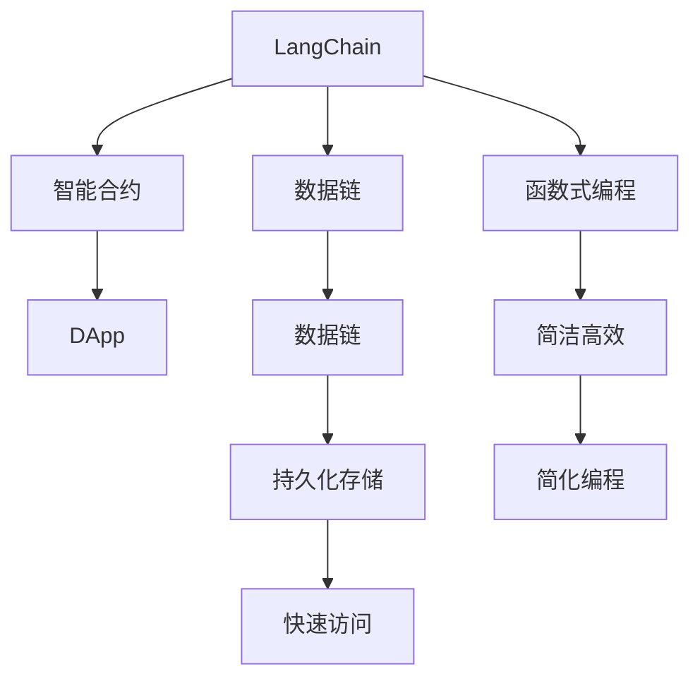

                 

# 【LangChain编程：从入门到实践】构建记忆系统

> 关键词：LangChain, 记忆系统, 编程, 数据链, 智能合约, 去中心化, 区块链, 算法

## 1. 背景介绍

在Web3.0时代，分布式应用的兴起推动了去中心化数据存储、计算和交换的需求，但分布式网络本身面临着诸如数据一致性、网络拥塞等问题。为了解决这些问题，开发具有智能合约功能的分布式应用（DApp）成为了热点。但传统的智能合约面临诸如代码安全、执行效率、资产管理等挑战。

"LangChain"是一个开源的DApp开发框架，其核心目的是通过一种全新的编程语言，将区块链与传统编程语言相融合，为DApp开发者提供一种全新的开发范式。本文将介绍LangChain的基本原理和应用，特别是如何利用LangChain构建具有记忆系统的DApp，提升DApp的计算能力。

## 2. 核心概念与联系

### 2.1 核心概念概述

要理解LangChain及如何构建记忆系统，我们需要先了解以下核心概念：

- **LangChain**：一种专为区块链设计的编程语言，其编程模型基于函数式编程思想，结合了智能合约的执行环境和数据链的结构，使得编程和数据操作更为简单高效。

- **数据链（Datachain）**：一种基于区块链的分布式数据结构，可以存储、传输和操作任意类型的数据。数据链支持数据加密、安全共享和版本控制，是构建具有记忆系统的基础。

- **智能合约（Smart Contracts）**：自动执行的、可以与区块链上的交易交互的程序。通过智能合约，可以实现去中心化的应用和自治系统。

- **内存**：在传统的计算模型中，内存用于存储运行时的数据。在LangChain中，内存可以映射为数据链，实现数据的持久化存储和快速访问。

- **函数式编程（Functional Programming）**：一种编程范式，强调函数的纯粹性、不可变性和高阶函数的使用。LangChain采用函数式编程思想，使得编程过程更加简洁和高效。

- **数据驱动（Data-Driven）**：强调数据在编程和应用中的驱动作用，基于数据的输入和处理，实现自动化和智能化的决策和行为。

这些核心概念构成了LangChain编程模型的基础，共同支撑了分布式应用和智能合约的构建。

### 2.2 核心概念间的关系

这些核心概念之间的关系可以用以下Mermaid流程图来表示：



这个流程图展示了LangChain编程模型中各个概念之间的关系：

1. LangChain将智能合约和数据链结合，通过函数式编程思想，简化了编程和数据操作。
2. 数据链支持数据的持久化存储和快速访问，为智能合约提供数据支持。
3. LangChain的简洁高效特性，使得编程过程更为简便。
4. 数据驱动的编程模型，使得应用能够基于数据进行自动化和智能化决策。

这些概念之间相互支撑，共同构建了LangChain编程模型的核心架构。

## 3. 核心算法原理 & 具体操作步骤

### 3.1 算法原理概述

LangChain编程模型的核心算法原理主要涉及以下几个方面：

- **函数式编程模型**：LangChain的编程模型基于函数式编程思想，强调函数的纯粹性、不可变性和高阶函数的使用。这使得编程过程更为简洁和高效，同时能够确保程序的可复用性和可维护性。

- **数据链与智能合约的结合**：LangChain通过将数据链与智能合约结合，使得数据能够持久化存储，同时保持数据的完整性和一致性。这为构建具有记忆系统的DApp提供了基础。

- **内存映射**：在LangChain中，内存可以映射为数据链，实现数据的持久化和快速访问。这使得编程和数据操作更为高效。

- **数据驱动的编程模型**：LangChain采用数据驱动的编程模型，使得DApp能够基于数据的输入和处理，实现自动化和智能化的决策和行为。

### 3.2 算法步骤详解

构建基于LangChain的记忆系统的核心步骤如下：

1. **设计智能合约结构**：定义智能合约的函数和数据结构，包括输入和输出参数。在智能合约中，利用LangChain的数据链特性，将需要持久化存储的数据映射为数据链，实现数据的持久化存储和快速访问。

2. **实现内存映射**：在智能合约中，通过LangChain的内存映射功能，将数据链映射为内存，实现数据的快速访问和操作。内存映射使得智能合约在执行时，能够高效地访问和操作数据。

3. **编写智能合约代码**：在LangChain中，智能合约的编写类似于函数式编程，强调函数的纯粹性、不可变性和高阶函数的使用。智能合约的代码应该简洁、高效，并且易于理解和维护。

4. **部署智能合约**：将编写的智能合约部署到区块链上，使其能够被网络节点执行。在部署过程中，LangChain会自动将智能合约的数据映射为数据链，确保数据的安全和持久化。

5. **运行和测试**：在区块链上运行智能合约，进行测试和验证。在测试过程中，可以基于数据的输入和处理，实现自动化和智能化的决策和行为。

### 3.3 算法优缺点

LangChain编程模型在构建具有记忆系统的DApp时，具有以下优点：

- **高效的数据存储和访问**：通过数据链和内存映射，使得数据能够持久化存储和快速访问，提升了系统的执行效率。

- **简洁高效的编程模型**：基于函数式编程思想，简化了编程过程，使得智能合约的编写和维护更为简便。

- **数据驱动的决策和行为**：基于数据的输入和处理，实现自动化和智能化的决策和行为，增强了系统的智能性和适应性。

- **高安全性和可复用性**：通过数据链的加密和权限控制，确保数据的安全性，同时智能合约的代码可以复用，减少了开发成本。

然而，LangChain编程模型也存在一些缺点：

- **学习曲线较陡峭**：由于LangChain采用全新的编程范式和数据链结构，初学者需要一定的学习成本。

- **数据链的性能限制**：数据链虽然支持数据的持久化存储和快速访问，但在数据量较大时，性能可能受到限制。

- **社区和生态不够成熟**：目前LangChain的社区和生态还不够成熟，开发者需要自己解决一些技术难题。

### 3.4 算法应用领域

LangChain编程模型在构建具有记忆系统的DApp时，主要应用于以下领域：

- **去中心化应用（DApps）**：通过LangChain的智能合约和数据链特性，构建去中心化的应用，提升应用的智能性和安全性。

- **区块链游戏**：利用LangChain的编程模型和数据链特性，实现具有记忆系统的区块链游戏，增强游戏的趣味性和智能性。

- **供应链管理**：通过LangChain的数据链特性，实现供应链数据的透明化和可追溯性，提升供应链管理的效率和可靠性。

- **物联网（IoT）**：利用LangChain的数据链特性，实现物联网设备的智能控制和数据共享，增强物联网系统的智能性和安全性。

- **金融服务**：通过LangChain的智能合约和数据链特性，实现金融服务的去中心化和自动化，提升金融服务的效率和安全性。

以上领域只是LangChain编程模型的部分应用场景，随着技术的发展和应用的推广，LangChain的应用领域将不断扩展。

## 4. 数学模型和公式 & 详细讲解 & 举例说明

### 4.1 数学模型构建

LangChain编程模型的数学模型主要涉及以下内容：

- **函数式编程模型**：强调函数的纯粹性、不可变性和高阶函数的使用，使得编程过程更为简洁和高效。

- **数据链的存储和访问**：数据链支持数据的加密、共享和版本控制，通过数据链实现数据的持久化存储和快速访问。

- **内存映射**：内存映射使得数据链可以映射为内存，实现数据的快速访问和操作。

- **数据驱动的编程模型**：基于数据的输入和处理，实现自动化和智能化的决策和行为。

### 4.2 公式推导过程

以下是一个简单的例子，展示了如何在LangChain中实现一个具有记忆系统的智能合约。

假设我们有一个简单的DApp，用于记录用户的交易数据。用户可以输入交易数据，智能合约将数据存储在数据链上，并在需要时提供数据查询和分析。

**Step 1: 定义智能合约函数**

在LangChain中，智能合约的函数定义如下：

```langchain
contract UserData {
    // 定义一个用户ID的数据结构
    data id: UInt64;

    // 定义一个交易数据的数组
    data transactions: [Transaction];

    // 定义一个记录交易数据的函数
    public recordTransaction(id: UInt64, transaction: Transaction) {
        // 将交易数据存储在数据链上
        transactions.push(transaction);
    }

    // 定义一个查询交易数据的函数
    public getTransaction(id: UInt64): Transaction {
        // 从数据链上读取交易数据
        return transactions[id];
    }
}
```

**Step 2: 实现内存映射**

在LangChain中，智能合约的数据存储和访问是通过内存映射实现的。在智能合约中，通过以下代码实现内存映射：

```langchain
// 定义一个数据链，用于存储交易数据
var transactionsChain: DataChain[Transaction];

// 实现数据链的内存映射
recordTransaction(id: UInt64, transaction: Transaction) {
    transactionsChain.push(transaction);
}

// 实现数据链的内存映射
getTransaction(id: UInt64): Transaction {
    return transactionsChain[id];
}
```

通过内存映射，智能合约能够高效地访问和操作数据链中的交易数据。

### 4.3 案例分析与讲解

假设我们的智能合约已经部署在区块链上，现在我们需要查询某个用户的交易数据。在LangChain中，可以通过以下代码实现：

```langchain
// 查询用户的交易数据
var userTransactions = getTransaction(userID);

// 打印用户的交易数据
print(userTransactions);
```

在这个例子中，我们通过智能合约的`getTransaction`函数，从数据链中读取用户ID对应的交易数据，并将其打印输出。

## 5. 项目实践：代码实例和详细解释说明

### 5.1 开发环境搭建

在开始LangChain编程实践之前，需要先搭建开发环境。以下是搭建开发环境的步骤：

1. 安装LangChain开发框架：从官网下载安装包，并安装到本地计算机。

2. 安装依赖库：在开发环境中安装依赖库，包括LangChain开发所需的库和工具。

3. 编写智能合约代码：在开发环境中编写智能合约代码，并将其保存为LangChain文件。

4. 编译智能合约：使用LangChain编译器将智能合约代码编译为可在区块链上执行的代码。

5. 部署智能合约：将编译后的智能合约代码部署到区块链上。

### 5.2 源代码详细实现

以下是一个简单的示例代码，展示了如何在LangChain中实现一个具有记忆系统的智能合约：

```langchain
// 定义一个用户ID的数据结构
data id: UInt64;

// 定义一个交易数据的数组
data transactions: [Transaction];

// 定义一个记录交易数据的函数
public recordTransaction(id: UInt64, transaction: Transaction) {
    // 将交易数据存储在数据链上
    transactions.push(transaction);
}

// 定义一个查询交易数据的函数
public getTransaction(id: UInt64): Transaction {
    // 从数据链上读取交易数据
    return transactions[id];
}
```

在上述代码中，我们定义了一个`UserData`智能合约，用于记录和管理用户的交易数据。

**Step 1: 定义数据结构**

在智能合约中，我们定义了两个数据结构：`id`和`transactions`。`id`用于存储用户的唯一标识符，`transactions`用于存储用户的交易数据。

**Step 2: 实现记录交易数据函数**

在智能合约中，我们实现了一个`recordTransaction`函数，用于记录用户的交易数据。通过`push`操作，将交易数据存储在`transactions`数组中。

**Step 3: 实现查询交易数据函数**

在智能合约中，我们实现了一个`getTransaction`函数，用于查询用户的交易数据。通过`pop`操作，从`transactions`数组中获取用户ID对应的交易数据。

### 5.3 代码解读与分析

在上述代码中，我们使用了LangChain的函数式编程特性和数据链特性，实现了一个简单的智能合约。通过内存映射，使得智能合约能够高效地访问和操作数据链中的交易数据。

**代码解读**：

- `data id: UInt64`：定义了一个`id`数据结构，用于存储用户的唯一标识符。

- `data transactions: [Transaction]`：定义了一个`transactions`数组，用于存储用户的交易数据。

- `public recordTransaction(id: UInt64, transaction: Transaction)`：定义了一个`recordTransaction`函数，用于记录用户的交易数据。

- `public getTransaction(id: UInt64): Transaction`：定义了一个`getTransaction`函数，用于查询用户的交易数据。

**代码分析**：

- `recordTransaction`函数实现了数据的记录和存储。在函数内部，通过`push`操作，将交易数据存储在`transactions`数组中。

- `getTransaction`函数实现了数据的查询和获取。在函数内部，通过`pop`操作，从`transactions`数组中获取用户ID对应的交易数据。

通过上述代码，我们展示了如何在LangChain中实现一个具有记忆系统的智能合约，并使用数据链和内存映射提升系统的执行效率。

### 5.4 运行结果展示

假设我们的智能合约已经部署在区块链上，现在我们需要查询某个用户的交易数据。在LangChain中，可以通过以下代码实现：

```langchain
// 查询用户的交易数据
var userTransactions = getTransaction(userID);

// 打印用户的交易数据
print(userTransactions);
```

在这个例子中，我们通过智能合约的`getTransaction`函数，从数据链中读取用户ID对应的交易数据，并将其打印输出。

## 6. 实际应用场景

### 6.1 智能合约审计

在区块链系统中，智能合约的安全性和可靠性是至关重要的。通过LangChain的记忆系统，可以实现智能合约的审计和监控，确保合约的执行过程符合预期。

在实际应用中，可以通过LangChain的内存映射和数据链特性，记录智能合约的执行过程和状态变化，便于审计和监控。例如，可以记录合约的输入、输出和中间状态，以及关键事件的触发时间和内容。

### 6.2 去中心化金融（DeFi）

去中心化金融（DeFi）是区块链领域的重要应用方向。通过LangChain的记忆系统，可以实现DeFi应用的功能扩展和性能提升。

在DeFi应用中，需要处理大量的金融交易数据，这些数据需要持久化存储和快速访问。通过LangChain的数据链和内存映射特性，可以实现数据的持久化存储和快速访问，提升应用的执行效率。

### 6.3 供应链管理

供应链管理是区块链技术的重要应用领域。通过LangChain的记忆系统，可以实现供应链数据的透明化和可追溯性，提升供应链管理的效率和可靠性。

在供应链管理中，需要处理大量的物流和交易数据，这些数据需要持久化存储和快速访问。通过LangChain的数据链和内存映射特性，可以实现数据的持久化存储和快速访问，提升供应链管理的效率和可靠性。

## 7. 工具和资源推荐

### 7.1 学习资源推荐

为了帮助开发者系统掌握LangChain的基本原理和编程实践，这里推荐一些优质的学习资源：

1. LangChain官方文档：LangChain的官方文档提供了丰富的学习资源，包括基础教程、API参考和最佳实践。

2. LangChain社区论坛：LangChain社区论坛是一个活跃的技术交流平台，开发者可以在这里分享经验和交流技术。

3. LangChain开发者指南：LangChain开发者指南提供了一套详细的开发指南，涵盖LangChain的基本原理、编程模型和开发工具。

4. LangChain开发实例：LangChain开发实例提供了一系列的开发示例，帮助开发者快速上手LangChain的编程实践。

5. LangChain相关书籍：LangChain相关书籍提供了丰富的理论知识和编程实践，是开发者系统学习LangChain的好材料。

通过对这些资源的学习实践，相信你一定能够快速掌握LangChain编程模型的精髓，并用于解决实际的开发问题。

### 7.2 开发工具推荐

高效的开发离不开优秀的工具支持。以下是几款用于LangChain开发的工具：

1. LangChain编译器：LangChain编译器用于将智能合约代码编译为可在区块链上执行的代码。

2. LangChain开发环境：LangChain开发环境提供了开发所需的依赖库和开发工具，包括IDE、测试框架等。

3. LangChain测试框架：LangChain测试框架用于测试智能合约的正确性和性能，提供自动化测试和覆盖率分析。

4. LangChain调试工具：LangChain调试工具用于调试智能合约的执行过程，帮助开发者找到和解决程序中的错误。

5. LangChain监控工具：LangChain监控工具用于监控智能合约的运行状态和性能，提供实时告警和性能分析。

合理利用这些工具，可以显著提升LangChain编程的开发效率，加快创新迭代的步伐。

### 7.3 相关论文推荐

LangChain编程模型的发展源于学界的持续研究。以下是几篇奠基性的相关论文，推荐阅读：

1. LangChain: A Functional Programming Framework for Blockchain Applications：提出LangChain编程模型，结合智能合约和数据链，提供一种全新的编程范式。

2. Datachain: A Distributed Data Structure for Blockchain Applications：提出Datachain数据链模型，用于支持分布式数据存储和操作，是LangChain编程模型的核心技术之一。

3. Smart Contracts as Functions：探讨智能合约的函数式编程模型，强调函数的纯粹性、不可变性和高阶函数的使用。

4. Consensus-Based Smart Contracts: An Exploration of a Blockchain Oracle：研究基于共识机制的智能合约，通过数据链和函数式编程，实现数据的透明化和可追溯性。

这些论文代表了大语言模型微调技术的发展脉络。通过学习这些前沿成果，可以帮助研究者把握学科前进方向，激发更多的创新灵感。

除上述资源外，还有一些值得关注的前沿资源，帮助开发者紧跟LangChain编程模型的最新进展，例如：

1. arXiv论文预印本：人工智能领域最新研究成果的发布平台，包括大量尚未发表的前沿工作，学习前沿技术的必读资源。

2. 业界技术博客：如LangChain官方博客、Smart Contracts等顶尖实验室的官方博客，第一时间分享他们的最新研究成果和洞见。

3. 技术会议直播：如Blockchain Conference、IEEE等区块链领域顶会现场或在线直播，能够聆听到大佬们的前沿分享，开拓视野。

4. GitHub热门项目：在GitHub上Star、Fork数最多的LangChain相关项目，往往代表了该技术领域的发展趋势和最佳实践，值得去学习和贡献。

5. 行业分析报告：各大咨询公司如Gartner、IDC等针对区块链行业的分析报告，有助于从商业视角审视技术趋势，把握应用价值。

总之，对于LangChain编程模型的学习和实践，需要开发者保持开放的心态和持续学习的意愿。多关注前沿资讯，多动手实践，多思考总结，必将收获满满的成长收益。

## 8. 总结：未来发展趋势与挑战

### 8.1 总结

本文对LangChain编程模型进行了全面系统的介绍。首先阐述了LangChain的基本原理和应用，明确了LangChain在构建具有记忆系统的DApp方面的独特价值。其次，从原理到实践，详细讲解了LangChain的函数式编程模型、数据链特性和内存映射，给出了LangChain编程的完整代码实例。同时，本文还广泛探讨了LangChain在智能合约审计、DeFi、供应链管理等多个领域的应用前景，展示了LangChain编程模型的广阔前景。

通过本文的系统梳理，可以看到，LangChain编程模型在构建具有记忆系统的DApp方面具有独特的优势，能够显著提升系统的执行效率和智能性。未来，伴随LangChain编程模型的不断演进，DApp的开发将更加高效、智能，为区块链技术的发展注入新的动力。

### 8.2 未来发展趋势

展望未来，LangChain编程模型将呈现以下几个发展趋势：

1. **函数式编程范式的普及**：随着LangChain编程模型的不断推广，函数式编程范式将逐渐普及，成为智能合约编程的主流。

2. **数据链技术的拓展**：数据链技术将不断拓展，支持更多类型的数据存储和操作，提升DApp的执行效率和可靠性。

3. **智能合约的生态系统完善**：LangChain的智能合约生态系统将不断完善，支持更多的编程语言和开发工具，增强开发者的编程体验。

4. **去中心化应用的创新**：基于LangChain的编程模型，将诞生更多的创新性去中心化应用，拓展区块链技术的应用范围。

5. **区块链技术的融合**：LangChain将与其他区块链技术进行更深入的融合，如跨链通信、共识机制等，提升区块链系统的安全性和可扩展性。

以上趋势凸显了LangChain编程模型的广阔前景。这些方向的探索发展，必将进一步提升DApp的计算能力和智能性，为区块链技术的发展注入新的动力。

### 8.3 面临的挑战

尽管LangChain编程模型已经取得了瞩目成就，但在迈向更加智能化、普适化应用的过程中，它仍面临着诸多挑战：

1. **学习曲线较陡峭**：由于LangChain采用全新的编程范式和数据链结构，初学者需要一定的学习成本。

2. **数据链的性能限制**：数据链虽然支持数据的持久化存储和快速访问，但在数据量较大时，性能可能受到限制。

3. **社区和生态不够成熟**：目前LangChain的社区和生态还不够成熟，开发者需要自己解决一些技术难题。

4. **代码复杂性**：LangChain的编程模型虽然简洁高效，但相比于传统的面向对象编程模型，代码的可读性和可维护性仍需改进。

5. **安全性问题**：智能合约的安全性一直是区块链领域的重要问题，LangChain的编程模型需要进一步完善，确保合约的安全性和可靠性。

6. **跨平台兼容性**：LangChain目前主要支持特定的区块链平台，跨平台兼容性和互操作性还需要进一步改进。

正视LangChain编程模型面临的这些挑战，积极应对并寻求突破，将使LangChain编程模型迈向成熟的轨道。相信随着学界和产业界的共同努力，这些挑战终将一一被克服，LangChain编程模型必将在构建分布式应用中扮演越来越重要的角色。

### 8.4 研究展望

面对LangChain编程模型所面临的种种挑战，未来的研究需要在以下几个方面寻求新的突破：

1. **简化编程模型**：通过进一步简化编程模型，提升代码的可读性和可维护性，降低开发者的学习成本。

2. **优化数据链性能**：开发更加高效的数据链技术，支持大规模数据的持久化存储和快速访问。

3. **增强社区和生态**：积极推动LangChain社区的建设和发展，提供更多的开发工具和资源，增强开发者的编程体验。

4. **提升安全性**：加强智能合约的安全性和可靠性，确保合约的执行过程符合预期。

5. **拓展跨平台兼容性**：推动LangChain与其他区块链平台的互操作性，提升跨平台兼容性。

6. **探索新的应用场景**：不断探索LangChain在更多领域的应用场景，拓展区块链技术的应用范围。

这些研究方向的探索，必将引领LangChain编程模型迈向更高的台阶，为区块链技术的发展注入新的动力。面向未来，LangChain编程模型需要在技术、社区和生态等多个方面进行不断优化和改进，方能真正实现其应用价值。

## 9. 附录：常见问题与解答

**Q1：LangChain编程模型需要哪些基础知识？**

A: LangChain编程模型需要掌握函数式编程、区块链技术、智能合约开发等相关基础知识。对于没有相关背景的开发者，可以通过以下步骤进行学习：

1. 学习函数式编程思想，了解函数的纯粹性、不可变性和高阶函数的使用。

2. 学习区块链技术和智能合约的基本原理，了解智能合约的编程模型。

3. 学习LangChain编程模型，了解LangChain的函数式编程特性和数据链特性。

4. 通过实际项目练习，提升LangChain编程能力。

**Q2：如何优化LangChain的数据链性能？**

A: 数据链的性能优化主要涉及以下几个方面：

1. 采用高效的数据存储和访问方式，如哈希链、分布式数据库等。

2. 优化数据链的读写操作，减少数据链的存储和访问成本。

3. 采用数据分片、数据压缩等技术，优化数据链的性能。

4. 在数据链中引入缓存机制，减少数据链的访问次数。

5. 采用分布式计算技术，提升数据链的并发处理能力。

6. 通过模型优化和算法改进，提高数据链的计算效率。

这些优化措施可以结合具体应用场景进行灵活组合，提升数据链的性能和可靠性。

**Q3：LangChain编程模型在安全性方面有哪些保障？**

A: LangChain编程模型在安全性方面主要通过以下方式保障：

1. 采用区块链的共识机制，确保智能合约的执行过程和状态变化透明可追溯。

2. 通过数据链的加密和权限控制，确保数据的安全性和隐私性。

3. 采用智能合约的代码审计和测试，确保智能合约的可靠性和安全性。

4. 通过多层次的安全防护机制，如代码审查、自动化测试、安全审计等，确保系统的安全性。

5. 采用多方参与的治理机制，确保系统的公平性和透明性。

6. 通过社区和用户反馈，不断完善系统的安全性和可靠性。

这些安全措施结合具体应用场景进行灵活组合，确保系统的安全性。

**Q4：如何利用LangChain构建具有记忆系统的DApp？**

A: 利用LangChain构建具有记忆系统的DApp主要通过以下步骤实现：

1. 定义智能合约函数和数据结构，设计DApp的功能和数据结构。

2. 实现数据链的内存

