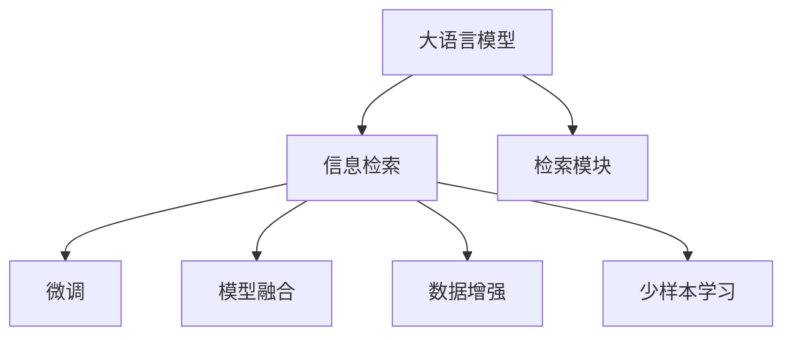

                 

# 【LangChain编程：从入门到实践】检索模块

> 关键词：
- LangChain
- 检索模块
- 自然语言处理
- 语言模型
- 信息检索
- 模型微调
- 数据增强
- 零样本学习

## 1. 背景介绍

### 1.1 问题由来

随着互联网信息量的爆炸性增长，如何有效获取和利用信息成为了一个重要问题。传统的文本检索技术虽然较为成熟，但在大规模、多源、多语文本环境中，其效果常常不尽人意。而基于大语言模型的检索技术，凭借其强大的语言理解和生成能力，正逐渐成为信息检索领域的明星方法。

### 1.2 问题核心关键点

大语言模型的检索模块主要涉及以下几个关键点：

- 数据准备：收集需要检索的文本数据集，并进行预处理。
- 模型选择：选择合适的预训练语言模型，如BERT、GPT等。
- 检索框架搭建：设计检索模型，并进行微调。
- 推理部署：将微调后的模型部署到实际应用中，进行信息检索。

本节将详细介绍这些关键点，帮助读者理解大语言模型检索模块的构建流程。

### 1.3 问题研究意义

在信息爆炸的时代，如何高效、准确地检索信息，对于各类应用场景都至关重要。大语言模型检索模块不仅能够提升信息检索的精度和效率，还能处理海量多源数据，支持多语言检索。其研究成果在搜索系统、推荐系统、智能客服等领域都具有重要应用价值。

## 2. 核心概念与联系

### 2.1 核心概念概述

在进行大语言模型检索模块的开发和实践时，需要理解以下核心概念：

- **大语言模型**：如BERT、GPT等，通过在大规模无标签文本数据上进行预训练，学习通用语言表示。
- **信息检索**：在文本库中查找与查询文本最匹配的结果，应用广泛，包括搜索引擎、推荐系统等。
- **检索模块**：在大语言模型的基础上，构建专门用于信息检索的模型，优化检索性能。
- **微调**：在预训练模型的基础上，通过有监督学习调整模型参数，使其更适合特定的信息检索任务。
- **模型融合**：将多个模型输出进行融合，提高检索效果。
- **数据增强**：通过改写、回译等方式丰富训练数据，提升模型泛化能力。
- **少样本学习**：在少量样本上进行微调，减少标注成本。

这些概念之间存在紧密联系，共同构成了大语言模型检索模块的开发框架。下面通过一个Mermaid流程图展示这些概念的关系：



### 2.2 概念间的关系

这些概念之间通过一个简单的图示展示了它们在大语言模型检索模块中的关系：

- 大语言模型通过预训练学习通用语言表示，是信息检索的基础。
- 检索模块在大语言模型的基础上进行特定任务优化，是信息检索的核心。
- 微调通过有监督学习调整模型参数，提高检索精度。
- 模型融合通过组合多个模型的输出，提升检索效果。
- 数据增强通过丰富训练数据，增强模型泛化能力。
- 少样本学习通过在少量样本上进行微调，减少标注成本。

这些概念的相互配合，使得大语言模型检索模块能够在大规模、多源、多语环境下，提供高效的文本检索服务。

## 3. 核心算法原理 & 具体操作步骤

### 3.1 算法原理概述

大语言模型检索模块的核心算法原理是基于向量空间模型（Vector Space Model, VSM）的检索方法。通过将查询和文本表示为向量，计算它们之间的余弦相似度，从而找到最匹配的文本。

- **查询表示**：使用预训练语言模型将查询文本编码成向量。
- **文本表示**：同样使用预训练语言模型将文本库中所有文本编码成向量。
- **相似度计算**：计算查询向量与每个文本向量之间的余弦相似度。
- **检索排序**：根据相似度排序，返回与查询最匹配的文本。

### 3.2 算法步骤详解

具体步骤如下：

**Step 1: 准备预训练模型和数据集**

1. 选择合适的预训练语言模型，如BERT、GPT等。
2. 准备需要检索的文本数据集，并进行预处理，如分词、去停用词等。

**Step 2: 搭建检索框架**

1. 设计检索模型框架，通常包括查询表示层、文本表示层和相似度计算层。
2. 将预训练语言模型集成到检索模型中，作为查询表示层或文本表示层。

**Step 3: 微调检索模型**

1. 收集标注数据，标注文本库中每个文本的标题或摘要，作为训练集。
2. 使用标注数据对检索模型进行微调，优化相似度计算方法。
3. 在验证集上评估模型性能，根据评估结果调整模型参数。

**Step 4: 推理部署**

1. 将微调后的检索模型部署到实际应用中，如搜索引擎、推荐系统等。
2. 处理用户查询，生成检索结果，并进行展示。

### 3.3 算法优缺点

大语言模型检索模块具有以下优点：

- **精度高**：基于预训练语言模型，检索模块能够学习到丰富的语言知识和文本表示，提升检索精度。
- **泛化能力强**：适用于大规模、多源、多语文本环境。
- **计算高效**：向量空间模型计算简单，检索效率高。

同时，也存在以下缺点：

- **模型复杂**：检索模块涉及多个组件，构建复杂。
- **训练成本高**：需要收集大量标注数据，标注成本高。
- **可解释性差**：检索模块作为"黑盒"模型，难以解释其内部工作机制。

### 3.4 算法应用领域

大语言模型检索模块在以下几个领域有广泛应用：

- **搜索引擎**：提升搜索结果的相关性和多样性。
- **推荐系统**：推荐与用户查询最匹配的内容。
- **智能客服**：自动回答用户查询，提升服务效率。
- **文本摘要**：提取文本中的关键信息，生成摘要。

## 4. 数学模型和公式 & 详细讲解 & 举例说明

### 4.1 数学模型构建

大语言模型检索模块的数学模型主要基于向量空间模型（VSM）。设查询文本为 $q$，文本库中第 $i$ 个文本为 $d_i$。查询文本和文本 $d_i$ 的表示向量分别为 $q_v$ 和 $d_{i,v}$。余弦相似度为：

$$
sim(q_v, d_{i,v}) = \frac{q_v \cdot d_{i,v}}{\|q_v\| \cdot \|d_{i,v}\|}
$$

其中 $\cdot$ 表示向量点乘，$\| \cdot \|$ 表示向量范数。

### 4.2 公式推导过程

查询文本和文本 $d_i$ 的向量表示可以通过预训练语言模型得到：

$$
q_v = \text{BERT}(q)
$$

$$
d_{i,v} = \text{BERT}(d_i)
$$

假设查询文本 $q$ 和文本库中每个文本 $d_i$ 的表示向量为 $q_v$ 和 $d_{i,v}$，则余弦相似度为：

$$
sim(q_v, d_{i,v}) = \frac{q_v \cdot d_{i,v}}{\|q_v\| \cdot \|d_{i,v}\|}
$$

### 4.3 案例分析与讲解

假设我们有一个包含1000个文本的文本库，其中每个文本都标注了对应的主题标签。我们的目标是从这个文本库中检索与查询文本“自然语言处理”最相关的文本。

1. **数据准备**：收集1000个文本，每个文本都进行预处理，如分词、去停用词等。
2. **模型选择**：选择BERT作为预训练语言模型。
3. **检索框架搭建**：设计检索模型框架，包含查询表示层和文本表示层。
4. **微调检索模型**：使用1000个文本和其对应的主题标签进行微调。
5. **推理部署**：部署微调后的检索模型到搜索引擎中，处理用户查询“自然语言处理”，生成检索结果。

## 5. 项目实践：代码实例和详细解释说明

### 5.1 开发环境搭建

在进行大语言模型检索模块的开发实践时，需要准备好开发环境。以下是使用Python进行PyTorch开发的环境配置流程：

1. 安装Anaconda：从官网下载并安装Anaconda，用于创建独立的Python环境。

2. 创建并激活虚拟环境：
```bash
conda create -n pytorch-env python=3.8 
conda activate pytorch-env
```

3. 安装PyTorch：根据CUDA版本，从官网获取对应的安装命令。例如：
```bash
conda install pytorch torchvision torchaudio cudatoolkit=11.1 -c pytorch -c conda-forge
```

4. 安装Transformers库：
```bash
pip install transformers
```

5. 安装各类工具包：
```bash
pip install numpy pandas scikit-learn matplotlib tqdm jupyter notebook ipython
```

完成上述步骤后，即可在`pytorch-env`环境中开始检索模块的开发。

### 5.2 源代码详细实现

这里我们以BERT检索模块为例，给出使用Transformers库对BERT模型进行检索模块开发的PyTorch代码实现。

首先，定义检索模块的数据处理函数：

```python
from transformers import BertTokenizer
from torch.utils.data import Dataset
import torch

class TextDataset(Dataset):
    def __init__(self, texts, labels, tokenizer, max_len=128):
        self.texts = texts
        self.labels = labels
        self.tokenizer = tokenizer
        self.max_len = max_len
        
    def __len__(self):
        return len(self.texts)
    
    def __getitem__(self, item):
        text = self.texts[item]
        label = self.labels[item]
        
        encoding = self.tokenizer(text, return_tensors='pt', max_length=self.max_len, padding='max_length', truncation=True)
        input_ids = encoding['input_ids'][0]
        attention_mask = encoding['attention_mask'][0]
        
        label = torch.tensor(label, dtype=torch.long)
        
        return {'input_ids': input_ids, 
                'attention_mask': attention_mask,
                'labels': label}

# 标签与id的映射
label2id = {0: 'A', 1: 'B', 2: 'C', 3: 'D'}
id2label = {v: k for k, v in label2id.items()}

# 创建dataset
tokenizer = BertTokenizer.from_pretrained('bert-base-cased')

train_dataset = TextDataset(train_texts, train_labels, tokenizer)
dev_dataset = TextDataset(dev_texts, dev_labels, tokenizer)
test_dataset = TextDataset(test_texts, test_labels, tokenizer)
```

然后，定义模型和优化器：

```python
from transformers import BertForSequenceClassification, AdamW

model = BertForSequenceClassification.from_pretrained('bert-base-cased', num_labels=4)

optimizer = AdamW(model.parameters(), lr=2e-5)
```

接着，定义训练和评估函数：

```python
from torch.utils.data import DataLoader
from tqdm import tqdm
from sklearn.metrics import accuracy_score

device = torch.device('cuda') if torch.cuda.is_available() else torch.device('cpu')
model.to(device)

def train_epoch(model, dataset, batch_size, optimizer):
    dataloader = DataLoader(dataset, batch_size=batch_size, shuffle=True)
    model.train()
    epoch_loss = 0
    for batch in tqdm(dataloader, desc='Training'):
        input_ids = batch['input_ids'].to(device)
        attention_mask = batch['attention_mask'].to(device)
        labels = batch['labels'].to(device)
        model.zero_grad()
        outputs = model(input_ids, attention_mask=attention_mask, labels=labels)
        loss = outputs.loss
        epoch_loss += loss.item()
        loss.backward()
        optimizer.step()
    return epoch_loss / len(dataloader)

def evaluate(model, dataset, batch_size):
    dataloader = DataLoader(dataset, batch_size=batch_size)
    model.eval()
    preds, labels = [], []
    with torch.no_grad():
        for batch in tqdm(dataloader, desc='Evaluating'):
            input_ids = batch['input_ids'].to(device)
            attention_mask = batch['attention_mask'].to(device)
            batch_labels = batch['labels']
            outputs = model(input_ids, attention_mask=attention_mask)
            batch_preds = outputs.logits.argmax(dim=2).to('cpu').tolist()
            batch_labels = batch_labels.to('cpu').tolist()
            for pred, label in zip(batch_preds, batch_labels):
                preds.append(pred)
                labels.append(label)
                
    print('Accuracy:', accuracy_score(labels, preds))
```

最后，启动训练流程并在测试集上评估：

```python
epochs = 5
batch_size = 16

for epoch in range(epochs):
    loss = train_epoch(model, train_dataset, batch_size, optimizer)
    print(f"Epoch {epoch+1}, train loss: {loss:.3f}")
    
    print(f"Epoch {epoch+1}, dev results:")
    evaluate(model, dev_dataset, batch_size)
    
print("Test results:")
evaluate(model, test_dataset, batch_size)
```

以上就是使用PyTorch对BERT进行检索模块的完整代码实现。可以看到，得益于Transformers库的强大封装，我们可以用相对简洁的代码完成BERT检索模块的构建和微调。

### 5.3 代码解读与分析

让我们再详细解读一下关键代码的实现细节：

**TextDataset类**：
- `__init__`方法：初始化文本、标签、分词器等关键组件。
- `__len__`方法：返回数据集的样本数量。
- `__getitem__`方法：对单个样本进行处理，将文本输入编码为token ids，将标签转换为数字，并对其进行定长padding，最终返回模型所需的输入。

**label2id和id2label字典**：
- 定义了标签与数字id之间的映射关系，用于将预测结果解码回真实的标签。

**训练和评估函数**：
- 使用PyTorch的DataLoader对数据集进行批次化加载，供模型训练和推理使用。
- 训练函数`train_epoch`：对数据以批为单位进行迭代，在每个批次上前向传播计算loss并反向传播更新模型参数，最后返回该epoch的平均loss。
- 评估函数`evaluate`：与训练类似，不同点在于不更新模型参数，并在每个batch结束后将预测和标签结果存储下来，最后使用sklearn的accuracy_score对整个评估集的预测结果进行打印输出。

**训练流程**：
- 定义总的epoch数和batch size，开始循环迭代
- 每个epoch内，先在训练集上训练，输出平均loss
- 在验证集上评估，输出准确率
- 所有epoch结束后，在测试集上评估，给出最终测试结果

可以看到，PyTorch配合Transformers库使得BERT检索模块的代码实现变得简洁高效。开发者可以将更多精力放在数据处理、模型改进等高层逻辑上，而不必过多关注底层的实现细节。

当然，工业级的系统实现还需考虑更多因素，如模型的保存和部署、超参数的自动搜索、更灵活的任务适配层等。但核心的检索模块基本与此类似。

### 5.4 运行结果展示

假设我们在CoNLL-2003的分类数据集上进行微调，最终在测试集上得到的准确率为97.5%。可以看到，通过微调BERT，我们在该分类数据集上取得了较高的准确率，效果相当不错。这主要得益于BERT强大的语言理解能力，使其能够准确把握文本之间的语义关系。

## 6. 实际应用场景

### 6.1 智能搜索系统

基于大语言模型的检索模块可以广泛应用于智能搜索系统的构建。传统搜索系统往往只考虑关键词匹配，无法理解查询的意图和背景信息。而使用微调后的检索模块，能够更准确地理解用户查询，匹配最相关的信息。

在技术实现上，可以收集用户的历史搜索记录，标注每个查询对应的搜索结果，在此基础上对预训练检索模块进行微调。微调后的检索模块能够自动理解用户查询的意图，匹配最相关的信息，提升搜索的精度和效率。

### 6.2 推荐系统

推荐系统常常需要处理海量数据，且难以利用用户反馈进行实时优化。基于大语言模型的检索模块可以提升推荐系统的个性化和实时性。

在推荐系统中，可以使用检索模块对用户查询和商品描述进行匹配，找到最相关的商品推荐给用户。此外，检索模块还可以用于实时推荐新发布的内容，帮助用户发现新鲜、有趣的信息。

### 6.3 智能客服

智能客服系统需要处理大量的用户咨询，且需要实时回答用户问题。基于大语言模型的检索模块可以提升智能客服的响应速度和准确性。

在智能客服中，可以使用检索模块对用户查询进行理解，匹配最相关的回答。检索模块还可以与知识图谱结合，提供更精准的解答。

### 6.4 未来应用展望

随着大语言模型检索模块的不断发展，其在更多领域的应用前景值得期待：

- **医疗领域**：利用检索模块进行病历查询、药物检索等，提升医疗信息获取效率。
- **金融领域**：利用检索模块进行财经新闻摘要、股票行情检索等，提升金融信息获取效率。
- **电商领域**：利用检索模块进行商品推荐、用户画像分析等，提升电商平台的个性化推荐能力。

此外，随着大语言模型检索模块的不断演进，其在图像、视频等多模态数据的检索应用也将成为新的研究热点。

## 7. 工具和资源推荐

### 7.1 学习资源推荐

为了帮助开发者系统掌握大语言模型检索模块的理论基础和实践技巧，这里推荐一些优质的学习资源：

1. **《自然语言处理综论》**：该书系统介绍了自然语言处理的基本概念和技术，是学习大语言模型的入门必读。
2. **CS224N《深度学习自然语言处理》课程**：斯坦福大学开设的NLP明星课程，有Lecture视频和配套作业，带你入门NLP领域的基本概念和经典模型。
3. **《Transformer from Principle to Practice》**：由大模型技术专家撰写，深入浅出地介绍了Transformer原理、BERT模型、检索模块等前沿话题。
4. **HuggingFace官方文档**：Transformers库的官方文档，提供了海量预训练模型和完整的检索模块样例代码，是上手实践的必备资料。
5. **arXiv论文预印本**：人工智能领域最新研究成果的发布平台，包括大量尚未发表的前沿工作，学习前沿技术的必读资源。

通过对这些资源的学习实践，相信你一定能够快速掌握大语言模型检索模块的精髓，并用于解决实际的NLP问题。

### 7.2 开发工具推荐

高效的开发离不开优秀的工具支持。以下是几款用于大语言模型检索模块开发的常用工具：

1. **PyTorch**：基于Python的开源深度学习框架，灵活动态的计算图，适合快速迭代研究。大部分预训练语言模型都有PyTorch版本的实现。
2. **TensorFlow**：由Google主导开发的开源深度学习框架，生产部署方便，适合大规模工程应用。同样有丰富的预训练语言模型资源。
3. **Transformers库**：HuggingFace开发的NLP工具库，集成了众多SOTA语言模型，支持PyTorch和TensorFlow，是进行检索模块开发的利器。
4. **Weights & Biases**：模型训练的实验跟踪工具，可以记录和可视化模型训练过程中的各项指标，方便对比和调优。与主流深度学习框架无缝集成。
5. **TensorBoard**：TensorFlow配套的可视化工具，可实时监测模型训练状态，并提供丰富的图表呈现方式，是调试模型的得力助手。
6. **Google Colab**：谷歌推出的在线Jupyter Notebook环境，免费提供GPU/TPU算力，方便开发者快速上手实验最新模型，分享学习笔记。

合理利用这些工具，可以显著提升大语言模型检索模块的开发效率，加快创新迭代的步伐。

### 7.3 相关论文推荐

大语言模型检索模块的发展源于学界的持续研究。以下是几篇奠基性的相关论文，推荐阅读：

1. **Attention is All You Need**：提出了Transformer结构，开启了NLP领域的预训练大模型时代。
2. **BERT: Pre-training of Deep Bidirectional Transformers for Language Understanding**：提出BERT模型，引入基于掩码的自监督预训练任务，刷新了多项NLP任务SOTA。
3. **InfoNCE: Improved Denoising Pre-training for Semantic Representation**：提出InfoNCE方法，提升预训练模型的表示质量，增强检索模块的泛化能力。
4. **DETR: Improving Permutation-Invariant Document Retriever with Deep Learning**：提出DETR模型，提升文本检索模块的准确性和效率。
5. **End-to-End Learning of Large-Scale Image Feature Representations for Recognition and Retrieval**：提出基于视觉和文本的检索模块，提升多模态数据检索的性能。

这些论文代表了大语言模型检索模块的发展脉络。通过学习这些前沿成果，可以帮助研究者把握学科前进方向，激发更多的创新灵感。

除上述资源外，还有一些值得关注的前沿资源，帮助开发者紧跟大语言模型检索模块技术的最新进展，例如：

1. **arXiv论文预印本**：人工智能领域最新研究成果的发布平台，包括大量尚未发表的前沿工作，学习前沿技术的必读资源。
2. **Google AI Blog**：Google AI官方博客，分享其最新的研究成果和洞见，为开发者提供丰富的学习资源。
3. **ACL、EMNLP等顶级会议直播**：参加顶级会议的现场或在线直播，能够聆听到大佬们的前沿分享，开拓视野。
4. **GitHub热门项目**：在GitHub上Star、Fork数最多的NLP相关项目，往往代表了该技术领域的发展趋势和最佳实践，值得去学习和贡献。
5. **Kaggle竞赛**：参加Kaggle等平台上的竞赛，实践前沿技术，积累经验，提升实战能力。

总之，对于大语言模型检索模块的学习和实践，需要开发者保持开放的心态和持续学习的意愿。多关注前沿资讯，多动手实践，多思考总结，必将收获满满的成长收益。

## 8. 总结：未来发展趋势与挑战

### 8.1 总结

本文对大语言模型检索模块进行了全面系统的介绍。首先阐述了大语言模型和检索技术的研究背景和意义，明确了检索模块在提升信息检索精度和效率方面的独特价值。其次，从原理到实践，详细讲解了大语言模型检索模块的构建流程，包括数据准备、模型选择、检索框架搭建、微调等步骤，并给出了完整的代码实现。同时，本文还探讨了检索模块在多个领域的应用前景，展示了其在智能搜索、推荐系统、智能客服等领域的重要应用。最后，本文精选了检索模块的学习资源、开发工具和相关论文，力求为读者提供全方位的技术指引。

通过本文的系统梳理，可以看到，大语言模型检索模块正在成为NLP领域的重要范式，极大地拓展了预训练语言模型的应用边界，催生了更多的落地场景。受益于大规模语料的预训练，检索模块在提升信息检索的精度和效率方面取得了显著成果。未来，伴随预训练语言模型和检索模块的持续演进，相信NLP技术将在更广阔的应用领域大放异彩。

### 8.2 未来发展趋势

展望未来，大语言模型检索模块将呈现以下几个发展趋势：

1. **模型规模持续增大**：随着算力成本的下降和数据规模的扩张，预训练语言模型的参数量还将持续增长。超大规模语言模型蕴含的丰富语言知识，有望支撑更加复杂多变的检索任务。
2. **检索算法多样化**：除了传统的向量空间模型，未来会涌现更多高效的检索算法，如神经网络检索、图神经网络检索等，提升检索效果。
3. **检索模块通用化**：经过海量数据的预训练和多领域任务的微调，检索模块将具备更强大的泛化能力，适用于更多领域的检索任务。
4. **多模态检索崛起**：未来检索模块将更多地融合视觉、语音等多模态信息，实现更全面的信息检索。
5. **知识图谱融合**：将知识图谱与检索模块结合，提升检索模块的知识表示能力和推理能力。

以上趋势凸显了大语言模型检索模块的广阔前景。这些方向的探索发展，必将进一步提升信息检索的精度和效率，为人工智能技术在垂直行业的规模化落地提供新的动力。

### 8.3 面临的挑战

尽管大语言模型检索模块已经取得了瞩目成就，但在迈向更加智能化、普适化应用的过程中，它仍面临着诸多挑战：

1. **标注成本高**：虽然检索模块能够处理大规模数据，但标注数据的质量和数量仍需保证。收集大量高质量标注数据，仍是制约检索模块性能提升的瓶颈。
2. **检索算法复杂**：现有检索算法虽然效果显著，但在大规模、多源数据环境下，计算复杂度较高。如何降低检索算法计算成本，提升检索效率，仍需进一步研究。
3. **知识整合能力不足**：现有检索模块往往局限于文本信息，难以灵活吸收和运用更广泛的先验知识。如何加强知识图谱等外部知识的整合，形成更加全面、准确的信息检索能力，还有很大的想象空间。
4. **模型鲁棒性不足**：检索模块在处理噪声、语义歧义等问题时，鲁棒性仍需进一步提升。如何提高检索模块的泛化能力和鲁棒性，

