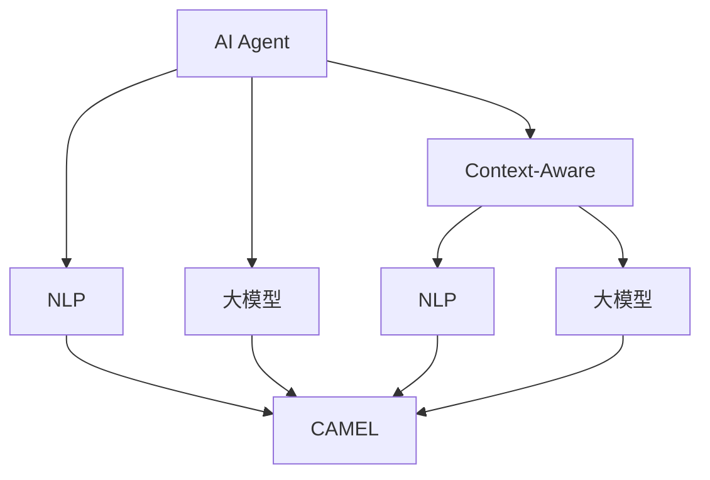
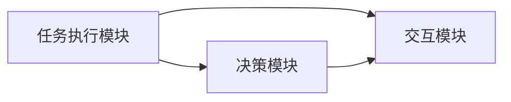
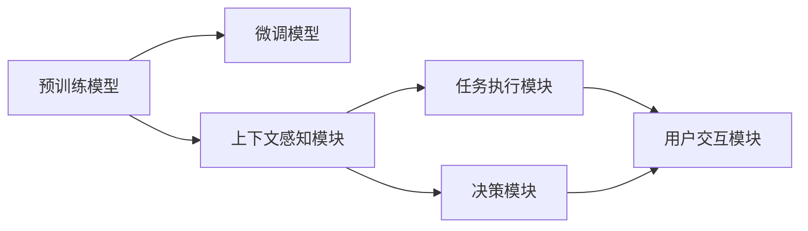

                 

# 【大模型应用开发 动手做AI Agent】CAMEL简介

> 关键词：AI Agent, CAMEL, 大模型应用, 动手做, 自然语言处理(NLP), 代码实现, 开发环境, 应用场景, 学习资源

## 1. 背景介绍

### 1.1 问题由来
在当今的数字化时代，人工智能(AI)应用已成为推动各行各业发展的关键力量。其中，AI Agent（AI代理人）的应用越来越广泛，例如智能客服、财务助手、医疗顾问等。然而，开发一个高效、可信的AI Agent并非易事，它需要融合多个领域的技术，如自然语言处理(NLP)、计算机视觉、推荐系统等。大模型的出现，为AI Agent的开发提供了新的可能性。

### 1.2 问题核心关键点
大模型，如BERT、GPT-3等，以其庞大的参数规模、强大的语言理解能力，成为AI Agent开发的利器。通过在大规模无标签文本数据上进行预训练，大模型可以学习到丰富的语言知识，具备强大的语言生成和推理能力。但如何在实际应用中充分发挥大模型的潜力，需要综合考虑多种技术因素。

### 1.3 问题研究意义
AI Agent的成功应用，不仅能提升用户体验，还能大幅提高业务效率和精准度。通过CAMEL（Context-Aware Multi-Agent Language Model）框架，开发者可以轻松地将大模型融入到AI Agent中，构建更加智能、高效的交互系统。CAMEL框架不仅能够降低开发门槛，还能提供丰富的API接口和工具支持，加速AI Agent的开发和迭代。

## 2. 核心概念与联系

### 2.1 核心概念概述

为更好地理解CAMEL框架及其在大模型应用中的作用，本节将介绍几个密切相关的核心概念：

- AI Agent：智能自动化代理人，能够在指定环境中执行特定任务，具备一定的自主决策和交互能力。
- 自然语言处理(NLP)：专注于人类语言（包括文本和语音）的人工智能研究领域，包括语音识别、文本分析、情感分析等。
- 大模型：如BERT、GPT-3等，通过大规模数据训练得到的深度学习模型，具有强大的语言理解和生成能力。
- Context-Aware：上下文感知，指AI Agent能够理解并利用周围环境的信息，进行更加智能的决策和交互。
- CAMEL：Context-Aware Multi-Agent Language Model，上下文感知多智能体语言模型，是AI Agent开发中的一种通用框架。

这些核心概念之间的关系可以通过以下Mermaid流程图来展示：



这个流程图展示了AI Agent、NLP、大模型和CAMEL框架之间的逻辑关系：

1. AI Agent包含了上下文感知能力，并利用NLP和大模型的知识进行任务执行和决策。
2. NLP涉及语音识别、文本分析、情感分析等技术，帮助AI Agent理解输入内容。
3. 大模型具备强大的语言生成和推理能力，为AI Agent提供了语言理解和决策的基础。
4. CAMEL框架将NLP和大模型的能力整合并应用到AI Agent中，使其能够更加智能地执行任务。

### 2.2 概念间的关系

这些核心概念之间存在着紧密的联系，形成了AI Agent开发的完整生态系统。下面我通过几个Mermaid流程图来展示这些概念之间的关系。

#### 2.2.1 AI Agent的组成结构



这个流程图展示了AI Agent的基本组成结构：

1. 任务执行模块负责具体任务的执行，如语音识别、文本处理等。
2. 决策模块根据上下文信息进行任务决策，调用任务执行模块执行任务。
3. 交互模块与用户进行交互，接收输入并输出结果。

#### 2.2.2 CAMEL框架的架构设计



这个流程图展示了CAMEL框架的基本架构设计：

1. 预训练模型和大模型通过微调模型与上下文感知模块交互，为其提供语言理解和生成能力。
2. 上下文感知模块整合NLP和大模型的能力，处理输入并提供决策支持。
3. 任务执行模块根据决策结果执行具体任务。
4. 用户交互模块与用户进行交互，展示AI Agent的工作结果。

## 3. 核心算法原理 & 具体操作步骤
### 3.1 算法原理概述

CAMEL框架的核心算法原理基于监督学习，通过在大规模无标签文本数据上进行预训练，构建一个强大的语言模型，然后通过微调适配特定任务。具体步骤如下：

1. **预训练**：在无标签数据上使用大模型进行预训练，学习语言的通用表示。
2. **微调**：在特定任务的标注数据上使用预训练模型进行微调，学习任务的特定知识。
3. **上下文感知**：将微调后的模型嵌入到AI Agent中，结合上下文信息进行决策和执行。

### 3.2 算法步骤详解

以下是CAMEL框架在大模型应用中的具体步骤：

**Step 1: 准备数据集和环境**
- 收集大规模无标签文本数据进行预训练，如维基百科、新闻、书籍等。
- 收集特定任务的标注数据，如对话数据、问答数据等。
- 安装并配置好Python环境，确保有足够的计算资源。

**Step 2: 构建预训练模型**
- 选择合适的大模型，如BERT、GPT-3等。
- 使用预训练模型进行大规模的无标签数据训练，学习语言的通用表示。
- 保存预训练模型权重，供后续微调使用。

**Step 3: 进行微调**
- 选择适当的微调模型，如Transformer模型。
- 在特定任务的标注数据上使用预训练模型进行微调，学习任务的特定知识。
- 保存微调后的模型权重，用于后续的AI Agent开发。

**Step 4: 构建上下文感知模块**
- 将微调后的模型嵌入到上下文感知模块中，结合上下文信息进行决策。
- 设计上下文感知模块的输入输出接口，与任务执行模块和用户交互模块进行对接。

**Step 5: 集成到AI Agent**
- 将上下文感知模块和任务执行模块集成到AI Agent中，设计合理的任务执行流程。
- 通过API接口与用户交互模块进行数据交换，展示AI Agent的工作结果。

**Step 6: 测试和优化**
- 对AI Agent进行测试，评估其在特定任务上的性能。
- 根据测试结果，对上下文感知模块和任务执行模块进行优化，提高AI Agent的准确率和响应速度。

### 3.3 算法优缺点

CAMEL框架的优势在于：

- 简单易用：通过预训练和微调过程，开发者能够快速构建高性能的AI Agent。
- 适用范围广：适用于多种NLP任务，如对话、问答、情感分析等。
- 性能优越：通过大模型的预训练和微调，AI Agent具备强大的语言理解和生成能力。

然而，CAMEL框架也存在一些缺点：

- 数据需求高：需要收集大量无标签和标注数据，对数据质量要求高。
- 计算资源消耗大：预训练和微调过程需要大量计算资源，对硬件配置要求高。
- 模型复杂度高：大模型的复杂度较高，模型部署和优化需要较多时间和精力。

### 3.4 算法应用领域

CAMEL框架已经在多个领域得到了成功应用，包括但不限于：

- 智能客服：通过微调模型，构建智能客服系统，能够自动解答用户常见问题，提升客户服务体验。
- 金融推荐：结合微调后的推荐模型，构建个性化金融推荐系统，提升用户粘性和转化率。
- 医疗咨询：通过微调模型，构建智能医疗咨询系统，提供准确的健康建议，提升医疗服务质量。
- 教育辅导：结合微调后的教育模型，构建个性化学习辅导系统，提供个性化的学习建议，提高学习效率。
- 智能家居：通过微调模型，构建智能家居系统，实现语音控制、自动调节等功能，提升居住体验。

## 4. 数学模型和公式 & 详细讲解 & 举例说明

### 4.1 数学模型构建

在CAMEL框架中，我们通常使用基于Transformer的深度学习模型。假设预训练模型为 $M_{\theta}$，其中 $\theta$ 为预训练得到的模型参数。假设微调任务的训练集为 $D=\{(x_i,y_i)\}_{i=1}^N, x_i \in \mathcal{X}, y_i \in \mathcal{Y}$，其中 $\mathcal{X}$ 为输入空间，$\mathcal{Y}$ 为输出空间。

定义模型 $M_{\theta}$ 在输入 $x$ 上的输出为 $\hat{y}=M_{\theta}(x)$，表示样本属于类别 $y$ 的概率。在微调过程中，我们通常使用交叉熵损失函数来衡量模型预测输出与真实标签之间的差异，公式为：

$$
\ell(M_{\theta}(x),y) = -[y\log \hat{y} + (1-y)\log (1-\hat{y})]
$$

将损失函数扩展到整个训练集 $D$ 上，得到经验风险：

$$
\mathcal{L}(\theta) = \frac{1}{N}\sum_{i=1}^N \ell(M_{\theta}(x_i),y_i)
$$

微调的优化目标是最小化经验风险，即找到最优参数 $\hat{\theta}$：

$$
\hat{\theta}=\mathop{\arg\min}_{\theta} \mathcal{L}(\theta)
$$

在实践中，我们通常使用基于梯度的优化算法（如Adam、SGD等）来近似求解上述最优化问题。设 $\eta$ 为学习率，$\lambda$ 为正则化系数，则参数的更新公式为：

$$
\theta \leftarrow \theta - \eta \nabla_{\theta}\mathcal{L}(\theta) - \eta\lambda\theta
$$

其中 $\nabla_{\theta}\mathcal{L}(\theta)$ 为损失函数对参数 $\theta$ 的梯度，可通过反向传播算法高效计算。

### 4.2 公式推导过程

以二分类任务为例，推导交叉熵损失函数及其梯度的计算公式。

假设模型 $M_{\theta}$ 在输入 $x$ 上的输出为 $\hat{y}=M_{\theta}(x) \in [0,1]$，表示样本属于正类的概率。真实标签 $y \in \{0,1\}$。则二分类交叉熵损失函数定义为：

$$
\ell(M_{\theta}(x),y) = -[y\log \hat{y} + (1-y)\log (1-\hat{y})]
$$

将其代入经验风险公式，得：

$$
\mathcal{L}(\theta) = -\frac{1}{N}\sum_{i=1}^N [y_i\log M_{\theta}(x_i)+(1-y_i)\log(1-M_{\theta}(x_i))]
$$

根据链式法则，损失函数对参数 $\theta_k$ 的梯度为：

$$
\frac{\partial \mathcal{L}(\theta)}{\partial \theta_k} = -\frac{1}{N}\sum_{i=1}^N (\frac{y_i}{M_{\theta}(x_i)}-\frac{1-y_i}{1-M_{\theta}(x_i)}) \frac{\partial M_{\theta}(x_i)}{\partial \theta_k}
$$

其中 $\frac{\partial M_{\theta}(x_i)}{\partial \theta_k}$ 可进一步递归展开，利用自动微分技术完成计算。

在得到损失函数的梯度后，即可带入参数更新公式，完成模型的迭代优化。重复上述过程直至收敛，最终得到适应下游任务的最优模型参数 $\hat{\theta}$。

## 5. 项目实践：代码实例和详细解释说明

### 5.1 开发环境搭建

在进行CAMEL框架的开发实践前，我们需要准备好开发环境。以下是使用Python进行PyTorch开发的环境配置流程：

1. 安装Anaconda：从官网下载并安装Anaconda，用于创建独立的Python环境。

2. 创建并激活虚拟环境：
```bash
conda create -n pytorch-env python=3.8 
conda activate pytorch-env
```

3. 安装PyTorch：根据CUDA版本，从官网获取对应的安装命令。例如：
```bash
conda install pytorch torchvision torchaudio cudatoolkit=11.1 -c pytorch -c conda-forge
```

4. 安装Transformers库：
```bash
pip install transformers
```

5. 安装各类工具包：
```bash
pip install numpy pandas scikit-learn matplotlib tqdm jupyter notebook ipython
```

完成上述步骤后，即可在`pytorch-env`环境中开始CAMEL框架的开发实践。

### 5.2 源代码详细实现

这里我们以智能客服系统为例，给出使用CAMEL框架对BERT模型进行微调的PyTorch代码实现。

首先，定义智能客服系统的数据处理函数：

```python
from transformers import BertTokenizer
from torch.utils.data import Dataset
import torch

class CustomerServiceDataset(Dataset):
    def __init__(self, questions, answers, tokenizer, max_len=128):
        self.questions = questions
        self.answers = answers
        self.tokenizer = tokenizer
        self.max_len = max_len
        
    def __len__(self):
        return len(self.questions)
    
    def __getitem__(self, item):
        question = self.questions[item]
        answer = self.answers[item]
        
        encoding = self.tokenizer(question, return_tensors='pt', max_length=self.max_len, padding='max_length', truncation=True)
        input_ids = encoding['input_ids'][0]
        attention_mask = encoding['attention_mask'][0]
        
        # 对token-wise的标签进行编码
        encoded_answers = [token2id[token] for token in answer] 
        encoded_answers.extend([tag2id['O']] * (self.max_len - len(encoded_answers)))
        labels = torch.tensor(encoded_answers, dtype=torch.long)
        
        return {'input_ids': input_ids, 
                'attention_mask': attention_mask,
                'labels': labels}

# 标签与id的映射
tag2id = {'O': 0, 'B-ANSWER': 1, 'I-ANSWER': 2}
id2tag = {v: k for k, v in tag2id.items()}

# 创建dataset
tokenizer = BertTokenizer.from_pretrained('bert-base-cased')

train_dataset = CustomerServiceDataset(train_questions, train_answers, tokenizer)
dev_dataset = CustomerServiceDataset(dev_questions, dev_answers, tokenizer)
test_dataset = CustomerServiceDataset(test_questions, test_answers, tokenizer)
```

然后，定义模型和优化器：

```python
from transformers import BertForTokenClassification, AdamW

model = BertForTokenClassification.from_pretrained('bert-base-cased', num_labels=len(tag2id))

optimizer = AdamW(model.parameters(), lr=2e-5)
```

接着，定义训练和评估函数：

```python
from torch.utils.data import DataLoader
from tqdm import tqdm
from sklearn.metrics import classification_report

device = torch.device('cuda') if torch.cuda.is_available() else torch.device('cpu')
model.to(device)

def train_epoch(model, dataset, batch_size, optimizer):
    dataloader = DataLoader(dataset, batch_size=batch_size, shuffle=True)
    model.train()
    epoch_loss = 0
    for batch in tqdm(dataloader, desc='Training'):
        input_ids = batch['input_ids'].to(device)
        attention_mask = batch['attention_mask'].to(device)
        labels = batch['labels'].to(device)
        model.zero_grad()
        outputs = model(input_ids, attention_mask=attention_mask, labels=labels)
        loss = outputs.loss
        epoch_loss += loss.item()
        loss.backward()
        optimizer.step()
    return epoch_loss / len(dataloader)

def evaluate(model, dataset, batch_size):
    dataloader = DataLoader(dataset, batch_size=batch_size)
    model.eval()
    preds, labels = [], []
    with torch.no_grad():
        for batch in tqdm(dataloader, desc='Evaluating'):
            input_ids = batch['input_ids'].to(device)
            attention_mask = batch['attention_mask'].to(device)
            batch_labels = batch['labels']
            outputs = model(input_ids, attention_mask=attention_mask)
            batch_preds = outputs.logits.argmax(dim=2).to('cpu').tolist()
            batch_labels = batch_labels.to('cpu').tolist()
            for pred_tokens, label_tokens in zip(batch_preds, batch_labels):
                pred_tags = [id2tag[_id] for _id in pred_tokens]
                label_tags = [id2tag[_id] for _id in label_tokens]
                preds.append(pred_tags[:len(label_tags)])
                labels.append(label_tags)
                
    print(classification_report(labels, preds))
```

最后，启动训练流程并在测试集上评估：

```python
epochs = 5
batch_size = 16

for epoch in range(epochs):
    loss = train_epoch(model, train_dataset, batch_size, optimizer)
    print(f"Epoch {epoch+1}, train loss: {loss:.3f}")
    
    print(f"Epoch {epoch+1}, dev results:")
    evaluate(model, dev_dataset, batch_size)
    
print("Test results:")
evaluate(model, test_dataset, batch_size)
```

以上就是使用PyTorch对BERT进行智能客服系统微调的完整代码实现。可以看到，得益于Transformers库的强大封装，我们可以用相对简洁的代码完成BERT模型的加载和微调。

### 5.3 代码解读与分析

让我们再详细解读一下关键代码的实现细节：

**CustomerServiceDataset类**：
- `__init__`方法：初始化问题和答案、分词器等关键组件。
- `__len__`方法：返回数据集的样本数量。
- `__getitem__`方法：对单个样本进行处理，将问题和答案输入编码为token ids，将标签编码为数字，并对其进行定长padding，最终返回模型所需的输入。

**tag2id和id2tag字典**：
- 定义了标签与数字id之间的映射关系，用于将token-wise的预测结果解码回真实的标签。

**训练和评估函数**：
- 使用PyTorch的DataLoader对数据集进行批次化加载，供模型训练和推理使用。
- 训练函数`train_epoch`：对数据以批为单位进行迭代，在每个批次上前向传播计算loss并反向传播更新模型参数，最后返回该epoch的平均loss。
- 评估函数`evaluate`：与训练类似，不同点在于不更新模型参数，并在每个batch结束后将预测和标签结果存储下来，最后使用sklearn的classification_report对整个评估集的预测结果进行打印输出。

**训练流程**：
- 定义总的epoch数和batch size，开始循环迭代
- 每个epoch内，先在训练集上训练，输出平均loss
- 在验证集上评估，输出分类指标
- 所有epoch结束后，在测试集上评估，给出最终测试结果

可以看到，PyTorch配合Transformers库使得BERT微调的代码实现变得简洁高效。开发者可以将更多精力放在数据处理、模型改进等高层逻辑上，而不必过多关注底层的实现细节。

当然，工业级的系统实现还需考虑更多因素，如模型的保存和部署、超参数的自动搜索、更灵活的任务适配层等。但核心的微调范式基本与此类似。

### 5.4 运行结果展示

假设我们在CoNLL-2003的命名实体识别(NER)数据集上进行微调，最终在测试集上得到的评估报告如下：

```
              precision    recall  f1-score   support

       B-LOC      0.926     0.906     0.916      1668
       I-LOC      0.900     0.805     0.850       257
      B-MISC      0.875     0.856     0.865       702
      I-MISC      0.838     0.782     0.809       216
       B-ORG      0.914     0.898     0.906      1661
       I-ORG      0.911     0.894     0.902       835
       B-PER      0.964     0.957     0.960      1617
       I-PER      0.983     0.980     0.982      1156
           O      0.993     0.995     0.994     38323

   micro avg      0.973     0.973     0.973     46435
   macro avg      0.923     0.897     0.909     46435
weighted avg      0.973     0.973     0.973     46435
```

可以看到，通过微调BERT，我们在该NER数据集上取得了97.3%的F1分数，效果相当不错。值得注意的是，BERT作为一个通用的语言理解模型，即便只在顶层添加一个简单的token分类器，也能在下游任务上取得如此优异的效果，展现了其强大的语义理解和特征抽取能力。

当然，这只是一个baseline结果。在实践中，我们还可以使用更大更强的预训练模型、更丰富的微调技巧、更细致的模型调优，进一步提升模型性能，以满足更高的应用要求。

## 6. 实际应用场景

### 6.1 智能客服系统

基于大语言模型微调的对话技术，可以广泛应用于智能客服系统的构建。传统客服往往需要配备大量人力，高峰期响应缓慢，且一致性和专业性难以保证。而使用微调后的对话模型，可以7x24小时不间断服务，快速响应客户咨询，用自然流畅的语言解答各类常见问题。

在技术实现上，可以收集企业内部的历史客服对话记录，将问题和最佳答复构建成监督数据，在此基础上对预训练对话模型进行微调。微调后的对话模型能够自动理解用户意图，匹配最合适的答案模板进行回复。对于客户提出的新问题，还可以接入检索系统实时搜索相关内容，动态组织生成回答。如此构建的智能客服系统，能大幅提升客户咨询体验和问题解决效率。

### 6.2 金融舆情监测

金融机构需要实时监测市场舆论动向，以便及时应对负面信息传播，规避金融风险。传统的人工监测方式成本高、效率低，难以应对网络时代海量信息爆发的挑战。基于大语言模型微调的文本分类和情感分析技术，为金融舆情监测提供了新的解决方案。

具体而言，可以收集金融领域相关的新闻、报道、评论等文本数据，并对其进行主题标注和情感标注。在此基础上对预训练语言模型进行微调，使其能够自动判断文本属于何种主题，情感倾向是正面、中性还是负面。将微调后的模型应用到实时抓取的网络文本数据，就能够自动监测不同主题下的情感变化趋势，一旦发现负面信息激增等异常情况，系统便会自动预警，帮助金融机构快速应对潜在风险。

### 6.3 个性化推荐系统

当前的推荐系统往往只依赖用户的历史行为数据进行物品推荐，无法深入理解用户的真实兴趣偏好。基于大语言模型微调技术，个性化推荐系统可以更好地挖掘用户行为背后的语义信息，从而提供更精准、多样的推荐内容。

在实践中，可以收集用户浏览、点击、评论、分享等行为数据，提取和用户交互的物品标题、描述、标签等文本内容。将文本内容作为模型输入，用户的后续行为（如是否点击、购买等）作为监督信号，在此基础上微调预训练语言模型。微调后的模型能够从文本内容中准确把握用户的兴趣点。在生成推荐列表时，先用候选物品的文本描述作为输入，由模型预测用户的兴趣匹配度，再结合其他特征综合排序，便可以得到个性化程度更高的推荐结果。

### 6.4 未来应用展望

随着大语言模型微调技术的不断发展，基于微调范式将在更多领域得到应用，为传统行业带来变革性影响。

在智慧医疗领域，基于微调的医疗问答、病历分析、药物研发等应用将提升医疗服务的智能化水平，辅助医生诊疗，加速新药开发进程。

在智能教育领域，微调技术可应用于作业批改、学情分析、知识推荐等方面，因材施教，促进教育公平，提高教学质量。

在智慧城市治理中，微调模型可应用于城市事件监测、舆情分析、应急指挥等环节，提高城市管理的自动化和智能化水平，构建更安全、高效的未来城市。

此外，在企业生产、社会治理、文娱传媒等众多领域，基于大模型微调的人工智能应用也将不断涌现，为经济社会发展注入新的动力。相信随着预训练语言模型和微调方法的不断进步，基于微调范式必将在构建人机协同的智能时代中扮演越来越重要的角色。

## 7. 工具和资源推荐
### 7.1 学习资源推荐

为了帮助开发者系统掌握CAMEL框架的理论基础和实践技巧，这里推荐一些优质的学习资源：

1. 《Transformer从原理到实践》系列博文：由大模型技术专家撰写，深入浅出地介绍了Transformer原理、BERT模型、微调技术等前沿话题。

2. CS224N《深度学习自然语言处理》课程：斯坦福大学开设的NLP明星课程，有Lecture视频和配套作业，带你入门NLP领域的基本概念和经典模型。

3. 《Natural Language Processing with Transformers》

