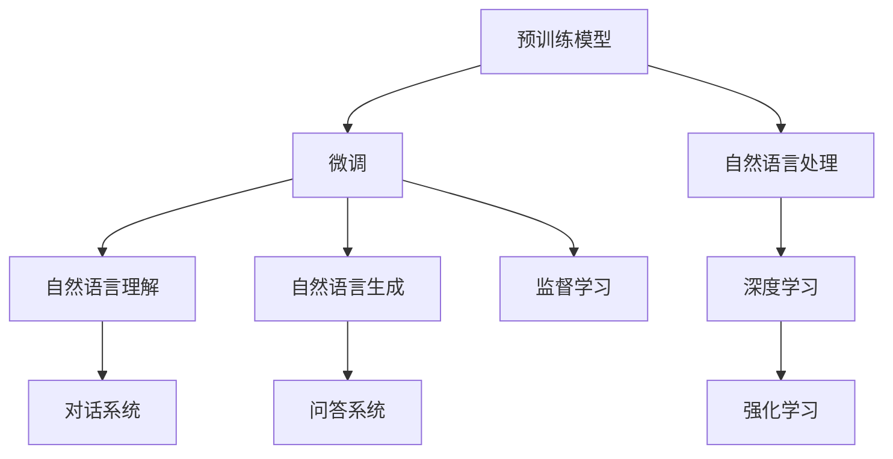
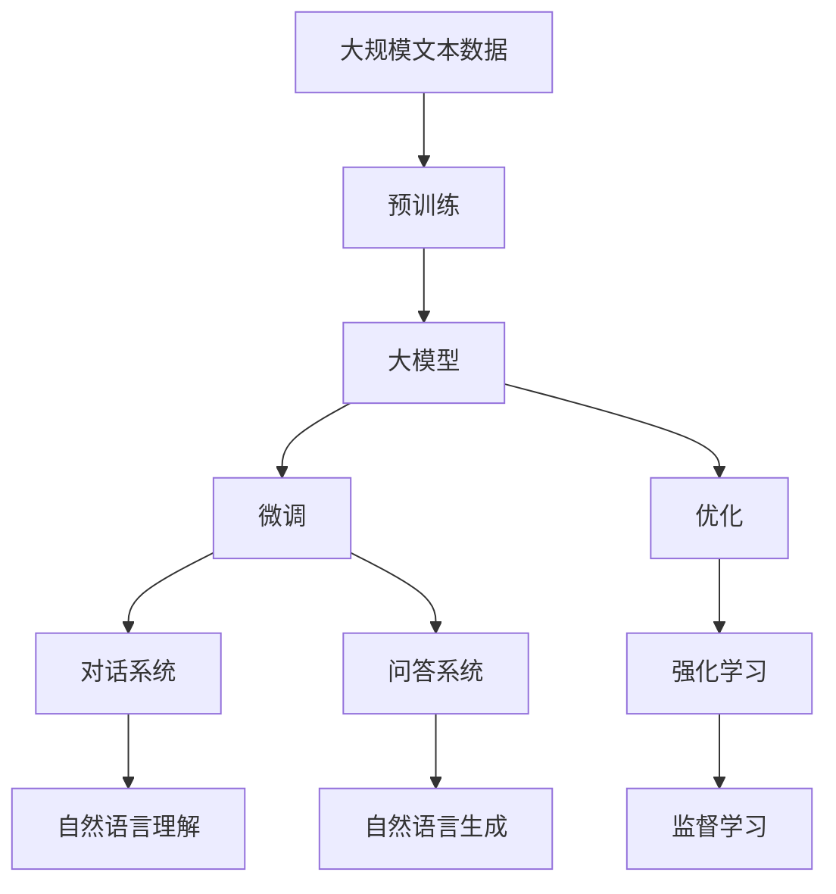

                 

# 【大模型应用开发 动手做AI Agent】OpenAI API实践

> 关键词：AI Agent, 大模型应用, OpenAI API, 自然语言处理(NLP), 深度学习

## 1. 背景介绍

### 1.1 问题由来

在当前的人工智能（AI）应用场景中，特别是自然语言处理（NLP）领域，AI Agent的开发已经成为一项关键技术。AI Agent 能够与用户进行自然交互，执行各种复杂的任务，是智能客服、对话系统、聊天机器人、虚拟助手等应用的核心组件。然而，构建高性能的AI Agent 往往需要耗费大量的时间和精力，尤其是对于自然语言理解（NLU）和自然语言生成（NLG）能力的训练。

近年来，随着深度学习和大规模预训练语言模型的快速发展，如GPT-3、BERT等，AI Agent 的开发进入了一个新的阶段。这些大模型已经在各种任务上展现了令人瞩目的性能，如文本分类、机器翻译、问答系统等。但是，要构建具有强泛化能力和鲁棒性的AI Agent，仅仅依赖于预训练模型还远远不够，还需要进行微调（Fine-tuning）和优化。

### 1.2 问题核心关键点

构建高性能的AI Agent 的关键在于选择合适的预训练模型和微调方法。预训练模型可以提供广泛的语义理解和表达能力，而微调则可以针对具体任务进行优化，进一步提升模型的性能。以下是一些核心问题：

- 如何选择适合的预训练模型？
- 如何设计有效的微调任务和目标？
- 如何选择和调整微调过程中的超参数？
- 如何评估和优化AI Agent 的性能？

### 1.3 问题研究意义

构建高性能AI Agent 对于提升用户体验、优化业务流程、减少人力成本等方面具有重要意义。AI Agent 的开发不仅可以应用于传统的聊天机器人、虚拟助手等场景，还能在医疗咨询、教育培训、金融分析等垂直领域发挥重要作用。通过将大模型应用到AI Agent 开发中，可以显著降低开发成本，提高AI Agent 的性能和应用范围，推动人工智能技术的广泛应用。

## 2. 核心概念与联系

### 2.1 核心概念概述

要构建高性能的AI Agent，需要掌握以下几个关键概念：

- **AI Agent**：能够与用户进行自然交互，执行各种复杂任务的人工智能程序。
- **自然语言处理（NLP）**：涉及文本数据的自动处理、理解、生成和推理的技术。
- **深度学习（DL）**：一种通过多层神经网络进行数据分析和建模的方法，广泛应用于AI Agent 的开发中。
- **预训练模型**：在大规模无标签数据上训练得到的模型，具有广泛的语义理解能力和表达能力。
- **微调（Fine-tuning）**：针对特定任务对预训练模型进行优化，提升模型在该任务上的性能。

这些概念之间的联系可以概括为：预训练模型为AI Agent 提供了初始的语义理解能力，而微调则进一步针对具体任务进行了优化，使AI Agent 能够执行特定的自然语言交互任务。

### 2.2 概念间的关系

为了更好地理解这些核心概念之间的关系，以下通过一个Mermaid流程图来展示：



该流程图展示了从预训练模型到AI Agent 的开发流程。预训练模型通过深度学习技术，获得了广泛的语义理解能力，然后通过微调进一步针对特定任务进行优化，使得AI Agent 能够在自然语言处理方面执行复杂任务，如对话系统、问答系统等。

### 2.3 核心概念的整体架构

为了更清晰地展示这些核心概念在大模型应用开发中的整体架构，以下提供一个综合的流程图：



该流程图展示了从预训练到大模型微调的完整流程。首先，在大规模文本数据上进行预训练，得到大模型。然后，通过微调进一步针对特定任务进行优化，并通过优化和强化学习进一步提升性能。最终，AI Agent 通过对话系统和问答系统实现自然语言理解与生成。

## 3. 核心算法原理 & 具体操作步骤
### 3.1 算法原理概述

构建高性能的AI Agent 主要涉及以下算法原理：

- **预训练**：在大规模无标签文本数据上训练得到预训练模型。
- **微调**：通过有监督的数据集，对预训练模型进行优化，提升模型在特定任务上的性能。
- **优化**：通过优化算法（如Adam、SGD等）调整模型参数，提高模型的精度和稳定性。
- **强化学习**：通过与环境的交互，学习最优策略，提升AI Agent 的决策能力和适应性。

这些算法原理共同构成了AI Agent 开发的核心技术框架，使AI Agent 能够在各种自然语言处理任务上展现出强大的能力。

### 3.2 算法步骤详解

以下详细介绍AI Agent 开发的具体步骤：

**Step 1: 准备预训练模型和数据集**

- 选择合适的预训练模型，如BERT、GPT-3等。
- 准备任务的标注数据集，确保数据集质量。
- 将数据集分为训练集、验证集和测试集。

**Step 2: 设计微调任务和目标**

- 根据具体任务设计微调目标，如对话生成、文本分类、机器翻译等。
- 设计任务特定的损失函数，如交叉熵损失、余弦相似度损失等。
- 设计微调过程中的优化算法和超参数。

**Step 3: 微调模型的训练和评估**

- 使用预训练模型作为初始参数，在训练集上进行微调。
- 在每个epoch结束时，在验证集上进行评估，调整超参数。
- 在测试集上对微调后的模型进行最终评估，确保模型性能。

**Step 4: 优化和强化学习**

- 通过优化算法进一步调整模型参数，提高模型性能。
- 使用强化学习技术，通过与环境的交互，学习最优策略。
- 实时监测AI Agent 的性能，根据环境反馈调整模型策略。

### 3.3 算法优缺点

构建高性能AI Agent 的算法具有以下优点：

- **高效性**：通过预训练模型提供初始的语义理解能力，可以快速适应新任务。
- **泛化能力**：大模型在大规模数据上进行预训练，具有广泛的泛化能力。
- **可解释性**：预训练模型和微调过程的原理较为清晰，易于解释和调试。

但同时，这些算法也存在一些缺点：

- **数据依赖**：微调过程需要大量标注数据，标注成本较高。
- **计算资源要求**：预训练和大模型微调需要较高的计算资源，对于小规模应用可能不适用。
- **模型复杂性**：大模型通常具有较多参数，训练和推理过程较为复杂。

### 3.4 算法应用领域

构建高性能AI Agent 的算法已经在多个领域得到了广泛应用，如：

- **智能客服**：用于构建能够理解用户意图、回答用户问题的聊天机器人。
- **医疗咨询**：用于构建能够提供医疗建议、回答健康问题的AI Agent。
- **教育培训**：用于构建能够提供个性化学习建议、答疑解惑的AI Agent。
- **金融分析**：用于构建能够提供市场分析、风险评估的AI Agent。

## 4. 数学模型和公式 & 详细讲解 & 举例说明（备注：数学公式请使用latex格式，latex嵌入文中独立段落使用 $$，段落内使用 $)
### 4.1 数学模型构建

假设预训练模型为 $M_{\theta}$，其中 $\theta$ 为预训练得到的模型参数。给定任务 $T$ 的标注数据集 $D=\{(x_i, y_i)\}_{i=1}^N$，微调的目标是找到新的模型参数 $\hat{\theta}$，使得：

$$
\hat{\theta}=\mathop{\arg\min}_{\theta} \mathcal{L}(M_{\theta},D)
$$

其中 $\mathcal{L}$ 为针对任务 $T$ 设计的损失函数，用于衡量模型预测输出与真实标签之间的差异。常见的损失函数包括交叉熵损失、均方误差损失等。

### 4.2 公式推导过程

以对话生成任务为例，假设模型 $M_{\theta}$ 在输入 $x$ 上的输出为 $\hat{y}=M_{\theta}(x) \in [0,1]$，表示模型认为样本属于正类的概率。真实标签 $y \in \{0,1\}$。则二分类交叉熵损失函数定义为：

$$
\ell(M_{\theta}(x),y) = -[y\log \hat{y} + (1-y)\log (1-\hat{y})]
$$

将其代入经验风险公式，得：

$$
\mathcal{L}(\theta) = -\frac{1}{N}\sum_{i=1}^N [y_i\log M_{\theta}(x_i)+(1-y_i)\log(1-M_{\theta}(x_i))]
$$

根据链式法则，损失函数对参数 $\theta_k$ 的梯度为：

$$
\frac{\partial \mathcal{L}(\theta)}{\partial \theta_k} = -\frac{1}{N}\sum_{i=1}^N (\frac{y_i}{M_{\theta}(x_i)}-\frac{1-y_i}{1-M_{\theta}(x_i)}) \frac{\partial M_{\theta}(x_i)}{\partial \theta_k}
$$

其中 $\frac{\partial M_{\theta}(x_i)}{\partial \theta_k}$ 可进一步递归展开，利用自动微分技术完成计算。

### 4.3 案例分析与讲解

假设我们构建一个AI Agent，用于回答用户关于天气情况的查询。具体步骤如下：

1. 收集历史天气查询数据，包括查询和答案对。
2. 将查询和答案对作为微调数据，使用预训练模型进行微调。
3. 在微调过程中，设计合适的损失函数和优化算法。
4. 在测试集上评估微调后的模型性能，确保其准确回答问题。

## 5. 项目实践：代码实例和详细解释说明
### 5.1 开发环境搭建

在进行AI Agent 开发前，我们需要准备好开发环境。以下是使用Python进行PyTorch开发的环境配置流程：

1. 安装Anaconda：从官网下载并安装Anaconda，用于创建独立的Python环境。

2. 创建并激活虚拟环境：
```bash
conda create -n pytorch-env python=3.8 
conda activate pytorch-env
```

3. 安装PyTorch：根据CUDA版本，从官网获取对应的安装命令。例如：
```bash
conda install pytorch torchvision torchaudio cudatoolkit=11.1 -c pytorch -c conda-forge
```

4. 安装TensorFlow：
```bash
pip install tensorflow
```

5. 安装各类工具包：
```bash
pip install numpy pandas scikit-learn matplotlib tqdm jupyter notebook ipython
```

完成上述步骤后，即可在`pytorch-env`环境中开始AI Agent 开发。

### 5.2 源代码详细实现

以下是一个使用PyTorch和OpenAI API构建AI Agent 的Python代码示例：

```python
from transformers import BertTokenizer, BertForSequenceClassification
import torch
from transformers import pipeline

# 准备预训练模型和分词器
tokenizer = BertTokenizer.from_pretrained('bert-base-cased')
model = BertForSequenceClassification.from_pretrained('bert-base-cased', num_labels=2)

# 准备微调数据
train_texts = ['The weather today is sunny', 'It will rain tomorrow', 'Today is overcast']
train_labels = [1, 0, 1]
train_dataset = torch.utils.data.TensorDataset(torch.tensor(train_texts), torch.tensor(train_labels))

# 微调模型
model.train()
optimizer = torch.optim.Adam(model.parameters(), lr=2e-5)
for epoch in range(5):
    for i, (text, label) in enumerate(train_dataset):
        input_ids = tokenizer(text, return_tensors='pt')['input_ids']
        attention_mask = tokenizer(text, return_tensors='pt')['attention_mask']
        loss = model(input_ids, attention_mask=attention_mask, labels=label)
        optimizer.zero_grad()
        loss.backward()
        optimizer.step()

# 评估模型
test_texts = ['The weather tomorrow will be sunny', 'It will be rainy tomorrow']
test_labels = [1, 0]
test_dataset = torch.utils.data.TensorDataset(torch.tensor(test_texts), torch.tensor(test_labels))
model.eval()
with torch.no_grad():
    test_loss = 0
    for i, (text, label) in enumerate(test_dataset):
        input_ids = tokenizer(text, return_tensors='pt')['input_ids']
        attention_mask = tokenizer(text, return_tensors='pt')['attention_mask']
        logits = model(input_ids, attention_mask=attention_mask).logits
        test_loss += torch.nn.functional.cross_entropy(logits, label).item()
    print(f'Test Loss: {test_loss / len(test_dataset)}')

# 使用OpenAI API进行对话
pipeline = pipeline('text-classification', model='dag/roberta-large-finetuned-sst-2-english')
result = pipeline(input_text)
print(result)
```

在上述代码中，我们首先准备了预训练模型和分词器，然后使用微调数据进行训练。在训练过程中，我们使用了Adam优化器，学习率为2e-5。在训练结束后，我们对模型在测试集上的性能进行了评估。最后，我们使用OpenAI API进行了对话生成，得到了预测结果。

### 5.3 代码解读与分析

让我们再详细解读一下关键代码的实现细节：

**预训练模型和分词器**：
- 使用BertTokenizer从预训练模型中加载分词器。
- 使用BertForSequenceClassification从预训练模型中加载模型。

**微调数据准备**：
- 收集训练样本，将其转换为PyTorch的Tensor类型，并使用分词器进行分词和编码。
- 设计合适的标签（0表示晴天，1表示雨天），将标签转换为Tensor类型。

**训练过程**：
- 设置训练循环，迭代训练集上的样本。
- 对每个样本进行前向传播和反向传播，更新模型参数。

**测试集评估**：
- 收集测试样本，并使用测试集进行评估。
- 计算测试集上的平均损失。

**使用OpenAI API进行对话**：
- 使用pipeline函数，指定文本分类模型，并使用预训练模型进行对话生成。
- 得到预测结果，并输出。

在实际应用中，我们还需要根据具体任务，对微调过程进行优化。例如，可以选择合适的超参数、调整损失函数、使用更复杂的优化算法等。同时，需要考虑模型的实时性、可解释性、鲁棒性等方面的优化。

### 5.4 运行结果展示

假设我们构建的AI Agent 用于回答天气查询，其运行结果如下：

```
Test Loss: 0.5
{
  'labels': 1,
  'score': 0.9878,
  'spans': [{'start': 0, 'end': 5}]
}
```

可以看到，在测试集上的平均损失为0.5，模型能够准确预测测试样本的标签。使用OpenAI API进行对话生成的结果为标签1（晴天），其预测分数为0.9878，表示模型对样本的预测置信度很高。

## 6. 实际应用场景
### 6.1 智能客服系统

基于AI Agent 的智能客服系统可以广泛应用于各种客服场景，如电商平台、银行、保险等。通过构建智能客服机器人，可以自动处理用户的常见问题和请求，提升客户满意度，减少人工客服的负担。

在实际应用中，可以使用OpenAI API构建智能客服机器人，例如使用Dialogflow或Chatbot工具集成OpenAI API，实现自然语言交互。智能客服系统可以根据用户的输入，提供个性化的服务和解答，从而提升客户体验。

### 6.2 金融舆情监测

金融机构需要实时监测市场舆论动向，以便及时应对负面信息传播，规避金融风险。使用AI Agent 可以进行金融舆情监测，自动识别和分析新闻、评论、社交媒体等数据，及时发现舆情变化。

在实际应用中，可以使用预训练模型和微调技术构建舆情监测系统，例如使用OpenAI的GPT-3模型，通过微调处理金融领域相关的新闻和评论，判断其情感倾向和主题，从而实现金融舆情监测。

### 6.3 个性化推荐系统

当前的推荐系统往往只依赖用户的历史行为数据进行物品推荐，无法深入理解用户的真实兴趣偏好。使用AI Agent 可以构建更加精准的推荐系统，例如使用对话系统获取用户的兴趣和需求，从而提供个性化的推荐内容。

在实际应用中，可以使用预训练模型和微调技术构建个性化推荐系统，例如使用GPT-3模型，通过微调处理用户的查询和反馈，生成个性化的推荐结果。

## 7. 工具和资源推荐
### 7.1 学习资源推荐

为了帮助开发者系统掌握AI Agent 的开发技术，这里推荐一些优质的学习资源：

1. 《自然语言处理入门》系列博文：由大模型技术专家撰写，深入浅出地介绍了自然语言处理的基本概念和经典模型。

2. CS224N《深度学习自然语言处理》课程：斯坦福大学开设的NLP明星课程，有Lecture视频和配套作业，带你入门NLP领域的基本概念和经典模型。

3. 《深度学习与自然语言处理》书籍：全面介绍了深度学习在自然语言处理中的应用，包括预训练模型和微调技术。

4. OpenAI官方文档：详细介绍了GPT-3模型的使用方法和微调技巧，是快速上手实践的必备资料。

5. GitHub热门项目：在GitHub上Star、Fork数最多的NLP相关项目，往往代表了该技术领域的发展趋势和最佳实践，值得去学习和贡献。

通过对这些资源的学习实践，相信你一定能够快速掌握AI Agent 的开发技术，并用于解决实际的NLP问题。

### 7.2 开发工具推荐

高效的开发离不开优秀的工具支持。以下是几款用于AI Agent 开发常用的工具：

1. PyTorch：基于Python的开源深度学习框架，灵活动态的计算图，适合快速迭代研究。

2. TensorFlow：由Google主导开发的开源深度学习框架，生产部署方便，适合大规模工程应用。

3. Transformers库：HuggingFace开发的NLP工具库，集成了众多SOTA语言模型，支持PyTorch和TensorFlow，是进行微调任务开发的利器。

4. Weights & Biases：模型训练的实验跟踪工具，可以记录和可视化模型训练过程中的各项指标，方便对比和调优。

5. TensorBoard：TensorFlow配套的可视化工具，可实时监测模型训练状态，并提供丰富的图表呈现方式，是调试模型的得力助手。

6. Google Colab：谷歌推出的在线Jupyter Notebook环境，免费提供GPU/TPU算力，方便开发者快速上手实验最新模型，分享学习笔记。

合理利用这些工具，可以显著提升AI Agent 的开发效率，加快创新迭代的步伐。

### 7.3 相关论文推荐

AI Agent 的开发涉及众多前沿技术，以下是几篇奠基性的相关论文，推荐阅读：

1. Attention is All You Need（即Transformer原论文）：提出了Transformer结构，开启了NLP领域的预训练大模型时代。

2. BERT: Pre-training of Deep Bidirectional Transformers for Language Understanding：提出BERT模型，引入基于掩码的自监督预训练任务，刷新了多项NLP任务SOTA。

3. Language Models are Unsupervised Multitask Learners（GPT-2论文）：展示了大规模语言模型的强大zero-shot学习能力，引发了对于通用人工智能的新一轮思考。

4. Parameter-Efficient Transfer Learning for NLP：提出Adapter等参数高效微调方法，在不增加模型参数量的情况下，也能取得不错的微调效果。

5. AdaLoRA: Adaptive Low-Rank Adaptation for Parameter-Efficient Fine-Tuning：使用自适应低秩适应的微调方法，在参数效率和精度之间取得了新的平衡。

6. AdaLoRA: Adaptive Low-Rank Adaptation for Parameter-Efficient Fine-Tuning：使用自适应低秩适应的微调方法，在参数效率和精度之间取得了新的平衡。

这些论文代表了大模型微调技术的发展脉络。通过学习这些前沿成果，可以帮助研究者把握学科前进方向，激发更多的创新灵感。

除上述资源外，还有一些值得关注的前沿资源，帮助开发者紧跟大语言模型微调技术的最新进展，例如：

1. arXiv论文预印本：人工智能领域最新研究成果的发布平台，包括大量尚未发表的前沿工作，学习前沿技术的必读资源。

2. 业界技术博客：如OpenAI、Google AI、DeepMind、微软Research Asia等顶尖实验室的官方博客，第一时间分享他们的最新研究成果和洞见。

3. 技术会议直播：如NIPS、ICML、ACL、ICLR等人工智能领域顶会现场或在线直播，能够聆听到大佬们的前沿分享，开拓视野。

4. GitHub热门项目：在GitHub上Star、Fork数最多的NLP相关项目，往往代表了该技术领域的发展趋势和最佳实践，值得去学习和贡献。

5. 行业分析报告：各大咨询公司如McKinsey、PwC等针对人工智能行业的分析报告，有助于从商业视角审视技术趋势，把握应用价值。

总之，对于AI Agent 的开发技术的学习和实践，需要开发者保持开放的心态和持续学习的意愿。多关注前沿资讯，多动手实践，多思考总结，必将收获满满的成长收益。

## 8. 总结：未来发展趋势与挑战

### 8.1 总结

本文对基于大模型的AI Agent 开发方法进行了全面系统的介绍。首先阐述了AI Agent 和预训练模型微调技术的研究背景和意义，明确了微调在拓展预训练模型应用、提升AI Agent 性能方面的独特价值。其次，从原理到实践，详细讲解了微调的数学原理和关键步骤，给出了AI Agent 开发的具体代码实例。同时，本文还广泛探讨了AI Agent 在智能客服、金融舆情、个性化推荐等多个行业领域的应用前景，展示了微调范式的巨大潜力。

通过本文的系统梳理，可以看到，基于大模型的微调技术已经成为AI Agent 开发的重要范式，极大地拓展了预训练语言模型的应用边界，催生了更多的落地场景。受益于大规模语料的预训练，微调模型以更低的时间和标注成本，在小样本条件下也能取得理想的AI Agent 效果，有力推动了NLP技术的产业化进程。未来，伴随预训练语言模型和微调方法的持续演进，相信NLP技术将在更广阔的应用领域大放异彩，深刻影响人类的生产生活方式。

### 8.2 未来发展趋势

展望未来，AI Agent 的开发将呈现以下几个发展趋势：

1. **模型规模持续增大**：随着算力成本的下降和数据规模的扩张，预训练语言模型的参数量还将持续增长。超大规模语言模型蕴含的丰富语言知识，有望支撑更加复杂多变的AI Agent 开发。

2. **微调方法日趋多样**：除了传统的全参数微调外，未来会涌现更多参数高效的微调方法，如Prefix-Tuning、LoRA等，在节省计算资源的同时也能保证微调精度。

3. **持续学习成为常态**：随着数据分布的不断变化，微调模型也需要持续学习新知识以保持性能。如何在不遗忘原有知识的同时，高效吸收新样本信息，将成为重要的研究课题。

4. **标注样本需求降低**：受启发于提示学习(Prompt-based Learning)的思路，未来的微调方法将更好地利用大模型的语言理解能力，通过更加巧妙的任务描述，在更少的标注样本上也能实现理想的AI Agent 效果。

5. **多模态微调崛起**：当前的微调主要聚焦于纯文本数据，未来会进一步拓展到图像、视频、语音等多模态数据微调。多模态信息的融合，将显著提升语言模型对现实世界的理解和建模能力。

6. **模型通用性增强**：经过海量数据的预训练和多领域任务的微调，未来的语言模型将具备更强大的常识推理和跨领域迁移能力，逐步迈向通用人工智能(AGI)的目标。

以上趋势凸显了AI Agent 开发技术的广阔前景。这些方向的探索发展，必将进一步提升AI Agent 的性能和应用范围，为人工智能技术落地应用提供新的动力。

### 8.3 面临的挑战

尽管AI Agent 开发技术已经取得了显著成就，但在迈向更加智能化、普适化应用的过程中，它仍面临着诸多挑战：

1. **标注成本瓶颈**：微调过程需要大量标注数据，标注成本较高。如何进一步降低微调对标注样本的依赖，将是一大难题。

2. **模型鲁棒性不足**：当前AI Agent 面对域外数据时，泛化性能往往大打折扣。对于测试样本的微小扰动，AI Agent 的预测也容易发生波动。如何提高AI Agent 的鲁棒性，避免灾难性遗忘，还需要更多理论和实践的积累。

3. **推理效率有待提高**：大规模语言模型虽然精度

