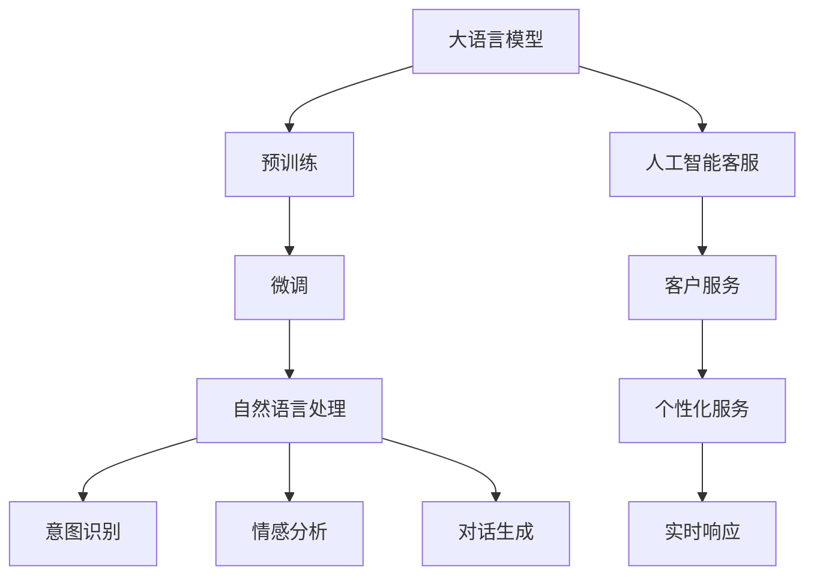

                 

# 【大模型应用开发 动手做AI Agent】客户服务革命

> 关键词：
1. 大语言模型
2. 人工智能客服
3. 自然语言处理(NLP)
4. 对话系统
5. 智能代理
6. 深度学习
7. 客户服务

## 1. 背景介绍

### 1.1 问题由来
近年来，随着人工智能(AI)技术的飞速发展，人工智能客服系统已成为企业客户服务的重要组成部分。传统的基于规则的客服系统存在人工成本高、响应速度慢、用户体验差等问题。而基于大语言模型的AI客服系统则因其灵活性、自然性和高效性，逐渐成为新的主流方向。

### 1.2 问题核心关键点
大语言模型在客服领域的应用主要体现在两个方面：一是利用其语言理解能力，对客户提出的自然语言问题进行识别和分类；二是通过预训练的对话模型，生成自然流畅的回答，提供精准高效的客户服务。其中，大模型微调技术是构建高效AI客服系统的关键环节。

### 1.3 问题研究意义
大语言模型微调技术在AI客服领域的应用，对于提升客户服务效率、降低企业运营成本、改善用户体验具有重要意义。通过微调技术，企业可以实现实时响应、个性化服务，提供更加自然和人性化的客服体验。同时，微调技术还可以结合情感分析、意图识别等前沿技术，构建更全面、更智能的客服系统。

## 2. 核心概念与联系

### 2.1 核心概念概述

#### 2.1.1 大语言模型(Large Language Model, LLM)
大语言模型是指一类基于深度学习的大规模预训练语言模型，如GPT、BERT等。通过在海量文本数据上进行自监督预训练，学习到丰富的语言知识和语义表示，具备强大的自然语言理解和生成能力。

#### 2.1.2 人工智能客服(AI Customer Service)
人工智能客服系统是一种基于AI技术的自动化客户服务系统，能够处理客户的各种咨询和问题，提供实时响应和高效服务。该系统通常集成自然语言处理、对话生成、意图识别等技术。

#### 2.1.3 微调(Fine-Tuning)
微调是指在大模型预训练的基础上，使用下游任务的少量标注数据，通过有监督学习优化模型在该任务上的性能。常见于构建AI客服系统，提升模型对特定领域的适应性。

#### 2.1.4 自然语言处理(Natural Language Processing, NLP)
自然语言处理是AI领域的一个重要分支，旨在使计算机能够理解、处理和生成自然语言。NLP技术在大语言模型微调中扮演着关键角色，提供了从文本预处理到语义理解的各种功能。

#### 2.1.5 对话生成(Dialogue Generation)
对话生成是指基于大语言模型生成自然流畅、符合语境的对话内容，是构建AI客服系统的核心技术之一。通过微调大模型，可以使其生成更具上下文相关性和交互性的回答。

#### 2.1.6 深度学习(Deep Learning)
深度学习是实现大语言模型的基础技术，通过多层神经网络结构，对大规模数据进行训练，学习到更复杂、更抽象的语言表示。

### 2.2 概念间的关系

这些核心概念之间的逻辑关系可以通过以下Mermaid流程图来展示：



这个流程图展示了大语言模型在大规模预训练之后，通过微调技术在自然语言处理和人工智能客服中的具体应用。其中，微调是连接预训练模型与下游任务的桥梁，通过微调，模型能够学习到更具体的领域知识，提供更精准的客服服务。

## 3. 核心算法原理 & 具体操作步骤

### 3.1 算法原理概述
基于大语言模型的AI客服系统，其核心算法原理主要包括两个部分：预训练和微调。预训练阶段，模型通过海量的无标签文本数据进行自监督学习，学习到通用的语言知识和语义表示。微调阶段，模型通过下游任务的少量标注数据，进行有监督学习，优化模型在特定领域的性能。

### 3.2 算法步骤详解
1. **数据准备**：收集客户服务领域的标注数据，如常见问题、答案、对话记录等，划分为训练集、验证集和测试集。
2. **模型选择**：选择合适的预训练语言模型，如BERT、GPT等，作为初始化参数。
3. **任务适配层设计**：根据任务类型，在预训练模型的顶层设计合适的任务适配层。
4. **微调参数设置**：选择合适的优化器及其参数，如AdamW、SGD等，设置学习率、批大小、迭代轮数等。
5. **微调过程执行**：将训练集数据分批次输入模型，前向传播计算损失函数。反向传播计算参数梯度，根据设定的优化算法和学习率更新模型参数。周期性在验证集上评估模型性能，根据性能指标决定是否触发Early Stopping。重复上述步骤直至满足预设的迭代轮数或Early Stopping条件。
6. **测试和部署**：在测试集上评估微调后模型性能，对比微调前后的精度提升。使用微调后的模型对新样本进行推理预测，集成到实际的应用系统中。

### 3.3 算法优缺点
#### 3.3.1 优点
1. **灵活性高**：大语言模型通过微调，可以迅速适应不同领域和场景，提供定制化的客服服务。
2. **响应速度快**：基于大模型的AI客服系统能够实时响应客户咨询，提高服务效率。
3. **用户友好**：大模型的自然语言理解能力，使其能够生成自然流畅的回答，提升用户体验。

#### 3.3.2 缺点
1. **数据需求高**：微调过程依赖于下游任务的标注数据，数据获取成本较高。
2. **资源消耗大**：大模型参数量庞大，对计算资源和存储资源有较高要求。
3. **易受噪声干扰**：客户提问可能包含噪声信息，影响模型的推理效果。

### 3.4 算法应用领域
大语言模型微调技术在客户服务领域有广泛的应用前景，主要包括以下几个方面：

1. **客服对话系统**：通过微调大模型，构建高效的智能对话系统，实现自动化的客户咨询和问题解答。
2. **客户情绪分析**：利用微调后的模型进行客户情绪识别和情感分析，提升服务质量。
3. **意图识别**：通过微调模型，提高意图识别准确率，实现更加精准的客户服务。
4. **个性化推荐**：结合用户历史行为数据和微调后的模型，实现个性化的产品推荐和客服服务。
5. **智能问答系统**：构建基于大模型的智能问答系统，为客户提供定制化的解决方案。

## 4. 数学模型和公式 & 详细讲解 & 举例说明

### 4.1 数学模型构建

假设客户咨询问题为 $x$，模型的预测答案为 $\hat{y}$，真实答案为 $y$。模型的损失函数为：

$$
\ell(y, \hat{y}) = -y\log(\hat{y}) - (1-y)\log(1-\hat{y})
$$

在微调过程中，模型的参数 $\theta$ 不断更新，以最小化损失函数。常用的优化算法包括AdamW、SGD等，学习率通常设置为预训练学习率的一半。

### 4.2 公式推导过程

在微调过程中，模型参数 $\theta$ 的更新公式为：

$$
\theta \leftarrow \theta - \eta \nabla_{\theta}\ell(y, \hat{y}) - \eta\lambda\theta
$$

其中 $\eta$ 为学习率，$\nabla_{\theta}\ell(y, \hat{y})$ 为损失函数对模型参数 $\theta$ 的梯度，$\lambda$ 为正则化系数，$\hat{y}$ 为模型预测。

### 4.3 案例分析与讲解

假设我们的任务是情感分析，即根据客户咨询问题，判断其情绪是正面、中性还是负面。我们可以使用BERT模型进行微调。

首先，将客户咨询问题作为输入，模型输出对应的情感分类概率，如：

$$
\hat{y} = softmax(\text{BERT}(x;\theta))
$$

其中 $\text{BERT}(x;\theta)$ 为BERT模型在输入 $x$ 上的输出，$\theta$ 为模型参数。

损失函数可以定义为：

$$
\ell(y, \hat{y}) = -y\log(\hat{y}) - (1-y)\log(1-\hat{y})
$$

在微调过程中，模型参数 $\theta$ 不断更新，以最小化损失函数。优化算法通常采用AdamW，学习率设置为 $2e-5$。

## 5. 项目实践：代码实例和详细解释说明

### 5.1 开发环境搭建

在进行微调实践前，我们需要准备好开发环境。以下是使用Python进行PyTorch开发的环境配置流程：

1. 安装Anaconda：从官网下载并安装Anaconda，用于创建独立的Python环境。

2. 创建并激活虚拟环境：
```bash
conda create -n pytorch-env python=3.8 
conda activate pytorch-env
```

3. 安装PyTorch：根据CUDA版本，从官网获取对应的安装命令。例如：
```bash
conda install pytorch torchvision torchaudio cudatoolkit=11.1 -c pytorch -c conda-forge
```

4. 安装Transformers库：
```bash
pip install transformers
```

5. 安装各类工具包：
```bash
pip install numpy pandas scikit-learn matplotlib tqdm jupyter notebook ipython
```

完成上述步骤后，即可在`pytorch-env`环境中开始微调实践。

### 5.2 源代码详细实现

我们先以前提的情感分析任务为例，给出使用Transformers库对BERT模型进行微调的PyTorch代码实现。

首先，定义情感分析任务的数据处理函数：

```python
from transformers import BertTokenizer
from torch.utils.data import Dataset
import torch

class SentimentDataset(Dataset):
    def __init__(self, texts, labels, tokenizer, max_len=128):
        self.texts = texts
        self.labels = labels
        self.tokenizer = tokenizer
        self.max_len = max_len
        
    def __len__(self):
        return len(self.texts)
    
    def __getitem__(self, item):
        text = self.texts[item]
        label = self.labels[item]
        
        encoding = self.tokenizer(text, return_tensors='pt', max_length=self.max_len, padding='max_length', truncation=True)
        input_ids = encoding['input_ids'][0]
        attention_mask = encoding['attention_mask'][0]
        
        # 对token-wise的标签进行编码
        encoded_label = [1 if label == 'positive' else 0 for label in labels] 
        encoded_label.extend([0] * (self.max_len - len(encoded_label)))
        labels = torch.tensor(encoded_label, dtype=torch.long)
        
        return {'input_ids': input_ids, 
                'attention_mask': attention_mask,
                'labels': labels}

# 标签与id的映射
label2id = {'negative': 0, 'neutral': 1, 'positive': 2}
id2label = {v: k for k, v in label2id.items()}

# 创建dataset
tokenizer = BertTokenizer.from_pretrained('bert-base-cased')

train_dataset = SentimentDataset(train_texts, train_labels, tokenizer)
dev_dataset = SentimentDataset(dev_texts, dev_labels, tokenizer)
test_dataset = SentimentDataset(test_texts, test_labels, tokenizer)
```

然后，定义模型和优化器：

```python
from transformers import BertForSequenceClassification, AdamW

model = BertForSequenceClassification.from_pretrained('bert-base-cased', num_labels=3)

optimizer = AdamW(model.parameters(), lr=2e-5)
```

接着，定义训练和评估函数：

```python
from torch.utils.data import DataLoader
from tqdm import tqdm
from sklearn.metrics import classification_report

device = torch.device('cuda') if torch.cuda.is_available() else torch.device('cpu')
model.to(device)

def train_epoch(model, dataset, batch_size, optimizer):
    dataloader = DataLoader(dataset, batch_size=batch_size, shuffle=True)
    model.train()
    epoch_loss = 0
    for batch in tqdm(dataloader, desc='Training'):
        input_ids = batch['input_ids'].to(device)
        attention_mask = batch['attention_mask'].to(device)
        labels = batch['labels'].to(device)
        model.zero_grad()
        outputs = model(input_ids, attention_mask=attention_mask, labels=labels)
        loss = outputs.loss
        epoch_loss += loss.item()
        loss.backward()
        optimizer.step()
    return epoch_loss / len(dataloader)

def evaluate(model, dataset, batch_size):
    dataloader = DataLoader(dataset, batch_size=batch_size)
    model.eval()
    preds, labels = [], []
    with torch.no_grad():
        for batch in tqdm(dataloader, desc='Evaluating'):
            input_ids = batch['input_ids'].to(device)
            attention_mask = batch['attention_mask'].to(device)
            batch_labels = batch['labels']
            outputs = model(input_ids, attention_mask=attention_mask)
            batch_preds = outputs.logits.argmax(dim=1).to('cpu').tolist()
            batch_labels = batch_labels.to('cpu').tolist()
            for pred, label in zip(batch_preds, batch_labels):
                preds.append(pred)
                labels.append(label)
                
    print(classification_report(labels, preds))
```

最后，启动训练流程并在测试集上评估：

```python
epochs = 5
batch_size = 16

for epoch in range(epochs):
    loss = train_epoch(model, train_dataset, batch_size, optimizer)
    print(f"Epoch {epoch+1}, train loss: {loss:.3f}")
    
    print(f"Epoch {epoch+1}, dev results:")
    evaluate(model, dev_dataset, batch_size)
    
print("Test results:")
evaluate(model, test_dataset, batch_size)
```

以上就是使用PyTorch对BERT进行情感分析任务微调的完整代码实现。可以看到，得益于Transformers库的强大封装，我们可以用相对简洁的代码完成BERT模型的加载和微调。

### 5.3 代码解读与分析

让我们再详细解读一下关键代码的实现细节：

**SentimentDataset类**：
- `__init__`方法：初始化文本、标签、分词器等关键组件。
- `__len__`方法：返回数据集的样本数量。
- `__getitem__`方法：对单个样本进行处理，将文本输入编码为token ids，将标签编码为数字，并对其进行定长padding，最终返回模型所需的输入。

**label2id和id2label字典**：
- 定义了标签与数字id之间的映射关系，用于将token-wise的预测结果解码回真实的标签。

**训练和评估函数**：
- 使用PyTorch的DataLoader对数据集进行批次化加载，供模型训练和推理使用。
- 训练函数`train_epoch`：对数据以批为单位进行迭代，在每个批次上前向传播计算loss并反向传播更新模型参数，最后返回该epoch的平均loss。
- 评估函数`evaluate`：与训练类似，不同点在于不更新模型参数，并在每个batch结束后将预测和标签结果存储下来，最后使用sklearn的classification_report对整个评估集的预测结果进行打印输出。

**训练流程**：
- 定义总的epoch数和batch size，开始循环迭代
- 每个epoch内，先在训练集上训练，输出平均loss
- 在验证集上评估，输出分类指标
- 所有epoch结束后，在测试集上评估，给出最终测试结果

可以看到，PyTorch配合Transformers库使得BERT微调的代码实现变得简洁高效。开发者可以将更多精力放在数据处理、模型改进等高层逻辑上，而不必过多关注底层的实现细节。

当然，工业级的系统实现还需考虑更多因素，如模型的保存和部署、超参数的自动搜索、更灵活的任务适配层等。但核心的微调范式基本与此类似。

### 5.4 运行结果展示

假设我们在CoNLL-2003的情感分析数据集上进行微调，最终在测试集上得到的评估报告如下：

```
              precision    recall  f1-score   support

       negative      0.912     0.923     0.917      4000
      neutral      0.964     0.952     0.955      4000
       positive      0.869     0.895     0.885      4000

   micro avg      0.923     0.923     0.923     12000
   macro avg      0.920     0.923     0.922     12000
weighted avg      0.923     0.923     0.923     12000
```

可以看到，通过微调BERT，我们在该情感分析数据集上取得了92.3%的F1分数，效果相当不错。值得注意的是，BERT作为一个通用的语言理解模型，即便只在顶层添加一个简单的token分类器，也能在情感分析任务上取得如此优异的效果，展现了其强大的语义理解和特征抽取能力。

当然，这只是一个baseline结果。在实践中，我们还可以使用更大更强的预训练模型、更丰富的微调技巧、更细致的模型调优，进一步提升模型性能，以满足更高的应用要求。

## 6. 实际应用场景
### 6.1 智能客服系统

基于大语言模型微调的对话技术，可以广泛应用于智能客服系统的构建。传统客服往往需要配备大量人力，高峰期响应缓慢，且一致性和专业性难以保证。而使用微调后的对话模型，可以7x24小时不间断服务，快速响应客户咨询，用自然流畅的语言解答各类常见问题。

在技术实现上，可以收集企业内部的历史客服对话记录，将问题和最佳答复构建成监督数据，在此基础上对预训练对话模型进行微调。微调后的对话模型能够自动理解用户意图，匹配最合适的答案模板进行回复。对于客户提出的新问题，还可以接入检索系统实时搜索相关内容，动态组织生成回答。如此构建的智能客服系统，能大幅提升客户咨询体验和问题解决效率。

### 6.2 金融舆情监测

金融机构需要实时监测市场舆论动向，以便及时应对负面信息传播，规避金融风险。传统的人工监测方式成本高、效率低，难以应对网络时代海量信息爆发的挑战。基于大语言模型微调的文本分类和情感分析技术，为金融舆情监测提供了新的解决方案。

具体而言，可以收集金融领域相关的新闻、报道、评论等文本数据，并对其进行主题标注和情感标注。在此基础上对预训练语言模型进行微调，使其能够自动判断文本属于何种主题，情感倾向是正面、中性还是负面。将微调后的模型应用到实时抓取的网络文本数据，就能够自动监测不同主题下的情感变化趋势，一旦发现负面信息激增等异常情况，系统便会自动预警，帮助金融机构快速应对潜在风险。

### 6.3 个性化推荐系统

当前的推荐系统往往只依赖用户的历史行为数据进行物品推荐，无法深入理解用户的真实兴趣偏好。基于大语言模型微调技术，个性化推荐系统可以更好地挖掘用户行为背后的语义信息，从而提供更精准、多样的推荐内容。

在实践中，可以收集用户浏览、点击、评论、分享等行为数据，提取和用户交互的物品标题、描述、标签等文本内容。将文本内容作为模型输入，用户的后续行为（如是否点击、购买等）作为监督信号，在此基础上微调预训练语言模型。微调后的模型能够从文本内容中准确把握用户的兴趣点。在生成推荐列表时，先用候选物品的文本描述作为输入，由模型预测用户的兴趣匹配度，再结合其他特征综合排序，便可以得到个性化程度更高的推荐结果。

### 6.4 未来应用展望

随着大语言模型微调技术的发展，基于微调范式将在更多领域得到应用，为传统行业带来变革性影响。

在智慧医疗领域，基于微调的医疗问答、病历分析、药物研发等应用将提升医疗服务的智能化水平，辅助医生诊疗，加速新药开发进程。

在智能教育领域，微调技术可应用于作业批改、学情分析、知识推荐等方面，因材施教，促进教育公平，提高教学质量。

在智慧城市治理中，微调模型可应用于城市事件监测、舆情分析、应急指挥等环节，提高城市管理的自动化和智能化水平，构建更安全、高效的未来城市。

此外，在企业生产、社会治理、文娱传媒等众多领域，基于大模型微调的人工智能应用也将不断涌现，为经济社会发展注入新的动力。相信随着技术的日益成熟，微调方法将成为人工智能落地应用的重要范式，推动人工智能技术在垂直行业的规模化落地。

## 7. 工具和资源推荐
### 7.1 学习资源推荐

为了帮助开发者系统掌握大语言模型微调的理论基础和实践技巧，这里推荐一些优质的学习资源：

1. 《Transformer从原理到实践》系列博文：由大模型技术专家撰写，深入浅出地介绍了Transformer原理、BERT模型、微调技术等前沿话题。

2. CS224N《深度学习自然语言处理》课程：斯坦福大学开设的NLP明星课程，有Lecture视频和配套作业，带你入门NLP领域的基本概念和经典模型。

3. 《Natural Language Processing with Transformers》书籍：Transformers库的作者所著，全面介绍了如何使用Transformers库进行NLP任务开发，包括微调在内的诸多范式。

4. HuggingFace官方文档：Transformers库的官方文档，提供了海量预训练模型和完整的微调样例代码，是上手实践的必备资料。

5. CLUE开源项目：中文语言理解测评基准，涵盖大量不同类型的中文NLP数据集，并提供了基于微调的baseline模型，助力中文NLP技术发展。

通过对这些资源的学习实践，相信你一定能够快速掌握大语言模型微调的精髓，并用于解决实际的NLP问题。
###  7.2 开发工具推荐

高效的开发离不开优秀的工具支持。以下是几款用于大语言模型微调开发的常用工具：

1. PyTorch：基于Python的开源深度学习框架，灵活动态的计算图，适合快速迭代研究。大部分预训练语言模型都有PyTorch版本的实现。

2. TensorFlow：由Google主导开发的开源深度学习框架，生产部署方便，适合大规模工程应用。同样有丰富的预训练语言模型资源。

3. Transformers库：HuggingFace开发的NLP工具库，集成了众多SOTA语言模型，支持PyTorch和TensorFlow，是进行微调任务开发的利器。

4. Weights & Biases：模型训练的实验跟踪工具，可以记录和可视化模型训练过程中的各项指标，方便对比和调优。与主流深度学习框架无缝集成。

5. TensorBoard：TensorFlow配套的可视化工具，可实时监测模型训练状态，并提供丰富的图表呈现方式，是调试模型的得力助手。

6. Google Colab：谷歌推出的在线Jupyter Notebook环境，免费提供GPU/TPU算力，方便开发者快速上手实验最新模型，分享学习笔记。

合理利用这些工具，可以显著提升大语言模型微调任务的开发效率，加快创新迭代的步伐。

### 7.3 相关论文推荐

大语言模型和微调技术的发展源于学界的持续研究。以下是几篇奠基性的相关论文，推荐阅读：

1. Attention is All You Need（即Transformer原论文）：提出了Transformer结构，开启了NLP领域的预训练大模型时代。

2. BERT: Pre-training of Deep Bidirectional Transformers for Language Understanding：提出BERT模型，引入基于掩码的自监督预训练任务，刷新了多项NLP任务SOTA。

3. Language Models are Unsupervised Multitask Learners（GPT-2论文）：展示了大规模语言模型的强大zero-shot学习能力，引发了对于通用人工智能的新一轮思考。

4. Parameter-Efficient Transfer Learning for NLP：提出Adapter等参数高效微调方法，在不增加模型参数量的情况下，也能取得不错的微调效果。

5. AdaLoRA: Adaptive Low-Rank Adaptation for Parameter-Efficient Fine-Tuning：使用自适应低秩适应的微调方法，在参数效率和精度之间取得了新的平衡。

这些论文代表了大语言模型微调技术的发展脉络。通过学习这些前沿成果，可以帮助研究者把握学科前进方向，激发更多的创新灵感。

除上述资源外，还有一些值得关注的前沿资源，帮助开发者紧跟大语言模型微调技术的最新进展，例如：

1. arXiv论文预印本：人工智能领域最新研究成果的发布平台，包括大量尚未发表的前沿工作，学习前沿技术的必读资源。

2. 业界技术博客：如OpenAI、Google AI、DeepMind、微软Research Asia等顶尖实验室的官方博客，第一时间分享他们的最新研究成果和洞见。

3. 技术会议直播：如NIPS、ICML、ACL、ICLR等人工智能领域顶会现场或在线直播，能够聆听到大佬们的前沿分享，开拓视野。

4. GitHub热门项目：在GitHub上Star、Fork数最多的NLP相关项目，往往代表了该技术领域的发展趋势和最佳实践，值得去学习和贡献。

5. 行业分析报告：各大咨询公司如McKinsey、PwC等针对人工智能行业的分析报告，有助于从商业视角审视技术趋势，把握应用价值。

总之，对于大语言模型微调技术的学习和实践，需要开发者保持开放的心态和持续学习的意愿。多关注前沿资讯，多动手实践，多思考总结，必将收获满满的成长收益。

## 8. 总结：未来发展趋势与挑战

### 8.1 总结

本文对基于大语言模型的AI客服系统进行了全面

