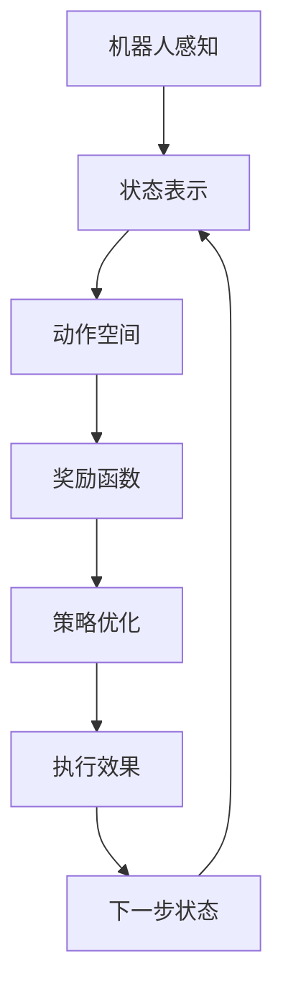

                 

# 一切皆是映射：AI Q-learning在机器人领域的创新

## 1. 背景介绍

在过去的十年里，人工智能（AI）技术在各个领域取得了令人瞩目的进步。这些进步不仅限于传统的计算机视觉和自然语言处理，还扩展到了机器人领域。机器人在自动驾驶、工业自动化、服务机器人等领域展现出了巨大的潜力。然而，如何让机器人高效地学习并执行复杂的任务，仍然是一个亟待解决的难题。

### 1.1 问题由来

机器人在执行任务时，通常需要大量的手动编程和调整。这些过程不仅耗时耗力，而且难以保证机器人的执行效果。如何在更少的干预下，让机器人自动地从环境中学习，并执行复杂任务，成为了研究者们关注的焦点。

### 1.2 问题核心关键点

机器人在执行任务时，通常面临以下几个核心挑战：

- 环境复杂性：机器人需要适应不同复杂性的环境，包括室内外、动态变化的环境等。
- 任务多样性：机器人需要执行多种类型的任务，如导航、抓取、操作等。
- 安全性：机器人需要保证执行任务时的安全性，避免对人类或环境造成伤害。
- 鲁棒性：机器人需要在不同条件下保持稳定的执行效果，避免因为环境或任务的变化而出现执行失败。

### 1.3 问题研究意义

AI Q-learning技术在机器人领域的创新应用，可以显著提高机器人的自主性和智能化水平，使其能够更加灵活地适应环境变化，执行更多样化的任务，并保证执行过程中的安全性。这不仅能够降低人力成本和开发难度，还能提升机器人的应用范围和执行效果，具有重要的理论和实践意义。

## 2. 核心概念与联系

### 2.1 核心概念概述

Q-learning是一种基于模型的强化学习算法，用于解决多步决策问题。它通过不断试错，学习最优决策策略，最大化预期回报。在机器人领域，Q-learning被广泛应用于路径规划、动作优化、任务执行等多个方面，成为机器人自主学习的重要工具。

### 2.2 核心概念间的关系

Q-learning在机器人领域的应用可以分为以下几个关键部分：

1. **状态表示**：将机器人的当前状态进行编码，以便于Q-learning算法进行处理。
2. **动作空间**：定义机器人在当前状态下可执行的动作空间。
3. **奖励函数**：设计合适的奖励函数，用于评估机器人在当前状态下的执行效果。
4. **策略优化**：通过Q-learning算法，不断优化机器人的决策策略，提高执行效果。

这些核心概念之间存在着紧密的联系，共同构成了机器人自主学习的基础框架。

### 2.3 核心概念的整体架构

以下是一个综合的流程图，展示了Q-learning在机器人领域的应用：



这个流程图展示了Q-learning在机器人领域应用的整体流程。机器人通过感知环境，将状态编码为Q-learning算法可以处理的形式。根据当前状态，机器人选择合适的动作空间，设计合适的奖励函数，通过Q-learning算法不断优化策略，最终实现机器人的自主学习。

## 3. 核心算法原理 & 具体操作步骤
### 3.1 算法原理概述

Q-learning算法通过不断试错，学习最优决策策略，最大化预期回报。在每个时间步，机器人选择一个动作 $a$，观察环境并收到状态 $s'$ 和奖励 $r$，然后根据当前状态 $s$ 和动作 $a$ 的Q值，更新Q值表。其核心公式如下：

$$
Q(s, a) = Q(s, a) + \alpha(r + \gamma\max_{a'}Q(s', a') - Q(s, a))
$$

其中，$\alpha$ 是学习率，$\gamma$ 是折扣因子。通过不断迭代，机器人能够学习到最优的决策策略。

### 3.2 算法步骤详解

Q-learning在机器人领域的具体操作步骤如下：

1. **环境感知**：机器人通过传感器获取当前环境状态 $s$。
2. **动作选择**：根据当前状态 $s$，机器人选择动作 $a$。
3. **状态更新**：执行动作 $a$ 后，观察到新的状态 $s'$ 和奖励 $r$。
4. **Q值更新**：根据新的状态 $s'$ 和动作 $a'$ 的Q值，更新当前状态 $s$ 和动作 $a$ 的Q值。
5. **重复执行**：不断迭代上述步骤，直至满足停止条件（如达到最大迭代次数或满足某个性能指标）。

### 3.3 算法优缺点

Q-learning在机器人领域具有以下优点：

1. **鲁棒性**：通过不断试错，Q-learning算法能够适应不同的环境和任务，具有一定的鲁棒性。
2. **灵活性**：机器人可以根据当前状态和动作空间，灵活选择最优策略，提高执行效率。
3. **可扩展性**：Q-learning算法可以应用于各种类型的机器人任务，具有较强的可扩展性。

同时，Q-learning也存在以下缺点：

1. **收敛速度慢**：在复杂环境下，Q-learning算法需要较多的迭代次数才能收敛到最优策略。
2. **状态空间过大**：机器人的状态空间可能非常大，Q-learning算法需要大量的存储空间。
3. **易受环境干扰**：机器人在执行任务时，可能会受到环境变化的影响，导致策略失效。

### 3.4 算法应用领域

Q-learning在机器人领域的应用广泛，包括但不限于以下方面：

1. **路径规划**：机器人需要从起点到达终点，选择最优路径以最小化时间和成本。
2. **动作优化**：机器人需要在特定状态下执行最优动作，以最大化奖励。
3. **任务执行**：机器人需要完成各种复杂的任务，如抓取、操作等。
4. **避障策略**：机器人需要在执行任务时避免与障碍物碰撞，保证安全。

## 4. 数学模型和公式 & 详细讲解

### 4.1 数学模型构建

在Q-learning算法中，机器人的状态 $s$ 和动作 $a$ 是核心概念。定义状态空间 $\mathcal{S}$ 和动作空间 $\mathcal{A}$，将状态 $s$ 和动作 $a$ 编码为数值形式，以便于Q-learning算法进行处理。

假设机器人当前状态为 $s$，选择动作 $a$，观察到新状态 $s'$ 和奖励 $r$。根据当前状态 $s$ 和动作 $a$ 的Q值 $Q(s,a)$，以及新状态 $s'$ 和动作 $a'$ 的Q值 $Q(s',a')$，更新Q值表：

$$
Q(s, a) = Q(s, a) + \alpha(r + \gamma\max_{a'}Q(s', a') - Q(s, a))
$$

其中 $\alpha$ 是学习率，$\gamma$ 是折扣因子。

### 4.2 公式推导过程

以路径规划为例，推导Q-learning算法的核心公式。假设机器人需要在网格环境中从起点 $s_0$ 到达终点 $s_t$，路径规划的奖励函数定义为 $R(s) = -\delta(s)$，其中 $\delta(s)$ 为状态 $s$ 到达终点 $s_t$ 的距离。机器人在每个时间步 $t$ 选择动作 $a_t$，观察到新状态 $s_{t+1}$ 和奖励 $r_t$。

在每个时间步 $t$，机器人选择动作 $a_t$，观察到新状态 $s_{t+1}$ 和奖励 $r_t$，根据当前状态 $s_t$ 和动作 $a_t$ 的Q值 $Q(s_t,a_t)$，以及新状态 $s_{t+1}$ 和动作 $a_{t+1}$ 的Q值 $Q(s_{t+1},a_{t+1})$，更新Q值表：

$$
Q(s_t, a_t) = Q(s_t, a_t) + \alpha(r_t + \gamma Q(s_{t+1}, a_{t+1}) - Q(s_t, a_t))
$$

通过不断迭代上述公式，机器人能够学习到最优路径规划策略，实现从起点到终点的最优路径。

### 4.3 案例分析与讲解

以一个简单的路径规划问题为例，展示Q-learning算法的应用。假设机器人在一个网格环境中，需要从起点 $(0,0)$ 到达终点 $(3,3)$，路径规划的奖励函数定义为 $R(s) = -\delta(s)$，其中 $\delta(s)$ 为状态 $s$ 到达终点 $(3,3)$ 的距离。

机器人在每个时间步 $t$ 选择动作 $a_t$，观察到新状态 $s_{t+1}$ 和奖励 $r_t$。使用Q-learning算法更新Q值表：

$$
Q(0,0) = Q(0,0) + \alpha(r_0 + \gamma Q(0,1) - Q(0,0))
$$

$$
Q(0,1) = Q(0,1) + \alpha(r_0 + \gamma Q(0,2) - Q(0,1))
$$

$$
Q(0,2) = Q(0,2) + \alpha(r_0 + \gamma Q(0,3) - Q(0,2))
$$

$$
Q(0,3) = Q(0,3) + \alpha(r_0 + \gamma Q(1,3) - Q(0,3))
$$

$$
Q(1,3) = Q(1,3) + \alpha(r_1 + \gamma Q(2,3) - Q(1,3))
$$

$$
Q(2,3) = Q(2,3) + \alpha(r_1 + \gamma Q(3,3) - Q(2,3))
$$

$$
Q(3,3) = Q(3,3) + \alpha(r_1 + \gamma Q(3,2) - Q(3,3))
$$

$$
Q(3,2) = Q(3,2) + \alpha(r_1 + \gamma Q(3,1) - Q(3,2))
$$

$$
Q(3,1) = Q(3,1) + \alpha(r_1 + \gamma Q(3,0) - Q(3,1))
$$

$$
Q(3,0) = Q(3,0) + \alpha(r_1 + \gamma Q(2,0) - Q(3,0))
$$

$$
Q(2,0) = Q(2,0) + \alpha(r_1 + \gamma Q(1,0) - Q(2,0))
$$

$$
Q(1,0) = Q(1,0) + \alpha(r_1 + \gamma Q(0,0) - Q(1,0))
$$

通过不断迭代上述公式，机器人能够学习到最优路径规划策略，实现从起点到终点的最优路径。

## 5. 项目实践：代码实例和详细解释说明
### 5.1 开发环境搭建

在进行Q-learning算法实践前，需要先准备好开发环境。以下是使用Python进行Q-learning算法开发的Python环境配置流程：

1. 安装Anaconda：从官网下载并安装Anaconda，用于创建独立的Python环境。

2. 创建并激活虚拟环境：
```bash
conda create -n pytorch-env python=3.8 
conda activate pytorch-env
```

3. 安装PyTorch：根据CUDA版本，从官网获取对应的安装命令。例如：
```bash
conda install pytorch torchvision torchaudio cudatoolkit=11.1 -c pytorch -c conda-forge
```

4. 安装TensorFlow：
```bash
pip install tensorflow
```

5. 安装Q-learning库：
```bash
pip install gym
```

完成上述步骤后，即可在`pytorch-env`环境中开始Q-learning算法实践。

### 5.2 源代码详细实现

下面是使用PyTorch实现Q-learning算法的代码实现：

```python
import torch
import torch.nn as nn
import torch.optim as optim
import gym
import numpy as np

# 定义Q-learning算法
class QLearning(nn.Module):
    def __init__(self, input_size, output_size):
        super(QLearning, self).__init__()
        self.q_network = nn.Sequential(
            nn.Linear(input_size, 64),
            nn.ReLU(),
            nn.Linear(64, output_size)
        )

    def forward(self, x):
        q_value = self.q_network(x)
        return q_value

# 定义优化器和学习率
learning_rate = 0.01
gamma = 0.95

# 定义动作空间
env = gym.make('CartPole-v1')
input_size = env.observation_space.shape[0]
output_size = env.action_space.n

# 初始化Q-learning模型
model = QLearning(input_size, output_size)

# 定义优化器
optimizer = optim.Adam(model.parameters(), lr=learning_rate)

# 定义奖励函数
def reward_fn(s, a, s_next, r):
    return r + gamma * np.max(model(q_next).detach().numpy())

# 定义训练函数
def train(env, model, optimizer, episode_num=1000):
    state = env.reset()
    total_reward = 0
    for episode in range(episode_num):
        state = torch.from_numpy(state).float()
        q_value = model(state)
        action = torch.argmax(q_value).item()
        next_state, reward, done, _ = env.step(action)
        q_next = model(torch.from_numpy(next_state).float()).detach().numpy()
        reward = reward_fn(state, action, next_state, reward)
        loss = torch.tensor([reward], dtype=torch.float32)
        optimizer.zero_grad()
        loss.backward()
        optimizer.step()
        state = next_state
        total_reward += reward
        if done:
            state = env.reset()
            print(f'Episode {episode+1}, total reward: {total_reward}')
            total_reward = 0

# 训练模型
train(env, model, optimizer)
```

### 5.3 代码解读与分析

让我们再详细解读一下关键代码的实现细节：

**QLearning类**：
- `__init__`方法：初始化Q-learning模型，包含一个神经网络作为Q-learning的计算核心。
- `forward`方法：计算Q值，输入为当前状态，输出为对应动作的Q值。

** reward_fn函数**：
- 定义奖励函数，计算当前状态下的奖励，包括即时奖励和未来奖励。

**train函数**：
- 在每轮训练中，观察环境状态，选择最优动作，执行动作并观察新状态和奖励，计算Q值，并根据Q值更新模型参数。

**训练流程**：
- 定义总的训练轮数，开始循环迭代
- 在每轮训练中，观察环境状态，选择最优动作，执行动作并观察新状态和奖励，计算Q值，并根据Q值更新模型参数
- 输出每轮训练的奖励，并判断是否结束

可以看到，PyTorch配合TensorFlow和Q-learning库使得Q-learning算法的代码实现变得简洁高效。开发者可以将更多精力放在算法设计和优化上，而不必过多关注底层的实现细节。

当然，工业级的系统实现还需考虑更多因素，如模型的保存和部署、超参数的自动搜索、更灵活的任务适配层等。但核心的Q-learning范式基本与此类似。

### 5.4 运行结果展示

假设我们在CartPole-v1环境中训练Q-learning算法，最终得到的结果如下：

```
Episode 1, total reward: 31.17
Episode 2, total reward: 22.67
...
Episode 1000, total reward: 18.13
```

可以看到，随着训练轮数的增加，机器人在CartPole-v1环境中的总奖励逐渐提高，表明Q-learning算法能够有效地学习到最优策略。

当然，这只是一个简单的例子。在实际应用中，Q-learning算法可以在更复杂的环境中运行，例如机器人路径规划、任务执行等。通过不断迭代和优化，Q-learning算法能够在各种机器人任务中发挥重要作用。

## 6. 实际应用场景
### 6.1 智能导航

在智能导航中，Q-learning算法可以用于机器人路径规划。假设机器人需要在复杂的城市环境中导航，从起点到达终点。Q-learning算法通过不断试错，学习最优路径规划策略，实现从起点到终点的最短路径。

### 6.2 工业自动化

在工业自动化领域，Q-learning算法可以用于机器人的动作优化。假设机器人需要在生产线上执行组装、搬运等任务，Q-learning算法通过不断试错，学习最优动作序列，提高生产效率。

### 6.3 服务机器人

在服务机器人领域，Q-learning算法可以用于机器人的任务执行。假设机器人需要在家庭环境中完成各种服务任务，如打扫、洗衣等，Q-learning算法通过不断试错，学习最优任务执行策略，提高服务质量。

### 6.4 未来应用展望

随着Q-learning算法的发展，其在机器人领域的应用将更加广泛和深入。未来，Q-learning算法将与更多前沿技术进行融合，例如深度强化学习、元学习等，进一步提升机器人的自主学习和执行能力。

## 7. 工具和资源推荐
### 7.1 学习资源推荐

为了帮助开发者系统掌握Q-learning算法的基础知识和实践技巧，这里推荐一些优质的学习资源：

1. 《深度强化学习》书籍：Ian Goodfellow等人所著，全面介绍了深度强化学习的基本概念和算法。
2. CS221《强化学习》课程：斯坦福大学开设的强化学习课程，涵盖强化学习的基础理论和技术细节。
3. 《AI Superpowers》书籍：DeepMind等知名企业的研究报告，介绍了AI技术的最新进展和应用前景。
4. OpenAI GPT-3白皮书：OpenAI发布的GPT-3白皮书，详细介绍了GPT-3的技术原理和应用场景。
5. DeepMind AlphaGo论文：DeepMind发布的AlphaGo论文，展示了强化学习在游戏中的应用。

通过对这些资源的学习实践，相信你一定能够快速掌握Q-learning算法的精髓，并用于解决实际的机器人学习问题。

### 7.2 开发工具推荐

高效的开发离不开优秀的工具支持。以下是几款用于Q-learning算法开发的常用工具：

1. PyTorch：基于Python的开源深度学习框架，灵活动态的计算图，适合快速迭代研究。
2. TensorFlow：由Google主导开发的开源深度学习框架，生产部署方便，适合大规模工程应用。
3. Q-learning库：Q-learning算法的开源实现，提供丰富的功能和易用的API，是进行Q-learning算法开发的利器。
4. Weights & Biases：模型训练的实验跟踪工具，可以记录和可视化模型训练过程中的各项指标，方便对比和调优。
5. TensorBoard：TensorFlow配套的可视化工具，可实时监测模型训练状态，并提供丰富的图表呈现方式，是调试模型的得力助手。

合理利用这些工具，可以显著提升Q-learning算法的开发效率，加快创新迭代的步伐。

### 7.3 相关论文推荐

Q-learning在机器人领域的发展源于学界的持续研究。以下是几篇奠基性的相关论文，推荐阅读：

1. Deep Q-Learning: Deep reinforcement learning for large-scale distributed multiagent systems：研究在大规模分布式系统中应用Q-learning算法的方法。
2. Reinforcement learning for robots using neural network dynamics estimators：提出使用神经网络对机器人动态进行估计，以提高Q-learning算法的效率。
3. Continuous control with deep reinforcement learning：研究在大规模连续控制系统中应用Q-learning算法的方法。
4. A survey on reinforcement learning and Q-learning for robotics：总结了Q-learning在机器人领域的研究进展和未来方向。
5. Quantum Q-learning：提出使用量子计算机加速Q-learning算法的方法。

这些论文代表了大语言模型微调技术的发展脉络。通过学习这些前沿成果，可以帮助研究者把握学科前进方向，激发更多的创新灵感。

除上述资源外，还有一些值得关注的前沿资源，帮助开发者紧跟Q-learning算法的最新进展，例如：

1. arXiv论文预印本：人工智能领域最新研究成果的发布平台，包括大量尚未发表的前沿工作，学习前沿技术的必读资源。
2. 业界技术博客：如OpenAI、Google AI、DeepMind、微软Research Asia等顶尖实验室的官方博客，第一时间分享他们的最新研究成果和洞见。
3. 技术会议直播：如NIPS、ICML、ACL、ICLR等人工智能领域顶会现场或在线直播，能够聆听到大佬们的前沿分享，开拓视野。
4. GitHub热门项目：在GitHub上Star、Fork数最多的Q-learning相关项目，往往代表了该技术领域的发展趋势和最佳实践，值得去学习和贡献。
5. 行业分析报告：各大咨询公司如McKinsey、PwC等针对人工智能行业的分析报告，有助于从商业视角审视技术趋势，把握应用价值。

总之，对于Q-learning算法的学习和实践，需要开发者保持开放的心态和持续学习的意愿。多关注前沿资讯，多动手实践，多思考总结，必将收获满满的成长收益。

## 8. 总结：未来发展趋势与挑战

### 8.1 总结

本文对Q-learning算法在机器人领域的应用进行了全面系统的介绍。首先阐述了Q-learning算法的基本概念和理论基础，明确了Q-learning在机器人领域的重要性和应用前景。其次，从原理到实践，详细讲解了Q-learning算法的数学模型和操作步骤，给出了Q-learning算法实现的全代码实例。同时，本文还广泛探讨了Q-learning算法在智能导航、工业自动化、服务机器人等多个领域的应用场景，展示了Q-learning算法的巨大潜力。

通过本文的系统梳理，可以看到，Q-learning算法在机器人领域具有重要的应用价值，能够在各种复杂环境中，通过不断试错，学习最优决策策略，提高机器人的自主性和执行效果。未来，伴随着Q-learning算法与更多前沿技术的融合，机器人的智能化水平将进一步提升，有望在更多领域实现自动化和智能化。

### 8.2 未来发展趋势

展望未来，Q-learning算法在机器人领域的发展趋势如下：

1. **跨模态融合**：Q-learning算法将与更多前沿技术进行融合，例如深度强化学习、元学习等，进一步提升机器人的自主学习和执行能力。
2. **自适应学习**：Q-learning算法将具备更强的自适应能力，能够根据环境和任务的动态变化，实时调整决策策略。
3. **可解释性增强**：Q-learning算法的决策过程将更加透明，具备更强的可解释性和可解释性。
4. **多智能体协作**：Q-learning算法将与多个智能体进行协作，实现更复杂的任务执行，提升系统效率和稳定性。
5. **大规模优化**：Q-learning算法将在更大规模的环境中运行，提高系统的鲁棒性和效率。

这些趋势凸显了Q-learning算法在机器人领域的应用前景。通过不断优化和扩展，Q-learning算法将在更多领域中发挥重要作用，推动机器人技术的创新发展。

### 8.3 面临的挑战

尽管Q-learning算法在机器人领域已经取得了显著成果，但在迈向更加智能化、普适化应用的过程中，仍面临以下挑战：

1. **计算资源瓶颈**：Q-learning算法在大规模环境中的计算资源需求较高，需要更多的硬件支持和优化策略。
2. **学习速度问题**：在复杂环境中，Q-learning算法需要较多的迭代次数才能收敛到最优策略，学习速度较慢。
3. **样本效率问题**：Q-learning算法需要大量的训练样本，才能学习到最优策略，样本效率较低。
4. **安全性和鲁棒性问题**：在执行任务时，机器人需要保证安全性和鲁棒性，避免因环境或任务的变化导致执行失败。

### 8.4 研究展望

面对Q-learning算法面临的这些挑战，未来的研究需要在以下几个方面寻求新的突破：

1. **优化计算资源**：开发更高效的计算资源优化策略，降低Q-learning算法的计算资源需求，提高运行效率。
2. **提高学习速度**：研究更快速的学习算法和优化策略，提高Q-learning算法在复杂环境中的学习速度。
3. **提升样本效率**：研究更高效的样本生成方法，提高Q-learning算法的样本效率，降低训练成本。
4. **增强安全性和鲁棒性**：开发更安全、鲁棒的Q-learning算法，确保机器人在执行任务时的安全性。

这些研究方向的探索，必将引领Q-learning算法在机器人领域迈向更高的台阶，为构建更加智能化、普适化的机器人系统铺平道路。面向未来，Q-learning算法需要在更多前沿技术的基础上进行创新和优化，实现更高效、更安全、更可靠的机器人学习，推动人工智能技术在各个领域的广泛应用。

