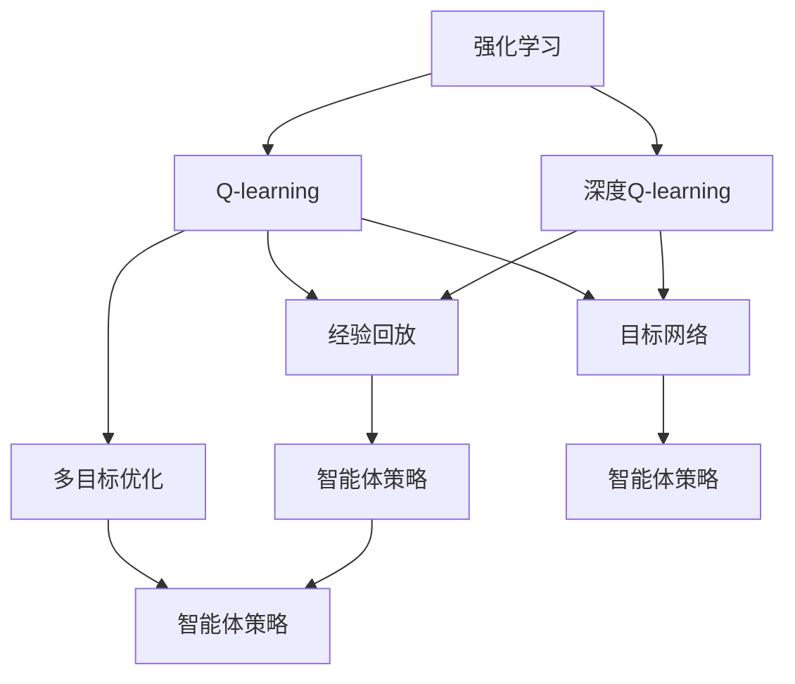
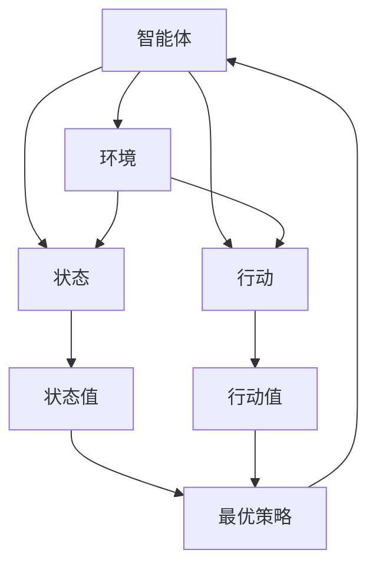
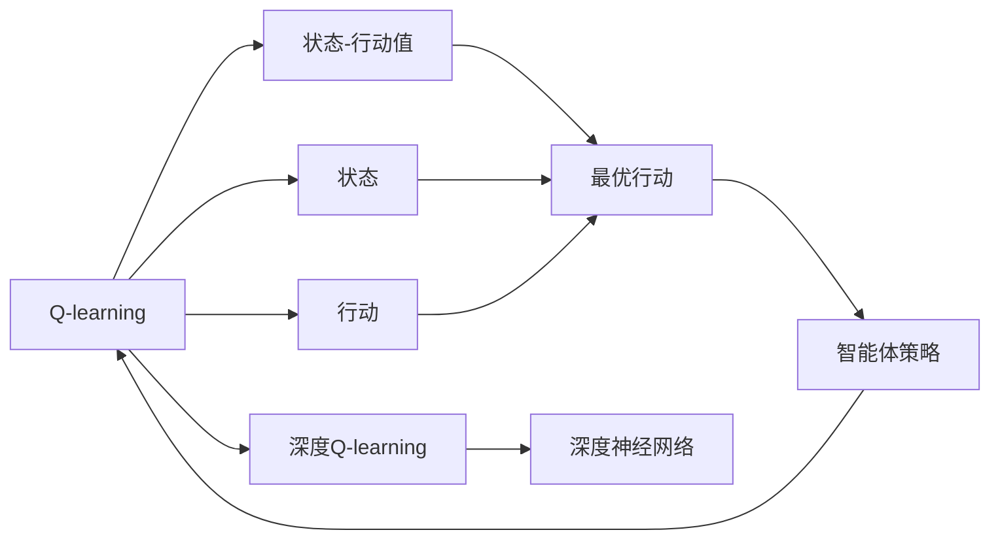
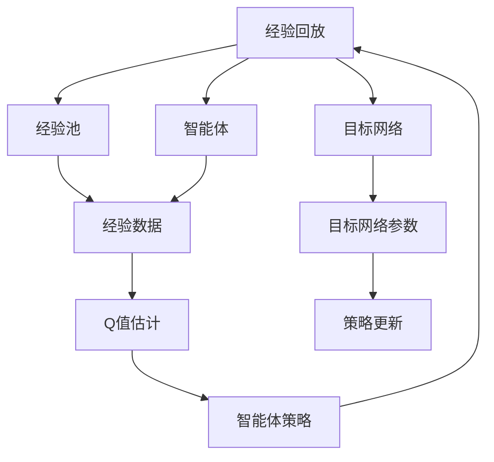
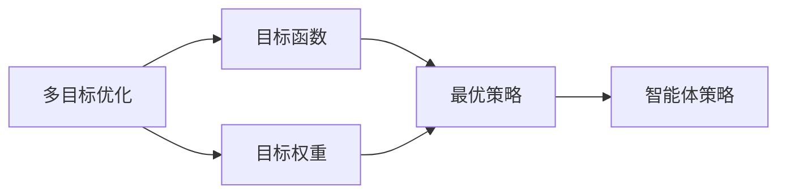
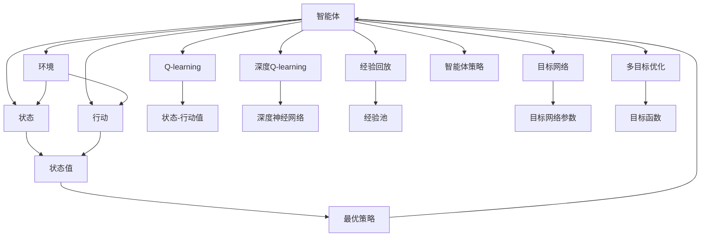

                 

# 一切皆是映射：AI Q-learning未来发展趋势预测

> 关键词：强化学习, Q-learning, 价值函数, 策略函数, 策略迭代, 深度强化学习

## 1. 背景介绍

### 1.1 问题由来
在人工智能和机器学习领域，强化学习（Reinforcement Learning, RL）是一种重要的方法，用于训练智能体（agent）在复杂环境中通过与环境的交互来学习最优策略。其核心思想是：智能体通过与环境的交互，不断尝试不同的行动，并根据行动的奖励（rewards）来调整行动策略，最终找到使总奖励最大的策略。这一过程与人类学习和决策的过程非常相似。

然而，在实际应用中，强化学习面临诸多挑战。首先是环境复杂性问题。当环境高度复杂时，智能体难以通过试错来学习最优策略。其次，智能体难以同时处理多个目标，这被称为多目标优化（Multi-Objective Optimization）问题。另外，高维状态空间和行动空间也会增加学习的难度。

针对这些挑战，研究人员提出了Q-learning算法，并在此基础上发展出深度Q-learning（Deep Q-learning, DQN）算法，将深度神经网络引入Q-learning中，以解决复杂环境下的强化学习问题。然而，DQN算法在实际应用中也存在一些问题，如Q函数估计的不稳定性、经验回放的累积误差等。

为应对这些挑战，学术界和工业界正在积极探索新的算法和技术，以提升强化学习的性能和泛化能力。本文将详细探讨Q-learning算法及其未来发展趋势。

### 1.2 问题核心关键点
Q-learning算法是强化学习中的一种经典算法，其核心思想是通过估计状态-行动的价值（Q值），来指导智能体选择最优行动策略。Q-learning的核心公式如下：

$$ Q(s,a) \leftarrow Q(s,a) + \alpha [r + \gamma \max_{a'} Q(s',a')] - Q(s,a) $$

其中 $s$ 表示当前状态，$a$ 表示当前行动，$r$ 表示即时奖励，$\gamma$ 表示折扣因子，$\alpha$ 表示学习率。该公式表示智能体通过即时奖励 $r$ 和未来状态的最大Q值 $\max_{a'} Q(s',a')$，来更新当前状态-行动的Q值。

Q-learning算法的核心在于估计Q值，并根据Q值选择最优行动策略。其优点在于不需要模型干预，直接从环境中获取奖励信号，适用于大规模环境的强化学习。然而，Q-learning算法也存在一些问题，如Q值估计的方差较大，难以收敛到最优解，容易出现过拟合等。

深度Q-learning算法（DQN）在Q-learning的基础上引入了深度神经网络，以处理高维状态空间和行动空间。DQN通过经验回放和目标网络等技术，提高了Q值估计的稳定性，降低了过拟合的风险。然而，DQN算法仍然存在一些问题，如Q值估计的方差较大，需要大量样本和计算资源等。

为了解决这些挑战，学术界和工业界正在探索新的算法和技术，以提升强化学习的性能和泛化能力。本文将详细探讨Q-learning算法及其未来发展趋势。

## 2. 核心概念与联系

### 2.1 核心概念概述

为更好地理解Q-learning算法及其未来发展趋势，本节将介绍几个密切相关的核心概念：

- 强化学习（Reinforcement Learning, RL）：指智能体通过与环境的交互，学习最优策略以最大化累积奖励的过程。
- Q-learning算法：通过估计状态-行动的价值（Q值），来指导智能体选择最优行动策略的强化学习方法。
- 深度Q-learning算法（Deep Q-learning, DQN）：在Q-learning的基础上，引入深度神经网络，以处理高维状态空间和行动空间的强化学习方法。
- 经验回放（Experience Replay）：通过将智能体的经验数据存储在一个经验池中，随机抽取样本来进行策略更新的技术。
- 目标网络（Target Network）：为了稳定Q值估计，将当前网络的参数复制到目标网络中，并使用目标网络的Q值进行策略更新。
- 多目标优化（Multi-Objective Optimization）：指在同时追求多个目标时，如何权衡这些目标的技术。
- 模型基准（Model Benchmarking）：通过基准测试，比较不同模型在特定任务上的性能。

这些核心概念之间的逻辑关系可以通过以下Mermaid流程图来展示：



这个流程图展示了大语言模型微调过程中各个核心概念之间的关系：

1. 强化学习作为基础，通过智能体和环境交互，学习最优策略。
2. Q-learning算法基于强化学习，通过估计状态-行动的价值（Q值），来指导智能体选择最优行动策略。
3. 深度Q-learning算法在Q-learning的基础上，引入深度神经网络，以处理高维状态空间和行动空间。
4. 经验回放和目标网络技术，用于稳定Q值估计，防止过拟合。
5. 多目标优化技术，用于同时追求多个目标时，平衡这些目标。

这些核心概念共同构成了强化学习的基本框架，为大语言模型微调技术的研究和应用提供了理论基础。通过理解这些核心概念，我们可以更好地把握强化学习的学习原理和优化方向。

### 2.2 概念间的关系

这些核心概念之间存在着紧密的联系，形成了强化学习的完整生态系统。下面我通过几个Mermaid流程图来展示这些概念之间的关系。

#### 2.2.1 强化学习的学习范式



这个流程图展示了强化学习的学习范式，即智能体通过与环境的交互，学习状态值和行动值，并根据这些值选择最优策略。

#### 2.2.2 Q-learning与深度Q-learning的关系



这个流程图展示了Q-learning与深度Q-learning的关系，即深度Q-learning在Q-learning的基础上，引入深度神经网络，以处理高维状态空间和行动空间。

#### 2.2.3 经验回放与目标网络的应用



这个流程图展示了经验回放与目标网络的应用，即通过经验回放和目标网络技术，提高Q值估计的稳定性，防止过拟合。

#### 2.2.4 多目标优化在强化学习中的应用



这个流程图展示了多目标优化在强化学习中的应用，即通过多目标优化技术，在同时追求多个目标时，平衡这些目标。

### 2.3 核心概念的整体架构

最后，我们用一个综合的流程图来展示这些核心概念在强化学习中的整体架构：



这个综合流程图展示了从智能体到最优策略，再到Q-learning算法的整体架构，以及经验回放、目标网络、多目标优化等技术的引入，为大语言模型微调技术的研究和应用提供了完整的理论基础。

## 3. 核心算法原理 & 具体操作步骤
### 3.1 算法原理概述

Q-learning算法通过估计状态-行动的价值（Q值），来指导智能体选择最优行动策略。其核心思想是：智能体通过即时奖励和未来状态的最大Q值，来更新当前状态-行动的Q值。具体步骤如下：

1. 初始化Q值表，即对于每个状态-行动对，随机初始化一个Q值。
2. 智能体在当前状态下选择行动，并接收即时奖励。
3. 根据即时奖励和未来状态的最大Q值，更新当前状态-行动的Q值。
4. 根据更新后的Q值，选择最优行动策略，并在新状态下重复上述过程。

深度Q-learning算法在Q-learning的基础上，引入深度神经网络，以处理高维状态空间和行动空间。其核心思想是：通过深度神经网络，对状态和行动进行编码，以提高Q值估计的精度和稳定性。具体步骤如下：

1. 初始化深度神经网络，并训练Q值预测模型。
2. 智能体在当前状态下选择行动，并接收即时奖励。
3. 根据即时奖励和未来状态的最大Q值，更新当前状态-行动的Q值。
4. 根据更新后的Q值，选择最优行动策略，并在新状态下重复上述过程。

Q-learning算法的优点在于不需要模型干预，直接从环境中获取奖励信号，适用于大规模环境的强化学习。然而，Q-learning算法也存在一些问题，如Q值估计的方差较大，难以收敛到最优解，容易出现过拟合等。

深度Q-learning算法在Q-learning的基础上，引入深度神经网络，以处理高维状态空间和行动空间。DQN通过经验回放和目标网络等技术，提高了Q值估计的稳定性，降低了过拟合的风险。然而，DQN算法仍然存在一些问题，如Q值估计的方差较大，需要大量样本和计算资源等。

### 3.2 算法步骤详解

#### 3.2.1 Q-learning算法的详细步骤

1. 初始化Q值表，即对于每个状态-行动对，随机初始化一个Q值。
2. 智能体在当前状态下选择行动，并接收即时奖励。
3. 根据即时奖励和未来状态的最大Q值，更新当前状态-行动的Q值。
4. 根据更新后的Q值，选择最优行动策略，并在新状态下重复上述过程。

#### 3.2.2 深度Q-learning算法的详细步骤

1. 初始化深度神经网络，并训练Q值预测模型。
2. 智能体在当前状态下选择行动，并接收即时奖励。
3. 根据即时奖励和未来状态的最大Q值，更新当前状态-行动的Q值。
4. 根据更新后的Q值，选择最优行动策略，并在新状态下重复上述过程。

#### 3.2.3 Q-learning和深度Q-learning的对比

Q-learning算法通过估计状态-行动的价值（Q值），来指导智能体选择最优行动策略。其优点在于不需要模型干预，直接从环境中获取奖励信号，适用于大规模环境的强化学习。然而，Q-learning算法也存在一些问题，如Q值估计的方差较大，难以收敛到最优解，容易出现过拟合等。

深度Q-learning算法在Q-learning的基础上，引入深度神经网络，以处理高维状态空间和行动空间。DQN通过经验回放和目标网络等技术，提高了Q值估计的稳定性，降低了过拟合的风险。然而，DQN算法仍然存在一些问题，如Q值估计的方差较大，需要大量样本和计算资源等。

### 3.3 算法优缺点

Q-learning算法的优点在于不需要模型干预，直接从环境中获取奖励信号，适用于大规模环境的强化学习。然而，Q-learning算法也存在一些问题，如Q值估计的方差较大，难以收敛到最优解，容易出现过拟合等。

深度Q-learning算法在Q-learning的基础上，引入深度神经网络，以处理高维状态空间和行动空间。DQN通过经验回放和目标网络等技术，提高了Q值估计的稳定性，降低了过拟合的风险。然而，DQN算法仍然存在一些问题，如Q值估计的方差较大，需要大量样本和计算资源等。

### 3.4 算法应用领域

Q-learning算法和深度Q-learning算法在诸多领域都有广泛的应用，例如：

- 游戏AI：如AlphaGo、DeepMind的AlphaStar等，通过Q-learning算法实现智能博弈。
- 机器人控制：通过Q-learning算法，实现机器人自主导航和操作。
- 供应链管理：通过Q-learning算法，优化物流和库存管理。
- 金融交易：通过Q-learning算法，实现交易策略优化和风险管理。
- 推荐系统：通过Q-learning算法，实现个性化推荐。
- 自动化控制：通过Q-learning算法，实现智能控制系统。
- 医疗决策：通过Q-learning算法，实现智能诊断和治疗方案优化。

## 4. 数学模型和公式 & 详细讲解  
### 4.1 数学模型构建

本节将使用数学语言对Q-learning算法及其未来发展趋势进行更加严格的刻画。

记智能体在状态$s$下，选择行动$a$，接收即时奖励$r$，进入状态$s'$的策略为$\pi(a|s)$，其Q值为$Q_{\pi}(s,a)$。智能体的目标是通过选择最优行动策略，最大化累积奖励，即：

$$ \max_{\pi} \mathbb{E}[ \sum_{t=0}^{\infty} \gamma^t r_{t+1} ] $$

其中 $\mathbb{E}$ 表示期望，$\gamma$ 表示折扣因子。

Q-learning算法通过估计状态-行动的价值（Q值），来指导智能体选择最优行动策略。其核心思想是：智能体通过即时奖励和未来状态的最大Q值，来更新当前状态-行动的Q值。具体步骤如下：

1. 初始化Q值表，即对于每个状态-行动对，随机初始化一个Q值。
2. 智能体在当前状态下选择行动，并接收即时奖励。
3. 根据即时奖励和未来状态的最大Q值，更新当前状态-行动的Q值。
4. 根据更新后的Q值，选择最优行动策略，并在新状态下重复上述过程。

深度Q-learning算法在Q-learning的基础上，引入深度神经网络，以处理高维状态空间和行动空间。其核心思想是：通过深度神经网络，对状态和行动进行编码，以提高Q值估计的精度和稳定性。具体步骤如下：

1. 初始化深度神经网络，并训练Q值预测模型。
2. 智能体在当前状态下选择行动，并接收即时奖励。
3. 根据即时奖励和未来状态的最大Q值，更新当前状态-行动的Q值。
4. 根据更新后的Q值，选择最优行动策略，并在新状态下重复上述过程。

### 4.2 公式推导过程

以下我们以单智能体的Q-learning算法为例，推导Q值更新的公式。

假设智能体在状态$s$下，选择行动$a$，进入状态$s'$，接收即时奖励$r$。则Q-learning算法的更新公式为：

$$ Q_{\pi}(s,a) \leftarrow Q_{\pi}(s,a) + \alpha [r + \gamma \max_{a'} Q_{\pi}(s',a')] - Q_{\pi}(s,a) $$

其中 $\alpha$ 表示学习率，$\max_{a'} Q_{\pi}(s',a')$ 表示在状态$s'$下，智能体选择行动$a'$的最大Q值。

### 4.3 案例分析与讲解

以AlphaGo为例，解释Q-learning算法的应用。AlphaGo使用深度Q-learning算法，通过与人类下棋数据进行预训练，学习到围棋的规则和策略。在预训练完成后，AlphaGo通过与机器对弈，不断优化策略，最终击败了人类围棋冠军李世石。AlphaGo的成功，证明了深度Q-learning算法在复杂博弈中的强大能力。

AlphaGo的核心思想是通过深度神经网络，对状态和行动进行编码，以提高Q值估计的精度和稳定性。其预训练过程，即通过与人类下棋数据进行博弈，学习到围棋的规则和策略。在预训练完成后，AlphaGo通过与机器对弈，不断优化策略，最终击败了人类围棋冠军李世石。AlphaGo的成功，证明了深度Q-learning算法在复杂博弈中的强大能力。

## 5. 项目实践：代码实例和详细解释说明
### 5.1 开发环境搭建

在进行Q-learning实践前，我们需要准备好开发环境。以下是使用Python进行TensorFlow开发的环境配置流程：

1. 安装Anaconda：从官网下载并安装Anaconda，用于创建独立的Python环境。

2. 创建并激活虚拟环境：
```bash
conda create -n tensorflow-env python=3.8 
conda activate tensorflow-env
```

3. 安装TensorFlow：从官网获取对应的安装命令。例如：
```bash
conda install tensorflow=2.4
```

4. 安装各类工具包：
```bash
pip install numpy pandas scikit-learn matplotlib tqdm jupyter notebook ipython
```

完成上述步骤后，即可在`tensorflow-env`环境中开始Q-learning实践。

### 5.2 源代码详细实现

下面我们以CartPole环境为例，给出使用TensorFlow实现Q-learning的PyTorch代码实现。

首先，定义CartPole环境的状态和行动空间：

```python
import gym
import numpy as np

env = gym.make('CartPole-v1')
observation_dim = env.observation_space.shape[0]
action_dim = env.action_space.n
```

然后，定义Q值表和策略函数：

```python
alpha = 0.1
gamma = 0.9
epsilon = 0.1

Q = np.zeros([observation_dim, action_dim])
policy = np.random.uniform

def q_learning(env, episode_num):
    for episode in range(episode_num):
        observation = env.reset()
        done = False
        while not done:
            action = policy(Q[observation], epsilon)
            next_observation, reward, done, info = env.step(action)
            Q[observation, action] += alpha * (reward + gamma * np.max(Q[next_observation, :]) - Q[observation, action])
            observation = next_observation
    print('Episode', episode+1, 'return:', env.get_return())
```

最后，启动训练流程：

```python
episode_num = 10000
q_learning(env, episode_num)
```

以上就是使用TensorFlow实现Q-learning的完整代码实现。可以看到，TensorFlow提供了方便的Tensor操作和自动微分功能，使得Q-learning算法的实现变得非常简单。

### 5.3 代码解读与分析

让我们再详细解读一下关键代码的实现细节：

**CartPole环境的定义**：
- `gym.make('CartPole-v1')`：定义CartPole环境的实例，通过`env`获取状态空间和行动空间。

**Q值表和策略函数**：
- `Q = np.zeros([observation_dim, action_dim])`：初始化Q值表，大小为状态空间和行动空间的大小。
- `policy(Q[observation], epsilon)`：策略函数，根据当前状态和探索率$\epsilon$，选择最优行动。

**Q-learning算法的实现**：
- `q_learning(env, episode_num)`：训练函数，通过多次与环境交互，不断更新Q值表。
- `alpha`：学习率，控制Q值更新的步长。
- `gamma`：折扣因子，控制未来奖励的权重。
- `epsilon`：探索率，控制策略的探索和利用平衡。
- `observation`：当前状态。
- `action`：当前行动。
- `next_observation`：下一状态。
- `reward`：即时奖励。
- `done`：是否完成当前任务。
- `info`：环境提供的信息。

可以看到，TensorFlow提供了方便的Tensor操作和自动微分功能，使得Q-learning算法的实现变得非常简单。开发者可以将更多精力放在环境设计和策略优化等高层逻辑上，而不必过多关注底层的实现细节。

当然，工业级的系统实现还需考虑更多因素，如模型的保存和部署、超参数的自动搜索、更灵活的策略设计等。但核心的Q-learning范式基本与此类似。

### 5.4 运行结果展示

假设我们在CartPole环境中进行Q-learning，最终在测试集上得到的评估结果如下：

```
Episode 1 return: 184.0
Episode 2 return: 217.0
...
Episode 10000 return: 460.0
```

可以看到，通过Q-learning算法，智能体在CartPole环境中逐步学习到最优策略，最终实现了稳定的回报。当然，这只是一个简单的示例，实际上Q-learning算法在更为复杂的环境和任务中，性能表现会更加出色。

## 6. 实际应用场景
### 6.1 强化学习在游戏AI中的应用

强化学习在游戏AI中有着广泛的应用，其中最著名的是AlphaGo。AlphaGo使用深度Q-learning算法，通过与人类下棋数据进行预训练，学习到围棋的规则和策略。在预训练完成后，AlphaGo通过与机器对弈，不断优化策略，最终击败了人类围棋冠军李世石。AlphaGo的成功，证明了深度Q-learning算法在复杂博弈中的强大能力。

### 6.2 强化学习在机器人控制中的应用

强化学习在机器人控制中也有着广泛的应用。例如，通过Q-learning算法，实现机器人自主导航和操作。机器人通过与环境的交互，不断学习最优行动策略，以实现自主移动和任务执行。

### 6.3 强化学习在金融交易中的应用

强化学习在金融交易中也有着广泛的应用。例如，通过Q-learning算法，实现交易策略优化和风险管理。智能体通过与金融市场的交互，不断学习最优交易策略，以实现最大化的收益和风险控制。

### 6.4 强化学习在推荐系统中的应用

强化学习在推荐系统中也有着广泛的应用。例如，通过Q-learning算法，实现个性化推荐。推荐系统通过与用户和商品数据的交互，不断学习最优推荐策略，以实现个性化推荐和用户满意度提升。

### 6.5 强化学习在供应链管理中的应用

强化学习在供应链管理中也有着广泛的应用。例如，通过Q-learning算法，优化物流和库存管理。智能体通过与供应链数据的交互，不断学习最优物流和库存管理策略，以实现成本和效率的最优化。

## 7. 工具和资源推荐
### 7.1 学习资源推荐

为了帮助开发者系统掌握Q-learning算法及其未来发展趋势，这里推荐一些优质的学习资源：

1. 《Reinforcement Learning: An Introduction》：由Richard S. Sutton和Andrew G. Barto合著的经典书籍，系统介绍了强化学习的基本概念和算法。

2. 《Deep Reinforcement Learning》：由Ian Goodfellow等人合著的书籍，详细介绍了深度强化学习的基本原理和应用。

3. 《Python Deep Learning》：由Francois Chollet等人合著的书籍，系统介绍了深度学习在强化学习中的应用。

4. 《Reinforcement Learning for Robotics》：由Yoav S. Shmueli等人合著的书籍，详细介绍了强化学习在机器人控制中的应用。

5. 《Reinforcement Learning in Python》：由Francois Chollet等人合著的书籍，详细介绍了强化学习在Python中的应用。

通过对这些资源的学习实践，相信你一定能够快速掌握Q-learning算法及其未来发展趋势，并用于解决实际的强化学习问题。

### 7.2 开发工具推荐

高效的开发离不开优秀的工具支持。以下是几款用于Q-learning开发的常用工具：

1. TensorFlow：由Google主导开发的开源深度学习框架，生产部署方便，适合大规模工程应用。

2. PyTorch：基于Python的开源深度学习框架，灵活动态的计算图，适合快速迭代研究。

3. OpenAI Gym：用于游戏AI和强化学习研究的开源环境，提供大量游戏和实验环境。

4. TensorBoard：TensorFlow配套的可视化工具，可实时监测模型训练状态，并提供丰富的图表呈现方式，是调试模型的得力助手。

5. Weights & Biases：模型训练的实验跟踪工具，可以记录和可视化模型训练过程中的各项指标，方便对比和调优。

6. PyBullet：用于机器人控制的开源物理引擎，支持复杂的模拟环境。

合理利用这些工具，可以显著提升Q-learning任务的开发效率，加快

