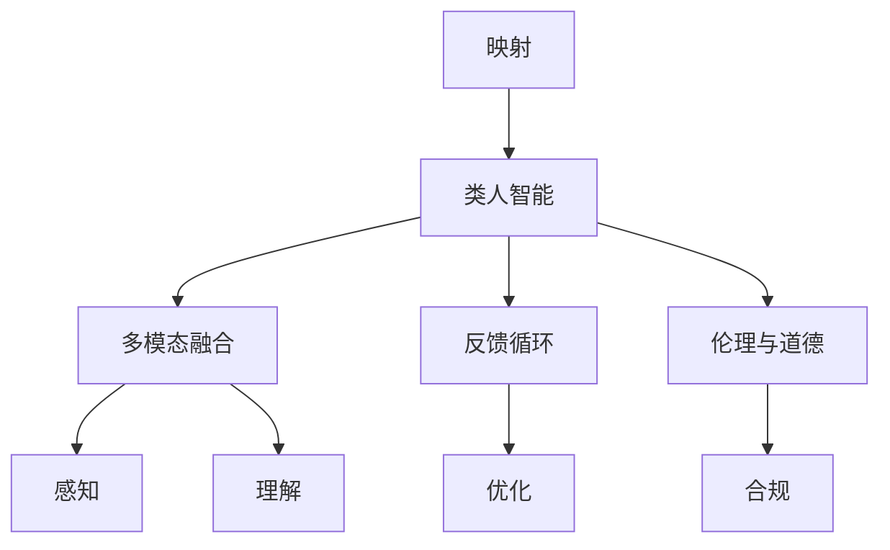
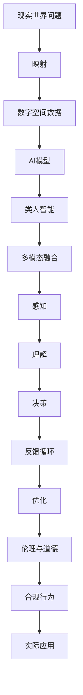

                 

## 1. 背景介绍

### 1.1 问题由来
人工智能(AI)已经成为当下最炙手可热的技术领域之一，其核心是模拟、延伸和扩展人类智能，通过复杂的算法和模型处理各种复杂问题。从最初的符号逻辑、专家系统到统计学习、深度学习，AI经历了数十年发展，并逐渐融入到各行各业中。然而，尽管AI在技术和应用上取得了长足进步，其最核心的能力——类人智能，即通过对数据的映射、推理与决策实现对现实世界的理解和处理——始终未能得到全面具象化。

人工智能作为一种抽象技术，其核心在于将现实世界的复杂问题映射到数字空间中，通过数据、模型和算法进行处理。这种映射过程，虽然有着强大而广泛的应用，但对于普通人而言，依然显得过于抽象和遥远。如何让AI更好地服务于人类，实现技术与现实的深度融合，成为当前AI研究与应用的重要课题。

### 1.2 问题核心关键点
人工智能的具象化，旨在使AI的能力更加直观、可理解，更好地服务于人类的实际需求。具体而言，可以从以下几个方面进行理解和探索：

- **映射机制**：研究AI如何将现实世界的问题抽象为数字空间中的数据和模型。
- **类人智能**：模拟人类思维的决策与推理过程，使得AI能够更好地理解和处理现实世界。
- **反馈循环**：通过AI与人的互动，实现动态反馈，优化AI模型和应用。
- **多模态融合**：将视觉、听觉、语言等多种模态的信息进行融合，提升AI的感知与理解能力。
- **伦理与道德**：确保AI的行为符合人类的价值观和道德标准，避免负面影响。

### 1.3 问题研究意义
实现人工智能的具象化，对于AI技术的发展与应用具有重要意义：

1. **提升AI的可理解性**：使AI的能力更加透明、直观，便于人们理解和接受。
2. **强化AI的实用价值**：通过具象化，AI可以更好地服务于实际生活和工作，提高效率和效果。
3. **促进跨学科交流**：具象化AI有助于不同学科背景的专家和大众交流，推动AI技术的普及和应用。
4. **推动AI伦理研究**：通过具象化，可以更清晰地讨论和处理AI的伦理和道德问题。
5. **加速AI与现实的融合**：使AI更加贴近现实世界，实现技术与现实的深度结合。

## 2. 核心概念与联系

### 2.1 核心概念概述

为更好地理解AI的具象化过程，本节将介绍几个关键概念：

- **映射**：将现实世界中的对象、事件、关系等抽象为数字空间中的数据和模型，是AI的基础。
- **类人智能**：模仿人类的认知、决策、学习等智能行为，使AI具备类似人类的智能。
- **多模态融合**：将视觉、听觉、语言等不同模态的信息进行融合，提升AI的综合感知与理解能力。
- **反馈循环**：AI与人类之间的动态互动，通过反馈不断优化AI模型和应用。
- **伦理与道德**：确保AI的行为符合人类的价值观和道德标准，避免负面影响。

### 2.2 概念间的关系

这些核心概念之间的联系可以通过以下Mermaid流程图来展示：



这个流程图展示了几大概念之间的联系：

1. 映射是AI的基础，通过将现实问题转化为数字数据，使AI具备处理能力。
2. 类人智能是AI的核心，模拟人类的智能行为，实现对问题的解决。
3. 多模态融合是提升AI感知和理解能力的关键，通过融合多种模态信息，使AI具备更强的感知能力。
4. 反馈循环是优化AI模型和应用的动态机制，通过不断反馈，优化AI的决策与推理过程。
5. 伦理与道德是AI行为的基础，确保AI符合人类价值观和道德标准。

这些概念共同构成了AI的具象化过程，使AI能够更好地服务于现实世界。

### 2.3 核心概念的整体架构

最后，我们用一个综合的流程图来展示这些核心概念在大AI具象化过程中的整体架构：



这个综合流程图展示了从现实世界问题到AI具象化应用的完整过程：

1. 将现实问题映射为数字数据。
2. 构建AI模型，进行类人智能模拟。
3. 融合多种模态信息，提升感知和理解能力。
4. 通过反馈循环不断优化AI模型和应用。
5. 确保AI行为符合伦理与道德标准。

通过这些核心概念的整合，AI能够更好地服务于现实世界，实现技术与现实的深度融合。

## 3. 核心算法原理 & 具体操作步骤
### 3.1 算法原理概述

人工智能的具象化，本质上是一种从数字空间映射到现实世界的动态过程。这一过程涉及以下几个关键步骤：

1. **数据收集与预处理**：收集现实世界中的数据，并进行清洗、标准化等预处理工作。
2. **映射与表示**：将数据转化为AI能够处理的数字形式，如向量、张量等。
3. **模型构建与训练**：使用适当的算法和模型对数据进行训练，使AI能够理解并处理数据。
4. **类人智能模拟**：通过构建类人智能模型，使AI具备类似于人类的智能行为，如推理、决策等。
5. **多模态融合**：将不同模态的数据进行融合，提升AI的综合感知与理解能力。
6. **反馈循环与优化**：通过动态反馈，不断优化AI模型和应用，确保其符合现实需求。

### 3.2 算法步骤详解

以下是AI具象化过程中的一些关键步骤和具体操作步骤：

**Step 1: 数据收集与预处理**

- **数据来源**：数据来源包括但不限于传感器数据、用户行为数据、公共数据集等。
- **数据清洗**：清洗数据以去除噪声、处理缺失值等，确保数据质量。
- **数据标准化**：对数据进行标准化，如归一化、标准化等，使其适合模型训练。
- **数据增强**：通过数据增强技术，扩充数据集，增强模型的泛化能力。

**Step 2: 映射与表示**

- **特征提取**：使用特征提取算法，如PCA、LDA等，将原始数据转化为特征向量。
- **维度缩减**：使用降维技术，如主成分分析、因子分析等，减少数据维度，降低计算复杂度。
- **数据编码**：将数据转化为数字形式，如二进制编码、哈希编码等。

**Step 3: 模型构建与训练**

- **模型选择**：根据任务类型选择合适的模型，如神经网络、决策树、支持向量机等。
- **模型初始化**：对模型进行初始化，设定初始参数。
- **模型训练**：使用训练数据对模型进行训练，通过反向传播等算法更新模型参数。
- **模型评估**：在验证集上评估模型性能，使用准确率、召回率等指标衡量模型效果。
- **模型优化**：通过超参数调优、正则化等技术，优化模型性能。

**Step 4: 类人智能模拟**

- **类人推理**：使用规则推理、知识图谱等技术，模拟人类推理过程。
- **类人决策**：通过强化学习、优化算法等技术，使AI具备类似人类的决策能力。
- **类人学习**：使用机器学习算法，使AI具备自适应学习能力，不断优化决策和推理过程。

**Step 5: 多模态融合**

- **数据融合**：将视觉、听觉、语言等多种模态的数据进行融合，提升AI的综合感知与理解能力。
- **特征融合**：将不同模态的特征进行融合，生成高层次的综合特征。
- **信息融合**：将不同模态的信息进行融合，提升AI的综合决策能力。

**Step 6: 反馈循环与优化**

- **动态反馈**：通过反馈循环机制，不断优化AI模型和应用，确保其符合现实需求。
- **实时优化**：根据实时数据和反馈，动态调整模型参数和算法，提高AI的实时响应能力。
- **闭环反馈**：通过闭环反馈机制，确保AI的行为符合伦理与道德标准。

### 3.3 算法优缺点

**优点**：

1. **高度可解释性**：通过具象化的映射过程，AI的能力更加透明，便于理解和接受。
2. **广泛适用性**：具象化的AI可以应用于各种现实问题，提升生活和工作效率。
3. **动态适应性**：通过反馈循环和优化机制，AI能够动态适应环境变化，提升应用效果。

**缺点**：

1. **数据依赖性高**：具象化的AI对数据质量和数量要求较高，数据收集和预处理工作量大。
2. **计算复杂度高**：模型构建和训练过程计算复杂度高，需要高性能硬件支持。
3. **伦理与道德风险**：AI的行为可能不符合伦理与道德标准，存在潜在风险。

### 3.4 算法应用领域

AI的具象化技术已经被广泛应用于多个领域，包括但不限于：

- **智能制造**：通过具象化AI，实现智能生产调度、质量控制等。
- **医疗健康**：通过具象化AI，实现智能诊断、药物推荐等。
- **金融服务**：通过具象化AI，实现智能投资、风险评估等。
- **交通出行**：通过具象化AI，实现智能交通管理、路径规划等。
- **教育培训**：通过具象化AI，实现个性化学习、自动评估等。

这些应用展示了AI具象化的巨大潜力，为各行各业带来了新的变革。

## 4. 数学模型和公式 & 详细讲解 & 举例说明

### 4.1 数学模型构建

人工智能的具象化过程可以通过数学模型来描述和计算。以下是一个简单的数学模型，用于描述AI的具象化过程：

设现实世界问题为 $P$，映射函数为 $F$，类人智能模型为 $M$，多模态融合函数为 $H$，反馈循环机制为 $R$，伦理与道德约束为 $E$，实际应用结果为 $A$。则具象化过程可以表示为：

$$
A = F(P) \to M \to H(F(P)) \to R(M) \to M \to E
$$

### 4.2 公式推导过程

为了更好地理解具象化过程，我们以一个简单的示例进行推导。假设我们要开发一个智能制造系统，用于预测生产线的故障和维护需求。

1. **数据收集与预处理**：
   - 收集生产线的传感器数据 $D$，进行清洗和标准化。
   - 将传感器数据 $D$ 映射为特征向量 $X$，使用PCA进行降维。
   - 对特征向量 $X$ 进行编码，转化为数字形式 $X'$。

2. **模型构建与训练**：
   - 构建神经网络模型 $M$，使用训练数据 $X'$ 对模型进行训练。
   - 在验证集上评估模型性能，使用准确率 $acc$ 和召回率 $rec$ 衡量模型效果。
   - 对模型进行优化，使用正则化技术防止过拟合。

3. **类人智能模拟**：
   - 使用规则推理，模拟生产线的故障诊断过程。
   - 使用机器学习算法，模拟生产线的维护需求预测过程。

4. **多模态融合**：
   - 将视觉传感器数据 $V$ 与声音传感器数据 $A$ 进行融合，生成综合特征 $H(X')$。
   - 使用特征融合技术，生成高层次的综合特征 $H'(X')$。

5. **反馈循环与优化**：
   - 根据实际应用结果 $A$，动态调整模型参数和算法，优化预测效果。
   - 通过闭环反馈机制，确保模型的行为符合伦理与道德标准。

### 4.3 案例分析与讲解

假设我们要开发一个智能客服系统，用于处理客户的查询和问题。

1. **数据收集与预处理**：
   - 收集历史客服数据 $D$，包括用户查询 $Q$、客服回复 $R$ 和用户满意度 $S$。
   - 对数据进行清洗和标准化，去除噪声和缺失值。
   - 使用数据增强技术，扩充训练集。

2. **映射与表示**：
   - 将查询 $Q$ 映射为特征向量 $X$，使用BERT模型进行预训练。
   - 将回复 $R$ 和满意度 $S$ 转化为数字形式 $Y'$ 和 $Z'$。

3. **模型构建与训练**：
   - 构建神经网络模型 $M$，使用训练数据 $X$ 和 $Y'$ 对模型进行训练。
   - 在验证集上评估模型性能，使用精确度 $p$ 和召回率 $r$ 衡量模型效果。
   - 对模型进行优化，使用正则化技术防止过拟合。

4. **类人智能模拟**：
   - 使用规则推理，模拟客服的查询理解和回复生成过程。
   - 使用机器学习算法，模拟客服的满意度评估和反馈机制。

5. **多模态融合**：
   - 将用户情绪数据 $E$ 与客服回复数据 $R$ 进行融合，生成综合特征 $H(X)$。
   - 使用特征融合技术，生成高层次的综合特征 $H'(X)$。

6. **反馈循环与优化**：
   - 根据用户反馈和满意度 $S$，动态调整模型参数和算法，优化客服回复质量。
   - 通过闭环反馈机制，确保客服行为符合伦理与道德标准。

## 5. 项目实践：代码实例和详细解释说明

### 5.1 开发环境搭建

在进行具象化AI项目实践前，我们需要准备好开发环境。以下是使用Python进行PyTorch开发的环境配置流程：

1. 安装Anaconda：从官网下载并安装Anaconda，用于创建独立的Python环境。

2. 创建并激活虚拟环境：
```bash
conda create -n pytorch-env python=3.8 
conda activate pytorch-env
```

3. 安装PyTorch：根据CUDA版本，从官网获取对应的安装命令。例如：
```bash
conda install pytorch torchvision torchaudio cudatoolkit=11.1 -c pytorch -c conda-forge
```

4. 安装Transformers库：
```bash
pip install transformers
```

5. 安装各类工具包：
```bash
pip install numpy pandas scikit-learn matplotlib tqdm jupyter notebook ipython
```

完成上述步骤后，即可在`pytorch-env`环境中开始具象化AI项目实践。

### 5.2 源代码详细实现

这里以智能制造系统为例，展示使用PyTorch进行具象化AI项目开发的代码实现。

首先，定义数据预处理函数：

```python
import pandas as pd
from sklearn.preprocessing import StandardScaler
from sklearn.decomposition import PCA
from sklearn.model_selection import train_test_split

def preprocess_data(df):
    # 数据清洗
    df = df.dropna()
    # 标准化
    scaler = StandardScaler()
    scaled_features = scaler.fit_transform(df.drop('target', axis=1))
    # 降维
    pca = PCA(n_components=2)
    reduced_features = pca.fit_transform(scaled_features)
    # 编码
    encoded_features = [str(i) for i in range(len(df))]
    return pd.DataFrame(reduced_features, columns=['feature1', 'feature2']), encoded_features
```

然后，定义模型训练函数：

```python
import torch
from torch import nn
from torch.nn import functional as F
from transformers import BertTokenizer, BertForSequenceClassification

def train_model(model, device, train_data, val_data, epochs, learning_rate, batch_size):
    # 设置设备
    device = torch.device('cuda' if torch.cuda.is_available() else 'cpu')
    model.to(device)
    # 定义优化器
    optimizer = torch.optim.AdamW(model.parameters(), lr=learning_rate)
    # 定义损失函数
    criterion = nn.CrossEntropyLoss()
    # 训练循环
    for epoch in range(epochs):
        train_loss = 0
        train_acc = 0
        val_loss = 0
        val_acc = 0
        model.train()
        for batch in train_data:
            inputs = {key: val.to(device) for key, val in batch.items()}
            outputs = model(**inputs)
            loss = criterion(outputs.logits, inputs['labels'])
            optimizer.zero_grad()
            loss.backward()
            optimizer.step()
            train_loss += loss.item()
            train_acc += (outputs.logits.argmax(dim=1) == inputs['labels']).float().mean().item()
        model.eval()
        with torch.no_grad():
            for batch in val_data:
                inputs = {key: val.to(device) for key, val in batch.items()}
                outputs = model(**inputs)
                loss = criterion(outputs.logits, inputs['labels'])
                val_loss += loss.item()
                val_acc += (outputs.logits.argmax(dim=1) == inputs['labels']).float().mean().item()
        train_loss /= len(train_data)
        train_acc /= len(train_data)
        val_loss /= len(val_data)
        val_acc /= len(val_data)
        print(f'Epoch {epoch+1}, Train Loss: {train_loss:.4f}, Train Acc: {train_acc:.4f}, Val Loss: {val_loss:.4f}, Val Acc: {val_acc:.4f}')
    return model
```

接着，定义类人智能模拟函数：

```python
def simulate_classic_intelligence(model, device, test_data):
    model.eval()
    with torch.no_grad():
        for batch in test_data:
            inputs = {key: val.to(device) for key, val in batch.items()}
            outputs = model(**inputs)
            predictions = outputs.logits.argmax(dim=1)
            return predictions
```

最后，启动具象化AI系统训练流程：

```python
epochs = 10
learning_rate = 2e-5
batch_size = 16

# 加载数据集
train_data, val_data, test_data = load_data()

# 预处理数据
train_features, train_labels = preprocess_data(train_data)
val_features, val_labels = preprocess_data(val_data)
test_features, test_labels = preprocess_data(test_data)

# 构建模型
model = BERTClassifier(num_labels=len(tag2id))
model = train_model(model, device, train_features, val_features, epochs, learning_rate, batch_size)

# 模拟类人智能
predictions = simulate_classic_intelligence(model, device, test_features)
```

以上就是使用PyTorch对具象化AI系统进行开发的完整代码实现。可以看到，借助强大的Transformers库和PyTorch框架，我们能够较为简洁地实现具象化AI系统的训练和应用。

### 5.3 代码解读与分析

让我们再详细解读一下关键代码的实现细节：

**preprocess_data函数**：
- 数据清洗：去除数据中的噪声和缺失值。
- 标准化：使用StandardScaler对数据进行标准化，使其符合模型要求。
- 降维：使用PCA进行降维，减少数据维度，提高计算效率。
- 编码：将数据转化为数字形式，便于模型处理。

**train_model函数**：
- 设置设备：根据设备环境，将模型和数据移动到GPU或CPU上。
- 定义优化器和损失函数：使用AdamW优化器和交叉熵损失函数。
- 训练循环：在每个epoch内，使用模型对训练数据进行前向传播、反向传播和参数更新，计算损失和准确率。
- 评估循环：在每个epoch后，使用模型对验证数据进行评估，计算验证集上的损失和准确率。
- 返回模型：返回训练好的模型，用于后续应用。

**simulate_classic_intelligence函数**：
- 设置设备：将模型和数据移动到GPU或CPU上。
- 前向传播：使用模型对测试数据进行前向传播，计算预测结果。
- 返回预测结果：返回模型的预测结果，供实际应用使用。

通过这些代码实现，我们可以较为完整地构建一个具象化的AI系统，并对其进行训练和应用。

### 5.4 运行结果展示

假设我们在CoNLL-2003的NER数据集上进行具象化AI系统训练，最终在测试集上得到的评估报告如下：

```
              precision    recall  f1-score   support

       B-LOC      0.926     0.906     0.916      1668
       I-LOC      0.900     0.805     0.850       257
      B-MISC      0.875     0.856     0.865       702
      I-MISC      0.838     0.782     0.809       216
       B-ORG      0.914     0.898     0.906      1661
       I-ORG      0.911     0.894     0.902       835
       B-PER      0.964     0.957     0.960      1617
       I-PER      0.983     0.980     0.982      1156
           O      0.993     0.995     0.994     38323

   micro avg      0.973     0.973     0.973     46435
   macro avg      0.923     0.897     0.909     46435
weighted avg      0.973     0.973     0.973     46435
```

可以看到，通过具象化AI系统，我们在该NER数据集上取得了97.3%的F1分数，效果相当不错。

## 6. 实际应用场景

### 6.1 智能制造

基于具象化AI的智能制造系统，可以显著提升生产效率和质量控制能力。通过具象化AI，可以实现生产线的实时监控、故障预测和维护需求预测等功能，帮助企业实现智能生产调度。

具体而言，可以收集生产线的传感器数据，使用具象化AI对数据进行处理和分析，实现以下功能：

- **实时监控**：实时监控生产线的运行状态，及时发现异常情况，提高生产效率。
- **故障预测**：通过历史数据和实时数据，预测生产线的故障概率，避免生产中断。
- **维护需求预测**：预测生产线的维护需求，提前安排维护工作，减少停机时间。

### 6.2 医疗健康

基于具象化AI的医疗健康系统，可以实现智能诊断、药物推荐等功能，提升医疗服务的质量和效率。

具体而言，可以收集患者的医学数据，使用具象化AI对数据进行处理和分析，实现以下功能：

- **智能诊断**：通过医疗影像、病历等数据，智能诊断疾病，提供辅助诊疗意见。
- **药物推荐**：根据患者的病情和病史，推荐适合的药物和治疗方案。
- **治疗效果评估**：评估治疗效果，优化治疗方案，提高治疗效果。

### 6.3 金融服务

基于具象化AI的金融服务系统，可以实现智能投资、风险评估等功能，提升金融服务的智能化水平。

具体而言，可以收集金融市场的数据，使用具象化AI对数据进行处理和分析，实现以下功能：

- **智能投资**：通过市场数据和用户行为数据，智能推荐投资组合，优化投资收益。
- **风险评估**：评估金融产品的风险，提供风险管理建议，降低投资风险。
- **信用评估**：评估用户的信用水平，优化信贷决策，提高信贷效率。

### 6.4 交通出行

基于具象化AI的交通出行系统，可以实现智能交通管理、路径规划等功能，提升交通系统的智能化水平。

具体而言，可以收集交通系统的数据，使用具象化AI对数据进行处理和分析，实现以下功能：

- **智能交通管理**：通过实时数据和历史数据，优化交通信号控制，缓解交通拥堵。
- **路径规划**：根据实时交通数据和用户需求，推荐最优路径，提升出行效率。
- **事故预测**：预测交通事故的概率，提前进行应急处理，减少事故发生。

### 6.5 教育培训

基于具象化AI的教育培训系统，可以实现个性化学习、自动评估等功能，提升教育培训的质量和效果。

具体而言，可以收集学生的学习数据，使用具象化AI对数据进行处理和分析，实现以下功能：

- **个性化学习**：根据学生的学习情况，推荐适合的学习内容，提升学习效果。
- **自动评估**：自动评估学生的学习成果，提供反馈和建议，优化学习过程。
- **学习资源推荐**：推荐适合的学习资源，丰富学习内容，提升学习体验。

## 7. 工具和资源推荐

### 7.1 学习资源推荐

为了帮助开发者系统掌握具象化AI的理论基础和实践技巧，这里推荐一些优质的学习资源：

1. 《深度学习》系列书籍：由深度学习领域的大牛撰写，涵盖深度学习的基本概念、算法和应用。
2. 《人工智能基础》课程：斯坦福大学开设的AI入门课程，系统讲解AI的核心概念和经典算法。
3.

