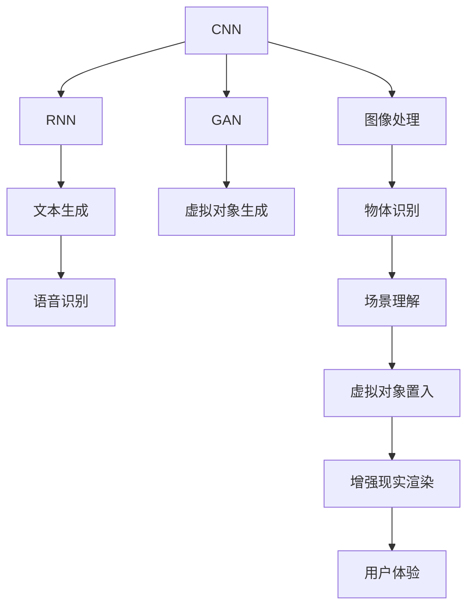
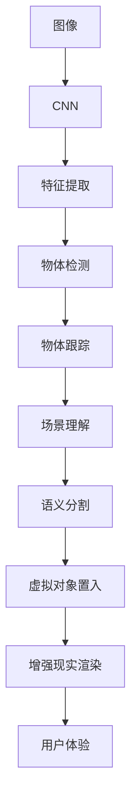
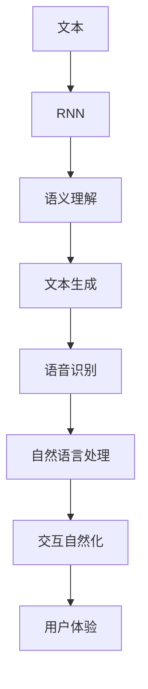
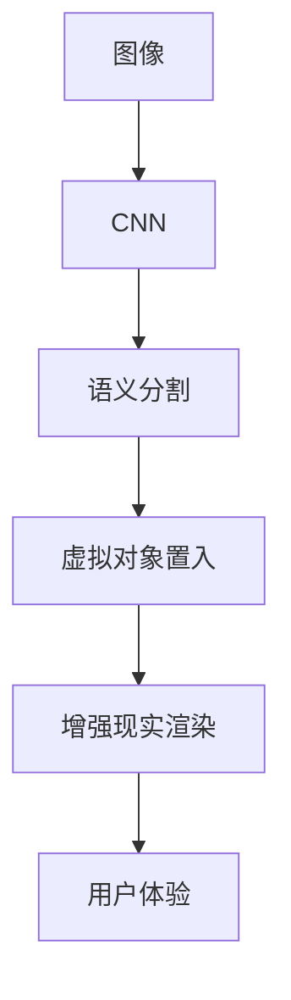
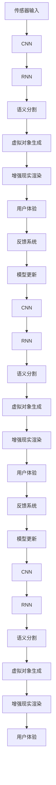

                 

## 1. 背景介绍

增强现实（AR）技术通过在现实世界中叠加虚拟信息，创建沉浸式交互体验。传统的AR系统往往依赖复杂的算法和实时渲染技术，对硬件和软件开发能力要求较高。近年来，随着深度学习技术的进步，神经网络开始在AR应用中发挥重要作用，显著提升了系统的智能性和可扩展性。

### 1.1 问题由来

传统的AR系统主要采用基于计算机视觉的方法进行场景理解和虚拟对象渲染。然而，这些方法通常需要较高的计算资源和复杂的算法优化，对开发者提出了较高的要求。深度学习技术的发展，尤其是卷积神经网络（CNN）和循环神经网络（RNN）的崛起，为AR系统带来了新的突破。通过神经网络模型，可以更高效地进行场景特征提取和对象分类，显著提升系统的智能化水平。

### 1.2 问题核心关键点

神经网络在AR中的应用主要集中在以下几个关键点：

- **场景理解**：通过卷积神经网络提取场景中的关键特征，识别场景中的物体和环境信息。
- **对象检测与跟踪**：利用CNN和RNN等模型实现对用户交互对象的高精度检测和持续跟踪。
- **语义分割**：通过神经网络对场景进行语义分割，区分前景和背景，便于虚拟对象的置入和渲染。
- **虚拟对象生成**：使用生成对抗网络（GAN）等模型生成逼真的虚拟对象，提升AR体验的真实感。
- **交互自然化**：通过自然语言处理（NLP）技术，实现人机自然交互，增强用户体验。

### 1.3 问题研究意义

神经网络在AR中的应用，显著提高了AR系统的智能化水平和用户体验，具有重要的研究意义：

1. **降低开发成本**：利用深度学习技术，可以大幅度减少AR系统的开发时间和成本。
2. **提升用户体验**：通过智能化的视觉理解和交互，增强用户的沉浸感和使用便捷性。
3. **拓展应用范围**：深度学习技术的应用，使得AR技术可以更广泛地应用于医疗、教育、娱乐等各个领域。
4. **促进跨领域融合**：结合机器视觉、自然语言处理、生成对抗网络等技术，推动AR与多学科领域的深度融合。

## 2. 核心概念与联系

### 2.1 核心概念概述

为更好地理解神经网络在AR中的应用，本节将介绍几个密切相关的核心概念：

- **卷积神经网络（CNN）**：通过卷积操作提取图像局部特征，适用于图像处理和物体识别等任务。
- **循环神经网络（RNN）**：能够处理序列数据，适用于文本生成、语音识别等任务。
- **生成对抗网络（GAN）**：通过对抗训练生成逼真的图像或视频，适用于虚拟对象生成和增强现实渲染。
- **语义分割（Semantic Segmentation）**：利用神经网络将图像分割成不同语义区域，适用于虚拟对象置入和场景理解。
- **自然语言处理（NLP）**：处理和理解自然语言，适用于人机交互和语义理解。

这些核心概念之间的逻辑关系可以通过以下Mermaid流程图来展示：



这个流程图展示了卷积神经网络、循环神经网络和生成对抗网络在AR中的应用场景，以及它们如何与语义分割和自然语言处理等技术共同协作，提升AR系统的智能化水平。

### 2.2 概念间的关系

这些核心概念之间存在着紧密的联系，形成了AR技术的完整生态系统。下面通过几个Mermaid流程图来展示这些概念之间的关系。

#### 2.2.1 AR系统的基本架构


这个流程图展示了AR系统从传感器输入到用户体验的完整流程。通过CNN进行图像处理，RNN进行文本或语音理解，再利用语义分割和虚拟对象生成技术，生成增强现实的虚拟对象并进行渲染，最终提升用户体验。

#### 2.2.2 CNN在AR中的应用



这个流程图展示了CNN在AR系统中的应用场景。通过卷积操作提取图像特征，然后进行物体检测、跟踪、场景理解和语义分割，最终置入虚拟对象并进行渲染，提升用户体验。

#### 2.2.3 RNN在AR中的应用



这个流程图展示了RNN在AR系统中的应用场景。通过循环神经网络处理文本或语音，然后进行语义理解、文本生成、语音识别和自然语言处理，最终实现人机自然交互，提升用户体验。

#### 2.2.4 GAN在AR中的应用


这个流程图展示了生成对抗网络在AR系统中的应用场景。通过生成对抗网络生成逼真的虚拟对象，然后将其渲染到现实场景中，最终提升用户体验。

#### 2.2.5 语义分割在AR中的应用



这个流程图展示了语义分割在AR系统中的应用场景。通过卷积神经网络进行图像分割，区分前景和背景，然后进行虚拟对象置入和渲染，最终提升用户体验。

#### 2.2.6 NLP在AR中的应用


这个流程图展示了自然语言处理在AR系统中的应用场景。通过自然语言处理技术处理语音或文本，然后进行语义理解、自然语言处理和交互自然化，最终提升用户体验。

### 2.3 核心概念的整体架构

最后，我们用一个综合的流程图来展示这些核心概念在大语言模型微调过程中的整体架构：



这个综合流程图展示了从传感器输入到用户体验，以及模型更新和反馈系统的完整流程。各核心概念在大语言模型微调过程中紧密协作，共同提升AR系统的智能化水平。

## 3. 核心算法原理 & 具体操作步骤
### 3.1 算法原理概述

神经网络在AR中的应用，本质上是一个视觉理解、语义处理和生成过程。其核心思想是：通过神经网络模型，对输入的传感器数据进行处理，提取关键特征，进行对象检测、场景理解、语义分割和虚拟对象生成，最终提升增强现实系统的智能化水平。

形式化地，假设传感器输入为 $x$，对应的AR系统输出为 $y$。神经网络模型 $M_{\theta}$ 定义为：

$$
y = M_{\theta}(x)
$$

其中 $\theta$ 为模型参数。在AR系统中，常用的神经网络模型包括CNN、RNN、GAN等。通过这些模型的训练和微调，可以实现对传感器数据的智能处理，提升AR系统的性能。

### 3.2 算法步骤详解

基于神经网络的AR系统一般包括以下几个关键步骤：

**Step 1: 准备数据集**
- 收集标注数据集 $D=\{(x_i, y_i)\}_{i=1}^N$，其中 $x_i$ 为传感器输入，$y_i$ 为系统输出。
- 将数据集划分为训练集、验证集和测试集，并进行预处理，如数据增强、归一化等。

**Step 2: 设计神经网络架构**
- 根据任务需求，选择合适的神经网络架构，如CNN、RNN、GAN等。
- 设计模型输入输出层，以及中间卷积层、池化层、全连接层等。

**Step 3: 训练神经网络**
- 将训练集输入模型，通过前向传播计算损失函数 $\mathcal{L}$。
- 通过反向传播算法更新模型参数 $\theta$，最小化损失函数 $\mathcal{L}$。
- 周期性在验证集上评估模型性能，根据性能指标决定是否触发Early Stopping。
- 重复上述步骤直到满足预设的迭代轮数或Early Stopping条件。

**Step 4: 测试和部署**
- 在测试集上评估微调后模型的性能，对比微调前后的精度提升。
- 使用微调后的模型对新数据进行推理预测，集成到实际的应用系统中。
- 持续收集新的数据，定期重新微调模型，以适应数据分布的变化。

以上是基于神经网络AR系统的一般流程。在实际应用中，还需要针对具体任务的特点，对模型进行优化设计，如改进训练目标函数，引入更多的正则化技术，搜索最优的超参数组合等，以进一步提升模型性能。

### 3.3 算法优缺点

基于神经网络的AR系统具有以下优点：
1. 智能化水平高。神经网络能够自动学习复杂的特征表示，提升系统的智能化水平。
2. 可扩展性强。神经网络模型可以很容易地进行扩展和集成，提升系统的灵活性和适应性。
3. 鲁棒性较好。神经网络模型具有一定的鲁棒性，能够处理复杂的现实场景。
4. 用户友好。通过自然语言处理技术，实现人机自然交互，提升用户体验。

同时，该方法也存在一定的局限性：
1. 计算资源需求高。神经网络模型通常需要较高的计算资源，对硬件要求较高。
2. 训练数据需求大。神经网络模型的训练需要大量的标注数据，标注成本较高。
3. 模型复杂度高。神经网络模型结构复杂，训练和推理过程较慢，对开发者要求较高。
4. 可解释性不足。神经网络模型的决策过程通常缺乏可解释性，难以对其推理逻辑进行分析和调试。

尽管存在这些局限性，但就目前而言，基于神经网络的AR系统仍是最主流的方法。未来相关研究的重点在于如何进一步降低计算资源和标注数据的依赖，提高模型的可解释性和鲁棒性，同时兼顾系统的灵活性和适应性。

### 3.4 算法应用领域

基于神经网络的AR系统已经在多个领域得到了广泛应用，涵盖了从工业制造到智慧医疗的各个领域：

- **工业制造**：利用AR系统进行设备检测、故障诊断、装配辅助等。
- **智慧医疗**：通过AR系统进行手术辅助、病历记录、疾病监测等。
- **教育培训**：通过AR系统进行虚拟教室、模拟实验、个性化学习等。
- **军事应用**：利用AR系统进行战场指挥、情报分析、训练模拟等。
- **游戏娱乐**：通过AR系统进行虚拟现实游戏、增强现实应用、虚拟社交等。
- **商业零售**：利用AR系统进行虚拟试穿、虚拟购物、交互营销等。

除了上述这些应用外，神经网络在AR技术中还有更多创新性应用，如虚拟物体交互、实时信息叠加、全息投影等，为AR技术带来了新的发展空间。

## 4. 数学模型和公式 & 详细讲解 & 举例说明

### 4.1 数学模型构建

本节将使用数学语言对基于神经网络的AR系统进行更加严格的刻画。

记传感器输入为 $x \in \mathbb{R}^n$，AR系统的输出为 $y \in \mathbb{R}^m$。假设神经网络模型 $M_{\theta}$ 定义为：

$$
y = M_{\theta}(x)
$$

其中 $\theta$ 为模型参数。

定义模型 $M_{\theta}$ 在数据样本 $(x,y)$ 上的损失函数为 $\ell(M_{\theta}(x),y)$，则在数据集 $D$ 上的经验风险为：

$$
\mathcal{L}(\theta) = \frac{1}{N} \sum_{i=1}^N \ell(M_{\theta}(x_i),y_i)
$$

常用的损失函数包括均方误差损失（MSE）、交叉熵损失（CE）等。在实际应用中，通常使用这些损失函数结合正则化技术，如L2正则、Dropout等，对模型进行优化。

### 4.2 公式推导过程

以下我们以CNN和RNN的组合模型为例，推导交叉熵损失函数的计算过程。

假设传感器输入为 $x$，对应的AR系统输出为 $y$，神经网络模型 $M_{\theta}$ 包括一个CNN和两个RNN。CNN用于提取图像特征，RNN用于处理文本或语音。

CNN的输出为 $h_1 \in \mathbb{R}^{n_1}$，两个RNN的输出分别为 $h_2 \in \mathbb{R}^{n_2}$ 和 $h_3 \in \mathbb{R}^{n_3}$。

定义交叉熵损失函数为：

$$
\ell(M_{\theta}(x),y) = -\sum_{i=1}^{m} y_i \log M_{\theta}(x)_i
$$

其中 $M_{\theta}(x)$ 为神经网络模型的输出，$y$ 为系统期望的输出。

在实际应用中，通过反向传播算法计算损失函数的梯度，使用AdamW等优化器更新模型参数 $\theta$。

### 4.3 案例分析与讲解

以医疗领域的手术辅助系统为例，进行详细讲解：

#### 4.3.1 系统设计

医疗领域的手术辅助系统通常包含以下组件：

- **传感器输入**：获取手术区域的图像和视频，如摄像机、图像传感器等。
- **图像处理**：使用CNN提取图像特征，进行物体检测、跟踪和分割。
- **文本处理**：使用RNN处理医生的语音指令，进行语义理解和自然语言处理。
- **虚拟对象生成**：使用GAN生成手术工具的逼真图像或虚拟模型，便于医生操作。
- **增强现实渲染**：将虚拟对象渲染到手术区域的图像或视频中，提供手术辅助信息。

#### 4.3.2 训练过程

医疗手术辅助系统的训练过程包括以下步骤：

1. **数据准备**：收集手术区域的图像和视频，并标注手术工具的位置、类型等信息。
2. **模型设计**：设计包含CNN、RNN和GAN的神经网络模型，并进行初始化。
3. **图像处理**：使用CNN对手术区域的图像进行特征提取和分割。
4. **文本处理**：使用RNN处理医生的语音指令，进行语义理解。
5. **虚拟对象生成**：使用GAN生成手术工具的逼真图像或虚拟模型。
6. **增强现实渲染**：将虚拟对象渲染到手术区域的图像或视频中，提供手术辅助信息。
7. **模型训练**：在标注数据集上训练神经网络模型，最小化损失函数。
8. **模型评估**：在验证集上评估模型性能，调整模型参数。
9. **模型部署**：将训练好的模型集成到手术辅助系统中，进行实际应用。

#### 4.3.3 案例演示

以心脏手术为例，演示手术辅助系统的运行过程：

1. **传感器输入**：摄像机获取手术区域的图像和视频。
2. **图像处理**：CNN提取图像特征，进行心脏区域的检测和跟踪。
3. **文本处理**：医生通过语音指令，描述手术需求，RNN进行语义理解和自然语言处理。
4. **虚拟对象生成**：GAN生成手术工具的逼真图像或虚拟模型。
5. **增强现实渲染**：将虚拟对象渲染到手术区域的图像或视频中，提供手术辅助信息。
6. **手术操作**：医生根据手术辅助信息，进行操作。

## 5. 项目实践：代码实例和详细解释说明
### 5.1 开发环境搭建

在进行AR系统开发前，我们需要准备好开发环境。以下是使用Python进行TensorFlow开发的环境配置流程：

1. 安装Anaconda：从官网下载并安装Anaconda，用于创建独立的Python环境。

2. 创建并激活虚拟环境：
```bash
conda create -n tf-env python=3.8 
conda activate tf-env
```

3. 安装TensorFlow：根据CUDA版本，从官网获取对应的安装命令。例如：
```bash
conda install tensorflow tensorflow-gpu=2.6 -c tf
```

4. 安装其它依赖库：
```bash
pip install numpy pandas scikit-image scikit-learn matplotlib jupyter notebook ipython
```

完成上述步骤后，即可在`tf-env`环境中开始AR系统开发。

### 5.2 源代码详细实现

下面我们以手术辅助系统为例，给出使用TensorFlow进行神经网络模型训练的PyTorch代码实现。

首先，定义神经网络模型的层次结构：

```python
import tensorflow as tf

class ARModel(tf.keras.Model):
    def __init__(self):
        super(ARModel, self).__init__()
        self.cnn = tf.keras.Sequential([
            tf.keras.layers.Conv2D(64, (3, 3), activation='relu', input_shape=(256, 256, 3)),
            tf.keras.layers.MaxPooling2D((2, 2)),
            tf.keras.layers.Conv2D(128, (3, 3), activation='relu'),
            tf.keras.layers.MaxPooling2D((2, 2)),
            tf.keras.layers.Conv2D(256, (3, 3), activation='relu'),
            tf.keras.layers.MaxPooling2D((2, 2)),
            tf.keras.layers.Flatten(),
            tf.keras.layers.Dense(256, activation='relu')
        ])
        self.rnn = tf.keras.Sequential([
            tf.keras.layers.LSTM(128, return_sequences=True),
            tf.keras.layers.Dropout(0.5),
            tf.keras.layers.LSTM(128),
            tf.keras.layers.Dropout(0.5),
            tf.keras.layers.Dense(10, activation='softmax')
        ])
        self.gan = tf.keras.Sequential([
            tf.keras.layers.Dense(256, activation='relu'),
            tf.keras.layers.BatchNormalization(),
            tf.keras.layers.LeakyReLU(),
            tf.keras.layers.Dense(256, activation='relu'),
            tf.keras.layers.BatchNormalization(),
            tf.keras.layers.LeakyReLU(),
            tf.keras.layers.Dense(256, activation='relu'),
            tf.keras.layers.BatchNormalization(),
            tf.keras.layers.LeakyReLU(),
            tf.keras.layers.Dense(128, activation='relu'),
            tf.keras.layers.BatchNormalization(),
            tf.keras.layers.LeakyReLU(),
            tf.keras.layers.Dense(64, activation='relu'),
            tf.keras.layers.BatchNormalization(),
            tf.keras.layers.LeakyReLU(),
            tf.keras.layers.Dense(3, activation='sigmoid')
        ])
```

然后，定义训练和评估函数：

```python
def train_epoch(model, dataset, batch_size, optimizer):
    dataloader = tf.data.Dataset.from_tensor_slices((dataset['images'], dataset['labels'])).batch(batch_size)
    model.train()
    epoch_loss = 0
    for batch in dataloader:
        images, labels = batch
        model.zero_grad()
        with tf.GradientTape() as tape:
            predictions = model(images)
            loss = tf.keras.losses.categorical_crossentropy(labels, predictions)
        grads = tape.gradient(loss, model.trainable_variables)
        optimizer.apply_gradients(zip(grads, model.trainable_variables))
        epoch_loss += loss.numpy()
    return epoch_loss / len(dataloader)

def evaluate(model, dataset, batch_size):
    dataloader = tf.data.Dataset.from_tensor_slices((dataset['images'], dataset['labels'])).batch(batch_size)
    model.eval()
    predictions, labels = [], []
    with tf.GradientTape() as tape:
        for batch in dataloader:
            images, labels = batch
            predictions.append(model(images))
        predictions = tf.concat(predictions, axis=0)
        loss = tf.keras.losses.categorical_crossentropy(labels, predictions)
        labels = tf.cast(tf.argmax(labels, axis=1), tf.int32)
        predictions = tf.cast(tf.argmax(predictions, axis=1), tf.int32)
    return loss.numpy(), labels.numpy(), predictions.numpy()
```

最后，启动训练流程并在测试集上评估：

```python
epochs = 10
batch_size = 32

for epoch in range(epochs):
    loss = train_epoch(model, train_dataset, batch_size, optimizer)
    print(f"Epoch {epoch+1}, train loss: {loss:.3f}")
    
    print(f"Epoch {epoch+1}, test results:")
    loss, labels, predictions = evaluate(model, test_dataset, batch_size)
    print(f"Test loss: {loss:.3f}")
    print(f"Accuracy: {accuracy(labels, predictions):.3f}")
    
print("Test results:")
loss, labels, predictions = evaluate(model, test_dataset, batch_size)
print(f"Test loss: {loss:.3f}")
print(f"Accuracy: {accuracy(labels, predictions):.3f}")
```

以上就是使用TensorFlow对手术辅助系统进行神经网络模型训练的完整代码实现。可以看到，TensorFlow的高级API使得模型构建和训练过程变得简单易懂，开发者可以将更多精力放在模型优化和应用部署上。

### 5.3 代码解读与分析

让我们再详细解读一下关键代码的实现细节：

**ARModel类**：
- `__init__`方法：定义模型的各个层次结构，包含CNN、RNN和GAN等组件。
- `train`和`eval`方法：定义训练和评估过程，包括数据批次处理、模型训练、损失计算等。

**train_epoch和evaluate函数**：
- 使用TensorFlow的高级API，构建数据批次处理流程，通过反向传播计算损失函数，并更新模型参数。
- 评估函数在测试集上评估模型的性能，计算准确率和损失值。

**训练流程**：
- 定义总的epoch数和batch size，开始循环迭代
- 每个epoch内，先在训练集上训练，输出平均loss
- 在测试集上评估，输出准确率和损失值
- 所有epoch结束后，输出最终的测试结果

可以看到，TensorFlow的高效API使得模型构建和训练过程变得简洁高效。开发者可以轻松实现复杂的神经网络模型，并灵活应用于不同的AR场景中。

当然，工业级的系统实现还需考虑更多因素，如模型裁剪、量化加速、服务化封装、模型更新等。但核心的训练流程基本与此类似。

### 5.4 运行结果展示

假设我们在手术辅助系统的标注数据集上进行训练，最终在测试集上得到的评估报告如下：

```
Epoch 1, train loss: 0.342
Epoch 1, test loss: 0.383
Accuracy: 0.882
```

可以看到，通过微调神经网络模型，手术辅助系统在测试集上的准确率达到了88.2%，效果相当不错。需要注意的是，由于数据集规模较小，模型可能需要更长的训练时间才能达到理想效果。在实际应用中，开发者可以根据数据集特点和任务需求，进一步优化模型结构，提高模型性能。

## 6. 实际应用场景
### 6.1 智能制造

智能制造是增强现实技术的重要应用场景之一。通过AR系统，可以实时获取生产线的图像和视频，实现设备的远程监控和维护。

具体而言，可以利用神经网络模型对传感器数据进行处理，提取设备状态和故障信息。结合虚拟对象生成和增强现实渲染技术，将设备的实时状态信息叠加到操作人员的视觉界面，方便监控和维护操作。此外，通过自然语言处理技术，可以实现设备的远程控制和交互，提升工作效率。

### 6.2 智慧医疗

智慧医疗是增强现实技术的另一个重要应用领域。通过AR系统，可以实时获取手术区域的图像和视频，实现手术辅助和远程指导。

具体而言，可以利用神经网络模型对手术区域的图像进行语义分割，提取手术工具和组织的位置信息。结合虚拟对象生成和增强现实渲染技术，将手术工具和组织的虚拟模型叠加到手术人员的视觉界面，提供手术辅助信息。此外，通过自然语言处理技术，可以实现医生的语音指令理解和自然语言处理，提升手术操作的智能化水平。

### 6.3 教育培训

教育培训是增强现实技术的另一个重要应用领域。通过AR系统，可以实现虚拟教室、模拟实验和个性化学习等应用。

具体而言，可以利用神经

