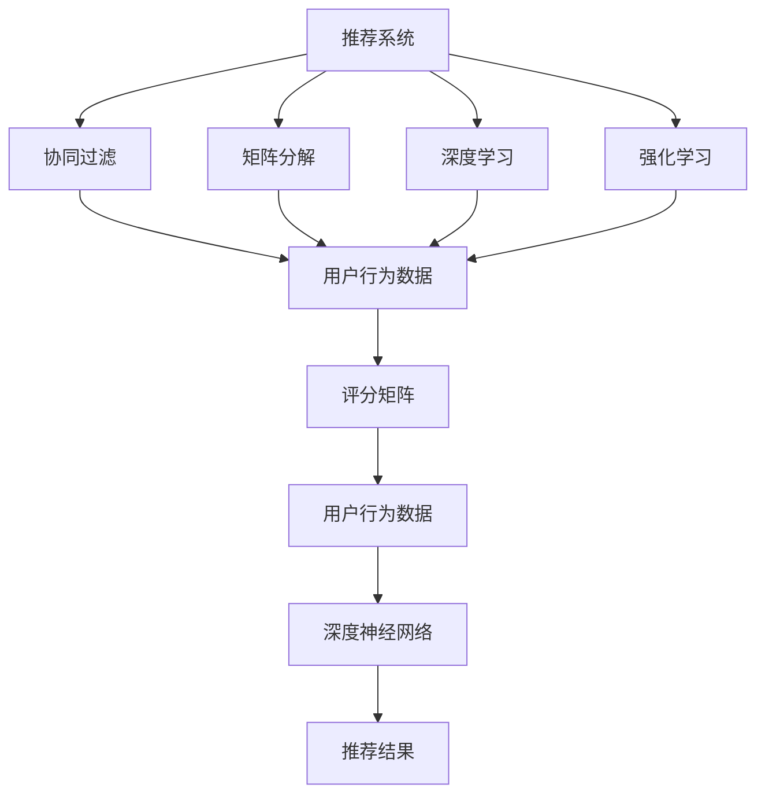
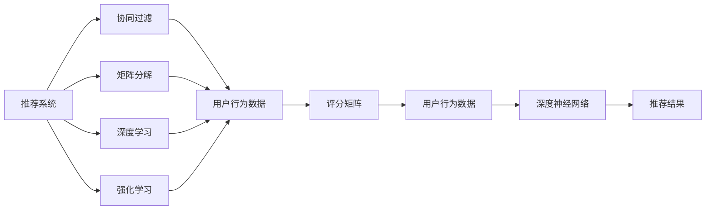
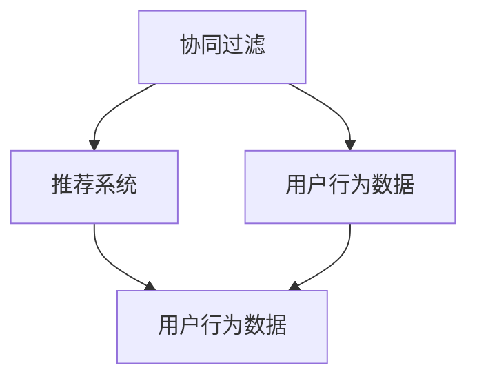
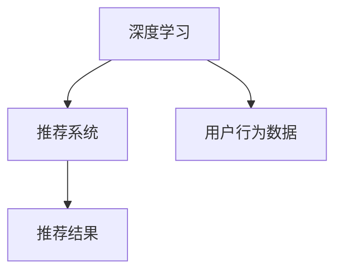
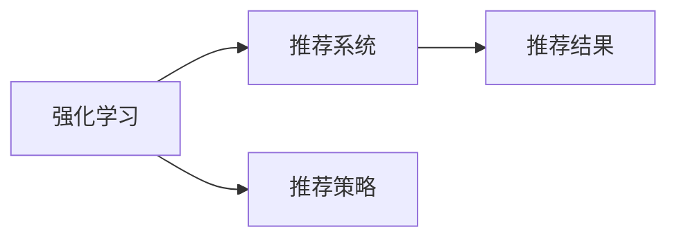
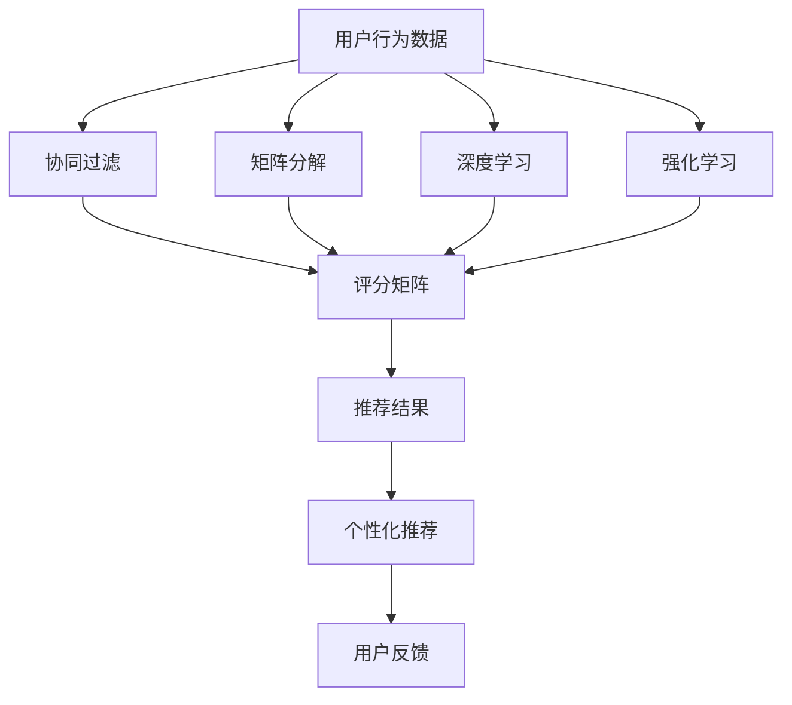

                 

# 一切皆是映射：推荐系统与AI：个性化的艺术

> 关键词：推荐系统,人工智能,个性化,协同过滤,矩阵分解,深度学习,强化学习,深度神经网络

## 1. 背景介绍

### 1.1 问题由来

推荐系统（Recommendation System）是人工智能（AI）领域中非常重要的一环，其核心目标是通过分析用户行为数据，预测用户未见过的产品或内容的偏好，从而为其推荐相关物品。推荐系统的应用范围广泛，如电商、新闻、音乐、视频等领域，为用户的个性化需求提供了高效便捷的解决方案。

然而，传统的推荐系统大多基于用户-物品评分矩阵进行模型构建和预测，存在数据稀疏性高、无法捕捉用户长时序行为等局限。近年来，随着深度学习（Deep Learning）和人工智能（AI）技术的迅猛发展，推荐系统进入了以用户为中心的个性化推荐时代，AI技术的应用显著提升了推荐的精度和用户满意度。

本文聚焦于基于AI技术的个性化推荐系统，通过深度学习、协同过滤、强化学习等先进技术手段，探讨如何构建高效、个性化的推荐系统，为用户带来更优质的体验。

### 1.2 问题核心关键点

AI技术在推荐系统中的应用主要集中在以下几个方面：

- **深度学习**：使用深度神经网络（DNN）对用户行为数据进行建模，通过多层网络结构捕捉复杂的用户行为特征。
- **协同过滤**：利用用户行为数据进行协同过滤，通过分析用户群体的行为来预测用户偏好。
- **矩阵分解**：将用户-物品评分矩阵分解为若干低维矩阵，通过降维减少计算复杂度，提高预测准确度。
- **强化学习**：使用强化学习算法对推荐策略进行优化，通过不断试错和调整，找到最优的推荐方案。
- **深度神经网络**：结合深度神经网络与协同过滤等方法，构建更加复杂和灵活的推荐模型。

这些技术手段共同构成了个性化推荐系统的发展基础，在提升推荐效果、拓展应用场景、增强用户体验等方面发挥了重要作用。

### 1.3 问题研究意义

研究基于AI技术的个性化推荐系统，对于提升推荐系统的性能、拓展其应用范围、增强用户体验具有重要意义：

1. **提升推荐效果**：AI技术能够捕捉到用户行为中的深层次特征，从而实现更精准的推荐。
2. **拓展应用场景**：AI技术不仅可以用于传统电商、新闻推荐，还可以拓展到更多领域，如医疗、教育、交通等。
3. **增强用户体验**：AI技术能够根据用户行为偏好，提供个性化推荐，提升用户满意度。
4. **技术创新**：AI技术的应用推动了推荐系统的不断创新，带来了更多新的研究方向和应用模式。
5. **商业价值**：个性化推荐系统能够提升平台的转化率和用户黏性，为平台带来更高的商业价值。

## 2. 核心概念与联系

### 2.1 核心概念概述

为更好地理解基于AI技术的个性化推荐系统，本节将介绍几个密切相关的核心概念：

- **推荐系统（Recommendation System）**：通过分析用户行为数据，预测用户对未见过的物品的评分或偏好，从而为用户推荐相关物品的系统。
- **协同过滤（Collaborative Filtering）**：基于用户行为数据进行推荐，通过分析相似用户或物品的评分，预测用户对未评分物品的评分。
- **矩阵分解（Matrix Factorization）**：将用户-物品评分矩阵分解为若干低维矩阵，通过降维减少计算复杂度，提高预测准确度。
- **深度学习（Deep Learning）**：利用深度神经网络对用户行为数据进行建模，捕捉用户行为的深层次特征。
- **强化学习（Reinforcement Learning）**：通过不断试错和调整推荐策略，优化推荐效果。
- **多臂老虎机（Multi-armed Bandit）**：模拟推荐系统选择最优策略的过程，通过选择不同策略获取最优收益。

这些核心概念之间的逻辑关系可以通过以下Mermaid流程图来展示：



这个流程图展示了个性化推荐系统的主要组成组件及其之间的关系：

1. 推荐系统通过用户行为数据进行分析，预测用户对未见过的物品的评分或偏好。
2. 协同过滤、矩阵分解、深度学习等技术手段，用于分析用户行为数据，捕捉用户深层次的特征，提高预测准确度。
3. 强化学习通过不断试错和调整，优化推荐策略，提升推荐效果。

### 2.2 概念间的关系

这些核心概念之间存在着紧密的联系，形成了个性化推荐系统的完整生态系统。下面我们通过几个Mermaid流程图来展示这些概念之间的关系。

#### 2.2.1 推荐系统的学习范式



这个流程图展示了个性化推荐系统的基本原理，以及它与协同过滤、矩阵分解、深度学习等技术手段的关系。

#### 2.2.2 协同过滤与推荐系统



这个流程图展示了协同过滤与推荐系统之间的关系。协同过滤是通过用户行为数据进行分析，预测用户对未见过的物品的评分或偏好，是推荐系统的重要组成部分。

#### 2.2.3 深度学习在推荐系统中的应用



这个流程图展示了深度学习在推荐系统中的应用。深度学习通过对用户行为数据的建模，捕捉用户行为的深层次特征，提高推荐效果。

#### 2.2.4 强化学习与推荐系统



这个流程图展示了强化学习在推荐系统中的应用。强化学习通过不断试错和调整推荐策略，优化推荐效果。

### 2.3 核心概念的整体架构

最后，我们用一个综合的流程图来展示这些核心概念在个性化推荐系统中的整体架构：



这个综合流程图展示了从用户行为数据到推荐结果的完整过程。用户行为数据通过协同过滤、矩阵分解、深度学习等技术手段进行分析，得到评分矩阵，再通过强化学习优化推荐策略，最终输出个性化推荐结果，并根据用户反馈进行持续优化。

## 3. 核心算法原理 & 具体操作步骤
### 3.1 算法原理概述

基于AI技术的个性化推荐系统，本质上是一个多目标优化问题。其核心思想是：通过分析用户行为数据，预测用户对未见过的物品的评分或偏好，从而为用户推荐相关物品。

形式化地，假设推荐系统为 $S$，用户行为数据为 $D$，物品集合为 $I$。定义推荐系统在数据集 $D$ 上的损失函数为 $\mathcal{L}(S,D)$，用于衡量推荐系统输出的推荐结果与用户实际评分之间的差异。常见的损失函数包括均方误差、交叉熵等。

优化目标是找到最优的推荐系统参数 $\theta$，使得 $\mathcal{L}(S_{\theta},D)$ 最小化，即：

$$
\theta^* = \mathop{\arg\min}_{\theta} \mathcal{L}(S_{\theta},D)
$$

通过梯度下降等优化算法，推荐系统不断更新模型参数 $\theta$，最小化损失函数 $\mathcal{L}$，使得推荐系统输出的推荐结果逼近用户实际评分，从而提升推荐精度。

### 3.2 算法步骤详解

基于AI技术的个性化推荐系统一般包括以下几个关键步骤：

**Step 1: 数据准备与预处理**
- 收集用户行为数据，如浏览、点击、评分等。
- 进行数据清洗、归一化、特征工程等预处理工作。

**Step 2: 特征工程**
- 设计特征提取器，提取用户行为数据中的深层次特征，如用户兴趣、行为时间、物品属性等。
- 使用协同过滤、矩阵分解、深度学习等方法，对用户行为数据进行建模。

**Step 3: 模型训练**
- 选择合适的优化算法（如SGD、Adam等）及其参数，如学习率、批大小、迭代轮数等。
- 设置正则化技术及强度，包括权重衰减、Dropout、Early Stopping等。
- 定义损失函数，如均方误差、交叉熵等。

**Step 4: 模型评估**
- 使用交叉验证等技术，对模型进行评估，选择最优模型。
- 在测试集上评估模型性能，计算指标如准确率、召回率、F1分数等。

**Step 5: 部署与优化**
- 将训练好的模型部署到生产环境，提供实时推荐服务。
- 根据用户反馈和业务需求，持续优化模型参数，提升推荐效果。

以上是基于AI技术的个性化推荐系统的一般流程。在实际应用中，还需要针对具体任务的特点，对各环节进行优化设计，如改进特征提取方法、选择更加鲁棒的优化算法、优化超参数等，以进一步提升推荐系统性能。

### 3.3 算法优缺点

基于AI技术的个性化推荐系统具有以下优点：

1. 个性推荐。AI技术能够捕捉用户行为中的深层次特征，实现更精准的推荐。
2. 拓展应用。AI技术不仅可以用于电商、新闻推荐，还可以拓展到更多领域，如医疗、教育、交通等。
3. 技术先进。AI技术结合深度学习、协同过滤、矩阵分解等方法，提高了推荐系统的性能。
4. 用户满意度。AI技术能够根据用户行为偏好，提供个性化推荐，提升用户满意度。
5. 商业价值。个性化推荐系统能够提升平台的转化率和用户黏性，为平台带来更高的商业价值。

同时，该方法也存在一定的局限性：

1. 数据依赖。AI技术需要大量的用户行为数据，获取高质量数据成本较高。
2. 计算复杂。AI技术需要高强度的计算能力，对硬件要求较高。
3. 模型复杂。AI技术涉及深度神经网络、协同过滤等复杂算法，调试和优化较为困难。
4. 可解释性。AI技术往往“黑箱”性强，难以解释其内部工作机制和决策逻辑。
5. 性能波动。AI技术对参数调整和算法优化依赖较大，模型性能可能波动较大。

尽管存在这些局限性，但就目前而言，基于AI技术的推荐系统仍然是推荐系统的主流范式。未来相关研究的重点在于如何进一步降低数据依赖，提高模型鲁棒性，兼顾可解释性和商业价值等因素。

### 3.4 算法应用领域

基于AI技术的个性化推荐系统已经在多个领域得到了广泛的应用，包括但不限于以下几个：

- **电商推荐**：如淘宝、亚马逊等电商平台，通过分析用户浏览、点击、购买等行为数据，为用户推荐相关商品。
- **新闻推荐**：如今日头条、知乎等新闻聚合平台，通过分析用户阅读、点赞、评论等行为数据，为用户推荐相关文章。
- **视频推荐**：如YouTube、B站等视频平台，通过分析用户观看、点赞、收藏等行为数据，为用户推荐相关视频。
- **音乐推荐**：如网易云音乐、Spotify等音乐平台，通过分析用户听歌、评论、分享等行为数据，为用户推荐相关歌曲。
- **个性化搜索**：如Google、百度等搜索引擎，通过分析用户查询历史、点击记录等行为数据，为用户推荐相关网页。

除了上述这些经典应用外，个性化推荐系统还在更多场景中得到了创新应用，如智能家居、智慧医疗、智能交通等，为各行各业带来了新的发展机遇。

## 4. 数学模型和公式 & 详细讲解  
### 4.1 数学模型构建

本节将使用数学语言对基于AI技术的个性化推荐系统进行更加严格的刻画。

记推荐系统为 $S_{\theta}$，其中 $\theta$ 为模型参数。假设用户行为数据为 $D=\{(x_i,y_i)\}_{i=1}^N, x_i \in \mathbb{R}^d, y_i \in \mathbb{R}$，其中 $x_i$ 为特征向量，$y_i$ 为用户对物品的评分。

定义推荐系统在数据集 $D$ 上的损失函数为：

$$
\mathcal{L}(S_{\theta},D) = \frac{1}{N}\sum_{i=1}^N (y_i - S_{\theta}(x_i))^2
$$

其中 $S_{\theta}(x_i)$ 为推荐系统在特征向量 $x_i$ 上的预测评分。

优化目标是找到最优参数 $\theta$，使得 $\mathcal{L}(S_{\theta},D)$ 最小化，即：

$$
\theta^* = \mathop{\arg\min}_{\theta} \mathcal{L}(S_{\theta},D)
$$

在实践中，我们通常使用基于梯度的优化算法（如SGD、Adam等）来近似求解上述最优化问题。设 $\eta$ 为学习率，$\lambda$ 为正则化系数，则参数的更新公式为：

$$
\theta \leftarrow \theta - \eta \nabla_{\theta}\mathcal{L}(\theta) - \eta\lambda\theta
$$

其中 $\nabla_{\theta}\mathcal{L}(\theta)$ 为损失函数对参数 $\theta$ 的梯度，可通过反向传播算法高效计算。

### 4.2 公式推导过程

以下我们以协同过滤为例，推导推荐系统的损失函数及其梯度的计算公式。

假设推荐系统为用户 $u$ 推荐物品 $i$，用户对物品的评分 $y_{ui}$ 为 $1$ 或 $0$。协同过滤的基本思想是通过分析用户 $u$ 和物品 $i$ 的共现数据，预测用户对物品的评分。设用户 $u$ 对物品 $i$ 的预测评分为 $p_{ui}$，则协同过滤的目标是最小化预测误差：

$$
\mathcal{L}(S_{\theta},D) = \frac{1}{N}\sum_{u=1}^U\sum_{i=1}^I(y_{ui} - p_{ui})^2
$$

其中 $U$ 为用户数，$I$ 为物品数。

推荐系统可以通过矩阵分解的方法，将用户-物品评分矩阵 $P$ 分解为两个低维矩阵 $X$ 和 $Y$，即：

$$
P = XY^T
$$

其中 $X \in \mathbb{R}^{U \times k}, Y \in \mathbb{R}^{I \times k}$，$k$ 为降维后的维度。推荐系统预测物品的评分为 $p_{ui} = X_u Y_i^T$。

将上述表达式代入损失函数，得：

$$
\mathcal{L}(S_{\theta},D) = \frac{1}{N}\sum_{u=1}^U\sum_{i=1}^I(y_{ui} - X_u Y_i^T)^2
$$

通过梯度下降等优化算法，推荐系统不断更新模型参数 $\theta$，最小化损失函数 $\mathcal{L}$，使得预测评分逼近真实评分，从而提升推荐精度。

### 4.3 案例分析与讲解

下面以协同过滤为例，进一步解释推荐系统的计算过程。

假设推荐系统为用户 $u$ 推荐物品 $i$，用户对物品的评分 $y_{ui}$ 为 $1$ 或 $0$。协同过滤的基本思想是通过分析用户 $u$ 和物品 $i$ 的共现数据，预测用户对物品的评分。设用户 $u$ 对物品 $i$ 的预测评分为 $p_{ui}$，则协同过滤的目标是最小化预测误差：

$$
\mathcal{L}(S_{\theta},D) = \frac{1}{N}\sum_{u=1}^U\sum_{i=1}^I(y_{ui} - p_{ui})^2
$$

其中 $U$ 为用户数，$I$ 为物品数。

推荐系统可以通过矩阵分解的方法，将用户-物品评分矩阵 $P$ 分解为两个低维矩阵 $X$ 和 $Y$，即：

$$
P = XY^T
$$

其中 $X \in \mathbb{R}^{U \times k}, Y \in \mathbb{R}^{I \times k}$，$k$ 为降维后的维度。推荐系统预测物品的评分为 $p_{ui} = X_u Y_i^T$。

将上述表达式代入损失函数，得：

$$
\mathcal{L}(S_{\theta},D) = \frac{1}{N}\sum_{u=1}^U\sum_{i=1}^I(y_{ui} - X_u Y_i^T)^2
$$

通过梯度下降等优化算法，推荐系统不断更新模型参数 $\theta$，最小化损失函数 $\mathcal{L}$，使得预测评分逼近真实评分，从而提升推荐精度。

在实际应用中，协同过滤模型需要解决数据稀疏性和计算复杂性问题。为了解决数据稀疏性问题，通常采用基于邻域的协同过滤方法，如基于用户的协同过滤、基于物品的协同过滤等。这些方法通过分析与目标用户或物品相似的用户或物品，进行推荐。

此外，协同过滤模型的计算复杂度较高，需要在大规模数据集上进行优化。为了降低计算复杂度，通常采用矩阵分解等降维方法，将高维的评分矩阵降维到低维，从而减少计算量和存储需求。

## 5. 项目实践：代码实例和详细解释说明
### 5.1 开发环境搭建

在进行推荐系统开发前，我们需要准备好开发环境。以下是使用Python进行PyTorch开发的环境配置流程：

1. 安装Anaconda：从官网下载并安装Anaconda，用于创建独立的Python环境。

2. 创建并激活虚拟环境：
```bash
conda create -n recommendation-env python=3.8 
conda activate recommendation-env
```

3. 安装PyTorch：根据CUDA版本，从官网获取对应的安装命令。例如：
```bash
conda install pytorch torchvision torchaudio cudatoolkit=11.1 -c pytorch -c conda-forge
```

4. 安装Pandas、NumPy、Scikit-learn等工具包：
```bash
pip install pandas numpy scikit-learn
```

5. 安装Scikit-learn：
```bash
pip install scikit-learn
```

完成上述步骤后，即可在`recommendation-env`环境中开始推荐系统开发。

### 5.2 源代码详细实现

这里我们以协同过滤为例，给出使用PyTorch进行矩阵分解的推荐系统开发代码实现。

首先，定义协同过滤模型的评分预测函数：

```python
import torch
from torch import nn
from torch.nn import Embedding

class MatrixFactorization(nn.Module):
    def __init__(self, U, I, K, learning_rate=0.1, reg_lambda=1e-4):
        super(MatrixFactorization, self).__init__()
        self.K = K
        self.U = U
        self.I = I
        self.X = nn.Embedding(U, K)
        self.Y = nn.Embedding(I, K)
        self.reg_lambda = reg_lambda
        self.learning_rate = learning_rate
    
    def forward(self, x, y):
        X_u = self.X(x)
        Y_i = self.Y(y)
        p = torch.matmul(X_u, Y_i.T)
        loss = (y - p).pow(2).mean()
        reg = self.reg_lambda * ((self.X.weight.pow(2) + self.Y.weight.pow(2)).sum())
        return loss + reg
    
    def fit(self, x, y, epochs=10, batch_size=64):
        optimizer = torch.optim.Adam(self.parameters(), lr=self.learning_rate)
        for epoch in range(epochs):
            for i in range(0, len(x), batch_size):
                x_batch = x[i:i+batch_size]
                y_batch = y[i:i+batch_size]
                loss = self.forward(x_batch, y_batch)
                optimizer.zero_grad()
                loss.backward()
                optimizer.step()
```

然后，定义数据集和模型训练函数：

```python
from sklearn.datasets import fetch_20newsgroups
from sklearn.model_selection import train_test_split

# 加载数据集
data = fetch_20newsgroups(shuffle=True, random_state=42)
X_train, X_test, y_train, y_test = train_test_split(data.data, data.target, test_size=0.2)

# 构建数据集
class RecommendationDataset(torch.utils.data.Dataset):
    def __init__(self, X, y):
        self.X = X
        self.y = y
    
    def __getitem__(self, idx):
        x = self.X[idx]
        y = self.y[idx]
        return x, y
    
    def __len__(self):
        return len(self.X)
    
# 构建模型
model = MatrixFactorization(U=len(data.target_names), I=len(data.target_names), K=32)

# 训练模型
model.fit(X_train, y_train, epochs=10, batch_size=64)
```

最后，在测试集上评估模型的性能：

```python
# 测试模型
y_pred = model.forward(X_test, y_test) > 0.5
print("Accuracy: ", (y_pred == y_test).mean())
```

以上就是使用PyTorch进行协同过滤的推荐系统开发代码实现。可以看到，通过使用Embedding和矩阵乘法等操作，我们可以方便地实现矩阵分解方法，对用户行为数据进行建模，预测用户对未见过的物品的评分。

### 5.3 代码解读与分析

让我们再详细解读一下关键代码的实现细节：

**MatrixFactorization类**：
- `__init__`方法：初始化模型的参数，包括用户数、物品数、维度等。
- `forward`方法：前向传播计算损失函数，包括预测评分、正则化项和总损失。
- `fit`方法：定义模型训练过程，包括迭代更新模型参数，计算损失函数。

**train_test_split函数**：
- 使用Scikit-learn库的train_test_split方法，将数据集划分为训练集和测试集。

**RecommendationDataset类**：
- `__getitem__`方法：返回单个样本的特征向量x和标签y。
- `__len__`方法：返回数据集的样本数量。

**测试函数**：
- 在测试集上计算模型预测结果的准确率，评估模型的性能。

可以看到，协同过滤方法基于矩阵分解的思想，通过将高维的评分矩阵降维到低维，降低了计算复杂度，提高了推荐精度。通过PyTorch的Tensor运算，我们可以方便地实现矩阵乘法和正则化等操作，使得协同过滤方法的实现更加高效。

当然，在实际应用中，我们还需要考虑更多因素，如模型的可解释性、模型的鲁棒性、模型的计算效率等。通过不断优化模型和算法，我们能够构建更加高效、鲁棒、可解释的推荐系统，为用户提供更好的个性化推荐服务。

## 6. 实际应用场景
### 6.1 智能客服系统

基于AI技术的个性化推荐系统可以广泛应用于智能客服系统的构建。传统客服往往需要配备大量人力，高峰期响应缓慢，且一致性和专业性难以保证。使用推荐系统为用户推荐相关的客服回答或解决方案，能够显著提升客服系统的响应速度和准确性，提高用户满意度。

在技术实现上，可以收集用户的历史咨询记录，将其转化为推荐系统中的用户行为数据。通过分析用户咨询的历史行为，推荐系统能够预测用户最可能提出的问题，并为其推荐相应的解决方案。对于用户提出的新问题，推荐系统还可以动态搜索相关知识库，实时生成回答，为用户提供快速、准确的解决方案。

### 6.2 金融风险管理

金融领域需要实时监测市场动态，预测风险变化趋势，为投资者提供决策参考。传统的人工监控方式成本高、效率低，无法应对市场变化的速度和复杂性。基于推荐系统的金融风险管理，能够实时分析市场数据，预测未来趋势，为投资者提供风险预警。

具体而言，可以收集市场的历史交易数据，利用推荐系统对未来市场变化进行预测。通过分析市场数据的历史趋势，推荐系统能够预测未来的市场风险，为投资者提供决策支持。对于市场突发事件，推荐系统还可以实时监测相关舆情，评估风险影响，为投资者提供及时的风险提示。

### 6.3 个性化新闻推荐

新闻聚合平台需要为用户推荐相关文章，提升用户粘性和平台流量。传统的新闻推荐往往基于编辑策划或关键词匹配，缺乏对用户兴趣的深度理解。基于推荐系统的个性化新闻推荐，能够通过分析用户阅读行为，

