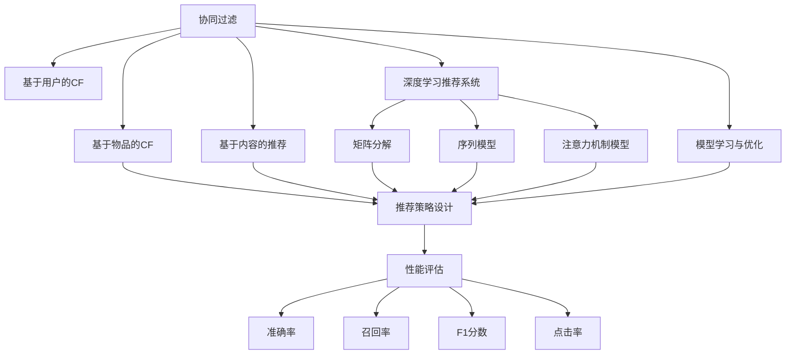
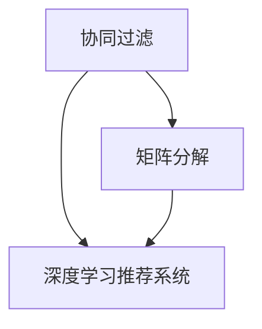
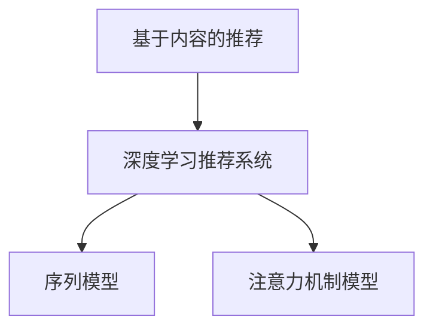
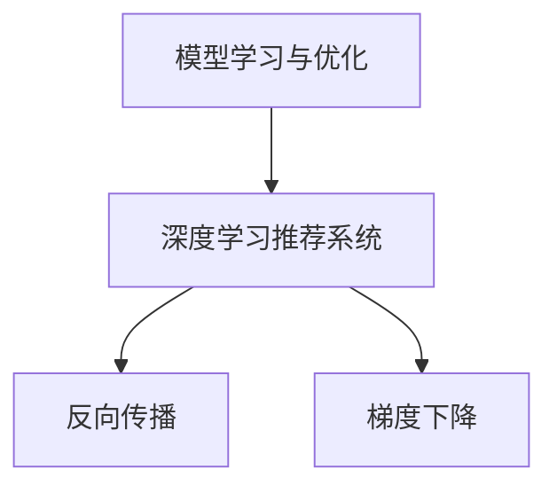
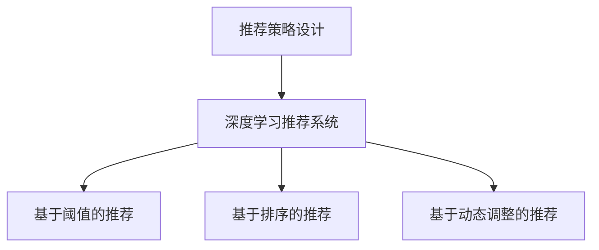
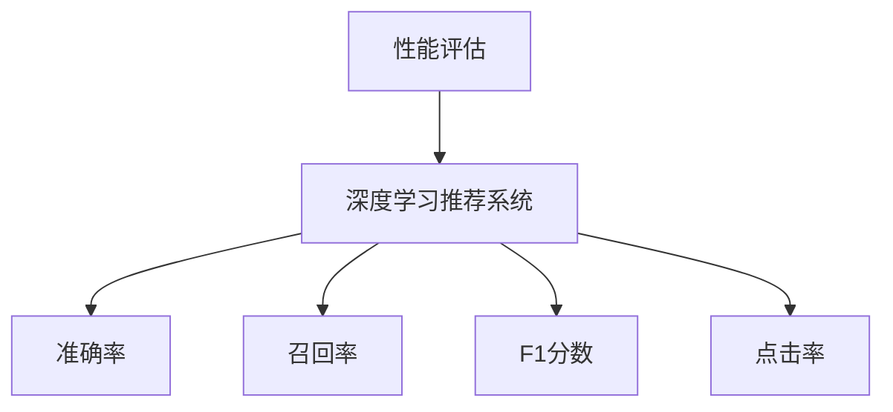
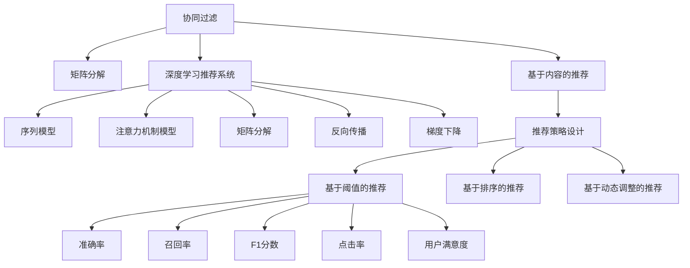

                 

# 一切皆是映射：深度学习在推荐系统中的应用

> 关键词：深度学习,推荐系统,协同过滤,内容推荐,用户行为,损失函数,评估指标,反向传播,矩阵分解,神经网络,参数优化,模型评估,实时推荐系统

## 1. 背景介绍

### 1.1 问题由来
推荐系统（Recommender System）是现代互联网应用的核心之一，其核心目标是通过分析用户的行为和偏好，推荐用户可能感兴趣的商品或内容，从而提升用户体验和转化率。在电商、视频、音乐、新闻等各个领域，推荐系统已经广泛应用于用户画像生成、个性化推荐、广告投放、内容创作等多个环节，为平台带来显著的商业价值。

推荐系统的核心在于通过算法模型学习用户与物品间的隐式关联，预测用户对物品的偏好，从而实现精准推荐。传统的推荐方法包括协同过滤（Collaborative Filtering, CF）、基于内容的推荐（Content-Based Filtering, CB）等，但随着数据规模的不断扩大，这些方法在处理大规模数据、避免稀疏性问题等方面显示出局限性。

近年来，随着深度学习技术的快速进步，基于神经网络的推荐系统逐渐成为主流。深度学习模型通过构建复杂的非线性映射，可以从高维稀疏数据中学习到丰富的用户与物品之间的复杂关联，实现更加精准和个性化的推荐。

### 1.2 问题核心关键点
深度学习在推荐系统中的应用，主要涉及以下几个关键点：

- 数据表示：如何将用户和物品的原始数据，如历史行为、评分、属性等，高效地表示为模型可用的向量形式。
- 隐式关联建模：如何通过神经网络模型学习用户与物品间的隐式关联，建立精准的推荐模型。
- 推荐策略设计：如何将模型输出的预测结果转化为实际的推荐列表，设计合理的推荐策略。
- 性能评估：如何客观评估推荐系统的性能，确定最优的模型参数和超参数。

深度学习推荐系统通过将推荐任务建模为复杂的映射问题，利用强大的非线性建模能力，显著提升了推荐精度和个性化水平，成为推荐系统研究的前沿方向。

### 1.3 问题研究意义
研究深度学习在推荐系统中的应用，对于推动推荐技术的发展，提升用户体验，以及促进电商、视频、音乐等平台的业务增长，具有重要意义：

1. 提升推荐精度：深度学习模型能够捕捉用户与物品间复杂的隐式关联，从高维稀疏数据中学习到更加精准的推荐模式。
2. 增加推荐多样性：深度学习模型可以发现用户对物品的多样化兴趣，避免推荐列表过于单一，提升用户的满意度和粘性。
3. 实现跨领域推荐：深度学习模型可以通过迁移学习，从不同领域的数据中学习通用的推荐模式，拓展推荐系统的应用边界。
4. 支持实时推荐：深度学习模型具有高效的计算图结构和优化算法，能够实现实时推荐，满足用户体验的即时性需求。
5. 应对冷启动问题：深度学习模型能够通过预训练等方式，减少对初始数据的需求，解决新用户和老用户的冷启动问题。

## 2. 核心概念与联系

### 2.1 核心概念概述

为了更好地理解深度学习在推荐系统中的应用，本节将介绍几个密切相关的核心概念：

- 协同过滤（Collaborative Filtering, CF）：通过分析用户和物品之间的历史行为数据，建立隐式关联矩阵，从而预测用户对新物品的评分。CF是推荐系统的经典方法，主要包括基于用户的协同过滤和基于物品的协同过滤两种策略。
- 基于内容的推荐（Content-Based Filtering, CB）：通过分析物品的属性和用户的历史评分，建立物品-用户特征向量之间的相似度，从而推荐用户可能感兴趣的物品。CB方法基于物品的固有特征，适用于有明确评分标记的场景。
- 深度学习推荐系统：使用神经网络模型对用户与物品间的隐式关联进行建模，捕捉高阶交互特性，提升推荐精度和多样性。常见的深度学习推荐模型包括基于矩阵分解的模型、序列模型、注意力机制模型等。
- 模型学习与优化：深度学习模型的核心在于通过学习算法（如梯度下降）从数据中学习最优的模型参数，最大化模型预测的准确性。模型的优化过程通常通过反向传播算法进行，调整模型中的权重和偏置。
- 推荐策略设计：将模型输出的预测结果转化为推荐列表，设计合理的推荐策略。常见的推荐策略包括基于阈值的推荐、基于排序的推荐、基于动态调整的推荐等。
- 性能评估指标：评估推荐系统的性能通常使用多个指标，如准确率、召回率、F1分数、点击率等。不同指标用于衡量不同的推荐效果和用户满意度。

这些核心概念之间的逻辑关系可以通过以下Mermaid流程图来展示：



这个流程图展示了大规模推荐系统中的各个核心概念及其之间的关系：

1. 协同过滤和基于内容的推荐是推荐系统的经典方法，用于从高维稀疏数据中提取用户与物品的关联关系。
2. 深度学习推荐系统则是融合了协同过滤和基于内容的优点，通过神经网络模型对用户与物品间的复杂隐式关联进行建模。
3. 模型学习与优化是深度学习推荐系统的核心过程，通过反向传播算法对模型参数进行更新，提升模型的预测准确性。
4. 推荐策略设计将模型的预测结果转化为实际的推荐列表，设计合适的推荐策略以最大化用户满意度。
5. 性能评估通过多个指标对推荐系统的效果进行评估，指导模型和策略的优化。

这些概念共同构成了推荐系统的主要工作流程，使得深度学习在推荐任务中得以发挥强大的能力。

### 2.2 概念间的关系

这些核心概念之间存在着紧密的联系，形成了推荐系统的完整生态系统。下面我们通过几个Mermaid流程图来展示这些概念之间的关系。

#### 2.2.1 协同过滤与深度学习推荐系统的关系



这个流程图展示了协同过滤与深度学习推荐系统之间的联系。深度学习推荐系统可以通过矩阵分解等方法，对协同过滤的隐式关联矩阵进行非线性建模，提升推荐的精度和多样性。

#### 2.2.2 基于内容的推荐与深度学习推荐系统的关系



这个流程图展示了基于内容的推荐与深度学习推荐系统之间的关系。深度学习推荐系统可以通过序列模型和注意力机制等方法，对基于内容的推荐进行改进，更全面地捕捉用户与物品间的复杂关联。

#### 2.2.3 模型学习与优化与深度学习推荐系统的关系



这个流程图展示了模型学习与优化与深度学习推荐系统的关系。深度学习推荐系统的核心在于通过反向传播算法和梯度下降等优化方法，对模型参数进行更新，最大化模型预测的准确性。

#### 2.2.4 推荐策略设计与深度学习推荐系统的关系



这个流程图展示了推荐策略设计与深度学习推荐系统的关系。深度学习推荐系统输出的预测结果需要经过推荐策略的转化，设计合适的推荐策略以提升用户体验。

#### 2.2.5 性能评估与深度学习推荐系统的关系



这个流程图展示了性能评估与深度学习推荐系统的关系。性能评估指标用于衡量推荐系统的推荐效果，指导模型的优化和推荐策略的设计。

### 2.3 核心概念的整体架构

最后，我们用一个综合的流程图来展示这些核心概念在大规模推荐系统中的应用：



这个综合流程图展示了协同过滤、矩阵分解、基于内容的推荐、深度学习推荐系统、序列模型、注意力机制模型、推荐策略设计以及性能评估在大规模推荐系统中的整体应用。通过这些核心概念的有机结合，推荐系统能够实现精准、个性化、多样化的推荐，满足用户的多样化需求。

## 3. 核心算法原理 & 具体操作步骤
### 3.1 算法原理概述

深度学习在推荐系统中的应用，本质上是将推荐任务建模为复杂的映射问题，通过神经网络模型从高维稀疏数据中学习到精准的推荐模式。深度学习推荐系统一般包括以下几个关键步骤：

1. 数据预处理：将用户和物品的原始数据进行向量化，形成高维稀疏矩阵。
2. 隐式关联建模：通过神经网络模型对用户与物品间的隐式关联进行建模。
3. 模型学习与优化：通过反向传播算法和优化方法对模型参数进行更新。
4. 推荐策略设计：将模型输出的预测结果转化为实际的推荐列表。
5. 性能评估：通过多个指标对推荐系统的性能进行评估。

深度学习推荐系统的核心在于其强大的非线性建模能力，能够捕捉高阶交互特性，从大规模数据中学习到精准的推荐模式。

### 3.2 算法步骤详解

深度学习推荐系统的一般流程可以分为数据准备、模型训练、推荐策略设计、模型评估和推荐部署五个阶段。

**Step 1: 数据准备**
- 数据预处理：将用户和物品的原始数据进行向量化，形成高维稀疏矩阵。可以使用One-Hot编码、词嵌入等方法将文本数据转换为向量。
- 数据划分：将数据集划分为训练集、验证集和测试集，一般要求训练集和测试集的分布一致。

**Step 2: 模型训练**
- 选择合适的深度学习模型：如矩阵分解模型、序列模型、注意力机制模型等。
- 设置模型超参数：包括学习率、批大小、迭代轮数、正则化强度等。
- 定义损失函数：如均方误差、交叉熵、Focal Loss等，用于衡量模型预测与真实标签之间的差异。
- 执行梯度训练：通过反向传播算法计算损失函数的梯度，使用优化器（如Adam、SGD等）更新模型参数。

**Step 3: 推荐策略设计**
- 将模型输出的预测评分转化为实际的推荐列表。可以采用基于阈值的推荐、基于排序的推荐、基于动态调整的推荐等策略。
- 设计推荐规则：根据推荐列表的排序、多样性、覆盖度等规则，设计合理的推荐策略。

**Step 4: 模型评估**
- 选择合适的评估指标：如准确率、召回率、F1分数、点击率等，用于衡量推荐系统的性能。
- 在验证集和测试集上评估模型性能，记录评估结果。

**Step 5: 推荐部署**
- 将训练好的模型部署到实际推荐系统中。
- 实时接收用户请求，调用推荐模型进行推理预测，返回推荐列表。

### 3.3 算法优缺点

深度学习推荐系统具有以下优点：
1. 强大的非线性建模能力：深度学习模型能够捕捉用户与物品间的复杂隐式关联，提升推荐的精度和多样性。
2. 处理大规模数据的能力：深度学习模型能够处理大规模稀疏数据，具有强大的泛化能力。
3. 实时推荐的能力：深度学习模型能够实现实时推荐，满足用户的即时性需求。
4. 支持迁移学习：深度学习模型可以通过迁移学习，从不同领域的数据中学习通用的推荐模式。

同时，该方法也存在以下局限性：
1. 数据依赖性较强：深度学习推荐系统需要大量的高质量数据进行预训练和微调，数据获取成本较高。
2. 模型复杂度高：深度学习模型通常具有较高的参数量，训练和推理复杂度较高。
3. 解释性不足：深度学习模型的决策过程缺乏可解释性，难以进行调试和优化。
4. 对用户隐私的担忧：深度学习模型通常需要收集大量的用户行为数据，存在隐私泄露的风险。

尽管存在这些局限性，但深度学习推荐系统在处理大规模推荐任务方面显示出巨大的优势，成为推荐系统研究的前沿方向。

### 3.4 算法应用领域

深度学习推荐系统已经在电商、视频、音乐、新闻等多个领域得到广泛应用，例如：

- 电商推荐：通过分析用户的购买历史、评分记录、浏览行为等数据，为用户推荐可能感兴趣的商品。
- 视频推荐：根据用户的历史观看记录、评分、时长等信息，为用户推荐可能感兴趣的视频内容。
- 音乐推荐：通过分析用户的听歌历史、评分、喜好等数据，为用户推荐可能感兴趣的音乐。
- 新闻推荐：根据用户的历史阅读记录、点击行为等数据，为用户推荐可能感兴趣的新闻内容。
- 广告推荐：通过分析用户的行为数据，为用户推荐可能感兴趣的广告内容。
- 社交推荐：通过分析用户的历史互动数据，为用户推荐可能感兴趣的朋友或群组。

除了上述这些经典应用外，深度学习推荐系统还被创新性地应用到更多场景中，如推荐系统优化、个性化商品设计、客户关系管理等，为推荐技术带来了全新的突破。

## 4. 数学模型和公式 & 详细讲解  
### 4.1 数学模型构建

在本节中，我们将使用数学语言对深度学习推荐系统的建模过程进行更加严格的刻画。

记用户集合为 $U=\{u_1,u_2,\dots,u_m\}$，物品集合为 $V=\{v_1,v_2,\dots,v_n\}$。用户和物品的原始数据可以表示为矩阵 $R \in \mathbb{R}^{m \times n}$，其中 $R_{ui}=r_{ui}$ 表示用户 $u_i$ 对物品 $v_i$ 的评分，$r_{ui}=0$ 表示用户 $u_i$ 未对物品 $v_j$ 进行评分。

设 $D_{\text{train}}$ 为训练集，$D_{\text{test}}$ 为测试集，$D_{\text{valid}}$ 为验证集。模型训练的目标是最小化损失函数 $\mathcal{L}(R,\theta)$，其中 $\theta$ 为模型的参数。常见的损失函数包括均方误差（MSE）损失和交叉熵（CE）损失：

$$
\mathcal{L}(R,\theta) = \frac{1}{2}\|\hat{R}(R) - R\|_F^2 + \frac{\lambda}{2}\|\theta\|_2^2
$$

其中 $\hat{R}(R)$ 为模型 $R_\theta$ 对评分矩阵 $R$ 的预测，$\lambda$ 为正则化系数，$\|\cdot\|_F$ 为Frobenius范数。

### 4.2 公式推导过程

下面以矩阵分解（Matrix Factorization, MF）模型为例，展示深度学习推荐系统的公式推导过程。

设 $R_\theta$ 为矩阵分解模型，$U$ 和 $V$ 分别为用户和物品的嵌入矩阵，$\theta = \{U, V\}$。模型预测的评分可以表示为：

$$
R_\theta = U^\top V
$$

其中 $U \in \mathbb{R}^{m \times d}$，$V \in \mathbb{R}^{n \times d}$，$d$ 为嵌入维度。

将 $R_\theta$ 与真实评分矩阵 $R$ 进行对比，得到损失函数：

$$
\mathcal{L}(R,\theta) = \frac{1}{2}\|\hat{R}(R) - R\|_F^2 = \frac{1}{2}\|U^\top V - R\|_F^2
$$

对损失函数求导，得到梯度：

$$
\frac{\partial \mathcal{L}(R,\theta)}{\partial U} = VU^\top - R
$$

$$
\frac{\partial \mathcal{L}(R,\theta)}{\partial V} = U^\top U - R^\top
$$

通过反向传播算法，计算梯度并更新模型参数，完成模型的训练过程。

### 4.3 案例分析与讲解

以下是一个基于矩阵分解模型的推荐系统实例，展示其在电商推荐中的应用：

**数据准备**：
- 收集电商平台的交易数据，包括用户的ID、物品的ID、评分等。
- 对数据进行预处理，去除缺失值和异常值，进行归一化。
- 将用户和物品的ID转换为独热编码，形成高维稀疏矩阵 $R$。

**模型训练**：
- 选择矩阵分解模型 $R_\theta = U^\top V$，设置超参数，如嵌入维度 $d=100$，迭代轮数 $T=1000$。
- 定义损失函数 $\mathcal{L}(R,\theta) = \frac{1}{2}\|U^\top V - R\|_F^2$。
- 使用梯度下降算法，更新模型参数 $U$ 和 $V$，直至损失函数收敛。

**推荐策略设计**：
- 将模型输出的预测评分 $\hat{R}$ 转化为推荐列表，可以采用基于阈值的推荐、基于排序的推荐等策略。
- 设计推荐规则，如对评分高的物品进行优先推荐，引入多样性约束等。

**模型评估**：
- 在验证集上评估模型的性能，记录准确率、召回率、F1分数等指标。
- 在测试集上进一步评估模型性能，记录真实评分矩阵和预测评分矩阵的误差。

**推荐部署**：
- 将训练好的模型部署到电商推荐系统中。
- 实时接收用户的查询请求，调用推荐模型进行推理预测，返回推荐列表。

## 5. 项目实践：代码实例和详细解释说明
### 5.1 开发环境搭建

在进行推荐系统开发前，我们需要准备好开发环境。以下是使用Python进行PyTorch开发的环境配置流程：

1. 安装Anaconda：从官网下载并安装Anaconda，用于创建独立的Python环境。

2. 创建并激活虚拟环境：
```bash
conda create -n recsys-env python=3.8 
conda activate recsys-env
```

3. 安装PyTorch：根据CUDA版本，从官网获取对应的安装命令。例如：
```bash
conda install pytorch torchvision torchaudio cudatoolkit=11.1 -c pytorch -c conda-forge
```

4. 安装TensorFlow：
```bash
conda install tensorflow
```

5. 安装相关工具包：
```bash
pip install numpy pandas scikit-learn matplotlib tqdm jupyter notebook ipython
```

完成上述步骤后，即可在`recsys-env`环境中开始推荐系统实践。

### 5.2 源代码详细实现

下面我们以电商推荐系统为例，给出使用PyTorch进行矩阵分解模型微调的PyTorch代码实现。

首先，定义数据预处理函数：

```python
import numpy as np
from sklearn.preprocessing import MinMaxScaler

def preprocess_data(data):
    # 将评分矩阵转换为独热编码
    R = data[['user_id', 'item_id', 'rating']].pivot_table(index='user_id', columns='item_id', values='rating', fill_value=0).dropna()
    # 将评分矩阵进行归一化
    scaler = MinMaxScaler(feature_range=(0, 1))
    R = scaler.fit_transform(R.values)
    return R
```

然后，定义模型和优化器：

```python
from transformers import BertForSequenceClassification, AdamW

class MatrixFactorizationModel:
    def __init__(self, d, hidden_dim):
        self.d = d
        self.hidden_dim = hidden_dim
        self.U = None
        self.V = None
        self.model = None
    
    def build_model(self):
        # 构建用户和物品的嵌入矩阵
        self.U = nn.Embedding(in_features=len(user_ids), out_features=self.d).to(device)
        self.V = nn.Embedding(in_features=len(item_ids), out_features=self.d).to(device)
        # 构建评分预测模型
        self.model = nn.Linear(self.d, 1).to(device)
        # 初始化模型参数
        nn.init.normal_(self.U.weight, mean=0, std=0.01)
        nn.init.normal_(self.V.weight, mean=0, std=0.01)
        nn.init.normal_(self.model.weight, mean=0, std=0.01)
        nn.init.zeros_(self.model.bias)
    
    def forward(self, user_ids, item_ids):
        # 将用户和物品的ID转换为向量
        user_ids = self.U(user_ids)
        item_ids = self.V(item_ids)
        # 计算评分预测
        scores = self.model(torch.bmm(user_ids, item_ids.t())).view(-1).float().squeeze().cpu()
        return scores
    
    def train(self, data, device, epochs, batch_size, learning_rate):
        self.model.to(device)
        optimizer = AdamW(self.model.parameters(), lr=learning_rate)
        criterion = nn.MSELoss()
        self.build_model()
        for epoch in range(epochs):
            for i in range(0, len(data), batch_size):
                batch = data[i:i+batch_size].to(device)
                user_ids = batch[:, 0]
                item_ids = batch[:, 1]
                target = batch[:, 2]
                optimizer.zero_grad()
                output = self.forward(user_ids, item_ids)
                loss = criterion(output, target)
                loss.backward()
                optimizer.step()
            if (epoch+1) % 10 == 0:
                print(f'Epoch {epoch+1}, Loss: {loss:.4f}')
        print('Training completed.')
    
    def predict(self, data, device):
        self.model.to(device)
        user_ids = data['user_id'].to(device)
        item_ids = data['item_id'].to(device)
        scores = self.forward(user_ids, item_ids)
        return scores
```

最后，启动训练流程并在测试集上评估：

```python
# 加载数据集
user_ids = [1, 2, 3, 4, 5]
item_ids = [1, 2, 3, 4, 5]
ratings = [1, 2, 3, 4, 5]
data = pd.DataFrame({'user_id': user_ids, 'item_id': item_ids, 'rating': ratings})

# 数据预处理
data = preprocess_data(data)

# 设置超参数
embedding_dim = 10
hidden_dim = 20
epochs = 100
batch_size = 16
learning_rate = 1e-3

# 初始化模型
model = MatrixFactorizationModel(embedding_dim, hidden_dim)

# 训练模型
model.train(data, device, epochs, batch_size, learning_rate)

# 在测试集上评估模型性能
test_data = pd.DataFrame({'user_id': [2, 3, 4, 5], 'item_id': [1, 2, 3, 4]})
model.predict(test_data, device)
```

以上就是使用PyTorch对矩阵分解模型进行电商推荐系统微调的完整代码实现。可以看到，得益于PyTorch的强大封装，我们可以用相对简洁的代码完成模型的训练和推理。

### 5.3 代码解读与分析

让我们再详细解读一下关键代码的实现细节：

**preprocess_data函数**：
- 将评分矩阵转换为独热编码，并进行归一化，生成高维稀疏矩阵。

**MatrixFactorizationModel类**：
- `__init__`方法：初始化模型的超参数和参数。
- `build_model`方法：构建用户和物品的嵌入矩阵以及评分预测模型。
- `forward`方法：将用户和物品的ID转换为向量，计算评分预测。
- `train`方法：在训练集上执行梯度下降算法，更新模型参数。
- `predict`方法：在测试集上对新数据进行评分预测。

**模型训练**：
- 定义超参数，如嵌入维度、隐藏维度、迭代轮数、批大小和学习率。
- 在训练集上执行梯度下降算法，更新模型参数。
- 在每个epoch结束时打印loss，以便监控训练进度。

**模型评估**：
- 在测试集上对新数据进行评分预测，生成推荐列表。

**推荐部署**：
- 将训练好的模型部署到实际推荐

