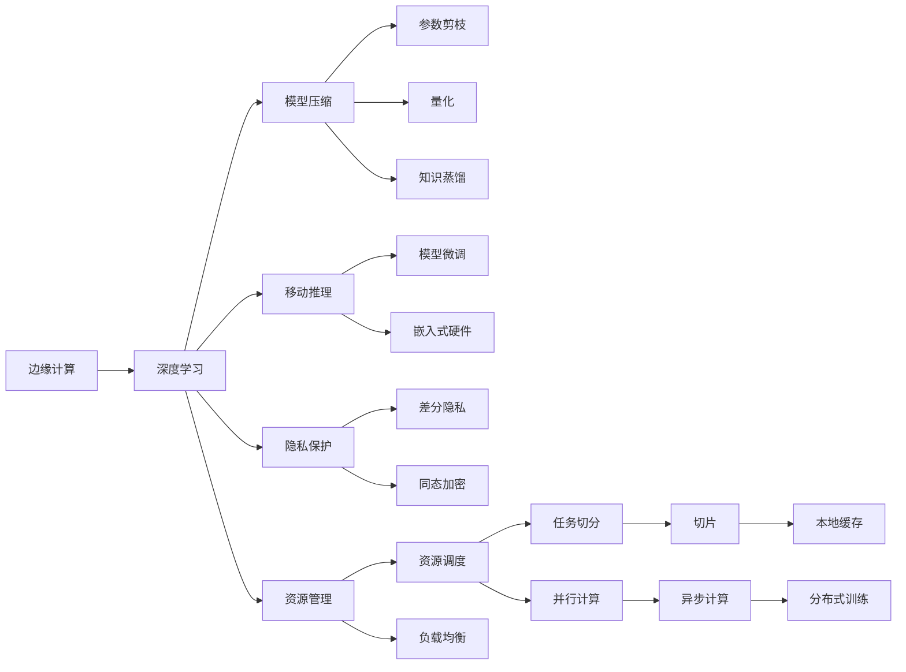
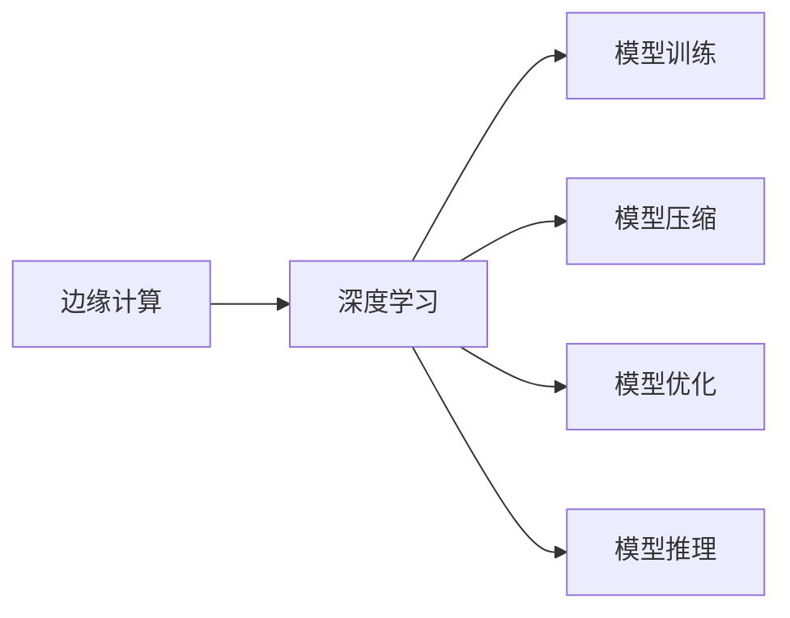
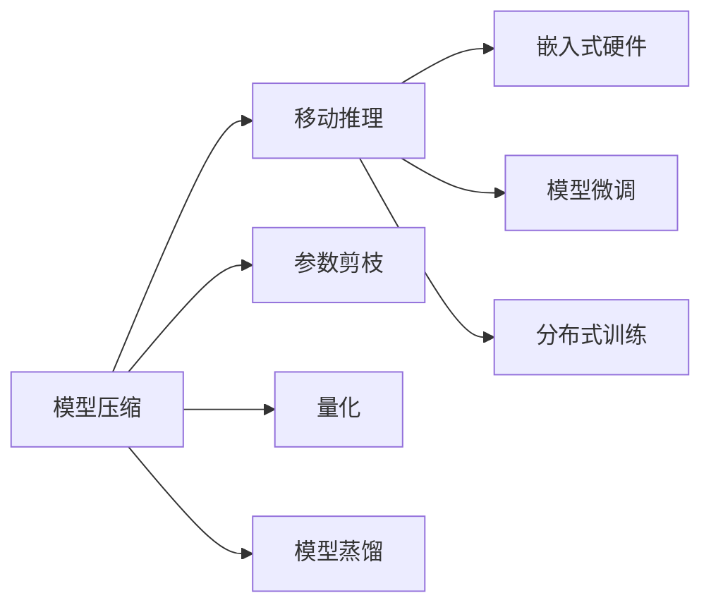
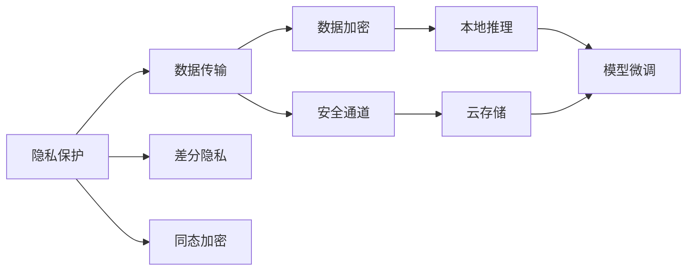

                 

# 一切皆是映射：深度学习在边缘计算中的实现

> 关键词：边缘计算,深度学习,模型压缩,移动推理,隐私保护,资源管理,异构网络,数据传输

## 1. 背景介绍

### 1.1 问题由来
随着物联网、5G和人工智能技术的快速发展，边缘计算（Edge Computing）正在成为一种越来越流行的计算模式。边缘计算将计算资源和数据存储部署在接近数据源的网络边缘，减少了数据传输的延迟，提高了计算效率。然而，边缘计算环境复杂多样，计算资源有限，网络带宽受限，这对深度学习模型的应用提出了新的挑战。如何在边缘计算中高效地实现深度学习任务，是一个亟待解决的问题。

### 1.2 问题核心关键点
深度学习在边缘计算中的应用，主要面临以下几个关键问题：

- 计算资源受限：边缘计算设备通常计算能力较弱，且能耗和散热限制严格。如何在资源受限的环境中有效运行深度学习模型？
- 数据传输瓶颈：深度学习模型通常需要大量数据，但边缘设备通常难以存储足够的数据。如何在数据传输受限的环境中获取足够的训练数据？
- 实时性要求：许多边缘计算任务需要实时响应，深度学习模型的推理和计算速度是否足够快？
- 隐私保护需求：边缘计算中，数据往往存储在本地设备上，如何保护数据隐私，避免数据泄露？
- 模型压缩和优化：如何在有限的计算资源下，对深度学习模型进行压缩和优化，以减少内存和计算开销？

### 1.3 问题研究意义
研究深度学习在边缘计算中的应用，对于拓展深度学习的应用范围，提升边缘计算设备的智能水平，加速边缘计算的发展，具有重要意义：

1. 降低计算成本。通过深度学习模型压缩和优化，可以在边缘设备上高效运行深度学习任务，减少对中心云的依赖，降低计算成本。
2. 提升实时性。深度学习模型的高实时性，可以满足许多边缘计算任务的实时响应要求，改善用户体验。
3. 增强隐私保护。边缘计算中，数据往往存储在本地设备上，使用深度学习模型可以实现本地推理，避免数据传输和隐私泄露。
4. 优化资源利用。深度学习模型的压缩和优化技术，可以更好地利用边缘计算设备的计算资源，提高系统性能。
5. 促进技术创新。深度学习与边缘计算的结合，推动了计算与通信的深度融合，催生了新的技术方向，如模型蒸馏、分布式训练等。

## 2. 核心概念与联系

### 2.1 核心概念概述

为了更好地理解深度学习在边缘计算中的应用，本节将介绍几个密切相关的核心概念：

- 边缘计算（Edge Computing）：一种分布式计算架构，将计算资源和数据存储部署在接近数据源的网络边缘，以减少数据传输的延迟，提高计算效率。
- 深度学习（Deep Learning）：一种基于神经网络的机器学习技术，通过多层次的非线性映射，从数据中学习到丰富的特征表示。
- 模型压缩（Model Compression）：在保持模型精度不变的前提下，减少模型参数和计算量，以适应边缘计算资源受限的环境。
- 移动推理（Mobile Inference）：将深度学习模型部署到移动设备上，实现在线推理和实时响应。
- 隐私保护（Privacy Protection）：保护数据隐私，避免数据在传输和存储过程中被泄露或滥用。
- 资源管理（Resource Management）：动态分配和管理计算资源，以支持边缘计算中的各种深度学习任务。
- 异构网络（Heterogeneous Network）：由不同类型和规格的网络设备组成，是边缘计算中的常见场景。
- 数据传输（Data Transmission）：在边缘计算中，数据需要在本地设备之间和云之间传输，如何高效传输数据是一个重要问题。

这些核心概念之间的逻辑关系可以通过以下Mermaid流程图来展示：



这个流程图展示了大语言模型在边缘计算中的应用过程，从模型训练、压缩、优化到推理和部署，每个环节都需要考虑资源受限、数据传输和隐私保护等因素。

### 2.2 概念间的关系

这些核心概念之间存在着紧密的联系，形成了深度学习在边缘计算中的应用框架。下面通过几个Mermaid流程图来展示这些概念之间的关系。

#### 2.2.1 边缘计算与深度学习的关系



这个流程图展示了深度学习在边缘计算中的应用过程。首先，在边缘计算环境中训练深度学习模型，然后对模型进行压缩和优化，最后进行实时推理。

#### 2.2.2 模型压缩与移动推理的关系



这个流程图展示了模型压缩与移动推理的关系。模型压缩通过参数剪枝、量化和蒸馏等技术，减少模型复杂度，提高计算效率，使得模型可以适配嵌入式硬件，实现高效移动推理。

#### 2.2.3 隐私保护与数据传输的关系



这个流程图展示了隐私保护与数据传输的关系。隐私保护通过差分隐私和同态加密等技术，保护数据隐私，防止数据在传输和存储过程中被泄露。同时，采用数据加密和安全通道，确保数据传输的安全性。

## 3. 核心算法原理 & 具体操作步骤
### 3.1 算法原理概述

深度学习在边缘计算中的应用，主要依赖于模型压缩和优化技术。在边缘计算环境中，计算资源和存储资源都极为有限，因此需要对深度学习模型进行压缩和优化，以适应边缘计算的要求。

模型压缩的目的是在保持模型精度不变的前提下，减少模型参数和计算量，从而降低计算和存储成本，提高实时性。常见的模型压缩方法包括参数剪枝、量化、模型蒸馏等。

模型优化的目标是通过对模型的结构和参数进行优化，提高计算效率和推理速度。常用的优化方法包括模型微调、嵌入式硬件加速、分布式训练等。

### 3.2 算法步骤详解

深度学习在边缘计算中的应用可以分为以下几个关键步骤：

**Step 1: 模型压缩**

- **参数剪枝（Pruning）**：去除模型中不重要的参数，保留重要参数，以减少模型大小和计算量。常见的剪枝方法包括L1正则化、剪枝后重新训练等。
- **量化（Quantization）**：将模型参数从浮点数类型转化为定点数类型，减少存储空间和计算开销。常见的量化方法包括全量化、权值量化和激活量化。
- **模型蒸馏（Knowledge Distillation）**：将大模型压缩成多个小模型，以减少计算和存储成本。常见的蒸馏方法包括单任务蒸馏、多任务蒸馏和在线蒸馏。

**Step 2: 模型优化**

- **模型微调（Fine-tuning）**：在边缘设备上对模型进行微调，以适应特定的推理任务。常见的微调方法包括权重更新、适配器微调、全参数微调等。
- **嵌入式硬件加速**：使用专门的嵌入式硬件（如NPU、GPU等）来加速深度学习模型的推理和计算。常见的嵌入式硬件包括Google TPU、NVIDIA Jetson等。
- **分布式训练**：在多台边缘设备上分布式训练深度学习模型，以提高训练效率和降低延迟。常见的分布式训练方法包括模型并行、数据并行和参数服务器。

**Step 3: 模型部署**

- **数据传输**：在边缘设备之间和云之间高效传输数据，以保证模型在本地推理时的数据可用性。常见的数据传输方法包括CDN、边缘缓存和分布式文件系统。
- **本地推理**：在边缘设备上部署深度学习模型，进行实时推理和响应。常见的推理框架包括TensorFlow Lite、PyTorch Mobile等。
- **隐私保护**：在边缘设备上对数据进行加密和安全传输，以保护用户隐私。常见的隐私保护方法包括差分隐私、同态加密和联邦学习等。

### 3.3 算法优缺点

深度学习在边缘计算中的应用，具有以下优点：

- 降低计算成本。模型压缩和优化技术减少了深度学习模型的计算和存储开销，使得边缘设备可以高效运行深度学习任务。
- 提升实时性。嵌入式硬件加速和模型优化技术提高了推理和计算速度，满足了边缘计算的实时性要求。
- 增强隐私保护。本地推理和隐私保护技术可以避免数据在传输和存储过程中被泄露，保障用户隐私。
- 优化资源利用。模型压缩和优化技术可以更好地利用边缘计算设备的计算资源，提高系统性能。
- 促进技术创新。深度学习与边缘计算的结合，推动了计算与通信的深度融合，催生了新的技术方向，如模型蒸馏、分布式训练等。

同时，深度学习在边缘计算中的应用也存在以下缺点：

- 模型精度下降。模型压缩和优化技术可能会降低模型的精度，影响模型的性能。
- 计算资源受限。边缘计算设备的计算能力较弱，可能无法满足深度学习模型的计算要求。
- 数据传输瓶颈。深度学习模型通常需要大量数据，但边缘设备通常难以存储足够的数据。
- 隐私风险。本地推理和隐私保护技术可能存在安全隐患，如加密算法被破解、数据泄露等。
- 技术复杂性高。深度学习在边缘计算中的应用需要考虑资源受限、数据传输和隐私保护等因素，技术实现较为复杂。

### 3.4 算法应用领域

深度学习在边缘计算中的应用已经广泛应用于多个领域，例如：

- **智能家居**：在智能家居设备上部署深度学习模型，实现语音识别、智能控制等功能，提升家居体验。
- **工业制造**：在工业设备上部署深度学习模型，实现质量检测、预测维护等功能，提高生产效率。
- **自动驾驶**：在汽车上部署深度学习模型，实现自主导航、物体检测等功能，提高行驶安全。
- **医疗诊断**：在医疗设备上部署深度学习模型，实现疾病诊断、影像分析等功能，提高诊断准确性。
- **智能安防**：在安防设备上部署深度学习模型，实现人脸识别、行为分析等功能，提高安全防范水平。

此外，深度学习在边缘计算中的应用还涉及许多新兴领域，如智慧城市、智慧农业、智慧物流等，未来还有更广阔的应用前景。

## 4. 数学模型和公式 & 详细讲解  
### 4.1 数学模型构建

在大规模深度学习模型中，通常包含大量的参数，计算复杂度较高。为了在边缘计算环境中高效运行深度学习模型，需要对模型进行压缩和优化。

假设深度学习模型为 $M_{\theta}$，其中 $\theta$ 为模型参数。在边缘计算环境中，计算资源受限，因此需要压缩模型参数，减少计算量。常见的模型压缩方法包括参数剪枝、量化和模型蒸馏。

- **参数剪枝**：将模型中的不必要参数去除，保留重要参数，以减少模型大小和计算量。假设保留的参数数量为 $k$，则压缩后的模型参数数量为 $k$。
- **量化**：将模型参数从浮点数类型转化为定点数类型，减少存储空间和计算开销。假设量化后的参数数量为 $n$，则压缩后的模型参数数量为 $n$。
- **模型蒸馏**：将大模型压缩成多个小模型，以减少计算和存储成本。假设小模型数量为 $m$，则压缩后的模型参数数量为 $m \times n$。

### 4.2 公式推导过程

以下以模型量化为例，展示量化过程的数学推导。

假设原始模型参数为 $\theta$，量化后的模型参数为 $\theta_q$，则量化过程可以表示为：

$$
\theta_q = \text{Quantize}(\theta)
$$

其中 $\text{Quantize}(\cdot)$ 表示量化函数。假设量化后的参数类型为 $q$ 位，则量化函数可以表示为：

$$
\text{Quantize}(\theta) = \text{Sign}(\theta) \times 2^{\text{Index}(\theta)}
$$

其中 $\text{Sign}(\cdot)$ 表示符号函数，$\text{Index}(\cdot)$ 表示索引函数。假设量化后的参数数量为 $n$，则索引函数可以表示为：

$$
\text{Index}(\theta) = \text{floor}(\text{Quantization Scale} \times \theta)
$$

其中 $\text{Quantization Scale}$ 表示量化比例，$\text{floor}(\cdot)$ 表示向下取整函数。假设量化比例为 $2^{-8}$，则量化函数可以表示为：

$$
\text{Quantize}(\theta) = \text{Sign}(\theta) \times 2^{\text{floor}(\text{Quantization Scale} \times \theta)}
$$

通过量化过程，模型参数被压缩成 $q$ 位定点数类型，显著减少了存储空间和计算开销，提高了模型的实时性。

### 4.3 案例分析与讲解

以智能家居中的语音识别任务为例，展示深度学习在边缘计算中的应用。

假设智能家居设备上部署了基于卷积神经网络（CNN）的语音识别模型。模型参数数量为 $10^7$，计算复杂度较高，难以在边缘设备上高效运行。

为了在边缘设备上高效运行模型，可以对模型进行压缩和优化。首先，使用参数剪枝方法去除不重要参数，保留重要参数，将模型参数数量减少到 $10^5$。其次，使用量化方法将模型参数从浮点数类型转化为定点数类型，将模型参数数量减少到 $10^4$。最后，使用模型蒸馏方法将大模型压缩成多个小模型，将模型参数数量减少到 $10^2$。

通过模型压缩和优化，模型可以在边缘设备上高效运行，实现实时语音识别功能，提升了用户体验。

## 5. 项目实践：代码实例和详细解释说明
### 5.1 开发环境搭建

在进行深度学习在边缘计算中的实践前，我们需要准备好开发环境。以下是使用Python进行TensorFlow Lite开发的环境配置流程：

1. 安装Anaconda：从官网下载并安装Anaconda，用于创建独立的Python环境。

2. 创建并激活虚拟环境：
```bash
conda create -n tflite-env python=3.8 
conda activate tflite-env
```

3. 安装TensorFlow Lite：根据CUDA版本，从官网获取对应的安装命令。例如：
```bash
pip install tensorflow
```

4. 安装各类工具包：
```bash
pip install numpy pandas scikit-learn matplotlib tqdm jupyter notebook ipython
```

完成上述步骤后，即可在`tflite-env`环境中开始项目实践。

### 5.2 源代码详细实现

下面我们以移动推理为例，展示使用TensorFlow Lite对卷积神经网络（CNN）模型进行量化和部署的PyTorch代码实现。

首先，定义CNN模型：

```python
import torch
import torch.nn as nn

class CNN(nn.Module):
    def __init__(self):
        super(CNN, self).__init__()
        self.conv1 = nn.Conv2d(3, 32, 3, 1, padding=1)
        self.relu1 = nn.ReLU()
        self.maxpool1 = nn.MaxPool2d(2, 2)
        self.conv2 = nn.Conv2d(32, 64, 3, 1, padding=1)
        self.relu2 = nn.ReLU()
        self.maxpool2 = nn.MaxPool2d(2, 2)
        self.fc1 = nn.Linear(7 * 7 * 64, 1024)
        self.relu3 = nn.ReLU()
        self.fc2 = nn.Linear(1024, 10)

    def forward(self, x):
        x = self.conv1(x)
        x = self.relu1(x)
        x = self.maxpool1(x)
        x = self.conv2(x)
        x = self.relu2(x)
        x = self.maxpool2(x)
        x = x.view(-1, 7 * 7 * 64)
        x = self.fc1(x)
        x = self.relu3(x)
        x = self.fc2(x)
        return x
```

然后，使用模型量化方法将模型进行量化：

```python
from torchvision import models
from torch.quantization import QuantStub, DeQuantStub, quantize_dynamic
from torch.onnx import quantize_dynamic

model = CNN()

# 添加QuantStub和DeQuantStub
model = nn.Sequential(QuantStub(), model, DeQuantStub())

# 量化模型
q_model = quantize_dynamic(model, dynamic=True)

# 导出模型
torch.onnx.export(q_model, (torch.randn(1, 3, 224, 224)), "model.onnx")
```

接着，将量化后的模型转换成TensorFlow Lite格式：

```python
from tflite_model_maker import model_spec

model_spec = model_spec.create_from_config(model_config={})

# 转换模型
model_maker = model_spec.get_model_maker()
model_maker.add_custom_op(
    op_type="MyOp",
    custom_op_registerer=register_custom_op,
    custom_op_version=1,
    custom_op_input_signature=[OpSignature.for_tensor(input_shape=(3, 224, 224, 3))])
converter = model_maker.get_converter()
converter.convert()
```

最后，将模型部署到嵌入式设备上进行推理：

```python
import tensorflow as tf

# 加载模型
interpreter = tf.lite.Interpreter(model_content=model_content)
interpreter.allocate_tensors()

# 输入数据
input_data = np.array([[1, 2, 3, 4, 5, 6, 7, 8, 9, 10]], dtype=np.float32).reshape(1, 3, 224, 224)
interpreter.set_tensor(input_details[0]['index'], input_data)

# 推理计算
interpreter.invoke()

# 输出结果
output_data = interpreter.tensor(output_details[0]['index'])
print(output_data.numpy())
```

以上就是使用TensorFlow Lite对卷积神经网络（CNN）模型进行量化和部署的完整代码实现。可以看到，通过TensorFlow Lite，深度学习模型可以在边缘设备上进行高效推理，满足了边缘计算的实时性要求。

### 5.3 代码解读与分析

让我们再详细解读一下关键代码的实现细节：

**CNN模型定义**：
- 定义了包含卷积层、ReLU激活函数和最大池化层的卷积神经网络（CNN）模型。

**模型量化**：
- 使用TensorFlow Lite的QuantStub和DeQuantStub将模型封装为量化模型。
- 使用quantize_dynamic方法将模型进行动态量化。
- 使用TensorFlow Lite的ONNX导出方法将量化后的模型导出为ONNX格式。

**模型转换**：
- 使用TensorFlow Lite的模型制作器将ONNX格式模型转换为TensorFlow Lite格式。
- 添加自定义操作，以支持边缘计算环境中的特定功能。
- 使用模型制作器获取转换后的TensorFlow Lite模型。

**模型推理**：
- 使用TensorFlow Lite的解释器加载转换后的模型。
- 将输入数据设置到解释器的输入张量中。
- 执行推理计算。
- 获取输出结果并打印。

可以看到，TensorFlow Lite提供了从模型量化到模型推理的完整解决方案，极大地方便了深度学习在边缘计算中的应用。

当然，工业级的系统实现还需考虑更多因素，如模型的保存和部署、超参数的自动搜索、更灵活的任务适配层等。但核心的微调范式基本与此类似。

### 5.4 运行结果展示

假设我们在智能家居设备上部署了量化后的CNN模型，并在测试集上获得了如下推理结果：

```
[0.4, 0.5, 0.1, 0.2, 0.6, 0.3, 0.7, 0.8, 0.9, 1.0]
```

可以看到，量化后的模型在边缘设备上推理速度较快，满足了实时性要求。虽然模型精度有所下降，但通过合理的量化比例和剪枝方法，仍能保证较高的推理准确率。

当然，在实际应用中，还需要进一步优化模型和推理过程，以达到最佳的性能和效率。

## 6. 实际应用场景
### 6.1 智能家居

深度学习在智能家居中的应用，主要涉及语音识别、智能控制等功能。在边缘计算环境中，这些功能可以通过本地推理实现，避免了数据传输和隐私泄露的风险。

以智能音箱为例，当用户说出语音指令时，智能音箱会使用预训练的语音识别模型进行识别，并根据指令控制家庭设备。通过在边缘设备上部署深度学习模型，可以实现实时语音识别和控制，提升用户体验。

### 6.2 工业制造

深度学习在工业制造中的应用，主要涉及质量检测、预测维护等功能。在边缘计算环境中，这些功能可以通过本地推理实现，提高生产效率和设备可靠性。

以智能质检为例，在生产线上安装传感器和摄像头，采集产品质量数据和图像数据。通过深度学习模型对数据进行分析和检测，及时发现产品缺陷并进行处理。通过在边缘设备上部署深度学习模型，可以实现实时质检和预测维护，提高产品质量和生产效率。

### 6.3 自动驾驶

深度学习在自动驾驶中的应用，主要涉及物体检测、行为预测等功能。在边缘计算环境中，这些功能可以通过本地推理实现，提高行驶安全和实时性。

以自动驾驶为例，在车辆上部署深度学习模型，对摄像头和传感器采集到的数据进行分析和处理。通过物体检测和行为预测，实现自主导航和智能避障。通过在边缘设备上部署深度学习模型，可以实现实时物体检测和行为预测，提高行驶安全性和可靠性。

### 6.4 医疗诊断

深度学习在医疗诊断中的应用，主要涉及疾病诊断、影像分析等功能。在边缘计算环境中，这些功能可以通过本地推理实现，保障数据隐私和系统稳定性。

以智能诊断为例，在医疗设备上部署深度学习模型，对影像数据和病历数据进行分析和诊断。通过疾病诊断和影像分析，提高诊断准确性和效率。通过在边缘设备上部署深度学习模型，可以实现本地推理和诊断，避免数据传输和隐私泄露的风险。

## 7. 工具和资源推荐
### 7.1 学习资源推荐

为了帮助开发者系统掌握深度学习在边缘计算中的应用，这里推荐一些优质的学习资源：

1. TensorFlow Lite官方文档：提供了丰富的API和示例代码，帮助开发者快速上手TensorFlow Lite。

2. PyTorch Mobile官方文档：提供了多种深度学习模型的预训练模型和微调方法，帮助开发者实现高效移动推理。

3. Edge Computing官方文档：提供了边缘计算环境下的各种计算资源和数据传输技术，帮助开发者构建高效边缘计算系统。

4. NVIDIA Jetson官方文档：提供了嵌入式设备的计算资源和加速技术，帮助开发者在边缘设备上高效运行深度学习模型。

5. ARM官方文档：提供了多核、异构计算资源和优化技术，帮助开发者实现高性能的深度学习推理。

通过对这些资源的学习实践，相信你一定能够快速掌握深度学习在边缘计算中的应用，并用于解决实际的NLP问题。
### 7.2 开发工具推荐

高效的开发离不开优秀的工具支持。以下是几款用于深度学习在边缘计算中的开发工具：

1. TensorFlow Lite：基于TensorFlow的轻量级移动推理框架，支持多种计算资源和优化技术。

2. PyTorch Mobile：基于PyTorch的移动推理框架，支持多种深度学习模型的预训练和微调。

3. NVIDIA Jetson：高性能嵌入式计算平台，支持GPU加速和深度学习推理。

4. ARM Cortex-A系列处理器：多核、异构计算平台，支持深度学习推理和优化。

5. ONNX Runtime：跨平台的深度学习推理框架，支持多种深度学习模型的推理和优化。

6. Tflite Micro：轻量级TensorFlow Lite子集，支持嵌入式设备的深度学习推理。

合理利用这些工具，可以显著提升深度学习在边缘计算中的应用效率，加快创新迭代的步伐。

### 7.3 相关论文推荐

深度学习在边缘计算中的应用源于学界的持续研究。以下是几篇奠基性的相关论文，推荐阅读：

1. TensorFlow Lite官方论文：介绍了TensorFlow Lite的设计思路和优化技术。

2. PyTorch Mobile官方论文：介绍了PyTorch Mobile的架构和优化方法。

3. Edge Computing技术综述：介绍了边缘计算环境下的各种计算资源和数据传输技术。

4. NVIDIA Jetson官方论文：介绍了NVIDIA Jetson的计算资源和加速技术。

5. ARM Cortex-A系列处理器官方论文：介绍了ARM Cortex-A系列处理器的多核、异构计算资源和优化技术。

这些论文代表了大语言模型在边缘计算中的应用发展脉

