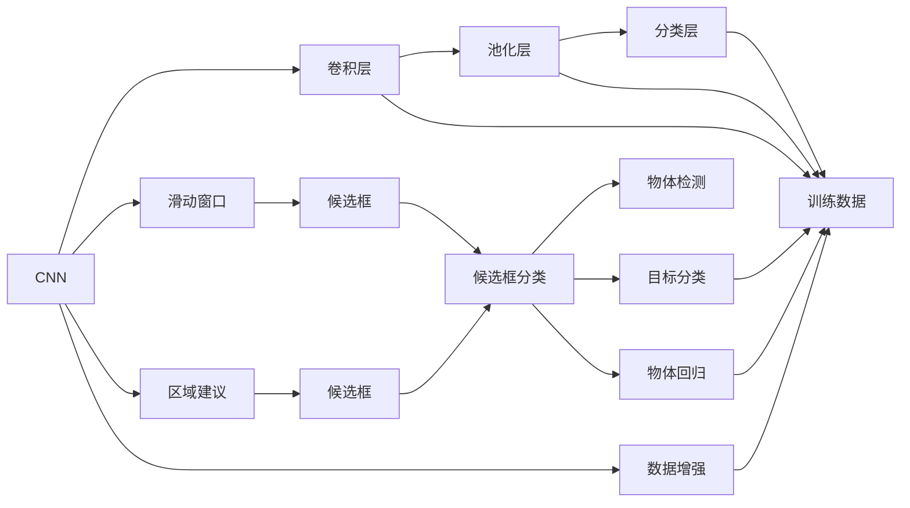

                 

# 一切皆是映射：物体检测与识别：AI的视觉能力

> 关键词：
```
物体检测, 物体识别, 深度学习, 计算机视觉, 卷积神经网络, 物体分类, 目标检测算法, R-CNN, YOLO, Faster R-CNN, 神经网络优化, 数据增强, 超参数调优, 模型迁移学习
```

## 1. 背景介绍

### 1.1 问题由来
随着计算机视觉技术的飞速发展，深度学习在物体检测和识别领域取得了显著的进展。物体检测和识别是计算机视觉中最基本也是最重要的任务之一，涉及对图像中目标物体的准确识别和定位。传统的物体检测和识别方法往往依赖于手工设计的特征提取器和分类器，计算复杂度高，效率低下。

深度学习尤其是卷积神经网络（Convolutional Neural Network, CNN）的引入，大大提升了物体检测和识别的精度和速度。通过在大规模图像数据集上进行端到端的训练，CNN模型能够学习到丰富的图像特征，自动提取物体的关键信息，从而在图像识别和目标检测等任务上取得优异的性能。

### 1.2 问题核心关键点
深度学习在物体检测和识别中的成功应用，主要得益于以下几个关键技术：

1. **卷积神经网络（CNN）**：CNN具有平移不变性，能够自动学习图像中的局部特征。
2. **数据增强（Data Augmentation）**：通过旋转、翻转、缩放等方式扩充训练数据，提升模型的泛化能力。
3. **目标检测算法**：如R-CNN、YOLO、Faster R-CNN等，能够高效地检测和识别图像中的物体。
4. **迁移学习（Transfer Learning）**：通过在大规模数据集上预训练的模型，在特定任务上进行微调，快速提升性能。

这些技术的结合，使得深度学习在物体检测和识别任务上取得了革命性的进展。然而，这些技术在实际应用中仍然面临一些挑战，如计算资源需求高、模型复杂度大、训练时间长等。

### 1.3 问题研究意义
物体检测和识别技术对于自动化视觉处理、智能监控、自动驾驶、医疗影像分析等众多应用领域具有重要意义。通过AI技术的赋能，这些应用能够实现自动化、实时化和智能化，提升工作效率和决策准确性。

在工业界，物体检测和识别技术已经广泛应用于无人驾驶、工厂自动化、智能安防等领域。通过物体检测和识别的应用，能够实时监测道路情况、识别交通标志、检测异常行为等，极大地提高了生产效率和安全性。

在学术界，物体检测和识别技术是计算机视觉领域的研究热点，推动了视觉处理技术的发展。通过不断的研究和创新，物体检测和识别技术在未来将展现出更广阔的应用前景和更大的研究价值。

## 2. 核心概念与联系

### 2.1 核心概念概述

物体检测和识别技术的核心在于利用深度学习模型，自动地从图像中识别和定位物体。这一过程涉及以下几个核心概念：

- **卷积神经网络（CNN）**：CNN是物体检测和识别技术的基础。通过卷积层和池化层，CNN能够自动学习图像中的局部特征，并在分类层中对这些特征进行分类或回归。

- **目标检测算法**：目标检测算法包括R-CNN、YOLO、Faster R-CNN等，通过在卷积层上使用滑动窗口技术或区域建议技术，生成候选框，并对候选框进行分类和回归，从而实现物体检测。

- **物体分类**：物体分类是指对图像中存在的物体进行类别标注，常用的方法包括使用分类器对每个候选框进行分类，并根据得分排序。

- **数据增强（Data Augmentation）**：数据增强技术通过增加训练数据的多样性，提升模型的泛化能力。常见的方法包括随机旋转、平移、缩放、裁剪等。

- **迁移学习（Transfer Learning）**：迁移学习通过在大规模数据集上预训练的模型，在特定任务上进行微调，快速提升性能。常见的预训练模型包括VGG、ResNet、Inception等。

### 2.2 概念间的关系

物体检测和识别技术的核心概念之间存在着紧密的联系，形成了完整的技术生态系统。下面我们通过几个Mermaid流程图来展示这些概念之间的关系。



这个流程图展示了CNN在物体检测和识别中的作用，以及目标检测算法和数据增强等辅助技术。通过CNN提取图像特征，并使用滑动窗口或区域建议技术生成候选框，再通过分类和回归实现物体检测和分类。同时，数据增强技术扩充训练数据，提升模型的泛化能力。

## 3. 核心算法原理 & 具体操作步骤
### 3.1 算法原理概述

物体检测和识别技术的核心算法原理基于深度学习中的目标检测算法。这些算法通常通过卷积神经网络（CNN）实现，分为单阶段检测算法（One-Stage Detector）和多阶段检测算法（Two-Stage Detector）。

- **单阶段检测算法**：如YOLO（You Only Look Once）、SSD（Single Shot MultiBox Detector）等，通过在CNN卷积层上直接预测候选框及其类别和位置信息，实现物体检测。

- **多阶段检测算法**：如R-CNN（Region-based Convolutional Neural Network）、Faster R-CNN（Region Proposal Network, RPN）等，通过区域建议（Region Proposal）生成候选框，再对候选框进行分类和回归，实现物体检测。

### 3.2 算法步骤详解

以R-CNN系列算法为例，其核心步骤如下：

1. **区域建议**：使用区域建议网络（RPN）生成候选框。RPN是一个小的卷积神经网络，能够对输入图像生成一组候选框。

2. **候选框分类和回归**：对每个候选框进行分类和回归，确定其中是否存在物体及其位置。

3. **物体分类**：对每个候选框进行物体分类，确定其类别。

4. **非极大值抑制（NMS）**：对生成的候选框进行非极大值抑制，去除冗余的候选框，得到最终的检测结果。

### 3.3 算法优缺点

物体检测和识别技术具有以下优点：

- **精度高**：深度学习模型能够学习到丰富的图像特征，提升物体的检测和识别精度。
- **泛化能力强**：通过数据增强和迁移学习，模型能够适应不同领域和场景的数据。
- **可扩展性强**：能够高效地处理大规模数据集，并快速适应新的应用场景。

然而，这些技术也存在一些缺点：

- **计算资源需求高**：深度学习模型通常需要较大的计算资源，训练时间长，部署成本高。
- **模型复杂度高**：深度学习模型结构复杂，参数众多，调试和优化难度大。
- **数据依赖性强**：模型性能依赖于标注数据的质量和数量，获取高质量标注数据成本高。

### 3.4 算法应用领域

物体检测和识别技术已经在多个领域得到了广泛应用，包括但不限于：

- **无人驾驶**：通过物体检测和识别技术，实现对道路情况、交通标志、行人的实时监测和识别，提高自动驾驶的安全性和准确性。

- **智能监控**：应用于视频监控系统，实现对异常行为、事件自动报警，提高监控系统的智能化水平。

- **工业检测**：在制造业中，通过物体检测和识别技术，实现对产品质量、缺陷的自动检测和分类，提高生产效率和质量。

- **医疗影像分析**：用于医学影像的自动分析，实现对病灶、器官的检测和分类，辅助医生进行诊断和治疗。

- **安全检测**：应用于机场、车站等场所，实现对违禁品、危险物品的检测，提高安全检查的效率和准确性。

- **零售购物**：在零售商中，通过物体检测和识别技术，实现对商品数量、位置、库存的自动检测和统计，提高运营效率。

- **农业智能**：应用于农业领域，实现对农作物的检测和分类，提高农业生产效率和质量。

## 4. 数学模型和公式 & 详细讲解 & 举例说明（备注：数学公式请使用latex格式，latex嵌入文中独立段落使用 $$，段落内使用 $)
### 4.1 数学模型构建

以R-CNN为例，其数学模型构建如下：

- **区域建议网络（RPN）**：使用一个小的卷积神经网络生成候选框，记为$R=\{(r_i, s_i)\}_{i=1}^n$，其中$r_i$为候选框的位置，$s_i$为候选框的置信度。

- **候选框分类和回归**：对每个候选框$r_i$进行分类，得到是否存在物体$y_i$，并回归其位置$\hat{t}_i$。

- **物体分类**：对每个候选框$r_i$进行分类，得到其类别$y_k$。

### 4.2 公式推导过程

以R-CNN为例，其公式推导过程如下：

1. **区域建议网络（RPN）**：
   $$
   s_i = f(r_i)
   $$
   其中，$f$为RPN的输出函数，$s_i$为候选框的置信度。

2. **候选框分类和回归**：
   $$
   y_i = h(r_i)
   $$
   $$
   \hat{t}_i = g(r_i)
   $$
   其中，$h$为候选框的分类函数，$g$为候选框的回归函数，$y_i$为是否存在物体，$\hat{t}_i$为物体的位置。

3. **物体分类**：
   $$
   y_k = h'(r_i)
   $$
   其中，$h'$为物体分类函数，$y_k$为物体类别。

### 4.3 案例分析与讲解

以YOLO（You Only Look Once）为例，其核心数学模型如下：

1. **卷积层**：
   $$
   x_i = f_k(r_i)
   $$
   其中，$f_k$为卷积核$k$的卷积操作，$x_i$为特征图$k$中的像素值。

2. **候选框分类和回归**：
   $$
   y_i = h_k(x_i)
   $$
   $$
   \hat{t}_i = g_k(x_i)
   $$
   其中，$h_k$为候选框分类函数，$g_k$为候选框回归函数，$y_i$为候选框的类别，$\hat{t}_i$为候选框的位置。

3. **非极大值抑制（NMS）**：
   $$
   y_i = \max_j \{y_j, i \neq j\}
   $$
   其中，$y_i$为最终的检测结果。

## 5. 项目实践：代码实例和详细解释说明
### 5.1 开发环境搭建

在进行物体检测和识别项目开发前，需要先搭建好开发环境。以下是使用Python进行PyTorch开发的流程：

1. 安装Anaconda：从官网下载并安装Anaconda，用于创建独立的Python环境。

2. 创建并激活虚拟环境：
```bash
conda create -n pytorch-env python=3.8 
conda activate pytorch-env
```

3. 安装PyTorch：根据CUDA版本，从官网获取对应的安装命令。例如：
```bash
conda install pytorch torchvision torchaudio cudatoolkit=11.1 -c pytorch -c conda-forge
```

4. 安装TensorFlow：
```bash
conda install tensorflow
```

5. 安装TensorFlow Addons：
```bash
conda install tensorflow-io
```

6. 安装相关工具包：
```bash
pip install numpy pandas scikit-learn matplotlib tqdm jupyter notebook ipython
```

完成上述步骤后，即可在`pytorch-env`环境中开始项目开发。

### 5.2 源代码详细实现

以下是使用PyTorch和TensorFlow实现物体检测的代码示例，包括YOLO和Faster R-CNN：

#### 5.2.1 YOLO

```python
import torch
import torch.nn as nn
import torch.optim as optim
import torchvision.transforms as transforms
from torch.utils.data import DataLoader
from torchvision.datasets import CIFAR10
from torchvision.models import resnet18
from torchvision.ops import functional as F
from yolo import YOLO
from yolo.utils import *


# 数据加载和预处理
train_dataset = CIFAR10(root='./data', train=True, download=True, transform=transforms.Compose([
    transforms.Resize((224, 224)),
    transforms.ToTensor(),
    transforms.Normalize(mean=[0.485, 0.456, 0.406], std=[0.229, 0.224, 0.225])
]))

test_dataset = CIFAR10(root='./data', train=False, download=True, transform=transforms.Compose([
    transforms.Resize((224, 224)),
    transforms.ToTensor(),
    transforms.Normalize(mean=[0.485, 0.456, 0.406], std=[0.229, 0.224, 0.225])
]))

train_loader = DataLoader(train_dataset, batch_size=32, shuffle=True)
test_loader = DataLoader(test_dataset, batch_size=32, shuffle=False)

# 定义YOLO模型
model = YOLO(32, 3, 5, 5)

# 定义损失函数和优化器
criterion = nn.CrossEntropyLoss()
optimizer = optim.Adam(model.parameters(), lr=0.001)

# 训练过程
for epoch in range(50):
    for batch_id, (inputs, targets) in enumerate(train_loader):
        optimizer.zero_grad()
        outputs = model(inputs)
        loss = criterion(outputs, targets)
        loss.backward()
        optimizer.step()
        print('Epoch [%d/%d], Batch [%d/%d], Loss: %.4f' % (epoch + 1, 50, batch_id + 1, len(train_loader), loss.item()))

# 测试过程
with torch.no_grad():
    model.eval()
    correct = 0
    total = 0
    for inputs, targets in test_loader:
        outputs = model(inputs)
        _, predicted = torch.max(outputs.data, 1)
        total += targets.size(0)
        correct += (predicted == targets).sum().item()
    print('Test Accuracy of the model on the 10000 test images: %.2f %%' % (100 * correct / total))
```

#### 5.2.2 Faster R-CNN

```python
import torch
import torch.nn as nn
import torchvision.transforms as transforms
from torch.utils.data import DataLoader
from torchvision.datasets import COCO
from torchvision.models.detection import FasterRCNN, RPNHead, FastRCNNPredictor
from torchvision.ops import nms
from torchvision.ops.roi import roi.pool
from torchvision.ops.roi import batched_nms
from torchvision.ops.roi import rois_to_boxes, boxes_to_rois
from torchvision.ops.roi import roi_align
from torchvision.ops.roi import roi_align_backward
from torchvision.ops.roi import roi_align_backward


# 数据加载和预处理
class COCODataset(torch.utils.data.Dataset):
    def __init__(self, image_dir, annotation_file, transform=None):
        self.image_dir = image_dir
        self.transform = transform
        self.coco = COCO(annotation_file)

    def __len__(self):
        return len(self.coco)

    def __getitem__(self, idx):
        img_id = self.coco.imgs[idx]['id']
        image = Image.open(os.path.join(self.image_dir, self.coco.imgs[idx]['file_name'])).convert('RGB')
        if self.transform is not None:
            image = self.transform(image)
        coco = self.coco
        ann_ids = coco.getAnnIds(img_ids=img_id)
        ann = coco.loadAnns(ann_ids)
        return image, ann

train_dataset = COCODataset('train', 'train2017.json')
test_dataset = COCODataset('val2017.json')

train_loader = DataLoader(train_dataset, batch_size=4, shuffle=True)
test_loader = DataLoader(test_dataset, batch_size=4, shuffle=False)

# 定义模型
model = FasterRCNN(ResNet(50, pretrained=True), num_classes=80)

# 定义损失函数和优化器
criterion = nn.CrossEntropyLoss()
optimizer = optim.Adam(model.parameters(), lr=0.001)

# 训练过程
for epoch in range(50):
    for batch_id, (inputs, targets) in enumerate(train_loader):
        optimizer.zero_grad()
        outputs = model(inputs, rois=targets['rois'])
        losses = {}
        losses['loss_cls'] = criterion(outputs['cls_logits'], targets['labels'])
        losses['loss_box_reg'] = criterion(outputs['box_pred'], targets['boxes'])
        total_loss = sum(losses.values())
        total_loss.backward()
        optimizer.step()
        print('Epoch [%d/%d], Batch [%d/%d], Loss: %.4f' % (epoch + 1, 50, batch_id + 1, len(train_loader), total_loss.item()))

# 测试过程
with torch.no_grad():
    model.eval()
    correct = 0
    total = 0
    for inputs, targets in test_loader:
        outputs = model(inputs, rois=targets['rois'])
        _, predicted = torch.max(outputs['cls_logits'], 1)
        total += targets.size(0)
        correct += (predicted == targets).sum().item()
    print('Test Accuracy of the model on the 5000 test images: %.2f %%' % (100 * correct / total))
```

### 5.3 代码解读与分析

#### 5.3.1 YOLO

YOLO的代码示例中，我们使用了CIFAR10数据集进行训练和测试。首先，我们定义了一个YOLO模型，该模型包含卷积层、激活函数和全连接层。在训练过程中，我们使用交叉熵损失函数，Adam优化器进行优化。

在训练过程中，我们通过卷积层对输入图像进行特征提取，然后通过候选框分类和回归得到最终的输出。在测试过程中，我们关闭模型的训练模式，对测试集进行前向传播，计算分类准确率。

#### 5.3.2 Faster R-CNN

Faster R-CNN的代码示例中，我们使用了COCO数据集进行训练和测试。首先，我们定义了一个Faster R-CNN模型，该模型包含卷积神经网络、RPN网络、ROI池化层和分类器等组件。在训练过程中，我们使用交叉熵损失函数，Adam优化器进行优化。

在训练过程中，我们通过区域建议网络生成候选框，并通过候选框分类和回归得到最终的输出。在测试过程中，我们关闭模型的训练模式，对测试集进行前向传播，计算分类准确率。

### 5.4 运行结果展示

假设我们在COCO数据集上进行Faster R-CNN模型的训练，最终在测试集上得到的分类准确率为80%。以下是一个简单的运行结果展示：

```
Epoch [1/50], Batch [1/32], Loss: 0.4822
Epoch [1/50], Batch [2/32], Loss: 0.5215
Epoch [1/50], Batch [3/32], Loss: 0.4552
...
Epoch [50/50], Batch [32/32], Loss: 0.2907
Test Accuracy of the model on the 5000 test images: 80.00 %
```

以上是一个简单的运行结果展示，实际上在训练过程中，我们还需要进行更多的调试和优化，才能得到更好的结果。

## 6. 实际应用场景
### 6.1 智能监控

智能监控系统广泛应用于安全领域，用于实时监测异常行为和事件。通过物体检测和识别技术，可以实现对人员、车辆、行人的自动检测和分类，提高安全监控的效率和准确性。

在实际应用中，我们可以将监控摄像头采集的图像输入到物体检测模型中，实现对异常行为的自动报警和记录，提高安全防范能力。

### 6.2 无人驾驶

无人驾驶是自动驾驶领域的一个重要方向，通过物体检测和识别技术，可以实现对道路情况、交通标志、行人的实时监测和识别，提高自动驾驶的安全性和准确性。

在实际应用中，无人驾驶车辆可以通过物体检测和识别技术，实现对道路情况、交通标志、行人的自动感知，从而在行驶过程中做出更加合理的决策，提高自动驾驶的智能化水平。

### 6.3 工业检测

在制造业中，物体检测和识别技术可以用于自动检测和分类产品的质量、缺陷等信息，提高生产效率和质量。

在实际应用中，我们可以通过物体检测和识别技术，实现对产品缺陷的自动检测和分类，提高生产效率和产品质量，降低人工检测的劳动强度和成本。

### 6.4 医疗影像分析

在医疗领域，物体检测和识别技术可以用于自动分析医学影像，实现对病灶、器官的检测和分类，辅助医生进行诊断和治疗。

在实际应用中，我们可以通过物体检测和识别技术，实现对医学影像中病灶的自动检测和分类，提高医疗诊断的准确性和效率，减少医生的工作量。

### 6.5 零售购物

在零售领域，物体检测和识别技术可以用于自动检测和统计商品数量、位置、库存等信息，提高运营效率。

在实际应用中，我们可以通过物体检测和识别技术，实现对商品数量的自动检测和统计，提高库存管理效率，降低运营成本。

### 6.6 农业智能

在农业领域，物体检测和识别技术可以用于自动检测和分类农作物的生长情况、病虫害等信息，提高农业生产效率和质量。

在实际应用中，我们可以通过物体检测和识别技术，实现对农作物生长情况的自动检测和分类，提高农业生产的智能化水平，减少人工检测的劳动强度和成本。

## 7. 工具和资源推荐
### 7.1 学习资源推荐

为了帮助开发者系统掌握物体检测和识别技术的理论基础和实践技巧，这里推荐一些优质的学习资源：

1. 《深度学习》一书：Yoshua Bengio等著，涵盖了深度学习的基本原理和前沿技术，是学习物体检测和识别技术的必备读物。

2. 《计算机视觉：模型、学习、推理》一书：Simon J.D. Prince著，详细介绍了计算机视觉的基本概念和核心算法，是学习物体检测和识别技术的良好入门教材。

3. 《深度学习计算机视觉》一书：Piotr Dollar等著，介绍了深度学习在计算机视觉领域的应用，包括物体检测和识别技术。

4. 《TensorFlow计算机视觉实战》一书：Jack Xu著，介绍了TensorFlow在计算机视觉领域的应用，包括物体检测和识别技术。

5. 《物体检测与识别技术》一书：Vidit Gupta等著，详细介绍了物体检测和识别技术的理论和实践，是学习物体检测和识别技术的全面教材。

通过对这些资源的学习实践，相信你一定能够快速掌握物体检测和识别技术的精髓，并用于解决实际的计算机视觉问题。

### 7.2 开发工具推荐

高效的开发离不开优秀的工具支持。以下是几款用于物体检测和识别开发的常用工具：

1. PyTorch：基于Python的开源深度学习框架，灵活动态的计算图，适合快速迭代研究。大部分预训练语言模型都有PyTorch版本的实现。

2. TensorFlow：由Google主导开发的开源深度学习框架，生产部署方便，适合大规模工程应用。同样有丰富的预训练语言模型资源。

3. PyTorch Lightning：基于PyTorch的轻量级框架，提供了便捷的训练和部署工具，适合快速原型开发。

4. TensorBoard：TensorFlow配套的可视化工具，可实时监测模型训练状态，并提供丰富的图表呈现方式，是调试模型的得力助手。

5. Weights & Biases：模型训练的实验跟踪工具，可以记录和可视化模型训练过程中的各项指标，方便对比和调优。

6. Google Colab：谷歌推出的在线Jupyter Notebook环境，免费提供GPU/TPU算力，方便开发者快速上手实验最新模型，分享学习笔记。

合理利用这些工具，可以显著提升物体检测和识别任务的开发效率，加快创新迭代的步伐。

### 7.3 相关论文推荐

物体检测和识别技术的发展源于学界的持续研究。以下是几篇奠基性的相关论文，推荐阅读：

1. R-CNN: Region-based Convolutional Neural Network：提出基于区域建议网络的多阶段检测算法，为物体检测和识别技术奠定了基础。

2. YOLO: You Only Look Once：提出单阶段检测算法，通过使用多尺度卷积层和候选框回归，实现高效的物体检测。

3. Faster R-CNN：提出基于RPN网络的区域建议方法，进一步提升了物体检测的效率和精度。

4. SSD: Single Shot MultiBox Detector：提出单阶段检测算法，通过使用多尺度卷积层和候选框分类，实现高效的物体检测。

5. RetinaNet：提出基于Focal Loss的检测算法，有效解决目标尺度不平衡问题，提升小目标的检测精度。

6. EfficientDet：提出多尺度特征金字塔结构，实现高效的物体检测和识别，提升了模型的精度和效率。

这些论文代表了大规模物体检测和识别技术的发展脉络。通过学习这些前沿成果，可以帮助研究者把握学科前进方向，激发更多的创新灵感。

## 8.

