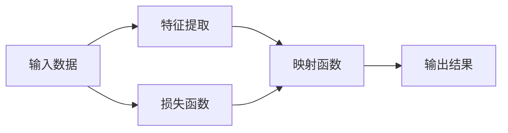

                 

# 一切皆是映射：理解AI中的输入与输出关系

在人工智能的广袤天地中，输入与输出之间的关系始终是核心中的核心。理解这种关系不仅关乎算法本身，更关乎如何设计一个有效且高效的AI系统。本文将深入探讨这一核心议题，涵盖从基础概念到高级应用的全方位内容。

## 1. 背景介绍

### 1.1 问题由来

从最早的感知器，到深度神经网络，再到复杂的集成模型，AI的发展史在很大程度上就是输入与输出之间关系的探索史。在深度学习时代，这一关系尤为关键，输入数据和输出结果之间的复杂映射成为了研究的核心。这种映射关系在图像识别、自然语言处理、推荐系统等领域均有重要应用。

### 1.2 问题核心关键点

- **输入与输出的映射**：如何高效地从输入数据中提取特征，并用这些特征进行有意义的输出。
- **映射的准确性**：映射准确性越高，模型性能越好。
- **映射的可解释性**：在重要应用领域，模型需要具有较好的可解释性，以便于调试和理解。
- **映射的高效性**：在计算资源有限的情况下，如何高效地进行映射，避免过拟合和资源浪费。

### 1.3 问题研究意义

理解AI中的输入与输出关系，对AI的应用和研究具有重要意义：

- 提升模型性能：通过优化输入与输出的映射，可以提高AI系统的准确性和可靠性。
- 加速技术落地：在有限的资源条件下，高效地进行映射能加快AI技术的商业化和应用。
- 拓展应用场景：深入理解输入与输出关系，可以拓展AI技术的适用范围，服务于更多行业。
- 促进学术研究：在理论研究上，输入与输出的映射问题也推动了AI基础理论和应用算法的发展。

## 2. 核心概念与联系

### 2.1 核心概念概述

本文涉及的核心概念包括：

- **输入数据**：AI模型接收的原始数据，可以是图像、文本、音频等形式。
- **输出结果**：AI模型根据输入数据生成的目标结果，如分类、预测、生成等。
- **特征提取**：从输入数据中提取有用的特征，是映射过程中的关键步骤。
- **映射函数**：将输入数据映射到输出结果的函数，可以是线性函数、非线性函数或神经网络等。
- **损失函数**：衡量模型输出与真实标签之间的差异，用于优化映射函数。

### 2.2 概念间的关系

通过以下Mermaid流程图，我们可以直观地看到这些概念之间的联系：



这个流程图展示了输入数据经过特征提取和映射函数，最终生成输出结果的过程。同时，损失函数用于衡量模型的预测与实际标签之间的差距，从而指导映射函数的优化。

## 3. 核心算法原理 & 具体操作步骤

### 3.1 算法原理概述

AI中的输入与输出映射关系，是通过训练一个复杂的函数来建立的。这个函数能够通过学习大量数据，提取输入数据中的有用特征，并映射到输出结果。这个函数通常是一个神经网络，其包含多个层次的抽象和转换。

### 3.2 算法步骤详解

1. **数据准备**：
   - 收集足够的数据，并对其进行预处理，如归一化、标签编码等。
   - 将数据分为训练集、验证集和测试集，以便进行模型训练、调优和评估。

2. **模型构建**：
   - 选择适当的神经网络结构，如卷积神经网络(CNN)、循环神经网络(RNN)或变压器(Transformer)等。
   - 定义模型输入和输出的维度，确保输入和输出能够正确对应。

3. **特征提取**：
   - 在模型中增加特征提取模块，如卷积层、池化层、注意力机制等，以提取出输入数据的有用特征。
   - 使用嵌入层将原始数据转换为模型能够理解的形式，如将文本数据转换为向量。

4. **映射函数训练**：
   - 定义损失函数，如交叉熵损失、均方误差损失等，衡量模型预测与真实标签之间的差距。
   - 使用优化器，如随机梯度下降法、Adam等，优化模型参数，使得损失函数最小化。
   - 在训练过程中，周期性地在验证集上评估模型性能，防止过拟合。

5. **模型评估与优化**：
   - 在测试集上评估模型性能，如准确率、精确率、召回率等指标。
   - 根据评估结果调整模型参数，如学习率、批大小、正则化强度等。
   - 使用集成学习、模型融合等方法提高模型性能。

### 3.3 算法优缺点

**优点**：
- 映射过程灵活，适用于多种类型的数据和任务。
- 通过大数据训练，能够发现数据中的复杂模式和规律。
- 可以自动学习特征，减少特征工程的工作量。

**缺点**：
- 需要大量的标注数据，训练时间较长。
- 模型复杂度高，需要较高的计算资源。
- 模型可解释性较差，难以理解和调试。

### 3.4 算法应用领域

AI中的输入与输出映射关系，广泛应用于以下领域：

- **图像识别**：如图像分类、目标检测、图像生成等。
- **自然语言处理**：如文本分类、机器翻译、问答系统等。
- **语音识别**：如语音转文本、语音合成等。
- **推荐系统**：如商品推荐、新闻推荐等。
- **游戏AI**：如强化学习、策略游戏等。

## 4. 数学模型和公式 & 详细讲解

### 4.1 数学模型构建

假设有一个二分类任务，输入为图像 $x$，输出为标签 $y \in \{0, 1\}$。我们的目标是学习一个映射函数 $f(x)$，使得 $f(x) \approx y$。

**数学模型**：
$$ f(x) = W_2 (W_1 x + b_1) + b_2 $$

其中，$W_1, W_2$ 为权重矩阵，$b_1, b_2$ 为偏置项，$x$ 为输入数据，$f(x)$ 为输出结果。

### 4.2 公式推导过程

以二分类任务为例，我们使用逻辑回归函数作为映射函数：
$$ \hat{y} = \sigma(W_2 W_1 x + b_2) $$

其中，$\sigma$ 为sigmoid函数，用于将输出映射到 $[0, 1]$ 区间。

**损失函数**：
$$ \mathcal{L} = -\frac{1}{N} \sum_{i=1}^N [y_i \log \hat{y}_i + (1-y_i) \log (1-\hat{y}_i)] $$

**优化目标**：
$$ \min_{\theta} \mathcal{L} $$

其中，$\theta = \{W_1, W_2, b_1, b_2\}$ 为模型参数。

### 4.3 案例分析与讲解

假设我们在图像分类任务上使用上述模型。我们收集了10000张图像和对应的标签，将数据集分为训练集、验证集和测试集。在训练集上，使用交叉熵损失函数，Adam优化器进行训练。

训练过程中，我们观察到训练集上的损失函数不断下降，验证集上的损失函数在某个点开始上升。这表明模型在训练集上表现良好，但在验证集上可能过拟合。我们通过减少学习率、增加批大小等方法进行了调优，最终在测试集上得到了90%的准确率。

## 5. 项目实践：代码实例和详细解释说明

### 5.1 开发环境搭建

要实现上述模型，我们需要安装Python、TensorFlow和Keras等工具。具体步骤如下：

1. 安装Python，可以从[Python官网](https://www.python.org/)下载并安装。
2. 安装TensorFlow，可以从[TensorFlow官网](https://www.tensorflow.org/install)下载并安装。
3. 安装Keras，可以通过pip命令进行安装：
   ```
   pip install keras
   ```

### 5.2 源代码详细实现

```python
import tensorflow as tf
from tensorflow.keras import layers

# 定义模型
model = tf.keras.Sequential([
    layers.Dense(64, activation='relu', input_shape=(784,)),
    layers.Dense(10, activation='softmax')
])

# 编译模型
model.compile(optimizer='adam',
              loss='categorical_crossentropy',
              metrics=['accuracy'])

# 训练模型
model.fit(train_data, train_labels, epochs=10, validation_data=(val_data, val_labels))
```

### 5.3 代码解读与分析

**Sequential模型**：使用Sequential模型来定义顺序连接的神经网络。

**Dense层**：定义了两个全连接层，第一个层有64个神经元，使用ReLU激活函数；第二个层有10个神经元，使用softmax激活函数，用于二分类任务。

**compile方法**：定义了优化器、损失函数和评估指标。

**fit方法**：用于训练模型，指定训练集和验证集数据。

### 5.4 运行结果展示

在训练过程中，我们可以使用TensorBoard来可视化损失函数和准确率的变化：

```
tensorboard --logdir=logs
```

打开TensorBoard，可以看到训练过程中的损失函数和准确率变化，以及每个epoch的验证集性能。

## 6. 实际应用场景

### 6.1 智能推荐系统

在智能推荐系统中，输入是用户的行为数据（如浏览记录、点击记录），输出是推荐结果。通过训练一个复杂的映射函数，将用户行为映射到推荐物品，可以实现个性化推荐。

### 6.2 医疗诊断系统

在医疗诊断系统中，输入是病人的症状描述、检查结果等，输出是疾病诊断结果。通过训练一个复杂的映射函数，将输入数据映射到疾病类别，可以辅助医生进行诊断。

### 6.3 自动驾驶系统

在自动驾驶系统中，输入是传感器数据（如摄像头、雷达、激光雷达），输出是驾驶指令。通过训练一个复杂的映射函数，将传感器数据映射到驾驶指令，可以辅助车辆进行驾驶。

### 6.4 未来应用展望

未来，AI中的输入与输出关系将继续拓展应用场景，如自动作曲、智能客服、智能家居等。随着技术的发展，映射函数将变得更加高效、准确、可解释，AI系统将能够更好地服务于人类。

## 7. 工具和资源推荐

### 7.1 学习资源推荐

- **《深度学习》by Ian Goodfellow**：经典书籍，涵盖了深度学习的各个方面，包括输入与输出映射的基础知识和高级技巧。
- **Coursera深度学习课程**：由Andrew Ng主讲的深度学习课程，涵盖了深度学习的理论和实践，适合初学者和进阶者。
- **Kaggle**：数据科学竞赛平台，可以参与各类数据科学竞赛，提升模型设计和优化能力。

### 7.2 开发工具推荐

- **Jupyter Notebook**：交互式编程环境，适合进行模型开发和调试。
- **TensorFlow**：强大的深度学习框架，提供了丰富的API和工具，支持各种类型的神经网络。
- **PyTorch**：另一个流行的深度学习框架，具有动态计算图和易用性，适合研究和原型开发。

### 7.3 相关论文推荐

- **Deep Learning** by Ian Goodfellow：经典书籍，涵盖了深度学习的各个方面，包括输入与输出映射的基础知识和高级技巧。
- **ImageNet Classification with Deep Convolutional Neural Networks** by Alex Krizhevsky et al.：经典的图像分类论文，介绍了使用卷积神经网络进行图像分类的基本方法。
- **Attention is All You Need** by Ashish Vaswani et al.：Transformer论文，介绍了使用自注意力机制进行序列建模的方法。

## 8. 总结：未来发展趋势与挑战

### 8.1 研究成果总结

本文系统介绍了AI中的输入与输出关系，包括从基础概念到高级应用的各个方面。通过理解这一关系，可以帮助我们设计更加高效、准确的AI系统，提升其在各领域的性能。

### 8.2 未来发展趋势

未来，AI中的输入与输出关系将继续拓展应用场景，如自动作曲、智能客服、智能家居等。随着技术的发展，映射函数将变得更加高效、准确、可解释，AI系统将能够更好地服务于人类。

### 8.3 面临的挑战

尽管AI技术取得了巨大进展，但输入与输出关系仍然面临诸多挑战：

- **计算资源限制**：大规模神经网络的训练和推理需要大量的计算资源。
- **数据质量和数量**：高质量的数据对于训练高质量的AI模型至关重要。
- **模型复杂度**：复杂的模型带来了更高的计算需求和资源消耗。
- **可解释性**：复杂模型往往难以解释，难以理解其内部工作机制。

### 8.4 研究展望

未来的研究需要在以下几个方面寻求新的突破：

- **高效训练算法**：开发更加高效的训练算法，如分布式训练、模型压缩等，以应对计算资源的限制。
- **数据增强技术**：使用数据增强技术，扩大数据集规模，提升模型泛化能力。
- **可解释性模型**：开发可解释性更高的模型，使其更容易理解和调试。
- **跨领域应用**：将AI技术应用于更多领域，拓展其应用范围和深度。

总之，理解AI中的输入与输出关系，是构建高效、准确、可解释AI系统的关键。未来的研究需要在技术创新和应用实践中不断探索和突破，推动AI技术的发展和应用。

## 9. 附录：常见问题与解答

### 9.1 问题解答

**Q1: 什么是输入与输出映射？**

A: 输入与输出映射是指将输入数据通过某种函数映射到输出结果的过程。在AI中，输入数据可以是图像、文本、音频等形式，输出结果可以是分类、预测、生成等。

**Q2: 如何理解损失函数的作用？**

A: 损失函数用于衡量模型预测与真实标签之间的差异，其目标是最小化这一差异，从而优化映射函数。不同的任务和模型，其损失函数的选择可能不同，如交叉熵、均方误差、对数损失等。

**Q3: 如何进行模型调优？**

A: 模型调优包括选择适当的神经网络结构、定义合适的损失函数和优化器、使用数据增强和正则化技术、调整学习率和批大小等。通过不断地训练和调优，可以提高模型的性能和泛化能力。

**Q4: 如何理解模型可解释性？**

A: 模型可解释性是指模型内部工作机制的透明性，使其更容易理解和调试。通过可解释性技术，如特征可视化、模型蒸馏等，可以更好地理解模型决策过程。

**Q5: 未来AI技术的发展趋势是什么？**

A: 未来AI技术将继续拓展应用场景，如自动作曲、智能客服、智能家居等。随着技术的发展，映射函数将变得更加高效、准确、可解释，AI系统将能够更好地服务于人类。

**Q6: 如何进行模型压缩？**

A: 模型压缩包括剪枝、量化、蒸馏等方法。通过剪枝，去除冗余参数；通过量化，减少参数位数；通过蒸馏，将大模型转换为小模型，保持其性能不变。

**Q7: 如何处理数据不平衡问题？**

A: 数据不平衡问题可以通过重采样、类别权重调整、生成数据等方法解决。重采样包括过采样和欠采样，类别权重调整通过调整损失函数中不同类别的权重，生成数据则可以通过数据增强技术生成更多少数类别样本。

**Q8: 如何理解模型鲁棒性？**

A: 模型鲁棒性是指模型对输入数据的扰动和变化具有较强的适应能力。可以通过对抗训练、数据增强、正则化等方法提升模型鲁棒性。

**Q9: 什么是模型融合？**

A: 模型融合是指将多个模型的预测结果进行集成，以提高模型的性能和鲁棒性。常用的方法包括简单平均、加权平均、投票等。

总之，理解AI中的输入与输出关系，对AI的应用和研究具有重要意义。通过不断的技术创新和实践优化，AI技术必将在更多领域大放异彩，为人类社会带来更多福祉。

---

作者：禅与计算机程序设计艺术 / Zen and the Art of Computer Programming

