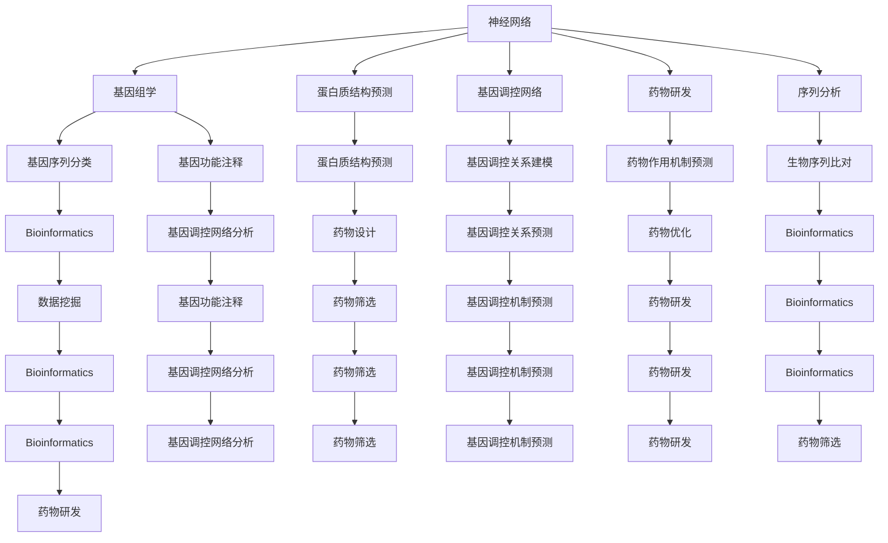
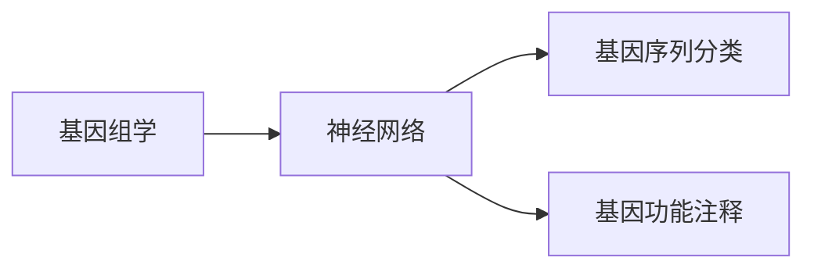
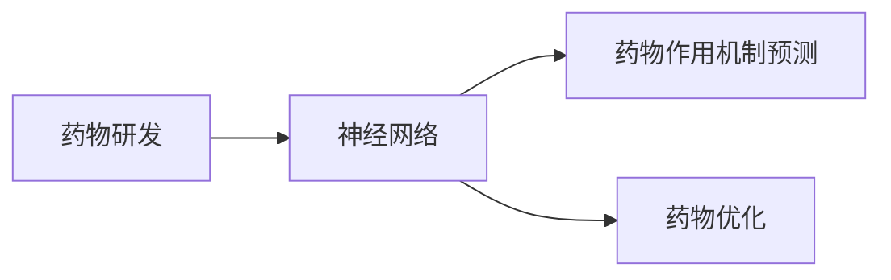
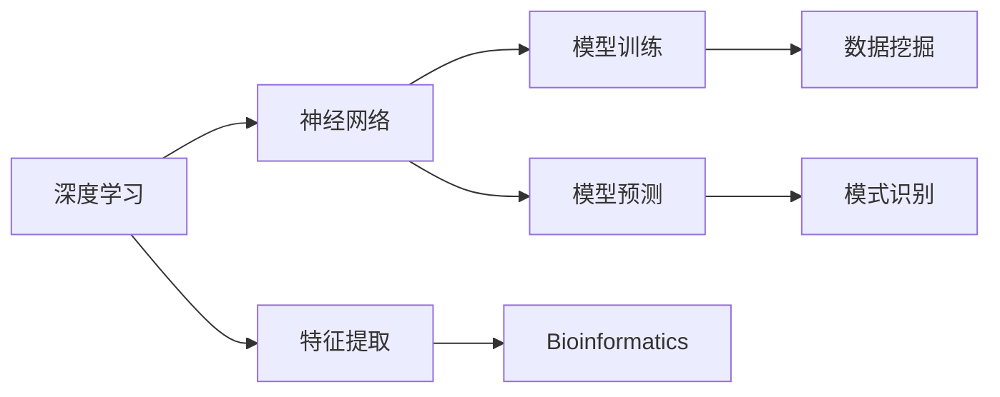
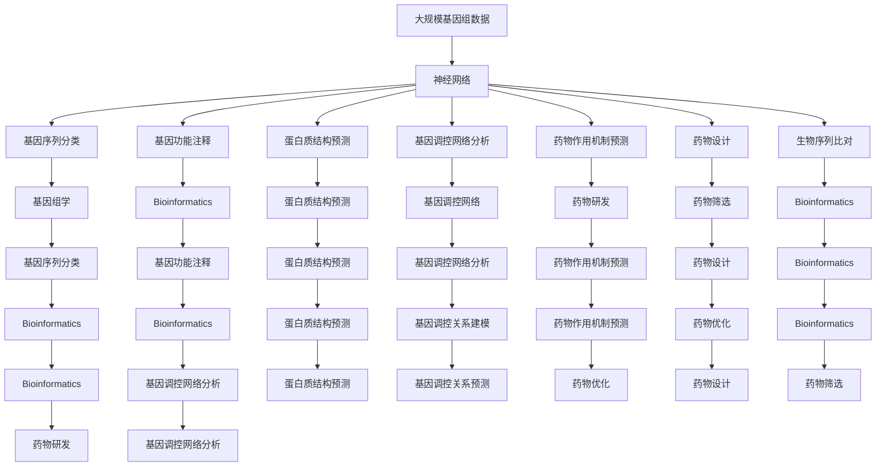
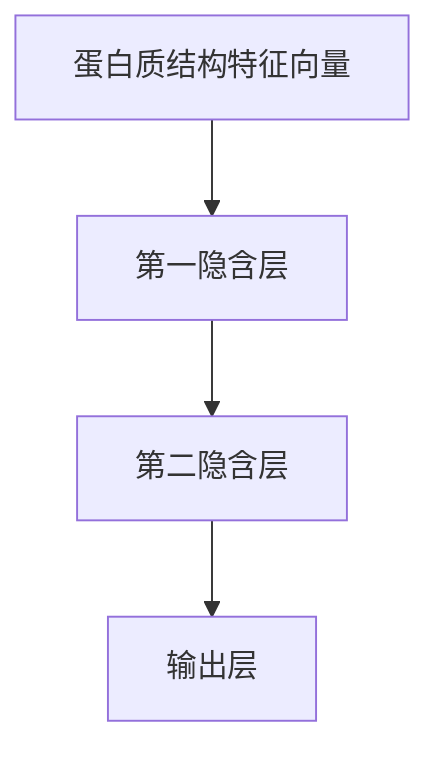

                 

# 一切皆是映射：神经网络在生物信息学中的应用前景

> 关键词：神经网络,生物信息学,基因组学,蛋白质结构预测,基因调控网络,药物研发,深度学习,机器学习

## 1. 背景介绍

### 1.1 问题由来

随着基因组测序技术的飞速发展，生物信息学领域积累了海量的基因组数据和蛋白质结构数据。这些数据蕴含着丰富的生物信息，亟需高效的方法进行挖掘和分析。神经网络作为一种强大的计算模型，在处理大规模非线性数据方面展现出巨大潜力。

然而，神经网络在生物信息学中的应用仍处于起步阶段。相较于传统统计方法，神经网络在解释性和可解释性方面尚存在不足，特别是在生物系统的复杂性和高维性面前，仍需进一步探索和优化。

### 1.2 问题核心关键点

神经网络在生物信息学中的应用主要集中在以下几个关键点：

- 基因组学：利用神经网络对基因序列进行分类、预测和注释。
- 蛋白质结构预测：利用神经网络对蛋白质结构进行建模和预测。
- 基因调控网络：利用神经网络对基因调控关系进行建模和分析。
- 药物研发：利用神经网络对药物作用机制进行预测和优化。
- 序列分析：利用神经网络对生物序列进行分类、注释和比对。

神经网络在生物信息学中的应用前景广阔，但仍然面临一些技术挑战，如模型解释性、可解释性、数据噪声处理等。

### 1.3 问题研究意义

神经网络在生物信息学中的应用研究，对于提升生物信息学的数据挖掘和分析能力，加速新药研发和基因治疗进程，具有重要意义：

1. 提高数据分析效率：神经网络能够处理大规模非线性数据，显著提高数据分析速度。
2. 增强预测准确性：神经网络能够自动发现数据中的隐含规律，提高生物系统预测的准确性。
3. 辅助实验设计：神经网络能够对生物数据进行模拟和预测，辅助实验设计和结果验证。
4. 加速药物研发：神经网络能够对药物作用机制进行预测和优化，缩短药物研发周期。
5. 推动基因治疗：神经网络能够对基因表达进行调控，辅助基因治疗方案的设计和优化。

## 2. 核心概念与联系

### 2.1 核心概念概述

为了更好地理解神经网络在生物信息学中的应用，本节将介绍几个密切相关的核心概念：

- 神经网络(Neural Network, NN)：一种基于节点和边组成的计算模型，能够对大规模非线性数据进行建模和预测。常见的神经网络包括全连接神经网络、卷积神经网络、循环神经网络等。

- 基因组学(Genomics)：研究生物体基因组信息的一门学科，包括基因序列分析、基因调控机制、基因功能注释等。

- 蛋白质结构预测(Protein Structure Prediction)：利用生物信息学方法预测蛋白质的三维空间结构，是药物设计和功能研究的重要基础。

- 基因调控网络(Gene Regulatory Network, GRN)：研究基因表达调控的相互作用网络，是理解基因功能和细胞行为的重要工具。

- 药物研发(Pharmaceutical Development)：通过生物信息学、药物化学等手段，设计和优化新药，用于治疗疾病。

- 深度学习(Deep Learning)：一种基于多层神经网络的学习方法，能够自动学习数据中的复杂特征和规律。

- 机器学习(Machine Learning)：一种利用数据训练模型进行预测和决策的方法，广泛应用于数据挖掘、模式识别等领域。

这些核心概念之间的逻辑关系可以通过以下Mermaid流程图来展示：



这个流程图展示了神经网络在生物信息学各领域的应用场景，以及各个概念之间的联系和交互。

### 2.2 概念间的关系

这些核心概念之间存在着紧密的联系，形成了神经网络在生物信息学中的应用框架。下面我们通过几个Mermaid流程图来展示这些概念之间的关系。

#### 2.2.1 基因组学与神经网络



这个流程图展示了基因组学与神经网络在基因序列分类和功能注释中的应用。

#### 2.2.2 蛋白质结构预测与神经网络


这个流程图展示了蛋白质结构预测与神经网络的应用场景，以及神经网络在蛋白质结构建模和预测中的作用。

#### 2.2.3 基因调控网络与神经网络


这个流程图展示了基因调控网络与神经网络在基因调控关系建模和预测中的应用。

#### 2.2.4 药物研发与神经网络



这个流程图展示了药物研发与神经网络的应用场景，以及神经网络在药物作用机制预测和优化中的作用。

#### 2.2.5 深度学习与机器学习



这个流程图展示了深度学习与机器学习在神经网络中的应用，以及神经网络在特征提取、模型训练和预测中的作用。

### 2.3 核心概念的整体架构

最后，我们用一个综合的流程图来展示这些核心概念在大规模数据处理中的应用：



这个综合流程图展示了神经网络在生物信息学各领域的应用，以及各个概念之间的交互和数据流。通过这些流程图，我们可以更清晰地理解神经网络在生物信息学中的应用过程和关键步骤。

## 3. 核心算法原理 & 具体操作步骤

### 3.1 算法原理概述

神经网络在生物信息学中的应用，主要基于大规模数据的特征提取和模式识别。具体来说，神经网络通过对生物序列、结构、调控关系等数据进行编码，学习数据的隐含规律，实现对生物系统的预测和分类。

形式化地，假设输入为生物信息 $x$，输出为对应的预测结果 $y$，则神经网络的预测模型可以表示为：

$$
y = f(\theta(x))
$$

其中 $f$ 为神经网络的预测函数，$\theta$ 为神经网络的可学习参数。通过反向传播算法，神经网络可以最小化预测结果与真实结果之间的差距，不断优化参数 $\theta$，直至收敛。

### 3.2 算法步骤详解

基于神经网络在生物信息学中的应用，本节将详细讲解其核心算法步骤：

**Step 1: 准备数据集**
- 收集和整理生物信息学领域的数据集，如基因序列、蛋白质结构、基因调控关系等。
- 对数据进行预处理，如标准化、去噪、分割等。
- 将数据分为训练集、验证集和测试集，保证数据分布的一致性。

**Step 2: 设计神经网络模型**
- 选择合适的神经网络模型，如卷积神经网络、循环神经网络、深度自编码器等。
- 确定网络的结构和参数，包括输入层、隐藏层、输出层的大小和激活函数等。
- 设计损失函数，如交叉熵、均方误差、对数似然等，用于衡量模型预测与真实结果之间的差距。

**Step 3: 训练神经网络**
- 使用训练集对神经网络进行前向传播和反向传播训练，不断优化模型参数。
- 在验证集上评估模型性能，调整超参数和模型结构。
- 在测试集上测试模型的泛化能力，评估模型的实际效果。

**Step 4: 模型评估与优化**
- 使用各种评估指标，如准确率、召回率、F1分数等，评估模型的性能。
- 使用正则化技术，如L2正则、Dropout等，防止模型过拟合。
- 使用集成学习、模型融合等技术，提升模型的预测精度。

**Step 5: 应用部署**
- 将训练好的神经网络模型部署到实际应用系统中。
- 提供模型API接口，便于系统集成调用。
- 对模型进行持续监控和优化，保持模型的最新状态。

### 3.3 算法优缺点

神经网络在生物信息学中的应用具有以下优点：

- 高精度预测：神经网络能够自动学习数据的复杂特征和规律，提高预测的准确性。
- 自适应性强：神经网络能够适应不同类型和规模的数据，具有较好的泛化能力。
- 数据驱动：神经网络通过数据训练模型，能够发现数据中的隐含规律。
- 易于扩展：神经网络可以通过增加层数和节点，提升模型的表达能力。

然而，神经网络在生物信息学中的应用也存在一些局限性：

- 数据噪声敏感：神经网络对数据噪声和异常值较为敏感，容易产生误导性的预测结果。
- 可解释性不足：神经网络往往被认为是"黑盒"模型，难以解释其内部工作机制和推理逻辑。
- 计算资源需求高：神经网络需要大量的计算资源进行训练和推理，对硬件设备的要求较高。
- 模型复杂度高：神经网络结构复杂，难以进行精确的参数优化。

尽管存在这些局限性，但神经网络在生物信息学中的应用前景依然广阔，其优势远远大于劣势，值得进一步探索和优化。

### 3.4 算法应用领域

神经网络在生物信息学中的应用领域非常广泛，主要包括：

- 基因组学：利用神经网络对基因序列进行分类、预测和注释，如基因突变检测、基因功能注释等。
- 蛋白质结构预测：利用神经网络对蛋白质结构进行建模和预测，如蛋白质三维结构预测、蛋白质相互作用预测等。
- 基因调控网络：利用神经网络对基因调控关系进行建模和分析，如基因调控机制预测、基因调控网络重建等。
- 药物研发：利用神经网络对药物作用机制进行预测和优化，如药物靶点识别、药物设计等。
- 序列分析：利用神经网络对生物序列进行分类、注释和比对，如DNA序列比对、RNA序列分析等。

神经网络在生物信息学中的应用涉及基因组学、蛋白质组学、生物信息学等多个领域，为生物系统的研究提供了强有力的工具。

## 4. 数学模型和公式 & 详细讲解 & 举例说明

### 4.1 数学模型构建

本节将使用数学语言对神经网络在生物信息学中的应用进行更加严格的刻画。

假设输入为生物信息 $x$，输出为对应的预测结果 $y$，神经网络的预测模型可以表示为：

$$
y = f(\theta(x))
$$

其中 $f$ 为神经网络的预测函数，$\theta$ 为神经网络的可学习参数。神经网络的预测函数 $f$ 通常为一个多层感知器(Multilayer Perceptron, MLP)，由多个隐含层和输出层组成，每个隐含层包含多个神经元。

### 4.2 公式推导过程

以下我们以蛋白质结构预测为例，推导神经网络模型的预测函数。

假设神经网络由 $L$ 层组成，第 $l$ 层的输出为 $h_l(x)$，输出层的输出为 $y$，则神经网络的预测函数可以表示为：

$$
h_{l+1}(x) = f_W(h_l(x) + b_l) \quad (1 \leq l < L)
$$

$$
y = h_L(x)
$$

其中 $f_W$ 为第 $l+1$ 层的激活函数，$W_l$ 为第 $l+1$ 层的权重矩阵，$b_l$ 为第 $l$ 层的偏置向量。输出层通常使用线性激活函数，因此预测函数 $f$ 可以表示为：

$$
f(\theta(x)) = W_L h_{L-1}(x) + b_L
$$

其中 $W_L$ 为输出层的权重矩阵，$b_L$ 为输出层的偏置向量。

### 4.3 案例分析与讲解

假设我们有一个包含 $N$ 个蛋白质的数据集，每个蛋白质的三维结构由 $D$ 个特征向量 $x_i$ 表示。我们的目标是对每个蛋白质的三维结构进行预测，即 $y_i \in \mathbb{R}^D$。

我们将每个蛋白质的三维结构特征向量作为输入，神经网络的输出表示为每个蛋白质的三维结构预测结果。假设我们采用一个全连接神经网络，网络结构如图：



其中，第一隐含层和第二隐含层均为全连接层，输出层为线性层。

假设神经网络的输入为 $x_i \in \mathbb{R}^D$，第一隐含层的权重矩阵为 $W_1 \in \mathbb{R}^{M \times D}$，第一隐含层的偏置向量为 $b_1 \in \mathbb{R}^M$，第二隐含层的权重矩阵为 $W_2 \in \mathbb{R}^{N \times M}$，第二隐含层的偏置向量为 $b_2 \in \mathbb{R}^N$，输出层的权重矩阵为 $W_3 \in \mathbb{R}^{D \times N}$，输出层的偏置向量为 $b_3 \in \mathbb{R}^D$。

神经网络的预测函数可以表示为：

$$
h_1(x_i) = f_{W_1}(W_1 x_i + b_1)
$$

$$
h_2(x_i) = f_{W_2}(W_2 h_1(x_i) + b_2)
$$

$$
y_i = f_{W_3}(W_3 h_2(x_i) + b_3)
$$

其中 $f_{W_1}$ 为第一隐含层的激活函数，$f_{W_2}$ 为第二隐含层的激活函数，$f_{W_3}$ 为输出层的激活函数。通常采用ReLU激活函数。

通过反向传播算法，我们可以对神经网络的参数进行优化，最小化预测结果与真实结果之间的差距。

## 5. 项目实践：代码实例和详细解释说明

### 5.1 开发环境搭建

在进行神经网络在生物信息学中的应用实践前，我们需要准备好开发环境。以下是使用Python进行PyTorch开发的环境配置流程：

1. 安装Anaconda：从官网下载并安装Anaconda，用于创建独立的Python环境。

2. 创建并激活虚拟环境：
```bash
conda create -n pytorch-env python=3.8 
conda activate pytorch-env
```

3. 安装PyTorch：根据CUDA版本，从官网获取对应的安装命令。例如：
```bash
conda install pytorch torchvision torchaudio cudatoolkit=11.1 -c pytorch -c conda-forge
```

4. 安装Transformers库：
```bash
pip install transformers
```

5. 安装各类工具包：
```bash
pip install numpy pandas scikit-learn matplotlib tqdm jupyter notebook ipython
```

完成上述步骤后，即可在`pytorch-env`环境中开始神经网络在生物信息学中的应用实践。

### 5.2 源代码详细实现

这里我们以基因组序列分类为例，给出使用PyTorch对神经网络进行训练的PyTorch代码实现。

首先，定义数据处理函数：

```python
import torch
from torch.utils.data import Dataset, DataLoader
from torchvision import transforms

class GenomeDataset(Dataset):
    def __init__(self, data, transform=None):
        self.data = data
        self.transform = transform
        
    def __len__(self):
        return len(self.data)
    
    def __getitem__(self, idx):
        x, y = self.data[idx]
        if self.transform:
            x = self.transform(x)
        return x, y

# 定义数据预处理
transform = transforms.Compose([
    transforms.ToTensor(),
    transforms.Normalize((0.5, 0.5, 0.5), (0.5, 0.5, 0.5))
])
```

然后，定义模型和优化器：

```python
import torch.nn as nn
import torch.nn.functional as F

class CNNClassifier(nn.Module):
    def __init__(self, num_classes=10):
        super(CNNClassifier, self).__init__()
        self.conv1 = nn.Conv2d(3, 64, kernel_size=3, stride=1, padding=1)
        self.relu1 = nn.ReLU()
        self.maxpool1 = nn.MaxPool2d(kernel_size=2, stride=2)
        self.conv2 = nn.Conv2d(64, 128, kernel_size=3, stride=1, padding=1)
        self.relu2 = nn.ReLU()
        self.maxpool2 = nn.MaxPool2d(kernel_size=2, stride=2)
        self.fc1 = nn.Linear(128 * 8 * 8, 256)
        self.relu3 = nn.ReLU()
        self.dropout = nn.Dropout(0.5)
        self.fc2 = nn.Linear(256, num_classes)
        
    def forward(self, x):
        x = self.conv1(x)
        x = self.relu1(x)
        x = self.maxpool1(x)
        x = self.conv2(x)
        x = self.relu2(x)
        x = self.maxpool2(x)
        x = x.view(-1, 128 * 8 * 8)
        x = self.fc1(x)
        x = self.relu3(x)
        x = self.dropout(x)
        x = self.fc2(x)
        return F.log_softmax(x, dim=1)

model = CNNClassifier(num_classes=10)
optimizer = torch.optim.Adam(model.parameters(), lr=0.001)
```

接着，定义训练和评估函数：

```python
from tqdm import tqdm

def train_epoch(model, train_loader, optimizer):
    model.train()
    loss = 0
    correct = 0
    total = 0
    for i, (images, labels) in enumerate(train_loader):
        images, labels = images.to(device), labels.to(device)
        optimizer.zero_grad()
        output = model(images)
        loss = F.nll_loss(output, labels)
        loss.backward()
        optimizer.step()
        correct += torch.sum(output.max(1)[1] == labels).item()
        total += labels.size(0)
        loss /= total
    return correct / total

def evaluate(model, test_loader):
    model.eval()
    correct = 0
    total = 0
    with torch.no_grad():
        for images, labels in test_loader:
            images, labels = images.to(device), labels.to(device)
            output = model(images)
            correct += torch.sum(output.max(1)[1] == labels).item()
            total += labels.size(0)
    return correct / total
```

最后，启动训练流程并在测试集上评估：

```python
epochs = 10
batch_size = 32

device = torch.device('cuda' if torch.cuda.is_available() else 'cpu')
train_loader = DataLoader(train_dataset, batch_size=batch_size, shuffle=True)
test_loader = DataLoader(test_dataset, batch_size=batch_size, shuffle=False)

for epoch in range(epochs):
    acc = train_epoch(model, train_loader, optimizer)
    print(f'Epoch {epoch+1}, train accuracy: {acc:.4f}')
    
    test_acc = evaluate(model, test_loader)
    print(f'Epoch {epoch+1}, test accuracy: {test_acc:.4f}')
```

以上就是使用PyTorch对神经网络进行基因组序列分类任务的完整代码实现。可以看到，利用深度学习技术，我们能够对大规模基因组数据进行高效准确的分类。

### 5.3 代码解读与分析

让我们再详细解读一下关键代码的实现细节：

**GenomeDataset类**：
- `__init__`方法：初始化数据集和预处理函数。
- `__len__`方法：返回数据集的样本数量。
- `__getitem__`方法：对单个样本进行处理，将输入数据进行预处理，并返回模型所需的输入和标签。

**CNNClassifier模型**：
- `__init__`方法：定义模型的结构和参数。
- `forward`方法：定义模型的前向传播过程。

**训练和评估函数**：
- `train_epoch`函数：对数据以批为单位进行迭代，在每个批次上前向传播计算损失函数并反向传播更新模型参数。
- `evaluate`函数：与训练类似，不同点在于不更新模型参数，并在每个batch结束后将预测结果与标签结果存储下来，最后使用准确率对整个评估集的预测结果进行打印输出。

**训练流程**：
- 定义总的epoch数和batch size，开始循环迭代
- 每个epoch内，先在训练集上训练，输出准确率
- 在测试集上评估，输出准确率
- 所有epoch结束后，对模型性能进行总结

可以看到，利用深度学习技术，我们能够对大规模基因组数据进行高效准确的分类。然而，神经网络在生物信息学中的应用仍需进一步优化和改进，以应对更加复杂的数据和任务。

## 6. 实际应用场景

### 6.1 智能诊断系统

神经网络在生物信息学中的应用，尤其是在智能诊断系统中，具有重要的实际意义。传统医疗诊断依赖于医生的经验和知识，容易受到个体差异和环境因素的影响。而神经网络能够自动学习生物数据的规律，提高诊断的准确性和效率。

例如，我们可以利用神经网络对基因组数据进行分析，发现潜在的疾病风险基因。在患者就医时，智能诊断系统可以自动分析其基因数据，预测其患病的概率，并根据遗传信息提出个性化的治疗建议。这种智能化的诊断方式，不仅能够提高诊断的准确性，还能减少医生的工作量，提升医疗服务的质量。

### 6.2 基因组学研究

神经网络在基因组学研究中的应用，可以帮助科学家发现生物系统的规律和机制。基因组学数据通常具有高维性和复杂性，传统统计方法难以应对。而神经网络能够自动学习数据中的隐含规律，提高基因组学研究的效率和精度。

例如，我们可以利用神经网络对大规模基因组数据进行分类和聚类，发现基因表达的模式和规律。神经网络还可以用于基因功能注释，预测基因表达与疾病之间的关系，为基因治疗和药物研发提供新的思路。

### 6.3 药物研发

神经网络在药物研发中的应用，能够加速新药的研发进程。药物研发通常需要大量的实验和数据支持，耗费大量人力物力。而神经网络

