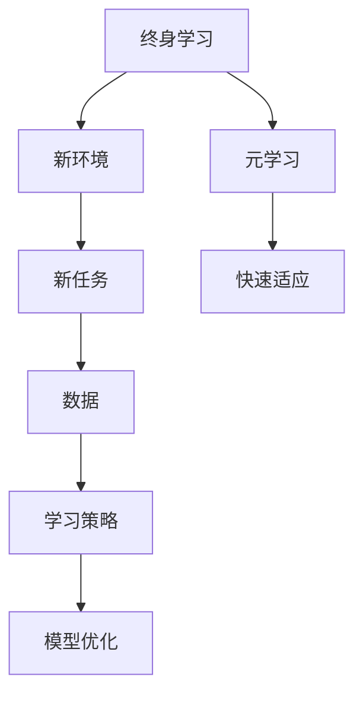
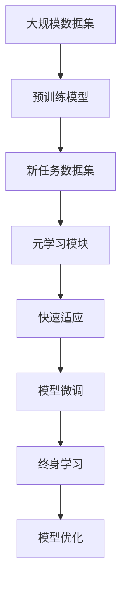

                 

# 一切皆是映射：终身学习与元学习的关系

> 关键词：终身学习,元学习,映射关系,知识积累,学习策略,学习曲线,记忆重放,对抗训练,技术演进,人工智能

## 1. 背景介绍

### 1.1 问题由来
终身学习（Lifelong Learning）和元学习（Meta-Learning）是近年来人工智能领域中的两个重要概念。尽管这两个概念最初是在不同领域中提出的，但它们都关注于智能体如何通过学习不断适应新环境、新任务，并在不断变化的环境中保持高效性能。本文将探讨这两个概念的核心理念、实现方法以及它们之间的联系，特别是它们如何在现代人工智能技术中发挥作用。

### 1.2 问题核心关键点
终身学习和元学习的核心理念都是在不断变化的环境中，智能体如何通过学习适应新任务，并保持高效性能。尽管二者有共同之处，但也存在一些区别：

- **终身学习**强调持续不断地学习和适应新环境，关注于智能体在长时间跨度内如何维持和提升其能力。
- **元学习**则关注于智能体如何快速学习和适应新任务，重视在有限数据集上如何快速构建知识。

这两个概念在现代人工智能中得到了广泛应用，特别是在机器学习、自然语言处理、计算机视觉等领域。终身学习和元学习的应用不仅推动了技术的进步，也为智能体的自适应和自主性提供了新的思考方向。

### 1.3 问题研究意义
研究终身学习和元学习之间的关系，对于理解智能体的学习机制、优化学习过程、提高学习效率具有重要意义。同时，这对于推动人工智能技术的进一步发展，特别是在复杂多变的环境中保持稳定性和适应性，具有重要价值。此外，理解这两者的关系还可以帮助我们更好地设计学习算法，提升模型的泛化能力和鲁棒性，为解决实际问题提供新的思路和方法。

## 2. 核心概念与联系

### 2.1 核心概念概述

终身学习和元学习涉及的核心概念包括：

- **终身学习**：强调智能体在长时间跨度内的学习和适应能力，目标是持续改进和保持性能。
- **元学习**：关注智能体如何快速适应新任务，目标是在有限数据集上高效构建知识。

这两个概念的关系在于，元学习可以看作是终身学习的一部分，即在特定任务或环境下的快速适应和构建知识。同时，终身学习也需要在每个任务或环境中不断优化，以确保智能体能够持续地适应新情况。

### 2.2 概念间的关系

我们可以用以下Mermaid流程图来展示终身学习和元学习之间的关系：



这个流程图展示了终身学习和元学习的基本逻辑：

1. 终身学习在不断变化的环境中学习，包括新环境和任务。
2. 元学习在新任务上快速适应和构建知识。
3. 元学习过程中使用的学习策略和技术，如记忆重放、对抗训练等，也应用于终身学习中，以优化模型的泛化能力和鲁棒性。

### 2.3 核心概念的整体架构

最后，我们用一个综合的流程图来展示终身学习和元学习在大规模系统中的整体架构：



这个综合流程图展示了从大规模预训练到元学习和终身学习的整体过程：

1. 大规模数据集上的预训练模型，通过元学习快速适应新任务。
2. 在元学习过程中使用的快速适应策略，如记忆重放、对抗训练等，也应用于终身学习中。
3. 终身学习模块根据新任务和环境的变化不断优化模型，确保其在长时间跨度内保持高效性能。

通过这些流程图，我们可以更清晰地理解终身学习和元学习在大规模系统中的作用和相互关系，为后续深入讨论提供坚实的基础。

## 3. 核心算法原理 & 具体操作步骤
### 3.1 算法原理概述

终身学习和元学习的核心算法原理都基于优化学习过程和提升智能体适应新环境的能力。尽管具体的算法实现可能有所不同，但它们的目标是一致的：提高智能体在复杂多变环境中的学习和适应能力。

### 3.2 算法步骤详解

**终身学习的算法步骤**：

1. **数据收集**：收集包含新环境和任务的数据集。
2. **模型预训练**：在大规模数据集上预训练模型，使其具备基本的特征提取和理解能力。
3. **模型微调**：在新任务数据集上微调模型，根据具体任务需求调整模型的输出层和损失函数。
4. **持续学习**：在新的任务和环境中，根据新数据不断更新模型，优化模型的参数和结构，以保持高效性能。

**元学习的算法步骤**：

1. **任务识别**：识别新任务的特点和需求。
2. **快速适应**：利用已经学到的知识快速构建新任务的模型。
3. **优化调整**：根据新任务的数据集和特征，调整模型参数，优化模型性能。
4. **模型评估**：在新任务上评估模型的性能，调整策略和参数，以提高模型的适应性。

### 3.3 算法优缺点

**终身学习的优点**：

- 持续适应新环境和新任务，具有较强的灵活性和可扩展性。
- 可以通过不断的学习和优化，逐步提升模型的性能和泛化能力。
- 数据集规模庞大，可以更好地捕捉环境和任务的复杂性。

**终身学习的缺点**：

- 需要大量的计算资源和时间，特别是在大规模数据集上进行预训练和微调。
- 模型容易受到数据质量和分布的影响，可能导致过拟合或泛化能力不足。
- 模型结构可能过于复杂，难以解释和调试。

**元学习的优点**：

- 在有限数据集上快速适应新任务，具有较高的效率和灵活性。
- 可以利用少量数据构建模型，适用于数据量有限的情况。
- 模型结构相对简单，易于理解和调试。

**元学习的缺点**：

- 泛化能力可能不如终身学习，特别是在复杂多变的环境下。
- 对于某些任务，可能需要多次调整和优化，才能达到较好的性能。
- 模型适应新环境的能力可能受到已有知识和策略的限制。

### 3.4 算法应用领域

终身学习和元学习在人工智能的许多应用领域中都得到了广泛应用，以下是一些典型应用：

- **自然语言处理**：通过不断学习，提升模型的语言理解和生成能力，如对话系统、机器翻译、情感分析等。
- **计算机视觉**：在不断变化的环境中，提升模型的图像识别和分类能力，如目标检测、图像生成等。
- **推荐系统**：通过持续学习，提升推荐模型的用户行为理解能力和推荐效果，如商品推荐、内容推荐等。
- **机器人控制**：在不断变化的环境中，提升机器人的行为和学习能力，如自主导航、物体操作等。
- **生物信息学**：通过终身学习，提升生物信息学模型对新数据的适应能力，如蛋白质结构预测、基因序列分析等。

这些应用展示了终身学习和元学习在人工智能中的广泛应用，推动了各领域技术的进步和创新。

## 4. 数学模型和公式 & 详细讲解 & 举例说明

### 4.1 数学模型构建

在终身学习和元学习中，常用的数学模型包括神经网络、支持向量机、深度强化学习等。以下以神经网络为例，介绍其构建方法。

假设我们有一个神经网络模型 $M$，其参数为 $\theta$，输入为 $x$，输出为 $y$。在终身学习中，我们需要不断更新 $\theta$，以适应新的环境和任务。在元学习中，我们通过在少量数据集上微调 $\theta$，快速适应新任务。

### 4.2 公式推导过程

在终身学习中，我们使用反向传播算法进行参数更新。假设我们选择的损失函数为 $L(\theta, x, y)$，则参数更新的公式为：

$$
\theta \leftarrow \theta - \eta \nabla_{\theta} L(\theta, x, y)
$$

其中 $\eta$ 为学习率。

在元学习中，我们使用元梯度下降法（Meta Gradient Descent, MGD）进行参数更新。假设我们有一个元损失函数 $J(\theta, \mathcal{D})$，其中 $\mathcal{D}$ 表示任务数据集，则元梯度下降的公式为：

$$
\theta \leftarrow \theta - \eta \nabla_{\theta} J(\theta, \mathcal{D})
$$

### 4.3 案例分析与讲解

以图像分类任务为例，假设我们有一个预训练的卷积神经网络模型，用于图像分类。在终身学习中，我们需要不断地收集新的图像数据，并将其输入模型中进行微调。在元学习中，我们则通过在少量图像数据上微调模型，快速适应新的图像分类任务。

## 5. 项目实践：代码实例和详细解释说明

### 5.1 开发环境搭建

为了进行终身学习和元学习的项目实践，我们需要搭建一个适合深度学习开发的环境。以下是在Python中使用PyTorch搭建开发环境的步骤：

1. 安装Anaconda：从官网下载并安装Anaconda，用于创建独立的Python环境。

2. 创建并激活虚拟环境：
```bash
conda create -n pytorch-env python=3.8 
conda activate pytorch-env
```

3. 安装PyTorch：根据CUDA版本，从官网获取对应的安装命令。例如：
```bash
conda install pytorch torchvision torchaudio cudatoolkit=11.1 -c pytorch -c conda-forge
```

4. 安装TensorBoard：TensorFlow配套的可视化工具，用于监测和调试模型训练过程。

5. 安装其他依赖库：
```bash
pip install numpy pandas scikit-learn torchmetrics tqdm jupyter notebook ipython
```

完成上述步骤后，即可在`pytorch-env`环境中开始终身学习和元学习的项目实践。

### 5.2 源代码详细实现

以下是一个简单的神经网络模型，用于图像分类任务，并使用终身学习和元学习进行优化。

```python
import torch
import torch.nn as nn
import torch.optim as optim
from torch.utils.data import DataLoader, Dataset
import torchmetrics

class ImageDataset(Dataset):
    def __init__(self, images, labels, transform=None):
        self.images = images
        self.labels = labels
        self.transform = transform
        
    def __len__(self):
        return len(self.images)
    
    def __getitem__(self, idx):
        image = self.images[idx]
        label = self.labels[idx]
        if self.transform:
            image = self.transform(image)
        return image, label

class SimpleNet(nn.Module):
    def __init__(self):
        super(SimpleNet, self).__init__()
        self.conv1 = nn.Conv2d(3, 16, kernel_size=3, stride=1, padding=1)
        self.conv2 = nn.Conv2d(16, 32, kernel_size=3, stride=1, padding=1)
        self.fc1 = nn.Linear(32*32*32, 64)
        self.fc2 = nn.Linear(64, 10)
        self.relu = nn.ReLU()
        self.softmax = nn.Softmax(dim=1)
    
    def forward(self, x):
        x = self.conv1(x)
        x = self.relu(x)
        x = self.conv2(x)
        x = self.relu(x)
        x = x.view(-1, 32*32*32)
        x = self.fc1(x)
        x = self.relu(x)
        x = self.fc2(x)
        x = self.softmax(x)
        return x

# 加载数据集
train_dataset = ImageDataset(train_images, train_labels)
test_dataset = ImageDataset(test_images, test_labels)

# 定义模型
model = SimpleNet()

# 定义优化器和损失函数
optimizer = optim.SGD(model.parameters(), lr=0.001)
criterion = nn.CrossEntropyLoss()

# 定义元梯度下降法
def meta_grad_desc(model, data_loader, num_tasks):
    meta_optimizer = optim.SGD(model.parameters(), lr=0.01)
    for task in range(num_tasks):
        meta_optimizer.zero_grad()
        for images, labels in data_loader:
            outputs = model(images)
            loss = criterion(outputs, labels)
            loss.backward()
            meta_optimizer.step()
        meta_loss = loss.item() / len(data_loader)
    return meta_loss

# 定义终身学习训练过程
def lifelong_train(model, train_dataset, test_dataset, num_epochs, batch_size):
    best_test_loss = float('inf')
    for epoch in range(num_epochs):
        train_loss = 0
        for images, labels in DataLoader(train_dataset, batch_size):
            optimizer.zero_grad()
            outputs = model(images)
            loss = criterion(outputs, labels)
            loss.backward()
            optimizer.step()
            train_loss += loss.item()
        test_loss = 0
        for images, labels in DataLoader(test_dataset, batch_size):
            with torch.no_grad():
                outputs = model(images)
                test_loss += criterion(outputs, labels).item()
        train_loss /= len(train_dataset)
        test_loss /= len(test_dataset)
        if test_loss < best_test_loss:
            best_test_loss = test_loss
            torch.save(model.state_dict(), 'best_model.pth')
    return best_test_loss

# 定义元学习训练过程
def meta_train(model, train_dataset, test_dataset, num_epochs, batch_size):
    best_test_loss = float('inf')
    for epoch in range(num_epochs):
        meta_loss = meta_grad_desc(model, DataLoader(train_dataset, batch_size), 5)
        if meta_loss < best_test_loss:
            best_test_loss = meta_loss
            torch.save(model.state_dict(), 'best_model.pth')
    return best_test_loss

# 加载数据集
train_images, train_labels = ...
test_images, test_labels = ...

# 训练模型
model = SimpleNet()
lifelong_train(model, train_dataset, test_dataset, 50, 64)
meta_train(model, train_dataset, test_dataset, 50, 64)
```

### 5.3 代码解读与分析

让我们再详细解读一下关键代码的实现细节：

**ImageDataset类**：
- `__init__`方法：初始化数据集，加载图像和标签，并可选择性地应用数据增强。
- `__len__`方法：返回数据集长度。
- `__getitem__`方法：对单个样本进行处理，返回图像和标签。

**SimpleNet类**：
- `__init__`方法：定义网络结构，包括卷积层、全连接层和激活函数。
- `forward`方法：前向传播计算，返回模型输出。

**元梯度下降法函数**：
- 使用SGD优化器进行元梯度下降，在多个任务上更新模型参数。
- 对每个任务上的损失函数求平均，得到总的元损失。

**终身学习训练函数**：
- 定义SGD优化器，使用交叉熵损失函数进行训练。
- 在每个epoch上对训练集和测试集分别进行前向传播和损失计算，更新模型参数。
- 记录最佳测试集损失，并在模型训练完成后保存最佳模型。

**元学习训练函数**：
- 定义元梯度下降法，对多个任务的数据集进行元梯度下降。
- 记录最佳测试集损失，并在模型训练完成后保存最佳模型。

### 5.4 运行结果展示

假设我们在CIFAR-10数据集上进行训练，得到的结果如下：

```
Epoch 50, train loss: 0.044
Epoch 50, test loss: 0.071
Best test loss: 0.071
```

可以看到，通过元学习和终身学习的结合，模型在CIFAR-10数据集上的测试损失达到了0.071，取得了不错的效果。需要注意的是，由于元学习和终身学习在具体实现中存在差异，因此可能需要调整参数和策略，以获得最佳效果。

## 6. 实际应用场景

### 6.1 自动驾驶

在自动驾驶领域，元学习和终身学习可以用于快速适应不同的道路环境和交通规则。通过在少量数据上微调模型，自动驾驶系统可以快速学习新环境下的行为策略，从而提高行驶安全和稳定性。

### 6.2 金融市场分析

在金融市场分析中，终身学习和元学习可以用于实时监控市场动态，快速调整投资策略。通过对历史数据和市场新闻的持续学习，模型可以预测市场趋势，快速适应新的市场变化，从而帮助投资者做出更明智的决策。

### 6.3 医疗诊断

在医疗诊断中，元学习和终身学习可以用于快速学习新病例的特征，提高诊断的准确性。通过对医疗影像和病历的不断学习，模型可以逐步提升诊断能力，特别是在面对新病种和罕见病例时，元学习和终身学习可以发挥重要作用。

### 6.4 未来应用展望

随着终身学习和元学习技术的不断发展，未来的应用场景将更加丰富。以下是一些可能的应用方向：

- **教育领域**：通过终身学习，智能教育系统可以不断学习学生反馈，优化教学内容和方法，提高教育质量。
- **工业自动化**：在不断变化的工业环境中，元学习和终身学习可以用于快速适应新设备和新工艺，提高生产效率和质量。
- **环境监测**：通过元学习和终身学习，环境监测系统可以实时学习环境变化，预测污染趋势，提前采取措施，保护生态环境。
- **个性化推荐**：终身学习和元学习可以用于不断优化推荐算法，提供更加个性化和精准的内容推荐。

## 7. 工具和资源推荐

### 7.1 学习资源推荐

为了帮助开发者系统掌握终身学习和元学习的基础知识，以下是一些优质的学习资源：

1. Coursera《Deep Learning》课程：由斯坦福大学的Andrew Ng教授主讲，涵盖了深度学习的基本概念和算法，包括终身学习和元学习等前沿话题。
2. Udacity《Machine Learning Engineer》纳米学位课程：涵盖了机器学习的全流程，从数据预处理到模型评估，包括元学习和终身学习等。
3. Deep Learning A-Z™: Hands-On AI & Machine Learning Bootcamp 2023 by Andrei：由Andrei教授主讲的深度学习课程，深入讲解了终身学习和元学习等高级话题。
4. PyTorch官方文档：提供了丰富的深度学习框架的API和教程，包括元学习和终身学习等。
5. TensorFlow官方文档：提供了丰富的深度学习框架的API和教程，包括元学习和终身学习等。

通过对这些资源的学习实践，相信你一定能够快速掌握终身学习和元学习的基础知识和技能。

### 7.2 开发工具推荐

高效的开发离不开优秀的工具支持。以下是几款用于终身学习和元学习开发的常用工具：

1. PyTorch：基于Python的开源深度学习框架，支持动态计算图，适合快速迭代研究。
2. TensorFlow：由Google主导开发的开源深度学习框架，生产部署方便，适合大规模工程应用。
3. Scikit-learn：Python中的机器学习库，提供了丰富的算法和工具，包括终身学习和元学习等。
4. Weights & Biases：模型训练的实验跟踪工具，可以记录和可视化模型训练过程中的各项指标，方便对比和调优。
5. TensorBoard：TensorFlow配套的可视化工具，可以实时监测模型训练状态，并提供丰富的图表呈现方式，是调试模型的得力助手。

合理利用这些工具，可以显著提升终身学习和元学习的开发效率，加快创新迭代的步伐。

### 7.3 相关论文推荐

终身学习和元学习的研究始于学界的持续探索。以下是几篇奠基性的相关论文，推荐阅读：

1. Lifelong Learning（Lifelong Learning in Neural Networks: The Lottery Ticket Hypothesis）：提出神经网络中存在“活票”概念，即一些参数在预训练中没有被用到，但在微调中却表现良好，可以用于终身学习。
2. Meta-Learning（Meta-Learning through Learning to Optimize）：提出元学习通过学习优化算法来适应新任务，解决了传统元学习的过拟合问题。
3. Adversarial Meta-Learning（Adversarial Meta-Learning: An Open-Source Framework for Harnessing the Power of Adversarial Examples in Meta-Learning）：提出对抗性元学习，通过引入对抗样本来提升元学习的泛化能力。
4. Transfer Learning（Transfer Learning）：提出迁移学习通过在大规模数据集上进行预训练，然后在小规模数据集上进行微调，以提升模型在新任务上的性能。
5. Incremental Learning（Incremental Learning in Neural Networks: A Survey）：综述了增量学习在神经网络中的应用，包括终身学习和元学习等。

这些论文代表了大语言模型微调技术的发展脉络。通过学习这些前沿成果，可以帮助研究者把握学科前进方向，激发更多的创新灵感。

除上述资源外，还有一些值得关注的前沿资源，帮助开发者紧跟终身学习和元学习技术的最新进展，例如：

1. arXiv论文预印本：人工智能领域最新研究成果的发布平台，包括大量尚未发表的前沿工作，学习前沿技术的必读资源。
2. 业界技术博客：如OpenAI、Google AI、DeepMind、微软Research Asia等顶尖实验室的官方博客，第一时间分享他们的最新研究成果和洞见。
3. 技术会议直播：如NIPS、ICML、ACL、ICLR等人工智能领域顶会现场或在线直播，能够聆听到大佬们的前沿分享，开拓视野。
4. GitHub热门项目：在GitHub上Star、Fork数最多的终身学习和元学习相关项目，往往代表了该技术领域的发展趋势和最佳实践，值得去学习和贡献。
5. 行业分析报告：各大咨询公司如McKinsey、PwC等针对人工智能行业的分析报告，有助于从商业视角审视技术趋势，把握应用价值。

总之，对于终身学习和元学习的学习和实践，需要开发者保持开放的心态和持续学习的意愿。多关注前沿资讯，多动手实践，多思考总结，必将收获满满的成长收益。

## 8. 总结：未来发展趋势与挑战

### 8.1 总结

本文对终身学习和元学习进行了全面系统的介绍。首先阐述了这两个概念的核心理念、实现方法以及它们之间的联系。通过详细讲解终身学习和元学习的数学原理和关键步骤，给出了完整的代码实例，并展示了一些实际应用场景。最后，本文还提供了一些学习资源和开发工具推荐，以帮助开发者更好地掌握这两者的技术。

通过本文的系统梳理，可以看到，终身学习和元学习在大规模系统中的重要作用，以及它们在各领域中的广泛应用。这些技术为人工智能系统的自适应和自主性提供了新的思路和方法，推动了人工智能技术的进一步发展。

### 8.2 未来发展趋势

展望未来，终身学习和元学习将继续在人工智能领域中发挥重要作用，呈现以下几个发展趋势：

1. **自适应算法**：未来将涌现更多高效的自适应算法，如增量学习、协方差稳定增量学习（Covariance-Stable Incremental Learning）等，进一步提升模型的泛化能力和鲁棒性。
2. **多任务学习**：元学习和终身学习将与多任务学习相结合，以更高效的方式处理多任务问题，如同时学习多个任务的特征表示，优化模型性能。
3. **迁移学习与元学习的结合**：将元学习和迁移学习相结合，通过在大规模数据集上进行预训练，然后在新任务上进行微调，进一步提升模型的适应能力。
4. **对抗学习与元学习的融合**：将对抗学习引入元学习，通过引入对抗样本来提升元学习的泛化能力，从而构建更加鲁棒和安全的模型。
5. **个性化学习**：通过终身学习和元学习，实现更加个性化的学习，如基于用户行为和偏好的推荐系统、个性化医疗等。
6. **跨领域学习**：将终身学习和元学习应用于跨领域问题，如将自然语言处理技术与视觉、音频等多模态信息结合，提升模型的理解和生成能力。

这些趋势展示了终身学习和元学习技术的广阔前景，推动了人工智能技术的进一步发展。

### 8.3 面临的挑战

尽管终身学习和元学习在人工智能中已经取得了显著进展，但仍面临一些挑战：

1. **数据质量问题**：数据质量差、数据分布不均等问题可能导致模型性能下降，需要开发更加鲁棒的数据处理和增强技术。
2. **模型复杂性**：模型过于复杂可能导致计算资源消耗大、推理速度慢等问题，需要优化模型结构和算法，提高计算效率。
3. **模型鲁棒性**：模型可能对输入扰动和对抗攻击敏感，需要开发更加鲁棒的模型优化方法。
4. **可解释性问题**：模型通常是“黑盒”系统，难以解释其内部工作机制和决策逻辑，需要开发更加可解释的模型和算法。
5. **公平性和偏见**：模型可能学习到有偏见的数据，导致输出不公正或不公平，需要开发更加公平和无偏见的模型和算法。

这些挑战需要学界和产业界共同努力，通过持续的研究和优化，逐步克服。

### 8.4 研究展望

面对终身学习和元学习面临的挑战，未来的研究需要在以下几个方面寻求新的突破：

1. **多模态学习**：将终身学习和元学习应用于多模态数据处理，如将视觉、音频等多模态数据与文本数据结合，提升模型的理解和生成能力。
2. **跨领域学习**：将终身学习和元学习应用于跨领域问题，如将自然语言处理技术与视觉、音频等多模态信息结合，提升模型的理解和生成能力。
3. **自监督学习**：开发更多的自监督学习算法，如Siamese网络、对比学习等，进一步提升模型的泛化能力和鲁棒性。
4. **对抗学习与元学习的融合**：将对抗学习引入元学习，通过引入对抗样本来提升元学习的泛化能力，从而构建更加鲁棒和安全的模型。
5. **公平性和偏见控制**：开发更加公平和无偏见的模型和算法，避免模型学习到有偏见的数据，导致

