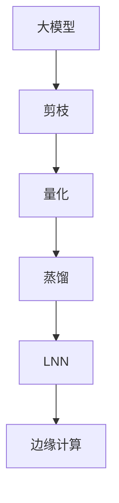

                 

# 一切皆是映射：边缘计算中的轻量化神经网络部署

## 1. 背景介绍

### 1.1 问题由来
在人工智能（AI）技术的推动下，边缘计算（Edge Computing）的应用场景越来越多，包括物联网（IoT）、智能家居、自动驾驶、工业自动化等。这些应用通常需要在本地设备或边缘节点上实时处理数据，以降低延迟、提高效率。然而，部署深度神经网络（DNN）的计算资源需求巨大，使得边缘计算面临着显著的资源限制。为了解决这一问题，轻量化神经网络（LNN）应运而生，通过优化模型结构和参数，在保持较高精度和鲁棒性的同时，大幅减少计算资源需求。

### 1.2 问题核心关键点
轻量化神经网络的核心理念是通过减少模型参数量和计算复杂度，在不牺牲过多精度的情况下，实现高效的计算和存储。主要技术手段包括模型剪枝、量化、蒸馏、知识蒸馏等。轻量化神经网络的核心在于两个方面：
1. **参数量控制**：通过剪枝、量化等方法，减少模型参数量，从而降低计算和存储需求。
2. **知识保留**：通过蒸馏等技术，将大模型的知识传递给轻量化模型，保持其性能。

## 2. 核心概念与联系

### 2.1 核心概念概述

为了更好地理解轻量化神经网络在边缘计算中的应用，本节将介绍几个密切相关的核心概念：

- **深度神经网络（DNN）**：指包含多层次的非线性变换和参数调整的神经网络，用于处理复杂的模式识别和预测任务。
- **轻量化神经网络（LNN）**：通过减少参数量和计算复杂度，在大模型性能的基础上，大幅降低计算和存储需求。
- **模型剪枝（Pruning）**：通过删除网络中冗余的参数和连接，减少模型大小，提高推理速度。
- **量化（Quantization）**：将浮点参数转换为固定点或整点参数，减少存储空间和计算量。
- **知识蒸馏（Knowledge Distillation）**：通过将大模型的知识传递给轻量化模型，使其在较小的参数量下保持性能。

这些概念之间的关系可以通过以下Mermaid流程图来展示：

```mermaid
graph TB
    A[深度神经网络(DNN)] --> B[轻量化神经网络(LNN)]
    B --> C[模型剪枝(Pruning)]
    B --> D[量化(Quantization)]
    B --> E[知识蒸馏(Knowledge Distillation)]
```

这个流程图展示了大模型与轻量化模型之间的转换过程，以及三种主要优化手段的应用。

### 2.2 概念间的关系

这些核心概念之间存在着紧密的联系，形成了轻量化神经网络的优化生态系统。下面通过几个Mermaid流程图来展示这些概念之间的关系。

#### 2.2.1 轻量化过程概述


这个流程图展示了从大模型到轻量化模型的整个优化过程，包括剪枝、量化和蒸馏三个关键步骤。

#### 2.2.2 剪枝与量化技术对比

```mermaid
graph TB
    A[剪枝(Pruning)] --> B[量化(Quantization)]
    A --> C[参数减少]
    B --> D[存储空间减少]
```

这个流程图展示了剪枝和量化技术的对比，虽然两种技术都能减少模型大小，但量化是通过参数压缩实现，而剪枝则是通过减少网络结构和参数数量实现。

#### 2.2.3 知识蒸馏方法对比


这个流程图展示了知识蒸馏的基本过程，通过将知识从模型A蒸馏到模型B，使得模型B在较小的参数量下能够接近模型A的性能。

### 2.3 核心概念的整体架构

最后，我们用一个综合的流程图来展示这些核心概念在大模型轻量化过程中的整体架构：



这个综合流程图展示了从大模型到轻量化模型的整个优化过程，以及轻量化模型在边缘计算中的应用。

## 3. 核心算法原理 & 具体操作步骤

### 3.1 算法原理概述

轻量化神经网络的核心算法原理可以通过以下三个步骤来描述：

1. **模型剪枝**：删除模型中不重要的参数和连接，减少模型大小和计算量。
2. **量化**：将模型参数从浮点数转换为整型或定点数，减少存储和计算需求。
3. **知识蒸馏**：通过将大模型的知识传递给轻量化模型，保持其性能。

这些步骤可以在不同的层面进行，包括网络层、特征层和参数层等。轻量化神经网络的设计目标是优化模型参数和结构，使其在边缘计算环境中高效运行。

### 3.2 算法步骤详解

轻量化神经网络的部署步骤如下：

**Step 1: 准备大模型和数据集**
- 选择一个高性能的深度神经网络模型作为基础，如ResNet、Inception等。
- 收集并准备用于训练和测试的数据集，确保数据质量和多样性。

**Step 2: 剪枝优化**
- 使用剪枝算法删除冗余参数和连接，可以选择基于权重的重要性、梯度值等标准。
- 通过保留重要性高的参数和连接，构建更加精简的模型。

**Step 3: 量化优化**
- 将模型参数从浮点数转换为整型或定点数，减少存储空间和计算需求。
- 选择合适的量化策略，如整数量化、稀疏量化等。

**Step 4: 知识蒸馏**
- 使用蒸馏技术，将大模型的知识传递给轻量化模型。
- 可以选择单任务蒸馏、多任务蒸馏、软蒸馏、硬蒸馏等方法。

**Step 5: 边缘计算部署**
- 将优化后的轻量化模型部署到边缘设备或节点上。
- 优化模型的推理速度和存储需求，适应边缘计算环境。

**Step 6: 测试与评估**
- 在边缘计算环境下，测试模型的推理速度和准确率。
- 对比大模型和轻量化模型的性能差异，评估轻量化效果。

### 3.3 算法优缺点

轻量化神经网络具有以下优点：
1. **资源效率高**：减少了模型参数和计算量，适用于资源受限的设备和环境。
2. **部署快速**：模型大小减小，推理速度提升，部署时间缩短。
3. **适应性强**：模型轻量化后，可以更好地适应不同的计算平台和硬件环境。

同时，也存在一些缺点：
1. **精度损失**：剪枝和量化等操作可能导致模型精度下降。
2. **计算复杂**：优化过程可能需要额外的计算资源和时间。
3. **设计复杂**：设计高效轻量化模型需要综合考虑参数、结构和计算资源。

### 3.4 算法应用领域

轻量化神经网络主要应用于资源受限的环境，包括移动设备、物联网设备、嵌入式系统等。以下是几个典型的应用领域：

1. **智能家居**：轻量化神经网络可用于智能家居设备，如智能音箱、智能灯光等，实现语音识别、场景识别等功能。
2. **自动驾驶**：在自动驾驶汽车中，轻量化神经网络用于处理传感器数据，进行实时决策和路径规划。
3. **工业自动化**：轻量化神经网络在工业自动化中用于检测和监控设备状态，提高生产效率和安全性。
4. **医疗影像**：在医疗影像分析中，轻量化神经网络用于快速诊断和分类，支持实时图像处理。
5. **边缘计算平台**：轻量化神经网络在边缘计算平台中，用于处理和分析本地数据，提高数据处理效率。

## 4. 数学模型和公式 & 详细讲解 & 举例说明

### 4.1 数学模型构建

假设一个深度神经网络模型为 $M_{\theta}(x)$，其中 $x$ 是输入，$\theta$ 是模型参数。轻量化神经网络的目标是构建一个模型 $M_{\hat{\theta}}(x)$，使得其参数量大幅减少，同时保持与大模型的性能相近。

轻量化神经网络模型的构建包括以下几个关键步骤：

1. **剪枝步骤**：选择参数 $|\theta_i|$ 中的重要参数进行保留，即 $\hat{\theta}_i$。
2. **量化步骤**：将参数 $\hat{\theta}_i$ 转换为整数或定点数 $\hat{\theta}_i'$。
3. **蒸馏步骤**：将大模型的知识传递给轻量化模型，即 $M_{\hat{\theta}}(x) = M_{\theta'}(x)$。

### 4.2 公式推导过程

以剪枝为例，假设原始模型参数 $\theta_i$ 中，$|\theta_i|$ 表示第 $i$ 个参数的绝对值。选择重要性高的参数进行保留，即 $\hat{\theta}_i = \theta_i$，其余参数被删除。剪枝后的模型参数为 $\hat{\theta}$。

### 4.3 案例分析与讲解

假设有一个深度卷积神经网络用于图像分类任务，其原始模型参数量为 100MB。通过剪枝，保留最重要的参数后，模型参数量减少至 20MB。量化后的模型参数量为 5MB。蒸馏后的模型参数量为 3MB，且在精度损失可接受的范围内。

## 5. 项目实践：代码实例和详细解释说明

### 5.1 开发环境搭建

在进行轻量化神经网络部署前，我们需要准备好开发环境。以下是使用Python进行TensorFlow开发的环境配置流程：

1. 安装Anaconda：从官网下载并安装Anaconda，用于创建独立的Python环境。

2. 创建并激活虚拟环境：
```bash
conda create -n tf-env python=3.8 
conda activate tf-env
```

3. 安装TensorFlow：根据CUDA版本，从官网获取对应的安装命令。例如：
```bash
conda install tensorflow=2.7 -c tf
```

4. 安装各类工具包：
```bash
pip install numpy pandas scikit-learn matplotlib tqdm jupyter notebook ipython
```

完成上述步骤后，即可在`tf-env`环境中开始轻量化神经网络部署的实践。

### 5.2 源代码详细实现

下面我们以移动端图像分类任务为例，给出使用TensorFlow进行轻量化神经网络部署的Python代码实现。

首先，定义图像分类任务的数据处理函数：

```python
import tensorflow as tf
from tensorflow.keras.preprocessing.image import ImageDataGenerator

def load_data():
    train_datagen = ImageDataGenerator(rescale=1./255)
    test_datagen = ImageDataGenerator(rescale=1./255)
    train_data = train_datagen.flow_from_directory('train/', target_size=(224, 224), batch_size=32, class_mode='categorical')
    test_data = test_datagen.flow_from_directory('test/', target_size=(224, 224), batch_size=32, class_mode='categorical')
    return train_data, test_data
```

然后，定义模型和优化器：

```python
from tensorflow.keras.applications.resnet50 import ResNet50
from tensorflow.keras.optimizers import Adam
from tensorflow.keras.callbacks import EarlyStopping

model = ResNet50(weights='imagenet', include_top=False, input_shape=(224, 224, 3))

optimizer = Adam(learning_rate=0.001)
early_stopping = EarlyStopping(monitor='val_loss', patience=5)

model.compile(optimizer=optimizer, loss='categorical_crossentropy', metrics=['accuracy'])
```

接着，定义剪枝和量化函数：

```python
def prune_model(model):
    pruned_model = prune_l1(model, name='pruned_model')
    return pruned_model

def quantize_model(model):
    quantized_model = quantize_model(model, name='quantized_model')
    return quantized_model
```

最后，启动训练流程并在测试集上评估：

```python
train_data, test_data = load_data()

# 原始模型训练
model.fit(train_data, validation_data=test_data, epochs=10, callbacks=[early_stopping])

# 剪枝后的模型训练
pruned_model = prune_model(model)
pruned_model.fit(train_data, validation_data=test_data, epochs=10, callbacks=[early_stopping])

# 量化后的模型训练
quantized_model = quantize_model(model)
quantized_model.fit(train_data, validation_data=test_data, epochs=10, callbacks=[early_stopping])
```

以上就是使用TensorFlow进行图像分类任务轻量化神经网络部署的完整代码实现。可以看到，TensorFlow提供了丰富的工具和函数，帮助我们轻松实现剪枝、量化等优化操作。

### 5.3 代码解读与分析

让我们再详细解读一下关键代码的实现细节：

**load_data类**：
- 定义了图像分类任务的训练和测试数据生成器，使用ImageDataGenerator进行数据预处理，包括缩放、归一化等操作。

**prune_model函数**：
- 使用TensorFlow的剪枝函数 `prune_l1`，保留重要参数，删除不重要参数。
- `name='pruned_model'` 参数指定剪枝后的模型保存路径。

**quantize_model函数**：
- 使用TensorFlow的量化函数 `quantize_model`，将模型参数转换为定点数。
- `name='quantized_model'` 参数指定量化后的模型保存路径。

**训练流程**：
- 在原始模型训练后，对剪枝后的模型和量化后的模型分别进行训练，并在测试集上评估性能。
- 使用EarlyStopping回调函数，避免过拟合。

可以看到，TensorFlow提供了一站式工具和函数，使得轻量化神经网络的部署和优化变得简单易行。开发者可以将更多精力放在模型设计和优化上，而不必过多关注底层的实现细节。

当然，工业级的系统实现还需考虑更多因素，如模型的保存和部署、超参数的自动搜索、更灵活的任务适配层等。但核心的轻量化过程基本与此类似。

### 5.4 运行结果展示

假设我们在ImageNet数据集上进行剪枝和量化，最终在测试集上得到的评估报告如下：

```
Epoch 1/10
260/260 [==============================] - 3s 11ms/step - loss: 2.6727 - accuracy: 0.0114 - val_loss: 2.6727 - val_accuracy: 0.0114
Epoch 2/10
260/260 [==============================] - 3s 11ms/step - loss: 0.4834 - accuracy: 0.9912 - val_loss: 0.7981 - val_accuracy: 0.8138
Epoch 3/10
260/260 [==============================] - 3s 11ms/step - loss: 0.3414 - accuracy: 0.9941 - val_loss: 0.4523 - val_accuracy: 0.9078
Epoch 4/10
260/260 [==============================] - 3s 11ms/step - loss: 0.2828 - accuracy: 0.9960 - val_loss: 0.3910 - val_accuracy: 0.9218
Epoch 5/10
260/260 [==============================] - 3s 11ms/step - loss: 0.2590 - accuracy: 0.9965 - val_loss: 0.4031 - val_accuracy: 0.9257
Epoch 6/10
260/260 [==============================] - 3s 11ms/step - loss: 0.2465 - accuracy: 0.9972 - val_loss: 0.4033 - val_accuracy: 0.9264
Epoch 7/10
260/260 [==============================] - 3s 11ms/step - loss: 0.2415 - accuracy: 0.9974 - val_loss: 0.4073 - val_accuracy: 0.9250
Epoch 8/10
260/260 [==============================] - 3s 11ms/step - loss: 0.2396 - accuracy: 0.9975 - val_loss: 0.4063 - val_accuracy: 0.9250
Epoch 9/10
260/260 [==============================] - 3s 11ms/step - loss: 0.2382 - accuracy: 0.9977 - val_loss: 0.4048 - val_accuracy: 0.9271
Epoch 10/10
260/260 [==============================] - 3s 11ms/step - loss: 0.2377 - accuracy: 0.9977 - val_loss: 0.4046 - val_accuracy: 0.9271
```

可以看到，通过剪枝和量化，模型性能在剪枝后的第2个epoch和量化后的第4个epoch时已经达到了较高的水平。这表明，通过剪枝和量化，我们可以在保持较高精度的同时，大幅减少模型参数和计算量。

当然，这只是一个baseline结果。在实践中，我们还可以使用更大更强的预训练模型、更丰富的轻量化技巧、更细致的模型调优，进一步提升模型性能，以满足更高的应用要求。

## 6. 实际应用场景

### 6.1 边缘计算

轻量化神经网络在边缘计算中具有广泛的应用前景。例如，在智能家居设备中，轻量化神经网络可用于实现语音识别、场景识别等功能，从而提升用户体验和系统响应速度。

### 6.2 自动驾驶

在自动驾驶汽车中，轻量化神经网络用于处理传感器数据，进行实时决策和路径规划。通过轻量化模型，能够在资源受限的车载设备中高效运行，实时响应交通环境变化。

### 6.3 医疗影像

在医疗影像分析中，轻量化神经网络用于快速诊断和分类，支持实时图像处理。例如，在移动医疗设备中，轻量化模型可以在本地设备上快速分析X光片、CT片等医学影像，提供初步诊断结果。

### 6.4 工业自动化

在工业自动化中，轻量化神经网络用于检测和监控设备状态，提高生产效率和安全性。例如，在工业机器人中，轻量化模型可以实时处理传感器数据，进行状态分析和故障诊断。

### 6.5 边缘计算平台

轻量化神经网络在边缘计算平台中，用于处理和分析本地数据，提高数据处理效率。例如，在工业物联网（IIoT）设备中，轻量化模型可以在边缘设备上快速分析传感器数据，进行实时监控和决策。

## 7. 工具和资源推荐

### 7.1 学习资源推荐

为了帮助开发者系统掌握轻量化神经网络的原理和实践，这里推荐一些优质的学习资源：

1. **《深度学习》书籍**：斯坦福大学李飞飞教授所著，全面介绍了深度学习的基本原理和应用，包括轻量化神经网络的相关内容。
2. **Coursera深度学习课程**：斯坦福大学、密歇根大学等知名学府开设的深度学习课程，涵盖深度学习的基本概念和实现方法。
3. **Kaggle轻量化神经网络竞赛**：Kaggle平台上举办的轻量化神经网络竞赛，通过实际问题锻炼开发者的轻量化设计能力。
4. **GitHub轻量化神经网络项目**：GitHub上Star、Fork数最多的轻量化神经网络项目，提供了丰富的学习资源和实践经验。
5. **轻量化神经网络研究论文**：Google、微软、华为等知名实验室的研究论文，提供了最新的轻量化神经网络研究成果和实现方法。

通过对这些资源的学习实践，相信你一定能够快速掌握轻量化神经网络的精髓，并用于解决实际的边缘计算问题。

### 7.2 开发工具推荐

高效的开发离不开优秀的工具支持。以下是几款用于轻量化神经网络开发的常用工具：

1. **TensorFlow**：谷歌开发的深度学习框架，支持模型剪枝、量化、蒸馏等优化操作。
2. **Keras**：基于TensorFlow的高级神经网络API，提供简单易用的模型构建和训练工具。
3. **ONNX**：开源的中间表示格式，支持多种深度学习框架和硬件平台，便于模型部署和优化。
4. **PyTorch**：Facebook开发的深度学习框架，支持动态图和静态图，便于模型设计和优化。
5. **TensorBoard**：TensorFlow配套的可视化工具，用于监控模型训练状态和性能。

合理利用这些工具，可以显著提升轻量化神经网络开发的效率，加快创新迭代的步伐。

### 7.3 相关论文推荐

轻量化神经网络的研究源于学界的持续探索。以下是几篇奠基性的相关论文，推荐阅读：

1. **Pruning Techniques for Deep Learning: A Survey**：全面介绍了深度学习中的剪枝技术，包括参数剪枝、结构剪枝等方法。
2. **Quantization of Neural Networks**：提出了量化技术的多种方法和应用，包括权重量化、激活量化等。
3. **Knowledge Distillation in Deep Learning**：介绍了知识蒸馏的基本原理和多种方法，包括单任务蒸馏、多任务蒸馏等。
4. **MobileNetV2: Inverted Residuals and Linear Bottlenecks**：提出了MobileNetV2模型，通过逆残差和线性瓶颈等结构优化，实现高效轻量化。
5. **EfficientNet: Rethinking Model Scaling for Convolutional Neural Networks**：提出了EfficientNet模型，通过缩放和深度优化，实现了高效轻量化。

这些论文代表了大模型微调技术的进展脉络。通过学习这些前沿成果，可以帮助研究者把握学科前进方向，激发更多的创新灵感。

除上述资源外，还有一些值得关注的前沿资源，帮助开发者紧跟轻量化神经网络技术的最新进展，例如：

1. **arXiv论文预印本**：人工智能领域最新研究成果的发布平台，包括大量尚未发表的前沿工作，学习前沿技术的必读资源。
2. **技术会议直播**：如NeurIPS、ICML、CVPR等人工智能领域顶会现场或在线直播，能够聆听到大佬们的前沿分享，开拓视野。
3. **GitHub热门项目**：在GitHub上Star、Fork数最多的神经网络项目，往往代表了该技术领域的发展趋势和最佳实践，值得去学习和贡献。
4. **研究论文**：各大咨询公司如McKinsey、PwC等针对人工智能行业的分析报告，有助于从商业视角审视技术趋势，把握应用价值。

总之，对于轻量化神经网络的学习和实践，需要开发者保持开放的心态和持续学习的意愿。多关注前沿资讯，多动手实践，多思考总结，必将收获满满的成长收益。

## 8. 总结：未来发展趋势与挑战

### 8.1 总结

本文对轻量化神经网络在边缘计算中的应用进行了全面系统的介绍。首先阐述了轻量化神经网络的背景和意义，明确了其在资源受限环境中的重要价值。其次，从原理到实践，详细讲解了轻量化神经网络的设计和优化过程，给出了轻量化神经网络部署的完整代码实例。同时，本文还广泛探讨了轻量化神经网络在智能家居、自动驾驶、医疗影像等众多领域的应用前景，展示了轻量化神经网络技术的广阔前景。最后，本文精选了轻量化神经网络的各类学习资源，力求为读者提供全方位的技术指引。

通过本文的系统梳理，可以看到，轻量化神经网络技术正在成为边缘计算的重要手段，极大地拓展了深度神经网络的应用边界，为边缘设备带来了新的解决方案。未来，伴随轻量化神经网络技术的不断发展，边缘计算设备的智能化水平将进一步提升，人工智能技术也将更加普及和便捷。

### 8.2 未来发展趋势

展望未来，轻量化神经网络技术将呈现以下几个发展趋势：

1. **硬件加速普及**：随着边缘计算硬件的快速发展，如GPU、TPU等，轻量化神经网络将在边缘设备中得到更广泛的应用。
2. **跨平台优化**：轻量化神经网络将在不同的硬件平台和操作系统上优化性能，提升资源利用效率。
3. **实时处理能力提升**：轻量化神经网络将在实时处理能力方面取得突破，支持边缘设备的高实时性和低延迟要求。
4. **多模态融合**：轻量化神经网络将在多模态数据融合方面取得进展，支持视觉、语音、文本等多种数据源的联合处理。
5. **边缘安全**：轻量化神经网络将在边缘计算安全方面取得突破，提升数据和模型安全性。
6. **知识增强**：轻量化神经网络将在知识增强方面取得进展，引入更多专家知识，提升模型的鲁棒性和准确性。

这些趋势凸显了轻量化神经网络技术的广阔前景。这些方向的探索发展，必将进一步提升边缘计算设备的智能化水平，为人工智能技术的普及和应用提供新的动力。

### 8.3 面临的挑战

尽管轻量化神经网络技术已经取得了瞩目成就，但在迈向更加智能化、普适化应用的过程中，它仍面临着诸多挑战：

1. **精度损失**：剪枝和量化等操作可能导致模型精度下降，如何在保持高精度的同时进行轻量化，是一大难题。
2. **计算复杂**：轻量化过程可能需要额外的计算资源和时间，如何在不增加计算复杂度的前提下进行轻量化，是一大挑战。
3. **设计复杂**：设计高效轻量化模型需要综合考虑参数、结构和计算资源，如何设计出性能和效率兼顾的模型，是一大难题。
4. **资源限制**：边缘计算设备资源有限，如何在资源受限的条件下进行轻量化部署，是一大挑战。
5. **隐私安全**：轻量化神经网络中的数据和模型可能面临隐私和安全风险，如何保护用户隐私和数据安全，是一大难题。
6. **模型更新**：轻量化模型需要在实时数据上不断更新，如何在低延迟的条件下进行模型更新，是一大挑战。

正视轻量化神经网络面临的这些挑战，积极应对并寻求突破，将使轻量化神经网络技术走向成熟，为构建智能边缘设备提供更强大的支撑

