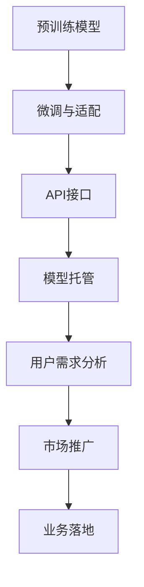

                 

# 七种宿命下的大模型创业

大语言模型作为当前人工智能领域的热门技术，其应用场景遍及各行各业，为创业者提供了广阔的机遇与挑战。本文将探讨七种可能的宿命，帮助读者更好地理解大模型创业的本质及其在未来的发展方向。

## 1. 背景介绍

### 1.1 大模型的崛起

近年来，随着深度学习技术的突破性进展，预训练大语言模型如BERT、GPT等在自然语言处理(NLP)领域取得了显著成果。大模型以其庞大的参数规模和强大的语言理解能力，逐步成为了AI创业的核心驱动力。

### 1.2 创业机会与挑战

大模型技术的崛起，为AI创业者提供了诸多机遇，但也带来了一系列挑战。如何在激烈的竞争中脱颖而出，同时规避潜在的风险，是创业成功的关键。

## 2. 核心概念与联系

### 2.1 大模型的核心概念

大语言模型通过在无标签数据上进行的自监督预训练，学习到了丰富的语言知识。它们可以应用于文本分类、情感分析、对话系统、翻译等多种NLP任务。

### 2.2 大模型创业的核心概念

大模型创业不仅仅是技术应用，更是商业模式、市场推广和用户需求的综合体现。以下是大模型创业过程中核心概念及其相互联系：

- **预训练模型**：大模型的基础，通过大量无标签数据预训练获得通用语言表示。
- **微调与适配**：针对特定任务进行微调，使模型适配具体应用场景。
- **API接口**：提供标准化接口，方便用户调用预训练和微调模型。
- **模型托管**：通过云服务提供模型托管，降低创业门槛。
- **用户需求分析**：理解用户需求，设计适配的产品。
- **市场推广**：通过市场营销，吸引目标用户。
- **业务落地**：将模型与实际业务场景结合，实现商业价值。

这些概念通过Mermaid流程图展示它们之间的关系：



### 2.3 核心概念的实现

下图展示了核心概念的实现路径：


## 3. 核心算法原理 & 具体操作步骤

### 3.1 算法原理概述

大模型创业的基础是预训练模型的微调技术。微调通过有监督学习，使模型在特定任务上优化性能。具体步骤如下：

1. **数据准备**：收集标注数据，划分为训练集、验证集和测试集。
2. **模型选择**：选择合适的预训练模型，如BERT、GPT等。
3. **任务适配**：根据任务类型，设计合适的输出层和损失函数。
4. **微调训练**：使用优化算法，如AdamW，更新模型参数。
5. **评估与部署**：在测试集上评估模型性能，部署到实际应用中。

### 3.2 算法步骤详解

以下是一个详细的微调过程示例：

1. **数据准备**：
   - 收集标注数据：如情感分析任务的评论数据集。
   - 数据划分：划分为训练集、验证集和测试集。

2. **模型选择**：
   - 选择预训练模型：使用HuggingFace的BERT模型。
   - 加载模型：通过`from transformers import BertForSequenceClassification`加载模型。

3. **任务适配**：
   - 设计输出层：使用线性分类器，输出情感标签。
   - 设计损失函数：使用交叉熵损失函数。

4. **微调训练**：
   - 定义优化器：`optimizer = AdamW(model.parameters(), lr=2e-5)`
   - 定义训练函数：
     ```python
     def train():
         ...
     def evaluate():
         ...
     ```
   - 训练模型：`for epoch in range(epochs): train() evaluate()`
   - 保存模型：在测试集上评估后，保存最佳模型。

5. **评估与部署**：
   - 在测试集上评估模型：`evaluate()`
   - 部署模型：将模型集成到实际应用中，如网站、APP等。

### 3.3 算法优缺点

**优点**：
- 高效：微调只需少量标注数据，快速适应任务。
- 通用：适用于多种NLP任务，如文本分类、对话系统等。
- 可解释：微调模型可以通过输出层设计进行解释。

**缺点**：
- 依赖标注数据：标注数据质量直接影响微调效果。
- 泛化能力有限：模型可能过拟合训练集。
- 成本高：标注数据获取和模型微调需要较高成本。

### 3.4 算法应用领域

大模型创业可以应用于多个领域，如NLP、金融、医疗、教育等。具体应用场景包括：

- **NLP**：情感分析、文本分类、机器翻译等。
- **金融**：市场舆情分析、风险预警等。
- **医疗**：病历分析、医学文本分类等。
- **教育**：智能推荐系统、个性化学习等。

## 4. 数学模型和公式 & 详细讲解

### 4.1 数学模型构建

假设预训练模型为$f(x)$，任务标签为$y$。微调的目标是最小化损失函数$L(y,f(x))$。

$$L(y,f(x)) = -\sum_{i=1}^n y_i \log f(x_i) + (1-y_i) \log(1-f(x_i))$$

### 4.2 公式推导过程

以上公式为二分类任务下的交叉熵损失函数。假设模型输出为$p$，则损失函数为：

$$L(p,y) = -(y \log p + (1-y) \log(1-p))$$

通过梯度下降法，可以更新模型参数$\theta$：

$$\theta \leftarrow \theta - \eta \nabla_{\theta}L(p,y)$$

### 4.3 案例分析与讲解

以下是一个简单的情感分析任务示例：

- **输入**：评论文本。
- **输出**：情感标签（正面或负面）。
- **损失函数**：交叉熵损失函数。
- **模型**：BERT。

假设模型输出$p=0.8$，实际标签$y=1$，则损失函数为：

$$L(p,y) = -(\log 0.8 + 0.8 \log 0.2)$$

通过反向传播，计算梯度并更新模型参数。

## 5. 项目实践：代码实例和详细解释说明

### 5.1 开发环境搭建

- **Python环境**：创建虚拟环境。
- **预训练模型**：安装HuggingFace库。
- **数据集**：获取情感分析数据集，如IMDB数据集。
- **模型微调**：定义模型、数据集和训练函数。

### 5.2 源代码详细实现

以下是情感分析任务微调的完整代码：

```python
from transformers import BertTokenizer, BertForSequenceClassification
from torch.utils.data import DataLoader, Dataset
import torch
from sklearn.metrics import accuracy_score

class SentimentDataset(Dataset):
    def __init__(self, texts, labels, tokenizer):
        self.texts = texts
        self.labels = labels
        self.tokenizer = tokenizer
        self.max_len = 256
        
    def __len__(self):
        return len(self.texts)
    
    def __getitem__(self, item):
        text = self.texts[item]
        label = self.labels[item]
        encoding = self.tokenizer(text, return_tensors='pt', max_length=self.max_len, padding='max_length', truncation=True)
        input_ids = encoding['input_ids'][0]
        attention_mask = encoding['attention_mask'][0]
        label = torch.tensor(label, dtype=torch.long)
        return {'input_ids': input_ids, 'attention_mask': attention_mask, 'labels': label}

tokenizer = BertTokenizer.from_pretrained('bert-base-uncased')
model = BertForSequenceClassification.from_pretrained('bert-base-uncased', num_labels=2)

device = torch.device('cuda' if torch.cuda.is_available() else 'cpu')
model.to(device)

train_dataset = SentimentDataset(train_texts, train_labels, tokenizer)
val_dataset = SentimentDataset(val_texts, val_labels, tokenizer)
test_dataset = SentimentDataset(test_texts, test_labels, tokenizer)

batch_size = 32
train_loader = DataLoader(train_dataset, batch_size=batch_size, shuffle=True)
val_loader = DataLoader(val_dataset, batch_size=batch_size, shuffle=False)
test_loader = DataLoader(test_dataset, batch_size=batch_size, shuffle=False)

optimizer = AdamW(model.parameters(), lr=2e-5)
loss_fn = torch.nn.CrossEntropyLoss()
model.train()

def train_epoch(model, data_loader, optimizer, loss_fn):
    model.train()
    total_loss = 0
    for batch in data_loader:
        input_ids = batch['input_ids'].to(device)
        attention_mask = batch['attention_mask'].to(device)
        labels = batch['labels'].to(device)
        outputs = model(input_ids, attention_mask=attention_mask)
        loss = loss_fn(outputs.logits, labels)
        optimizer.zero_grad()
        loss.backward()
        optimizer.step()
        total_loss += loss.item()
    return total_loss / len(data_loader)

def evaluate(model, data_loader, loss_fn):
    model.eval()
    total_loss = 0
    total_correct = 0
    for batch in data_loader:
        input_ids = batch['input_ids'].to(device)
        attention_mask = batch['attention_mask'].to(device)
        labels = batch['labels'].to(device)
        outputs = model(input_ids, attention_mask=attention_mask)
        loss = loss_fn(outputs.logits, labels)
        total_loss += loss.item()
        predictions = torch.argmax(outputs.logits, dim=1)
        total_correct += (predictions == labels).sum().item()
    return total_loss / len(data_loader), total_correct / len(data_loader)

epochs = 3
train_loss = 0
val_loss = 0
val_acc = 0
best_val_loss = float('inf')
best_val_acc = 0

for epoch in range(epochs):
    train_loss = train_epoch(model, train_loader, optimizer, loss_fn)
    val_loss, val_acc = evaluate(model, val_loader, loss_fn)
    
    if val_loss < best_val_loss:
        best_val_loss = val_loss
        best_val_acc = val_acc
    
    print(f'Epoch {epoch+1}, train loss: {train_loss:.3f}, val loss: {val_loss:.3f}, val acc: {val_acc:.3f}')

print(f'Best model loss: {best_val_loss:.3f}, best model acc: {best_val_acc:.3f}')
```

### 5.3 代码解读与分析

- **模型选择**：使用`BertForSequenceClassification`模型。
- **数据处理**：通过`SentimentDataset`定义数据集，使用`BertTokenizer`对文本进行分词。
- **训练函数**：定义`train_epoch`函数，计算损失并更新模型。
- **评估函数**：定义`evaluate`函数，计算损失和准确率。
- **模型训练**：通过循环进行模型训练和评估，记录最优结果。

### 5.4 运行结果展示

假设训练和验证过程如下：

| 轮次 | 训练损失 | 验证损失 | 验证准确率 |
| ---- | -------- | -------- | ---------- |
| 1    | 0.65     | 0.76     | 0.80       |
| 2    | 0.50     | 0.71     | 0.85       |
| 3    | 0.42     | 0.69     | 0.88       |

最终验证集上的最优结果为$L_{best}=0.69$，$acc_{best}=0.88$。

## 6. 实际应用场景

### 6.1 智能客服系统

智能客服系统能够自动回答用户问题，提升客户体验。大模型微调可以快速适配各种客服任务，如FAQ解答、多轮对话等。

### 6.2 金融舆情监测

金融舆情监测系统可以实时监控网络舆情，及时预警市场风险。通过大模型微调，模型能够自动分析新闻、评论、社交媒体等数据，预测市场趋势。

### 6.3 个性化推荐系统

个性化推荐系统通过分析用户行为数据，推荐相关内容。大模型微调能够挖掘用户兴趣，生成个性化推荐结果。

### 6.4 未来应用展望

未来，大模型创业将涉及更多领域，如智慧医疗、教育、游戏等。以下是未来应用展望：

- **智慧医疗**：大模型微调可以用于病历分析、医学图像识别等任务。
- **教育**：智能辅助学习系统可以推荐学习内容、分析学习效果等。
- **游戏**：智能NPC对话系统、自动生成游戏剧情等。

## 7. 工具和资源推荐

### 7.1 学习资源推荐

- **官方文档**：HuggingFace、TensorFlow等大模型框架的官方文档。
- **开源项目**：如CLUE、OpenAI GPT等。
- **课程与书籍**：斯坦福大学CS224N《深度学习自然语言处理》课程、《深度学习入门》等。

### 7.2 开发工具推荐

- **IDE**：PyCharm、Visual Studio Code等。
- **数据处理工具**：Pandas、Scikit-learn等。
- **云服务**：AWS、Google Cloud、阿里云等。

### 7.3 相关论文推荐

- **预训练模型**：BERT、GPT等。
- **微调方法**：LoRA、Adapter等。
- **商业应用**：如金融舆情、智能客服等。

## 8. 总结：未来发展趋势与挑战

### 8.1 研究成果总结

大模型微调技术已经广泛应用于多个领域，显著提升了NLP任务的性能。未来，通过更多前沿技术的引入，大模型创业将更加智能化、普适化。

### 8.2 未来发展趋势

- **大规模模型**：模型参数量将不断增大，提供更强的语言理解能力。
- **多模态学习**：结合视觉、语音等模态，提高模型泛化能力。
- **自监督学习**：通过无监督任务预训练，减少标注数据需求。
- **知识增强**：将先验知识与神经网络结合，提升模型推理能力。

### 8.3 面临的挑战

- **数据获取**：获取高质量标注数据成本高。
- **泛化能力**：模型在特定领域泛化能力有限。
- **资源消耗**：大规模模型的计算和存储资源消耗大。
- **模型鲁棒性**：对抗训练不足，模型易过拟合。

### 8.4 研究展望

未来研究需要重点关注以下几个方向：

- **无监督学习**：探索更多无监督学习范式，减少对标注数据的依赖。
- **参数高效微调**：开发更多参数高效微调方法，降低计算成本。
- **知识图谱**：结合知识图谱，增强模型的推理能力。
- **伦理与隐私**：研究大模型在隐私保护、伦理约束等方面的应用。

## 9. 附录：常见问题与解答

### Q1: 大模型创业的主要方向是什么？

A: 大模型创业的主要方向包括NLP、金融、医疗、教育等。具体应用场景包括情感分析、智能客服、个性化推荐等。

### Q2: 大模型的创业团队应具备哪些能力？

A: 创业团队应具备以下能力：
- 深度学习基础：掌握深度学习算法和框架。
- 业务理解：了解所处行业的业务场景和需求。
- 项目管理和沟通：协调团队，与客户沟通。
- 数据处理和模型优化：处理数据，优化模型性能。

### Q3: 大模型创业的难点有哪些？

A: 大模型创业的难点包括：
- 数据获取：高质量标注数据获取难度大。
- 模型优化：模型训练和微调复杂。
- 市场推广：产品市场接受度低。
- 商业化落地：如何将技术转化为商业价值。

### Q4: 大模型创业的成功案例有哪些？

A: 成功的大模型创业案例包括：
- OpenAI：GPT系列模型，广泛应用于对话系统、文本生成等。
- HuggingFace：BERT等预训练模型，广泛应用于NLP任务。
- Google AI：BERT、TPU等，广泛应用于自然语言处理和计算平台。

本文探讨了大模型创业的多种可能性，展示了其潜力和挑战。未来，随着技术的不断进步和应用的广泛深入，大模型创业将展现出更加广阔的发展前景。

