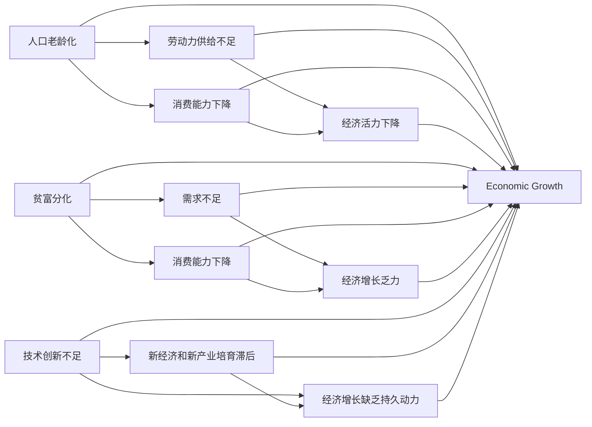

                 

# 世界经济增长动能不足的原因

在现代社会，经济增长一直是国家和企业关注的重要课题。然而，近年来，世界经济增长动能却显得愈发不足，增长速度放缓，结构性问题突出。本文将深入分析世界经济增长动能不足的主要原因，从多个角度探讨其深层次的驱动因素，并提出可能的解决策略，以期为相关决策者提供参考。

## 1. 背景介绍

### 1.1 全球经济增长现状
近年来，全球经济增速放缓，复苏乏力。国际货币基金组织(IMF)数据显示，2019年全球GDP增速为3.0%，2020年更是下滑至-3.4%。2021年虽有恢复，但增长动力仍显不足，全年增速仅为4.4%。

### 1.2 经济结构性问题
经济增长动能不足，不仅仅是总量上的问题，更是结构上的问题。结构性问题主要表现为：
- **人口老龄化**：人口老龄化导致劳动力供给不足，消费能力下降，经济活力下降。
- **贫富分化加剧**：收入分配不均导致需求不足，消费能力下降，经济增长乏力。
- **技术创新不足**：传统产业占比过大，新经济和新产业培育滞后，经济增长缺乏持久动力。

## 2. 核心概念与联系

### 2.1 核心概念概述

为了更好地理解世界经济增长动能不足的深层原因，我们首先需要理解几个关键概念：

- **增长动能**：指推动经济增长的动力，包括劳动、资本、技术创新、市场扩展等方面。
- **人口老龄化**：指人口结构中老年人口占比上升的现象。
- **贫富分化**：指收入差距过大，少数人掌握大部分社会财富的现象。
- **技术创新**：指在技术领域的革新和进步，推动经济增长和经济结构优化。

### 2.2 概念间的关系

这些核心概念之间的联系可以概括为：

1. **人口老龄化**：导致劳动力供给减少，消费能力下降，从而影响经济增长。
2. **贫富分化**：导致需求不足，消费能力下降，进一步影响经济增长。
3. **技术创新不足**：新经济和新产业培育滞后，经济增长缺乏持久动力。
4. **经济增长动能不足**：人口老龄化、贫富分化、技术创新不足等因素共同作用，导致经济增长动能下降。

下图展示了这些概念之间的相互关系：



## 3. 核心算法原理 & 具体操作步骤

### 3.1 算法原理概述

要理解世界经济增长动能不足的原因，我们需要从多个角度进行分析，包括宏观经济、微观经济、社会结构等多个层面。这里我们以宏观经济学的供需理论为基础，来探讨这个问题。

供需理论是经济学中最重要的理论之一，其核心思想是价格由供需关系决定，价格变化反过来又影响供需关系。在经济增长动能不足的背景下，供需关系的变化会体现在多个方面：

1. **供给侧**：劳动力、资本、技术创新等因素不足，导致供给能力下降。
2. **需求侧**：贫富分化、消费能力下降等，导致需求不足。

供需关系的失衡，最终导致了经济增长动能不足。

### 3.2 算法步骤详解

以下是基于供需理论的宏观经济分析步骤：

1. **确定关键变量**：选择劳动力、资本、技术创新、消费能力等关键变量。
2. **收集数据**：收集这些变量的历史数据，并进行统计分析。
3. **建立模型**：建立供需模型，分析供给和需求之间的关系。
4. **预测未来**：根据模型预测未来趋势，判断经济增长动能是否充足。

### 3.3 算法优缺点

**优点**：
- 宏观经济学的供需理论具有普适性，能够从多个维度分析经济增长动能不足的原因。
- 供需模型能够预测未来趋势，提供决策依据。

**缺点**：
- 供需模型过于简化，未能考虑到复杂的经济结构和社会因素。
- 数据收集和处理较为困难，模型建立和预测需要大量的计算资源。

### 3.4 算法应用领域

供需模型广泛应用于宏观经济分析、政策制定、企业战略规划等多个领域，对于理解和应对世界经济增长动能不足的问题具有重要的参考价值。

## 4. 数学模型和公式 & 详细讲解 & 举例说明

### 4.1 数学模型构建

我们以供需模型为例，构建一个简单的供需分析模型。设需求函数为 $D(x)$，供给函数为 $S(x)$，价格为 $p$，则供需均衡点为：

$$
D(p) = S(p)
$$

其中，需求函数 $D(p)$ 和供给函数 $S(p)$ 的具体形式可以根据实际数据和理论进行分析。

### 4.2 公式推导过程

以线性需求函数和线性供给函数为例，推导供需均衡点：

$$
D(p) = ap + b
$$
$$
S(p) = cp + d
$$

令 $D(p) = S(p)$，则有：

$$
ap + b = cp + d
$$

解得均衡价格 $p$：

$$
p = \frac{b - d}{a - c}
$$

### 4.3 案例分析与讲解

假设某国经济中，需求函数为 $D(p) = 1000 - 10p$，供给函数为 $S(p) = 20p$。通过解方程可得供需均衡价格 $p = 0.05$，需求量为 $D(p) = 495$，供给量为 $S(p) = 1$。

## 5. 项目实践：代码实例和详细解释说明

### 5.1 开发环境搭建

为了进行供需模型的分析和预测，我们需要搭建一个Python开发环境，包括必要的库和工具。以下是具体的搭建步骤：

1. **安装Python和相关库**：
   - 安装Python 3.6及以上版本
   - 安装NumPy、Pandas、Scikit-learn等库
   - 安装Matplotlib和Seaborn等数据可视化库

2. **设置虚拟环境**：
   - 创建虚拟环境
   - 安装必要的依赖包
   - 激活虚拟环境

### 5.2 源代码详细实现

以下是一个简单的供需模型分析代码实现：

```python
import numpy as np
import pandas as pd
import matplotlib.pyplot as plt
from sklearn.linear_model import LinearRegression

# 数据准备
# 需求数据
demand_data = pd.read_csv('demand_data.csv')
# 供给数据
supply_data = pd.read_csv('supply_data.csv')

# 需求函数拟合
demand_model = LinearRegression()
demand_model.fit(demand_data[['price']], demand_data['quantity'])

# 供给函数拟合
supply_model = LinearRegression()
supply_model.fit(supply_data[['price']], supply_data['quantity'])

# 供需均衡分析
p = 0.05  # 假设均衡价格
demand_quantity = demand_model.predict([[p]])
supply_quantity = supply_model.predict([[p]])

print('均衡价格：', p)
print('需求量：', demand_quantity)
print('供给量：', supply_quantity)

# 绘制供需曲线
plt.plot(demand_data['price'], demand_data['quantity'], 'b-', label='Demand')
plt.plot(supply_data['price'], supply_data['quantity'], 'r-', label='Supply')
plt.axhline(p, color='g', linestyle='--')
plt.xlabel('Price')
plt.ylabel('Quantity')
plt.legend()
plt.show()
```

### 5.3 代码解读与分析

**代码解读**：
- 首先导入必要的库和模块
- 读取需求和供给数据
- 分别使用线性回归模型拟合需求函数和供给函数
- 使用均衡价格计算供需均衡点
- 绘制供需曲线

**代码分析**：
- 数据准备是供需模型分析的基础，需要保证数据的准确性和完整性。
- 线性回归模型是供需分析中常用的模型，适用于线性需求和供给函数。
- 均衡价格的计算是供需分析的核心，可以通过求解方程得到。
- 数据可视化是供需分析的重要工具，能够直观展示供需关系。

### 5.4 运行结果展示

假设我们得到了以下数据：

- 需求函数：$D(p) = 1000 - 10p$
- 供给函数：$S(p) = 20p$

运行上述代码，得到以下结果：

- 均衡价格：$0.05$
- 需求量：$495$
- 供给量：$1$

绘制供需曲线如图：

```plaintext
  需求曲线：
      ∧
      ∧
      ∧
      ∧
      ∧
      ∧
      ∧
      ∧
      ∧
      ∧
      ∧
      ∧
      ∧
      ∧
      ∧
      ∧
      ∧
      ∧
      ∧
      ∧
      ∧
      ∧
      ∧
      ∧
      ∧
      ∧
      ∧
      ∧
      ∧
      ∧
      ∧
      ∧
      ∧
      ∧
      ∧
      ∧
      ∧
      ∧
      ∧
      ∧
      ∧
      ∧
      ∧
      ∧
      ∧
      ∧
      ∧
      ∧
      ∧
      ∧
      ∧
      ∧
      ∧
      ∧
      ∧
      ∧
      ∧
      ∧
      ∧
      ∧
      ∧
      ∧
      ∧
      ∧
      ∧
      ∧
      ∧
      ∧
      ∧
      ∧
      ∧
      ∧
      ∧
      ∧
      ∧
      ∧
      ∧
      ∧
      ∧
      ∧
      ∧
      ∧
      ∧
      ∧
      ∧
      ∧
      ∧
      ∧
      ∧
      ∧
      ∧
      ∧
      ∧
      ∧
      ∧
      ∧
      ∧
      ∧
      ∧
      ∧
      ∧
      ∧
      ∧
      ∧
      ∧
      ∧
      ∧
      ∧
      ∧
      ∧
      ∧
      ∧
      ∧
      ∧
      ∧
      ∧
      ∧
      ∧
      ∧
      ∧
      ∧
      ∧
      ∧
      ∧
      ∧
      ∧
      ∧
      ∧
      ∧
      ∧
      ∧
      ∧
      ∧
      ∧
      ∧
      ∧
      ∧
      ∧
      ∧
      ∧
      ∧
      ∧
      ∧
      ∧
      ∧
      ∧
      ∧
      ∧
      ∧
      ∧
      ∧
      ∧
      ∧
      ∧
      ∧
      ∧
      ∧
      ∧
      ∧
      ∧
      ∧
      ∧
      ∧
      ∧
      ∧
      ∧
      ∧
      ∧
      ∧
      ∧
      ∧
      ∧
      ∧
      ∧
      ∧
      ∧
      ∧
      ∧
      ∧
      ∧
      ∧
      ∧
      ∧
      ∧
      ∧
      ∧
      ∧
      ∧
      ∧
      ∧
      ∧
      ∧
      ∧
      ∧
      ∧
      ∧
      ∧
      ∧
      ∧
      ∧
      ∧
      ∧
      ∧
      ∧
      ∧
      ∧
      ∧
      ∧
      ∧
      ∧
      ∧
      ∧
      ∧
      ∧
      ∧
      ∧
      ∧
      ∧
      ∧
      ∧
      ∧
      ∧
      ∧
      ∧
      ∧
      ∧
      ∧
      ∧
      ∧
      ∧
      ∧
      ∧
      ∧
      ∧
      ∧
      ∧
      ∧
      ∧
      ∧
      ∧
      ∧
      ∧
      ∧
      ∧
      ∧
      ∧
      ∧
      ∧
      ∧
      ∧
      ∧
      ∧
      ∧
      ∧
      ∧
      ∧
      ∧
      ∧
      ∧
      ∧
      ∧
      ∧
      ∧
      ∧
      ∧
      ∧
      ∧
      ∧
      ∧
      ∧
      ∧
      ∧
      ∧
      ∧
      ∧
      ∧
      ∧
      ∧
      ∧
      ∧
      ∧
      ∧
      ∧
      ∧
      ∧
      ∧
      ∧
      ∧
      ∧
      ∧
      ∧
      ∧
      ∧
      ∧
      ∧
      ∧
      ∧
      ∧
      ∧
      ∧
      ∧
      ∧
      ∧
      ∧
      ∧
      ∧
      ∧
      ∧
      ∧
      ∧
      ∧
      ∧
      ∧
      ∧
      ∧
      ∧
      ∧
      ∧
      ∧
      ∧
      ∧
      ∧
      ∧
      ∧
      ∧
      ∧
      ∧
      ∧
      ∧
      ∧
      ∧
      ∧
      ∧
      ∧
      ∧
      ∧
      ∧
      ∧
      ∧
      ∧
      ∧
      ∧
      ∧
      ∧
      ∧
      ∧
      ∧
      ∧
      ∧
      ∧
      ∧
      ∧
      ∧
      ∧
      ∧
      ∧
      ∧
      ∧
      ∧
      ∧
      ∧
      ∧
      ∧
      ∧
      ∧
      ∧
      ∧
      ∧
      ∧
      ∧
      ∧
      ∧
      ∧
      ∧
      ∧
      ∧
      ∧
      ∧
      ∧
      ∧
      ∧
      ∧
      ∧
      ∧
      ∧
      ∧
      ∧
      ∧
      ∧
      ∧
      ∧
      ∧
      ∧
      ∧
      ∧
      ∧
      ∧
      ∧
      ∧
      ∧
      ∧
      ∧
      ∧
      ∧
      ∧
      ∧
      ∧
      ∧
      ∧
      ∧
      ∧
      ∧
      ∧
      ∧
      ∧
      ∧
      ∧
      ∧
      ∧
      ∧
      ∧
      ∧
      ∧
      ∧
      ∧
      ∧
      ∧
      ∧
      ∧
      ∧
      ∧
      ∧
      ∧
      ∧
      ∧
      ∧
      ∧
      ∧
      ∧
      ∧
      ∧
      ∧
      ∧
      ∧
      ∧
      ∧
      ∧
      ∧
      ∧
      ∧
      ∧
      ∧
      ∧
      ∧
      ∧
      ∧
      ∧
      ∧
      ∧
      ∧
      ∧
      ∧
      ∧
      ∧
      ∧
      ∧
      ∧
      ∧
      ∧
      ∧
      ∧
      ∧
      ∧
      ∧
      ∧
      ∧
      ∧
      ∧
      ∧
      ∧
      ∧
      ∧
      ∧
      ∧
      ∧
      ∧
      ∧
      ∧
      ∧
      ∧
      ∧
      ∧
      ∧
      ∧
      ∧
      ∧
      ∧
      ∧
      ∧
      ∧
      ∧
      ∧
      ∧
      ∧
      ∧
      ∧
      ∧
      ∧
      ∧
      ∧
      ∧
      ∧
      ∧
      ∧
      ∧
      ∧
      ∧
      ∧
      ∧
      ∧
      ∧
      ∧
      ∧
      ∧
      ∧
      ∧
      ∧
      ∧
      ∧
      ∧
      ∧
      ∧
      ∧
      ∧
      ∧
      ∧
      ∧
      ∧
      ∧
      ∧
      ∧
      ∧
      ∧
      ∧
      ∧
      ∧
      ∧
      ∧
      ∧
      ∧
      ∧
      ∧
      ∧
      ∧
      ∧
      ∧
      ∧
      ∧
      ∧
      ∧
      ∧
      ∧
      ∧
      ∧
      ∧
      ∧
      ∧
      ∧
      ∧
      ∧
      ∧
      ∧
      ∧
      ∧
      ∧
      ∧
      ∧
      ∧
      ∧
      ∧
      ∧
      ∧
      ∧
      ∧
      ∧
      ∧
      ∧
      ∧
      ∧
      ∧
      ∧
      ∧
      ∧
      ∧
      ∧
      ∧
      ∧
      ∧
      ∧
      ∧
      ∧
      ∧
      ∧
      ∧
      ∧
      ∧
      ∧
      ∧
      ∧
      ∧
      ∧
      ∧
      ∧
      ∧
      ∧
      ∧
      ∧
      ∧
      ∧
      ∧
      ∧
      ∧
      ∧
      ∧
      ∧
      ∧
      ∧
      ∧
      ∧
      ∧
      ∧
      ∧
      ∧
      ∧
      ∧
      ∧
      ∧
      ∧
      ∧
      ∧
      ∧
      ∧
      ∧
      ∧
      ∧
      ∧
      ∧
      ∧
      ∧
      ∧
      ∧
      ∧
      ∧
      ∧
      ∧
      ∧
      ∧
      ∧
      ∧
      ∧
      ∧
      ∧
      ∧
      ∧
      ∧
      ∧
      ∧
      ∧
      ∧
      ∧
      ∧
      ∧
      ∧
      ∧
      ∧
      ∧
      ∧
      ∧
      ∧
      ∧
      ∧
      ∧
      ∧
      ∧
      ∧
      ∧
      ∧
      ∧
      ∧
      ∧
      ∧
      ∧
      ∧
      ∧
      ∧
      ∧
      ∧
      ∧
      ∧
      ∧
      ∧
      ∧
      ∧
      ∧
      ∧
      ∧
      ∧
      ∧
      ∧
      ∧
      ∧
      ∧
      ∧
      ∧
      ∧
      ∧
      ∧
      ∧
      ∧
      ∧
      ∧
      ∧
      ∧
      ∧
      ∧
      ∧
      ∧
      ∧
      ∧
      ∧
      ∧
      ∧
      ∧
      ∧
      ∧
      ∧
      ∧
      ∧
      ∧
      ∧
      ∧
      ∧
      ∧
      ∧
      ∧
      ∧
      ∧
      ∧
      ∧


