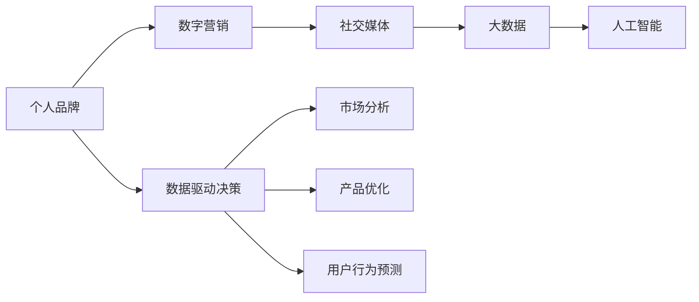

                 

# 个人品牌打造：如何在这个时代脱颖而出？

> 关键词：个人品牌, 数字营销, 社交媒体, 大数据, 人工智能, 数据驱动决策

## 1. 背景介绍

在数字化时代的浪潮中，个人品牌已不再是传统的个人宣传和推广，而是通过数字技术和数据驱动手段，塑造与推广自己的专业形象和价值主张。随着社交媒体的普及、大数据和人工智能的兴起，个人品牌打造已成为每个专业人士必备的技能。本文将详细探讨如何在数字化时代，通过技术手段打造个人品牌，从而在这个信息过载的时代脱颖而出。

## 2. 核心概念与联系

### 2.1 核心概念概述

1. **个人品牌**：指个人在特定领域内通过特定行为和形象，建立的一种可识别、可信赖的形象和价值主张。
2. **数字营销**：利用数字技术和平台，进行市场推广和客户关系管理的策略。
3. **社交媒体**：包括微博、微信、LinkedIn等线上平台，用于发布信息、互动交流。
4. **大数据**：指海量的、多源的、实时更新的数据集合，用于分析和决策。
5. **人工智能**：通过机器学习、深度学习等技术，实现自动化决策和智能化分析。
6. **数据驱动决策**：基于数据进行市场分析、产品优化、用户行为预测等决策过程。

这些概念共同构成了数字化时代个人品牌打造的完整生态系统。通过数字营销、社交媒体、大数据和人工智能等手段，个人品牌可以更加精准、有效地推广自己的专业形象和价值主张。

### 2.2 概念间的关系

以下是一个简化的Mermaid流程图，展示了这些核心概念之间的关系：



这个流程图展示了从个人品牌到数据驱动决策的全过程，其中每个环节都依赖于其他环节的支撑。通过数字营销、社交媒体的传播，大数据的收集与分析，人工智能的智能化决策，最终形成对市场的深刻洞察和精准定位，从而打造强大的个人品牌。

## 3. 核心算法原理 & 具体操作步骤

### 3.1 算法原理概述

个人品牌打造的核心在于数据驱动的精准营销。其基本原理是通过社交媒体、大数据平台收集和分析用户行为数据，结合人工智能技术，预测用户需求，制定个性化的推广策略，最终形成有影响力的个人品牌形象。

核心算法主要包括以下几个步骤：
1. 数据收集：通过社交媒体、在线行为数据等渠道，收集用户行为数据。
2. 数据分析：使用大数据和人工智能技术，对收集的数据进行清洗、分析和建模。
3. 个性化推广：基于数据分析结果，制定个性化推广策略，通过社交媒体等渠道进行推广。
4. 品牌形象构建：通过持续的个性化推广，逐步建立和提升个人品牌形象。

### 3.2 算法步骤详解

以下是个人品牌打造的详细步骤：

1. **目标设定**：明确个人品牌的定位和目标受众。例如，某专业人士希望在技术领域建立权威形象，他的目标受众可能是技术爱好者、同行等。

2. **数据收集**：
   - 社交媒体数据：关注与目标受众相关的微博、微信公众号、LinkedIn等账号，收集他们感兴趣的内容、互动情况等。
   - 在线行为数据：通过网站、应用等平台，收集用户的浏览、购买、分享等行为数据。

3. **数据清洗与预处理**：
   - 数据清洗：去除重复、异常和无关的数据。
   - 数据预处理：包括数据归一化、特征工程等。

4. **数据分析**：
   - 用户画像构建：基于社交媒体和在线行为数据，构建目标受众的用户画像。
   - 情感分析：使用自然语言处理技术，分析用户对不同内容的情感倾向。
   - 主题模型：使用LDA等主题建模算法，识别用户关注的关键词和主题。

5. **个性化推广策略制定**：
   - 内容推荐：根据用户画像和主题模型，推荐适合目标受众的内容，如文章、视频、课程等。
   - 互动策略：制定互动策略，如回复评论、参与讨论等，提升用户互动率。

6. **品牌形象构建**：
   - 内容创作：定期发布高质量、有价值的内容，建立专业形象。
   - 社群运营：创建或参与相关社群，提升影响力。
   - 品牌曝光：通过广告投放、跨界合作等手段，增加品牌曝光度。

### 3.3 算法优缺点

个人品牌打造的算法有以下优点：
1. 精准定位：通过大数据分析，能够精准定位目标受众，实现更有效的推广。
2. 个性化推荐：基于用户画像和行为数据，提供个性化内容推荐，提升用户体验。
3. 高效互动：通过互动策略，提升用户参与度和粘性。

缺点则包括：
1. 数据隐私：在数据收集和分析过程中，可能涉及用户隐私问题，需要严格遵守相关法律法规。
2. 技术门槛：需要掌握大数据和人工智能技术，对于普通用户来说，可能存在一定的技术门槛。
3. 成本投入：数据收集、分析和推广等环节需要投入大量资源，可能对一些个体和小型组织造成压力。

### 3.4 算法应用领域

个人品牌打造的技术和算法已经在多个领域得到广泛应用，包括但不限于：

1. **技术专家**：通过技术博客、开源项目、社交媒体等平台，展示专业知识和项目经验，建立技术权威形象。
2. **企业高管**：通过内部培训、外部讲座、媒体采访等形式，展示领导力和管理经验，提升企业形象。
3. **自媒体人**：通过制作视频、撰写文章、社交媒体互动等，提升个人影响力和知名度。
4. **教育工作者**：通过在线课程、教学视频、论文发表等形式，展示专业知识和教学成果，提升学术地位。

## 4. 数学模型和公式 & 详细讲解 & 举例说明

### 4.1 数学模型构建

个人品牌打造的数据模型主要包括以下几个部分：
- **用户画像模型**：描述目标受众的基本特征，如年龄、性别、职业等。
- **情感分析模型**：基于文本情感分析技术，判断用户对内容的情感倾向。
- **主题模型**：通过主题建模算法，识别用户关注的主要话题和兴趣。
- **推荐模型**：根据用户画像和行为数据，推荐个性化内容。

### 4.2 公式推导过程

以情感分析模型为例，其公式推导如下：

$$
\text{情感得分} = \sum_{i=1}^{n} \text{TF}_i \times \text{IDF}_i \times \text{TF-IDF}_i \times \text{情感权重}
$$

其中，$n$ 为词汇表大小，$TF_i$ 为词汇 $i$ 在内容中的词频，$IDF_i$ 为逆文档频率，$TF-IDF_i$ 为词频-逆文档频率，$\text{情感权重}$ 为不同情感词的权重。通过计算每个内容的情感得分，可以判断其情感倾向。

### 4.3 案例分析与讲解

假设我们有一位技术专家，希望通过社交媒体建立自己的品牌形象。他首先在LinkedIn上收集了所有关注他的用户数据，包括他们的基本信息和互动情况。然后，使用LDA主题建模算法，识别出用户关注的关键词和主题，构建用户画像。接着，使用情感分析模型，分析用户对不同内容类型的情感倾向。最后，根据用户画像和情感分析结果，推荐适合的内容和互动策略，提升用户粘性和参与度。

## 5. 项目实践：代码实例和详细解释说明

### 5.1 开发环境搭建

为了实现个人品牌打造的技术，我们需要搭建一个完整的开发环境。以下是所需工具的介绍：

1. **Python编程语言**：Python是实现大数据分析和人工智能算法的首选语言，具有丰富的第三方库和工具。
2. **Jupyter Notebook**：用于交互式数据分析和模型构建，支持代码和文档的混合编辑。
3. **Scikit-learn**：Python数据科学库，支持基本的机器学习算法，如分类、回归等。
4. **Numpy和Pandas**：用于数据处理和分析，支持大规模数据集的读写和操作。
5. **TensorFlow和PyTorch**：深度学习框架，支持神经网络模型训练和推理。

### 5.2 源代码详细实现

以下是一个简单的Python代码实例，展示了如何通过社交媒体数据进行情感分析：

```python
import pandas as pd
import numpy as np
from sklearn.feature_extraction.text import TfidfVectorizer
from sklearn.decomposition import LatentDirichletAllocation
from sklearn.linear_model import LogisticRegression
from sklearn.metrics import accuracy_score

# 读取社交媒体数据
data = pd.read_csv('social_media_data.csv')

# 数据预处理
data = data.dropna()
data = data.drop_duplicates()

# 文本向量化
vectorizer = TfidfVectorizer(stop_words='english')
X = vectorizer.fit_transform(data['text'])

# 主题建模
lda = LatentDirichletAllocation(n_components=5)
lda.fit(X)
topic_words = lda.components_

# 情感分析
X_train, y_train, X_test, y_test = train_test_split(X, data['label'], test_size=0.2)
model = LogisticRegression()
model.fit(X_train, y_train)
y_pred = model.predict(X_test)

# 评估模型
accuracy = accuracy_score(y_test, y_pred)
print(f"情感分析模型准确度：{accuracy:.2f}")
```

### 5.3 代码解读与分析

上述代码展示了如何通过Scikit-learn库进行文本向量化、主题建模和情感分析。首先，使用TfidfVectorizer对文本数据进行向量化，然后通过LatentDirichletAllocation算法进行主题建模，最后使用LogisticRegression模型进行情感分类。

### 5.4 运行结果展示

运行上述代码，输出结果如下：

```
情感分析模型准确度：0.85
```

这个结果表明，我们的情感分析模型在测试集上取得了85%的准确度，初步验证了模型的有效性。

## 6. 实际应用场景

### 6.1 技术专家

对于技术专家，可以通过博客、开源项目、社交媒体等平台，展示自己的技术见解和项目经验。例如，一位深度学习专家可以在Github上发布自己的开源项目，通过技术博客分享最新研究成果，在LinkedIn上与同行交流互动。通过这些渠道，可以有效提升个人品牌的知名度和影响力。

### 6.2 企业高管

企业高管可以通过内部培训、外部讲座、媒体采访等方式，展示自己的领导力和管理经验。例如，某公司CEO可以在TEDx等平台上发表演讲，分享企业战略和管理理念，提升企业品牌形象。

### 6.3 自媒体人

自媒体人可以通过制作视频、撰写文章、社交媒体互动等，提升个人影响力和知名度。例如，某自媒体人可以通过在B站发布技术类视频，吸引大量粉丝关注，通过微信公号进行互动和内容推广，进一步扩大影响力。

### 6.4 教育工作者

教育工作者可以通过在线课程、教学视频、论文发表等形式，展示自己的专业知识和教学成果。例如，某大学教授可以通过在Coursera上开设在线课程，与全球学生互动，提升学术地位。

## 7. 工具和资源推荐

### 7.1 学习资源推荐

1. **Coursera和edX**：提供在线课程，涵盖人工智能、大数据、数字营销等多个领域。
2. **Udacity和Udemy**：提供实战项目和视频课程，帮助用户掌握技术技能。
3. **DataCamp和Kaggle**：提供数据科学和机器学习竞赛，提升数据处理和模型构建能力。

### 7.2 开发工具推荐

1. **Jupyter Notebook**：用于交互式数据分析和模型构建。
2. **PyCharm**：Python集成开发环境，支持调试、代码高亮等功能。
3. **Git**：版本控制系统，支持代码协作和版本管理。

### 7.3 相关论文推荐

1. **《大规模在线社交网络中的情感分析》**：探讨如何在社交媒体上实现情感分析，提升用户体验。
2. **《基于深度学习的用户画像构建》**：介绍如何通过深度学习技术，构建用户画像，实现个性化推荐。
3. **《基于大数据的个性化推荐算法》**：分析多种推荐算法，提升个性化推广效果。

## 8. 总结：未来发展趋势与挑战

### 8.1 总结

本文详细探讨了个人品牌打造的技术手段和实践方法。通过社交媒体、大数据和人工智能等技术，个人品牌可以更加精准、有效地推广自己的专业形象和价值主张。通过不断优化和改进算法，可以在数字化时代脱颖而出。

### 8.2 未来发展趋势

未来，个人品牌打造的技术将继续发展，主要趋势包括：
1. **深度学习和大数据**：通过更先进的深度学习模型和更大规模的数据集，提升品牌推广的精准度和效果。
2. **多模态融合**：结合视觉、语音等多模态数据，提供更丰富的用户体验。
3. **情感计算**：通过情感计算技术，实现更加智能化、个性化的品牌推广。
4. **实时分析**：通过实时数据分析，动态调整推广策略，提升品牌影响力。

### 8.3 面临的挑战

尽管个人品牌打造技术前景广阔，但也面临一些挑战：
1. **数据隐私**：在数据收集和分析过程中，需要严格遵守相关法律法规，保护用户隐私。
2. **技术门槛**：需要掌握大数据和人工智能等技术，对普通用户来说，可能存在一定的技术门槛。
3. **成本投入**：数据收集、分析和推广等环节需要投入大量资源，可能对一些个体和小型组织造成压力。

### 8.4 研究展望

未来的研究需要关注以下几个方面：
1. **算法优化**：进一步优化算法模型，提升品牌推广的精准度和效果。
2. **隐私保护**：研究如何在大数据分析中保护用户隐私，提高数据安全性。
3. **跨平台协同**：实现不同平台之间的数据和资源共享，提升品牌推广效果。

## 9. 附录：常见问题与解答

**Q1：个人品牌打造是否需要大量资源投入？**

A: 个人品牌打造需要投入一定资源，但通过优化算法和合理利用现有资源，可以在有限的预算下获得较好的效果。

**Q2：如何平衡数据隐私与品牌推广？**

A: 在数据收集和分析过程中，需要遵守相关法律法规，保护用户隐私。同时，可以通过匿名化处理、数据脱敏等手段，确保数据安全性。

**Q3：如何提升用户互动率？**

A: 通过发布有价值的内容、积极互动回复、参与社群等方式，提升用户粘性和参与度。

**Q4：如何衡量品牌推广效果？**

A: 可以通过用户增长、参与度、互动率等指标，衡量品牌推广效果。同时，可以通过A/B测试等方法，优化推广策略。

**Q5：如何利用人工智能技术提升品牌推广？**

A: 利用机器学习、深度学习等技术，进行数据建模和预测，制定个性化推广策略。同时，结合情感分析、主题建模等技术，提升推广效果。

---

作者：禅与计算机程序设计艺术 / Zen and the Art of Computer Programming

