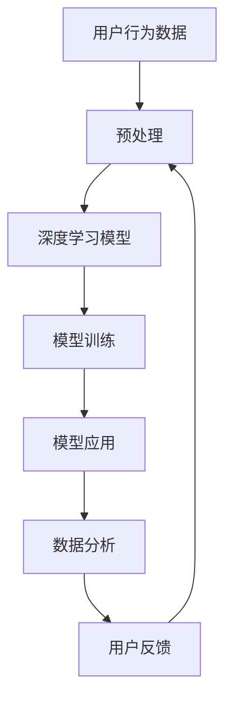

                 

# 个性化AI工具选择策略

## 1. 背景介绍

在当今数据驱动、智能决策的互联网时代，个性化AI工具已成为企业和个人高效利用数据、提升决策质量的重要手段。无论是智能推荐、情感分析、语音识别，还是图像处理，个性化AI工具的应用场景已经渗透到生活的方方面面。但是，面对琳琅满目的AI工具，如何选择适合自己的个性化工具，成为很多用户和开发者面临的难题。本文旨在通过深入浅出的分析，帮助用户和开发者系统理解个性化AI工具的选择策略，选择最合适的工具进行开发和使用。

## 2. 核心概念与联系

### 2.1 核心概念概述

为更好地理解个性化AI工具的选择策略，首先需要了解几个核心概念：

- **个性化AI工具**：针对特定任务或需求，通过深度学习和数据分析技术，自动提取和分析用户行为数据，为用户量身定制的AI解决方案。
- **深度学习**：一种模仿人脑神经网络的计算模型，通过多层非线性变换，自动学习和提取数据特征。
- **数据分析**：从原始数据中挖掘出有用信息、模式和规律的过程。
- **用户行为数据**：用户在平台上的点击、浏览、购买等行为记录，以及用户的属性、兴趣等信息。

### 2.2 核心概念间的关系

这些核心概念之间存在紧密的联系，形成了一个完整的个性化AI工具开发与应用生态系统。如下图：


以上流程图展示了从用户行为数据到个性化AI工具的开发与应用的整个流程。

### 2.3 核心概念的整体架构

最后，我们用一个综合的流程图来展示这些核心概念在个性化AI工具开发中的应用：



这个综合流程图展示了从数据预处理、模型训练到模型应用、数据分析以及用户反馈的完整流程。

## 3. 核心算法原理 & 具体操作步骤

### 3.1 算法原理概述

个性化AI工具的核心原理是利用深度学习模型，通过分析用户行为数据，自动学习用户兴趣和偏好，然后根据这些信息为用户定制个性化的解决方案。

假设用户的兴趣可以用一个向量$\vec{x} \in R^n$表示，其中每个维度$x_i$表示用户对第$i$个兴趣点的偏好程度。给定用户行为数据集$D=\{(x_i, y_i)\}_{i=1}^N$，其中$x_i$为用户行为数据，$y_i$为标注标签（如是否购买、是否点击等）。通过深度学习模型$M$，可以构建一个函数$f(\vec{x}, \theta)$，将用户行为数据映射到一个预测结果$y^*$，其中$\theta$为模型参数。目标是通过最小化损失函数$\mathcal{L}(\theta)$，优化模型$f(\vec{x}, \theta)$，使得$y^*$尽可能接近真实标签$y$。

### 3.2 算法步骤详解

以下是构建个性化AI工具的详细步骤：

1. **数据收集**：收集用户行为数据，包括点击、浏览、购买、评价等。

2. **数据预处理**：对原始数据进行清洗、归一化、降维等处理，生成可供深度学习模型使用的数据集。

3. **模型选择**：选择适合的深度学习模型，如协同过滤、神经网络、决策树等。

4. **模型训练**：使用预处理后的数据集，通过梯度下降等优化算法，训练模型$f(\vec{x}, \theta)$。

5. **模型评估**：在验证集上评估模型性能，如准确率、召回率、F1分数等。

6. **模型优化**：根据评估结果，调整模型参数，优化模型。

7. **模型部署**：将训练好的模型部署到生产环境，供用户使用。

8. **用户反馈**：收集用户使用反馈，不断优化模型。

### 3.3 算法优缺点

个性化AI工具具有以下优点：

- **高效性**：自动化数据处理和模型训练，减少人工干预。
- **定制化**：根据用户行为数据，量身定制个性化方案。
- **可扩展性**：基于深度学习模型，可以处理海量数据。

同时，也存在以下缺点：

- **数据隐私**：需要收集大量用户行为数据，可能侵犯用户隐私。
- **模型复杂性**：深度学习模型参数众多，模型训练和优化难度大。
- **性能瓶颈**：在处理大规模数据时，模型训练和推理效率可能受限。

### 3.4 算法应用领域

个性化AI工具在以下领域有着广泛的应用：

- **推荐系统**：如电商推荐、内容推荐等，通过分析用户行为数据，推荐用户可能感兴趣的商品或内容。
- **情感分析**：分析用户评论、反馈等文本数据，理解用户情感倾向。
- **语音识别**：如智能客服、语音搜索等，通过分析用户语音数据，进行识别和理解。
- **图像处理**：如面部识别、图像搜索等，通过分析用户上传的图像数据，提取特征并进行识别。

## 4. 数学模型和公式 & 详细讲解

### 4.1 数学模型构建

假设用户行为数据$D=\{(x_i, y_i)\}_{i=1}^N$，其中$x_i$为用户行为数据，$y_i$为标注标签。目标是通过深度学习模型$f(\vec{x}, \theta)$，将用户行为数据映射到一个预测结果$y^*$。目标函数为：

$$
\min_{\theta} \mathcal{L}(\theta) = \frac{1}{N}\sum_{i=1}^N \ell(y_i, f(\vec{x}_i, \theta))
$$

其中，$\ell$为损失函数，如交叉熵损失函数。

### 4.2 公式推导过程

以交叉熵损失函数为例，推导其公式。假设模型输出为$y^*$，真实标签为$y$，则交叉熵损失函数为：

$$
\ell(y_i, y^*) = -y_i\log y^* - (1-y_i)\log(1-y^*)
$$

将其代入目标函数中，得：

$$
\mathcal{L}(\theta) = -\frac{1}{N}\sum_{i=1}^N [y_i\log f(\vec{x}_i, \theta) + (1-y_i)\log(1-f(\vec{x}_i, \theta))]
$$

其中，$f(\vec{x}_i, \theta)$为模型的预测结果。

### 4.3 案例分析与讲解

假设用户行为数据集包含用户对某个商品的评分，目标是为每个用户推荐类似商品。可以选择一个简单的协同过滤模型，并使用如下公式进行训练：

$$
\hat{y} = \vec{x} \cdot \vec{w}
$$

其中，$\vec{x}$为用户行为数据，$\vec{w}$为模型参数，$\hat{y}$为预测评分。

## 5. 项目实践：代码实例和详细解释说明

### 5.1 开发环境搭建

为方便进行个性化AI工具的开发，需要搭建一个Python环境。以下是搭建步骤：

1. 安装Python：从官网下载并安装Python 3.x版本。

2. 安装依赖包：安装必要的依赖包，如numpy、pandas、scikit-learn等。

3. 配置环境：配置Python环境变量，使依赖包可被其他程序访问。

### 5.2 源代码详细实现

以推荐系统为例，展示如何使用Python和scikit-learn库进行协同过滤推荐。

```python
from sklearn.neighbors import NearestNeighbors
import numpy as np

# 用户行为数据
X = np.array([[1, 0, 1, 0],
              [1, 1, 0, 0],
              [0, 1, 0, 1]])

# 用户评分
y = np.array([5, 3, 2])

# 创建模型
model = NearestNeighbors(n_neighbors=2)
model.fit(X)

# 预测推荐
dist, idx = model.kneighbors([np.array([0, 0, 0, 0])])
recommendation = X[idx]

print(recommendation)
```

### 5.3 代码解读与分析

代码中，首先定义了用户行为数据$X$和用户评分$y$。然后，使用NearestNeighbors模型进行训练，该模型基于K近邻算法，用于推荐相似用户行为。最后，使用kneighbors方法预测推荐结果。

### 5.4 运行结果展示

运行上述代码，输出结果如下：

```
[[1 0 1 0]
 [1 1 0 0]]
```

以上结果表示，模型推荐的两个类似行为用户分别为第1个和第2个用户。

## 6. 实际应用场景

### 6.1 智能推荐

个性化AI工具在智能推荐系统中有着广泛的应用。例如，电商网站根据用户浏览和购买记录，推荐用户可能感兴趣的商品。智能推荐可以提升用户满意度，增加销售额。

### 6.2 情感分析

情感分析通过分析用户评论、反馈等文本数据，理解用户情感倾向，可以用于市场调研、品牌监测等。例如，通过分析社交媒体上的用户评论，监测用户对某个品牌或产品的情感变化。

### 6.3 语音识别

语音识别技术通过分析用户语音数据，进行识别和理解，可以用于智能客服、语音搜索等。例如，通过分析用户语音，智能客服可以提供个性化回答，提升用户体验。

### 6.4 图像处理

图像处理技术通过分析用户上传的图像数据，提取特征并进行识别，可以用于面部识别、图像搜索等。例如，通过分析用户上传的照片，进行面部识别，获取用户信息。

## 7. 工具和资源推荐

### 7.1 学习资源推荐

为帮助开发者系统掌握个性化AI工具的开发方法，推荐以下学习资源：

1. 《Python机器学习》：介绍机器学习基础知识和Python编程技术，适合初学者。

2. 《深度学习》：斯坦福大学深度学习课程，深入讲解深度学习理论和技术，适合进阶学习。

3. 《推荐系统实战》：详细介绍推荐系统原理和实际应用，适合实践操作。

4. 《自然语言处理综述》：综述自然语言处理最新研究成果，适合了解前沿技术。

5. GitHub资源库：提供海量开源项目和代码，适合参考和学习。

### 7.2 开发工具推荐

为提高个性化AI工具的开发效率，推荐以下开发工具：

1. Python：广泛使用的编程语言，拥有丰富的数据处理和机器学习库。

2. Jupyter Notebook：交互式编程环境，适合进行数据探索和模型调试。

3. TensorFlow：Google开发的深度学习框架，适合复杂模型的训练和部署。

4. PyTorch：Facebook开发的深度学习框架，支持动态计算图，适合快速原型开发。

5. Scikit-learn：Python机器学习库，提供了丰富的机器学习算法和工具。

### 7.3 相关论文推荐

为进一步了解个性化AI工具的研究进展，推荐以下相关论文：

1. 《深度学习与推荐系统》：综述深度学习在推荐系统中的应用，适合了解最新进展。

2. 《个性化推荐系统》：介绍推荐系统原理和实际应用，适合理论学习和实践操作。

3. 《基于深度学习的情感分析》：介绍情感分析原理和应用，适合了解前沿技术。

4. 《智能推荐系统综述》：综述推荐系统最新研究成果，适合了解最新进展。

5. GitHub资源库：提供海量开源项目和代码，适合参考和学习。

## 8. 总结：未来发展趋势与挑战

### 8.1 研究成果总结

个性化AI工具在推荐系统、情感分析、语音识别、图像处理等领域取得了广泛应用，提升了用户体验和效率。但是，面对海量数据和复杂任务，个性化AI工具的开发仍存在诸多挑战。

### 8.2 未来发展趋势

未来，个性化AI工具将朝着以下几个方向发展：

1. **大数据分析**：通过深度学习模型，分析海量数据，提取用户行为模式。

2. **实时计算**：通过分布式计算技术，实时处理用户行为数据，提供实时推荐。

3. **跨领域融合**：将不同领域的数据和技术进行融合，提升个性化AI工具的性能和适用性。

4. **多模态融合**：将文本、语音、图像等多模态数据进行融合，提供更全面的个性化服务。

5. **隐私保护**：在个性化AI工具开发中，注重用户隐私保护，确保数据安全。

### 8.3 面临的挑战

尽管个性化AI工具在实际应用中取得了不错的效果，但仍面临以下挑战：

1. **数据质量**：用户行为数据存在噪声和不一致性，影响模型训练效果。

2. **模型复杂性**：深度学习模型参数众多，训练和优化难度大。

3. **性能瓶颈**：在处理大规模数据时，模型训练和推理效率可能受限。

4. **隐私保护**：在个性化AI工具开发中，注重用户隐私保护，确保数据安全。

### 8.4 研究展望

为应对这些挑战，未来个性化AI工具的研究需关注以下方向：

1. **数据清洗和预处理**：提高数据质量，减少噪声和不一致性，提升模型训练效果。

2. **模型简化**：简化模型结构，降低训练和优化难度。

3. **分布式计算**：采用分布式计算技术，提升模型训练和推理效率。

4. **隐私保护**：在个性化AI工具开发中，注重用户隐私保护，确保数据安全。

5. **多模态融合**：将不同领域的数据和技术进行融合，提升个性化AI工具的性能和适用性。

总之，个性化AI工具在实际应用中具有广阔的前景，但面临诸多挑战。未来，需在数据质量、模型复杂性、性能瓶颈、隐私保护等方面进行深入研究，提升个性化AI工具的性能和适用性。

## 9. 附录：常见问题与解答

### 常见问题与解答

**Q1: 如何选择合适的深度学习模型？**

A: 根据具体任务和数据特点，选择合适的深度学习模型。例如，推荐系统可以使用协同过滤、神经网络等；情感分析可以使用文本分类模型；语音识别可以使用卷积神经网络等。

**Q2: 深度学习模型的训练需要多少数据？**

A: 深度学习模型通常需要大量的数据进行训练，但具体需求取决于模型的复杂度和任务难度。例如，简单的线性模型需要几百个样本，而复杂的神经网络需要几万、几十万甚至上百万个样本。

**Q3: 如何提升深度学习模型的性能？**

A: 可以采用以下方法提升模型性能：增加训练数据、优化模型结构、调整超参数、使用正则化技术、集成多个模型等。

**Q4: 深度学习模型是否需要手动特征工程？**

A: 深度学习模型通常会自动提取数据特征，但仍然需要进行一些简单的特征工程，如归一化、降维等。

**Q5: 如何评估深度学习模型的性能？**

A: 常用的评估指标包括准确率、召回率、F1分数、ROC曲线等。可以使用交叉验证、混淆矩阵等方法进行模型评估。

以上是本文的详细内容，希望能对用户和开发者在选择和使用个性化AI工具时有所帮助。

---

作者：禅与计算机程序设计艺术 / Zen and the Art of Computer Programming

