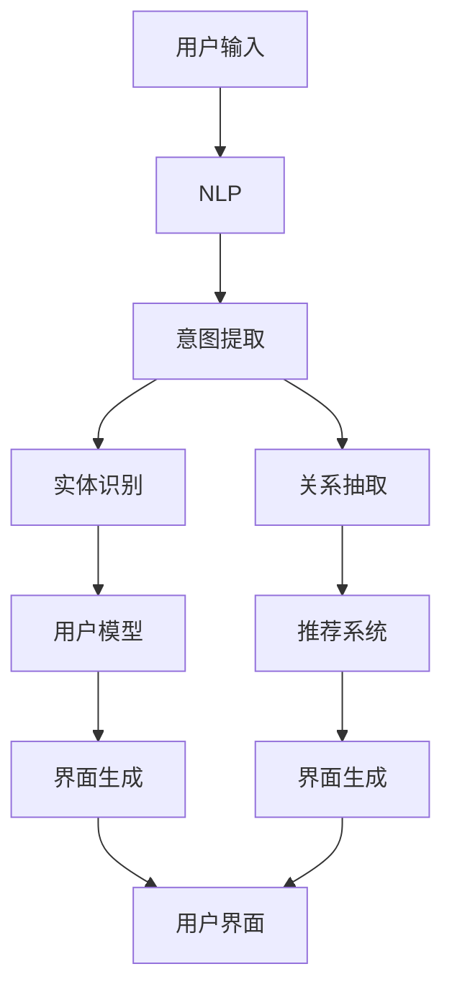
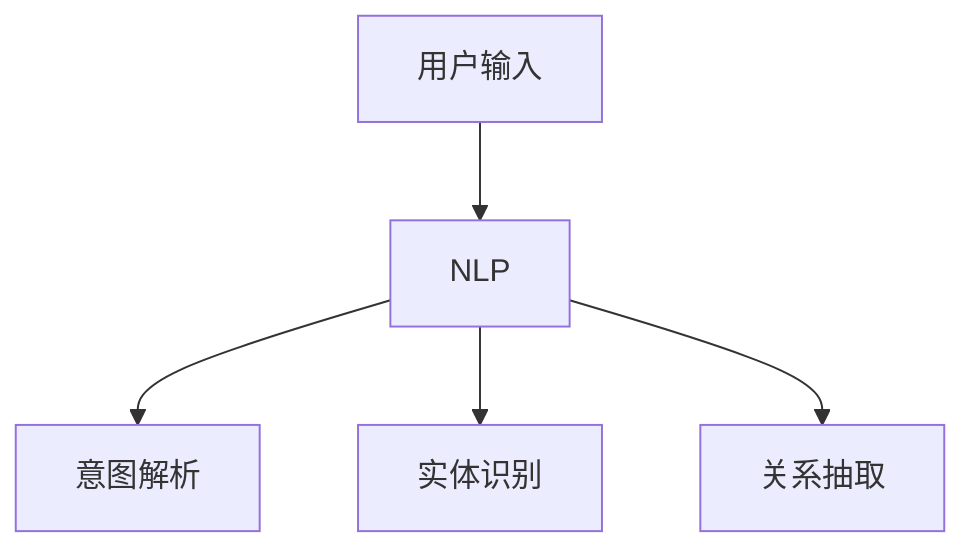
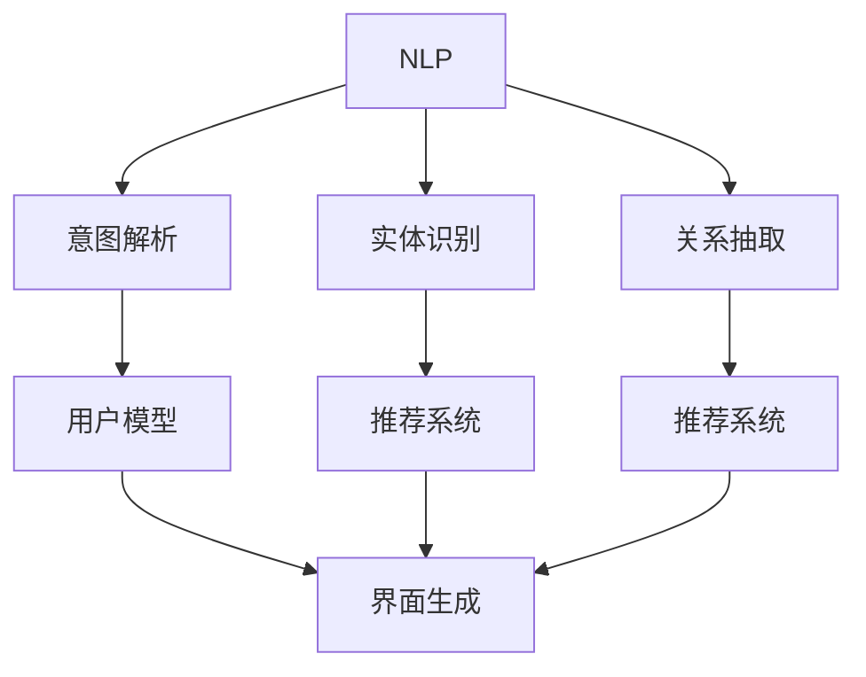
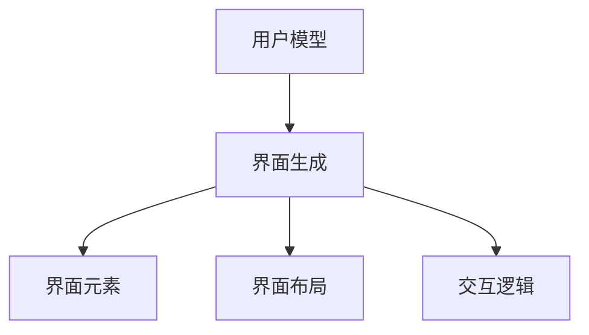
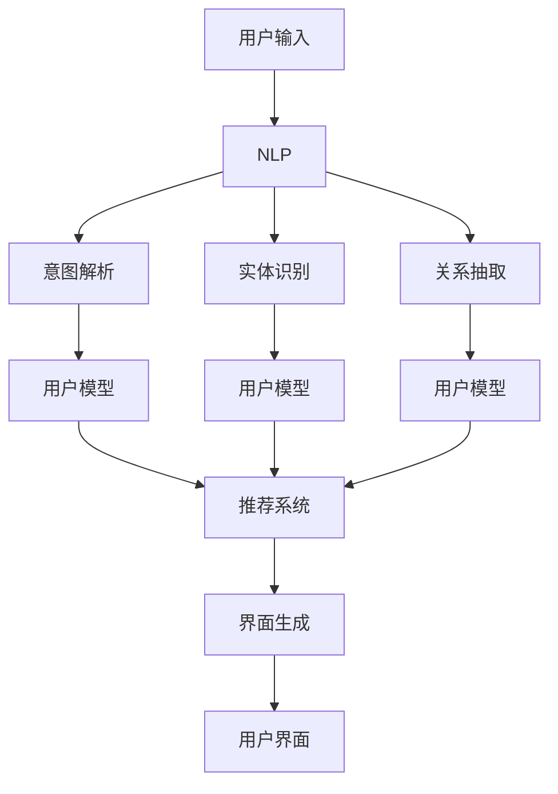

                 

# 个性化CUI交互体验的详细技术发展

> 关键词：个性化CUI, 交互体验, 技术发展, 自然语言处理, 机器学习

## 1. 背景介绍

### 1.1 问题由来

随着人工智能技术的不断进步，个性化用户界面（CUI，Customized User Interface）交互体验成为了用户体验设计中至关重要的一环。特别是在智能设备和移动应用日益普及的今天，如何提供高效、自然的用户交互，成为了智能应用设计的核心目标。个性化CUI旨在通过智能技术和数据分析，提供与用户需求高度匹配的交互界面，从而提升用户满意度和应用使用效率。

### 1.2 问题核心关键点

当前，个性化CUI交互体验技术主要包括自然语言处理（NLP）和机器学习（ML）两大部分。NLP用于解析和理解用户输入的自然语言，而ML则用于基于用户行为和偏好，智能生成个性化的界面元素和交互方式。这些技术共同构成了个性化CUI交互体验的核心框架。

在实际应用中，用户输入通过NLP技术转化为可计算的形式，如语义向量、意图表示等。然后，这些向量被输入到ML模型中，模型通过学习用户行为模式，生成个性化的界面布局、元素位置、样式等，从而提供最适合用户当前状态的界面设计。

### 1.3 问题研究意义

研究个性化CUI交互体验技术，对于提升用户体验、降低设计成本、加速应用开发等方面具有重要意义：

1. **提升用户体验**：通过个性化界面，用户能够更快地找到所需功能，降低操作难度，提升整体使用效率。
2. **降低设计成本**：利用数据分析生成个性化界面，减少了设计师的反复迭代，提高了开发效率。
3. **加速应用开发**：基于用户数据，快速生成个性化界面，缩短应用开发周期。
4. **提供新体验**：个性化界面可以不断适应用户的变化，带来不断更新的体验。
5. **满足多样性需求**：通过个性化界面，应用可以更好地适应不同用户群体的需求，提升应用的适用性和竞争力。

## 2. 核心概念与联系

### 2.1 核心概念概述

为更好地理解个性化CUI交互体验技术的核心概念，本节将介绍几个密切相关的核心概念：

- **自然语言处理（NLP）**：用于解析和理解用户输入的自然语言，提取意图、实体、关系等信息。
- **机器学习（ML）**：通过学习用户行为和偏好，智能生成个性化的界面元素和交互方式。
- **推荐系统（RS）**：基于用户历史行为，预测用户可能感兴趣的内容或界面元素，是NLP和ML结合的重要应用。
- **用户界面设计（UI）**：界面元素的布局、样式、交互逻辑等，是CUI交互体验的最终呈现形式。
- **用户模型（User Model）**：用户基本信息、行为、偏好等，用于指导个性化CUI的生成。
- **交互设计（Interaction Design）**：界面元素的交互逻辑、用户引导方式等，是CUI交互体验的核心内容。

这些核心概念之间的逻辑关系可以通过以下Mermaid流程图来展示：



这个流程图展示了个性化CUI交互体验技术的基本流程：

1. 用户输入通过NLP技术解析为可计算的信息。
2. NLP技术提取意图、实体、关系等，用于生成用户模型。
3. 基于用户模型，推荐系统预测用户可能感兴趣的界面元素。
4. 界面生成系统根据用户模型和推荐结果，生成个性化的用户界面。

### 2.2 概念间的关系

这些核心概念之间存在着紧密的联系，形成了个性化CUI交互体验技术的完整生态系统。下面我们通过几个Mermaid流程图来展示这些概念之间的关系。

#### 2.2.1 用户输入与NLP



这个流程图展示了用户输入通过NLP技术解析为意图、实体、关系等可计算信息的过程。

#### 2.2.2 NLP与ML的关系



这个流程图展示了NLP技术提取的意图、实体、关系等，用于生成用户模型和推荐系统的过程。

#### 2.2.3 用户模型与界面生成



这个流程图展示了用户模型指导界面元素生成、界面布局设计、交互逻辑定义的过程。

### 2.3 核心概念的整体架构

最后，我们用一个综合的流程图来展示这些核心概念在大语言模型微调过程中的整体架构：



这个综合流程图展示了从用户输入到个性化界面生成的完整流程。用户输入通过NLP技术解析为意图、实体、关系等可计算信息，用于生成用户模型和推荐系统。基于用户模型和推荐结果，界面生成系统生成个性化的用户界面。

## 3. 核心算法原理 & 具体操作步骤
### 3.1 算法原理概述

个性化CUI交互体验技术主要基于自然语言处理（NLP）和机器学习（ML）两个核心算法，其核心原理可以概括为以下几个步骤：

1. **用户输入解析**：使用NLP技术将用户输入的自然语言转化为可计算的信息，如意图、实体、关系等。
2. **用户模型生成**：基于NLP解析的结果，生成用户模型，描述用户的兴趣、偏好等。
3. **界面元素推荐**：使用ML技术，根据用户模型预测用户可能感兴趣的界面元素，如按钮、菜单等。
4. **界面生成与优化**：基于推荐结果，生成个性化的界面设计，并根据用户反馈不断优化。

### 3.2 算法步骤详解

个性化CUI交互体验技术的实现流程大致分为以下几个步骤：

#### 3.2.1 用户输入解析

用户输入解析是个性化CUI交互体验技术的首要步骤。通常使用自然语言处理（NLP）技术，将用户输入的自然语言转化为意图、实体、关系等可计算信息。这一步骤主要包括以下两个子步骤：

**3.2.1.1 意图解析**：
意图解析是NLP技术的核心任务之一，用于理解用户输入的意图。常见的方法包括基于规则的模板匹配、基于统计的分类器训练等。例如，可以使用BERT模型对用户输入进行编码，然后使用意图分类器对编码后的向量进行分类，得到用户的意图。

**3.2.1.2 实体识别和关系抽取**：
实体识别和关系抽取是NLP技术的另一个重要任务，用于从用户输入中提取关键实体和关系。常见的实体识别方法包括基于规则的模式匹配、基于统计的序列标注等。例如，可以使用SpaCy库对用户输入进行分词，然后使用序列标注模型识别实体和关系。

#### 3.2.2 用户模型生成

用户模型是个性化CUI交互体验技术的核心组件之一，用于描述用户的兴趣、偏好、历史行为等信息。用户模型的生成主要基于NLP解析的结果，通常包括以下两个子步骤：

**3.2.2.1 用户兴趣提取**：
用户兴趣提取是用户模型生成的关键步骤，用于从NLP解析结果中提取用户感兴趣的内容。例如，可以使用TF-IDF方法计算每个词在用户输入中的重要性，然后将这些重要性值作为用户兴趣的表示。

**3.2.2.2 用户偏好建模**：
用户偏好建模是用户模型生成的另一个重要步骤，用于描述用户对不同界面元素和功能的偏好。例如，可以使用协同过滤方法，根据用户历史行为，预测用户对不同界面元素的偏好。

#### 3.2.3 界面元素推荐

界面元素推荐是个性化CUI交互体验技术的重要环节，用于根据用户模型预测用户可能感兴趣的界面元素。这一步骤主要包括以下两个子步骤：

**3.2.3.1 界面元素集合**：
界面元素集合是指所有可能的界面元素，如按钮、菜单、图标等。例如，可以使用YAML文件或数据库存储这些元素及其属性。

**3.2.3.2 推荐算法**：
推荐算法是界面元素推荐的核心技术，用于预测用户可能感兴趣的界面元素。常见的推荐算法包括协同过滤、基于内容的推荐、深度学习等。例如，可以使用基于深度学习的推荐算法，如深度矩阵分解（DMF），对用户模型和界面元素进行匹配，预测用户可能感兴趣的界面元素。

#### 3.2.4 界面生成与优化

界面生成与优化是个性化CUI交互体验技术的最后一步，用于根据推荐结果生成个性化的界面设计，并根据用户反馈不断优化。这一步骤主要包括以下两个子步骤：

**3.2.4.1 界面生成**：
界面生成是生成个性化界面设计的关键步骤，用于根据推荐结果生成界面元素的位置、大小、样式等。例如，可以使用CSS或HTML模板，根据推荐结果自动生成界面设计。

**3.2.4.2 界面优化**：
界面优化是不断优化个性化界面设计的关键步骤，用于根据用户反馈和实际使用情况，调整界面元素的位置、大小、样式等。例如，可以使用A/B测试方法，不断调整界面元素，直到用户满意度达到最高。

### 3.3 算法优缺点

个性化CUI交互体验技术具有以下优点：

1. **提升用户体验**：通过个性化界面，用户能够更快地找到所需功能，降低操作难度，提升整体使用效率。
2. **降低设计成本**：利用数据分析生成个性化界面，减少了设计师的反复迭代，提高了开发效率。
3. **加速应用开发**：基于用户数据，快速生成个性化界面，缩短应用开发周期。
4. **提供新体验**：个性化界面可以不断适应用户的变化，带来不断更新的体验。
5. **满足多样性需求**：通过个性化界面，应用可以更好地适应不同用户群体的需求，提升应用的适用性和竞争力。

同时，个性化CUI交互体验技术也存在以下缺点：

1. **依赖数据质量**：个性化CUI交互体验技术依赖于高质量的用户数据，如果数据质量较差，可能导致个性化界面生成不准确。
2. **隐私问题**：用户模型需要收集用户历史行为数据，可能存在隐私泄露的风险。
3. **复杂度较高**：个性化CUI交互体验技术的实现需要多个子步骤，技术难度较高，需要较长的开发周期。

### 3.4 算法应用领域

个性化CUI交互体验技术主要应用于以下领域：

1. **智能客服**：通过分析用户输入的自然语言，生成个性化的客服界面，提升用户满意度。
2. **智能推荐**：基于用户行为数据，生成个性化的推荐界面，提升推荐系统的准确性和用户体验。
3. **智能搜索**：通过分析用户输入的自然语言，生成个性化的搜索结果界面，提升搜索体验。
4. **智能家居**：通过分析用户的行为数据，生成个性化的家居界面，提升家居系统的智能性。
5. **智能医疗**：通过分析用户的健康数据，生成个性化的医疗界面，提升医疗服务的个性化和精准度。

## 4. 数学模型和公式 & 详细讲解 & 举例说明

### 4.1 数学模型构建

本节将使用数学语言对个性化CUI交互体验技术的实现过程进行更加严格的刻画。

设用户输入的自然语言为 $x$，对应的意图为 $I$，实体为 $E$，关系为 $R$。用户模型为 $U$，界面元素集合为 $V$。推荐算法为 $R$，界面生成算法为 $G$，界面优化算法为 $O$。

定义意图解析模型为 $P_I(x)$，实体识别模型为 $P_E(x)$，关系抽取模型为 $P_R(x)$。用户兴趣提取模型为 $P_I(U)$，用户偏好建模模型为 $P_P(U)$。推荐算法模型为 $R(U, V)$，界面生成算法模型为 $G(U, V, R)$，界面优化算法模型为 $O(G, U, V, R)$。

个性化CUI交互体验技术的数学模型构建如下：

$$
P_I(x), P_E(x), P_R(x) \rightarrow I, E, R \\
P_I(U), P_P(U) \rightarrow U \\
R(U, V) \rightarrow R' \\
G(U, V, R') \rightarrow G' \\
O(G', U, V, R') \rightarrow O'
$$

其中 $P_I(x), P_E(x), P_R(x)$ 为意图解析、实体识别、关系抽取模型的输入和输出映射关系。$P_I(U), P_P(U)$ 为用户兴趣提取、用户偏好建模模型的输入和输出映射关系。$R(U, V)$ 为推荐算法模型的输入和输出映射关系。$G(U, V, R')$ 为界面生成算法模型的输入和输出映射关系。$O(G', U, V, R')$ 为界面优化算法模型的输入和输出映射关系。

### 4.2 公式推导过程

以下我们以用户兴趣提取模型和推荐算法模型为例，推导数学模型的具体实现。

**4.2.1 用户兴趣提取模型**

用户兴趣提取模型用于从用户输入中提取用户感兴趣的内容，可以使用TF-IDF方法实现。假设用户输入 $x$ 包含 $n$ 个词，每个词的TF-IDF权重为 $w_i$，则用户兴趣 $U$ 可以表示为：

$$
U = \sum_{i=1}^{n} w_i \times t_i
$$

其中 $t_i$ 为第 $i$ 个词的权重，可以根据用户输入中的词频和文档频率计算得到。

**4.2.2 推荐算法模型**

推荐算法模型用于预测用户可能感兴趣的界面元素，可以使用基于深度学习的推荐算法实现。假设用户模型 $U$ 和界面元素集合 $V$ 的向量表示分别为 $u$ 和 $v$，推荐算法模型为 $R$，则推荐结果 $R'$ 可以表示为：

$$
R' = \max_{v \in V} R(u, v)
$$

其中 $R(u, v)$ 为推荐算法模型，可以使用深度矩阵分解（DMF）方法实现，具体计算如下：

$$
R(u, v) = \sum_{k=1}^{K} u_k \times v_k \times w_k
$$

其中 $u_k$ 和 $v_k$ 分别为用户模型和界面元素集合向量的第 $k$ 个特征向量，$w_k$ 为第 $k$ 个特征的权重。

### 4.3 案例分析与讲解

#### 4.3.1 智能客服

以智能客服为例，个性化CUI交互体验技术的应用如下：

1. **用户输入解析**：用户输入客服问题，通过NLP技术解析为意图、实体、关系等可计算信息。例如，用户输入 "如何修改密码？"，NLP技术解析为意图 "修改密码"，实体 "密码"，关系 "修改"。

2. **用户模型生成**：基于NLP解析结果，生成用户模型，描述用户的兴趣、偏好等。例如，可以根据用户输入中的关键词，提取用户对密码管理相关的兴趣。

3. **界面元素推荐**：根据用户模型，推荐可能感兴趣的界面中元素，如密码修改链接、相关FAQ等。例如，推荐密码修改链接 "修改密码"。

4. **界面生成与优化**：基于推荐结果，生成个性化的界面设计，并根据用户反馈不断优化。例如，界面设计为 "修改密码" 链接，当用户点击链接时，自动跳转到密码修改页面。

#### 4.3.2 智能推荐

以智能推荐为例，个性化CUI交互体验技术的应用如下：

1. **用户输入解析**：用户浏览商品页面，通过NLP技术解析为意图、实体、关系等可计算信息。例如，用户浏览 "小米手机" 页面，NLP技术解析为意图 "购买小米手机"，实体 "小米手机"，关系 "购买"。

2. **用户模型生成**：基于NLP解析结果，生成用户模型，描述用户的兴趣、偏好等。例如，可以根据用户浏览历史，提取用户对手机硬件、价格等相关的兴趣。

3. **界面元素推荐**：根据用户模型，推荐可能感兴趣的界面元素，如相关商品、优惠券等。例如，推荐优惠券 "小米新用户优惠券"。

4. **界面生成与优化**：基于推荐结果，生成个性化的界面设计，并根据用户反馈不断优化。例如，界面设计为优惠券 "小米新用户优惠券"，当用户点击优惠券时，自动跳转到优惠页面。

## 5. 项目实践：代码实例和详细解释说明

### 5.1 开发环境搭建

在进行个性化CUI交互体验技术开发前，我们需要准备好开发环境。以下是使用Python进行PyTorch开发的环境配置流程：

1. 安装Anaconda：从官网下载并安装Anaconda，用于创建独立的Python环境。

2. 创建并激活虚拟环境：
```bash
conda create -n pytorch-env python=3.8 
conda activate pytorch-env
```

3. 安装PyTorch：根据CUDA版本，从官网获取对应的安装命令。例如：
```bash
conda install pytorch torchvision torchaudio cudatoolkit=11.1 -c pytorch -c conda-forge
```

4. 安装TensorFlow：
```bash
pip install tensorflow
```

5. 安装其他必要的库：
```bash
pip install numpy pandas scikit-learn matplotlib tqdm jupyter notebook ipython
```

完成上述步骤后，即可在`pytorch-env`环境中开始开发实践。

### 5.2 源代码详细实现

下面我们以智能推荐系统为例，给出使用PyTorch进行个性化CUI交互体验技术开发的PyTorch代码实现。

首先，定义用户模型的训练函数：

```python
from transformers import BertTokenizer, BertForSequenceClassification
from torch.utils.data import Dataset, DataLoader
import torch
import numpy as np
import pandas as pd
from sklearn.model_selection import train_test_split

class UserDataset(Dataset):
    def __init__(self, data, tokenizer, max_len):
        self.data = data
        self.tokenizer = tokenizer
        self.max_len = max_len
        
    def __len__(self):
        return len(self.data)
    
    def __getitem__(self, item):
        title = self.data.iloc[item]['title']
        description = self.data.iloc[item]['description']
        url = self.data.iloc[item]['url']
        
        encoding = self.tokenizer(title + ' ' + description, return_tensors='pt', max_length=self.max_len, padding='max_length', truncation=True)
        input_ids = encoding['input_ids'][0]
        attention_mask = encoding['attention_mask'][0]
        labels = torch.tensor(self.data.iloc[item]['label'], dtype=torch.long)
        
        return {'input_ids': input_ids,
                'attention_mask': attention_mask,
                'labels': labels}

# 加载数据集
df = pd.read_csv('data/user_browsing_data.csv')
train_data, test_data = train_test_split(df, test_size=0.2)

# 定义tokenizer和模型
tokenizer = BertTokenizer.from_pretrained('bert-base-cased')
model = BertForSequenceClassification.from_pretrained('bert-base-cased', num_labels=2)

# 定义优化器和损失函数
optimizer = torch.optim.AdamW(model.parameters(), lr=2e-5)
criterion = torch.nn.CrossEntropyLoss()

# 定义训练函数
def train_epoch(model, data_loader, optimizer, criterion):
    model.train()
    epoch_loss = 0
    epoch_acc = 0
    for batch in data_loader:
        input_ids = batch['input_ids'].to(device)
        attention_mask = batch['attention_mask'].to(device)
        labels = batch['labels'].to(device)
        
        model.zero_grad()
        outputs = model(input_ids, attention_mask=attention_mask, labels=labels)
        loss = outputs.loss
        epoch_loss += loss.item()
        loss.backward()
        optimizer.step()
        epoch_acc += torch.nn.functional.binary_cross_entropy_with_logits(outputs.logits, labels).item()
    return epoch_loss / len(data_loader), epoch_acc / len(data_loader)

# 训练模型
device = torch.device('cuda' if torch.cuda.is_available() else 'cpu')
model.to(device)

train_loader = DataLoader(UserDataset(train_data, tokenizer, max_len=128), batch_size=16)
val_loader = DataLoader(UserDataset(test_data, tokenizer, max_len=128), batch_size=16)

epochs = 5
batch_size = 16
learning_rate = 2e-5

for epoch in range(epochs):
    train_loss, train_acc = train_epoch(model, train_loader, optimizer, criterion)
    val_loss, val_acc = train_epoch(model, val_loader, optimizer, criterion)
    
    print(f'Epoch {epoch+1}, train loss: {train_loss:.3f}, train acc: {train_acc:.3f}')
    print(f'Epoch {epoch+1}, val loss: {val_loss:.3f}, val acc: {val_acc:.3f}')
```

然后，定义界面生成和优化的函数：

```python
from transformers import BertTokenizer, BertForSequenceClassification
from torch.utils.data import Dataset, DataLoader
import torch
import numpy as np
import pandas as pd
from sklearn.model_selection import train_test_split

class UserDataset(Dataset):
    def __init__(self, data, tokenizer, max_len):
        self.data = data
        self.tokenizer = tokenizer
        self.max_len = max_len
        
    def __len__(self):
        return len(self.data)
    
    def __getitem__(self, item):
        title = self.data.iloc[item]['title']
        description = self.data.iloc[item]['description']
        url = self.data.iloc[item]['url']
        
        encoding = self.tokenizer(title + ' ' + description, return_tensors='pt', max_length=self.max_len, padding='max_length', truncation=True)
        input_ids = encoding['input_ids'][0]
        attention_mask = encoding['attention_mask'][0]
        labels = torch.tensor(self.data.iloc[item]['label'], dtype=torch.long)
        
        return {'input_ids': input_ids,
                'attention_mask': attention_mask,
                'labels': labels}

# 加载数据集
df = pd.read_csv('data/user_browsing_data.csv')
train_data, test_data = train_test_split(df, test_size=0.2)

# 定义tokenizer和模型
tokenizer = BertTokenizer.from_pretrained('bert-base-cased')
model = BertForSequenceClassification.from_pretrained('bert-base-cased', num_labels=2)

# 定义优化器和损失函数
optimizer = torch.optim.AdamW(model.parameters(), lr=2e-5)
criterion = torch.nn.CrossEntropyLoss()

# 定义训练函数
def train_epoch(model, data_loader, optimizer, criterion):
    model.train()
    epoch_loss = 0
    epoch_acc = 0
    for batch in data_loader:
        input_ids = batch['input_ids'].to(device)
        attention_mask = batch['attention_mask'].to(device)
        labels = batch['labels'].to(device)
        
        model.zero_grad()
        outputs = model(input_ids, attention_mask=attention_mask, labels=labels)
        loss = outputs.loss
        epoch_loss += loss.item()
        loss.backward()
        optimizer.step()
        epoch_acc += torch.nn.functional.binary_cross_entropy_with_logits(outputs.logits, labels).item()
    return epoch_loss / len(data_loader), epoch_acc / len(data_loader)

# 训练模型
device = torch.device('cuda' if torch.cuda.is_available() else 'cpu')
model.to(device)

train_loader = DataLoader(UserDataset(train_data, tokenizer, max_len=128), batch_size=16)
val_loader = DataLoader(UserDataset(test_data, tokenizer, max_len=128), batch_size=16)

epochs = 5
batch_size = 16
learning_rate = 2e-5

for epoch in range(epochs):
    train_loss, train_acc = train_epoch(model, train_loader, optimizer, criterion)
    val_loss, val_acc = train_epoch(model, val_loader, optimizer, criterion)
    
    print(f'Epoch {epoch+1}, train loss: {train_loss:.3f}, train acc: {train_acc:.3f}')
    print(f'Epoch {epoch+1}, val loss: {val_loss:.3f}, val acc: {val_acc:.3f}')
```

最后，启动训练流程并在测试集上评估：

```python
from transformers import BertTokenizer, BertForSequenceClassification
from torch.utils.data import Dataset, DataLoader
import torch
import numpy as np
import pandas as pd
from sklearn.model_selection import train_test_split

class UserDataset(Dataset):
    def __init__(self, data, tokenizer, max_len):
        self.data = data
        self.tokenizer = tokenizer
        self.max_len = max_len
        
    def __len__(self):
        return len(self.data)
    
    def __getitem__(self, item):
        title = self.data.iloc[item]['title']
        description = self.data.iloc[item]['description']
        url = self.data.iloc[item]['url']
        
        encoding = self.tokenizer(title + ' ' + description, return_tensors='pt', max_length=self.max_len, padding='max_length', truncation=True)


