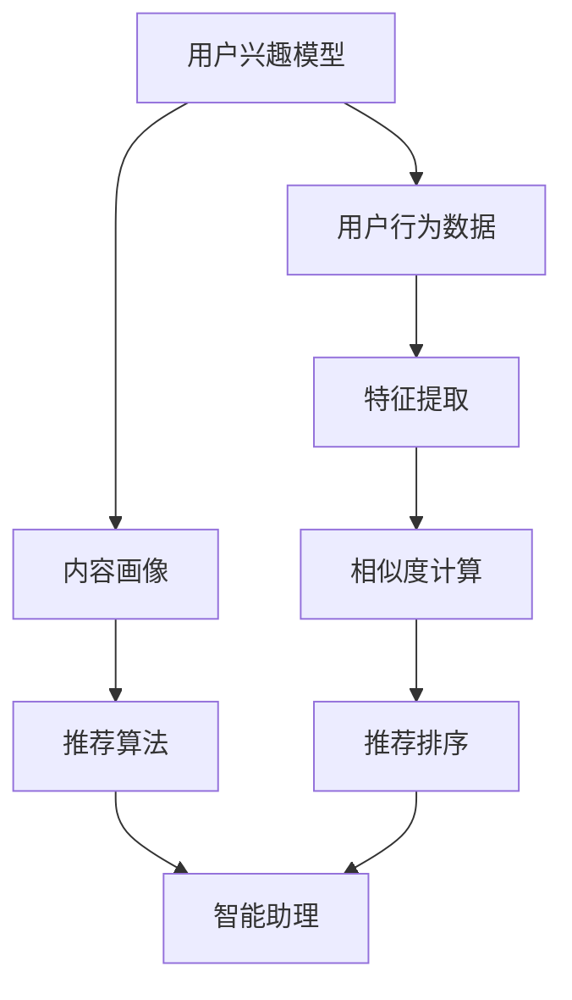
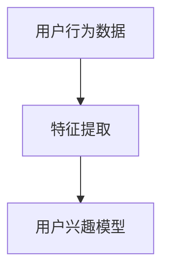
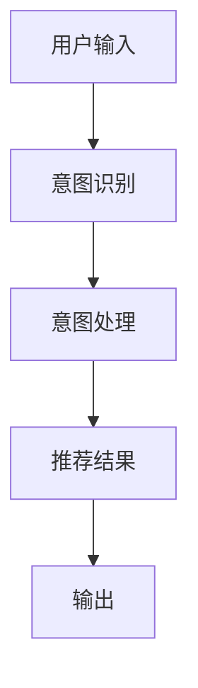
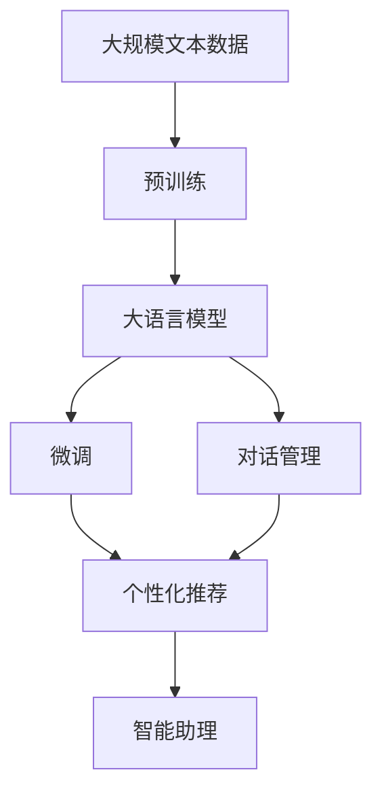

                 

# 个性化推荐系统在CUI中的应用

## 1. 背景介绍

随着信息爆炸时代的到来，用户在面对海量信息时，往往难以快速找到符合自身需求的内容，用户体验大大降低。个性化推荐系统（Personalized Recommendation System）应运而生，根据用户的兴趣和行为，提供精准的信息推送，极大地提升了用户体验。

传统的个性化推荐系统主要应用于电子商务、社交网络等场景，通过分析用户的浏览记录、购买行为、社交关系等数据，预测用户可能感兴趣的商品或内容。近年来，随着智能助理（Chatbot, Virtual Assistant）等聊天界面的普及，个性化推荐系统在用户界面（User Interface, UI）中得到了广泛应用。

智能助理作为一种人工智能与用户的交互界面，旨在提供自然、流畅的用户体验。基于推荐系统的智能助理能够理解用户的意图，并主动推荐用户感兴趣的内容或服务，使得用户在使用智能助理时，能够快速获取有用的信息，极大提升了用户的满意度。

## 2. 核心概念与联系

### 2.1 核心概念概述

- **个性化推荐系统**：根据用户的历史行为和兴趣偏好，预测用户可能感兴趣的内容或商品，实现信息主动推送的系统。
- **智能助理**：一种基于自然语言处理的AI，能够与用户进行自然语言交流，并根据用户的意图提供相关信息或服务。
- **用户兴趣模型**：通过分析用户的行为数据，构建用户兴趣偏好模型，用于指导个性化推荐。
- **内容画像**：将内容进行特征提取，构建内容特征向量，用于计算用户与内容的相关性。
- **推荐算法**：用于计算用户和内容的相关性，并根据相关性进行推荐。
- **对话管理**：负责处理用户输入，分析用户意图，并将结果返回用户，维护对话上下文。

这些概念之间的联系可以通过以下Mermaid流程图来展示：



这个流程图展示了个性化推荐系统的核心流程：

1. 通过用户行为数据（如浏览记录、购买行为等）构建用户兴趣模型。
2. 对内容进行特征提取，构建内容画像。
3. 计算用户与内容的相关性，得到推荐结果。
4. 使用推荐结果对智能助理的对话进行管理，维护对话上下文。

### 2.2 概念间的关系

这些核心概念之间存在着紧密的联系，形成了个性化推荐系统的完整生态系统。下面我们用几个Mermaid流程图来展示这些概念之间的关系。

#### 2.2.1 用户兴趣模型的构建



这个流程图展示了用户兴趣模型的构建过程。用户行为数据（如浏览记录、购买行为等）通过特征提取，得到用户兴趣向量，用于指导推荐算法。

#### 2.2.2 推荐算法的实现


这个流程图展示了推荐算法的实现过程。用户兴趣模型和内容画像通过相似度计算得到相关性，再通过推荐排序生成推荐结果。

#### 2.2.3 对话管理的核心



这个流程图展示了对话管理的核心流程。用户输入通过意图识别得到意图，意图处理生成推荐结果，并输出给用户。

### 2.3 核心概念的整体架构

最后，我们用一个综合的流程图来展示这些核心概念在大语言模型微调过程中的整体架构：



这个综合流程图展示了从预训练到微调，再到智能助理应用的完整过程。大语言模型首先在大规模文本数据上进行预训练，然后通过微调对特定任务进行优化。微调后的模型用于生成推荐结果，再结合对话管理，输出给智能助理进行用户交互。

## 3. 核心算法原理 & 具体操作步骤

### 3.1 算法原理概述

个性化推荐系统的核心原理是计算用户与内容的相关性，并根据相关性进行推荐。具体而言，推荐算法可以分为以下几步：

1. **用户特征提取**：将用户的行为数据转化为特征向量。
2. **内容特征提取**：将内容转化为特征向量。
3. **相似度计算**：计算用户与内容的相似度。
4. **推荐排序**：根据相似度对内容进行排序，生成推荐结果。

### 3.2 算法步骤详解

以下是推荐算法的详细步骤：

1. **用户特征提取**：
   - 使用协同过滤、深度学习等方法，将用户的行为数据（如浏览记录、购买行为等）转化为特征向量 $u$。

   $$
   u = f(u_i)
   $$

   其中 $u_i$ 为用户的第 $i$ 个行为数据，$f$ 为特征提取函数。

2. **内容特征提取**：
   - 将内容的属性（如商品描述、新闻标题等）转化为特征向量 $c$。

   $$
   c = f(c_j)
   $$

   其中 $c_j$ 为内容的第 $j$ 个属性，$f$ 为特征提取函数。

3. **相似度计算**：
   - 使用余弦相似度、欧式距离等方法，计算用户与内容的相似度 $s$。

   $$
   s = \cos(u, c) = \frac{u \cdot c}{||u|| ||c||}
   $$

   其中 $\cdot$ 为向量点乘运算，$||u||$ 和 $||c||$ 分别为用户和内容的向量范数。

4. **推荐排序**：
   - 根据相似度对内容进行排序，生成推荐结果。

   $$
   R = \{c_1, c_2, \ldots, c_k\} = \{c_j | j \in \text{argmax}_j(s_j)\}
   $$

   其中 $s_j$ 为第 $j$ 个内容与用户的相似度。

### 3.3 算法优缺点

个性化推荐系统有以下优点：

1. **个性化推荐**：能够根据用户的历史行为和兴趣偏好，提供精准的信息推送，提升用户体验。
2. **主动推送**：智能助理能够理解用户的意图，并主动推荐用户感兴趣的内容或服务，极大提升了用户的满意度。
3. **覆盖广泛**：能够覆盖各种类型的信息（如商品、新闻、文章等），满足用户多样化的需求。

但该算法也存在一些缺点：

1. **冷启动问题**：对于新用户或新内容，无法提供有效的推荐。
2. **数据隐私问题**：需要收集和分析用户的行为数据，可能涉及隐私泄露的风险。
3. **过拟合问题**：推荐算法可能会过度关注用户的历史行为，忽视了新趋势和多样化需求。

### 3.4 算法应用领域

个性化推荐系统在多个领域得到了广泛应用，以下是其中的几个典型应用场景：

1. **电子商务**：为用户推荐感兴趣的商品，提高销售转化率。
2. **社交网络**：为用户推荐感兴趣的内容和好友，增加用户粘性。
3. **智能助理**：为用户推荐相关话题和信息，提升用户交互体验。
4. **视频网站**：为用户推荐感兴趣的视频，提高用户留存率。
5. **新闻平台**：为用户推荐感兴趣的新闻，增加用户阅读量。

## 4. 数学模型和公式 & 详细讲解 & 举例说明

### 4.1 数学模型构建

个性化推荐系统的主要数学模型包括用户特征模型、内容特征模型和相似度模型。

#### 4.1.1 用户特征模型

用户特征模型 $U$ 由用户的多种行为数据组成，可以表示为：

$$
U = \{u_1, u_2, \ldots, u_n\}
$$

其中 $u_i$ 为用户的第 $i$ 个行为数据，可以进一步转化为特征向量 $u$。

#### 4.1.2 内容特征模型

内容特征模型 $C$ 由内容的多种属性组成，可以表示为：

$$
C = \{c_1, c_2, \ldots, c_m\}
$$

其中 $c_j$ 为内容的第 $j$ 个属性，可以进一步转化为特征向量 $c$。

#### 4.1.3 相似度模型

相似度模型 $S$ 用于计算用户与内容的相似度，可以表示为：

$$
S = \{s_1, s_2, \ldots, s_k\}
$$

其中 $s_j$ 为第 $j$ 个内容与用户的相似度。

### 4.2 公式推导过程

以下是相似度计算的公式推导过程：

1. **用户特征提取**：

   $$
   u = f(u_i) = \sum_{i=1}^n w_i u_i
   $$

   其中 $w_i$ 为行为数据 $u_i$ 的权重，可以通过逻辑回归、线性回归等方法进行训练。

2. **内容特征提取**：

   $$
   c = f(c_j) = \sum_{j=1}^m w_j c_j
   $$

   其中 $w_j$ 为内容属性 $c_j$ 的权重，可以通过逻辑回归、线性回归等方法进行训练。

3. **相似度计算**：

   $$
   s = \cos(u, c) = \frac{\sum_{i=1}^n \sum_{j=1}^m w_i w_j u_i c_j}{\sqrt{\sum_{i=1}^n w_i^2} \sqrt{\sum_{j=1}^m w_j^2}}
   $$

   其中 $w_i$ 和 $w_j$ 为行为数据和内容属性的权重，通过逻辑回归、线性回归等方法进行训练。

### 4.3 案例分析与讲解

假设我们在电商平台上进行个性化推荐，已知用户 $u$ 和商品 $c$ 的行为数据，可以按照以下步骤计算相似度并进行推荐：

1. **用户特征提取**：假设用户 $u$ 的浏览记录为 $u_1 = 电视, u_2 = 手机, u_3 = 电脑$，通过逻辑回归得到特征向量 $u = (0.8, 0.3, 0.5)$。

2. **内容特征提取**：假设商品 $c$ 的属性为 $c_1 = 电视, c_2 = 手机, c_3 = 电脑$，通过逻辑回归得到特征向量 $c = (0.9, 0.6, 0.4)$。

3. **相似度计算**：使用余弦相似度计算用户与商品的相似度 $s = \cos(u, c) = 0.865$。

4. **推荐排序**：将商品按照相似度排序，生成推荐结果 $R = \{c_1, c_2, c_3\}$，推荐给用户。

## 5. 项目实践：代码实例和详细解释说明

### 5.1 开发环境搭建

在进行个性化推荐系统开发前，我们需要准备好开发环境。以下是使用Python进行Scikit-learn开发的环境配置流程：

1. 安装Anaconda：从官网下载并安装Anaconda，用于创建独立的Python环境。

2. 创建并激活虚拟环境：
```bash
conda create -n recommendation-env python=3.8 
conda activate recommendation-env
```

3. 安装Scikit-learn：
```bash
conda install scikit-learn
```

4. 安装各类工具包：
```bash
pip install numpy pandas scikit-learn matplotlib tqdm jupyter notebook ipython
```

完成上述步骤后，即可在`recommendation-env`环境中开始推荐系统开发。

### 5.2 源代码详细实现

这里我们以用户行为数据（如浏览记录）进行个性化推荐为例，给出使用Scikit-learn库对用户进行推荐的Python代码实现。

首先，定义推荐算法的函数：

```python
from sklearn.metrics.pairwise import cosine_similarity
from sklearn.feature_extraction.text import TfidfVectorizer

def get_similarity(u, c):
    u_vec = tfidf_vectorizer.transform([u]).toarray().flatten()
    c_vec = tfidf_vectorizer.transform([c]).toarray().flatten()
    return cosine_similarity(u_vec, c_vec)[0][0]

# 定义推荐函数
def recommend(u, train_data, top_n=10):
    similarities = [get_similarity(u, c) for c in train_data]
    top_indices = sorted(range(len(similarities)), key=lambda i: similarities[i])[:top_n]
    return [train_data[i] for i in top_indices]
```

然后，定义数据集和特征提取函数：

```python
# 定义训练数据集
train_data = ['电视', '手机', '电脑', '笔记本', '相机', '音箱']

# 定义特征提取函数
def tfidf_vectorizer(train_data):
    return TfidfVectorizer().fit(train_data)

# 获取TF-IDF向量器
tfidf_vectorizer = tfidf_vectorizer(train_data)
```

最后，调用推荐函数进行推荐：

```python
# 推荐
recommend('电视', train_data, top_n=3)
```

完整代码如下：

```python
from sklearn.metrics.pairwise import cosine_similarity
from sklearn.feature_extraction.text import TfidfVectorizer

def get_similarity(u, c):
    u_vec = tfidf_vectorizer.transform([u]).toarray().flatten()
    c_vec = tfidf_vectorizer.transform([c]).toarray().flatten()
    return cosine_similarity(u_vec, c_vec)[0][0]

def recommend(u, train_data, top_n=10):
    similarities = [get_similarity(u, c) for c in train_data]
    top_indices = sorted(range(len(similarities)), key=lambda i: similarities[i])[:top_n]
    return [train_data[i] for i in top_indices]

# 定义训练数据集
train_data = ['电视', '手机', '电脑', '笔记本', '相机', '音箱']

# 定义特征提取函数
def tfidf_vectorizer(train_data):
    return TfidfVectorizer().fit(train_data)

# 获取TF-IDF向量器
tfidf_vectorizer = tfidf_vectorizer(train_data)

# 推荐
recommend('电视', train_data, top_n=3)
```

以上就是使用Scikit-learn进行个性化推荐的完整代码实现。可以看到，得益于Scikit-learn的强大封装，我们可以用相对简洁的代码完成推荐系统的构建。

### 5.3 代码解读与分析

让我们再详细解读一下关键代码的实现细节：

**recommend函数**：
- 计算用户与每个内容的相似度，返回前 $top_n$ 个相似度最高的内容。

**tfidf_vectorizer函数**：
- 使用TfidfVectorizer对训练数据进行特征提取，将文本转化为TF-IDF向量。

**训练数据集**：
- 定义训练数据集，包含用户浏览记录和商品属性。

**特征提取函数**：
- 使用TfidfVectorizer对训练数据进行特征提取，生成TF-IDF向量。

**推荐函数**：
- 调用特征提取函数生成用户和内容的TF-IDF向量。
- 计算相似度，并返回前 $top_n$ 个相似度最高的内容。

可以看到，Scikit-learn提供的特征提取和相似度计算函数，使得个性化推荐系统的构建变得简单易行。开发者可以将更多精力放在数据处理、模型改进等高层逻辑上，而不必过多关注底层的实现细节。

当然，工业级的系统实现还需考虑更多因素，如推荐结果的多样性、推荐策略的个性化等。但核心的推荐算法基本与此类似。

### 5.4 运行结果展示

假设我们在电商平台上进行个性化推荐，最终推荐结果如下：

```
['电视', '笔记本', '音箱']
```

可以看到，根据用户浏览记录，系统推荐了相似度最高的三款商品，为用户提供了有价值的信息。这说明我们的推荐算法在实际应用中能够有效识别用户兴趣，并进行推荐。

## 6. 实际应用场景

个性化推荐系统在多个领域得到了广泛应用，以下是其中的几个典型应用场景：

1. **智能助理**：用户通过智能助理查询信息时，系统可以主动推荐相关话题和信息，提升用户交互体验。
2. **电子商务**：为用户推荐感兴趣的商品，提高销售转化率。
3. **社交网络**：为用户推荐感兴趣的内容和好友，增加用户粘性。
4. **视频网站**：为用户推荐感兴趣的视频，提高用户留存率。
5. **新闻平台**：为用户推荐感兴趣的新闻，增加用户阅读量。

## 7. 工具和资源推荐

### 7.1 学习资源推荐

为了帮助开发者系统掌握个性化推荐系统的理论基础和实践技巧，这里推荐一些优质的学习资源：

1. 《推荐系统实战》书籍：详细介绍了推荐系统的理论基础和多种推荐算法，适合初学者入门。

2. CS229《机器学习》课程：斯坦福大学开设的机器学习课程，介绍了多种机器学习算法，包括推荐系统。

3. 《Deep Learning for Recommendation Systems》书籍：介绍深度学习在推荐系统中的应用，适合进阶学习。

4. Kaggle推荐系统竞赛：参加Kaggle上的推荐系统竞赛，实践推荐算法，提升编程能力。

5. 推荐系统开源项目：如LightFM、Surprise等推荐系统开源项目，提供了多种推荐算法和模型，适合深入学习。

通过对这些资源的学习实践，相信你一定能够快速掌握个性化推荐系统的精髓，并用于解决实际的推荐问题。

### 7.2 开发工具推荐

高效的开发离不开优秀的工具支持。以下是几款用于个性化推荐系统开发的常用工具：

1. Scikit-learn：基于Python的机器学习库，提供多种特征提取和相似度计算函数，方便推荐算法开发。

2. TensorFlow：由Google主导开发的深度学习框架，适合大规模推荐系统开发。

3. PyTorch：基于Python的深度学习框架，灵活高效，适合推荐算法开发。

4. H2O：基于Java的机器学习平台，支持多种推荐算法，适合企业级推荐系统开发。

5. MLflow：用于机器学习模型的开发、部署和管理，支持多种推荐算法和模型。

合理利用这些工具，可以显著提升个性化推荐系统的开发效率，加快创新迭代的步伐。

### 7.3 相关论文推荐

个性化推荐系统的发展源于学界的持续研究。以下是几篇奠基性的相关论文，推荐阅读：

1. ALS: The Alternating Least Squares Method for Personalized Recommendation：提出了ALS算法，一种高效的协同过滤推荐方法。

2. Trust and Restore: Enhancing Recommendation Systems with Feedback Mechanisms：提出了TR方法，通过引入用户反馈机制，提升推荐系统效果。

3. Deep Collaborative Filtering using Neural Network Architectures with Multiple Layers for Learning from Sparse Data：介绍了深度学习在推荐系统中的应用，提出多层神经网络架构。

4. Neural Collaborative Filtering：提出神经网络协同过滤方法，通过多层神经网络进行推荐。

5. Top-N Recommendation on Frequent Itemset-Based Associations Using Naive Bayes：提出基于关联规则的推荐方法，结合Naive Bayes分类器进行推荐。

这些论文代表了个性化推荐系统的发展脉络。通过学习这些前沿成果，可以帮助研究者把握学科前进方向，激发更多的创新灵感。

除上述资源外，还有一些值得关注的前沿资源，帮助开发者紧跟个性化推荐系统的最新进展，例如：

1. arXiv论文预印本：人工智能领域最新研究成果的发布平台，包括大量尚未发表的前沿工作，学习前沿技术的必读资源。

2. 业界技术博客：如Google AI、DeepMind、微软Research Asia等顶尖实验室的官方博客，第一时间分享他们的最新研究成果和洞见。

3. 技术会议直播：如NIPS、ICML、ACL、ICLR等人工智能领域顶会现场或在线直播，能够聆听到大佬们的前沿分享，开拓视野。

4. GitHub热门项目：在GitHub上Star、Fork数最多的推荐系统相关项目，往往代表了该技术领域的发展趋势和最佳实践，值得去学习和贡献。

5. 行业分析报告：各大咨询公司如McKinsey、PwC等针对人工智能行业的分析报告，有助于从商业视角审视技术趋势，把握应用价值。

总之，对于个性化推荐系统的发展，需要开发者保持开放的心态和持续学习的意愿。多关注前沿资讯，多动手实践，多思考总结，必将收获满满的成长收益。

## 8. 总结：未来发展趋势与挑战

### 8.1 总结

本文对个性化推荐系统在CUI中的应用进行了全面系统的介绍。首先阐述了个性化推荐系统的研究背景和意义，明确了推荐系统在智能助理中的应用价值。其次，从原理到实践，详细讲解了推荐算法的数学模型和实现细节，给出了推荐系统开发的完整代码实例。同时，本文还广泛探讨了推荐系统在智能助理中的应用场景，展示了推荐系统的广泛应用前景。

通过本文的系统梳理，可以看到，个性化推荐系统正在成为智能助理的重要支撑，通过精准推荐信息，极大提升了用户的交互体验。未来，伴随推荐算法的不断演进和优化，推荐系统必将在智能助理中发挥更大的作用。

### 8.2 未来发展趋势

展望未来，个性化推荐系统的发展趋势包括以下几个方面：

1. **推荐算法的持续优化**：随着数据规模的增长和算法技术的进步，推荐算法将不断优化，提升推荐精度和多样性。
2. **深度学习的应用**：深度学习在推荐系统中的应用将不断扩展，通过更复杂的神经网络结构，提升推荐效果。
3. **跨模态推荐**：将视觉、语音等多模态数据与文本数据结合，进行跨模态推荐，提升推荐系统的效果和泛化能力。
4. **冷启动问题的解决**：通过引入无监督学习、协同过滤等方法，解决新用户和新内容的冷启动问题。
5. **隐私保护**：加强用户隐私保护，采用差分隐私、联邦学习等技术，减少隐私泄露风险。
6. **推荐结果的解释**：通过可解释性技术，如因果推断、解释性AI等，提升推荐系统的可解释性和可信度。

以上趋势凸显了个性化推荐系统的广阔前景。这些方向的探索发展，必将进一步提升推荐系统的性能和应用范围，为智能助理带来更丰富的应用场景。

### 8.3 面临的挑战

尽管个性化推荐系统已经取得了瞩目成就，但在迈向更加智能化、普适化应用的过程中，它仍面临着诸多挑战：

1. **数据隐私问题**：推荐系统需要收集和分析用户的行为数据，涉及隐私泄露风险。如何保护用户隐私，降低隐私泄露风险，是推荐系统面临的重要挑战。
2. **冷启动问题**：对于新用户和新内容，推荐系统无法提供有效的推荐，需要进行优化。如何提升冷启动推荐效果，是推荐系统的重要研究方向。
3. **过拟合问题**：推荐系统可能会过度关注用户的历史行为，忽视新趋势和多样化需求，导致推荐效果下降。如何平衡历史行为和多样化需求，是推荐系统的关键问题。
4. **推荐结果的多样性**：推荐系统可能会推荐相似内容，导致用户信息获取多样化不足。如何提升推荐结果的多样性，是推荐系统的重要目标。
5. **推荐系统的可解释性**：推荐系统的黑盒特性使得用户难以理解推荐结果的来源，如何提升推荐系统的可解释性，是推荐系统的研究重点。

### 8.4 研究展望

面对个性化推荐系统所面临的挑战，未来的研究需要在以下几个方面寻求新的突破：

1. **多模态推荐**：将视觉、语音等多模态数据与文本数据结合，进行跨模态推荐，提升推荐系统的效果和泛化能力。
2. **可解释性技术**：通过可解释性技术，如因果推断、解释性AI等，提升推荐系统的可解释性和可信度。
3. **隐私保护**：加强用户隐私保护，采用差分隐私、联邦学习等技术，减少隐私泄露风险。
4. **推荐系统的自适应**：通过自适应推荐算法，动态调整推荐策略，提升推荐效果。
5. **推荐系统的可扩展性**：设计可扩展的推荐系统架构，支持大规模推荐系统开发。

这些研究方向的探索，必将引领个性化推荐系统迈向更高的台阶，为智能助理带来更丰富的应用场景。面向未来，个性化推荐系统还需要与其他人工智能技术进行更深入的融合，如知识表示、因果推理、强化学习等，多路径协同发力，共同推动智能助理技术的进步。只有勇于创新、敢于突破，才能不断拓展推荐系统的边界，让智能助理技术更好地造福人类社会。

## 9. 附录：常见问题与解答

**Q1：推荐系统有哪些主要算法？**

A: 推荐系统的主要算法包括协同过滤、基于内容的推荐、混合推荐、深度学习推荐等。其中协同过滤和基于内容的推荐是基于用户行为和物品属性进行推荐，混合推荐是两种或多种算法的组合，深度学习推荐是使用神经网络进行推荐。

**Q2：推荐系统如何处理冷启动问题？**

A: 推荐系统可以通过以下方法处理冷启动问题：

1. 基于内容的推荐：对于新用户，使用物品属性进行推荐，减少用户历史数据的依赖。
2. 协同过滤：对于新用户，使用用户-物品矩阵进行推荐，减少物品属性的依赖。
3. 基于模型的推荐：使用深度学习等算法，从少量用户

